# [sketch-a-day](https://abav.lugaralgum.com/sketch-a-day)

#### one visual idea a day

---

## 2018 | [2019](2019.md) | [2020](2020.md) | [2021](README.md) 

---


367: [code](https://github.com/villares/sketch-a-day/tree/master/2018/s367) [[Py.Processing](https://villares.github.io/como-instalar-o-processing-modo-python/index-EN)]


---

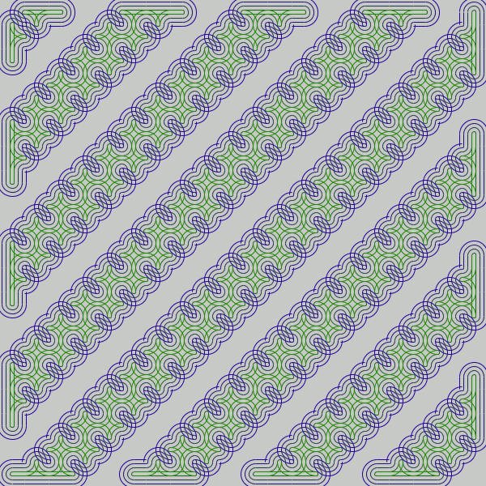

366: [code](https://github.com/villares/sketch-a-day/tree/master/2018/s366) [[Py.Processing](https://villares.github.io/como-instalar-o-processing-modo-python/index-EN)]


---

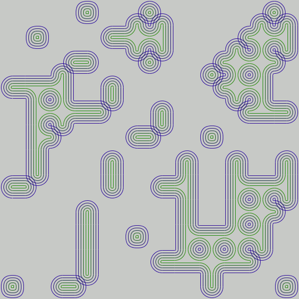

365: [code](https://github.com/villares/sketch-a-day/tree/master/2018/s365) [[Py.Processing](https://villares.github.io/como-instalar-o-processing-modo-python/index-EN)]

---

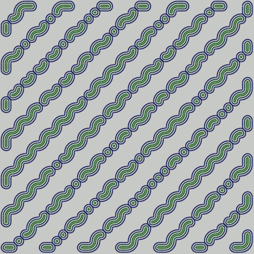

364: [code](https://github.com/villares/sketch-a-day/tree/master/2018/s364) [[Py.Processing](https://villares.github.io/como-instalar-o-processing-modo-python/index-EN)]


---

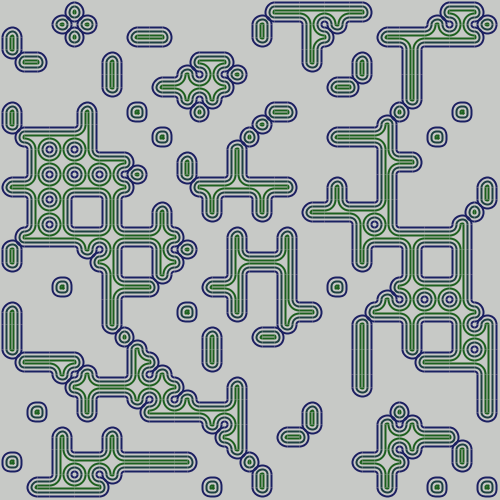

363: [code](https://github.com/villares/sketch-a-day/tree/master/2018/s363) [[Py.Processing](https://villares.github.io/como-instalar-o-processing-modo-python/index-EN)]

---


362: [code](https://github.com/villares/sketch-a-day/tree/master/2018/s362) [[Py.Processing](https://villares.github.io/como-instalar-o-processing-modo-python/index-EN)]

---


361: [code](https://github.com/villares/sketch-a-day/tree/master/2018/s361) [[Py.Processing](https://villares.github.io/como-instalar-o-processing-modo-python/index-EN)]

---

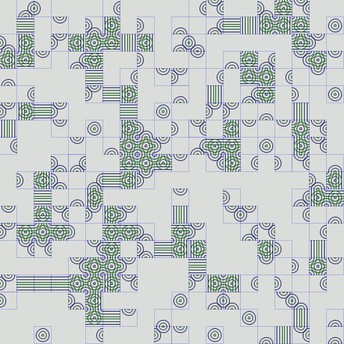

360: [code](https://github.com/villares/sketch-a-day/tree/master/2018/s360) [[Py.Processing](https://villares.github.io/como-instalar-o-processing-modo-python/index-EN)]

---

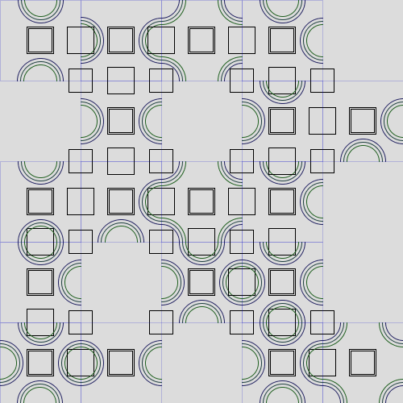

359: [code](https://github.com/villares/sketch-a-day/tree/master/2018/s359) [[Py.Processing](https://villares.github.io/como-instalar-o-processing-modo-python/index-EN)]


---


358: [code](https://github.com/villares/sketch-a-day/tree/master/2018/s358) [[Py.Processing](https://villares.github.io/como-instalar-o-processing-modo-python/index-EN)]


... in preparation for something...

---        
        
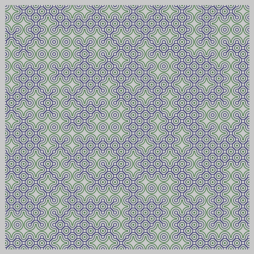

357: [code](https://github.com/villares/sketch-a-day/tree/master/2018/s357) [[Py.Processing](https://villares.github.io/como-instalar-o-processing-modo-python/index-EN)]

Back to ideas from 322...

---        
        


356: [code](https://github.com/villares/sketch-a-day/tree/master/2018/s356) [[Py.Processing](https://villares.github.io/como-instalar-o-processing-modo-python/index-EN)]


---


355: [code](https://github.com/villares/sketch-a-day/tree/master/2018/s35) [[Py.Processing](https://villares.github.io/como-instalar-o-processing-modo-python/index-EN)]

---        
        
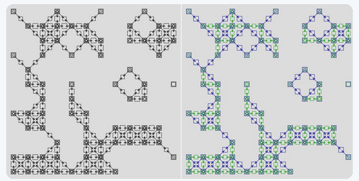

354: [code](https://github.com/villares/sketch-a-day/tree/master/2018/s354) [[Py.Processing](https://villares.github.io/como-instalar-o-processing-modo-python/index-EN)]

---        
        


353: [code](https://github.com/villares/sketch-a-day/tree/master/2018/s353) [[Py.Processing](https://villares.github.io/como-instalar-o-processing-modo-python/index-EN)]

---        
        


352: [code](https://github.com/villares/sketch-a-day/tree/master/2018/s352) [[Py.Processing](https://villares.github.io/como-instalar-o-processing-modo-python/index-EN)]

---        
        
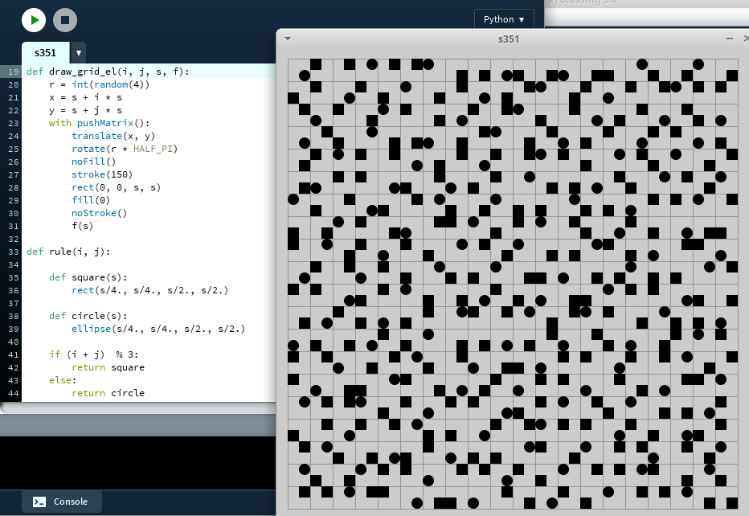

351: [code](https://github.com/villares/sketch-a-day/tree/master/2018/s351) [[Py.Processing](https://villares.github.io/como-instalar-o-processing-modo-python/index-EN)]

---        
        
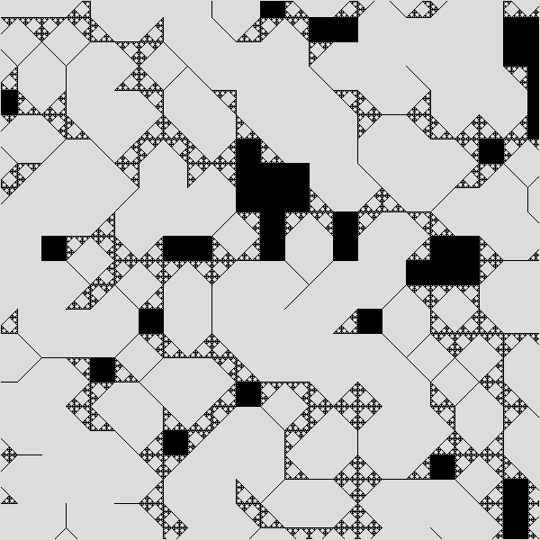

350: [code](https://github.com/villares/sketch-a-day/tree/master/2018/s350) [[Py.Processing](https://villares.github.io/como-instalar-o-processing-modo-python/index-EN)]

---        
        


349: [code](https://github.com/villares/sketch-a-day/tree/master/2018/s349) [[Py.Processing](https://villares.github.io/como-instalar-o-processing-modo-python/index-EN)]

---        
        


348: [code](https://github.com/villares/sketch-a-day/tree/master/2018/s348) [[Py.Processing](https://villares.github.io/como-instalar-o-processing-modo-python/index-EN)]


---        
        


347: [code](https://github.com/villares/sketch-a-day/tree/master/2018/s348) [[Py.Processing](https://villares.github.io/como-instalar-o-processing-modo-python/index-EN)]

---

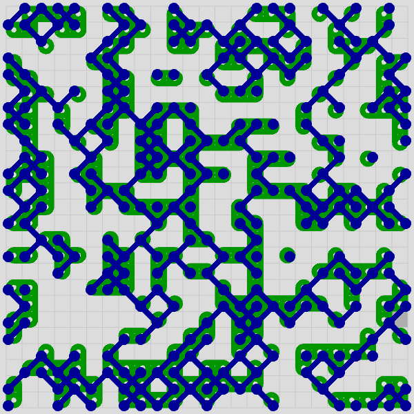

346: [code](https://github.com/villares/sketch-a-day/tree/master/2018/s344) [[Py.Processing](https://villares.github.io/como-instalar-o-processing-modo-python/index-EN)]

---


345: [code](https://github.com/villares/sketch-a-day/tree/master/2018/s345) [[Py.Processing](https://villares.github.io/como-instalar-o-processing-modo-python/index-EN)]

---


344: [code](https://github.com/villares/sketch-a-day/tree/master/2018/s344) [[Py.Processing](https://villares.github.io/como-instalar-o-processing-modo-python/index-EN)]

---

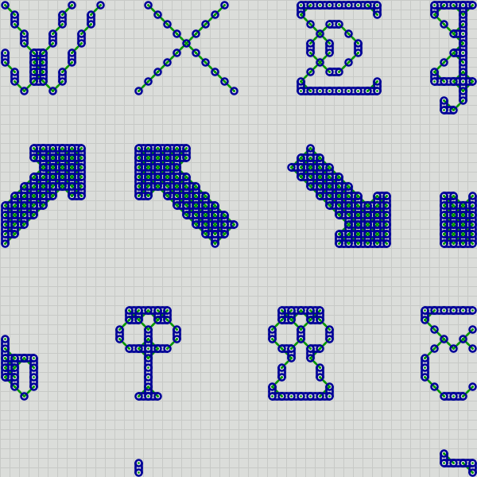

343: [code](https://github.com/villares/sketch-a-day/tree/master/2018/s343) [[Py.Processing](https://villares.github.io/como-instalar-o-processing-modo-python/index-EN)]


---


342: [code](https://github.com/villares/sketch-a-day/tree/master/2018/s342) [[Py.Processing](https://villares.github.io/como-instalar-o-processing-modo-python/index-EN)]


---


341: [code](https://github.com/villares/sketch-a-day/tree/master/2018/s341) [[Py.Processing](https://villares.github.io/como-instalar-o-processing-modo-python/index-EN)]


---


340: [code](https://github.com/villares/sketch-a-day/tree/master/2018/s340) [[Py.Processing](https://villares.github.io/como-instalar-o-processing-modo-python/index-EN)]


---
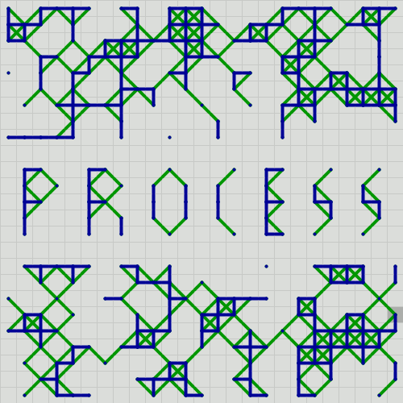

339: [code](https://github.com/villares/sketch-a-day/tree/master/2018/s339) [[Py.Processing](https://villares.github.io/como-instalar-o-processing-modo-python/index-EN)]


---

338: [code](https://github.com/villares/sketch-a-day/tree/master/2018/s338) [[Py.Processing](https://villares.github.io/como-instalar-o-processing-modo-python/index-EN)]


---
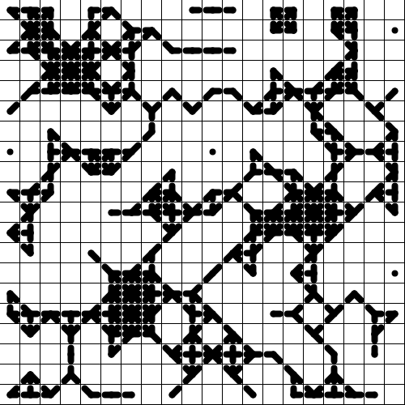

337: [code](https://github.com/villares/sketch-a-day/tree/master/2018/s337) [[Py.Processing](https://villares.github.io/como-instalar-o-processing-modo-python/index-EN)]


---
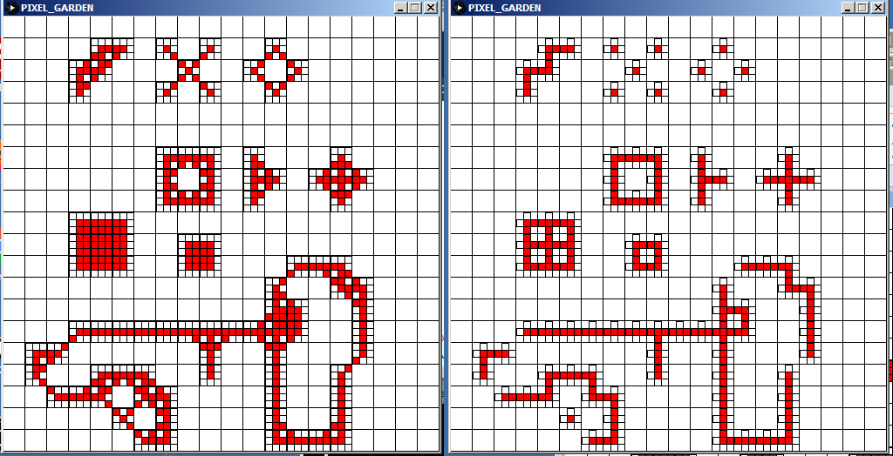

336: [code](https://github.com/villares/sketch-a-day/tree/master/2018/s336) [[Py.Processing](https://villares.github.io/como-instalar-o-processing-modo-python/index-EN)]


---


335: [code](https://github.com/villares/sketch-a-day/tree/master/2018/s335) [[Py.Processing](https://villares.github.io/como-instalar-o-processing-modo-python/index-EN)]


---
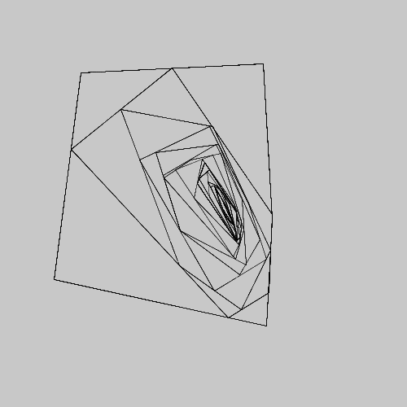

334: [code](https://github.com/villares/sketch-a-day/tree/master/2018/s334) [[Py.Processing](https://villares.github.io/como-instalar-o-processing-modo-python/index-EN)]


---


333: [code](https://github.com/villares/sketch-a-day/tree/master/2018/s333) [[Py.Processing](https://villares.github.io/como-instalar-o-processing-modo-python/index-EN)]


---

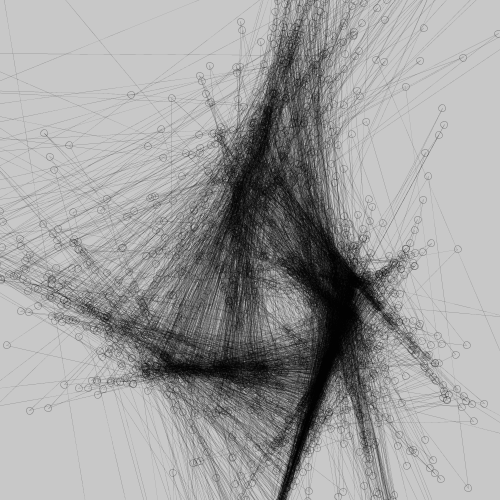

332: [code](https://github.com/villares/sketch-a-day/tree/master/2018/s332) [[Py.Processing](https://villares.github.io/como-instalar-o-processing-modo-python/index-EN)]


---


331: [code](https://github.com/villares/sketch-a-day/tree/master/2018/s331) [[Py.Processing](https://villares.github.io/como-instalar-o-processing-modo-python/index-EN)]

---

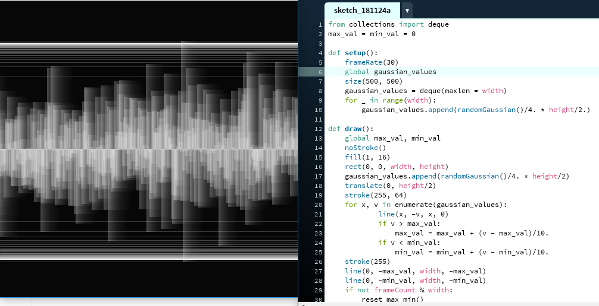

330: [code](https://github.com/villares/sketch-a-day/tree/master/2018/s330) [[Py.Processing](https://villares.github.io/como-instalar-o-processing-modo-python/index-EN)]

---

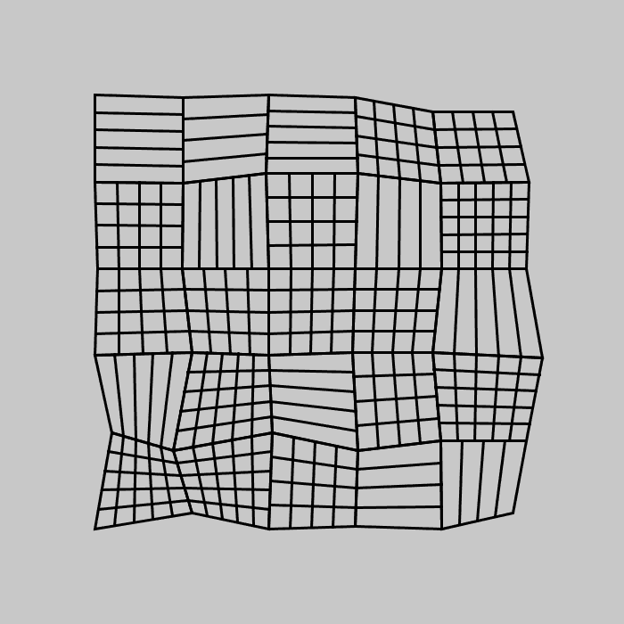

329: [code](https://github.com/villares/sketch-a-day/tree/master/2018/s329) [[Py.Processing](https://villares.github.io/como-instalar-o-processing-modo-python/index-EN)]

---

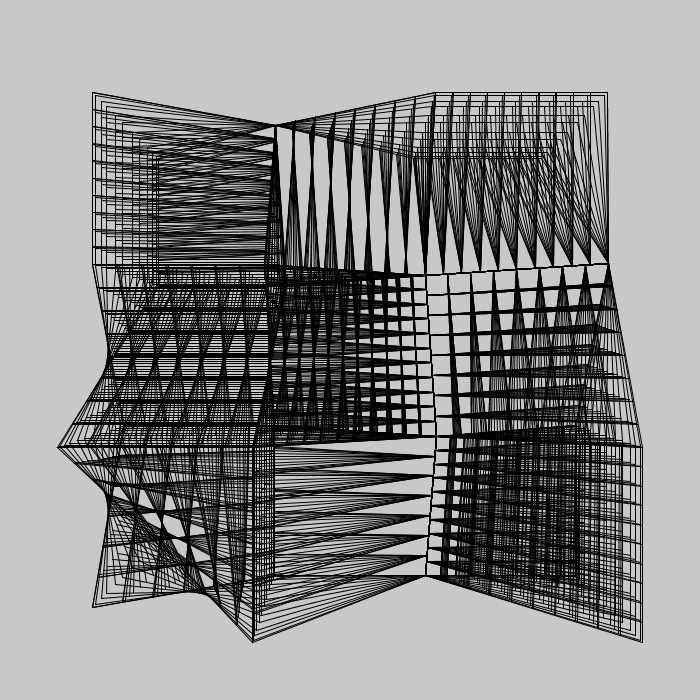

328: [code](https://github.com/villares/sketch-a-day/tree/master/2018/s328) [[Py.Processing](https://villares.github.io/como-instalar-o-processing-modo-python/index-EN)]

---


327: [code](https://github.com/villares/sketch-a-day/tree/master/2018/s327) [[Py.Processing](https://villares.github.io/como-instalar-o-processing-modo-python/index-EN)]

---


326: [code](https://github.com/villares/sketch-a-day/tree/master/2018/s326) [[Py.Processing](https://villares.github.io/como-instalar-o-processing-modo-python/index-EN)]

---


325: [code](https://github.com/villares/sketch-a-day/tree/master/2018/s325) [[Py.Processing](https://villares.github.io/como-instalar-o-processing-modo-python/index-EN)]


---

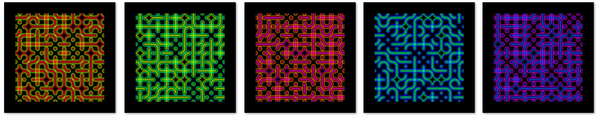

324: [code](https://github.com/villares/sketch-a-day/tree/master/2018/s324) [[Py.Processing](https://villares.github.io/como-instalar-o-processing-modo-python/index-EN)]

---


323: [code](https://github.com/villares/sketch-a-day/tree/master/2018/s323) [[Py.Processing](https://villares.github.io/como-instalar-o-processing-modo-python/index-EN)]

---


322: [code](https://github.com/villares/sketch-a-day/tree/master/2018/s322) [[Py.Processing](https://villares.github.io/como-instalar-o-processing-modo-python/index-EN)]

---


321: [code](https://github.com/villares/sketch-a-day/tree/master/2018/s321) [[Py.Processing](https://villares.github.io/como-instalar-o-processing-modo-python/index-EN)]

---


320: [code](https://github.com/villares/sketch-a-day/tree/master/2018/s320) [[Py.Processing](https://villares.github.io/como-instalar-o-processing-modo-python/index-EN)]

---


319: [code](https://github.com/villares/sketch-a-day/tree/master/2018/s319) [[Py.Processing](https://villares.github.io/como-instalar-o-processing-modo-python/index-EN)]

---


318: [code](https://github.com/villares/sketch-a-day/tree/master/2018/s318) [[Py.Processing](https://villares.github.io/como-instalar-o-processing-modo-python/index-EN)]

---

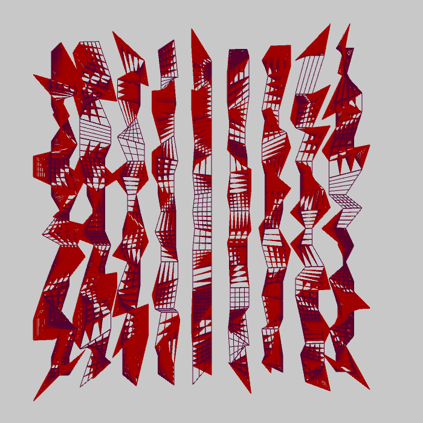

317: [code](https://github.com/villares/sketch-a-day/tree/master/2018/s317) [[Py.Processing](https://villares.github.io/como-instalar-o-processing-modo-python/index-EN)]

---


316: [code](https://github.com/villares/sketch-a-day/tree/master/2018/s316) [[Py.Processing](https://villares.github.io/como-instalar-o-processing-modo-python/index-EN)]

A 3D take on 314

---


315: [GIF](2018/s315/s315.gif) [code](https://github.com/villares/sketch-a-day/tree/master/2018/s315) [[Py.Processing](https://villares.github.io/como-instalar-o-processing-modo-python/index-EN)]

Horizontaly connected 314

---


314: [code](https://github.com/villares/sketch-a-day/tree/master/2018/s314) [[Py.Processing](https://villares.github.io/como-instalar-o-processing-modo-python/index-EN)]

Isolating elements from 313

---

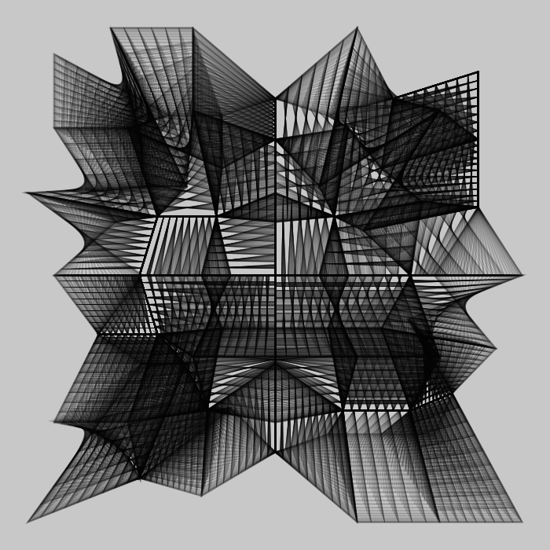

313: [code](https://github.com/villares/sketch-a-day/tree/master/2018/s313) [[Py.Processing](https://villares.github.io/como-instalar-o-processing-modo-python/index-EN)]

---


312: [code](https://github.com/villares/sketch-a-day/tree/master/2018/s312) [[Py.Processing](https://villares.github.io/como-instalar-o-processing-modo-python/index-EN)]

---


311: [code](https://github.com/villares/sketch-a-day/tree/master/2018/s311) [[Py.Processing](https://villares.github.io/como-instalar-o-processing-modo-python/index-EN)]

---


310: [code](https://github.com/villares/sketch-a-day/tree/master/2018/s310) [[Py.Processing](https://villares.github.io/como-instalar-o-processing-modo-python/index-EN)]

---


309: [code](https://github.com/villares/sketch-a-day/tree/master/2018/s309) [[Py.Processing](https://villares.github.io/como-instalar-o-processing-modo-python/index-EN)]

---


308: [code](https://github.com/villares/sketch-a-day/tree/master/2018/s308) [[Py.Processing](https://villares.github.io/como-instalar-o-processing-modo-python/index-EN)]

---

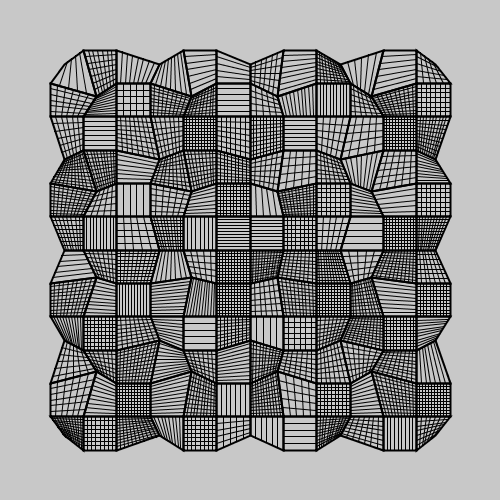

307: [code](https://github.com/villares/sketch-a-day/tree/master/2018/s307) [[Py.Processing](https://villares.github.io/como-instalar-o-processing-modo-python/index-EN)]

---


306: [code](https://github.com/villares/sketch-a-day/tree/master/2018/s306) [[Py.Processing](https://villares.github.io/como-instalar-o-processing-modo-python/index-EN)]

---

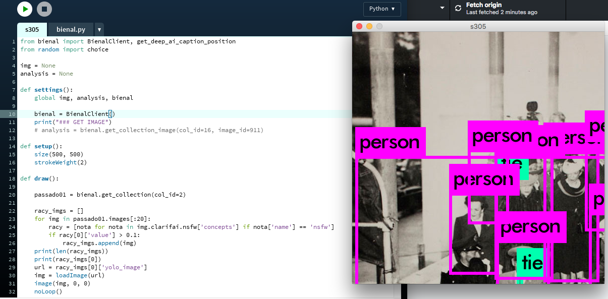

305: [code](https://github.com/villares/sketch-a-day/tree/master/2018/s305) [[Py.Processing](https://villares.github.io/como-instalar-o-processing-modo-python/index-EN)]

---

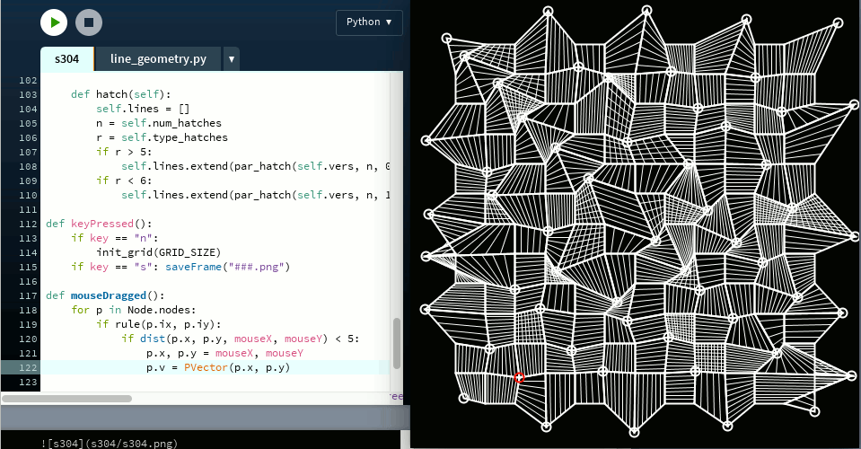

304: [code](https://github.com/villares/sketch-a-day/tree/master/2018/s304) [[Py.Processing](https://villares.github.io/como-instalar-o-processing-modo-python/index-EN)]

---


303: [code](https://github.com/villares/sketch-a-day/tree/master/2018/s303) [[Py.Processing](https://villares.github.io/como-instalar-o-processing-modo-python/index-EN)]

---


302: [code](https://github.com/villares/sketch-a-day/tree/master/2018/s302) [[Py.Processing](https://villares.github.io/como-instalar-o-processing-modo-python/index-EN)]

Hatches parallel to opposed sides. 

---

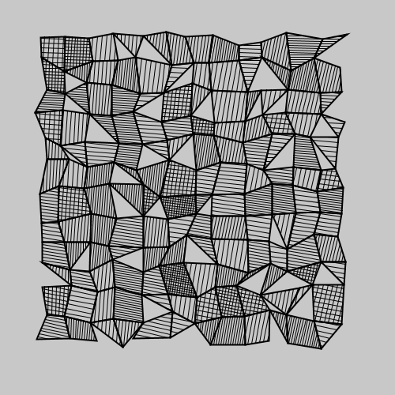

301: [code](https://github.com/villares/sketch-a-day/tree/master/2018/s301) [[Py.Processing](https://villares.github.io/como-instalar-o-processing-modo-python/index-EN)]

Tried to supress some vertices from the hatch grid.

---


300: [code](https://github.com/villares/sketch-a-day/tree/master/2018/s300) [[Py.Processing](https://villares.github.io/como-instalar-o-processing-modo-python/index-EN)]

Cross hatch and, a simplified "cell" polygon drawing and selective non-random verticies (if pos % 3 == 0)

---


299: [code](https://github.com/villares/sketch-a-day/tree/master/2018/s299) [[Py.Processing](https://villares.github.io/como-instalar-o-processing-modo-python/index-EN)]

Inclined hatches

---


298: [code](https://github.com/villares/sketch-a-day/tree/master/2018/s298) [[Py.Processing](https://villares.github.io/como-instalar-o-processing-modo-python/index-EN)]

First hatch attempt on a random "cell" grid. Each cell has 4 "node" vertices

---

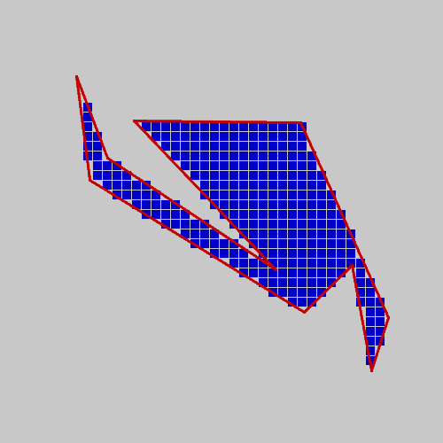

297: [code](https://github.com/villares/sketch-a-day/tree/master/2018/s297) [[Py.Processing](https://villares.github.io/como-instalar-o-processing-modo-python/index-EN)]

Changed my internal point grid to "pixels"

---


296: [code](https://github.com/villares/sketch-a-day/tree/master/2018/s296) [[Py.Processing](https://villares.github.io/como-instalar-o-processing-modo-python/index-EN)]


Demo of how the "inside poly" test works from from my lines intersecting poly function.


---

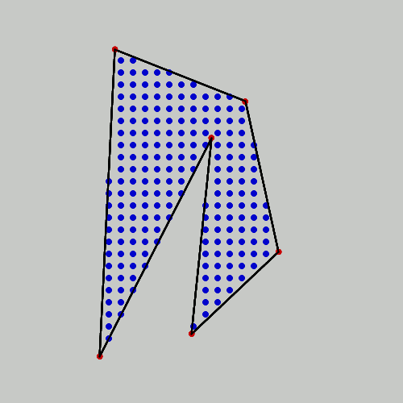

295: [code](https://github.com/villares/sketch-a-day/tree/master/2018/s295) [[Py.Processing](https://villares.github.io/como-instalar-o-processing-modo-python/index-EN)]

Testing if a point is inside a poly to make a grid/retucule.
Advancing from my lines intersecting poly function.

---

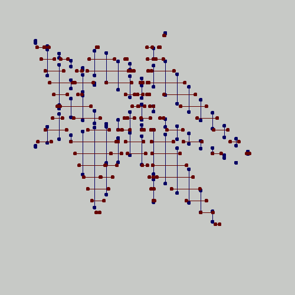

294: [code](https://github.com/villares/sketch-a-day/tree/master/2018/s294) [[Py.Processing](https://villares.github.io/como-instalar-o-processing-modo-python/index-EN)]

Playing with my code for lines intersecting polygons.

---

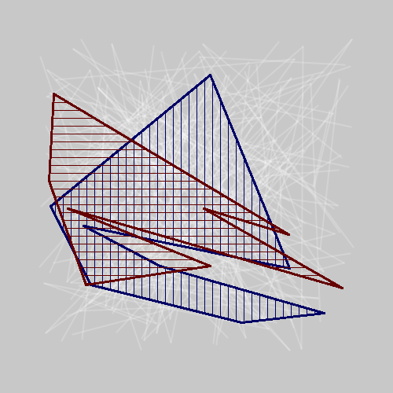

293: [code](https://github.com/villares/sketch-a-day/tree/master/2018/s293) [[Py.Processing](https://villares.github.io/como-instalar-o-processing-modo-python/index-EN)]

The polygons now are non-self-intersecting, and the hatches are kept inside :)
White lines in the background are from discarded random polys that self-intersected.

---

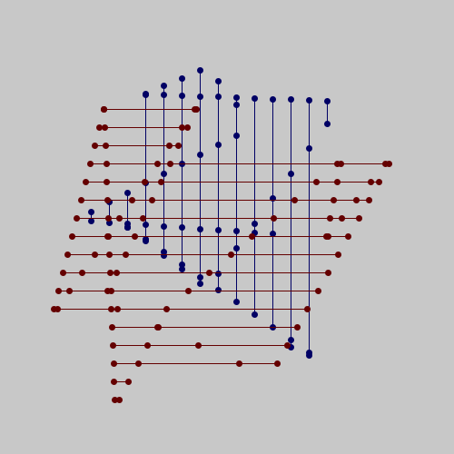

292: [code](https://github.com/villares/sketch-a-day/tree/master/2018/s292) [[Py.Processing](https://villares.github.io/como-instalar-o-processing-modo-python/index-EN)]


---


291: [code](https://github.com/villares/sketch-a-day/tree/master/2018/s291) [[Py.Processing](https://villares.github.io/como-instalar-o-processing-modo-python/index-EN)]

---

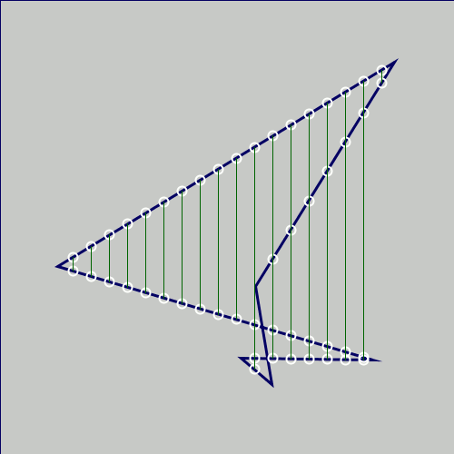

290: [code](https://github.com/villares/sketch-a-day/tree/master/2018/s290) [[Py.Processing](https://villares.github.io/como-instalar-o-processing-modo-python/index-EN)]

---

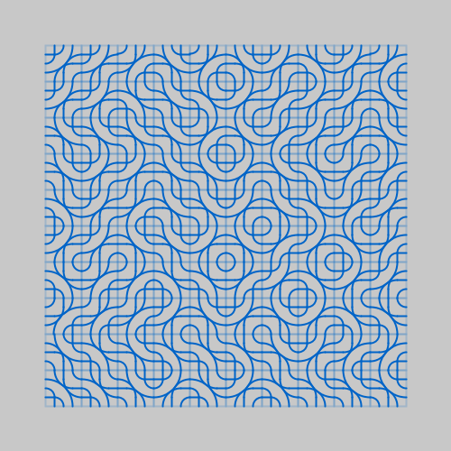

289: [code](https://github.com/villares/sketch-a-day/tree/master/2018/s289) [[Py.Processing](https://villares.github.io/como-instalar-o-processing-modo-python/index-EN)]

True arcs and lines

---

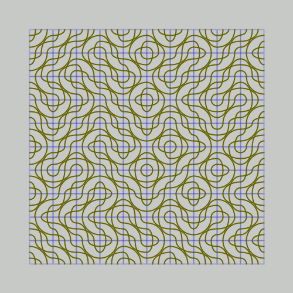

288: [code](https://github.com/villares/sketch-a-day/tree/master/2018/s288) [[Py.Processing](https://villares.github.io/como-instalar-o-processing-modo-python/index-EN)]

Ellipse arcs

---


287: [code](https://github.com/villares/sketch-a-day/tree/master/2018/s287) [[Py.Processing](https://villares.github.io/como-instalar-o-processing-modo-python/index-EN)]

---

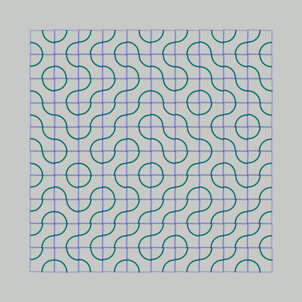

286: [code](https://github.com/villares/sketch-a-day/tree/master/2018/s286) [[Py.Processing](https://villares.github.io/como-instalar-o-processing-modo-python/index-EN)]

---

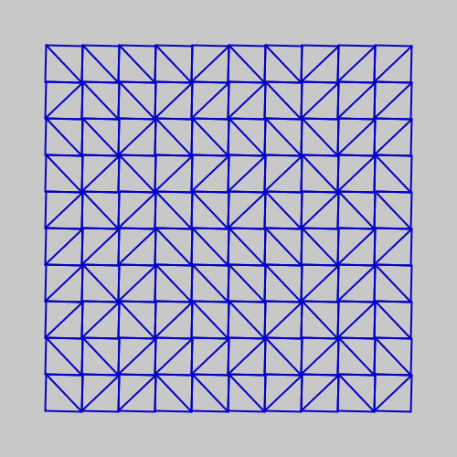

285: [code](https://github.com/villares/sketch-a-day/tree/master/2018/s285) [[Py.Processing](https://villares.github.io/como-instalar-o-processing-modo-python/index-EN)]

---

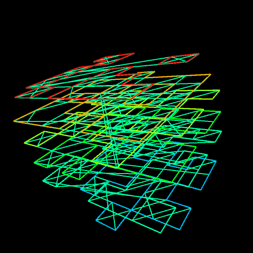

284: [code](https://github.com/villares/sketch-a-day/tree/master/2018/s284) [[Py.Processing](https://villares.github.io/como-instalar-o-processing-modo-python/index-EN)]

---


283: [code](https://github.com/villares/sketch-a-day/tree/master/2018/s283) [[Py.Processing](https://villares.github.io/como-instalar-o-processing-modo-python/index-EN)]

---


282: [code](https://github.com/villares/sketch-a-day/tree/master/2018/s282) [[Py.Processing](https://villares.github.io/como-instalar-o-processing-modo-python/index-EN)]

First attempt at joining rectangular cells into bigger polygonal faces.

---


281: [code](https://github.com/villares/sketch-a-day/tree/master/2018/s281) [[Py.Processing](https://villares.github.io/como-instalar-o-processing-modo-python/index-EN)]

---


280: [code](https://github.com/villares/sketch-a-day/tree/master/2018/s280) [[Py.Processing](https://villares.github.io/como-instalar-o-processing-modo-python/index-EN)]

---


279: [code](https://github.com/villares/sketch-a-day/tree/master/2018/s279) [[Py.Processing](https://villares.github.io/como-instalar-o-processing-modo-python/index-EN)]

---


278: [code](https://github.com/villares/sketch-a-day/tree/master/2018/s278) [[Py.Processing](https://villares.github.io/como-instalar-o-processing-modo-python/index-EN)]

---

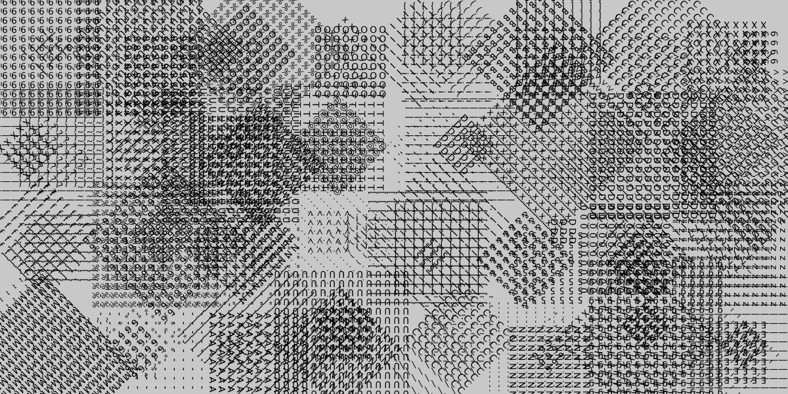

277: [code](https://github.com/villares/sketch-a-day/tree/master/2018/s277) [[Py.Processing](https://villares.github.io/como-instalar-o-processing-modo-python/index-EN)]

---


276: [code](https://github.com/villares/sketch-a-day/tree/master/2018/s276) [[Py.Processing](https://villares.github.io/como-instalar-o-processing-modo-python/index-EN)]

---


275: [code](https://github.com/villares/sketch-a-day/tree/master/2018/s275) [[Py.Processing](https://villares.github.io/como-instalar-o-processing-modo-python/index-EN)]

---

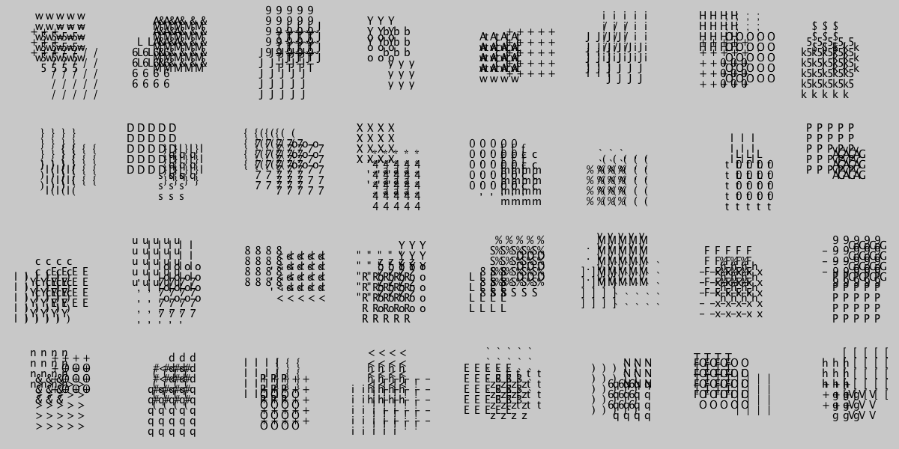

274: [code](https://github.com/villares/sketch-a-day/tree/master/2018/s274) [[Py.Processing](https://villares.github.io/como-instalar-o-processing-modo-python/index-EN)]

---

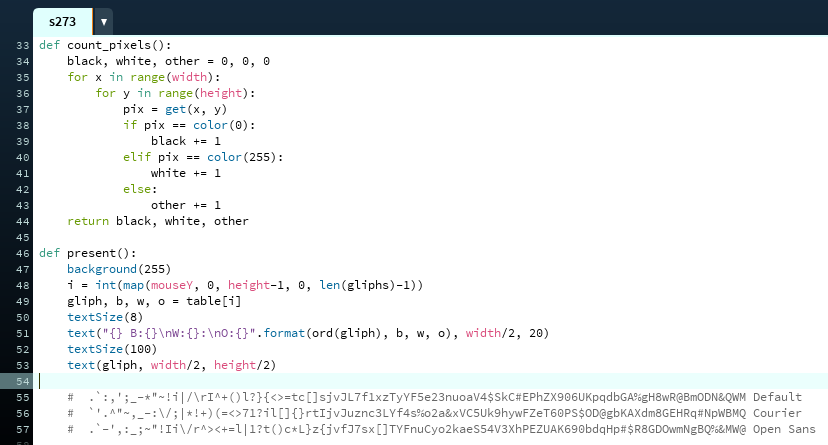

273: [code](https://github.com/villares/sketch-a-day/tree/master/2018/s273) [[Py.Processing](https://villares.github.io/como-instalar-o-processing-modo-python/index-EN)]

This sorts a gliph sequence from lighter to darker

---


272: [code](https://github.com/villares/sketch-a-day/tree/master/2018/s272) [[Py.Processing](https://villares.github.io/como-instalar-o-processing-modo-python/index-EN)]

---


271: [code](https://github.com/villares/sketch-a-day/tree/master/2018/s271) [[Py.Processing](https://villares.github.io/como-instalar-o-processing-modo-python/index-EN)]

---


270: [code](https://github.com/villares/sketch-a-day/tree/master/2018/s270) [[Py.Processing](https://villares.github.io/como-instalar-o-processing-modo-python/index-EN)]

---

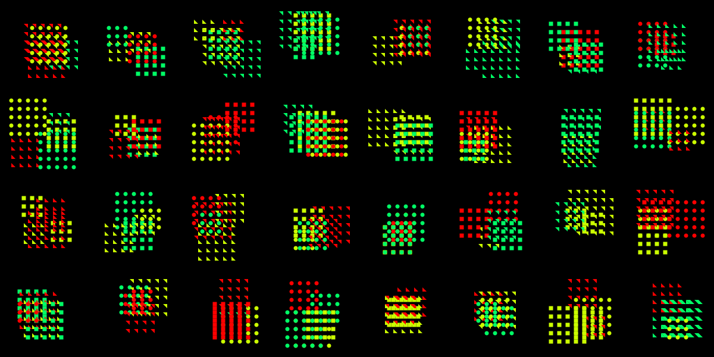

269: [code](https://github.com/villares/sketch-a-day/tree/master/2018/s269) [[Py.Processing](https://villares.github.io/como-instalar-o-processing-modo-python/index-EN)]

---

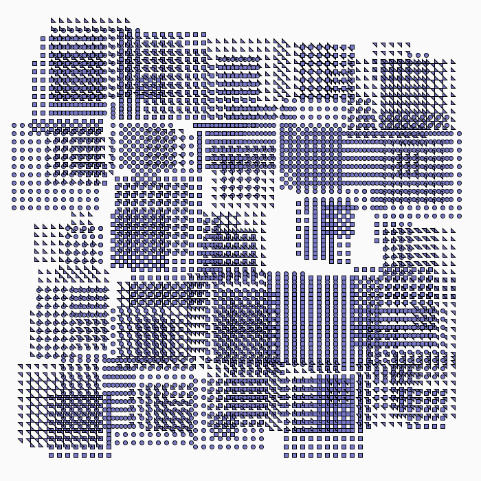

268: [code](https://github.com/villares/sketch-a-day/tree/master/2018/s268)[[Py.Processing](https://villares.github.io/como-instalar-o-processing-modo-python/index-EN)] & 
[code](https://github.com/villares/sketch-a-day/blob/master/2018/s268_pygame/s268_pygame.py)[[Pygame](https://wwwpygame.org)]

---

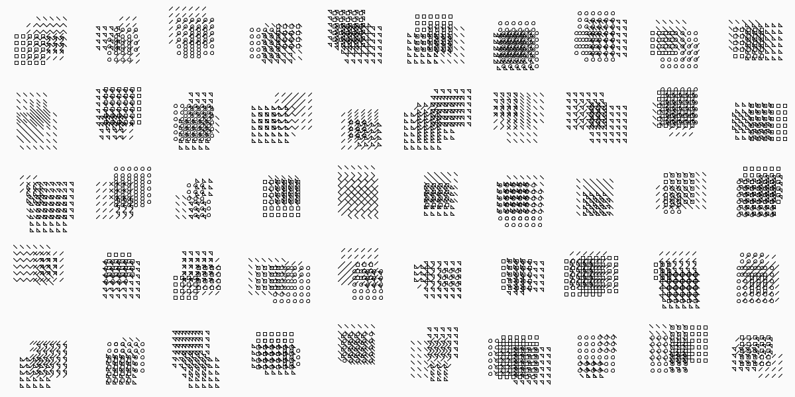
267: [code](https://github.com/villares/sketch-a-day/tree/master/2018/s267) [[Py.Processing](https://villares.github.io/como-instalar-o-processing-modo-python/index-EN)]

---

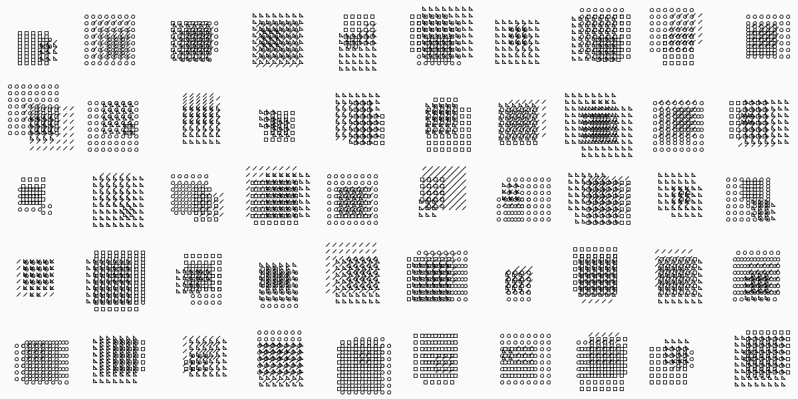
266: [code](https://github.com/villares/sketch-a-day/tree/master/2018/s266) [[Py.Processing](https://villares.github.io/como-instalar-o-processing-modo-python/index-EN)]

---


265: [code](https://github.com/villares/sketch-a-day/tree/master/2018/s265) [[Py.Processing](https://villares.github.io/como-instalar-o-processing-modo-python/index-EN)]

---

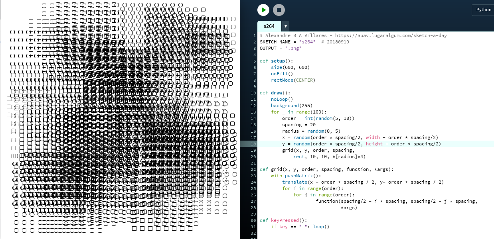
264: [code](https://github.com/villares/sketch-a-day/tree/master/2018/s264) [[Py.Processing](https://villares.github.io/como-instalar-o-processing-modo-python/index-EN)]

---

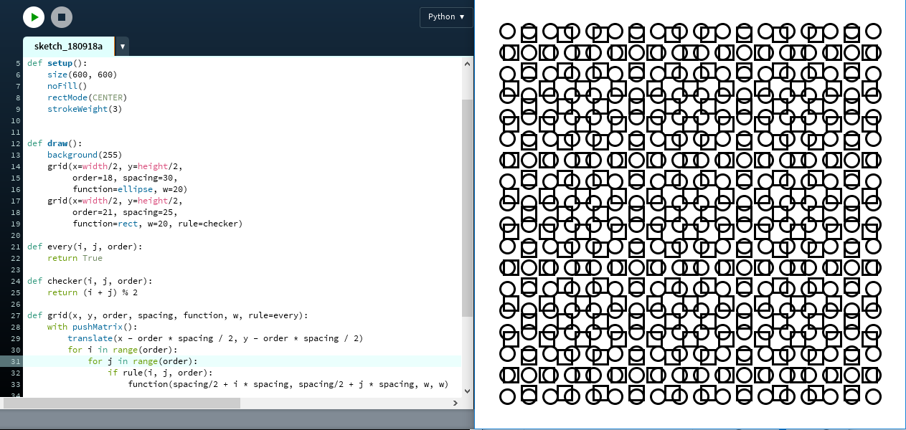
263: [code](https://github.com/villares/sketch-a-day/tree/master/2018/s263) [[Py.Processing](https://villares.github.io/como-instalar-o-processing-modo-python/index-EN)]

---

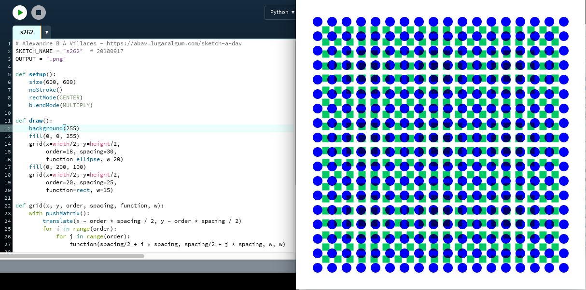

262: [code](https://github.com/villares/sketch-a-day/tree/master/2018/s262) [[Py.Processing](https://villares.github.io/como-instalar-o-processing-modo-python/index-EN)]

---

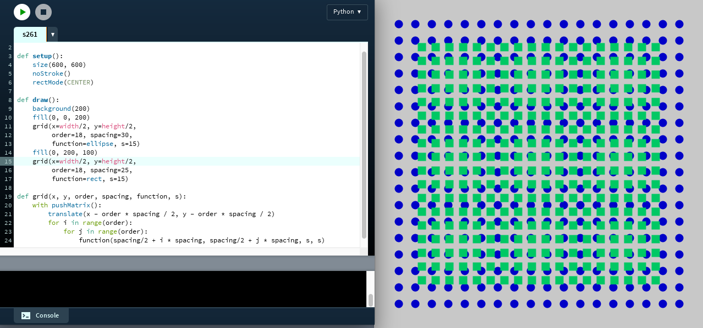

261: [code](https://github.com/villares/sketch-a-day/tree/master/2018/s261) [[Py.Processing](https://villares.github.io/como-instalar-o-processing-modo-python/index-EN)]

---


260: [code](https://github.com/villares/sketch-a-day/tree/master/2018/s260) [[Py.Processing](https://villares.github.io/como-instalar-o-processing-modo-python/index-EN)]

---


259: [code](https://github.com/villares/sketch-a-day/tree/master/2018/s259) [[Py.Processing](https://villares.github.io/como-instalar-o-processing-modo-python/index-EN)]

---


258: [code](https://github.com/villares/sketch-a-day/tree/master/2018/s258) [[Py.Processing](https://villares.github.io/como-instalar-o-processing-modo-python/index-EN)]

---


257: [code](https://github.com/villares/sketch-a-day/tree/master/2018/s257) [[Py.Processing](https://villares.github.io/como-instalar-o-processing-modo-python/index-EN)]

---

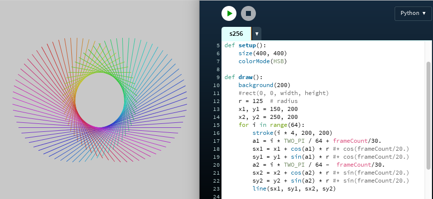

256: [code](https://github.com/villares/sketch-a-day/tree/master/2018/s256) [[Py.Processing](https://villares.github.io/como-instalar-o-processing-modo-python/index-EN)]

---


254: [code](https://github.com/villares/sketch-a-day/tree/master/2018/s254) [[Py.Processing](https://villares.github.io/como-instalar-o-processing-modo-python/index-EN)]

---

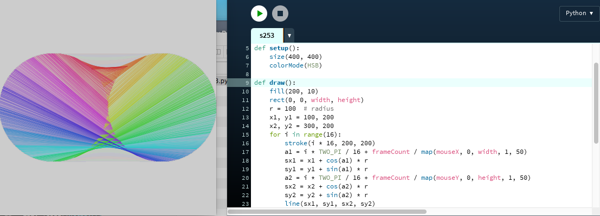

253: [code](https://github.com/villares/sketch-a-day/tree/master/2018/s253) [[Py.Processing](https://villares.github.io/como-instalar-o-processing-modo-python/index-EN)]

---

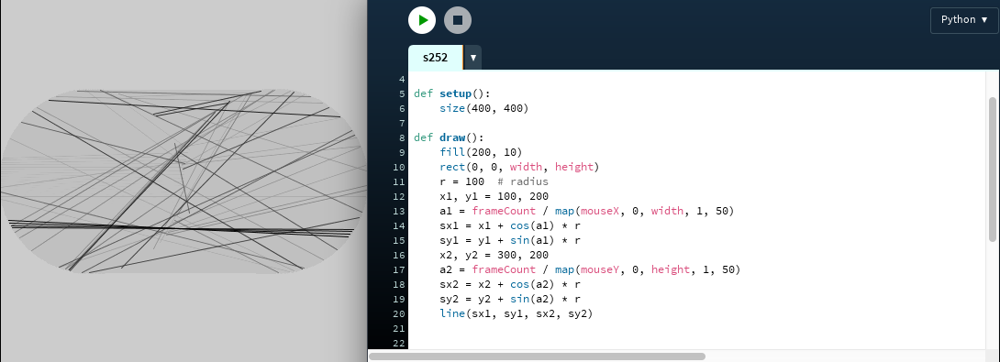

252: [code](https://github.com/villares/sketch-a-day/tree/master/2018/s252) [[Py.Processing](https://villares.github.io/como-instalar-o-processing-modo-python/index-EN)]

---


251: [code](https://github.com/villares/sketch-a-day/tree/master/2018/s251) [[Py.Processing](https://villares.github.io/como-instalar-o-processing-modo-python/index-EN)]

---


250: [code](https://github.com/villares/sketch-a-day/tree/master/2018/s250) [[Py.Processing](https://villares.github.io/como-instalar-o-processing-modo-python/index-EN)]

This was kind of a dead end. It's easy to rotate stuff with pushMatrix(), transtlate() and rotate(), but it doesn't work inside beginShape() as I found out the next day.

---


249: [code](https://github.com/villares/sketch-a-day/tree/master/2018/s249) [[Py.Processing](https://villares.github.io/como-instalar-o-processing-modo-python/index-EN)]

---


248: [code](https://github.com/villares/sketch-a-day/tree/master/2018/s248) [[Py.Processing](https://villares.github.io/como-instalar-o-processing-modo-python/index-EN)]

Animation

---

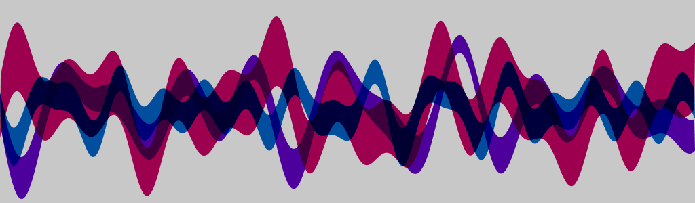

247: [code](https://github.com/villares/sketch-a-day/tree/master/2018/s247) [[Py.Processing](https://villares.github.io/como-instalar-o-processing-modo-python/index-EN)]

---


246: [code](https://github.com/villares/sketch-a-day/tree/master/2018/s246) [[Py.Processing](https://villares.github.io/como-instalar-o-processing-modo-python/index-EN)]

---

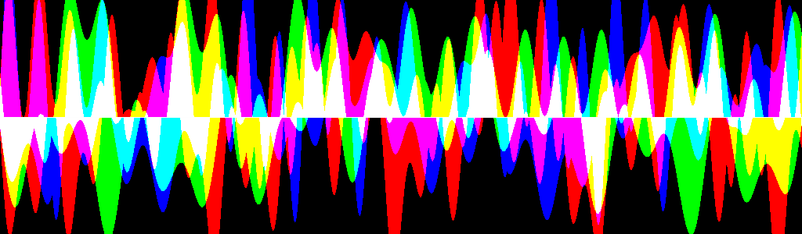

245: [code](https://github.com/villares/sketch-a-day/tree/master/2018/s245) [[Py.Processing](https://villares.github.io/como-instalar-o-processing-modo-python/index-EN)]

---


244: [code](https://github.com/villares/sketch-a-day/tree/master/2018/s244) [[Py.Processing](https://villares.github.io/como-instalar-o-processing-modo-python/index-EN)]

---


243: [code](https://github.com/villares/sketch-a-day/tree/master/2018/s243) [[Py.Processing](https://villares.github.io/como-instalar-o-processing-modo-python/index-EN)]

---


242: [code](https://github.com/villares/sketch-a-day/tree/master/2018/s242) [[Py.Processing](https://villares.github.io/como-instalar-o-processing-modo-python/index-EN)]

---


241: [code](https://github.com/villares/sketch-a-day/tree/master/2018/s241) [[Py.Processing](https://villares.github.io/como-instalar-o-processing-modo-python/index-EN)]

---

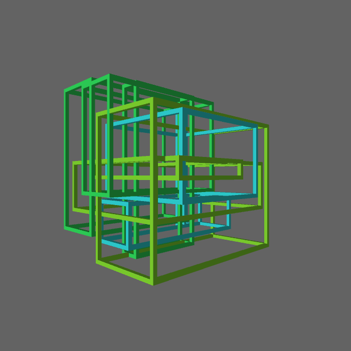

240: [code](https://github.com/villares/sketch-a-day/tree/master/2018/s240) [[Py.Processing](https://villares.github.io/como-instalar-o-processing-modo-python/index-EN)]

---


239: [code](https://github.com/villares/sketch-a-day/tree/master/2018/s239) [[Py.Processing](https://villares.github.io/como-instalar-o-processing-modo-python/index-EN)]

---

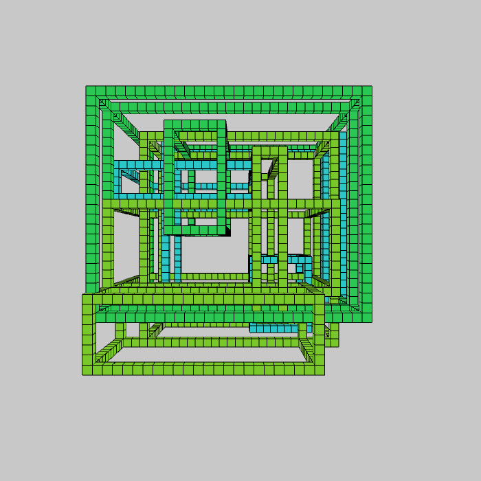

238: [code](https://github.com/villares/sketch-a-day/tree/master/2018/s238) [[Py.Processing](https://villares.github.io/como-instalar-o-processing-modo-python/index-EN)]

---


237: [code](https://github.com/villares/sketch-a-day/tree/master/2018/s237) [[Py.Processing](https://villares.github.io/como-instalar-o-processing-modo-python/index-EN)]

---

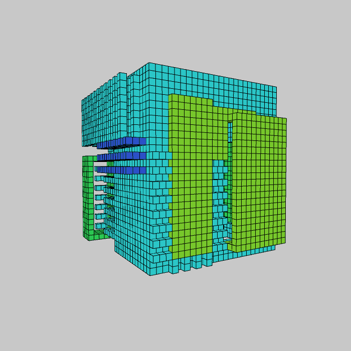

236: [code](https://github.com/villares/sketch-a-day/tree/master/2018/s236) [[Py.Processing](https://villares.github.io/como-instalar-o-processing-modo-python/index-EN)]

---

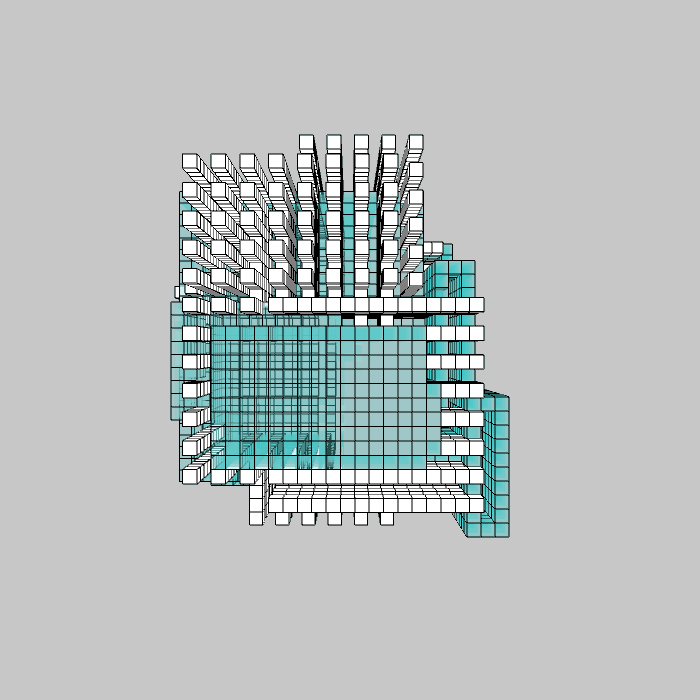

235: [code](https://github.com/villares/sketch-a-day/tree/master/2018/s235) [[Py.Processing](https://villares.github.io/como-instalar-o-processing-modo-python/index-EN)]

---

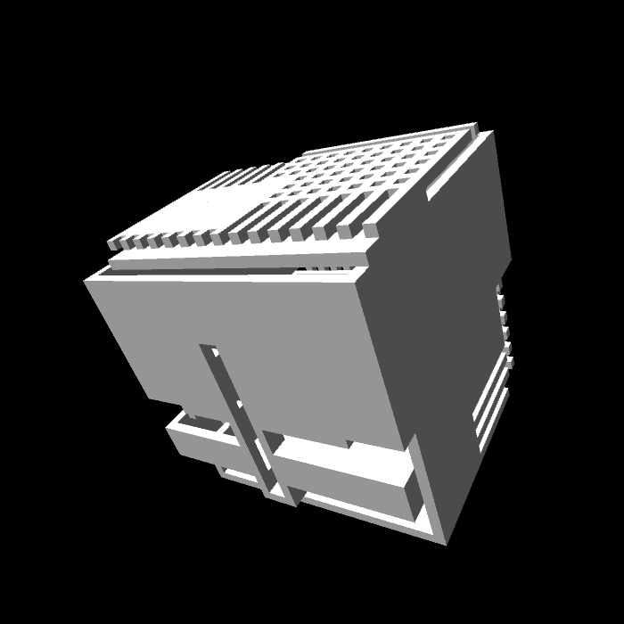

234: [code](https://github.com/villares/sketch-a-day/tree/master/2018/s234) [[Py.Processing](https://villares.github.io/como-instalar-o-processing-modo-python/index-EN)]

---

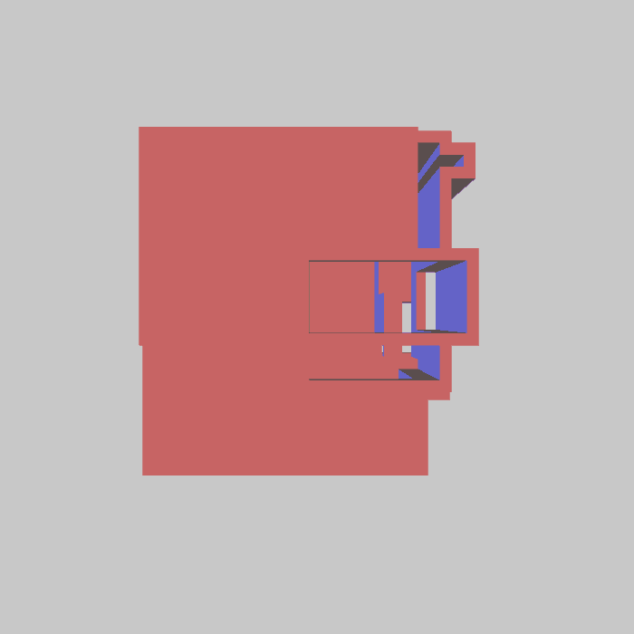

233: [code](https://github.com/villares/sketch-a-day/tree/master/2018/s232) [[Py.Processing](https://villares.github.io/como-instalar-o-processing-modo-python/index-EN)]

---


232: [code](https://github.com/villares/sketch-a-day/tree/master/2018/s232) [[Py.Processing](https://villares.github.io/como-instalar-o-processing-modo-python/index-EN)]

---


231: [code](https://github.com/villares/sketch-a-day/tree/master/2018/s231) [[Py.Processing](https://villares.github.io/como-instalar-o-processing-modo-python/index-EN)]

---


230: [code](https://github.com/villares/sketch-a-day/tree/master/2018/s230) [[Py.Processing](https://villares.github.io/como-instalar-o-processing-modo-python/index-EN)]

---


229: [code](https://github.com/villares/sketch-a-day/tree/master/2018/s229) [[Py.Processing](https://villares.github.io/como-instalar-o-processing-modo-python/index-EN)]

---

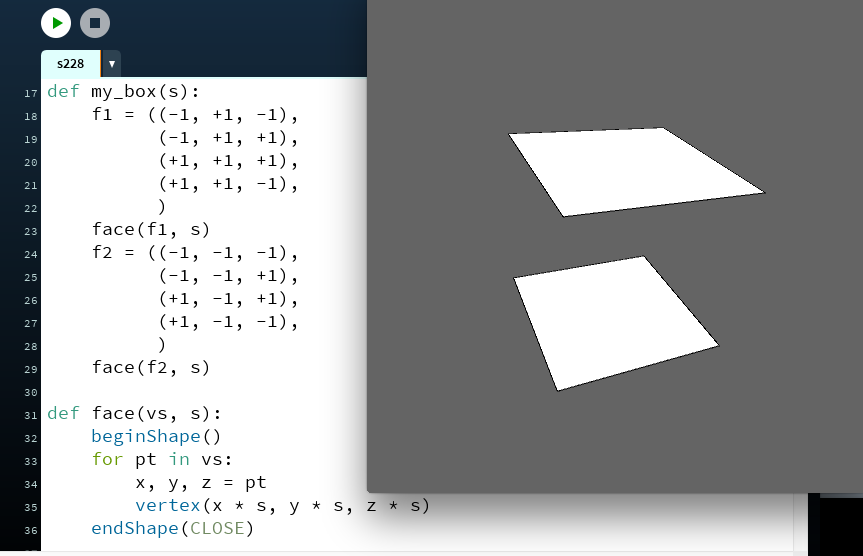

228: [code](https://github.com/villares/sketch-a-day/tree/master/2018/s228) [[Py.Processing](https://villares.github.io/como-instalar-o-processing-modo-python/index-EN)]

---

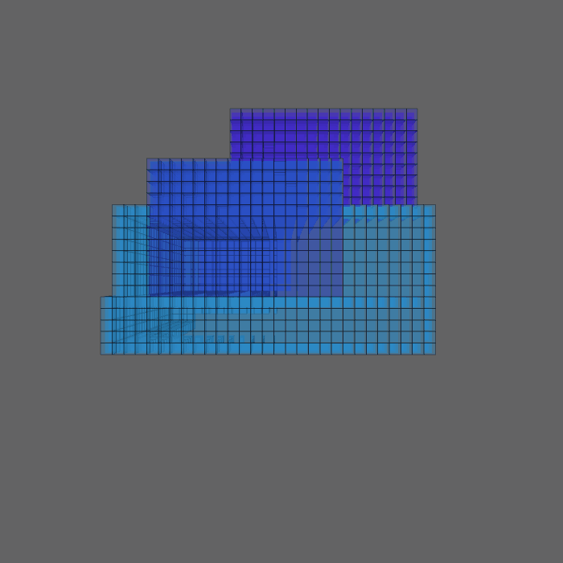

227: [code](https://github.com/villares/sketch-a-day/tree/master/2018/s227) [[Py.Processing](https://villares.github.io/como-instalar-o-processing-modo-python/index-EN)]

---


226: [code](https://github.com/villares/sketch-a-day/tree/master/2018/s226) [[Py.Processing](https://villares.github.io/como-instalar-o-processing-modo-python/index-EN)]

---

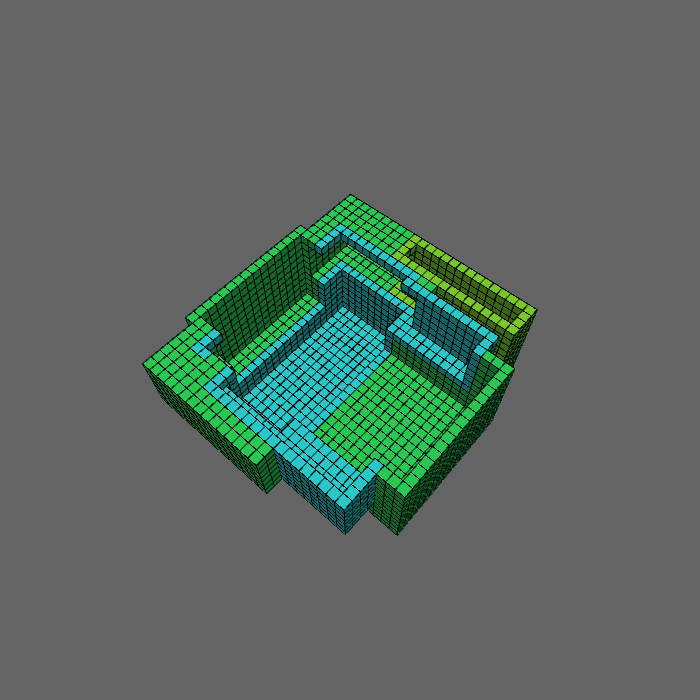

225: [code](https://github.com/villares/sketch-a-day/tree/master/2018/s225) [[Py.Processing](https://villares.github.io/como-instalar-o-processing-modo-python/index-EN)]

Now (hollow) boxes, and a cutting-plane controlled by the keyboard.

---


224: [code](https://github.com/villares/sketch-a-day/tree/master/2018/s225) [[Py.Processing](https://villares.github.io/como-instalar-o-processing-modo-python/index-EN)]

Tubes! Solid boxes hollowed in one of three directions.

---

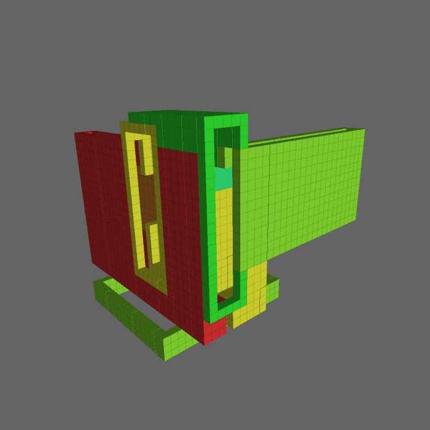

223: [code](https://github.com/villares/sketch-a-day/tree/master/2018/s223) [[Py.Processing](https://villares.github.io/como-instalar-o-processing-modo-python/index-EN)]

---


222: [code](https://github.com/villares/sketch-a-day/tree/master/2018/s222) [[Py.Processing](https://villares.github.io/como-instalar-o-processing-modo-python/index-EN)]

---

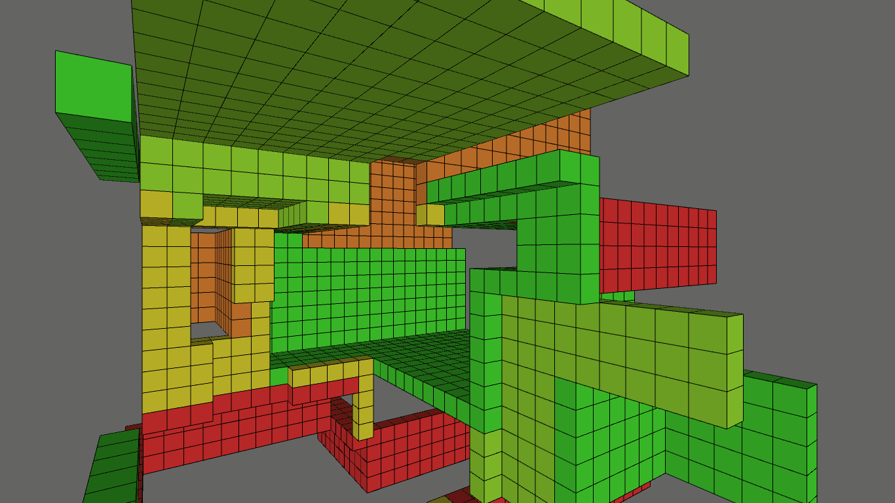

221: [code](https://github.com/villares/sketch-a-day/tree/master/2018/s221) [[Py.Processing](https://villares.github.io/como-instalar-o-processing-modo-python/index-EN)]

---


220: [code](https://github.com/villares/sketch-a-day/tree/master/2018/s220) [[Py.Processing](https://villares.github.io/como-instalar-o-processing-modo-python/index-EN)]

---


219: [code](https://github.com/villares/sketch-a-day/tree/master/2018/s219) [[Py.Processing](https://villares.github.io/como-instalar-o-processing-modo-python/index-EN)]

---

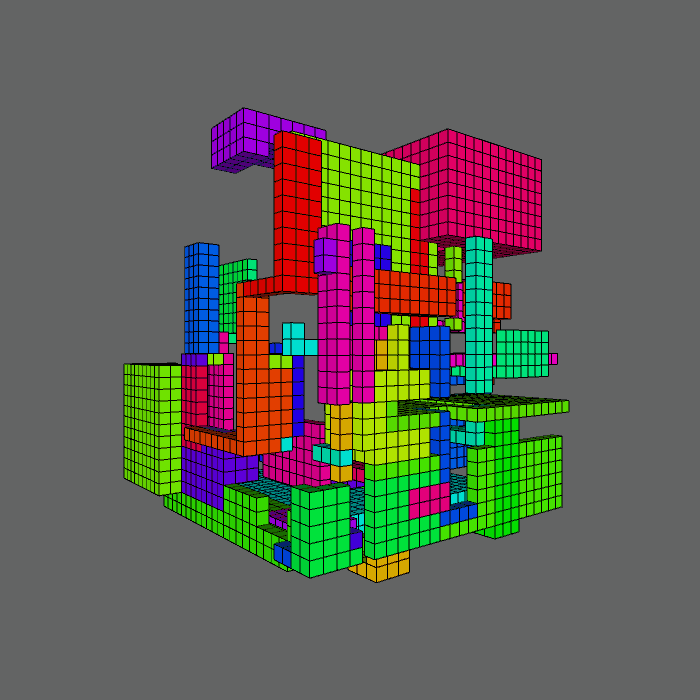

218: [code](https://github.com/villares/sketch-a-day/tree/master/2018/s218) [[Py.Processing](https://villares.github.io/como-instalar-o-processing-modo-python/index-EN)]

---


217: [code](https://github.com/villares/sketch-a-day/tree/master/2018/s217) [[Py.Processing](https://villares.github.io/como-instalar-o-processing-modo-python/index-EN)]

---

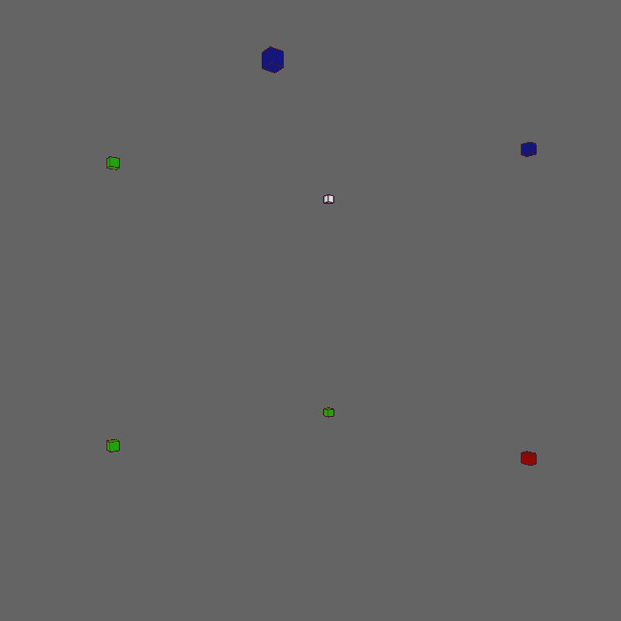

216: [code](https://github.com/villares/sketch-a-day/tree/master/2018/s216) [[Py.Processing](https://villares.github.io/como-instalar-o-processing-modo-python/index-EN)]

---


215: [code](https://github.com/villares/sketch-a-day/tree/master/2018/s215) [[Py.Processing](https://villares.github.io/como-instalar-o-processing-modo-python/index-EN)]

---


214: [code](https://github.com/villares/sketch-a-day/tree/master/2018/s214) [[Py.Processing](https://villares.github.io/como-instalar-o-processing-modo-python/index-EN)]

---

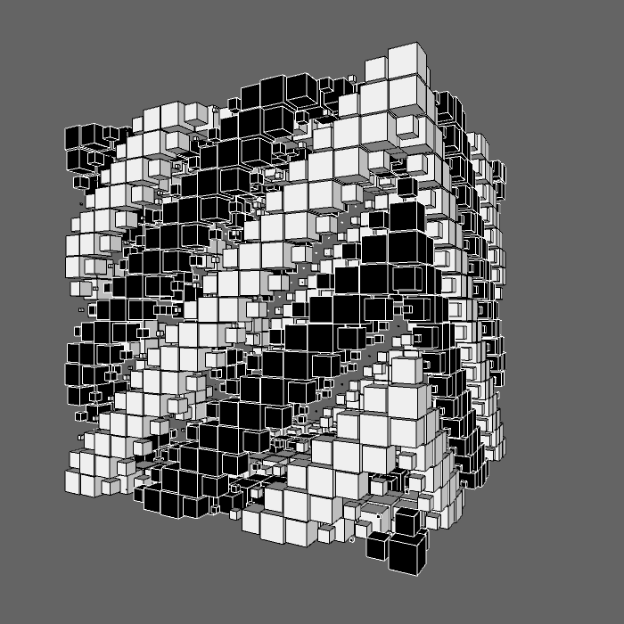

213: [code](https://github.com/villares/sketch-a-day/tree/master/2018/s213) [[Py.Processing](https://villares.github.io/como-instalar-o-processing-modo-python/index-EN)]

---

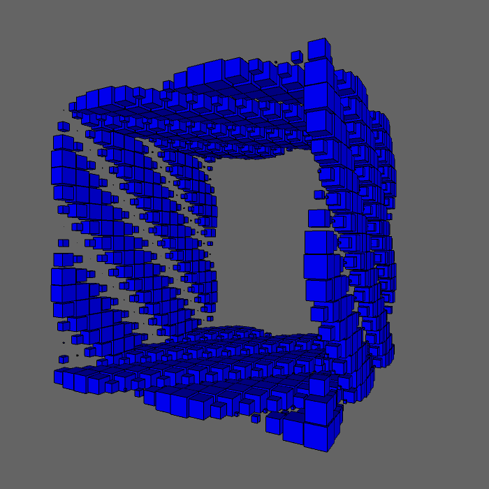

212: [code](https://github.com/villares/sketch-a-day/tree/master/2018/s211) [[Py.Processing](https://villares.github.io/como-instalar-o-processing-modo-python/index-EN)]

---


211: [code](https://github.com/villares/sketch-a-day/tree/master/2018/s211) [[Py.Processing](https://villares.github.io/como-instalar-o-processing-modo-python/index-EN)]

---

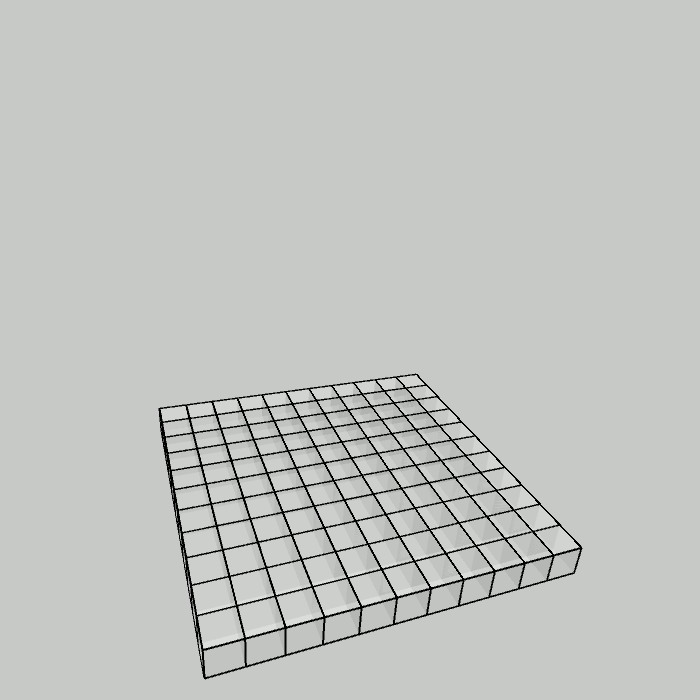

210: [code](https://github.com/villares/sketch-a-day/tree/master/2018/s210) [[Py.Processing](https://villares.github.io/como-instalar-o-processing-modo-python/index-EN)]

---


209: [code](https://github.com/villares/sketch-a-day/tree/master/2018/s209) [[Py.Processing](https://villares.github.io/como-instalar-o-processing-modo-python/index-EN)]

---

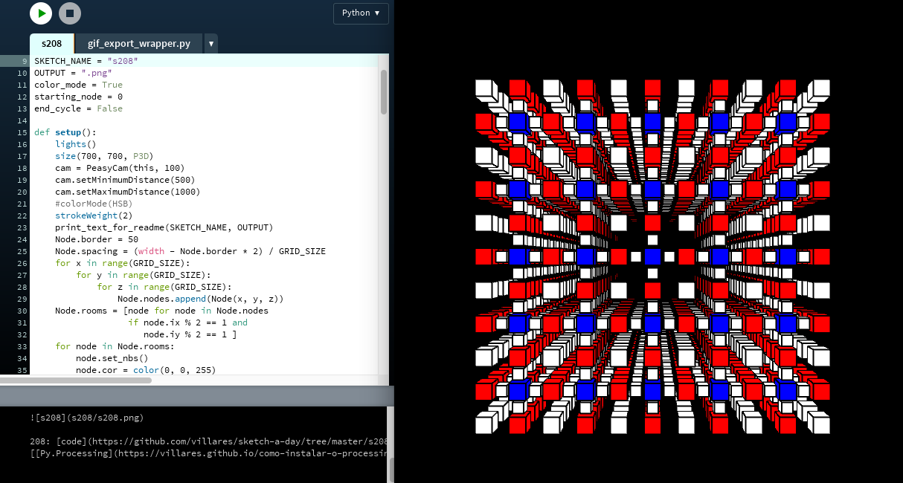

208: [code](https://github.com/villares/sketch-a-day/tree/master/2018/s208) [[Py.Processing](https://villares.github.io/como-instalar-o-processing-modo-python/index-EN)]

---


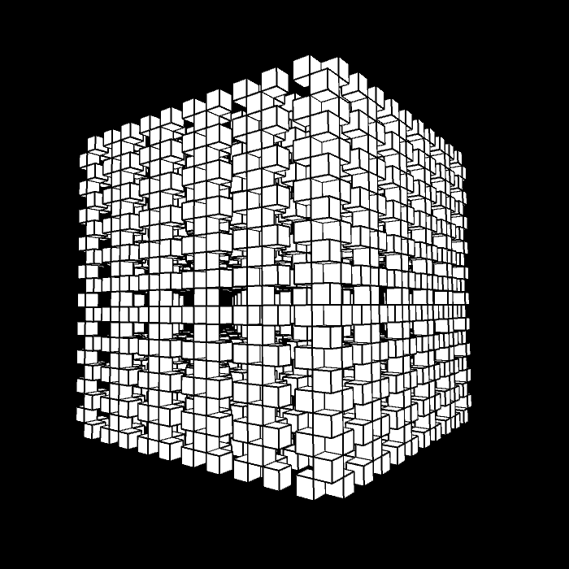

207: [code](https://github.com/villares/sketch-a-day/tree/master/2018/s207) [[Py.Processing](https://villares.github.io/como-instalar-o-processing-modo-python/index-EN)]

---


206: [code](https://github.com/villares/sketch-a-day/tree/master/2018/s206) [[Py.Processing](https://villares.github.io/como-instalar-o-processing-modo-python/index-EN)]

---


205b: [code](https://github.com/villares/sketch-a-day/tree/master/2018/s205b) [[Py.Processing](https://villares.github.io/como-instalar-o-processing-modo-python/index-EN)]

Two layer version. Added `rotateX(rot)`.

---


205: [code](https://github.com/villares/sketch-a-day/tree/master/2018/s205) [[Py.Processing](https://villares.github.io/como-instalar-o-processing-modo-python/index-EN)]

One layer version, I'll use it to test some ideas another day.

---


204: [code](https://github.com/villares/sketch-a-day/tree/master/2018/s204) [[Py.Processing](https://villares.github.io/como-instalar-o-processing-modo-python/index-EN)]

At each cycle, it starts on the next node.

---


203: [code](https://github.com/villares/sketch-a-day/tree/master/2018/s203) [[Py.Processing](https://villares.github.io/como-instalar-o-processing-modo-python/index-EN)]

A big one, animated the maze generation process.

---

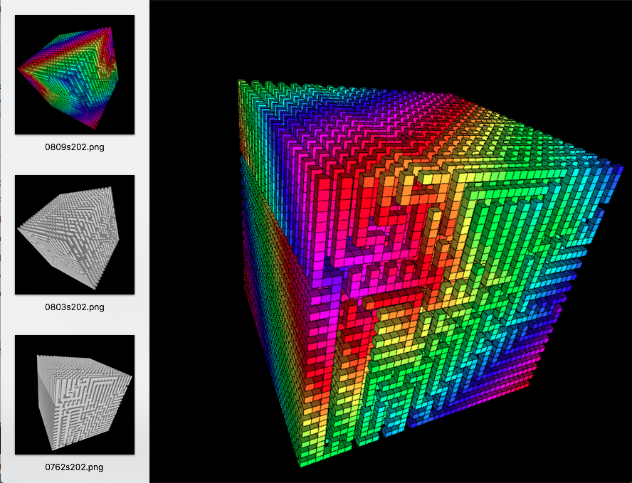

202: [code](https://github.com/villares/sketch-a-day/tree/master/2018/s202) [[Py.Processing](https://villares.github.io/como-instalar-o-processing-modo-python/index-EN)]

A bigger one

---


201: [code](https://github.com/villares/sketch-a-day/tree/master/2018/s201) [[Py.Processing](https://villares.github.io/como-instalar-o-processing-modo-python/index-EN)]

---

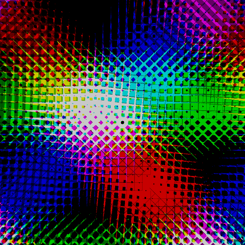

200: [code](https://github.com/villares/sketch-a-day/tree/master/2018/s200) [[Py.Processing](https://villares.github.io/como-instalar-o-processing-modo-python/index-EN)]

---


199: [code](https://github.com/villares/sketch-a-day/tree/master/2018/s199) [[Py.Processing](https://villares.github.io/como-instalar-o-processing-modo-python/index-EN)]

---


198: [code](https://github.com/villares/sketch-a-day/tree/master/2018/s198) [[Py.Processing](https://villares.github.io/como-instalar-o-processing-modo-python/index-EN)]

---


197: [code](https://github.com/villares/sketch-a-day/tree/master/2018/s197) [[Py.Processing](https://villares.github.io/como-instalar-o-processing-modo-python/index-EN)]

---


196: [code](https://github.com/villares/sketch-a-day/tree/master/2018/s196) [[Py.Processing](https://villares.github.io/como-instalar-o-processing-modo-python/index-EN)]

---


195: [code](https://github.com/villares/sketch-a-day/tree/master/2018/s195) [[Py.Processing](https://villares.github.io/como-instalar-o-processing-modo-python/index-EN)]

---


194: [code](https://github.com/villares/sketch-a-day/tree/master/2018/s194) [[Py.Processing](https://villares.github.io/como-instalar-o-processing-modo-python/index-EN)]

---


193: [code](https://github.com/villares/sketch-a-day/tree/master/2018/s193) [[Py.Processing](https://villares.github.io/como-instalar-o-processing-modo-python/index-EN)]

---


192: [code](https://github.com/villares/sketch-a-day/tree/master/2018/s192) [[Py.Processing](https://villares.github.io/como-instalar-o-processing-modo-python/index-EN)]

---


191: [code](https://github.com/villares/sketch-a-day/tree/master/2018/s191) [[Py.Processing](https://villares.github.io/como-instalar-o-processing-modo-python/index-EN)]

---


190: [code](https://github.com/villares/sketch-a-day/tree/master/2018/s190) [[Py.Processing](https://villares.github.io/como-instalar-o-processing-modo-python/index-EN)]


---


189: [code](https://github.com/villares/sketch-a-day/tree/master/2018/s189) [[Py.Processing](https://villares.github.io/como-instalar-o-processing-modo-python/index-EN)]

---


188: [code](https://github.com/villares/sketch-a-day/tree/master/2018/s188) [[Py.Processing](https://villares.github.io/como-instalar-o-processing-modo-python/index-EN)]

---


187: [code](https://github.com/villares/sketch-a-day/tree/master/2018/s187) [[Py.Processing](https://villares.github.io/como-instalar-o-processing-modo-python/index-EN)]

---


186: [code](https://github.com/villares/sketch-a-day/tree/master/2018/s186) [[Py.Processing](https://villares.github.io/como-instalar-o-processing-modo-python/index-EN)]

---


185: [code](https://github.com/villares/sketch-a-day/tree/master/2018/s185) [[Processing Java](https://www.processing.org)]

---


184: [code](https://github.com/villares/sketch-a-day/tree/master/2018/s184) [[Processing Java](https://www.processing.org)]

---


183: [code](https://github.com/villares/sketch-a-day/tree/master/2018/s183) [[Processing Java](https://www.processing.org)]

---


182: [code](https://github.com/villares/sketch-a-day/tree/master/2018/s182) [[Processing Java](https://www.processing.org)]

---


181: [code](https://github.com/villares/sketch-a-day/tree/master/2018/s181) [[Processing Java](https://www.processing.org)]

---


```
    def set_nbs(self):
        self.nbs, self.unvisited_nbs = [], []
        for node in Node.nodes:
            if node != self and dist(node.x, node.y, node.z,
                                     self.x, self.y, self.z) <= Node.spacing * 1.1:
                self.nbs.append(node)
                self.unvisited_nbs.append(node)
```


```
if node != self and dist(node.x, node.y, node.z,
                         self.x, self.y, self.z) <= Node.spacing * 1.5:
```

180: [code](https://github.com/villares/sketch-a-day/tree/master/2018/s180) [[Py.Processing](https://villares.github.io/como-instalar-o-processing-modo-python/index-EN)]

---


179: [code](https://github.com/villares/sketch-a-day/tree/master/2018/s179) [[Py.Processing](https://villares.github.io/como-instalar-o-processing-modo-python/index-EN)]

----


178: [code](https://github.com/villares/sketch-a-day/tree/master/2018/s178) [[Py.Processing](https://villares.github.io/como-instalar-o-processing-modo-python/index-EN)]

---


177: [code](https://github.com/villares/sketch-a-day/tree/master/2018/s177) [[Py.Processing](https://villares.github.io/como-instalar-o-processing-modo-python/index-EN)]

---

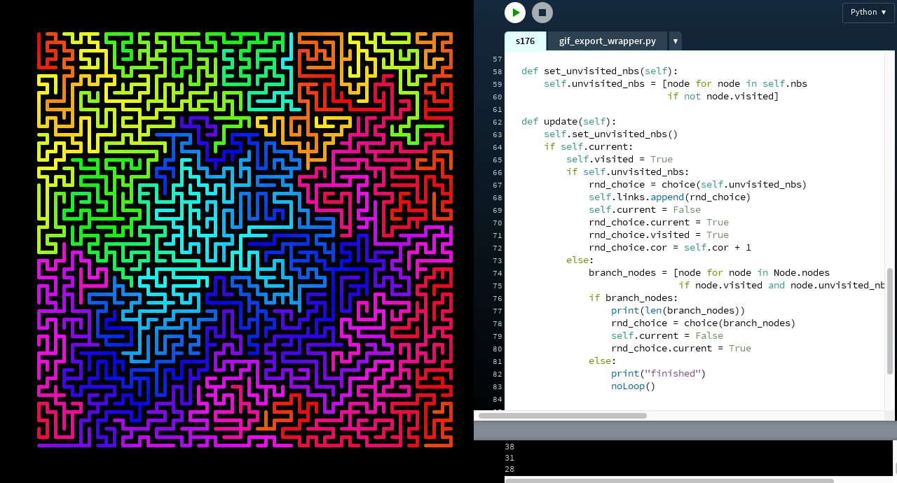

176: [code](https://github.com/villares/sketch-a-day/tree/master/2018/s176) [[Py.Processing](https://villares.github.io/como-instalar-o-processing-modo-python/index-EN)]

---


175: [code](https://github.com/villares/sketch-a-day/tree/master/2018/s175) [[Py.Processing](https://villares.github.io/como-instalar-o-processing-modo-python/index-EN)]

---

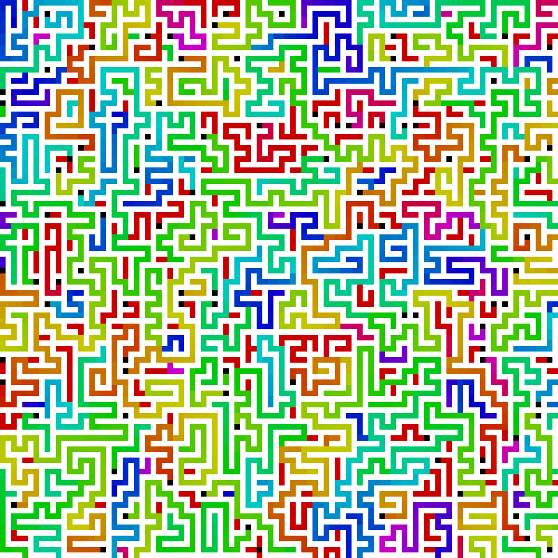

174: [code](https://github.com/villares/sketch-a-day/tree/master/2018/s174) [[Py.Processing](https://villares.github.io/como-instalar-o-processing-modo-python/index-EN)]

---

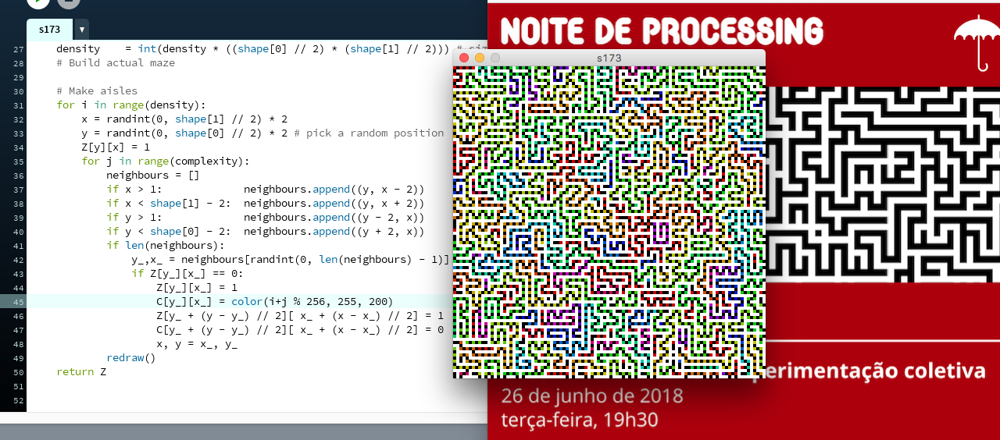

173: [code](https://github.com/villares/sketch-a-day/tree/master/2018/s173) [[Py.Processing](https://villares.github.io/como-instalar-o-processing-modo-python/index-EN)]

---


172: [code](https://github.com/villares/sketch-a-day/tree/master/2018/s172) [[Py.Processing](https://villares.github.io/como-instalar-o-processing-modo-python/index-EN)]

----

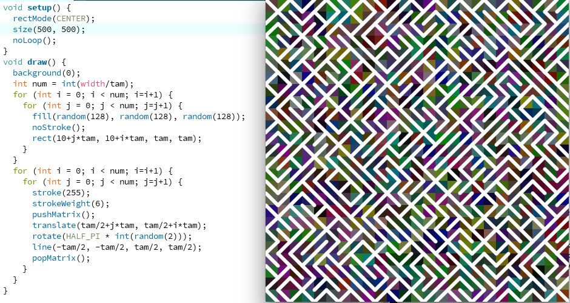

171:[Java code](https://github.com/villares/sketch-a-day/tree/master/2018/s171)[[Processing Java](https://processing.org)] &  [Python code](https://github.com/villares/sketch-a-day/tree/master/2018/s171_py) [[Py.Processing](https://villares.github.io/como-instalar-o-processing-modo-python/index-EN)]

----

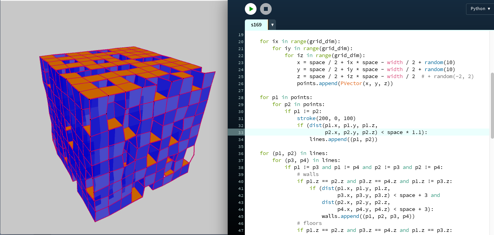

170:[code](https://github.com/villares/sketch-a-day/tree/master/2018/s170) [[Py.Processing](https://villares.github.io/como-instalar-o-processing-modo-python/index-EN)]

----


169:[code](https://github.com/villares/sketch-a-day/tree/master/2018/s169) [[Py.Processing](https://villares.github.io/como-instalar-o-processing-modo-python/index-EN)]

Now same Z lines can form floors.

----

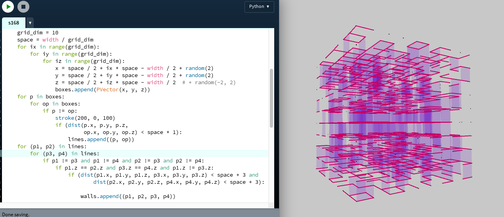

168:[code](https://github.com/villares/sketch-a-day/tree/master/2018/s168) [[Py.Processing](https://villares.github.io/como-instalar-o-processing-modo-python/index-EN)]

No random movement in Z so no line connections between different (Z) levels. Comparing  lines with different Zs to create translucent 'walls'.

----


167: [Java code](https://github.com/villares/sketch-a-day/tree/master/2018/s167) [[Processing Java](https://processing.org)] & [Python code](https://github.com/villares/sketch-a-day/tree/master/2018/s167_py) [[Py.Processing](https://villares.github.io/como-instalar-o-processing-modo-python/index-EN)]

----


166: [code](https://github.com/villares/sketch-a-day/tree/master/2018/s166) [[Py.Processing](https://villares.github.io/como-instalar-o-processing-modo-python/index-EN)]

----


165: [code](https://github.com/villares/sketch-a-day/tree/master/2018/s165) [[Py.Processing](https://villares.github.io/como-instalar-o-processing-modo-python/index-EN)]

----


164: [code](https://github.com/villares/sketch-a-day/tree/master/2018/s164) [[Py.Processing](https://villares.github.io/como-instalar-o-processing-modo-python/index-EN)]

----


163: [code](https://github.com/villares/sketch-a-day/tree/master/2018/s163) [[Py.Processing](https://villares.github.io/como-instalar-o-processing-modo-python/index-EN)]

(#152 revisited in 3D :)

----


162: [code](https://github.com/villares/sketch-a-day/tree/master/2018/s161) [[Processing Java](https://www.processing.org)]

Perlin Noise "walker" + ?

----

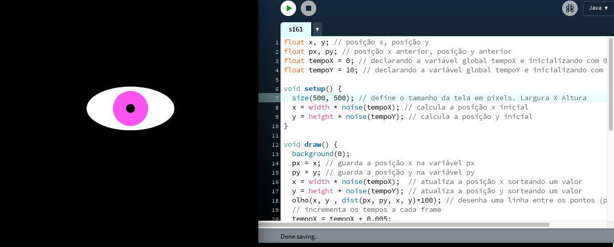

161: [code](https://github.com/villares/sketch-a-day/tree/master/2018/s161) [[Processing Java](https://www.processing.org)]

Perlin Noise  "walker" + eye

----


160: [code](https://github.com/villares/sketch-a-day/tree/master/2018/s160) [[Processing Java](https://www.processing.org)]

Interactive genetic algorithm

----


159: [code](https://github.com/villares/sketch-a-day/tree/master/2018/s158) [[Processing Java](https://www.processing.org)]

----


158: [code](https://github.com/villares/sketch-a-day/tree/master/2018/s158) [[Py.Processing](https://villares.github.io/como-instalar-o-processing-modo-python/index-EN)]

----

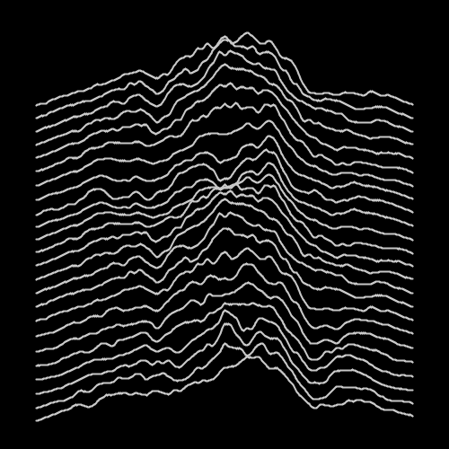

157: [code](https://github.com/villares/sketch-a-day/tree/master/2018/s156) [[Py.Processing](https://villares.github.io/como-instalar-o-processing-modo-python/index-EN)]

----


156: [code](https://github.com/villares/sketch-a-day/tree/master/2018/s156) [[Py.Processing](https://villares.github.io/como-instalar-o-processing-modo-python/index-EN)]

----


155: [code](https://github.com/villares/sketch-a-day/tree/master/2018/s155) [[Py.Processing](https://villares.github.io/como-instalar-o-processing-modo-python/index-EN)]

----


154: [code](https://github.com/villares/sketch-a-day/tree/master/2018/s154) [[Py.Processing](https://villares.github.io/como-instalar-o-processing-modo-python/index-EN)]

----


153: [code](https://github.com/villares/sketch-a-day/tree/master/2018/s153) [[Py.Processing](https://villares.github.io/como-instalar-o-processing-modo-python/index-EN)]

----


152: [code](https://github.com/villares/sketch-a-day/tree/master/2018/s152) [[Py.Processing](https://villares.github.io/como-instalar-o-processing-modo-python/index-EN)]

----


151: [code](https://github.com/villares/sketch-a-day/tree/master/2018/s151) [[Py.Processing](https://villares.github.io/como-instalar-o-processing-modo-python/index-EN)]

----


150: [code](https://github.com/villares/sketch-a-day/tree/master/2018/s150) [[Py.Processing](https://villares.github.io/como-instalar-o-processing-modo-python/index-EN)]

----


149b: [code](https://github.com/villares/sketch-a-day/tree/master/2018/s149b) [[Py.Processing](https://villares.github.io/como-instalar-o-processing-modo-python/index-EN)]

----


149: [code](https://github.com/villares/sketch-a-day/tree/master/2018/s149) [[Py.Processing](https://villares.github.io/como-instalar-o-processing-modo-python/index-EN)]

----


148: [code](https://github.com/villares/sketch-a-day/tree/master/2018/s148) [[Py.Processing](https://villares.github.io/como-instalar-o-processing-modo-python/index-EN)]

----


147: [code](https://github.com/villares/sketch-a-day/tree/master/2018/s147) [[Py.Processing](https://villares.github.io/como-instalar-o-processing-modo-python/index-EN)]

----


146: [code](https://github.com/villares/sketch-a-day/tree/master/2018/s146) [[Py.Processing](https://villares.github.io/como-instalar-o-processing-modo-python/index-EN)]

----

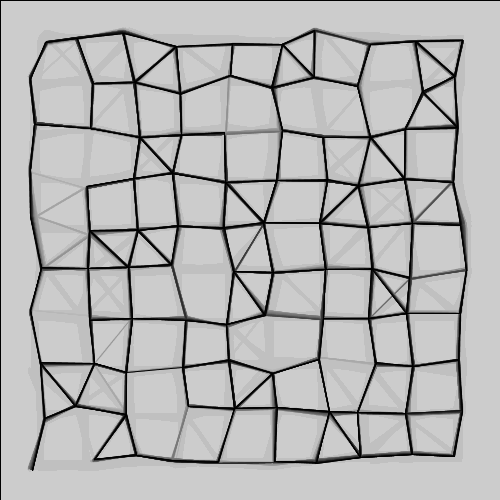

145: [code](https://github.com/villares/sketch-a-day/tree/master/2018/s145) [[Py.Processing](https://villares.github.io/como-instalar-o-processing-modo-python/index-EN)]

----

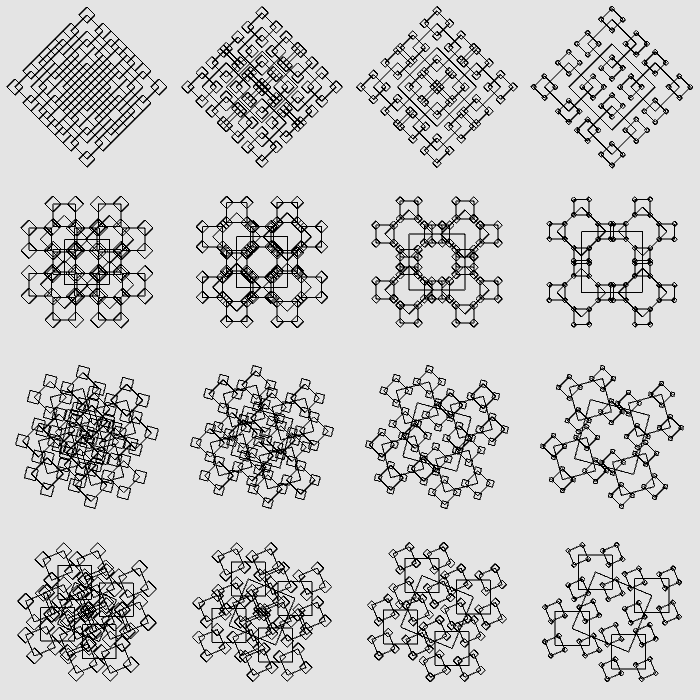

144: [code](https://github.com/villares/sketch-a-day/tree/master/2018/s144) [[Py.Processing](https://villares.github.io/como-instalar-o-processing-modo-python/index-EN)]

----


143: [code](https://github.com/villares/sketch-a-day/tree/master/2018/s143)  [[Py.Processing](https://villares.github.io/como-instalar-o-processing-modo-python/index-EN)]

----


140 + 141 + 142 [code](https://github.com/villares/sketch-a-day/tree/master/2018/s140_s141_s142) [[Py.Processing](https://villares.github.io/como-instalar-o-processing-modo-python/index-EN)]

----


142: [code](https://github.com/villares/sketch-a-day/tree/master/2018/s142)  [[Py.Processing](https://villares.github.io/como-instalar-o-processing-modo-python/index-EN)]

----

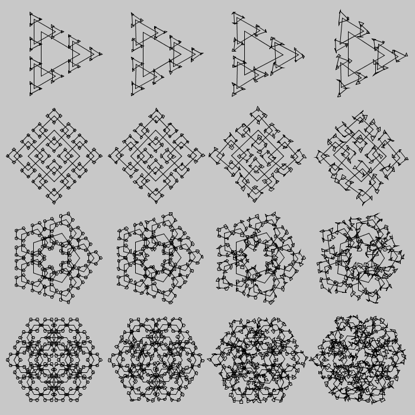

141: [code](https://github.com/villares/sketch-a-day/tree/master/2018/s141)  [[Py.Processing](https://villares.github.io/como-instalar-o-processing-modo-python/index-EN)]

----

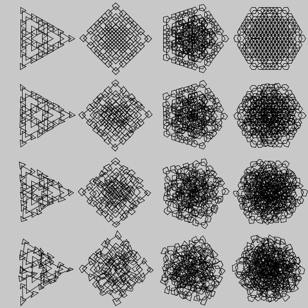

s140: [code](https://github.com/villares/sketch-a-day/tree/master/2018/s140)  [[Py.Processing](https://villares.github.io/como-instalar-o-processing-modo-python/index-EN)]

----

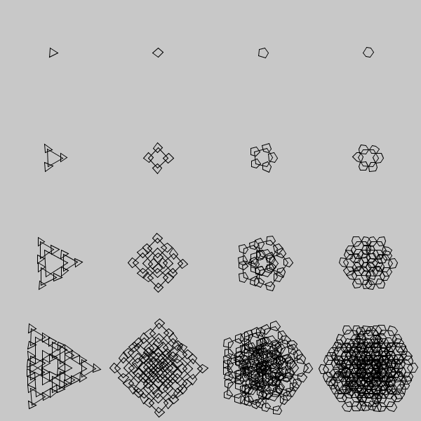

s139: [code](https://github.com/villares/sketch-a-day/tree/master/2018/s139)  [[Py.Processing](https://villares.github.io/como-instalar-o-processing-modo-python/index-EN)]

---


138: [code](https://github.com/villares/sketch-a-day/tree/master/2018/s138)  [[Py.Processing](https://villares.github.io/como-instalar-o-processing-modo-python/index-EN)]

Revisiting ideas of recursion from s071

Heavy animated GIF: [s138.gif](2018/s138/s138.gif)

----

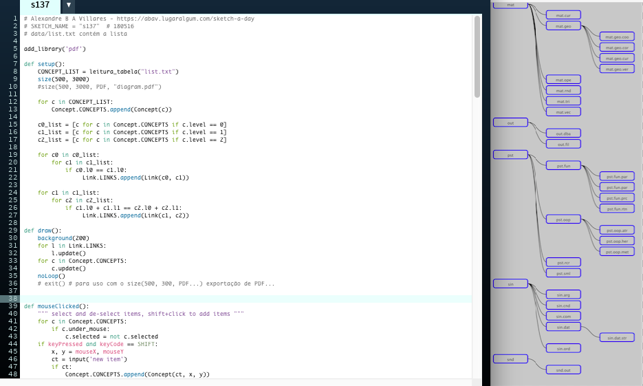

s137: [code](https://github.com/villares/sketch-a-day/tree/master/2018/s137)  [[Py.Processing](https://villares.github.io/como-instalar-o-processing-modo-python/index-EN)]

PDF:  [diagram.pdf](2018/s137/diagram.pdf)

----

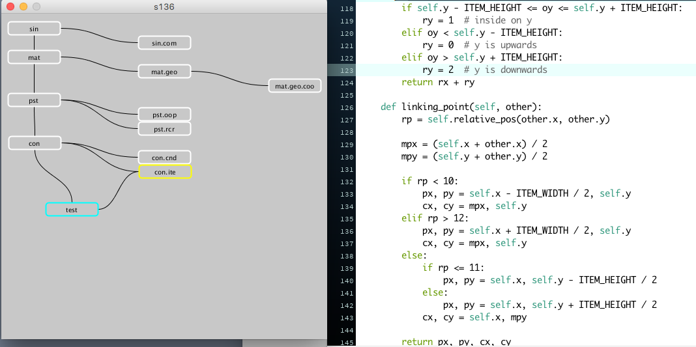

136: [code](https://github.com/villares/sketch-a-day/tree/master/2018/s136)  [[Py.Processing](https://villares.github.io/como-instalar-o-processing-modo-python/index-EN)]

----

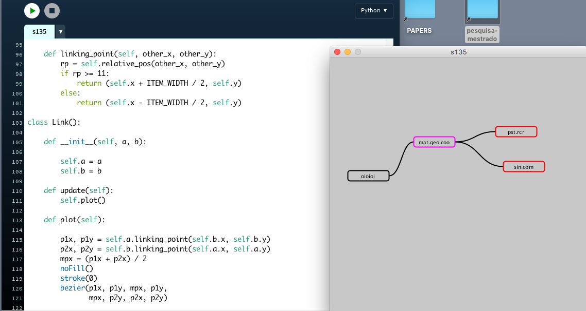

135: [code](https://github.com/villares/sketch-a-day/tree/master/2018/s135)  [[Py.Processing](https://villares.github.io/como-instalar-o-processing-modo-python/index-EN)]

----

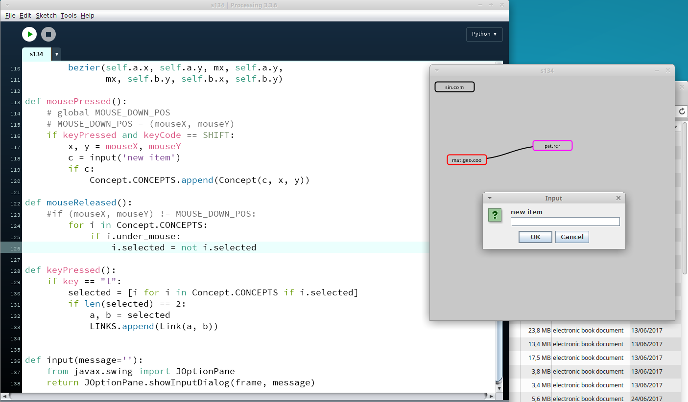

134: [code](https://github.com/villares/sketch-a-day/tree/master/2018/s134)  [[Py.Processing](https://villares.github.io/como-instalar-o-processing-modo-python/index-EN)]

----


133: [code](https://github.com/villares/sketch-a-day/tree/master/2018/s133)  [[Py.Processing](https://villares.github.io/como-instalar-o-processing-modo-python/index-EN)]

----


132: [code](https://github.com/villares/sketch-a-day/tree/master/2018/s132)  [[Py.Processing](https://villares.github.io/como-instalar-o-processing-modo-python/index-EN)]

----


131: [code](https://github.com/villares/sketch-a-day/tree/master/2018/s131)  [[Py.Processing](https://villares.github.io/como-instalar-o-processing-modo-python/index-EN)]

----


130: [code](https://github.com/villares/sketch-a-day/tree/master/2018/s130)  [[Py.Processing](https://villares.github.io/como-instalar-o-processing-modo-python/index-EN)]

----


129: [code](https://github.com/villares/sketch-a-day/tree/master/2018/s129)  [[Py.Processing](https://villares.github.io/como-instalar-o-processing-modo-python/index-EN)]

Maybe I fixed it, I guess, not sure…

----

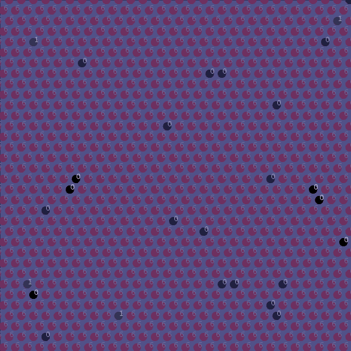

128: [code](https://github.com/villares/sketch-a-day/tree/master/2018/s128)  [[Py.Processing](https://villares.github.io/como-instalar-o-processing-modo-python/index-EN)] 

BROKEN!

----

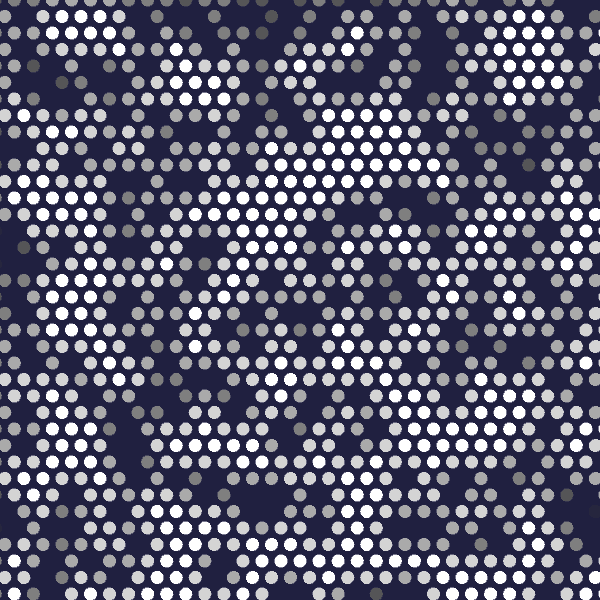

127: [code](https://github.com/villares/sketch-a-day/tree/master/2018/s127)  [[Py.Processing](https://villares.github.io/como-instalar-o-processing-modo-python/index-EN)]

----


126: [code](https://github.com/villares/sketch-a-day/tree/master/2018/s126)  [[Py.Processing](https://villares.github.io/como-instalar-o-processing-modo-python/index-EN)]

----

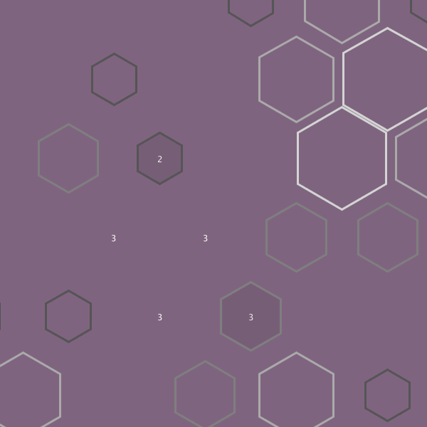

125: [code](https://github.com/villares/sketch-a-day/tree/master/2018/s125)  [[Py.Processing](https://villares.github.io/como-instalar-o-processing-modo-python/index-EN)]

----

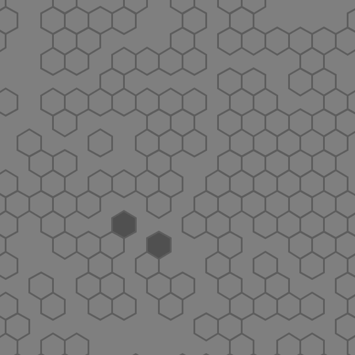

124: [code](https://github.com/villares/sketch-a-day/tree/master/2018/s124)  [[Py.Processing](https://villares.github.io/como-instalar-o-processing-modo-python/index-EN)]

----


123: [code](https://github.com/villares/sketch-a-day/tree/master/2018/s123)  [[Py.Processing](https://villares.github.io/como-instalar-o-processing-modo-python/index-EN)]

----


122: [code](https://github.com/villares/sketch-a-day/tree/master/2018/s122)  [[Py.Processing](https://villares.github.io/como-instalar-o-processing-modo-python/index-EN)]

----


121: [code](https://github.com/villares/sketch-a-day/tree/master/2018/s121)  [[Py.Processing](https://villares.github.io/como-instalar-o-processing-modo-python/index-EN)]

----

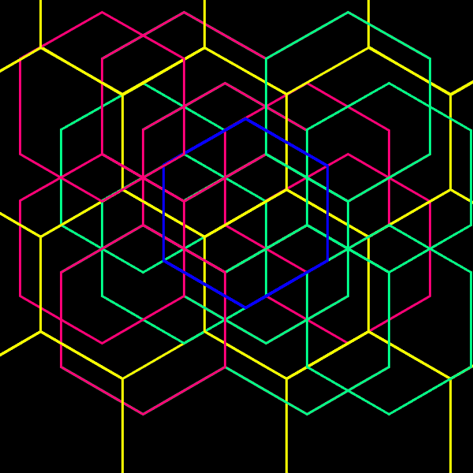

120: [code](https://github.com/villares/sketch-a-day/tree/master/2018/s120)  [[Py.Processing](https://villares.github.io/como-instalar-o-processing-modo-python/index-EN)]

To be brutally honest, I had no idea that reversing the second random grid would bring me this result!

----


119: [code](https://github.com/villares/sketch-a-day/tree/master/2018/s119)  [[Py.Processing](https://villares.github.io/como-instalar-o-processing-modo-python/index-EN)]

----


118: [code](https://github.com/villares/sketch-a-day/tree/master/2018/s118)  [[Py.Processing](https://villares.github.io/como-instalar-o-processing-modo-python/index-EN)]

----


117: [code](https://github.com/villares/sketch-a-day/tree/master/2018/s117)  [[Py.Processing](https://villares.github.io/como-instalar-o-processing-modo-python/index-EN)]

----


116: [code](https://github.com/villares/sketch-a-day/tree/master/2018/s116)  [[Py.Processing](https://villares.github.io/como-instalar-o-processing-modo-python/index-EN)]

----


115: [code](https://github.com/villares/sketch-a-day/tree/master/2018/s115)  [[Py.Processing](https://villares.github.io/como-instalar-o-processing-modo-python/index-EN)]

----


114: [code](https://github.com/villares/sketch-a-day/tree/master/2018/s114)  [[Py.Processing](https://villares.github.io/como-instalar-o-processing-modo-python/index-EN)]

----


113: [code](https://github.com/villares/sketch-a-day/tree/master/2018/s113)  [[Py.Processing](https://villares.github.io/como-instalar-o-processing-modo-python/index-EN)]

----


112: [code](https://github.com/villares/sketch-a-day/tree/master/2018/s112)  [[Py.Processing](https://villares.github.io/como-instalar-o-processing-modo-python/index-EN)]

Hexagons! 

​```python
def hexagon(x, y, r):
​    with pushMatrix():
​        translate(x, y)
​        beginShape()
​        for i in range(6):
​            vx = cos(i * TWO_PI /6) * r
​            vy = sin(i * TWO_PI /6) * r
​            vertex(vx, vy)
​        endShape(CLOSE)
```

----


111: [code](https://github.com/villares/sketch-a-day/tree/master/2018/s111)  [[Py.Processing](https://villares.github.io/como-instalar-o-processing-modo-python/index-EN)]

Now I 'fixed' the rotation with propper pushMatrix() and translate()

​```python
        with pushMatrix():
            translate(x0,y0)
            rotate(fs0)
            stroke(st0)
            equilateral(0, 0, fs0)
        with pushMatrix():
            translate(x1,y1)
            rotate(fs1)
            stroke(st1)
            equilateral(0, 0, fs1)
        with pushMatrix():
            translate(x2,y2)
            rotate(fs2)
            stroke(st2)
            equilateral(0, 0, fs2)
```

----


110: [code](https://github.com/villares/sketch-a-day/tree/master/2018/s110)  [[Py.Processing](https://villares.github.io/como-instalar-o-processing-modo-python/index-EN)]

Just added some rotations to mess things up. It's "wrong", but I like it!

```python
        rotate(fs0)
        stroke(st0)
        equilateral(x0, y0, fs0)
        stroke(st1)
        rotate(fs1)
        equilateral(x1, y1, fs1)
        stroke(st2)
        rotate(fs2)
        equilateral(x2, y2, fs2)

```

----


109: [code](https://github.com/villares/sketch-a-day/tree/master/2018/s109)  [[Py.Processing](https://villares.github.io/como-instalar-o-processing-modo-python/index-EN)]

```python
colorMode(HSB)
...
C = color(map(final_size,-63 , 63, 0, 255), 255, 255)
                          
```

----


108: [code](https://github.com/villares/sketch-a-day/tree/master/2018/s108)  [[Py.Processing](https://villares.github.io/como-instalar-o-processing-modo-python/index-EN)]


```python
colorMode(HSB)
...
C = color(map(abs(final_size), 0, 63, 0, 255), 255, 255)

```

----


107: [code](https://github.com/villares/sketch-a-day/tree/master/2018/s107)  [[Py.Processing](https://villares.github.io/como-instalar-o-processing-modo-python/index-EN)]

Inverting odd rows

```python
  v = spac_size * 1.5
    h = spac_size * sqrt(3)
    for ix in range(-1, grid_elem + 1):
        for iy in range(-1, grid_elem + 1):
            if iy % 2:
                x = ix * h + h / 4
                es = elem_size
            else:
                x = ix * h - h / 4
                es = -elem_size
            y = iy * v
            for i in range(3):
                final_size = es * (i + 0.5)
                C = map(final_size, 0, 63, 0, 255)
                oX = rand_posi * random(-1, 1)
                oY = rand_posi * random(-1, 1)
                ELEMENTS.append((C, x + oX, y + oY, final_size))
```

----


106: [code](https://github.com/villares/sketch-a-day/tree/master/2018/s106)  [[Py.Processing](https://villares.github.io/como-instalar-o-processing-modo-python/index-EN)]

Lazy triangles

```python
def equilateral(x, y, r):
    with pushMatrix():
        translate(x, y)
        triangle(-0.866 * r, -0.5 * r,
                  0.866 * r, -0.5 * r,
                  0.000 * r,  1.0 * r) 
                  # I know... 0 * r and 1 * r...
```

----


105: [code](https://github.com/villares/sketch-a-day/tree/master/2018/s105)  [[Py.Processing](https://villares.github.io/como-instalar-o-processing-modo-python/index-EN)]

Layers now have different "base" sizes (0.5, 1.5 and 2.5 times base size). Removed lines for now.

----


104: [code](https://github.com/villares/sketch-a-day/tree/master/2018/s104)  [[Py.Processing](https://villares.github.io/como-instalar-o-processing-modo-python/index-EN)]

Back to stroke variation

----


103: [code](https://github.com/villares/sketch-a-day/tree/master/2018/s103)  [[Py.Processing](https://villares.github.io/como-instalar-o-processing-modo-python/index-EN)]

Layers but only black strokes

```python
    spac_size = width / (grid_elem + 1)
    v = spac_size * 1.5
    h = spac_size * sqrt(3)
    for ix in range(-1, grid_elem + 1):
        for iy in range(-1, grid_elem + 1):
            if iy % 2:
                x = ix * h + h / 4
            else:
                x = ix * h - h / 4
            y = iy * v
            for i in range(3):
                final_size = elem_size + rand_size * random(-1, 1)
                ELEMENTS.append((x, y, final_size))
    # three layers of elements            
    for i in range(3):
        offsetX = rand_posi * random(-1, 1)
        offsetY = rand_posi * random(-1, 1)
        for elem in ELEMENTS[i::3]:
            x, y, es = elem
            ellipse(x + offsetX, y + offsetY, es, es)

    for _ in range(grid_elem):
        x1, y1, es1 = rnd_choice(ELEMENTS)
        x2, y2, es2 = rnd_choice(ELEMENTS)
        line(x1, y1, x2, y2)
```

----


102: [code](https://github.com/villares/sketch-a-day/tree/master/2018/s102)  [[Py.Processing](https://villares.github.io/como-instalar-o-processing-modo-python/index-EN)]

```python
    spac_size = width / (grid_elem + 1)
    v = spac_size * 1.5
    h = spac_size * sqrt(3)
    for ix in range(-1, grid_elem + 1):
        for iy in range(-1, grid_elem + 1):
            if iy % 2:
                x = ix * h + h / 4
            else:
                x = ix * h - h / 4
            y = iy * v
            final_size = elem_size + rand_size * random(-1, 1)
            offsetX = rand_posi * random(-1, 1)
            offsetY = rand_posi * random(-1, 1)
            C = map(final_size, 0, 63, 0, 255)
            ELEMENTS.append((C,
                             x + offsetX,
                             y + offsetY,
                             final_size
                             ))
    for elem in ELEMENTS:
        stroke1, x1, y1, es1 = elem
        ellipse(x1, y1, es1, es1)

    for _ in range(grid_elem):
        stroke1, x1, y1, es1 = rnd_choice(ELEMENTS)
        stroke2, x2, y2, es2 = rnd_choice(ELEMENTS)
        stroke(stroke2)
        line(x1, y1, x2, y2)

```

----


101: [code](https://github.com/villares/sketch-a-day/tree/master/2018/s101)  [[Py.Processing](https://villares.github.io/como-instalar-o-processing-modo-python/index-EN)]

```python
    for _ in range(grid_elem * 2):        
        stroke1, x1, y1, es1 = rnd_choice(ELEMENTS)
        stroke(stroke1)
        ellipse(x1, y1, es1, es1)
        stroke2, x2, y2, es2 = rnd_choice(ELEMENTS)
        stroke(stroke2)
        # line
        ellipse(x2, y2, es2, es2)
        line(x1, y1, x2, y2)
```

----


100: [code](https://github.com/villares/sketch-a-day/tree/master/2018/s100)  [[Py.Processing](https://villares.github.io/como-instalar-o-processing-modo-python/index-EN)]

```python
    spac_size = int(width / (grid_elem + 1))
    for _ in range(2):
        for x in range(spac_size / 2, width, spac_size): 
            for y in range(spac_size / 2, width, spac_size):
                final_size = elem_size + rand_size * random(-1, 1)
                offsetX = rand_posi * random(-1, 1)
                offsetY = rand_posi * random(-1, 1)
                C = map(final_size, 0, 63, 0, 255)
                ELEMENTS.append((C,
                                x + offsetX,
                                y + offsetY,
                                final_size
                                ))
    for stroke_c, x, y, el_size in ELEMENTS:
        stroke(stroke_c)
        ellipse(x, y, el_size, el_size)
    for _ in range(grid_elem):
        stroke_c, x1, y1, _ = rnd_choice(ELEMENTS)
        ________, x2, y2, _ = rnd_choice(ELEMENTS)
        stroke(stroke_c)
        line(x1, y1, x2, y2)
```

----


099: [code](https://github.com/villares/sketch-a-day/tree/master/2018/s099)  [[Py.Processing](https://villares.github.io/como-instalar-o-processing-modo-python/index-EN)]
```python
    spac_size = int(width / (grid_elem + 1))
    for x in range(spac_size / 2, width, spac_size):  
        for y in range(spac_size / 2, width, spac_size): 
            final_size = elem_size + rand_size * random(-1, 1)
            offsetX = rand_posi * random(-1, 1)
            offsetY = rand_posi * random(-1, 1)
            GREY = map(final_size, 0, 63, 0, 255)
            stroke(GREY)
            ellipse(x + offsetX,  # desenha um círculo
                 y + offsetY,
                 final_size,
                 final_size)
```
----


098: [code](https://github.com/villares/sketch-a-day/tree/master/2018/s098)  [[Py.Processing](https://villares.github.io/como-instalar-o-processing-modo-python/index-EN)]

```python
    spac_size = int(width / (grid_elem + 1))
    for x in range(spac_size / 2, width, spac_size):  
        for y in range(spac_size / 2, width, spac_size): 
            square_size = elem_size + rand_size * random(-1, 1)
            offsetX = rand_posi * random(-1, 1)
            offsetY = rand_posi * random(-1, 1)
            HUE = map(offsetX + offsetY, -128, 127, 0, 255)
            SAT = map(square_size, 0, 63, 0, 255)
            fill(HUE, SAT, 255, 200)
            rect(x + offsetX,  # desenha um quadrado
                 y + offsetY,
                 square_size,
                 square_size)
```
----

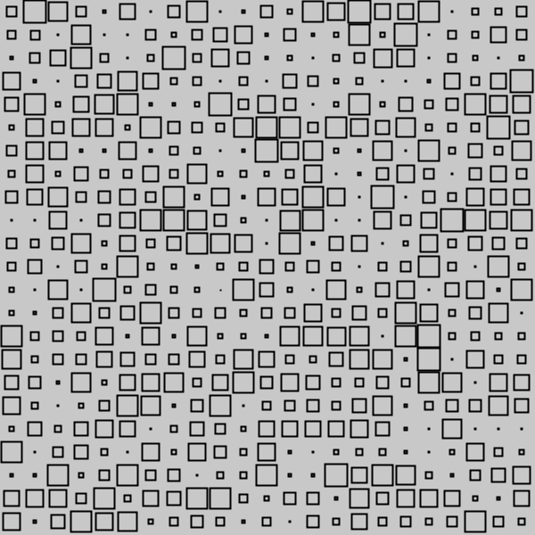

097: [code](https://github.com/villares/sketch-a-day/tree/master/2018/s097)  [[Py.Processing](https://villares.github.io/como-instalar-o-processing-modo-python/index-EN)]

```python
    spac_size = int(width / (grid_elem + 1))
    for x in range(spac_size / 2, width, spac_size):
        for y in range(spac_size / 2, width, spac_size):
            # sorteia um tamanho (se o rand_size > 0)
            square_size = elem_size + rand_size * random(-1, 1)
            rect(x + rand_posi * random(-1, 1),  # desenha um quadrado
                 y + rand_posi * random(-1, 1),  
                 square_size,
                 square_size)
```
----

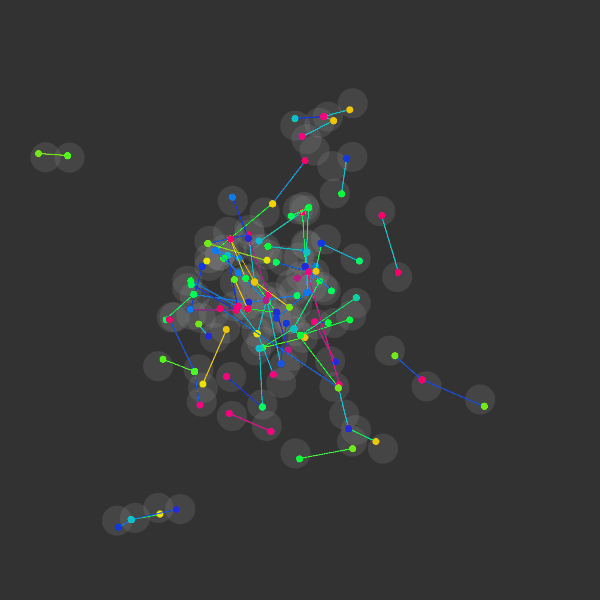

096: [code](https://github.com/villares/sketch-a-day/tree/master/2018/s096)  [[Py.Processing](https://villares.github.io/como-instalar-o-processing-modo-python/index-EN)]

More 'Inputs' helper changes (WASD & arrows for sliders). New GIF export helper actually works now!
More lone nodes and edge creation changes...

----


095: [code](https://github.com/villares/sketch-a-day/tree/master/2018/s095)  [[Py.Processing](https://villares.github.io/como-instalar-o-processing-modo-python/index-EN)]

Complete rewrite of the 'Inputs' helper

```
# Ask user for Arduino port, uses slider if none is selected, use on `setup()`
global input
input = Input(Arduino)

# on `draw()`read analog pins 1, 2, 3, 4 or sliders
pot1 = input.analog(1)
pot2 = input.analog(2)
pot3 = input.analog(3)
pot4 = input.analog(4)

tilt = input.digital(13) # also triggered by [space bar]

# When on sliders, this draws them and checks mouse dragging / keystrokes
input.update()

```

----


094: [code](https://github.com/villares/sketch-a-day/tree/master/2018/s094)  [[Py.Processing](https://villares.github.io/como-instalar-o-processing-modo-python/index-EN)]

Connection 'rate' can be less than 1, prevents less than 2 nodes

----


093: [code](https://github.com/villares/sketch-a-day/tree/master/2018/s093)  [[Py.Processing](https://villares.github.io/como-instalar-o-processing-modo-python/index-EN)]

Nodes without connection are now removed

```
    COM_ARESTAS = set()  # para guardar pontos com aresta
    for aresta in Aresta.ARESTAS:
        if (aresta.p1 not in Ponto.SET) or (aresta.p2 not in Ponto.SET)\
                or (aresta.p1 is aresta.p2):  # arestas degeneradas
            Aresta.ARESTAS.remove(aresta)   # remove a aresta
        else:                # senão, tudo OK!
            aresta.desenha()  # desenha a linha
            aresta.puxa_empurra(TAM_ARESTA)  # altera a velocidade dos pontos
            # Adiciona ao conjunto de pontos com aresta
            COM_ARESTAS.update([aresta.p1, aresta.p2])
    Ponto.SET = COM_ARESTAS  # isto remove pontos sem nenhuma aresta
 
```


----


092: [code](https://github.com/villares/sketch-a-day/tree/master/2018/s092)  [[Py.Processing](https://villares.github.io/como-instalar-o-processing-modo-python/index-EN)]

Dynamic change of connection rate

```
if NUM_PONTOS * NUM_CONNECT > len(Aresta.ARESTAS):
        rnd_choice(list(Ponto.SET)).cria_arestas()
    elif NUM_PONTOS * NUM_CONNECT < len(Aresta.ARESTAS):
        Aresta.ARESTAS.remove(rnd_choice(Aresta.ARESTAS))
```

----

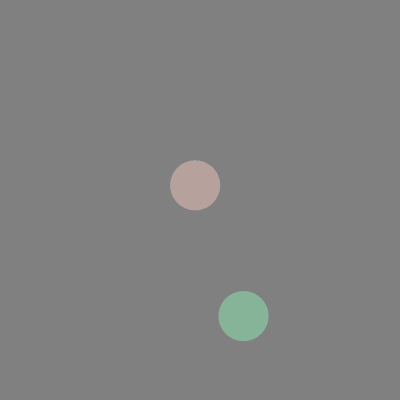

091: [code](https://github.com/villares/sketch-a-day/tree/master/2018/s091)  [[Py.Processing](https://villares.github.io/como-instalar-o-processing-modo-python/index-EN)]

Major rethink of my Arduino/Firmata code. I can now choose on start between sliders and potentiometers.

----

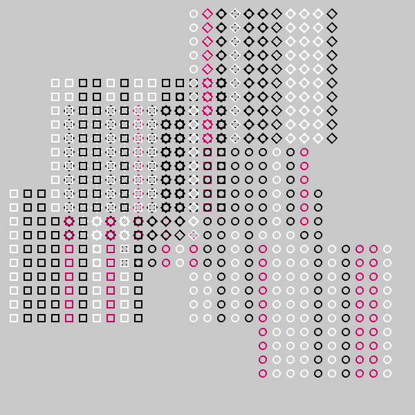

090: [code](https://github.com/villares/sketch-a-day/tree/master/2018/s090)  [[Py.Processing](https://villares.github.io/como-instalar-o-processing-modo-python/index-EN)]

Opaque strokes, no fill, randomized colours by column.

----


089: [code](https://github.com/villares/sketch-a-day/tree/master/2018/s089)  [[Py.Processing](https://villares.github.io/como-instalar-o-processing-modo-python/index-EN)]

X stroke now is translucent and grid elements have random colour inside grids.

----


088: [code](https://github.com/villares/sketch-a-day/tree/master/2018/s088)  [[Py.Processing](https://villares.github.io/como-instalar-o-processing-modo-python/index-EN)]

Filled rects, ellipses and losangles (without sktroke) and Xs

----


087: [code](https://github.com/villares/sketch-a-day/tree/master/2018/s087)  [[Py.Processing](https://villares.github.io/como-instalar-o-processing-modo-python/index-EN)]

No fill again, less colours. Variable/random number of elements per grid.

----

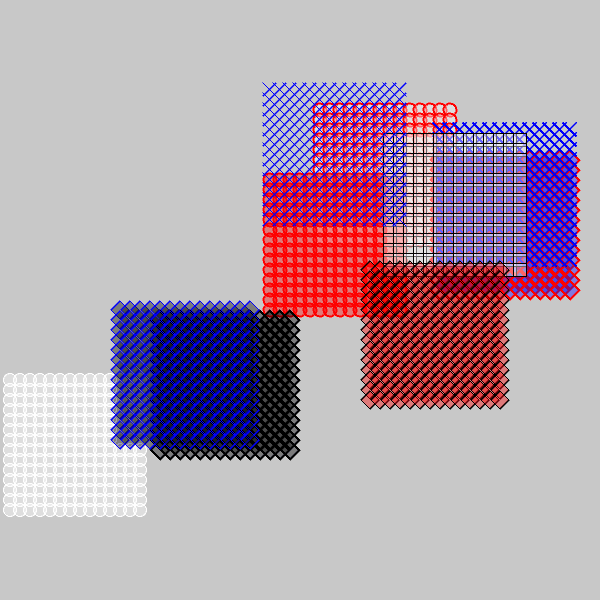

086: [code](https://github.com/villares/sketch-a-day/tree/master/2018/s086)  [[Py.Processing](https://villares.github.io/como-instalar-o-processing-modo-python/index-EN)]

Translucent fill & some stroke weight

----


085: [code](https://github.com/villares/sketch-a-day/tree/master/2018/s085)  [[Py.Processing](https://villares.github.io/como-instalar-o-processing-modo-python/index-EN)]

Some colour, and some crazy meddling with the Slider class...

----


084: [code](https://github.com/villares/sketch-a-day/tree/master/2018/s084)  [[Py.Processing](https://villares.github.io/como-instalar-o-processing-modo-python/index-EN)]

Make the grid's position/origin align based on the spacing size (super- grid)

----


083: [code](https://github.com/villares/sketch-a-day/tree/master/2018/s083)  [[Py.Processing](https://villares.github.io/como-instalar-o-processing-modo-python/index-EN)]

Xs and rotated rectangles

----


082: [code](https://github.com/villares/sketch-a-day/tree/master/2018/s082)  [[Py.Processing](https://villares.github.io/como-instalar-o-processing-modo-python/index-EN)]

Squares and ellipses

----

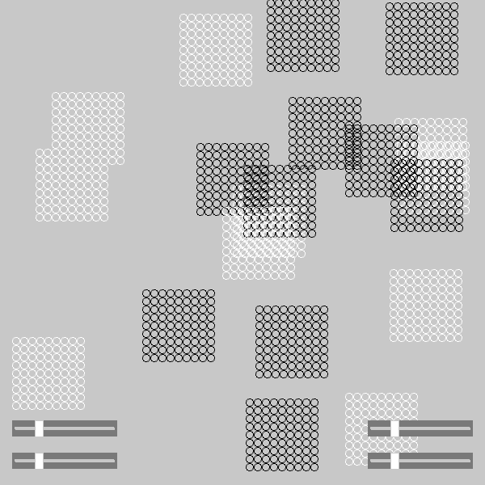

081: [code](https://github.com/villares/sketch-a-day/tree/master/2018/s081)  [[Py.Processing](https://villares.github.io/como-instalar-o-processing-modo-python/index-EN)]

Let's try some grids

----


080: [code](https://github.com/villares/sketch-a-day/tree/master/2018/s080)  [[Py.Processing](https://villares.github.io/como-instalar-o-processing-modo-python/index-EN)]

More arrows (black and white alternate by generation)

----


079: [code](https://github.com/villares/sketch-a-day/tree/master/2018/s079)  [[Py.Processing](https://villares.github.io/como-instalar-o-processing-modo-python/index-EN)]

Arrows (right black, left white)

----


078: [code](https://github.com/villares/sketch-a-day/tree/master/2018/s078)  [[Py.Processing](https://villares.github.io/como-instalar-o-processing-modo-python/index-EN)]

Color

----

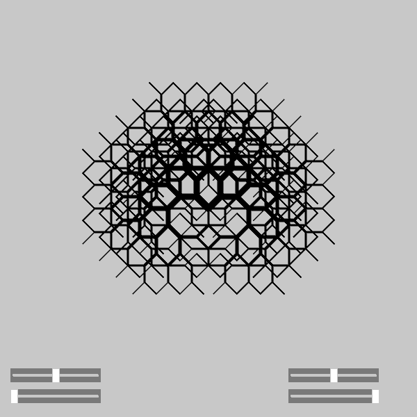

077: [code](https://github.com/villares/sketch-a-day/tree/master/2018/s077)  [[Py.Processing](https://villares.github.io/como-instalar-o-processing-modo-python/index-EN)]

Random branch reduction is now less simmetric, and random seed changes on depth change.

----

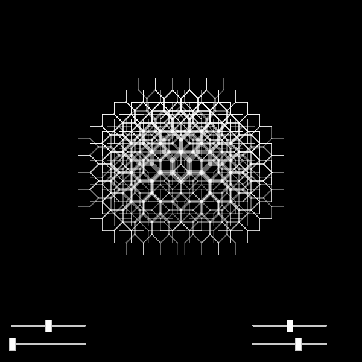

076: [code](https://github.com/villares/sketch-a-day/tree/master/2018/s076)  [[Py.Processing](https://villares.github.io/como-instalar-o-processing-modo-python/index-EN)]

Stroke weight and some transparency

----


075: [code](https://github.com/villares/sketch-a-day/tree/master/2018/s075)  [[Py.Processing](https://villares.github.io/como-instalar-o-processing-modo-python/index-EN)]

... and slightly different parameters and recursion level control instead of lenght

----


074: [code](https://github.com/villares/sketch-a-day/tree/master/2018/s074)  [[Py.Processing](https://villares.github.io/como-instalar-o-processing-modo-python/index-EN)]

Adaptomg Shiffmans recusive Tree, with sliders or Pots...

----


073: [code](https://github.com/villares/sketch-a-day/tree/master/2018/s073)  [[Py.Processing](https://villares.github.io/como-instalar-o-processing-modo-python/index-EN)]

The code remains ugly :(

----

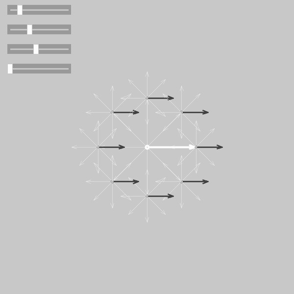

072: [code](https://github.com/villares/sketch-a-day/tree/master/2018/s072)  [[Py.Processing](https://villares.github.io/como-instalar-o-processing-modo-python/index-EN)]

Let's mix some arrows?

----


071: [code](https://github.com/villares/sketch-a-day/tree/master/2018/s071)  [[Py.Processing](https://villares.github.io/como-instalar-o-processing-modo-python/index-EN)]

Thicker and with a saturation slider (no more scale offset)

----


070: [code](https://github.com/villares/sketch-a-day/tree/master/2018/s070)  [[Py.Processing](https://villares.github.io/como-instalar-o-processing-modo-python/index-EN)]

Thicker and with a saturation slider (no more scale offset)

----

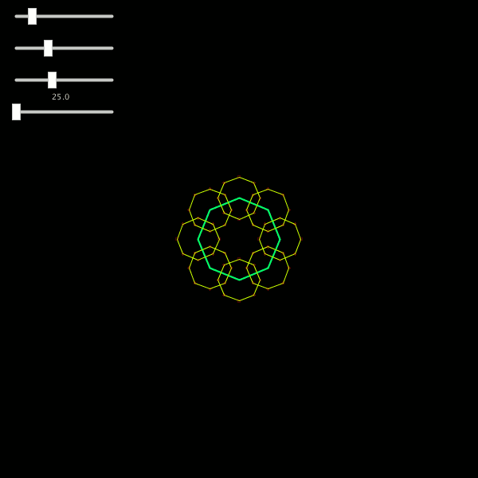

069: [code](https://github.com/villares/sketch-a-day/tree/master/2018/s069)  [[Py.Processing](https://villares.github.io/como-instalar-o-processing-modo-python/index-EN)]

Added rotation.

----


068: [code](https://github.com/villares/sketch-a-day/tree/master/2018/s068)  [[Py.Processing](https://villares.github.io/como-instalar-o-processing-modo-python/index-EN)]

... and with sliders (by [Peter Farell](https://github.com/hackingmath/python-sliders))

----


067: [code](https://github.com/villares/sketch-a-day/tree/master/2018/s067)  [[Py.Processing](https://villares.github.io/como-instalar-o-processing-modo-python/index-EN)]

Something else.

----

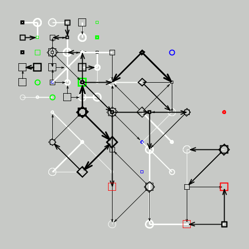

066: [code](https://github.com/villares/sketch-a-day/tree/master/2018/s066)  [[Py.Processing](https://villares.github.io/como-instalar-o-processing-modo-python/index-EN)]

Arrow grid networks can be sized and placed...

----

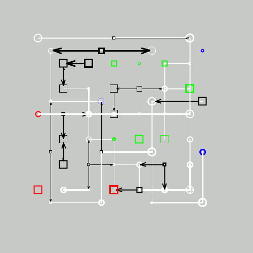

065: [code](https://github.com/villares/sketch-a-day/tree/master/2018/s065)  [[Py.Processing](https://villares.github.io/como-instalar-o-processing-modo-python/index-EN)]

Arrow grid networks are now objects...

----


064: [code](https://github.com/villares/sketch-a-day/tree/master/2018/s064)  [[Py.Processing](https://villares.github.io/como-instalar-o-processing-modo-python/index-EN)]

Revisiting yet an older graph, adding arrows...

----

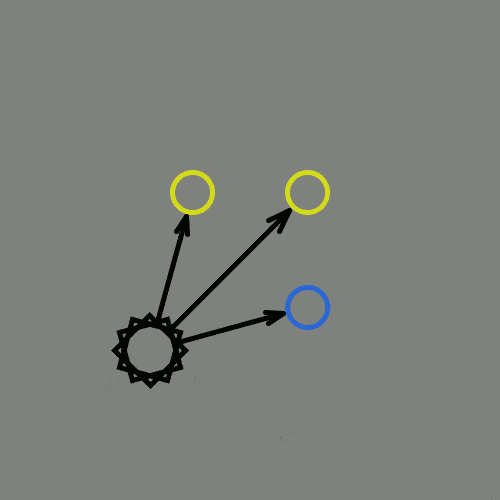

063: [code](https://github.com/villares/sketch-a-day/tree/master/2018/s063)  [[Py.Processing](https://villares.github.io/como-instalar-o-processing-modo-python/index-EN)]

Revisiting an older graph adding arrows...

----


062: [code](https://github.com/villares/sketch-a-day/tree/master/2018/s062)  [[Py.Processing](https://villares.github.io/como-instalar-o-processing-modo-python/index-EN)]

`+` and `-` keys control the distange/range of targes in 0.5 * SPACING increments

----


061: [code](https://github.com/villares/sketch-a-day/tree/master/2018/s061)  [[Py.Processing](https://villares.github.io/como-instalar-o-processing-modo-python/index-EN)]

Sometimes we have multiple arrows now out of each node...But I reduced the range (distance) they can point to.

----

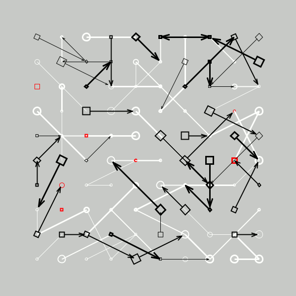

060: [code](https://github.com/villares/sketch-a-day/tree/master/2018/s060)  [[Py.Processing](https://villares.github.io/como-instalar-o-processing-modo-python/index-EN)]

Complete Object Oriented refactor...

----


059: [code](https://github.com/villares/sketch-a-day/tree/master/2018/s059)  [[Py.Processing](https://villares.github.io/como-instalar-o-processing-modo-python/index-EN)]

Back to a list of points, now every point of the grid has a node. Limited points_to random each.

----


058: [code](https://github.com/villares/sketch-a-day/tree/master/2018/s058)  [[Py.Processing](https://villares.github.io/como-instalar-o-processing-modo-python/index-EN)]

Now with some deepcopy of changeable imutable namedtuples (containing mutable lists), and some lerp()

----

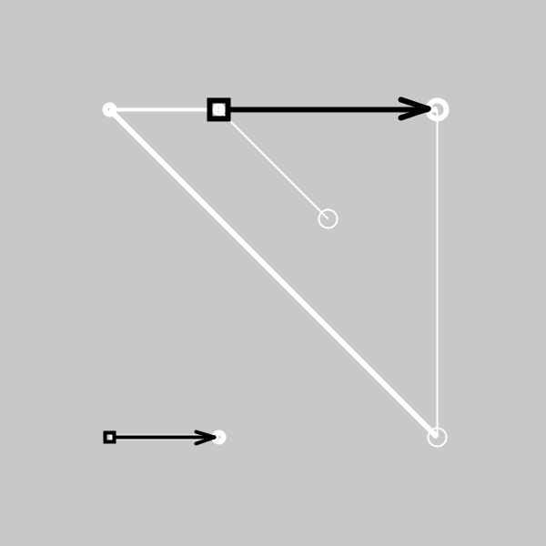

057: [code](https://github.com/villares/sketch-a-day/tree/master/2018/s057)  [[Py.Processing](https://villares.github.io/como-instalar-o-processing-modo-python/index-EN)]

Revisited 54 and now I'm re-selecting random points_to nodes...

----


056: [code](https://github.com/villares/sketch-a-day/tree/master/2018/s056)  [[Py.Processing](https://villares.github.io/como-instalar-o-processing-modo-python/index-EN)]

Arrow grid moving in HSB colour space

----


055: [code](https://github.com/villares/sketch-a-day/tree/master/2018/s055)  [[Py.Processing](https://villares.github.io/como-instalar-o-processing-modo-python/index-EN)]

Grid revisited

----


054: [code](https://github.com/villares/sketch-a-day/tree/master/2018/s054)  [[Py.Processing](https://villares.github.io/como-instalar-o-processing-modo-python/index-EN)]

New arrows! With a "Tail" parameter...

----

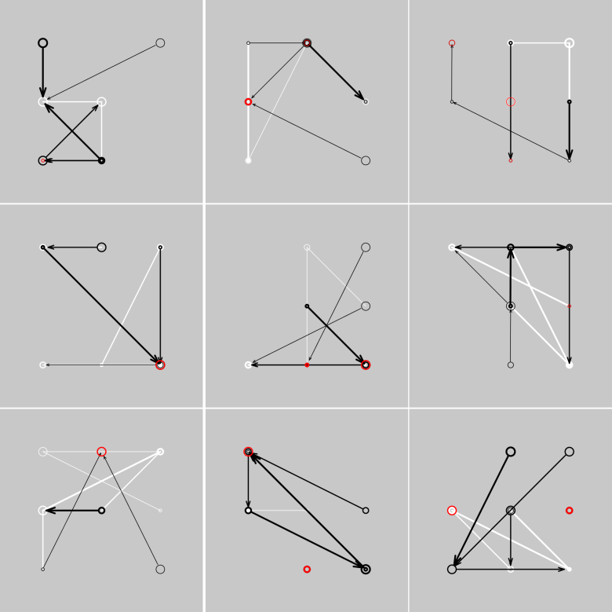

053: [code](https://github.com/villares/sketch-a-day/tree/master/2018/s053)  [[Py.Processing](https://villares.github.io/como-instalar-o-processing-modo-python/index-EN)]

Big invisible refactor (no more point-grid to select from, now a list of possible X and Y positons to choose).
On the visible side, fewer elements, and non-pointing elements redrawn in red on top.

----


052: [code](https://github.com/villares/sketch-a-day/tree/master/2018/s052)  [[Py.Processing](https://villares.github.io/como-instalar-o-processing-modo-python/index-EN)]

White lines first, black arrows on top.

----


051: [code](https://github.com/villares/sketch-a-day/tree/master/2018/s051)  [[Py.Processing](https://villares.github.io/como-instalar-o-processing-modo-python/index-EN)]

Points  now on a grid.

----


050: [code](https://github.com/villares/sketch-a-day/tree/master/2018/s050)  [[Py.Processing](https://villares.github.io/como-instalar-o-processing-modo-python/index-EN)]

Arrows now...

----


049: [code](https://github.com/villares/sketch-a-day/tree/master/2018/s049)  [[Py.Processing](https://villares.github.io/como-instalar-o-processing-modo-python/index-EN)]
Yet more graphs

----

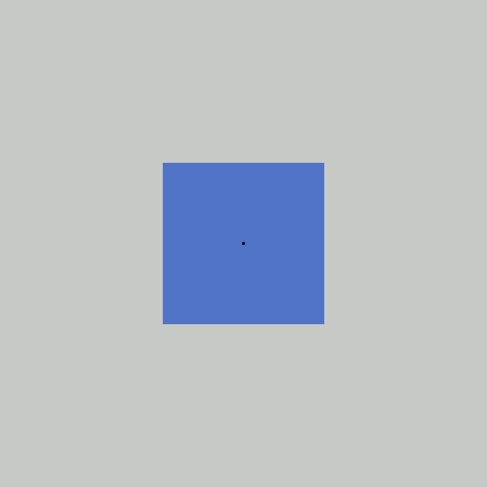

048: [code](https://github.com/villares/sketch-a-day/tree/master/2018/s048)  [[Py.Processing](https://villares.github.io/como-instalar-o-processing-modo-python/index-EN)]
Yet more graphs

----


047: [code](https://github.com/villares/sketch-a-day/tree/master/2018/s047)  [[Py.Processing](https://villares.github.io/como-instalar-o-processing-modo-python/index-EN)]
Yet more graphs

----

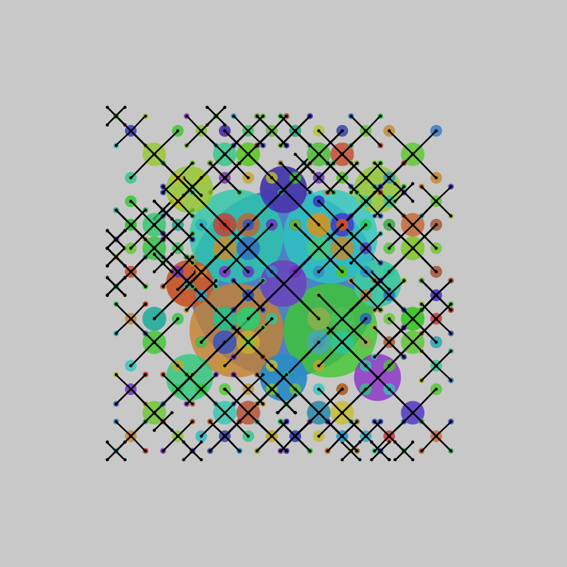

046: [code](https://github.com/villares/sketch-a-day/tree/master/2018/s046)  [[Py.Processing](https://villares.github.io/como-instalar-o-processing-modo-python/index-EN)]
Yet more graphs

----

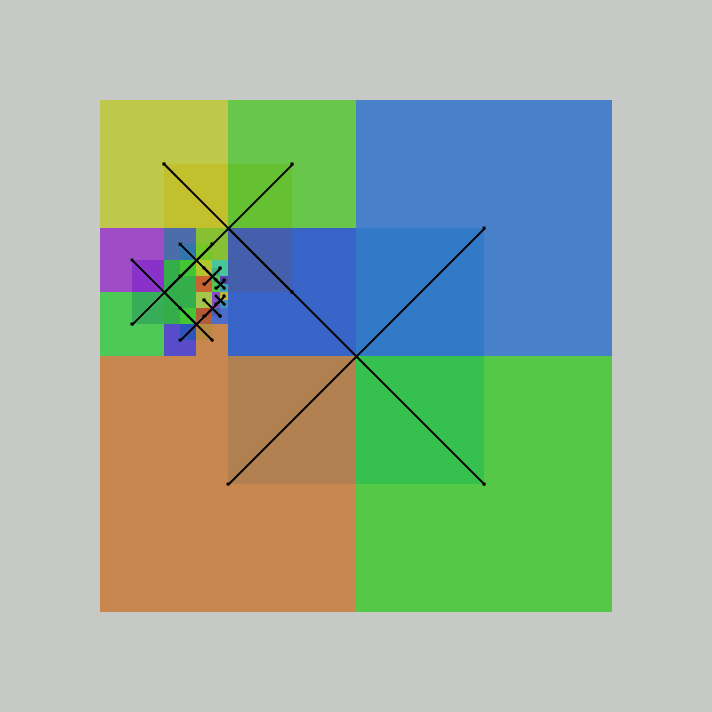

045: [code](https://github.com/villares/sketch-a-day/tree/master/2018/s045)  [[Py.Processing](https://villares.github.io/como-instalar-o-processing-modo-python/index-EN)]
Yet more graphs

----


044: [code](https://github.com/villares/sketch-a-day/tree/master/2018/s044)  [[Py.Processing](https://villares.github.io/como-instalar-o-processing-modo-python/index-EN)]
More graphs

----


043: [code](https://github.com/villares/sketch-a-day/tree/master/2018/s043)  [[Py.Processing](https://villares.github.io/como-instalar-o-processing-modo-python/index-EN)]
More graphs

----

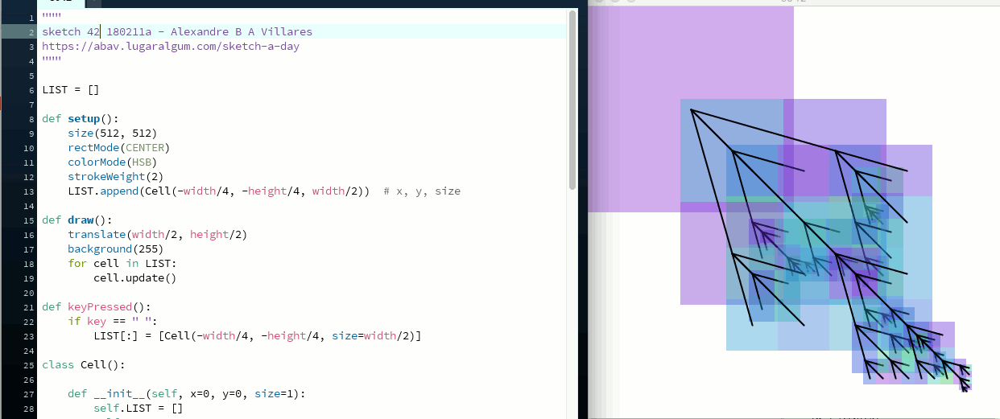

042: [code](https://github.com/villares/sketch-a-day/tree/master/2018/s042)  [[Py.Processing](https://villares.github.io/como-instalar-o-processing-modo-python/index-EN)]
Yet another interactive recursive thingy, the image on the right is shown with a key pressed

----

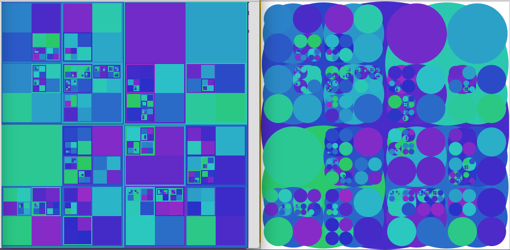


041: [code](https://github.com/villares/sketch-a-day/tree/master/2018/s041)  [[Py.Processing](https://villares.github.io/como-instalar-o-processing-modo-python/index-EN)]
Yet another interactive recursive thingy, the image on the right is shown with a key pressed

----


040: [sketch_180209a](https://github.com/villares/sketch-a-day/tree/master/2018/sketch_180209a)  [[Py.Processing](https://villares.github.io/como-instalar-o-processing-modo-python/index-EN)]
More recursion

----


039: [sketch_180208e](https://github.com/villares/sketch-a-day/tree/master/2018/sketch_180208e)  [[Py.Processing](https://villares.github.io/como-instalar-o-processing-modo-python/index-EN)]
Manoloide  inspired recursion

----

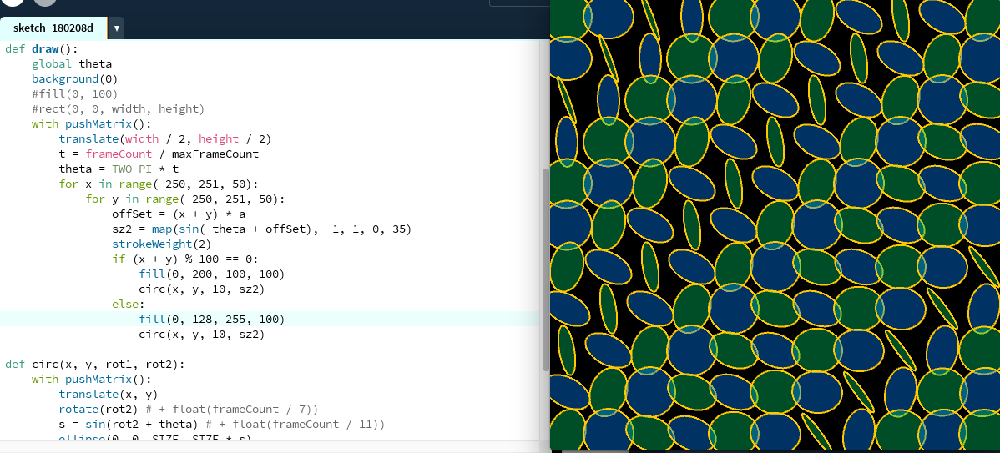

038: [sketch_180208d](https://github.com/villares/sketch-a-day/tree/master/2018/sketch_180208d)  [[Py.Processing](https://villares.github.io/como-instalar-o-processing-modo-python/index-EN)]
Saskia Freeke inspired grid

----


037: [sketch_180206b](https://github.com/villares/sketch-a-day/tree/master/2018/sketch_180206a)  [[Py.Processing](https://villares.github.io/como-instalar-o-processing-modo-python/index-EN)]
"Carnahacking is near!"

----


036: [sketch_180205b](https://github.com/villares/sketch-a-day/tree/master/2018/sketch_180205b)  [[Py.Processing](https://villares.github.io/como-instalar-o-processing-modo-python/index-EN)]
Added some mouse disturbance

----


035: [sketch_180204b](https://github.com/villares/sketch-a-day/tree/master/2018/sketch_180204b)  [[Py.Processing](https://villares.github.io/como-instalar-o-processing-modo-python/index-EN)]
Preparing for "Carnahacking"

----


034: [sketch_180203c](https://github.com/villares/sketch-a-day/tree/master/2018/sketch_180203c)  [[Py.Processing](https://villares.github.io/como-instalar-o-processing-modo-python/index-EN)]
Like 33 but again with "w squared" circles

----

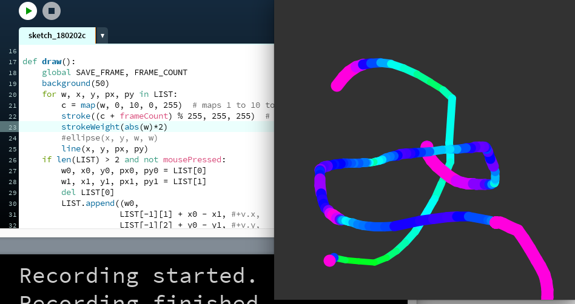

033: [sketch_180202c](https://github.com/villares/sketch-a-day/tree/master/2018/sketch_180202c)  [[Py.Processing](https://villares.github.io/como-instalar-o-processing-modo-python/index-EN)]
Like 32 but again with lines

----


032: [sketch_180201c](https://github.com/villares/sketch-a-day/tree/master/2018/sketch_180201c)  [[Py.Processing](https://villares.github.io/como-instalar-o-processing-modo-python/index-EN)]
Like 29 but with moving points after the gesture is done

----


031: [sketch_180130c](https://github.com/villares/sketch-a-day/tree/master/2018/sketch_180131c)  [[Py.Processing](https://villares.github.io/como-instalar-o-processing-modo-python/index-EN)]
Like 29 but with moving points after the gesture is done

----

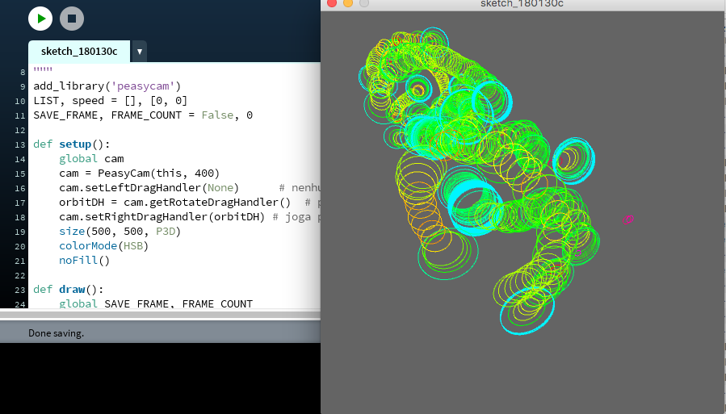

030: [sketch_180130c](https://github.com/villares/sketch-a-day/tree/master/2018/sketch_180130c)  [[Py.Processing](https://villares.github.io/como-instalar-o-processing-modo-python/index-EN)]
Like 29 but with 3D and PeasyCam orbit...

----


029: [sketch_180129c](https://github.com/villares/sketch-a-day/tree/master/2018/sketch_180129c)  [[Py.Processing](https://villares.github.io/como-instalar-o-processing-modo-python/index-EN)]
Like 27 but with circles

----

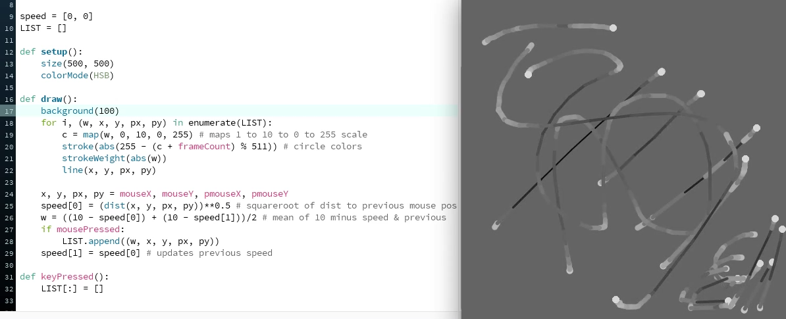

028: [sketch_180128c](https://github.com/villares/sketch-a-day/tree/master/2018/sketch_180128c)  [[Py.Processing](https://villares.github.io/como-instalar-o-processing-modo-python/index-EN)]
Like 27 but on grayscale

----

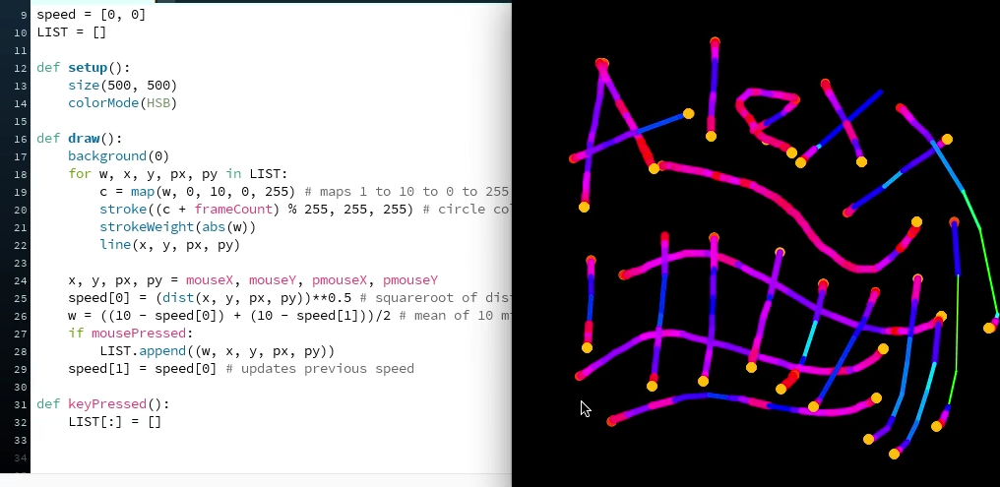

027: [sketch_180127c](https://github.com/villares/sketch-a-day/tree/master/2018/sketch_180127c)  [[Py.Processing](https://villares.github.io/como-instalar-o-processing-modo-python/index-EN)][YouTube](https://www.youtube.com/watch?v=A-rqkru79Dw)

Saving a list of points to animate colour... Mouse speed changes recorded colour &  strokeWeight()

----

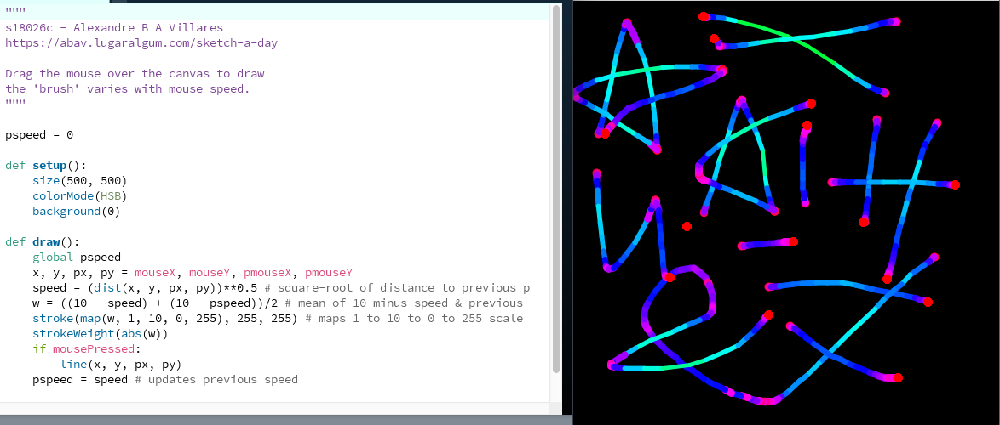

026: [sketch_180126c](https://github.com/villares/sketch-a-day/tree/master/2018/sketch_180126c)  [[Py.Processing](https://villares.github.io/como-instalar-o-processing-modo-python/index-EN)]
Mouse speed changing colour &  strokeWeight()

----


025c: [sketch_180125b](https://github.com/villares/sketch-a-day/tree/master/2018/sketch_180125c)  [[Py.Processing](https://villares.github.io/como-instalar-o-processing-modo-python/index-EN)]
Mouse speed changing strokeWeight()

----


024b: [sketch_180124b](https://github.com/villares/sketch-a-day/tree/master/2018/sketch_180124b)  [[Py.Processing](https://villares.github.io/como-instalar-o-processing-modo-python/index-EN)]  Maybe tomorrow I'll try adding some sliders & movement to this graph ? [nah...]

----


023b: [sketch_180123b](https://github.com/villares/sketch-a-day/tree/master/2018/sketch_180123b)  [[Py.Processing](https://villares.github.io/como-instalar-o-processing-modo-python/index-EN)]  Farrel's Sliders adding random displacement

----

022: missed :(

----


021b: [sketch_180121b](https://github.com/villares/sketch-a-day/tree/master/2018/sketch_180121b)  [[Py.Processing](https://villares.github.io/como-instalar-o-processing-modo-python/index-EN)]
Playing with Peter "[Hacking Math Class](http://twitter.com/hackingmath)" Farrel's Sliders!

----


020b: [sketch_180120b](https://github.com/villares/sketch-a-day/tree/master/2018/sketch_180120b)  [[Py.Processing](https://villares.github.io/como-instalar-o-processing-modo-python/index-EN)]
I was stuck on my DBN conversion sketch 20a, so this HSB shape play is 20b...

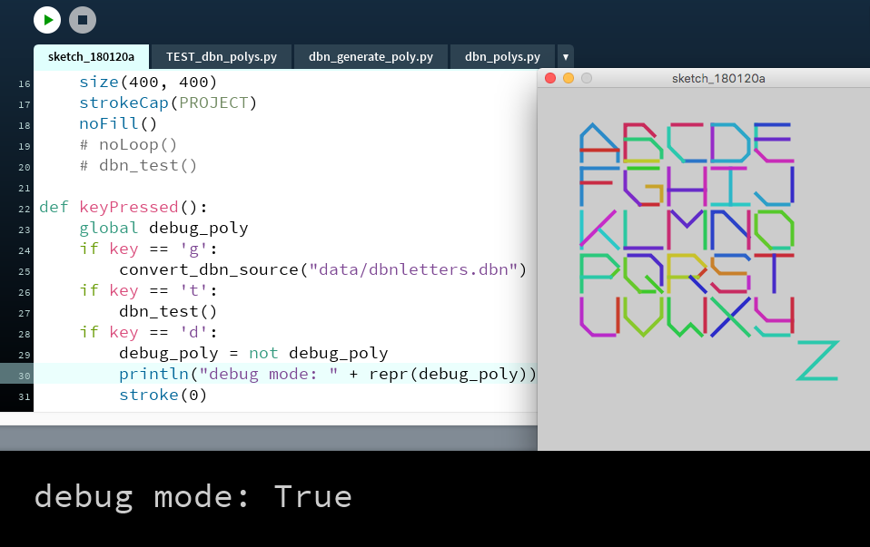

020a: [sketch_180120a](https://github.com/villares/sketch-a-day/tree/master/2018/sketch_180120a)  [[Py.Processing](https://villares.github.io/como-instalar-o-processing-modo-python/index-EN)]
Refactored the code generation, removed most of the repeated vertices... C D E G O R not nice yet…

----


019: [sketch_180119a](https://github.com/villares/sketch-a-day/tree/master/2018/sketch_180119a)  [[Py.Processing](https://villares.github.io/como-instalar-o-processing-modo-python/index-EN)] DBN Letters: Now working on a new approach, generating vertex/Shape code, not there yet...

----

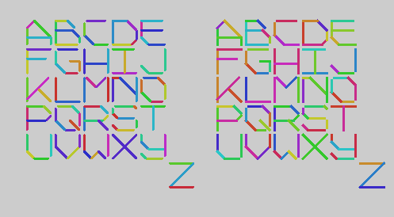

018: [sketch_180118a](https://github.com/villares/sketch-a-day/tree/master/2018/sketch_180118a)  [[Py.Processing](https://villares.github.io/como-instalar-o-processing-modo-python/index-EN)] DBN Color font? Nah…

----

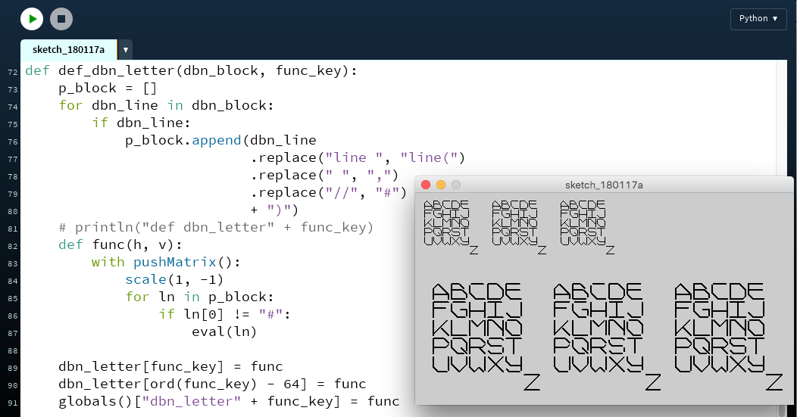

017: [sketch_180117a](https://github.com/villares/sketch-a-day/tree/master/2018/sketch_180117a)  [[Py.Processing](https://villares.github.io/como-instalar-o-processing-modo-python/index-EN)] John Maeda's `dbnletters.dbn` code from Design by Numbers on Processing Python Mode

----

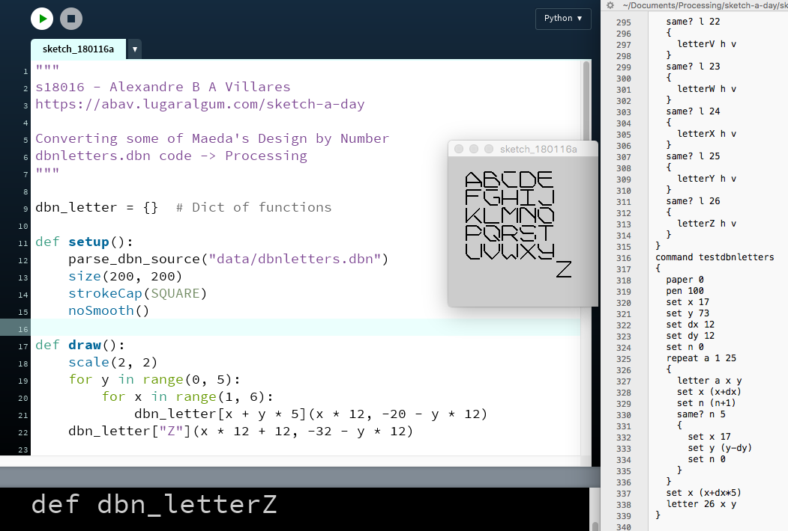

016: [16a](https://github.com/villares/sketch-a-day/tree/master/2018/sketch_180116a)  [[Py.Processing](https://villares.github.io/como-instalar-o-processing-modo-python/index-EN)] Converting some Typography code from Design by Numbers, almost there!

----

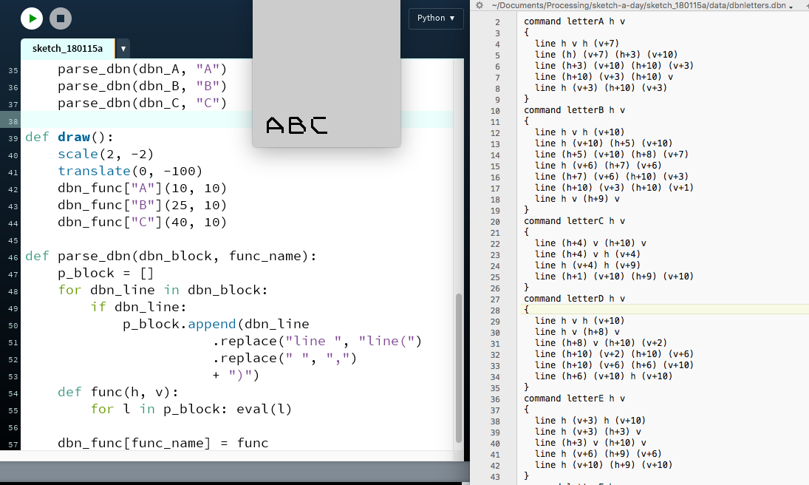

015: [sketch_180115a](https://github.com/villares/sketch-a-day/tree/master/2018/sketch_180115a)  [[Py.Processing](https://villares.github.io/como-instalar-o-processing-modo-python/index-EN)] Converting some Typography code from Design by Numbers, first trials

----


014: [sketch_180114a](https://github.com/villares/sketch-a-day/tree/master/2018/sketch_180114a)  [[Py.Processing](https://villares.github.io/como-instalar-o-processing-modo-python/index-EN)] Another 3D Graph

----


013: [s180113](https://github.com/villares/sketch-a-day/tree/master/2018/sketch_180113a)  [[Py.Processing](https://villares.github.io/como-instalar-o-processing-modo-python/index-EN)] 3D Graph

----


012: [s180112](https://github.com/villares/sketch-a-day/tree/master/2018/s180112)  [[Py.Processing](https://villares.github.io/como-instalar-o-processing-modo-python/index-EN)] Another Graph Take

----

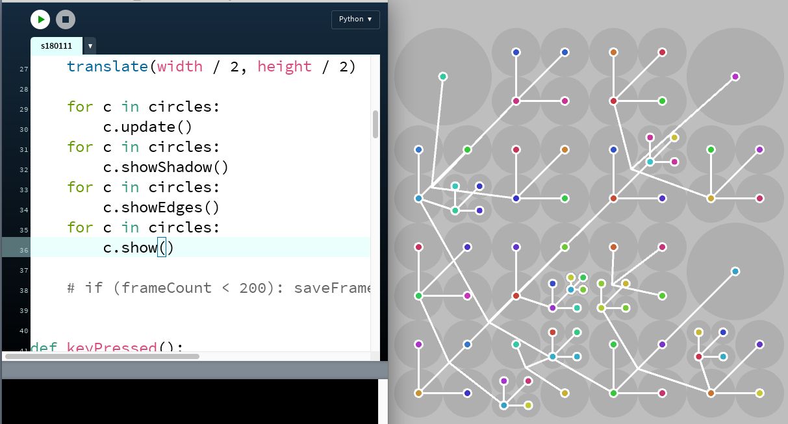

011: [s180111](https://github.com/villares/sketch-a-day/tree/master/2018/s180111)  [[Py.Processing](https://villares.github.io/como-instalar-o-processing-modo-python/index-EN)] A Graph Take

----


010: [s180110](https://github.com/villares/sketch-a-day/tree/master/2018/s180110)  [[Py.Processing](https://villares.github.io/como-instalar-o-processing-modo-python/index-EN)]  More Manoloide inspired balls [PNG](2018/s180110/s180110.png) (derived from a [sketch](https://gist.github.com/manoloide/16ea9e1d68c6ba1700fcb008fd38aab0) by [Manuel Gamboa Naon](http://manoloide.com))

----


009: [s180109](https://github.com/villares/sketch-a-day/tree/master/2018/s180109)  [[Py.Processing](https://villares.github.io/como-instalar-o-processing-modo-python/index-EN)]  Balls for Manoloide  [GIF](2018/s180109/s180109.gif) (derived from a [sketch](https://gist.github.com/manoloide/16ea9e1d68c6ba1700fcb008fd38aab0) by [Manuel Gamboa Naon](http://manoloide.com))

----


008: [s180108](https://github.com/villares/sketch-a-day/tree/master/2018/s180108)  [[Py.Processing](https://villares.github.io/como-instalar-o-processing-modo-python/index-EN)]   Grid of Platonic Solids in Python Mode [GIF](2018/s180108/s180108.gif)

----


007: [s180107](https://github.com/villares/sketch-a-day/tree/master/2018/s180107) [[Processing Java](https://www.processing.org)]  Another grid of Platonic Solids in Java Mode [GIF](2018/s180107/s180107.gif)

----


006: [s180106](https://github.com/villares/sketch-a-day/tree/master/2018/s180106) [[Processing Java](https://www.processing.org)]  Grid of Platonic Solids in Java Mode  [GIF](2018/s180106/s180106.gif)

----

005: [s180105](https://github.com/villares/sketch-a-day/tree/master/2018/s180105) [[p5js](https://www.p5js.org)] Line Tetrahedrons in p5*js - [interactive](https://villares.github.io/sketch-a-day/s180105/s180105)

----

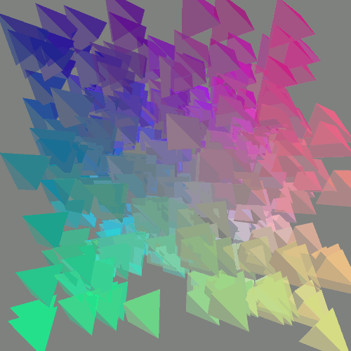

004: [s180104](https://github.com/villares/sketch-a-day/tree/master/2018/s180104) [[Processing Java](https://www.processing.org)] Tetrahedrons in Java Mode- [GIF](https://github.com/villares/sketch-a-day/tree/master/2018/s180104/s180104.gif)

----


003: [s180103](https://github.com/villares/sketch-a-day/tree/master/2018/s180103) [[Py.Processing](https://villares.github.io/como-instalar-o-processing-modo-python/index-EN)] Tetrahedrons  Python Mode- [GIF](https://github.com/villares/sketch-a-day/tree/master/2018/s180103/s180103.gif)

----

002: [s180102](https://github.com/villares/sketch-a-day/tree/master/2018/s180102) [[Py.Processing](https://villares.github.io/como-instalar-o-processing-modo-python/index-EN)] Many Stars 3D - [YouTube](https://www.youtube.com/watch?v=QmsthW60iBY)

----

001: [s180101](https://github.com/villares/sketch-a-day/tree/master/2018/s180101)[[Py.Processing](https://villares.github.io/como-instalar-o-processing-modo-python/index-EN)] Many Stars - [YouTube](https://www.youtube.com/watch?v=gKWBfghDV_w) (inspired by my own [p5js Xmas & New Year card code](https://github.com/villares/p5js-play/tree/master/newYearStars))
