# [sketch-a-day](https://abav.lugaralgum.com/sketch-a-day)

#### one visual idea a day

---

## [2018](2018.md) | 2019 | [2020](2020.md) | [2021](README.md) 

---

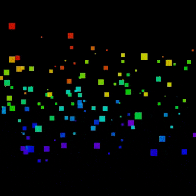

[sketch_191231c](https://github.com/villares/sketch-a-day/tree/master/2019/sketch_191231c) [[Py.Processing](https://villares.github.io/como-instalar-o-processing-modo-python/index-EN)]

---


[sketch_191230a](https://github.com/villares/sketch-a-day/tree/master/2019/sketch_191230a) [[Py.Processing](https://villares.github.io/como-instalar-o-processing-modo-python/index-EN)]

---

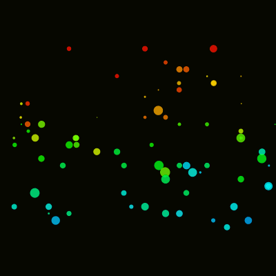

[sketch_191229a](https://github.com/villares/sketch-a-day/tree/master/2019/sketch_191229a) [[Py.Processing](https://villares.github.io/como-instalar-o-processing-modo-python/index-EN)]

Combining 191228 with 191226 :)

---

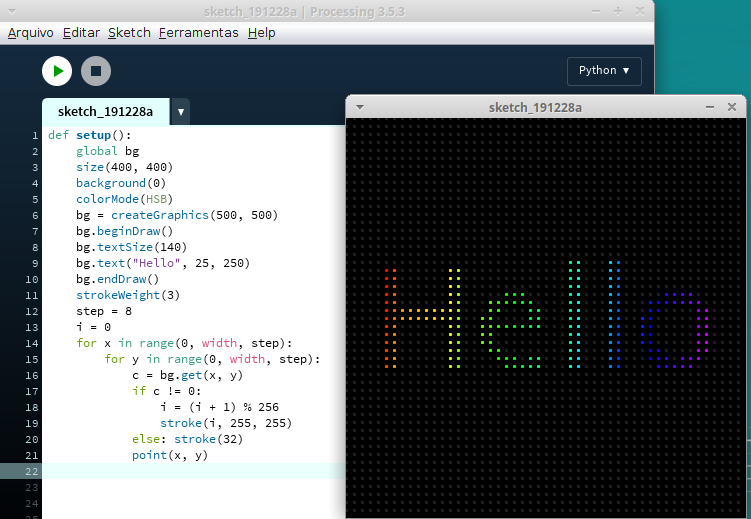

[sketch_191228a](https://github.com/villares/sketch-a-day/tree/master/2019/sketch_191228a) [[Py.Processing](https://villares.github.io/como-instalar-o-processing-modo-python/index-EN)]

---

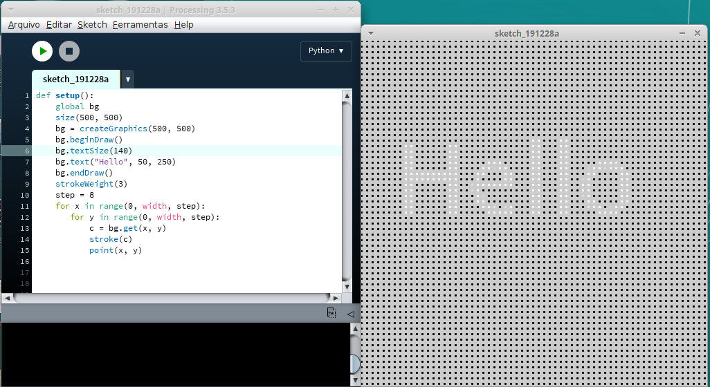

[sketch_191227a](https://github.com/villares/sketch-a-day/tree/master/2019/sketch_191227a) [[Py.Processing](https://villares.github.io/como-instalar-o-processing-modo-python/index-EN)]


---

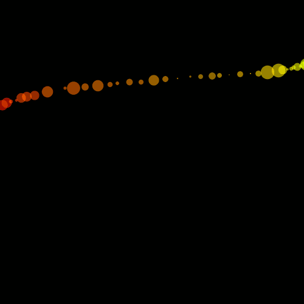

[sketch_191226c](https://github.com/villares/sketch-a-day/tree/master/2019/sketch_191226c) [[Py.Processing](https://villares.github.io/como-instalar-o-processing-modo-python/index-EN)]

"Lerping out" some gestures [deforming some hand drawn forms by using `lerp()` out of it's original 0 to 1 range]

---

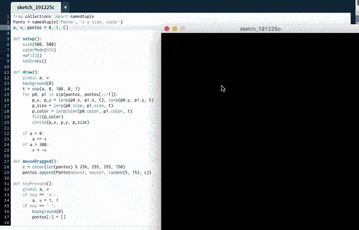

[sketch_191225c](https://github.com/villares/sketch-a-day/tree/master/2019/sketch_191225c) [[Py.Processing](https://villares.github.io/como-instalar-o-processing-modo-python/index-EN)]

Merry Christmas v2

---

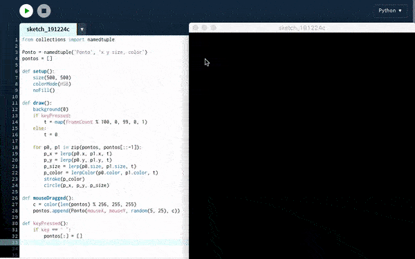

[sketch_191224c](https://github.com/villares/sketch-a-day/tree/master/2019/sketch_191224c) [[Py.Processing](https://villares.github.io/como-instalar-o-processing-modo-python/index-EN)]

Merry Christmas

---

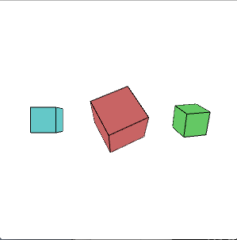

[sketch_191223a](https://github.com/villares/sketch-a-day/tree/master/2019/sketch_191223a) [[Py.Processing](https://villares.github.io/como-instalar-o-processing-modo-python/index-EN)]

Port of the Picker library example to Python Mode

---

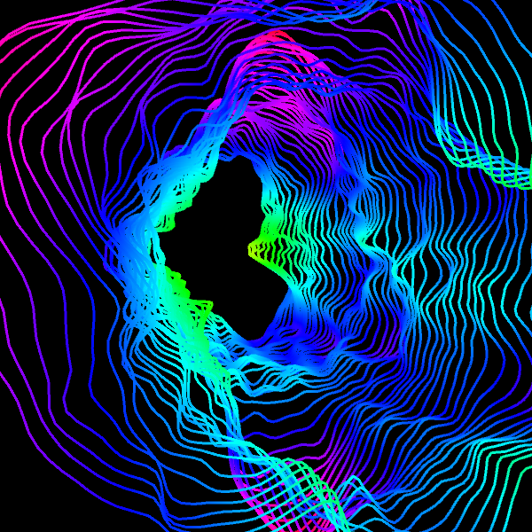

[sketch_191222a](https://github.com/villares/sketch-a-day/tree/master/2019/sketch_191222a) [[Py.Processing](https://villares.github.io/como-instalar-o-processing-modo-python/index-EN)]

---

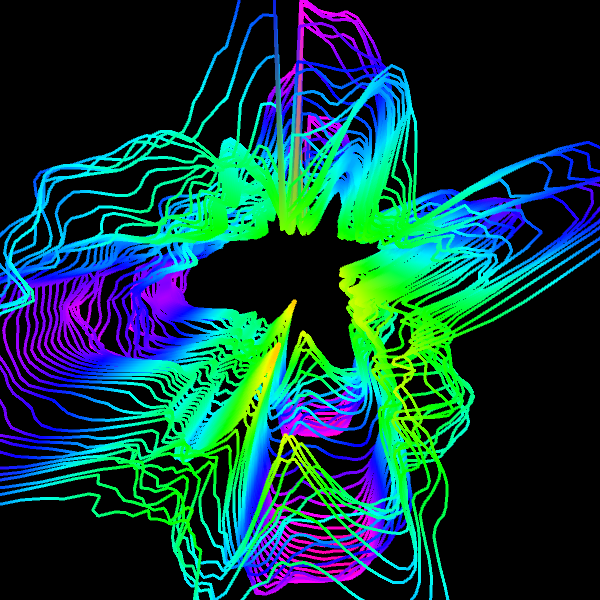

[sketch_191221a](https://github.com/villares/sketch-a-day/tree/master/2019/sketch_191221a) [[Py.Processing](https://villares.github.io/como-instalar-o-processing-modo-python/index-EN)]


---

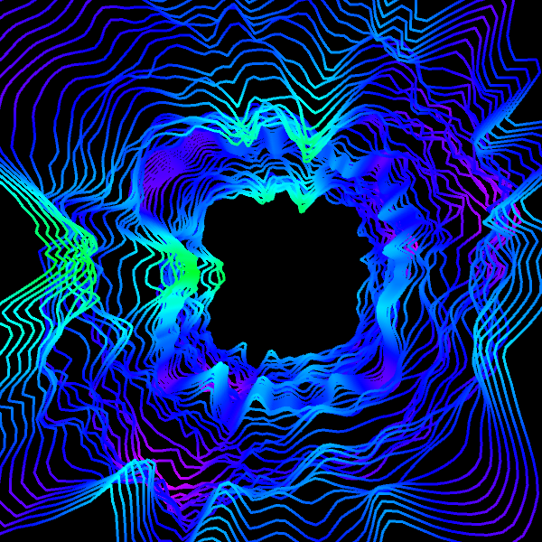

[sketch_191220a](https://github.com/villares/sketch-a-day/tree/master/2019/sketch_191220a) [[Py.Processing](https://villares.github.io/como-instalar-o-processing-modo-python/index-EN)]


---

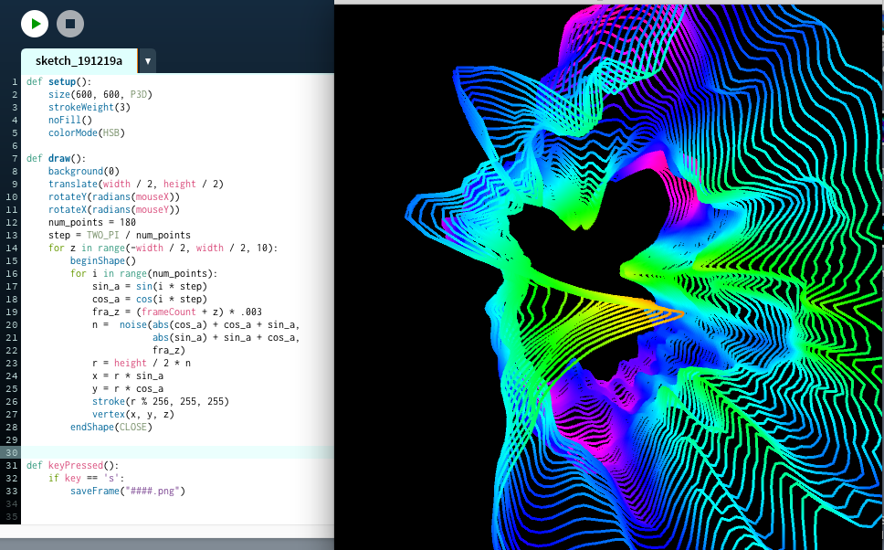

[sketch_191219a](https://github.com/villares/sketch-a-day/tree/master/2019/sketch_191219a) [[Py.Processing](https://villares.github.io/como-instalar-o-processing-modo-python/index-EN)]


---

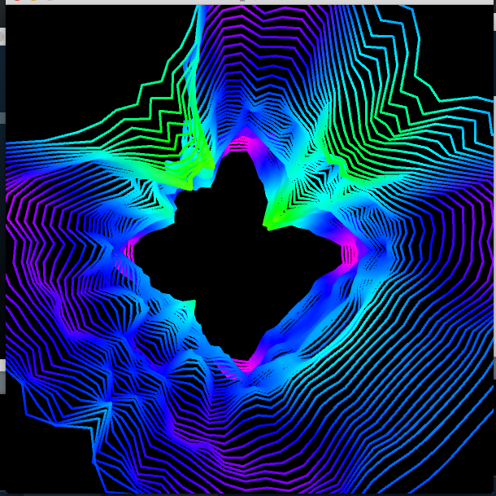

[sketch_191218a](https://github.com/villares/sketch-a-day/tree/master/2019/sketch_191218a) [[Py.Processing](https://villares.github.io/como-instalar-o-processing-modo-python/index-EN)]


---

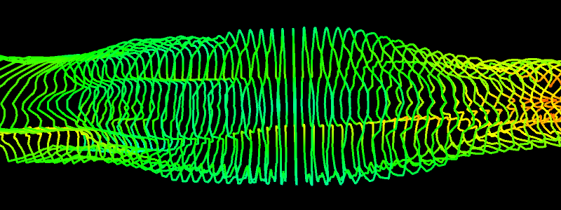

[sketch_191217a](https://github.com/villares/sketch-a-day/tree/master/2019/sketch_191217a) [[Py.Processing](https://villares.github.io/como-instalar-o-processing-modo-python/index-EN)]


---

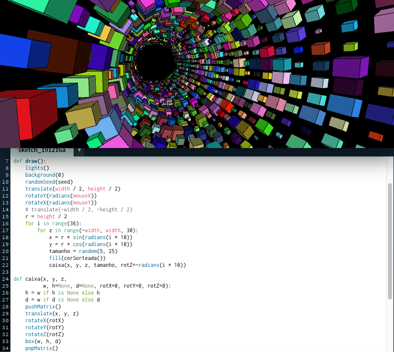

[sketch_191216a](https://github.com/villares/sketch-a-day/tree/master/2019/sketch_191216a) [[Py.Processing](https://villares.github.io/como-instalar-o-processing-modo-python/index-EN)]


---

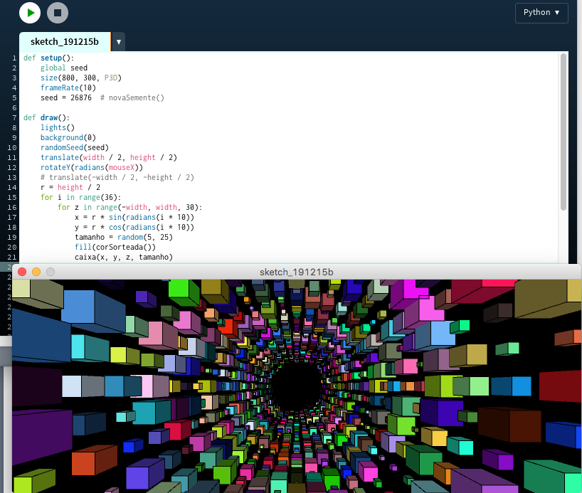

[sketch_191215b](https://github.com/villares/sketch-a-day/tree/master/2019/sketch_191215b) [[Py.Processing](https://villares.github.io/como-instalar-o-processing-modo-python/index-EN)]


---

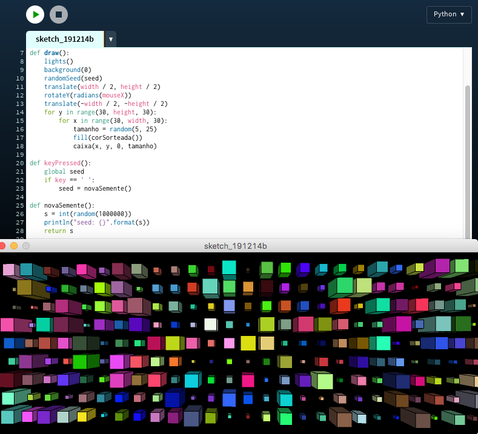

[sketch_191214b](https://github.com/villares/sketch-a-day/tree/master/2019/sketch_191214b) [[Py.Processing](https://villares.github.io/como-instalar-o-processing-modo-python/index-EN)]


---

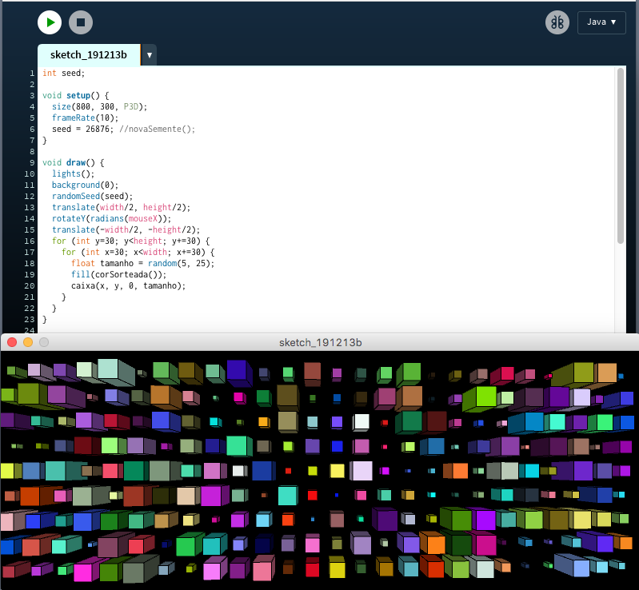

[sketch_191213b](https://github.com/villares/sketch-a-day/tree/master/2019/sketch_191213b) [[Java](https://processing.org)]


---

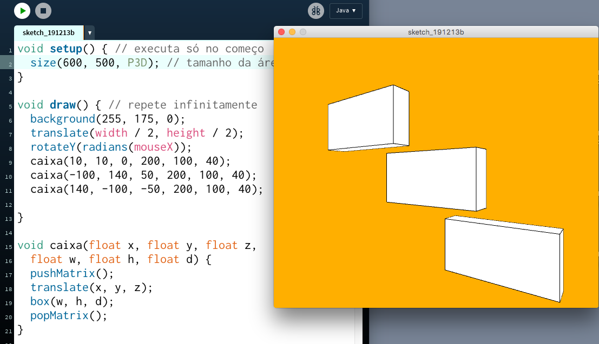

[sketch_191212b](https://github.com/villares/sketch-a-day/tree/master/2019/sketch_191212b) [[Java](https://processing.org)]


---

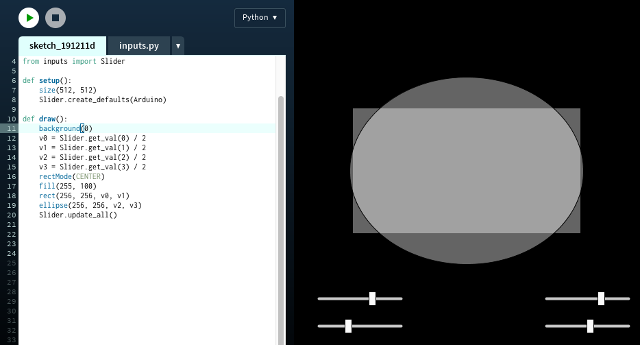

[sketch_191211d](https://github.com/villares/sketch-a-day/tree/master/2019/sketch_191211d) [[Py.Processing](https://villares.github.io/como-instalar-o-processing-modo-python/index-EN)]

Estudo/melhoria dos sliders

---

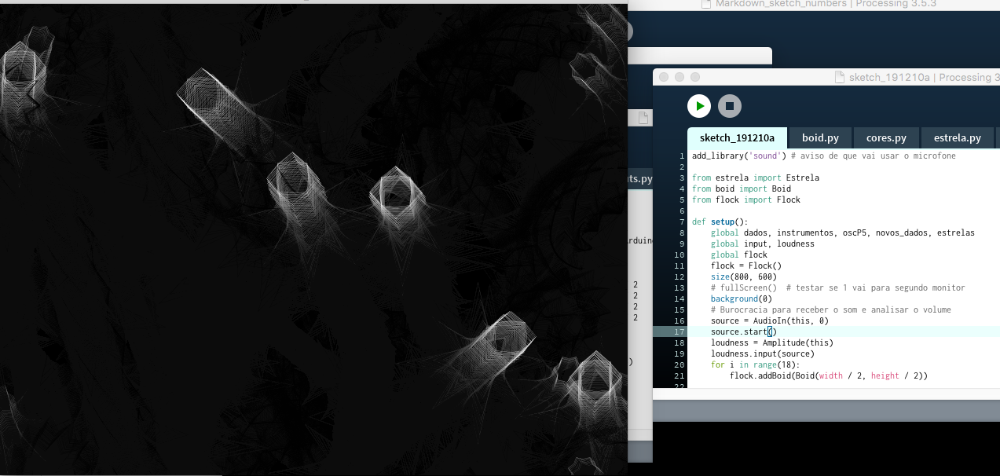

[sketch_191210a](https://github.com/villares/sketch-a-day/tree/master/2019/sketch_191210a) [[Py.Processing](https://villares.github.io/como-instalar-o-processing-modo-python/index-EN)]

Estudo do quarto movimento do Escuta Ativa

---

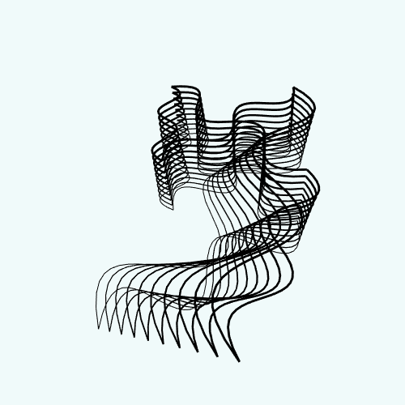

[sketch_191209a](https://github.com/villares/sketch-a-day/tree/master/2019/sketch_191209a) [[Py.Processing](https://villares.github.io/como-instalar-o-processing-modo-python/index-EN)]

---

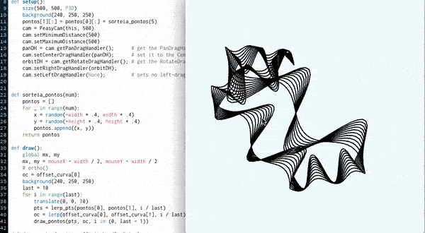

[sketch_191208a](https://github.com/villares/sketch-a-day/tree/master/2019/sketch_191208a) [[Py.Processing](https://villares.github.io/como-instalar-o-processing-modo-python/index-EN)]

---

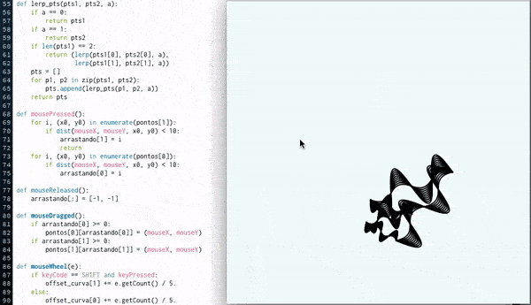

[sketch_191207a](https://github.com/villares/sketch-a-day/tree/master/2019/sketch_191207a) [[Py.Processing](https://villares.github.io/como-instalar-o-processing-modo-python/index-EN)]

---


[sketch_191206a](https://github.com/villares/sketch-a-day/tree/master/2019/sketch_191206a) [[Py.Processing](https://villares.github.io/como-instalar-o-processing-modo-python/index-EN)]

---

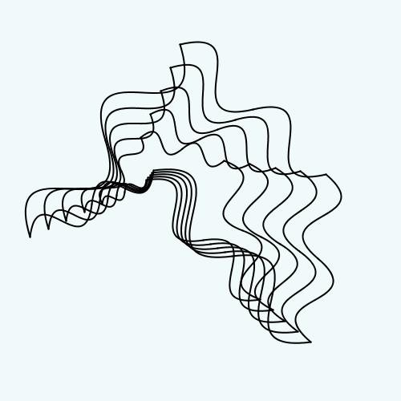

[sketch_191205a](https://github.com/villares/sketch-a-day/tree/master/2019/sketch_191205a) [[Py.Processing](https://villares.github.io/como-instalar-o-processing-modo-python/index-EN)]

---

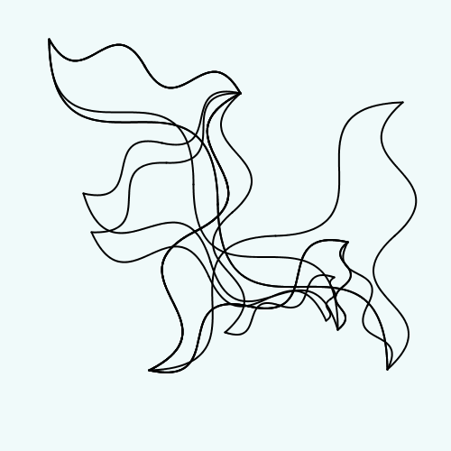

[sketch_191204a](https://github.com/villares/sketch-a-day/tree/master/2019/sketch_191204a) [[Py.Processing](https://villares.github.io/como-instalar-o-processing-modo-python/index-EN)]

---

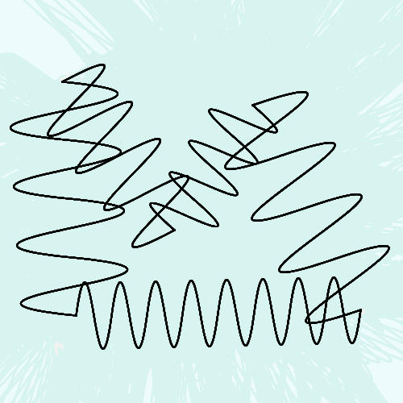

[sketch_191203a](https://github.com/villares/sketch-a-day/tree/master/2019/sketch_191203a) [[Py.Processing](https://villares.github.io/como-instalar-o-processing-modo-python/index-EN)]

---

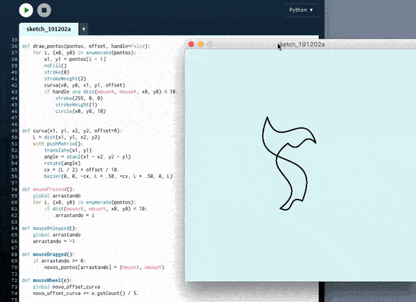

[sketch_191202a](https://github.com/villares/sketch-a-day/tree/master/2019/sketch_191202a) [[Py.Processing](https://villares.github.io/como-instalar-o-processing-modo-python/index-EN)]

---


[sketch_191201a](https://github.com/villares/sketch-a-day/tree/master/2019/sketch_191201a) [[Py.Processing](https://villares.github.io/como-instalar-o-processing-modo-python/index-EN)]

---

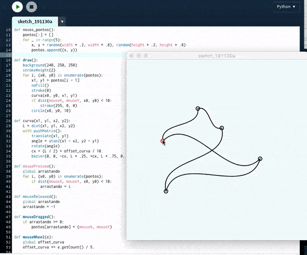

[sketch_191128a](https://github.com/villares/sketch-a-day/tree/master/2019/sketch_191130a) [[Py.Processing](https://villares.github.io/como-instalar-o-processing-modo-python/index-EN)]

---

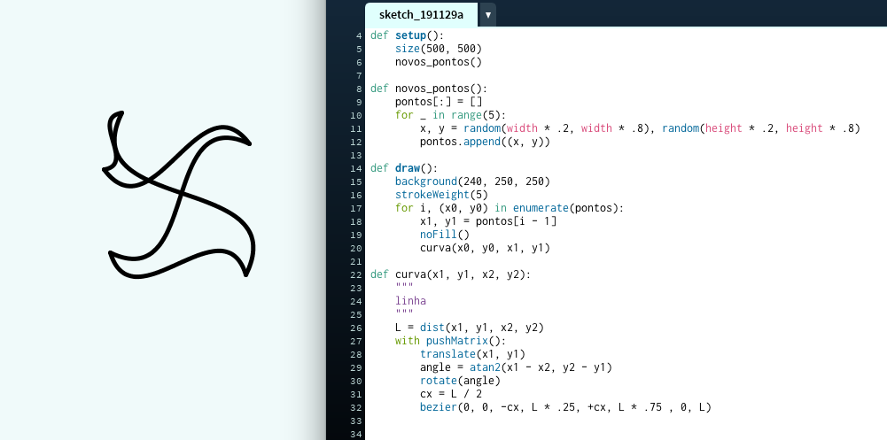

[sketch_191129a](https://github.com/villares/sketch-a-day/tree/master/2019/sketch_191129a) [[Py.Processing](https://villares.github.io/como-instalar-o-processing-modo-python/index-EN)]

---

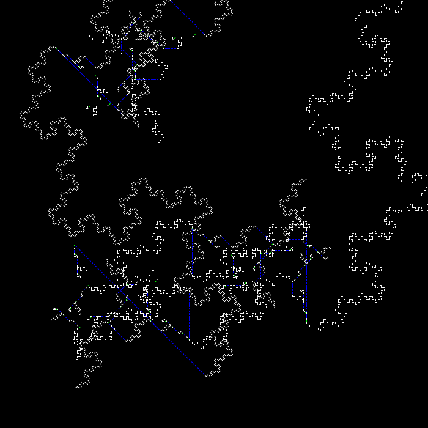

[sketch_191128a](https://github.com/villares/sketch-a-day/tree/master/2019/sketch_191128a) [[Py.Processing](https://villares.github.io/como-instalar-o-processing-modo-python/index-EN)]

---

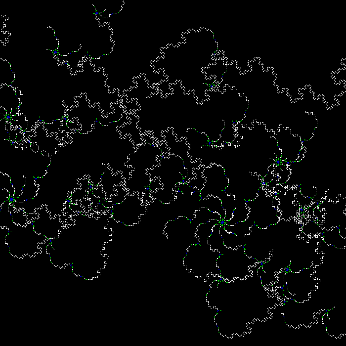

[sketch_191127a](https://github.com/villares/sketch-a-day/tree/master/2019/sketch_191127a) [[Py.Processing](https://villares.github.io/como-instalar-o-processing-modo-python/index-EN)]

---

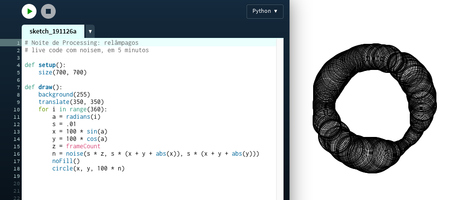

[sketch_191126a](https://github.com/villares/sketch-a-day/tree/master/2019/sketch_191126a) [[Py.Processing](https://villares.github.io/como-instalar-o-processing-modo-python/index-EN)]

---

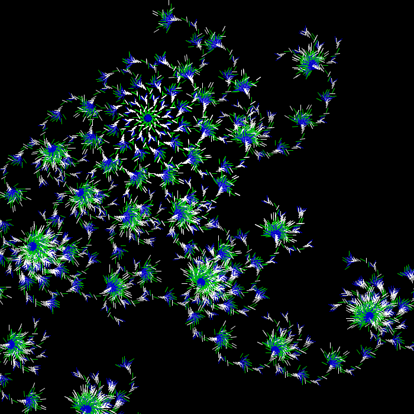

[sketch_191125a](https://github.com/villares/sketch-a-day/tree/master/2019/sketch_191125a) [[Py.Processing](https://villares.github.io/como-instalar-o-processing-modo-python/index-EN)]


```python
iterations = 7
stroke_len = 500
angle_deg = 30
axiom = "H"
sentence = axiom
rules = {
         "F": "F[-FH][+FH]",
         "G": "H++GF--GF",
         "H": "[-HG][+HG]",
         }
```

---

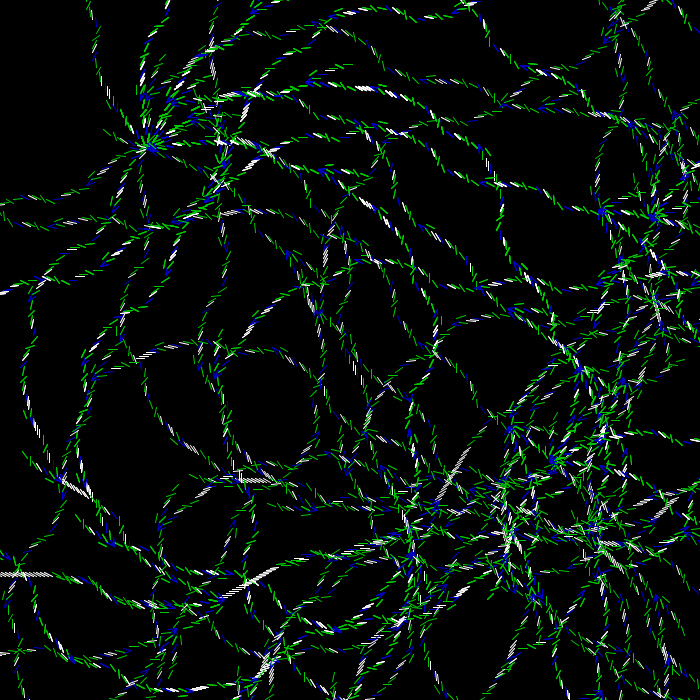

[sketch_191124a](https://github.com/villares/sketch-a-day/tree/master/2019/sketch_191124a) [[Py.Processing](https://villares.github.io/como-instalar-o-processing-modo-python/index-EN)]

```python
iterations = 7
stroke_len = 500
angle_deg = 40
axiom = "H"
sentence = axiom
rules = {
         "F": "FF",
         "G": "HFG++G--G",
         "H": "[-HG]+HG",
        }
```

---

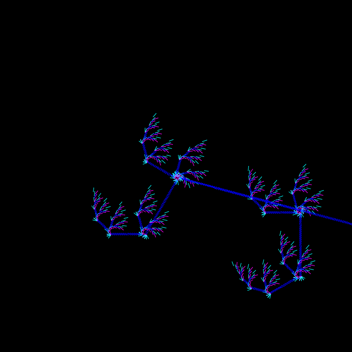

[sketch_191123a](https://github.com/villares/sketch-a-day/tree/master/2019/sketch_191123a) [[Py.Processing](https://villares.github.io/como-instalar-o-processing-modo-python/index-EN)]

```python
iterations = 7
stroke_len = 1000
angle_deg = 15
axiom = "HGF"
sentence = axiom
rules = {
         "F": "FF",
         "G": "[[+HG]F-HG]",
         "H": "[-H]+H",
        }
```

---

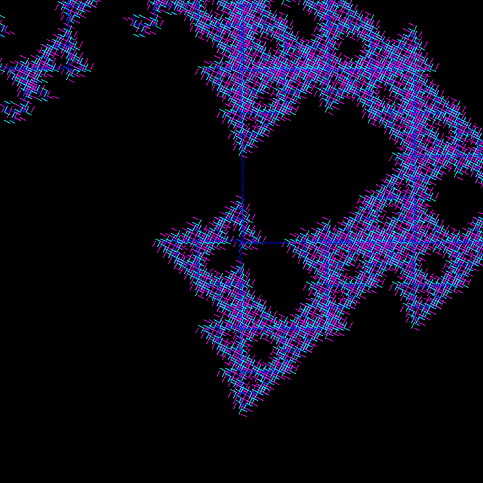

[sketch_191122a](https://github.com/villares/sketch-a-day/tree/master/2019/sketch_191122a) [[Py.Processing](https://villares.github.io/como-instalar-o-processing-modo-python/index-EN)]

---

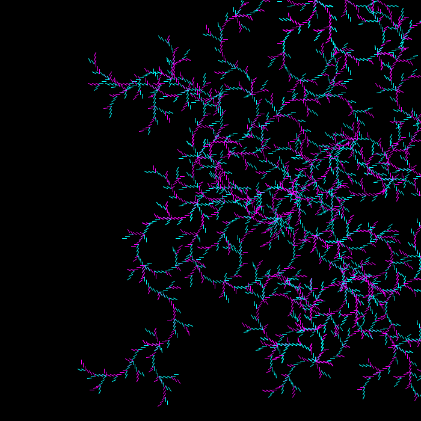

[sketch_191121a](https://github.com/villares/sketch-a-day/tree/master/2019/sketch_191121a) [[Py.Processing](https://villares.github.io/como-instalar-o-processing-modo-python/index-EN)]

---

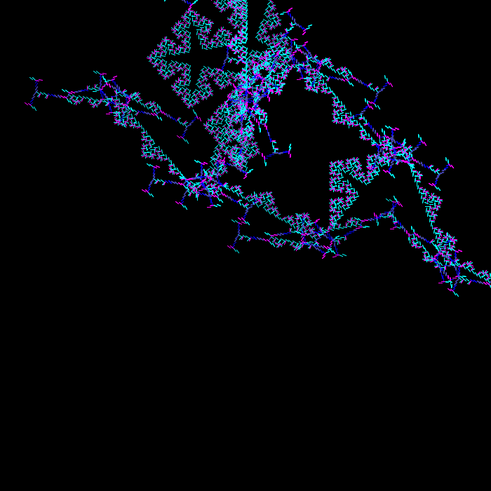

[sketch_191120a](https://github.com/villares/sketch-a-day/tree/master/2019/sketch_191120a) [[Py.Processing](https://villares.github.io/como-instalar-o-processing-modo-python/index-EN)]

---

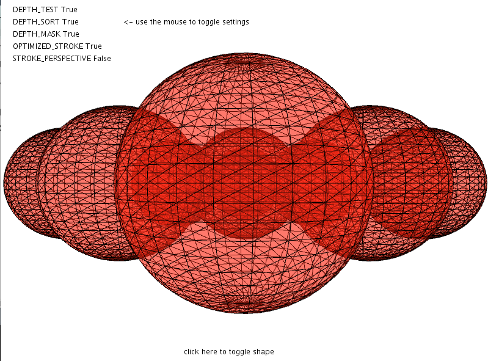

[sketch_191119f](https://github.com/villares/sketch-a-day/tree/master/2019/sketch_191119f) [[Py.Processing](https://villares.github.io/como-instalar-o-processing-modo-python/index-EN)]

---

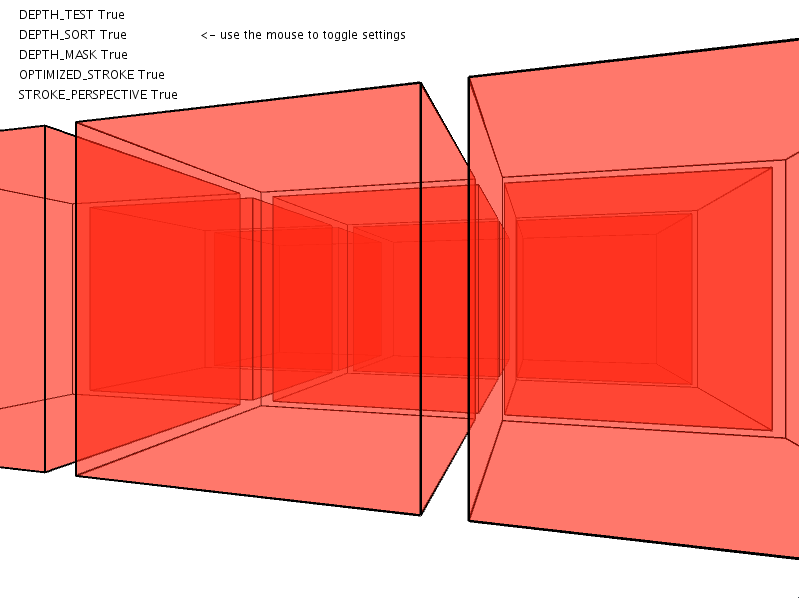

[sketch_191118f](https://github.com/villares/sketch-a-day/tree/master/2019/sketch_191118f) [[Py.Processing](https://villares.github.io/como-instalar-o-processing-modo-python/index-EN)]

---

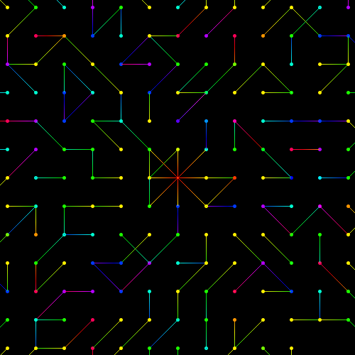

[sketch_191117a](https://github.com/villares/sketch-a-day/tree/master/2019/sketch_191117a) [[Py.Processing](https://villares.github.io/como-instalar-o-processing-modo-python/index-EN)]

---

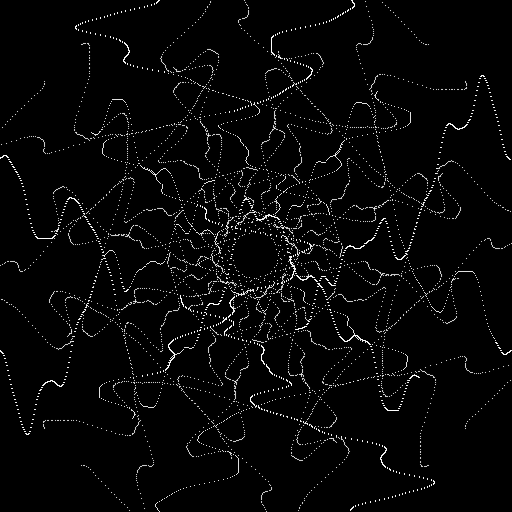

[sketch_191116n](https://github.com/villares/sketch-a-day/tree/master/2019/sketch_191116n) [[Py.Processing](https://villares.github.io/como-instalar-o-processing-modo-python/index-EN)]

---

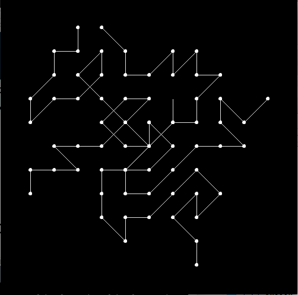

[sketch_191115a](https://github.com/villares/sketch-a-day/tree/master/2019/sketch_191115a) [[Py.Processing](https://villares.github.io/como-instalar-o-processing-modo-python/index-EN)]

---

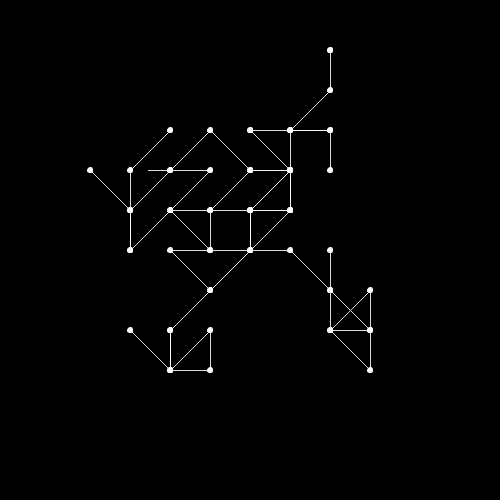

[sketch_191114b](https://github.com/villares/sketch-a-day/tree/master/2019/sketch_191114b) [[Py.Processing](https://villares.github.io/como-instalar-o-processing-modo-python/index-EN)]

---

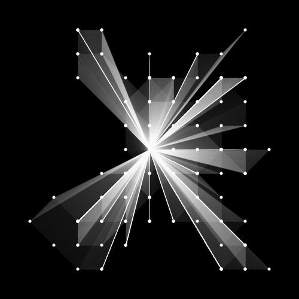

[sketch_191113a](https://github.com/villares/sketch-a-day/tree/master/2019/sketch_191113a) [[Py.Processing](https://villares.github.io/como-instalar-o-processing-modo-python/index-EN)]

---


[sketch_191112c](https://github.com/villares/sketch-a-day/tree/master/2019/sketch_191112c) [[Py.Processing](https://villares.github.io/como-instalar-o-processing-modo-python/index-EN)]

---

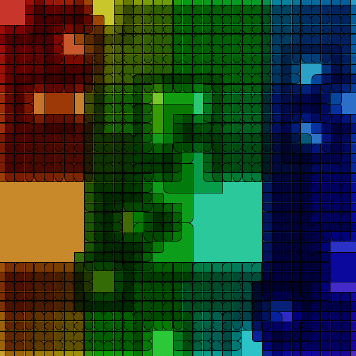

[sketch_191111c](https://github.com/villares/sketch-a-day/tree/master/2019/sketch_191111c) [[Py.Processing](https://villares.github.io/como-instalar-o-processing-modo-python/index-EN)]

---

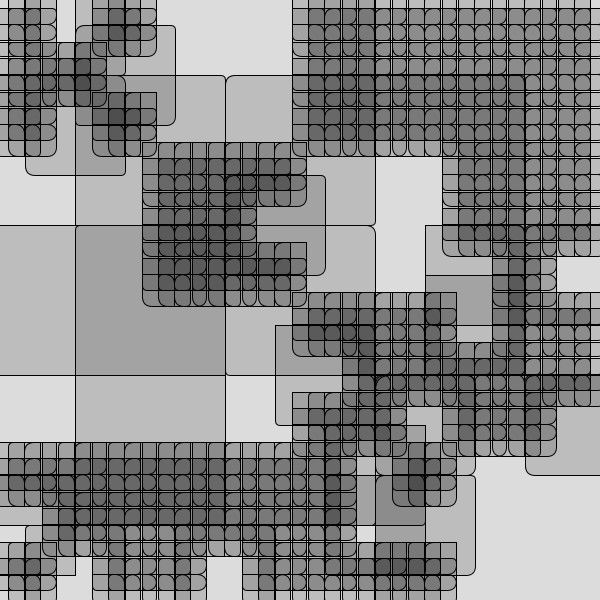

[sketch_191110c](https://github.com/villares/sketch-a-day/tree/master/2019/sketch_191110c) [[Py.Processing](https://villares.github.io/como-instalar-o-processing-modo-python/index-EN)]

---


[sketch_191109a](https://github.com/villares/sketch-a-day/tree/master/2019/sketch_191109a) [[Py.Processing](https://villares.github.io/como-instalar-o-processing-modo-python/index-EN)]

---

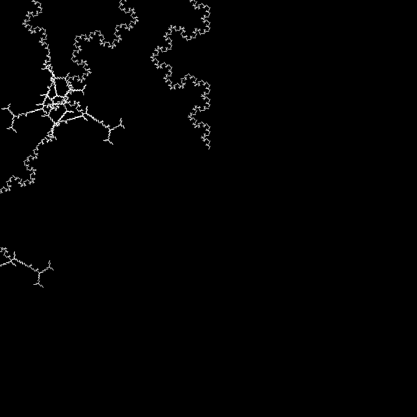

[sketch_191108a](https://github.com/villares/sketch-a-day/tree/master/2019/sketch_191108a) [[Py.Processing](https://villares.github.io/como-instalar-o-processing-modo-python/index-EN)]

---

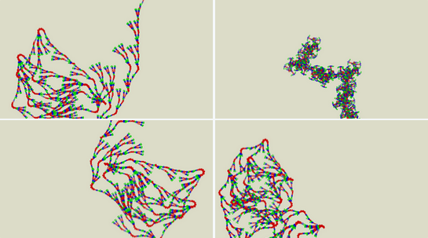

[sketch_191107a](https://github.com/villares/sketch-a-day/tree/master/2019/sketch_191107a) [[Py.Processing](https://villares.github.io/como-instalar-o-processing-modo-python/index-EN)]

---

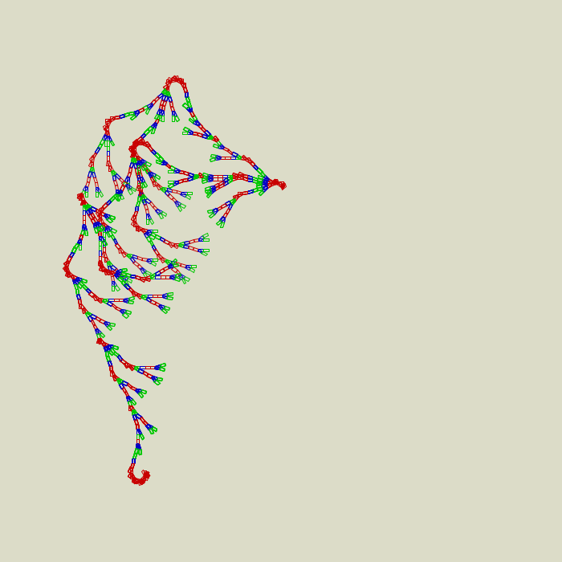

[sketch_191106a](https://github.com/villares/sketch-a-day/tree/master/2019/sketch_191106a) [[Py.Processing](https://villares.github.io/como-instalar-o-processing-modo-python/index-EN)]

---

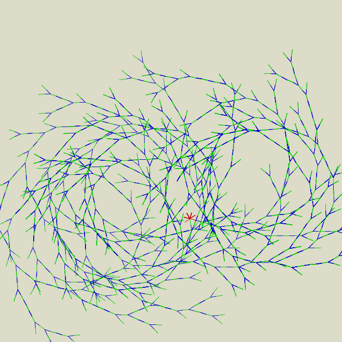

[sketch_191105a](https://github.com/villares/sketch-a-day/tree/master/2019/sketch_191105a) [[Py.Processing](https://villares.github.io/como-instalar-o-processing-modo-python/index-EN)]

---

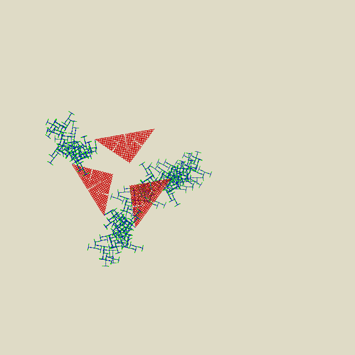

[sketch_191104a](https://github.com/villares/sketch-a-day/tree/master/2019/sketch_191104a) [[Py.Processing](https://villares.github.io/como-instalar-o-processing-modo-python/index-EN)]

---

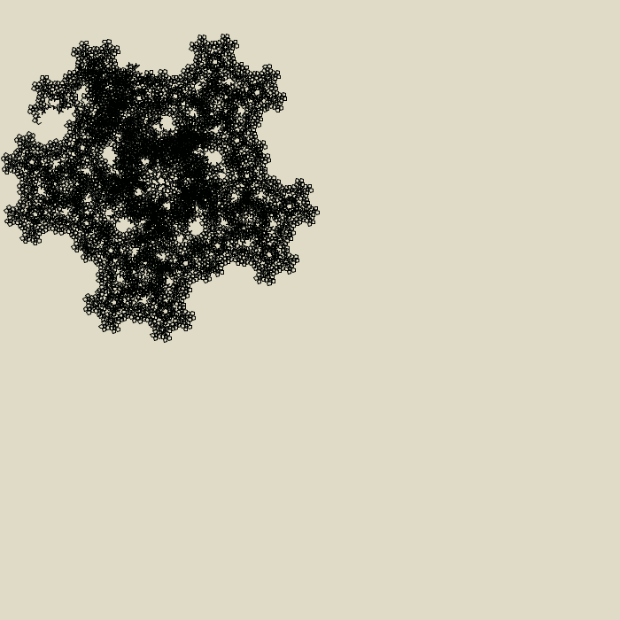

[sketch_191103a](https://github.com/villares/sketch-a-day/tree/master/2019/sketch_191103a) [[Py.Processing](https://villares.github.io/como-instalar-o-processing-modo-python/index-EN)]

---


[sketch_191102a](https://github.com/villares/sketch-a-day/tree/master/2019/sketch_191102a) [[Py.Processing](https://villares.github.io/como-instalar-o-processing-modo-python/index-EN)]

---

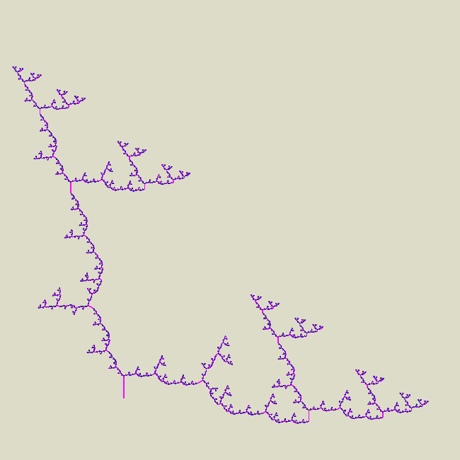

[sketch_191101a](https://github.com/villares/sketch-a-day/tree/master/2019/sketch_191101a) [[Py.Processing](https://villares.github.io/como-instalar-o-processing-modo-python/index-EN)]

---

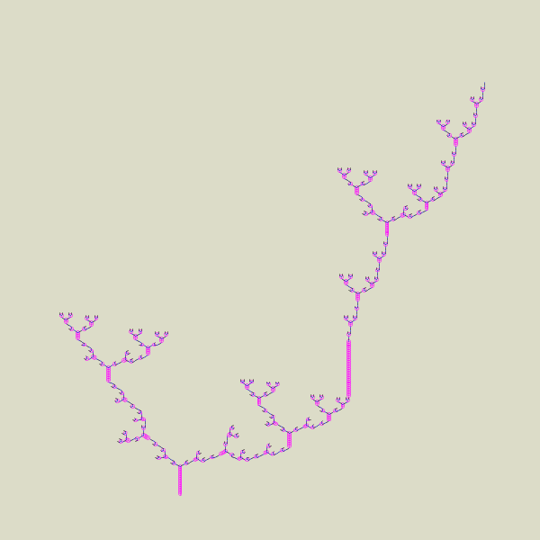
[sketch_191031a](https://github.com/villares/sketch-a-day/tree/master/2019/sketch_191031a) [[Py.Processing](https://villares.github.io/como-instalar-o-processing-modo-python/index-EN)]

---

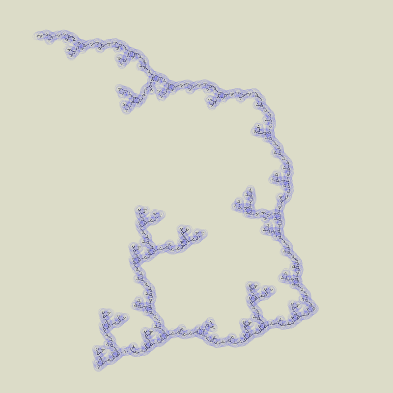
[sketch_191030a](https://github.com/villares/sketch-a-day/tree/master/2019/sketch_191030a) [[Py.Processing](https://villares.github.io/como-instalar-o-processing-modo-python/index-EN)]

---

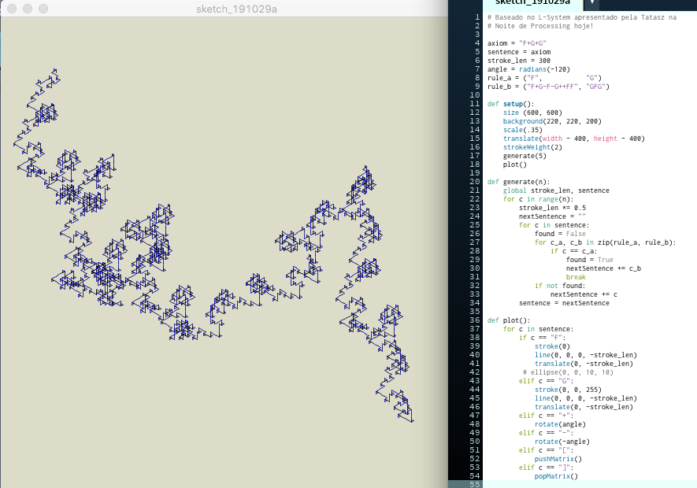
[sketch_191029a](https://github.com/villares/sketch-a-day/tree/master/2019/sketch_191029a) [[Py.Processing](https://villares.github.io/como-instalar-o-processing-modo-python/index-EN)]

---

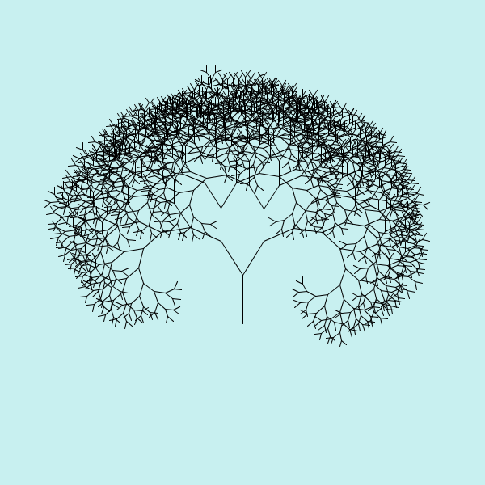
[sketch_191028a](https://github.com/villares/sketch-a-day/tree/master/2019/sketch_191028a) [[Py.Processing](https://villares.github.io/como-instalar-o-processing-modo-python/index-EN)]

---

Missed 2 days: Python Brasil 2019 conference.

---

<iframe src="https://abav.lugaralgum.com/sketch-a-day/2019/sketch_191025pybr2019/index.html" style="width: 500px; height: 500px; border: 0px"></iframe>
sketch_191025pybr2019 [Py.Processing code](https://github.com/villares/sketch-a-day/tree/master/2019/sketch_191025pybr2019) [pyp5js code](https://github.com/villares/sketch-a-day/tree/master/2019/sketch_191025pybr2019/)

O sketch da minha apresentação na Python Brasil 2019 rodando no navegador graças ao projeto [pyp5js](https://github.com/berinhard/pyp5js) do Berin!

---

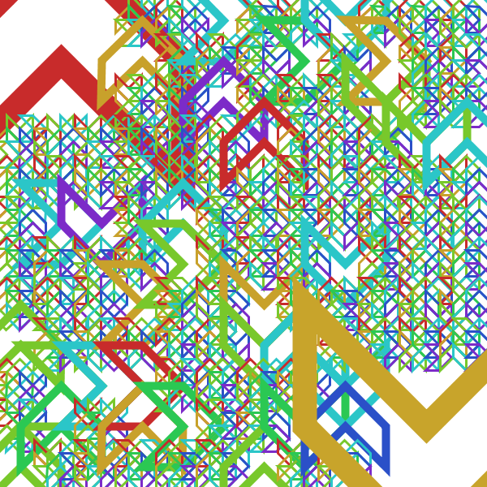
[sketch_191024a](https://github.com/villares/sketch-a-day/tree/master/2019/sketch_191024a) [[Py.Processing](https://villares.github.io/como-instalar-o-processing-modo-python/index-EN)]

---

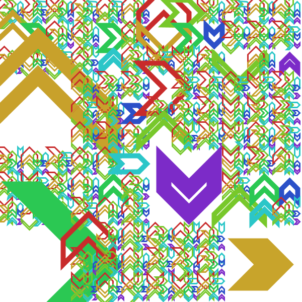
[sketch_191023a](https://github.com/villares/sketch-a-day/tree/master/2019/sketch_191023a) [[Py.Processing](https://villares.github.io/como-instalar-o-processing-modo-python/index-EN)]

---

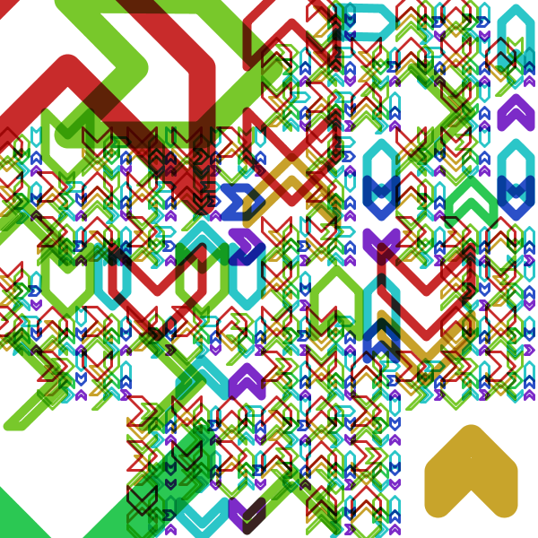
[sketch_191022a](https://github.com/villares/sketch-a-day/tree/master/2019/sketch_191022a) [[Py.Processing](https://villares.github.io/como-instalar-o-processing-modo-python/index-EN)]

---


[sketch_191021a](https://github.com/villares/sketch-a-day/tree/master/2019/sketch_191021a) [[Py.Processing](https://villares.github.io/como-instalar-o-processing-modo-python/index-EN)]

---

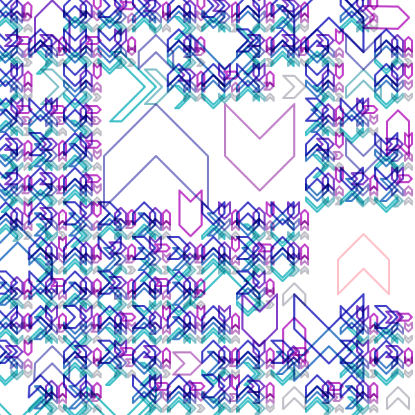
[sketch_191020a](https://github.com/villares/sketch-a-day/tree/master/2019/sketch_191020a) [[Py.Processing](https://villares.github.io/como-instalar-o-processing-modo-python/index-EN)]

---

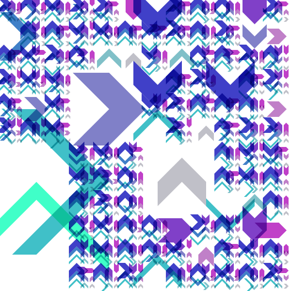
[sketch_191019a](https://github.com/villares/sketch-a-day/tree/master/2019/sketch_191019a) [[Py.Processing](https://villares.github.io/como-instalar-o-processing-modo-python/index-EN)]

---

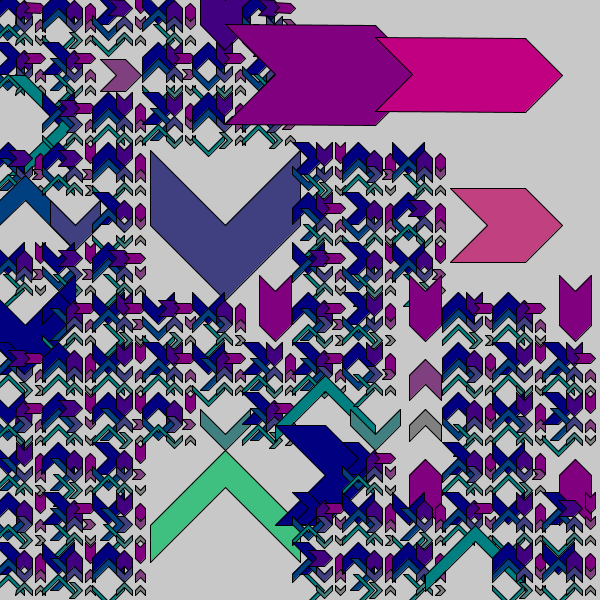
[sketch_191018a](https://github.com/villares/sketch-a-day/tree/master/2019/sketch_191018a) [[Py.Processing](https://villares.github.io/como-instalar-o-processing-modo-python/index-EN)]

---

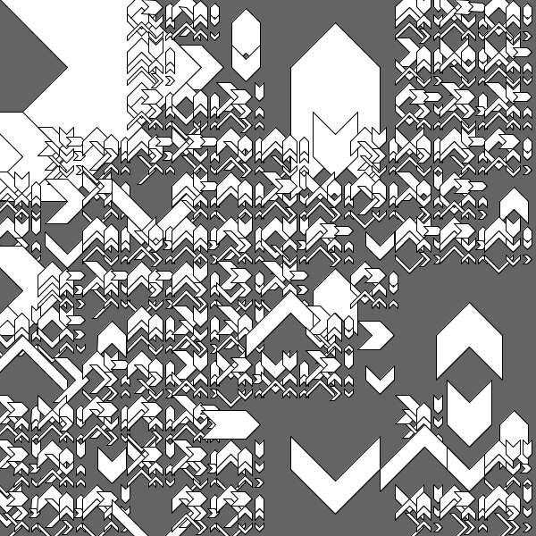
[sketch_191017a](https://github.com/villares/sketch-a-day/tree/master/2019/sketch_191017a) [[Py.Processing](https://villares.github.io/como-instalar-o-processing-modo-python/index-EN)]

---

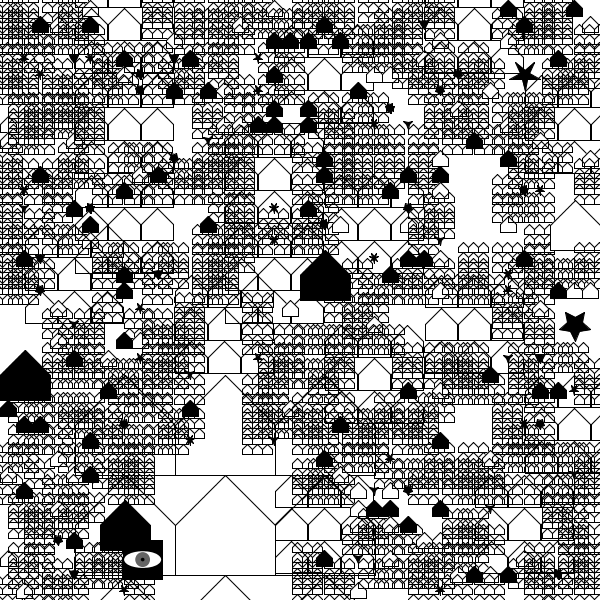
[sketch_191016](https://github.com/villares/sketch-a-day/tree/master/2019/sketch_191016) [[Py.Processing](https://villares.github.io/como-instalar-o-processing-modo-python/index-EN)]

---

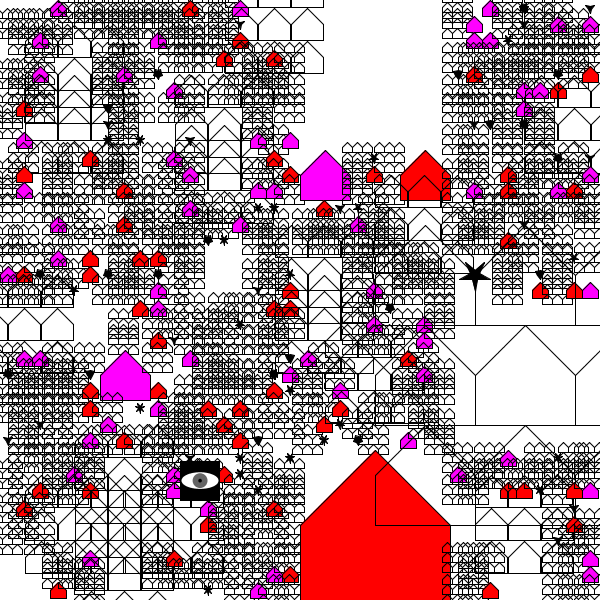
[sketch_191015](https://github.com/villares/sketch-a-day/tree/master/2019/sketch_191015) [[Py.Processing](https://villares.github.io/como-instalar-o-processing-modo-python/index-EN)]

---


[sketch_191014a](https://github.com/villares/sketch-a-day/tree/master/2019/sketch_191014a) [[Py.Processing](https://villares.github.io/como-instalar-o-processing-modo-python/index-EN)]

---

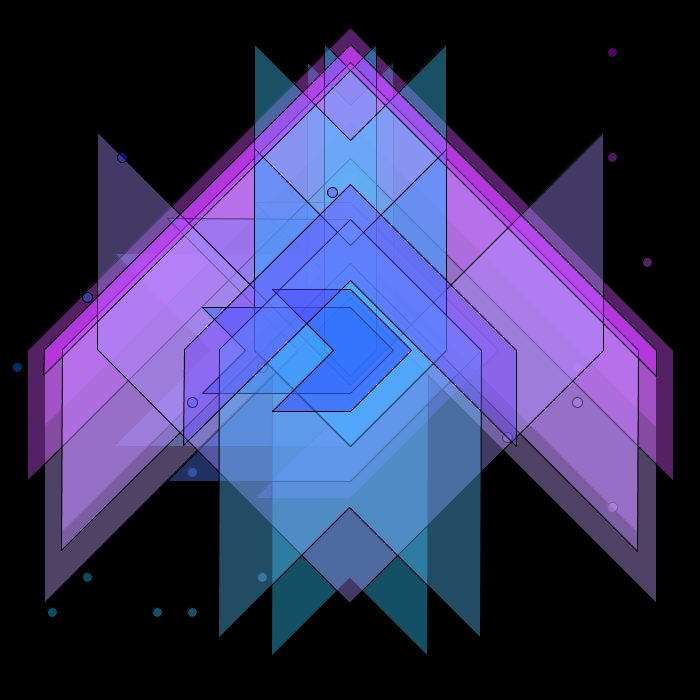
[sketch_191013b](https://github.com/villares/sketch-a-day/tree/master/2019/sketch_191013b) [[Py.Processing](https://villares.github.io/como-instalar-o-processing-modo-python/index-EN)]

---


[sketch_191012a](https://github.com/villares/sketch-a-day/tree/master/2019/sketch_191012a) [[Py.Processing](https://villares.github.io/como-instalar-o-processing-modo-python/index-EN)]

---


[sketch_191011a](https://github.com/villares/sketch-a-day/tree/master/2019/sketch_191011a) [[Py.Processing](https://villares.github.io/como-instalar-o-processing-modo-python/index-EN)]

---

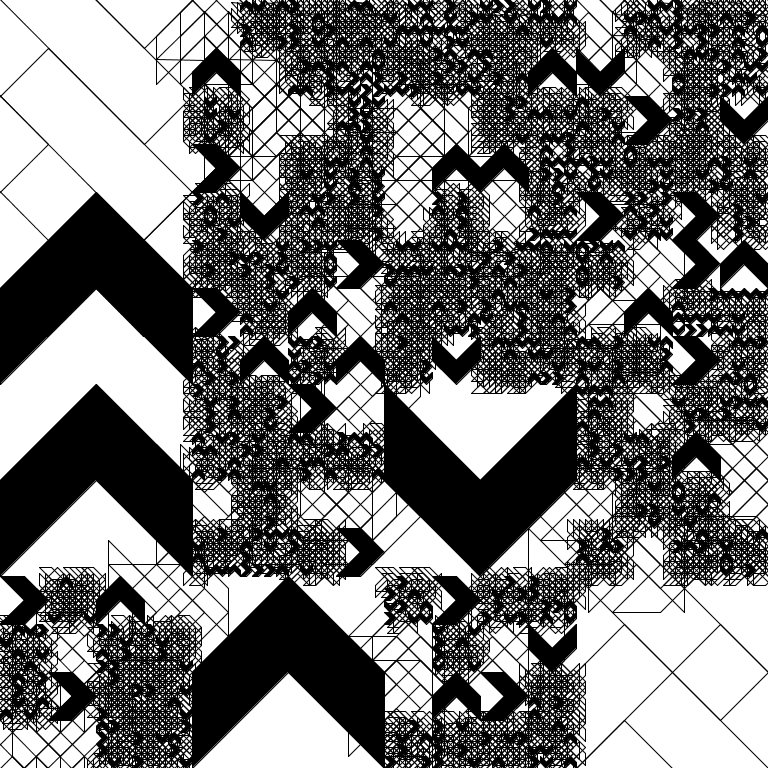

[sketch_191010a](https://github.com/villares/sketch-a-day/tree/master/2019/sketch_191010a) [[Py.Processing](https://villares.github.io/como-instalar-o-processing-modo-python/index-EN)]

---

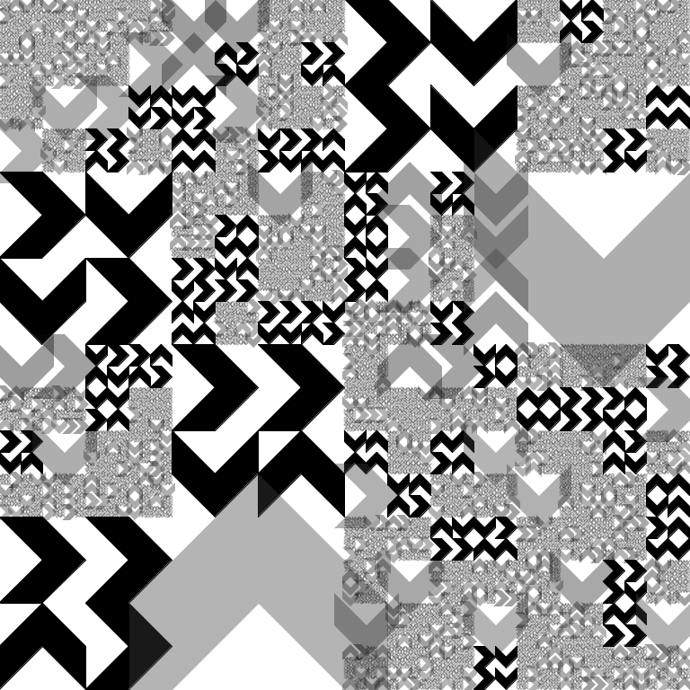

[sketch_191009a](https://github.com/villares/sketch-a-day/tree/master/2019/sketch_191009a) [[Py.Processing](https://villares.github.io/como-instalar-o-processing-modo-python/index-EN)]

---

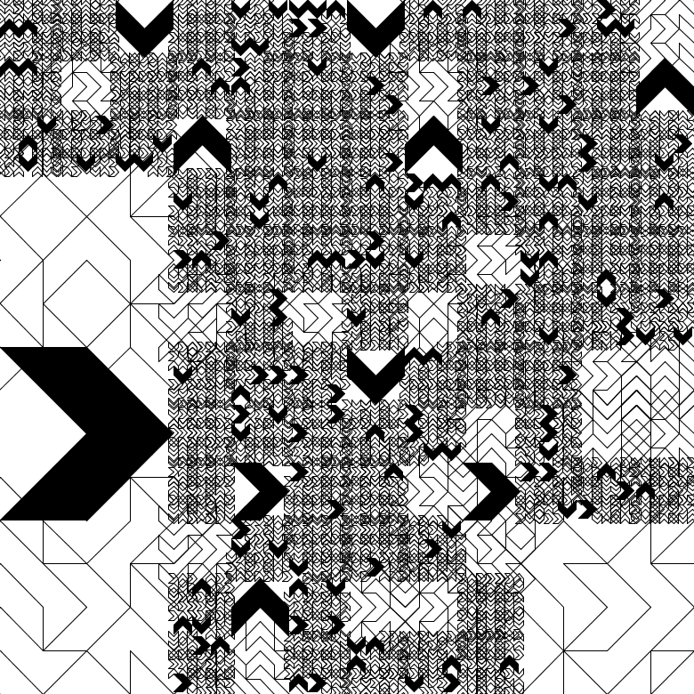

[sketch_191008a](https://github.com/villares/sketch-a-day/tree/master/2019/sketch_191008a) [[Py.Processing](https://villares.github.io/como-instalar-o-processing-modo-python/index-EN)]

---


[sketch_191007a](https://github.com/villares/sketch-a-day/tree/master/2019/sketch_191007a) [[Py.Processing](https://villares.github.io/como-instalar-o-processing-modo-python/index-EN)]

---

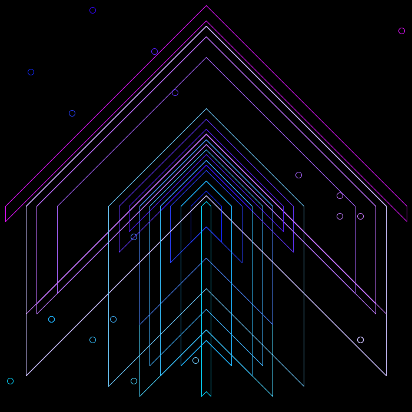

[sketch_191006b](https://github.com/villares/sketch-a-day/tree/master/2019/sketch_191006b) [[Py.Processing](https://villares.github.io/como-instalar-o-processing-modo-python/index-EN)]

---


[sketch_191005a](https://github.com/villares/sketch-a-day/tree/master/2019/sketch_191005a) [[Py.Processing](https://villares.github.io/como-instalar-o-processing-modo-python/index-EN)]

---

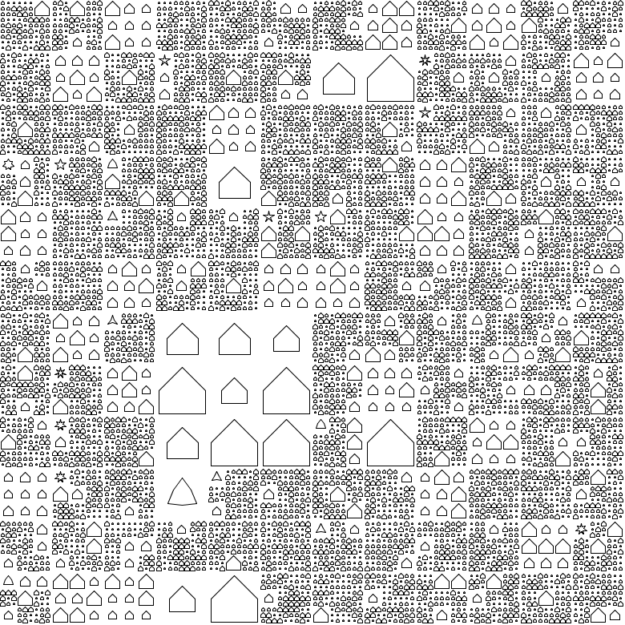

[sketch_191004a](https://github.com/villares/sketch-a-day/tree/master/2019/sketch_191004a) [[Py.Processing](https://villares.github.io/como-instalar-o-processing-modo-python/index-EN)]

--

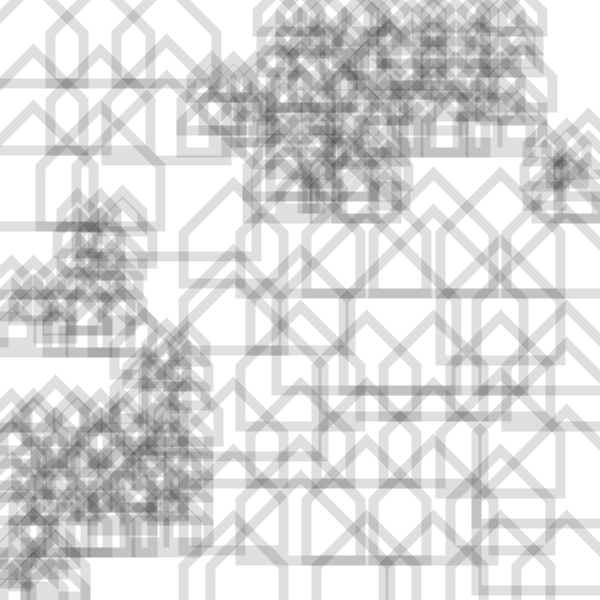

[sketch_191003a](https://github.com/villares/sketch-a-day/tree/master/2019/sketch_191003a) [[Py.Processing](https://villares.github.io/como-instalar-o-processing-modo-python/index-EN)]

--

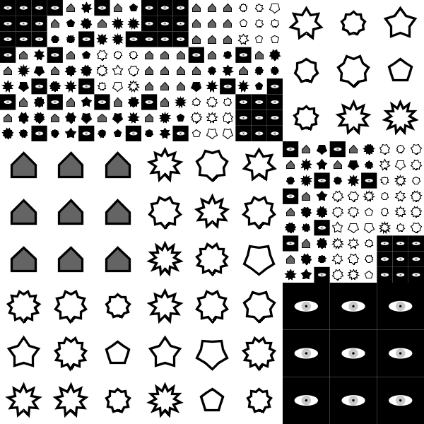

[sketch_191002a](https://github.com/villares/sketch-a-day/tree/master/2019/sketch_191002a) [[Py.Processing](https://villares.github.io/como-instalar-o-processing-modo-python/index-EN)]


--


[sketch_191001a](https://github.com/villares/sketch-a-day/tree/master/2019/sketch_191001a) [[Py.Processing](https://villares.github.io/como-instalar-o-processing-modo-python/index-EN)]

---


[sketch_190930a](https://github.com/villares/sketch-a-day/tree/master/2019/sketch_190930a) [[Py.Processing](https://villares.github.io/como-instalar-o-processing-modo-python/index-EN)]

---

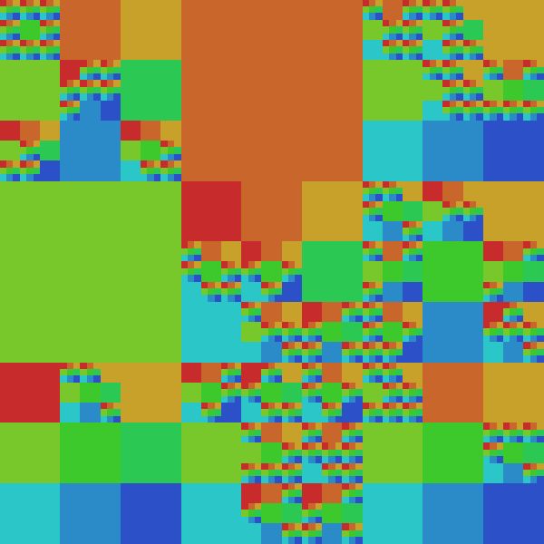

[sketch_190929a](https://github.com/villares/sketch-a-day/tree/master/2019/sketch_190929a) [[Py.Processing](https://villares.github.io/como-instalar-o-processing-modo-python/index-EN)]

---


[sketch_190928a](https://github.com/villares/sketch-a-day/tree/master/2019/sketch_190928a) [[Py.Processing](https://villares.github.io/como-instalar-o-processing-modo-python/index-EN)]

---

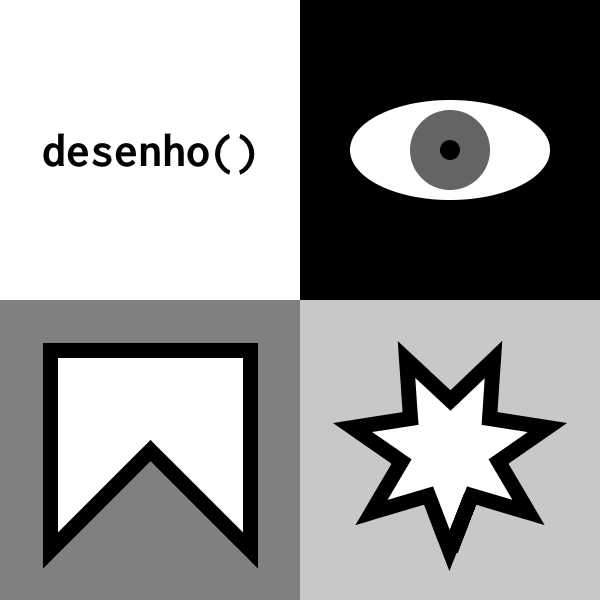

[sketch_190927a](https://github.com/villares/sketch-a-day/tree/master/2019/sketch_190927a) [[Py.Processing](https://villares.github.io/como-instalar-o-processing-modo-python/index-EN)]

"desenho" means drawing, so my zine will be "drawing without arguments" :)

---

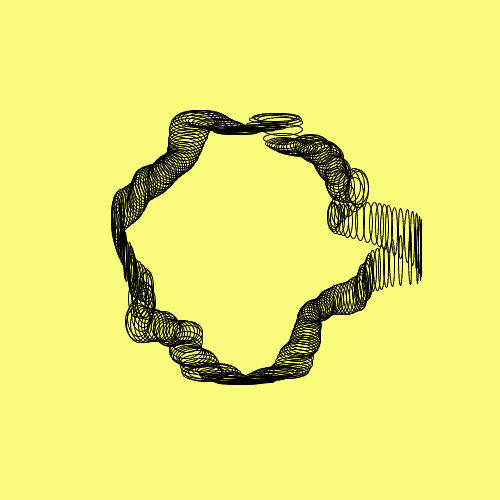

[sketch_190926c](https://github.com/villares/sketch-a-day/tree/master/2019/sketch_190926c) [[Py.Processing](https://villares.github.io/como-instalar-o-processing-modo-python/index-EN)]

---


[sketch_190925c](https://github.com/villares/sketch-a-day/tree/master/2019/sketch_190925c) [[Py.Processing](https://villares.github.io/como-instalar-o-processing-modo-python/index-EN)]

---


[sketch_190924c](https://github.com/villares/sketch-a-day/tree/master/2019/sketch_190924c) [[Py.Processing](https://villares.github.io/como-instalar-o-processing-modo-python/index-EN)]

---


[sketch_190923c](https://github.com/villares/sketch-a-day/tree/master/2019/sketch_190923c) [[Py.Processing](https://villares.github.io/como-instalar-o-processing-modo-python/index-EN)]

---


[sketch_190922a](https://github.com/villares/sketch-a-day/tree/master/2019/sketch_190922a) [[Py.Processing](https://villares.github.io/como-instalar-o-processing-modo-python/index-EN)]

<blockquote class="twitter-tweet"><p lang="en" dir="ltr"><a href="https://twitter.com/hashtag/%E3%81%A4%E3%81%B6%E3%82%84%E3%81%8DProcessing?src=hash&amp;ref_src=twsrc%5Etfw">#つぶやきProcessing</a> <a href="https://twitter.com/hashtag/Python?src=hash&amp;ref_src=twsrc%5Etfw">#Python</a><br>w,h=500,250<br>def setup():size(w,w)<br>def draw():<br> background(h/2,h/2,h);translate(h,h)<br> a,k=0,sin(frameCount/30.)<br> while a&lt;TWO_PI:<br> i,j=sin(a),cos(a)<br> n=noise((abs(i)+i+j),(abs(j)+j+i),k)<br> x,y=n*h*sin(a),n*h*cos(a)<br> line(0,0,x,y)<br> a+=.004 <a href="https://t.co/ygkwh2KKxG">pic.twitter.com/ygkwh2KKxG</a></p>&mdash; Alexandre B A Villares ☂ (@villares) <a href="https://twitter.com/villares/status/1175856215030665216?ref_src=twsrc%5Etfw">September 22, 2019</a></blockquote> <script async src="https://platform.twitter.com/widgets.js" charset="utf-8"></script> 

---

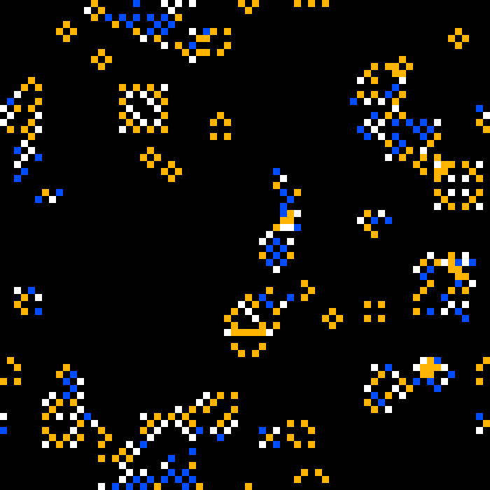

[sketch_190921a](https://github.com/villares/sketch-a-day/tree/master/2019/sketch_190921a) [[Py.Processing](https://villares.github.io/como-instalar-o-processing-modo-python/index-EN)]

Removed accumulation and added another colour preview for next-gen alive cells

---

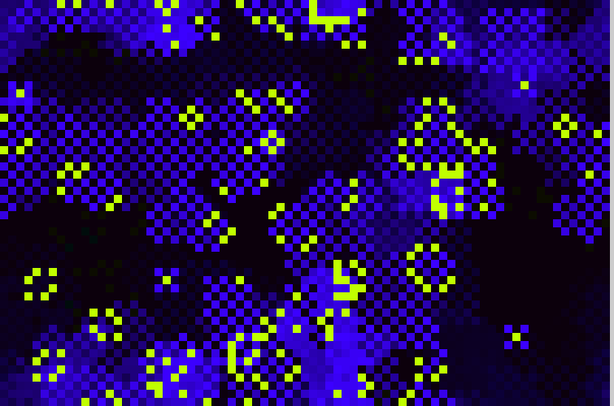

[sketch_190920a](https://github.com/villares/sketch-a-day/tree/master/2019/sketch_190920a) [[Py.Processing](https://villares.github.io/como-instalar-o-processing-modo-python/index-EN)]

Some accumulation…

---

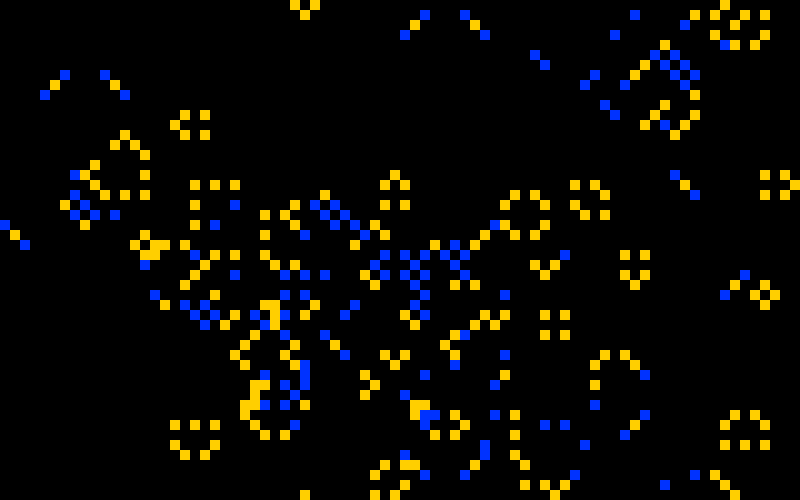

[sketch_190919a](https://github.com/villares/sketch-a-day/tree/master/2019/sketch_190919a) [[Py.Processing](https://villares.github.io/como-instalar-o-processing-modo-python/index-EN)]

Modified neighbours form Conway!
```
NEIGHBOURS = ((-2,  0), ( 2,  0),
              (-1, -1), ( 0, -2),
              ( 1, -1), (-1,  1),
              ( 0,  2), ( 1,  1)) 

```
---

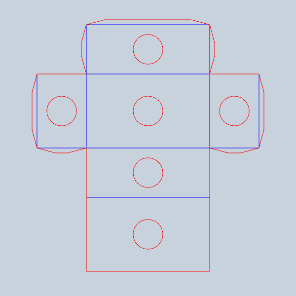

[sketch_190918a](https://github.com/villares/sketch-a-day/tree/master/2019/sketch_190918a) [[Py.Processing](https://villares.github.io/como-instalar-o-processing-modo-python/index-EN)]

---

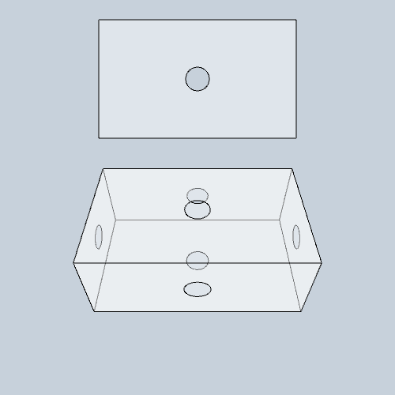

[sketch_190917a](https://github.com/villares/sketch-a-day/tree/master/2019/sketch_190917a) [[Py.Processing](https://villares.github.io/como-instalar-o-processing-modo-python/index-EN)]

---


[sketch_190916b](https://github.com/villares/sketch-a-day/tree/master/2019/sketch_190916b) [[Py.Processing](https://villares.github.io/como-instalar-o-processing-modo-python/index-EN)]

An audio reactive sketch!!!

---

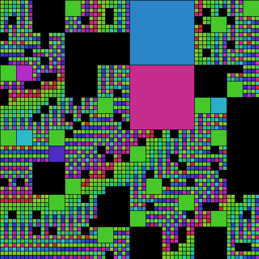

[sketch_190915b](https://github.com/villares/sketch-a-day/tree/master/2019/sketch_190915b) [[Py.Processing](https://villares.github.io/como-instalar-o-processing-modo-python/index-EN)]

---

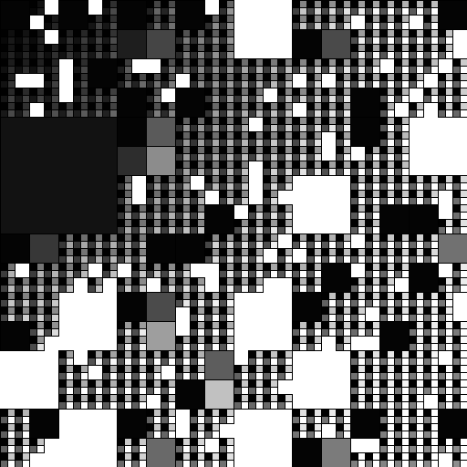

[sketch_190914b](https://github.com/villares/sketch-a-day/tree/master/2019/sketch_190914b) [[Py.Processing](https://villares.github.io/como-instalar-o-processing-modo-python/index-EN)]

---

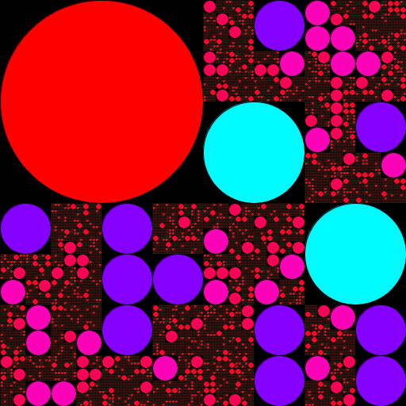

[sketch_190913b](https://github.com/villares/sketch-a-day/tree/master/2019/sketch_190913b) [[Py.Processing](https://villares.github.io/como-instalar-o-processing-modo-python/index-EN)]

---

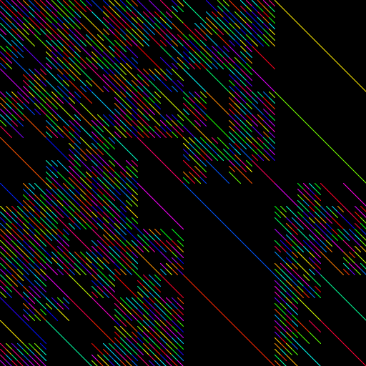

[sketch_190912c](https://github.com/villares/sketch-a-day/tree/master/2019/sketch_190912c) [[Py.Processing](https://villares.github.io/como-instalar-o-processing-modo-python/index-EN)]

---

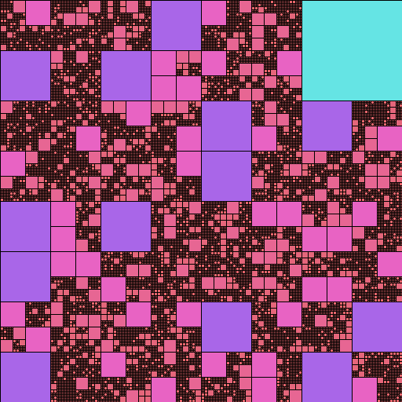

[sketch_190911b](https://github.com/villares/sketch-a-day/tree/master/2019/sketch_190911b) [[Py.Processing](https://villares.github.io/como-instalar-o-processing-modo-python/index-EN)]

---


[sketch_190910b](https://github.com/villares/sketch-a-day/tree/master/2019/sketch_190910b) [[Py.Processing](https://villares.github.io/como-instalar-o-processing-modo-python/index-EN)]

---

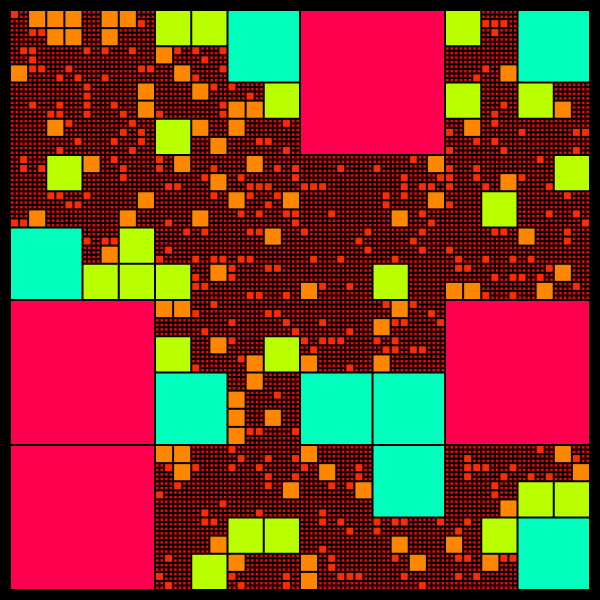

[sketch_190909b](https://github.com/villares/sketch-a-day/tree/master/2019/sketch_190909b) [[Py.Processing](https://villares.github.io/como-instalar-o-processing-modo-python/index-EN)]

---

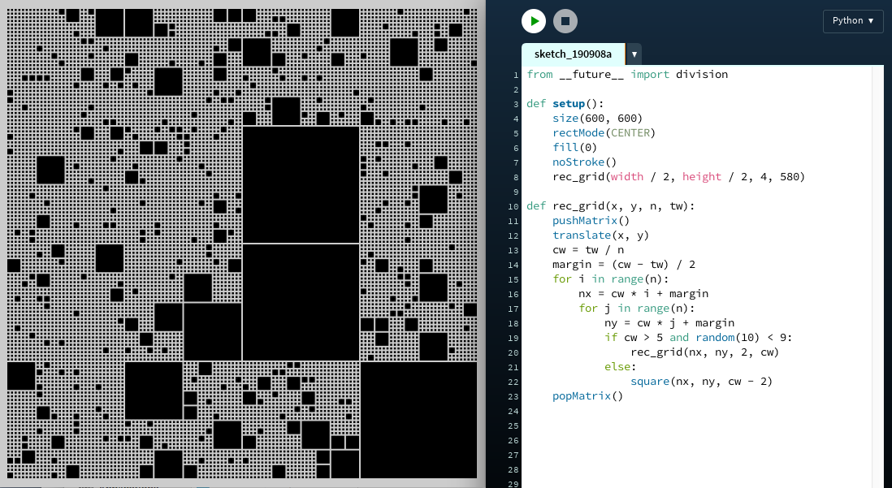

[sketch_190908b](https://github.com/villares/sketch-a-day/tree/master/2019/sketch_190908b) [[Py.Processing](https://villares.github.io/como-instalar-o-processing-modo-python/index-EN)]

---


[sketch_190907c](https://github.com/villares/sketch-a-day/tree/master/2019/sketch_190907c) [[Py.Processing](https://villares.github.io/como-instalar-o-processing-modo-python/index-EN)]

---

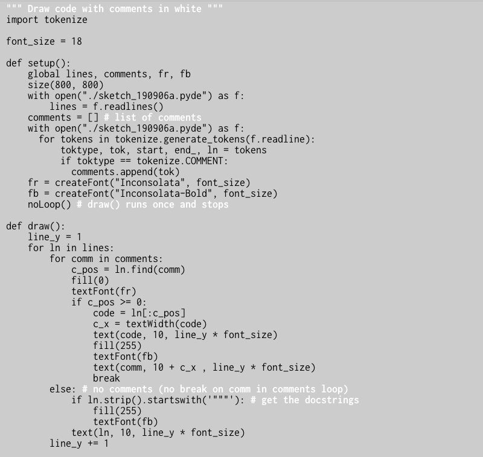

[sketch_190906a](https://github.com/villares/sketch-a-day/tree/master/2019/sketch_190906a) [[Py.Processing](https://villares.github.io/como-instalar-o-processing-modo-python/index-EN)]

---

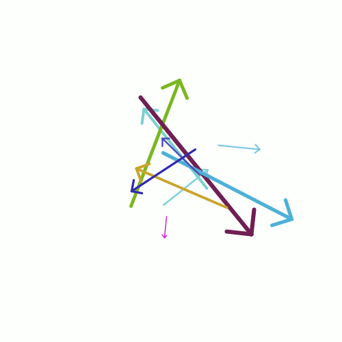

[sketch_190905c](https://github.com/villares/sketch-a-day/tree/master/2019/sketch_190905c) [[Py.Processing](https://villares.github.io/como-instalar-o-processing-modo-python/index-EN)]

---

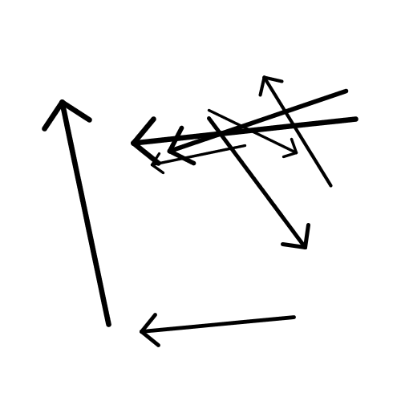

[sketch_190904c](https://github.com/villares/sketch-a-day/tree/master/2019/sketch_190904c) [[Py.Processing](https://villares.github.io/como-instalar-o-processing-modo-python/index-EN)]

---


[sketch_190903c](https://github.com/villares/sketch-a-day/tree/master/2019/sketch_190903c) [[Py.Processing](https://villares.github.io/como-instalar-o-processing-modo-python/index-EN)]

---

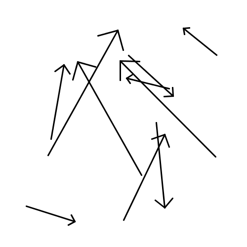

[sketch_190902c](https://github.com/villares/sketch-a-day/tree/master/2019/sketch_190902c) [[Py.Processing](https://villares.github.io/como-instalar-o-processing-modo-python/index-EN)]

---


[sketch_190901a](https://github.com/villares/sketch-a-day/tree/master/2019/sketch_190901a) [[Py.Processing](https://villares.github.io/como-instalar-o-processing-modo-python/index-EN)]

---

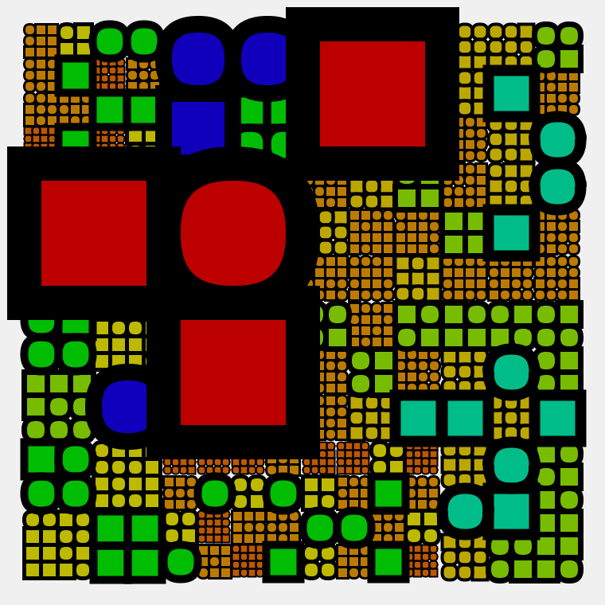

[sketch_190831a](https://github.com/villares/sketch-a-day/tree/master/2019/sketch_190831a) [[Py.Processing](https://villares.github.io/como-instalar-o-processing-modo-python/index-EN)]

---

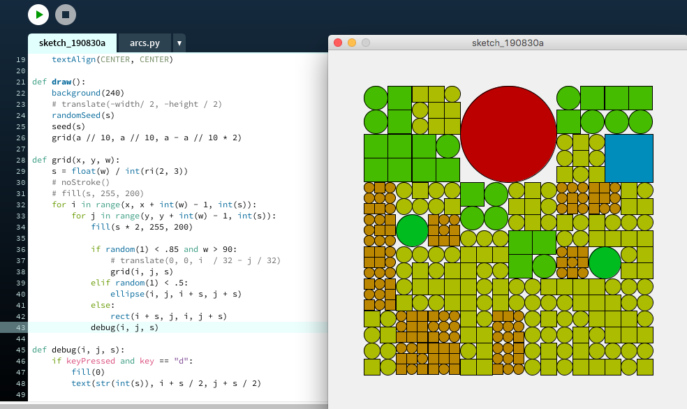

[sketch_190830a](https://github.com/villares/sketch-a-day/tree/master/2019/sketch_190830a) [[Py.Processing](https://villares.github.io/como-instalar-o-processing-modo-python/index-EN)]

---

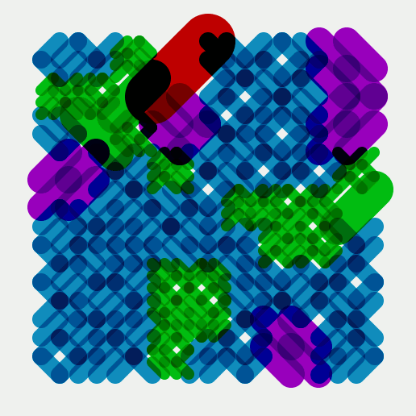

[sketch_190829b](https://github.com/villares/sketch-a-day/tree/master/2019/sketch_190829b) [[Py.Processing](https://villares.github.io/como-instalar-o-processing-modo-python/index-EN)]

---

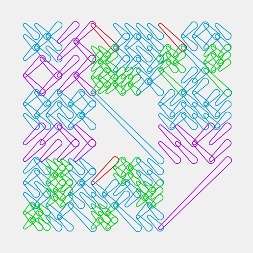

[sketch_190828a](https://github.com/villares/sketch-a-day/tree/master/2019/sketch_190828a) [[Py.Processing](https://villares.github.io/como-instalar-o-processing-modo-python/index-EN)]

---

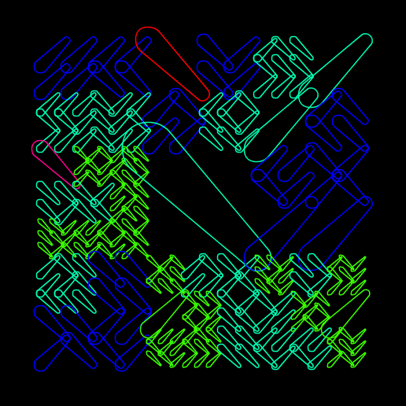

[sketch_190827a](https://github.com/villares/sketch-a-day/tree/master/2019/sketch_190827a) [[Py.Processing](https://villares.github.io/como-instalar-o-processing-modo-python/index-EN)]

---

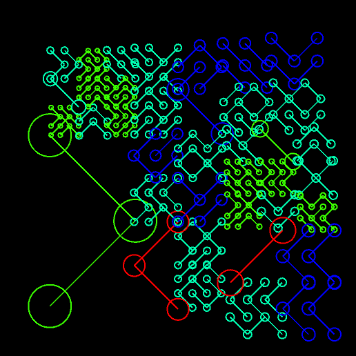

[sketch_190826a](https://github.com/villares/sketch-a-day/tree/master/2019/sketch_190826a) [[Py.Processing](https://villares.github.io/como-instalar-o-processing-modo-python/index-EN)]

---

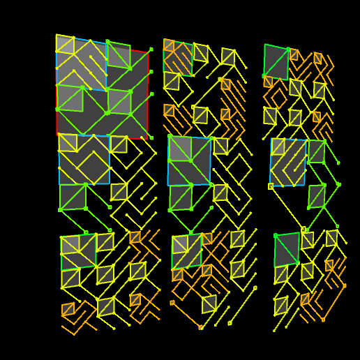

[sketch_190825a](https://github.com/villares/sketch-a-day/tree/master/2019/sketch_190825a) [[Py.Processing](https://villares.github.io/como-instalar-o-processing-modo-python/index-EN)]

---

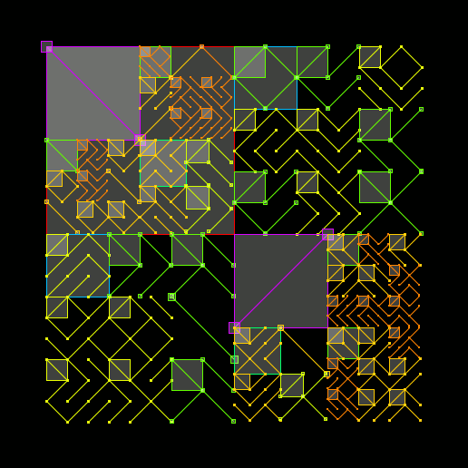

[sketch_190824a](https://github.com/villares/sketch-a-day/tree/master/2019/sketch_190824a) [[Py.Processing](https://villares.github.io/como-instalar-o-processing-modo-python/index-EN)]

Playing with recursion. Impressed and inspired by [a tweet from @takawo](https://twitter.com/villares/status/1164921305277325314) from the Japanese Processing community! They have this amazing hashtag [#つぶやきProcessing](https://twitter.com/hashtag/%E3%81%A4%E3%81%B6%E3%82%84%E3%81%8DProcessing?src=hashtag_click) (something like single tweet Processing). 

---


[sketch_190823c](https://github.com/villares/sketch-a-day/tree/master/2019/sketch_190823c) [[Py.Processing](https://villares.github.io/como-instalar-o-processing-modo-python/index-EN)]

Interactive symmetryc polygons

---


[sketch_190822c](https://github.com/villares/sketch-a-day/tree/master/2019/sketch_190822c) [[Py.Processing](https://villares.github.io/como-instalar-o-processing-modo-python/index-EN)]

Interactive symmetric lines

---

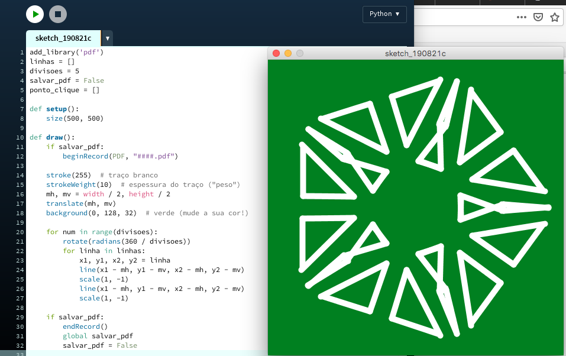

[sketch_190821c](https://github.com/villares/sketch-a-day/tree/master/2019/sketch_190821c) [[Py.Processing](https://villares.github.io/como-instalar-o-processing-modo-python/index-EN)]

---

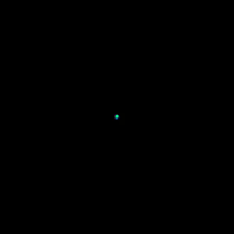

[sketch_190820a](https://github.com/villares/sketch-a-day/tree/master/2019/sketch_190820a) [[Py.Processing](https://villares.github.io/como-instalar-o-processing-modo-python/index-EN)]

---

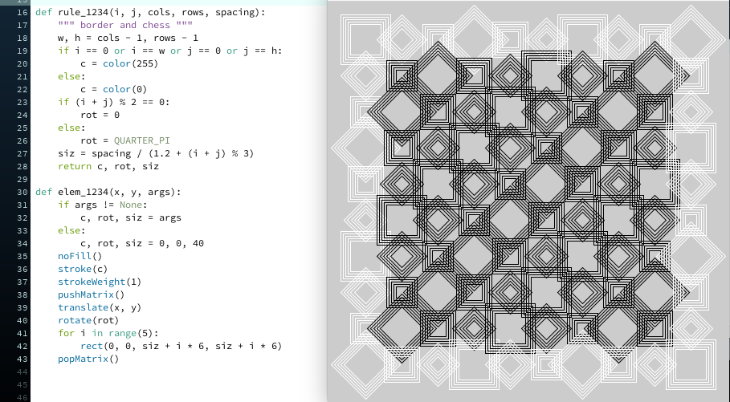

[sketch_190819a](https://github.com/villares/sketch-a-day/tree/master/2019/sketch_190819a) [[Py.Processing](https://villares.github.io/como-instalar-o-processing-modo-python/index-EN)]

---

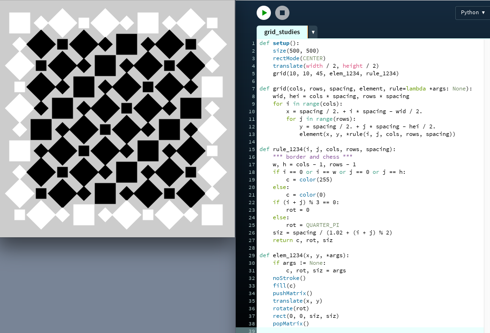

[sketch_190818a](https://github.com/villares/sketch-a-day/tree/master/2019/sketch_190818a) [[Py.Processing](https://villares.github.io/como-instalar-o-processing-modo-python/index-EN)]

---

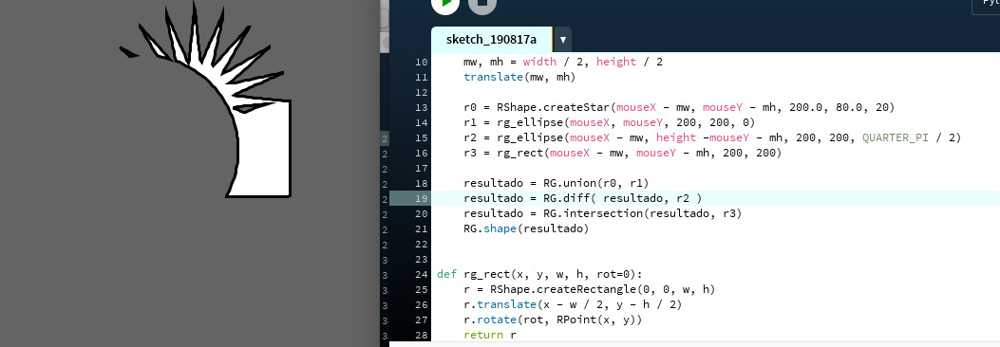

[sketch_190817a](https://github.com/villares/sketch-a-day/tree/master/2019/sketch_190817a) [[Py.Processing](https://villares.github.io/como-instalar-o-processing-modo-python/index-EN)]

---

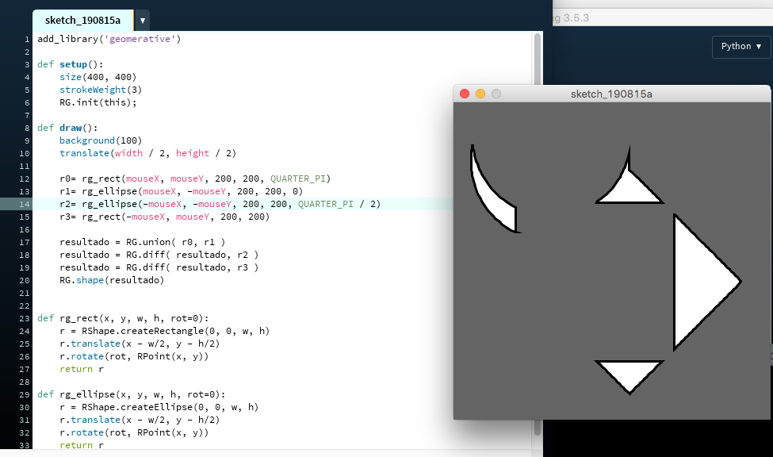

[sketch_190816a](https://github.com/villares/sketch-a-day/tree/master/2019/sketch_190816a) [[Py.Processing](https://villares.github.io/como-instalar-o-processing-modo-python/index-EN)]

---

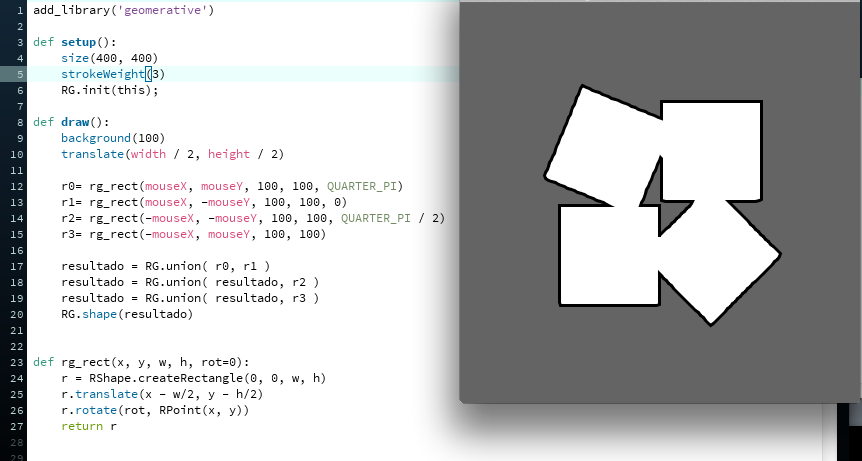

[sketch_190815a](https://github.com/villares/sketch-a-day/tree/master/2019/sketch_190815a) [[Py.Processing](https://villares.github.io/como-instalar-o-processing-modo-python/index-EN)]

---

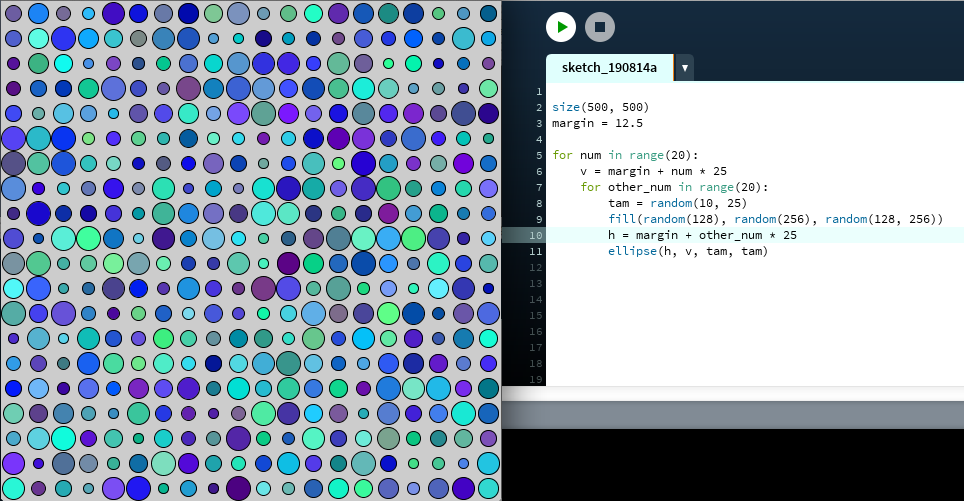

[sketch_190814a](https://github.com/villares/sketch-a-day/tree/master/2019/sketch_190814a) [[Py.Processing](https://villares.github.io/como-instalar-o-processing-modo-python/index-EN)]

---


[sketch_190813a](https://github.com/villares/sketch-a-day/tree/master/2019/sketch_190813a) [[Py.Processing](https://villares.github.io/como-instalar-o-processing-modo-python/index-EN)]

---

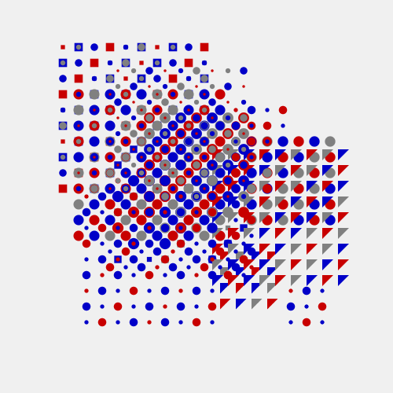

[sketch_190812a](https://github.com/villares/sketch-a-day/tree/master/2019/sketch_190812a) [[Py.Processing](https://villares.github.io/como-instalar-o-processing-modo-python/index-EN)]

---

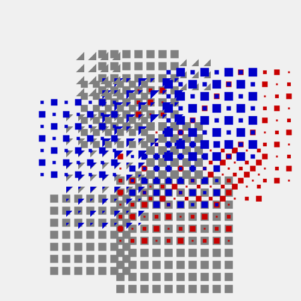

[sketch_190811a](https://github.com/villares/sketch-a-day/tree/master/2019/sketch_190811a) [[Py.Processing](https://villares.github.io/como-instalar-o-processing-modo-python/index-EN)]

---

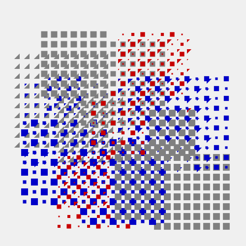

[sketch_190810a](https://github.com/villares/sketch-a-day/tree/master/2019/sketch_190810a) [[Py.Processing](https://villares.github.io/como-instalar-o-processing-modo-python/index-EN)]


---

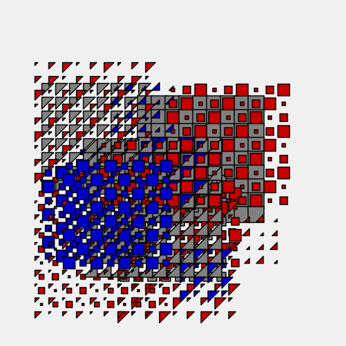

[sketch_190809a](https://github.com/villares/sketch-a-day/tree/master/2019/sketch_190809a) [[Py.Processing](https://villares.github.io/como-instalar-o-processing-modo-python/index-EN)]

---

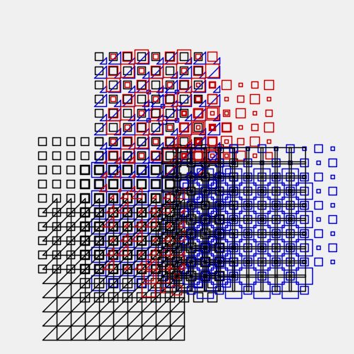

[sketch_190808a](https://github.com/villares/sketch-a-day/tree/master/2019/sketch_190808a) [[Py.Processing](https://villares.github.io/como-instalar-o-processing-modo-python/index-EN)]

---

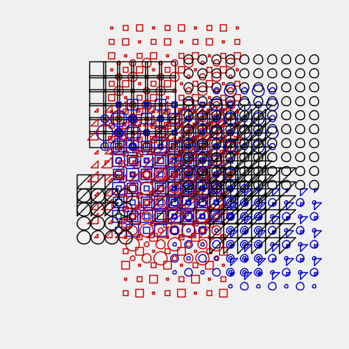

[sketch_190807a](https://github.com/villares/sketch-a-day/tree/master/2019/sketch_190807a) [[Py.Processing](https://villares.github.io/como-instalar-o-processing-modo-python/index-EN)]

---

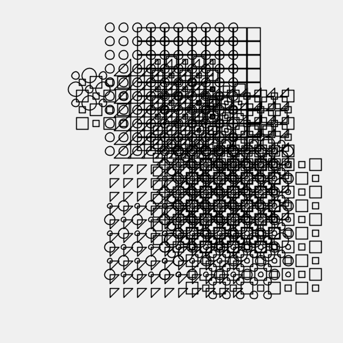

[sketch_190806a](https://github.com/villares/sketch-a-day/tree/master/2019/sketch_190806a) [[Py.Processing](https://villares.github.io/como-instalar-o-processing-modo-python/index-EN)]

---


[sketch_190805a](https://github.com/villares/sketch-a-day/tree/master/2019/sketch_190805a) [[Py.Processing](https://villares.github.io/como-instalar-o-processing-modo-python/index-EN)]

---


[sketch_190804a](https://github.com/villares/sketch-a-day/tree/master/2019/sketch_190804a) [[Py.Processing](https://villares.github.io/como-instalar-o-processing-modo-python/index-EN)]

---


[sketch_190803a](https://github.com/villares/sketch-a-day/tree/master/2019/sketch_190803a) [[Py.Processing](https://villares.github.io/como-instalar-o-processing-modo-python/index-EN)]

---

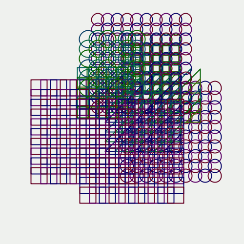

[sketch_190802a](https://github.com/villares/sketch-a-day/tree/master/2019/sketch_190802a) [[Py.Processing](https://villares.github.io/como-instalar-o-processing-modo-python/index-EN)]

---

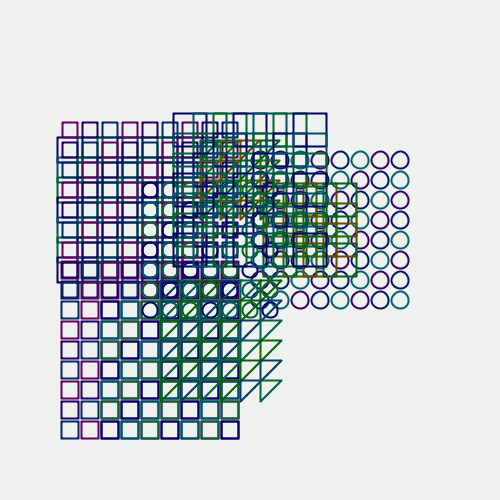

[sketch_190801a](https://github.com/villares/sketch-a-day/tree/master/2019/sketch_190801a) [[Py.Processing](https://villares.github.io/como-instalar-o-processing-modo-python/index-EN)]

---


[sketch_190731a](https://github.com/villares/sketch-a-day/tree/master/2019/sketch_190731a) [[Py.Processing](https://villares.github.io/como-instalar-o-processing-modo-python/index-EN)]

---

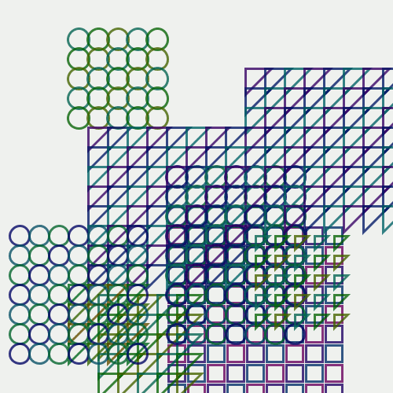

[sketch_190730a](https://github.com/villares/sketch-a-day/tree/master/2019/sketch_190730a) [[Py.Processing](https://villares.github.io/como-instalar-o-processing-modo-python/index-EN)]

---


[sketch_190729a](https://github.com/villares/sketch-a-day/tree/master/2019/sketch_190729a) [[Py.Processing](https://villares.github.io/como-instalar-o-processing-modo-python/index-EN)]

---

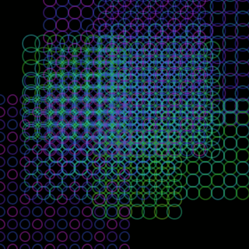

[sketch_190728a](https://github.com/villares/sketch-a-day/tree/master/2019/sketch_190728a) [[Py.Processing](https://villares.github.io/como-instalar-o-processing-modo-python/index-EN)]

---

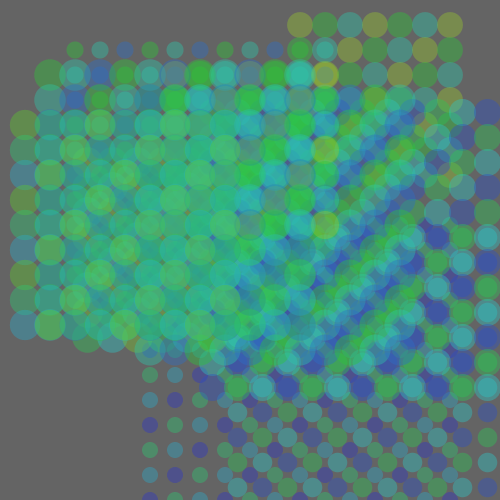

[sketch_190727a](https://github.com/villares/sketch-a-day/tree/master/2019/sketch_190727a) [[Py.Processing](https://villares.github.io/como-instalar-o-processing-modo-python/index-EN)]

---

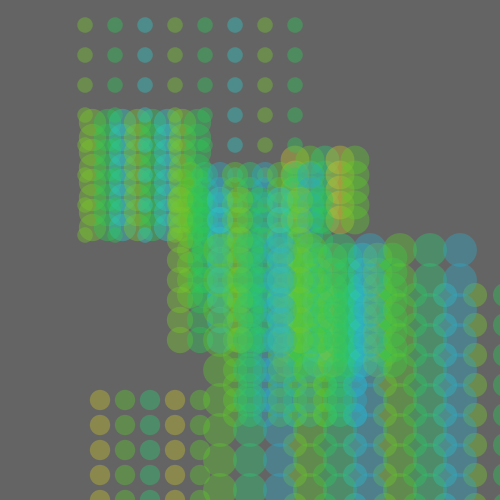

[sketch_190726a](https://github.com/villares/sketch-a-day/tree/master/2019/sketch_190726a) [[Py.Processing](https://villares.github.io/como-instalar-o-processing-modo-python/index-EN)]

---


[sketch_190725a](https://github.com/villares/sketch-a-day/tree/master/2019/sketch_190725a) [[Py.Processing](https://villares.github.io/como-instalar-o-processing-modo-python/index-EN)]

---


[sketch_190724a](https://github.com/villares/sketch-a-day/tree/master/2019/sketch_190724a) [[Py.Processing](https://villares.github.io/como-instalar-o-processing-modo-python/index-EN)]

---


[sketch_190723b](https://github.com/villares/sketch-a-day/tree/master/2019/sketch_190723b) [[Py.Processing](https://villares.github.io/como-instalar-o-processing-modo-python/index-EN)]

---

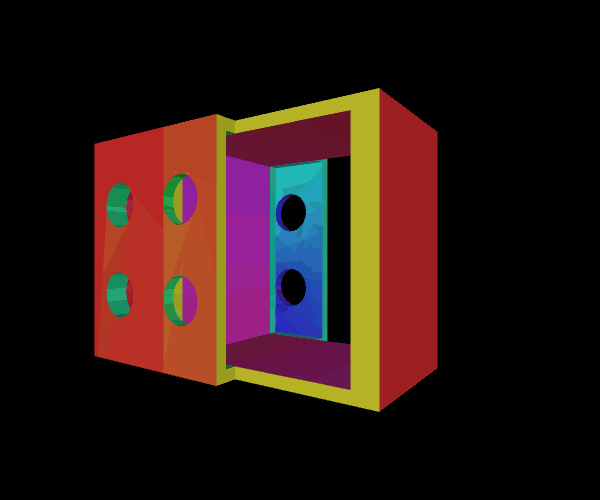

[sketch_190722a](https://github.com/villares/sketch-a-day/tree/master/2019/sketch_190722a) [[Py.Processing](https://villares.github.io/como-instalar-o-processing-modo-python/index-EN)]

Back with cylinders... and contiunously colored polys

---

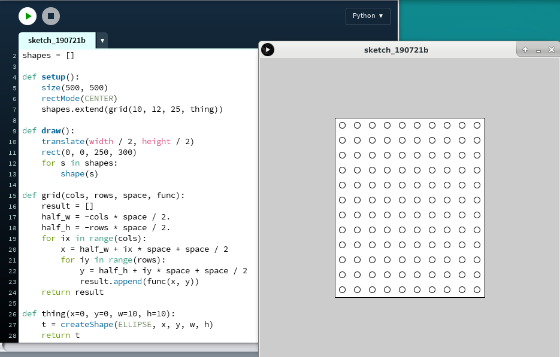

[sketch_190721a](https://github.com/villares/sketch-a-day/tree/master/2019/sketch_190721a) [[Py.Processing](https://villares.github.io/como-instalar-o-processing-modo-python/index-EN)]

Grid studies...

---

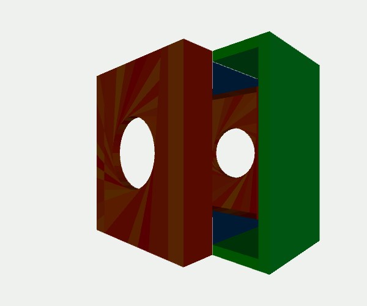

[sketch_190720a](https://github.com/villares/sketch-a-day/tree/master/2019/sketch_190720a) [[Py.Processing](https://villares.github.io/como-instalar-o-processing-modo-python/index-EN)]

Back with cylinders... and randomly colored polys

---


[sketch_190719a](https://github.com/villares/sketch-a-day/tree/master/2019/sketch_190719a) [[Py.Processing](https://villares.github.io/como-instalar-o-processing-modo-python/index-EN)]

Intersections are hard!

---

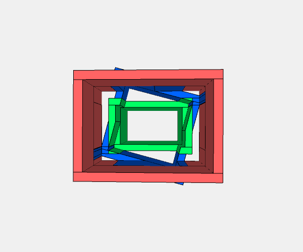

[sketch_190718a](https://github.com/villares/sketch-a-day/tree/master/2019/sketch_190718a) [[Py.Processing](https://villares.github.io/como-instalar-o-processing-modo-python/index-EN)]

It should go without saying but sketch-a-day is about work in progress.
I have yet to find ways of showing things I really think grew into something more consistent (even if I quite like some of the results here, there is a lot of unfinished stuff)

---

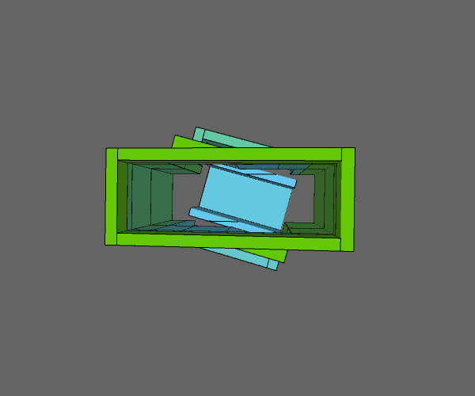

[sketch_190717a](https://github.com/villares/sketch-a-day/tree/master/2019/sketch_190717a) [[Py.Processing](https://villares.github.io/como-instalar-o-processing-modo-python/index-EN)]

Back to 15 with colors from 16

---

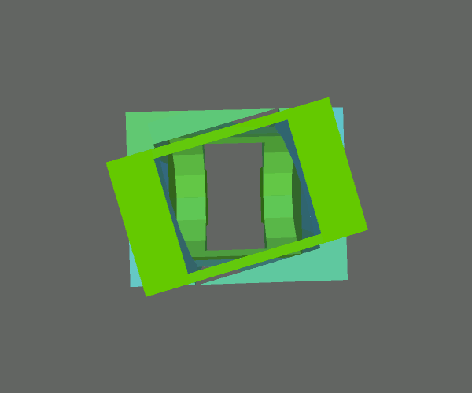

[sketch_190716a](https://github.com/villares/sketch-a-day/tree/master/2019/sketch_190716a) [[Py.Processing](https://villares.github.io/como-instalar-o-processing-modo-python/index-EN)]

Testing cylinders

---

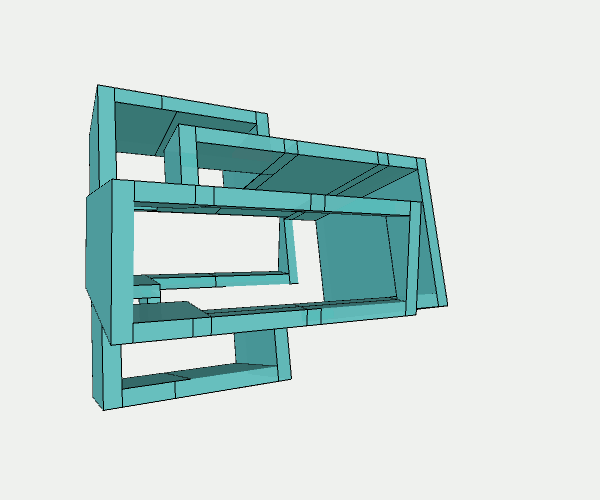

[sketch_190715a](https://github.com/villares/sketch-a-day/tree/master/2019/sketch_190715a) [[Py.Processing](https://villares.github.io/como-instalar-o-processing-modo-python/index-EN)]

Tried a 15 degree twist

---


[sketch_190714a](https://github.com/villares/sketch-a-day/tree/master/2019/sketch_190714a) [[Py.Processing](https://villares.github.io/como-instalar-o-processing-modo-python/index-EN)]

Tube-boxes (added cuboids - added holes)

---

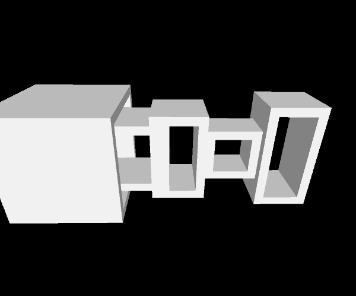

[sketch_190713b](https://github.com/villares/sketch-a-day/tree/master/2019/sketch_190713b) [[Py.Processing](https://villares.github.io/como-instalar-o-processing-modo-python/index-EN)]

---

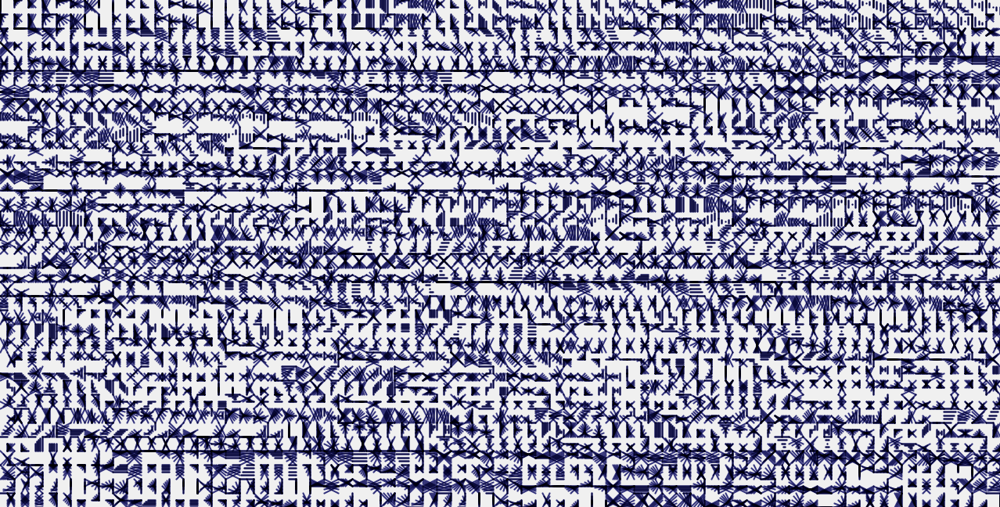

[sketch_190712a](https://github.com/villares/sketch-a-day/tree/master/2019/sketch_190712a) [[Py.Processing](https://villares.github.io/como-instalar-o-processing-modo-python/index-EN)]

---

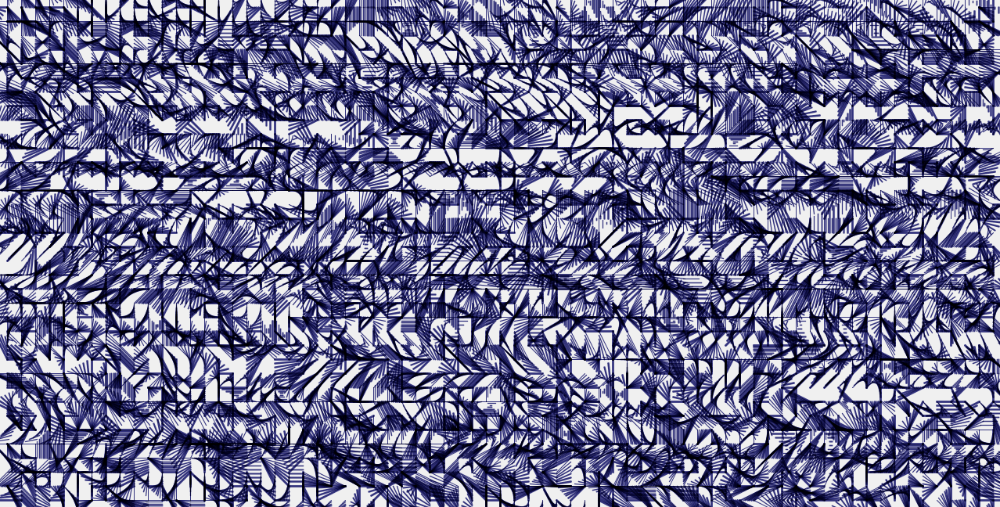

[sketch_190711a](https://github.com/villares/sketch-a-day/tree/master/2019/sketch_190711a) [[Py.Processing](https://villares.github.io/como-instalar-o-processing-modo-python/index-EN)]

---


[sketch_190710a](https://github.com/villares/sketch-a-day/tree/master/2019/sketch_190710a) [[Py.Processing](https://villares.github.io/como-instalar-o-processing-modo-python/index-EN)]

- 1288 (half-total) combinations of 2-bars on a 3x3 grid

---


[sketch_190709a](https://github.com/villares/sketch-a-day/tree/master/2019/sketch_190709a) [[Py.Processing](https://villares.github.io/como-instalar-o-processing-modo-python/index-EN)]

---

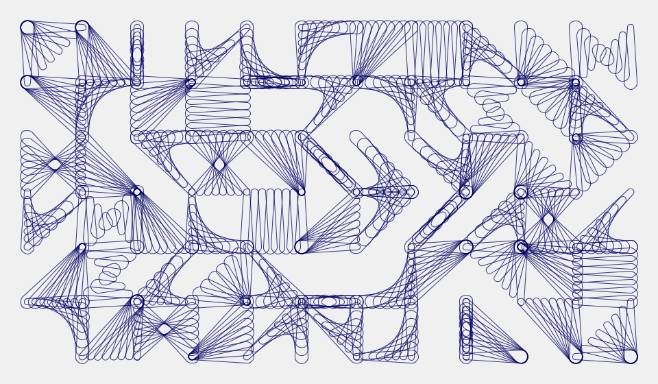

[sketch_190708a](https://github.com/villares/sketch-a-day/tree/master/2019/sketch_190708a) [[Py.Processing](https://villares.github.io/como-instalar-o-processing-modo-python/index-EN)]

- Number of possible bars on a 2x2 grid: 12 
- Number of 2-bar combinations: 66
- Cols: 11 Rows: 6 
- Interpolating 6 intermediary bars (total of 8 bars drawn)
- Overlapping slightly the combinations

---


[sketch_190707a](https://github.com/villares/sketch-a-day/tree/master/2019/sketch_190707a) [[Py.Processing](https://villares.github.io/como-instalar-o-processing-modo-python/index-EN)]

More explorations of inerpolated combinations in grids
- Number of possible bars on a 2x2 grid: 12 
- Number of 3-bar combinations: 220
- Cols: 20 Rows: 11 
- Interpolating 2 intermediares each bar pair

---

<iframe src="https://abav.lugaralgum.com/sketch-a-day/2019/sketch_190706a/web06/index.html" style="width: 500px; height: 500px; border: 0px"></iframe>
sketch_190706a [Py.Processing code](https://github.com/villares/sketch-a-day/tree/master/2019/sketch_190706a) [pyp5js code](https://github.com/villares/sketch-a-day/tree/master/2019/sketch_190706a/web06)

---

<iframe src="https://abav.lugaralgum.com/sketch-a-day/2019/sketch_190705a/web05/index.html" style="width: 500px; height: 500px; border: 0px"></iframe>
sketch_190705a [Py.Processing code](https://github.com/villares/sketch-a-day/tree/master/2019/sketch_190705a) [pyp5js code](https://github.com/villares/sketch-a-day/tree/master/2019/sketch_190705a/web05)

---

<iframe src="https://abav.lugaralgum.com/sketch-a-day/2019/sketch_190704a/web/index.html" style="width: 500px; height: 500px; border: 0px"></iframe>
sketch_190704a [Py.Processing code](https://github.com/villares/sketch-a-day/tree/master/2019/sketch_190704a) [pyp5js code](https://github.com/villares/sketch-a-day/tree/master/2019/sketch_190704a/web)

---

<iframe src="https://abav.lugaralgum.com/sketch-a-day/2019/sketch_190703a/web/index.html" style="width: 500px; height: 500px; border: 0px"></iframe>
sketch_190703a [Py.Processing code](https://github.com/villares/sketch-a-day/tree/master/2019/sketch_190703a) [pyp5js code](https://github.com/villares/sketch-a-day/tree/master/2019/sketch_190703a/web)

---

<iframe src="https://abav.lugaralgum.com/sketch-a-day/2019/sketch_190702a/web/index.html" style="width: 500px; height: 500px; border: 0px"></iframe>
sketch_190702a [Py.Processing code](https://github.com/villares/sketch-a-day/tree/master/2019/sketch_190702a) [pyp5js code](https://github.com/villares/sketch-a-day/tree/master/2019/sketch_190702a/web)

---

<iframe src="https://abav.lugaralgum.com/sketch-a-day/2019/sketch_190701a/s190791web/index.html" style="width: 500px; height: 500px; border: 0px"></iframe>
sketch_190701a [Py.Processing code](https://github.com/villares/sketch-a-day/tree/master/2019/sketch_190701a) [pyp5js code](https://github.com/villares/sketch-a-day/tree/master/2019/sketch_190701a/s190791web)

---

<iframe src="https://abav.lugaralgum.com/sketch-a-day/2019/sketch_190630a/s190630web/index.html" style="width: 500px; height: 500px; border: 0px"></iframe>
sketch_190630a [Py.Processing code](https://github.com/villares/sketch-a-day/tree/master/2019/sketch_190630a) [pyp5js code](https://github.com/villares/sketch-a-day/tree/master/2019/sketch_190630a/s190630web)

---


[sketch_190629a](https://github.com/villares/sketch-a-day/tree/master/2019/sketch_190628a) [[Py.Processing](https://villares.github.io/como-instalar-o-processing-modo-python/index-EN)]

- First attempt at a 3D version of 190628a (not a very good gif, [mp4 here](2019/sketch_190629a/processing-movie.mp4))

---

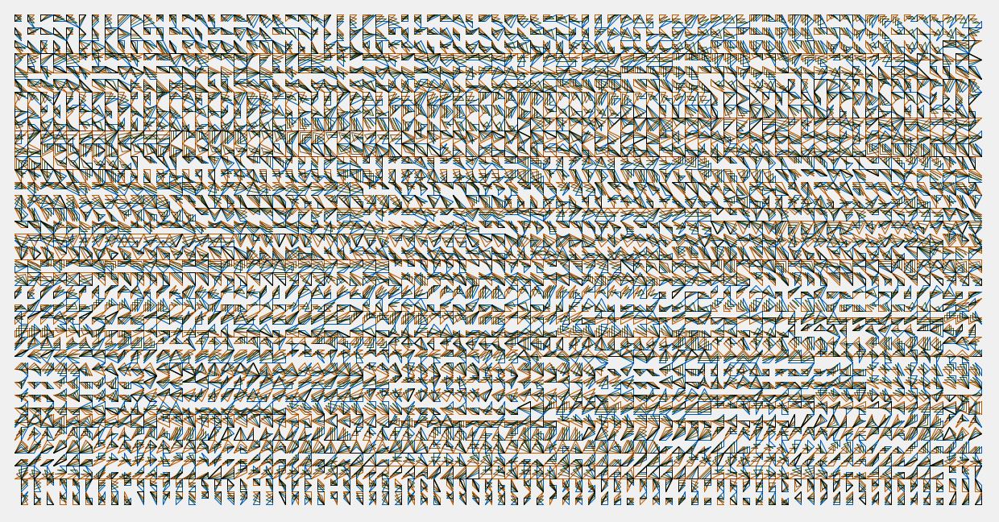

[sketch_190628a](https://github.com/villares/sketch-a-day/tree/master/2019/sketch_190628a) [[Py.Processing](https://villares.github.io/como-instalar-o-processing-modo-python/index-EN)]

- Number of possible triangles on a 3x3 grid: 76
- Number of combinations of 2 triangles (start, end): 2850
- Interpolating 2 intermediary triangles

---


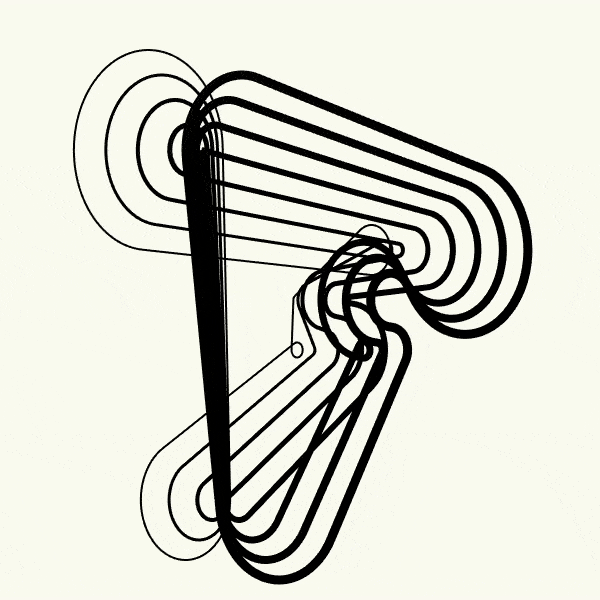

[sketch_190627b](https://github.com/villares/sketch-a-day/tree/master/2019/sketch_190627b) [[Py.Processing](https://villares.github.io/como-instalar-o-processing-modo-python/index-EN)]

---


[sketch_190626a](https://github.com/villares/sketch-a-day/tree/master/2019/sketch_190626a) [[Py.Processing](https://villares.github.io/como-instalar-o-processing-modo-python/index-EN)]

---


[sketch_190625a](https://github.com/villares/sketch-a-day/tree/master/2019/sketch_190625a) [[Py.Processing](https://villares.github.io/como-instalar-o-processing-modo-python/index-EN)]

---


[sketch_190624a](https://github.com/villares/sketch-a-day/tree/master/2019/sketch_190624a) [[Py.Processing](https://villares.github.io/como-instalar-o-processing-modo-python/index-EN)]

- the usual 3D transformation

---

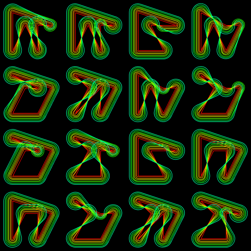

[sketch_190623a](https://github.com/villares/sketch-a-day/tree/master/2019/sketch_190623a) [[Py.Processing](https://villares.github.io/como-instalar-o-processing-modo-python/index-EN)]

---


[sketch_190622a](https://github.com/villares/sketch-a-day/tree/master/2019/sketch_190622a) [[Py.Processing](https://villares.github.io/como-instalar-o-processing-modo-python/index-EN)]

---

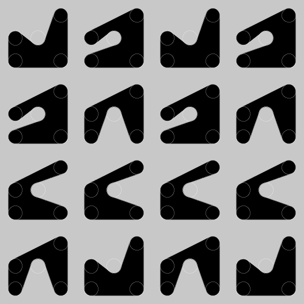

[sketch_190621a](https://github.com/villares/sketch-a-day/tree/master/2019/sketch_190621a) [[Py.Processing](https://villares.github.io/como-instalar-o-processing-modo-python/index-EN)]

---


[sketch_190620a](https://github.com/villares/sketch-a-day/tree/master/2019/sketch_190620a) [[Py.Processing](https://villares.github.io/como-instalar-o-processing-modo-python/index-EN)]

---

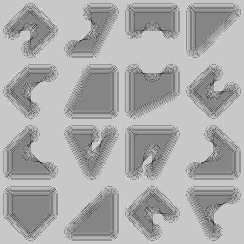

[sketch_190619a](https://github.com/villares/sketch-a-day/tree/master/2019/sketch_190619a) [[Py.Processing](https://villares.github.io/como-instalar-o-processing-modo-python/index-EN)]

---

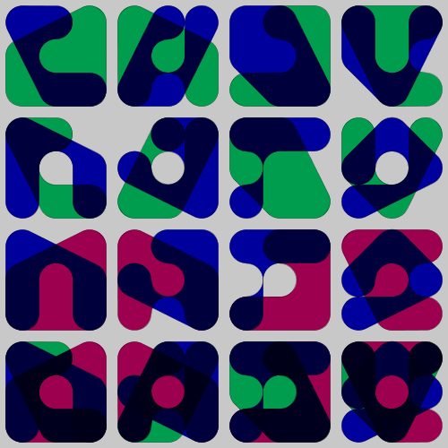

[sketch_190618a](https://github.com/villares/sketch-a-day/tree/master/2019/sketch_190618a) [[Py.Processing](https://villares.github.io/como-instalar-o-processing-modo-python/index-EN)]

---


[sketch_190617a](https://github.com/villares/sketch-a-day/tree/master/2019/sketch_190617a) [[Py.Processing](https://villares.github.io/como-instalar-o-processing-modo-python/index-EN)]

- [Movie](2019/sketch_190617a/processing-movie.mp4)

- Changed the radius inversion rule for a static drawing (the moving version would make the radius zero on aligned vertices).
- Some aligned vertices visually disappear so different point circuits still produce equivalent results.

---


[sketch_190616a](https://github.com/villares/sketch-a-day/tree/master/2019/sketch_190616a) [[Py.Processing](https://villares.github.io/como-instalar-o-processing-modo-python/index-EN)]

- I tried to discard point circuits that are rotated versions of each other (and so visually equivalent)

---

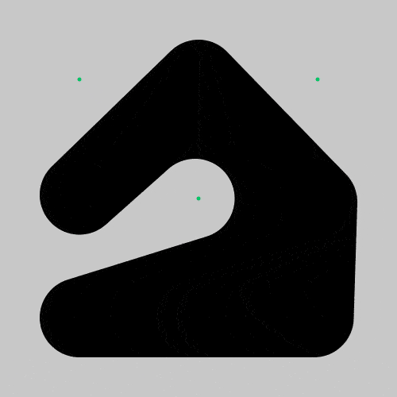

[sketch_190615a](https://github.com/villares/sketch-a-day/tree/master/2019/sketch_190615a) [[Py.Processing](https://villares.github.io/como-instalar-o-processing-modo-python/index-EN)]

- Adding some combinatorics... first try.
- 3312 *non-crossing* poly permutations with 6 points on a 3 x 3 grid

---

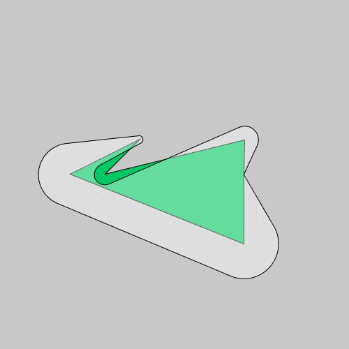

[sketch_190614a](https://github.com/villares/sketch-a-day/tree/master/2019/sketch_190614a) [[Py.Processing](https://villares.github.io/como-instalar-o-processing-modo-python/index-EN)]


- Non-intersecting polys (as end-states)

---

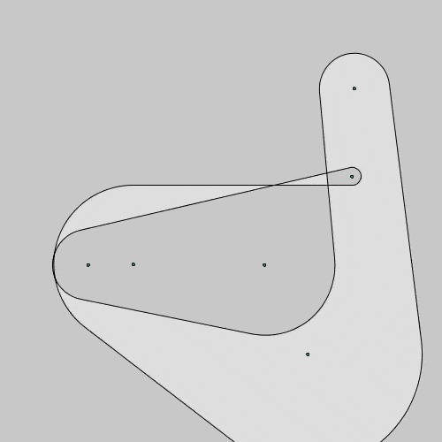

[sketch_190613a](https://github.com/villares/sketch-a-day/tree/master/2019/sketch_190613a) [[Py.Processing](https://villares.github.io/como-instalar-o-processing-modo-python/index-EN)]

- This version defines the radii acording to the area formed by the vertex point and its neighbours.

---

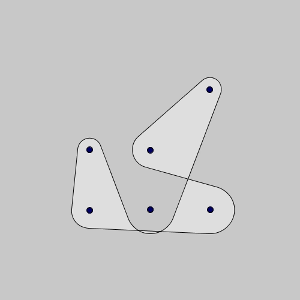

[sketch_190612a](https://github.com/villares/sketch-a-day/tree/master/2019/sketch_190612a) [[Py.Processing](https://villares.github.io/como-instalar-o-processing-modo-python/index-EN)]

- Fixed a bug that prevented drawing the arc-tangents with vertically aligned points!
- Testing Video Export library

---

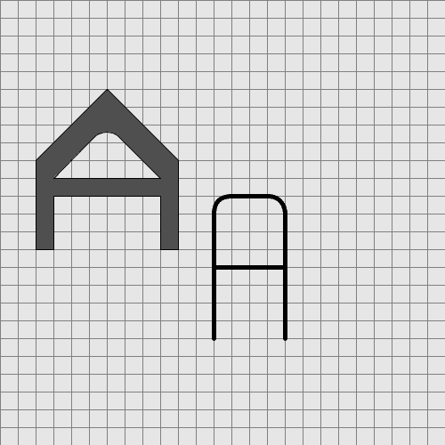

[sketch_190611a](https://github.com/villares/sketch-a-day/tree/master/2019/sketch_190612a) [[Py.Processing](https://villares.github.io/como-instalar-o-processing-modo-python/index-EN)]

- Changing vertex type/radius

---


[sketch_190610a](https://github.com/villares/sketch-a-day/tree/master/2019/sketch_190610a) [[Py.Processing](https://villares.github.io/como-instalar-o-processing-modo-python/index-EN)]

- All points now have a third field (for radius or type). That broke almost everything, and I think I fixed most of it. Including a naughty fix for the naughty vertex ordering method (I'm storing the third field in a dict, and then getting it back after sorting, with a disct compreheension!)

---

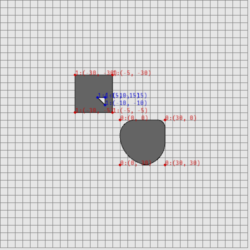

[sketch_190609a](https://github.com/villares/sketch-a-day/tree/master/2019/sketch_190609a) [[Py.Processing](https://villares.github.io/como-instalar-o-processing-modo-python/index-EN)]

- lots of refactoring
- round corner proof of concept

---


[sketch_190608a](https://github.com/villares/sketch-a-day/tree/master/2019/sketch_190608a) [[Py.Processing](https://villares.github.io/como-instalar-o-processing-modo-python/index-EN)]

Back to the Poly Editor...

---


[sketch_190607a](https://github.com/villares/sketch-a-day/tree/master/2019/sketch_190607a) [[Py.Processing](https://villares.github.io/como-instalar-o-processing-modo-python/index-EN)]

Some ideas for "Silly Type Framework"

---


[sketch_190606a](https://github.com/villares/sketch-a-day/tree/master/2019/sketch_190606a) [[Py.Processing](https://villares.github.io/como-instalar-o-processing-modo-python/index-EN)]

My arc-arc tangent augmented poly now can take negative radii (and it is Bezier based, so it now is a PShape and can be filled)

---


[sketch_190605a](https://github.com/villares/sketch-a-day/tree/master/2019/sketch_190605a) [[Py.Processing](https://villares.github.io/como-instalar-o-processing-modo-python/index-EN)]

Using new bars, with much better fill, thanks to my Bezier arc-approximation.
- Number of possible lines: 12
- Number of combinations: 220

---

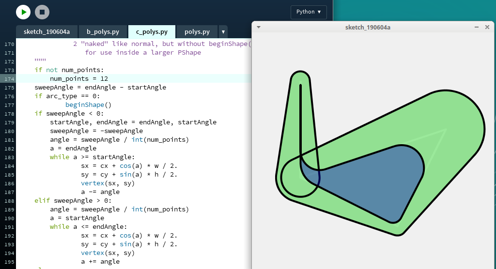

[sketch_190604a](https://github.com/villares/sketch-a-day/tree/master/2019/sketch_190604a) [[Py.Processing](https://villares.github.io/como-instalar-o-processing-modo-python/index-EN)]

Did some cleanup of yesterday's code and updated my polygon approximation of an arc, to use it with the filleted and arc-augmented polylines.

---

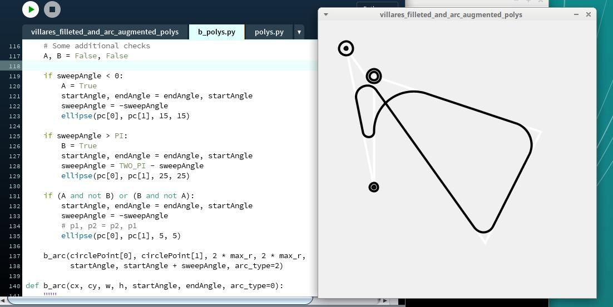

[sketch_190603a](https://github.com/villares/sketch-a-day/tree/master/2019/sketch_190602a) [[Py.Processing](https://villares.github.io/como-instalar-o-processing-modo-python/index-EN)]

After many months, I took again my Bezier arc-approximation studies and finished integrating it with two "polylines" ideas:
- A filleted polygon
- An arc-augmented polygon (imagine round pegs, of arbitrary radius, on every vertex of a polygon, and a line that goes round them)

---

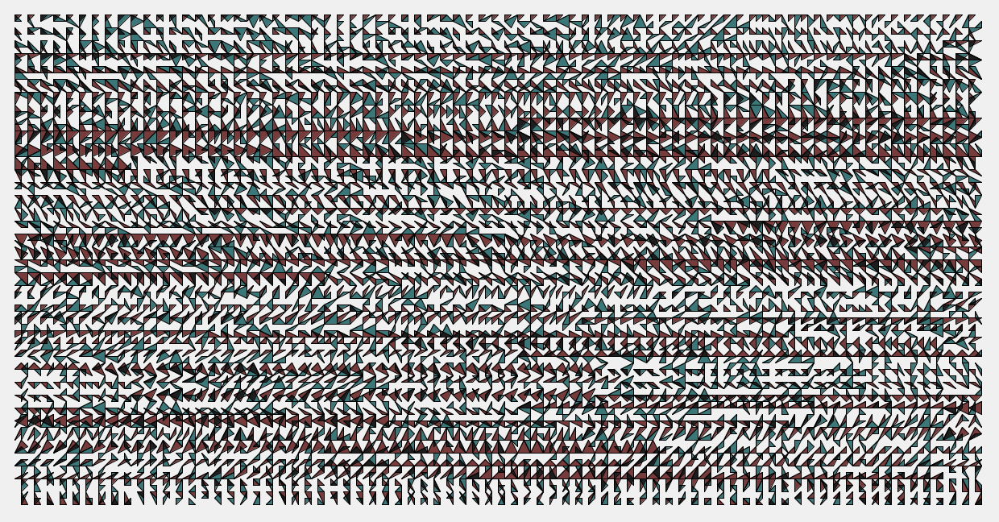

[sketch_190602a](https://github.com/villares/sketch-a-day/tree/master/2019/sketch_190602a) [[Py.Processing](https://villares.github.io/como-instalar-o-processing-modo-python/index-EN)]

- Number of possible triangles: 76
- Number of combinations of 2 triangles: 2850
- Cols: 75 Rows: 38 Visible grid: 2850

---

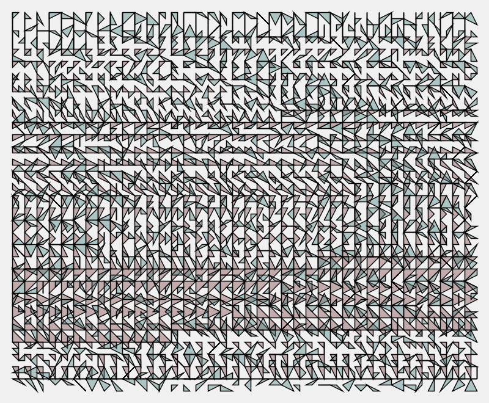

[sketch_190601a](https://github.com/villares/sketch-a-day/tree/master/2019/sketch_190601a) [[Py.Processing](https://villares.github.io/como-instalar-o-processing-modo-python/index-EN)]

- Number of possible triangles: 84 (including "colapsed triangles" with colinear points)
- 2 triangles the number of combinations is: 3486 

---

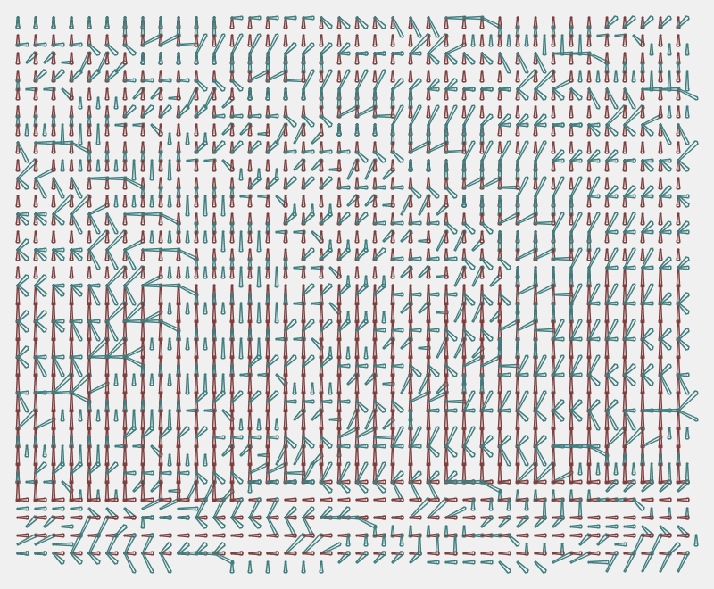

[sketch_190531a](https://github.com/villares/sketch-a-day/tree/master/2019/sketch_190531a) [[Py.Processing](https://villares.github.io/como-instalar-o-processing-modo-python/index-EN)]

- Number of possible triangles: 84
- Taking 3 points twice the number of combinations is: 3486 
- But I'm drawing "bars" using just 2 of the 3 points, so I have lots of repeated "combos" on this one
- Cols: 38 Rows: 31 Visible grid: 1178

---

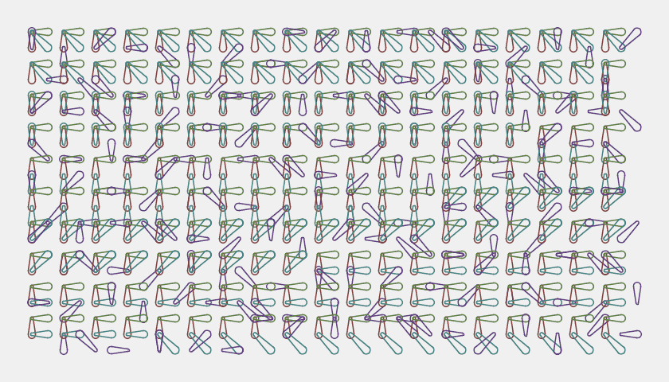

[sketch_190530b](https://github.com/villares/sketch-a-day/tree/master/2019/sketch_190530a) [[Py.Processing](https://villares.github.io/como-instalar-o-processing-modo-python/index-EN)]

- Number of possible lines on a 3x3: 40
- Number of combinations: 91390
- Cols: 19 Rows: 10 Visible grid: 190

---


[sketch_190529a](https://github.com/villares/sketch-a-day/tree/master/2019/sketch_190529a) [[Py.Processing](https://villares.github.io/como-instalar-o-processing-modo-python/index-EN)]

- Number of bars on 2x2 grid: 12
- Number of permutations (taking 3 bars): 1320
- Cols: 20  Rows: 11  Visible grid: 220 (x6)

---

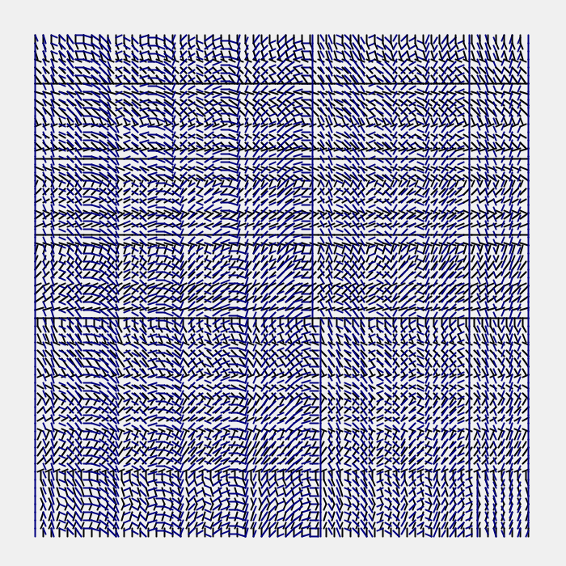
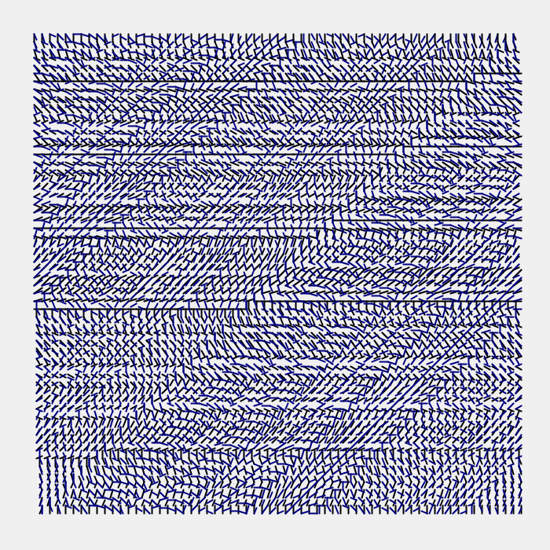

[sketch_190528a](https://github.com/villares/sketch-a-day/tree/master/2019/sketch_190528a) [[Py.Processing](https://villares.github.io/como-instalar-o-processing-modo-python/index-EN)]

- Number of long lines on a 4x4 grid: 62
- Number of permutations (taking 2 lines): 3782
- Cols: 61  Rows: 62  Visible grid: 3782

---

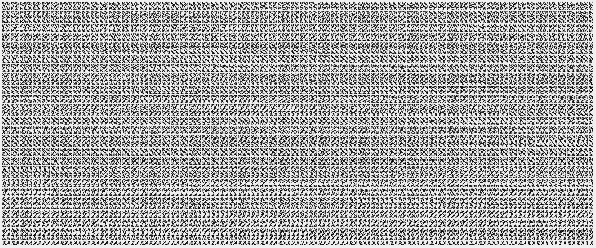

[sketch_190527a](https://github.com/villares/sketch-a-day/tree/master/2019/sketch_190527a) [[Py.Processing](https://villares.github.io/como-instalar-o-processing-modo-python/index-EN)]

- Number of possible long lines on 4x4 grid: 22
- Number of combinations: 7315
- Cols: 133  Lines: 55  Visible grid: 7315
- Variations: isolated/merged color/b&w ordered/shuffled

---

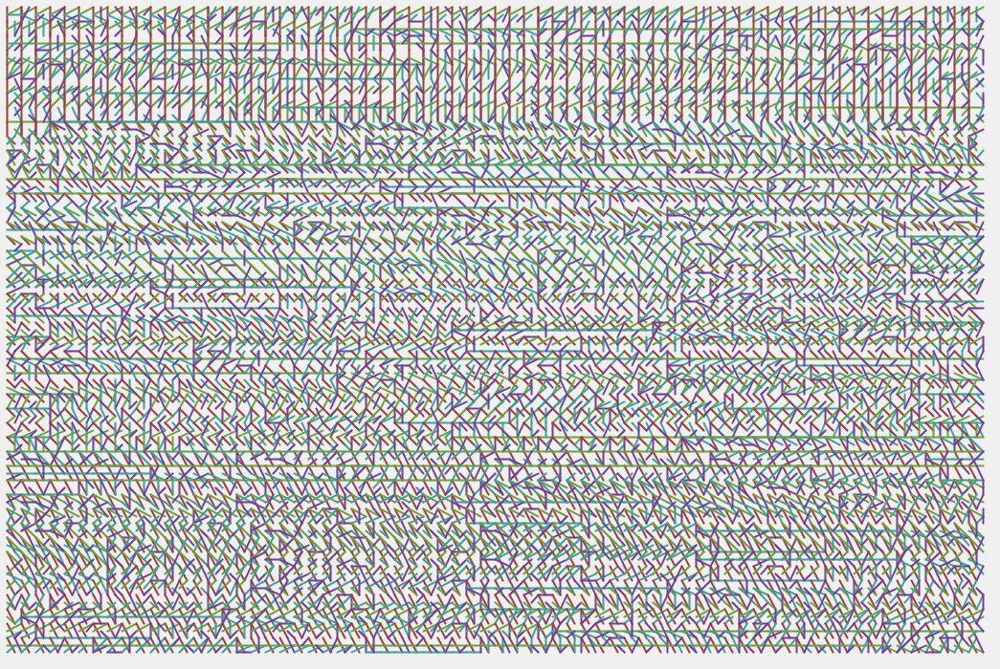

[sketch_190526a](https://github.com/villares/sketch-a-day/tree/master/2019/sketch_190526a) [[Py.Processing](https://villares.github.io/como-instalar-o-processing-modo-python/index-EN)]

- Number of lines on a 3x3 grid: 24
- Number of combinations: 10626
- Cols: 68 Lines: 45 Visible grid: 3060 (scrolling)

---


[sketch_190525a](https://github.com/villares/sketch-a-day/tree/master/2019/sketch_190525a) [[Py.Processing](https://villares.github.io/como-instalar-o-processing-modo-python/index-EN)]

---

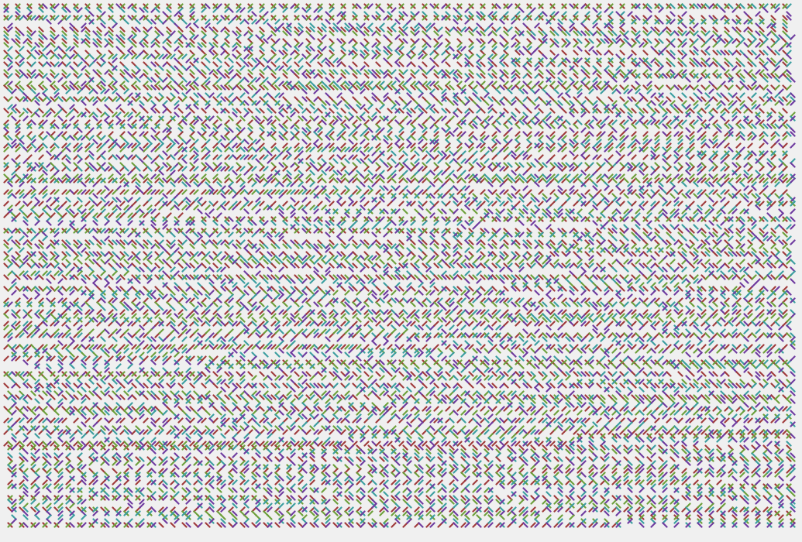

[sketch_190524a](https://github.com/villares/sketch-a-day/tree/master/2019/sketch_190524a) [[Py.Processing](https://villares.github.io/como-instalar-o-processing-modo-python/index-EN)]

---

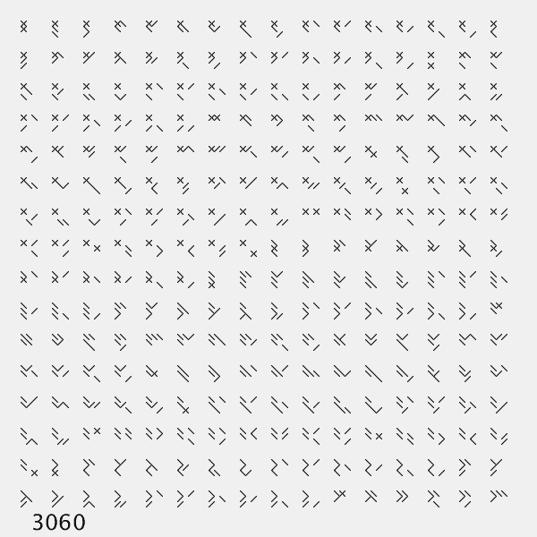

[sketch_190523a](https://github.com/villares/sketch-a-day/tree/master/2019/sketch_190523a) [[Py.Processing](https://villares.github.io/como-instalar-o-processing-modo-python/index-EN)]

---

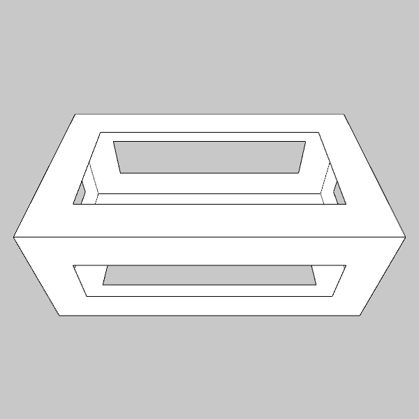

[sketch_190522a](https://github.com/villares/sketch-a-day/tree/master/2019/sketch_190522a) [[Py.Processing](https://villares.github.io/como-instalar-o-processing-modo-python/index-EN)]

---

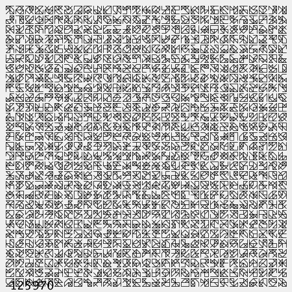

[sketch_190521a](https://github.com/villares/sketch-a-day/tree/master/2019/sketch_190521a) [[Py.Processing](https://villares.github.io/como-instalar-o-processing-modo-python/index-EN)]

Shuffle of 125970 combinations...

---

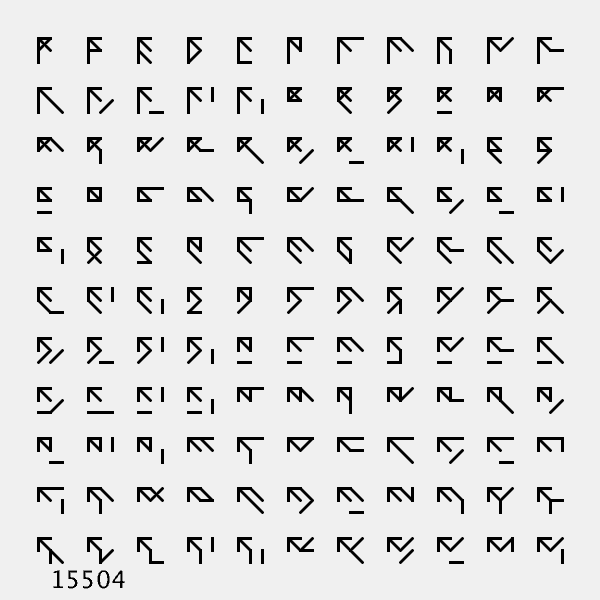

[sketch_190520a](https://github.com/villares/sketch-a-day/tree/master/2019/sketch_190520a) [[Py.Processing](https://villares.github.io/como-instalar-o-processing-modo-python/index-EN)]

More experiments (check the code folder for other GIFs)

---


[sketch_190519a](https://github.com/villares/sketch-a-day/tree/master/2019/sketch_190519a) [[Py.Processing](https://villares.github.io/como-instalar-o-processing-modo-python/index-EN)]

---

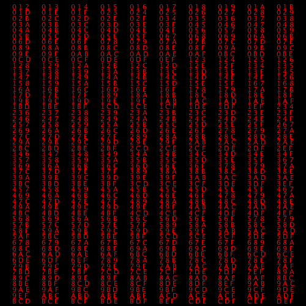

[sketch_190518a](https://github.com/villares/sketch-a-day/tree/master/2019/sketch_190518a) [[Py.Processing](https://villares.github.io/como-instalar-o-processing-modo-python/index-EN)]

---

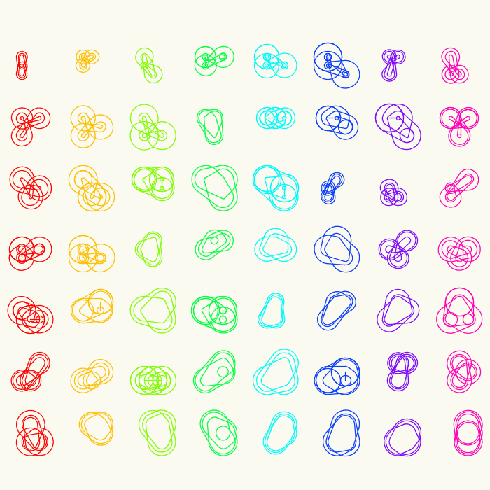

[sketch_190517b](https://github.com/villares/sketch-a-day/tree/master/2019/sketch_190517b) [[Py.Processing](https://villares.github.io/como-instalar-o-processing-modo-python/index-EN)]

Also... internation day against homophobia, transphobia and biphobia.

---


[sketch_190517a](https://github.com/villares/sketch-a-day/tree/master/2019/sketch_190517a) [[Py.Processing](https://villares.github.io/como-instalar-o-processing-modo-python/index-EN)]

56 combinations of 8 points, 3 at a time (and some 8 possible radius to the enclonsing rounded polys)

---

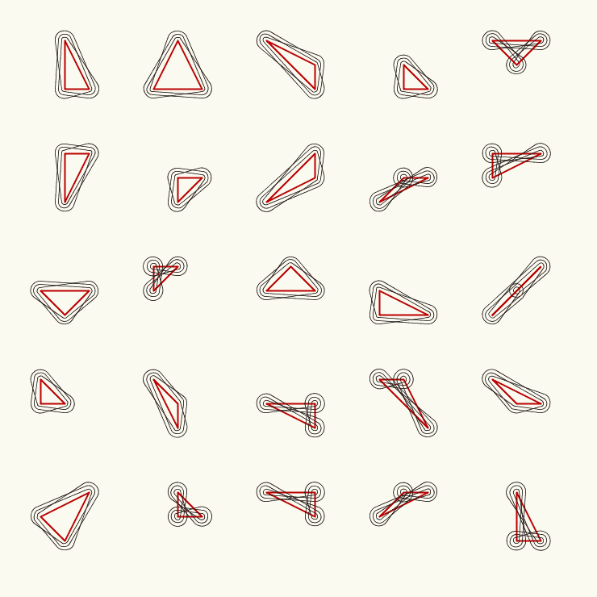

[sketch_190516a](https://github.com/villares/sketch-a-day/tree/master/2019/sketch_190516a) [[Py.Processing](https://villares.github.io/como-instalar-o-processing-modo-python/index-EN)]

Only 3 points now

---

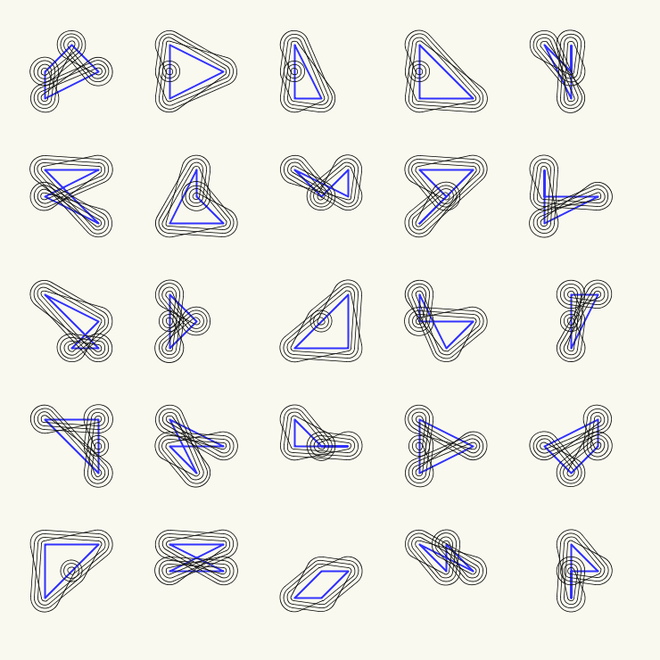

[sketch_190515a](https://github.com/villares/sketch-a-day/tree/master/2019/sketch_190515a) [[Py.Processing](https://villares.github.io/como-instalar-o-processing-modo-python/index-EN)]

A grid based on sketch_190512a/ sketch_190401b

---

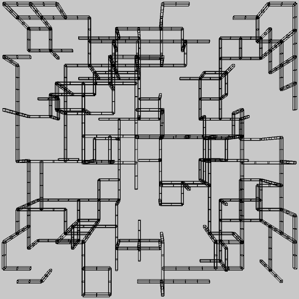

[sketch_190514b](https://github.com/villares/sketch-a-day/tree/master/2019/sketch_190514b) [[Py.Processing](https://villares.github.io/como-instalar-o-processing-modo-python/index-EN)]

Another take, thinking of color separation for printing ;)

---

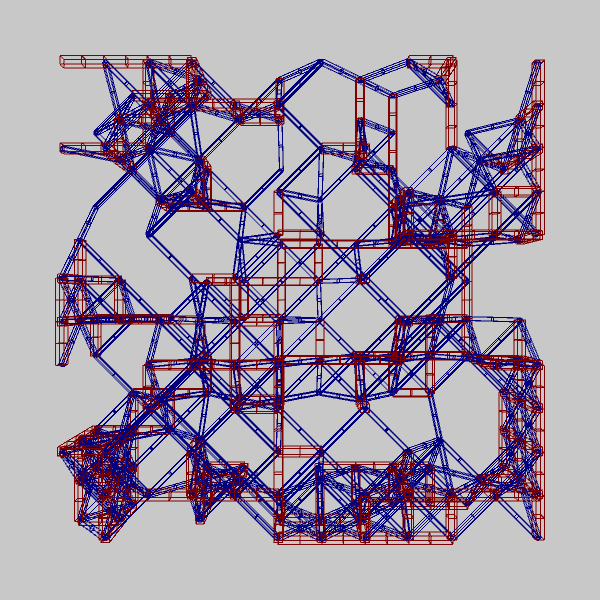

[sketch_190513a](https://github.com/villares/sketch-a-day/tree/master/2019/sketch_190513a) [[Py.Processing](https://villares.github.io/como-instalar-o-processing-modo-python/index-EN)]

A rework of sketch_190125a

---


[sketch_190512a](https://github.com/villares/sketch-a-day/tree/master/2019/sketch_190512a) [[Py.Processing](https://villares.github.io/como-instalar-o-processing-modo-python/index-EN)]

A rework of sketch_190401b

---

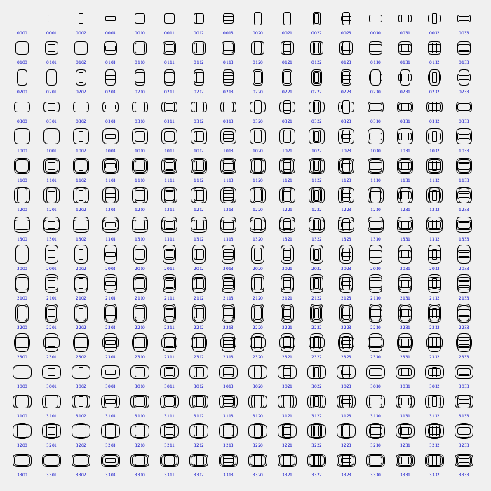

[sketch_190511b](https://github.com/villares/sketch-a-day/tree/master/2019/sketch_190511b) [[Py.Processing](https://villares.github.io/como-instalar-o-processing-modo-python/index-EN)]

---

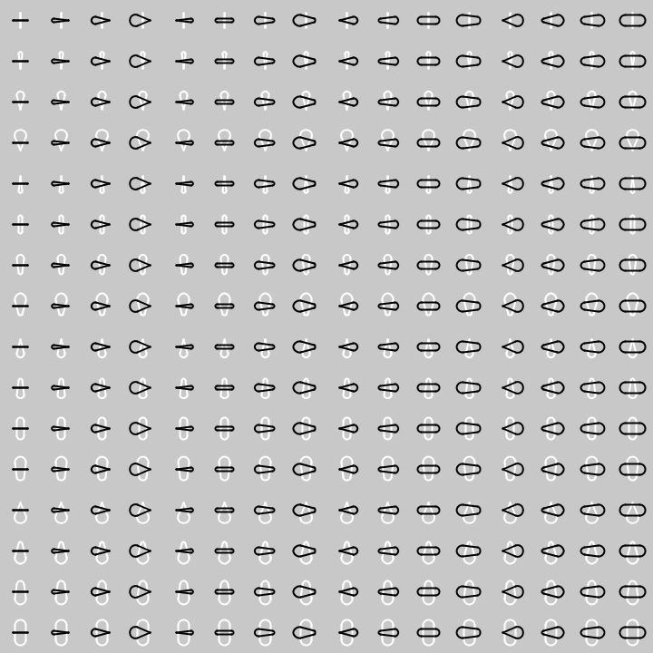

[sketch_190510a](https://github.com/villares/sketch-a-day/tree/master/2019/sketch_190510a) [[Py.Processing](https://villares.github.io/como-instalar-o-processing-modo-python/index-EN)]

---

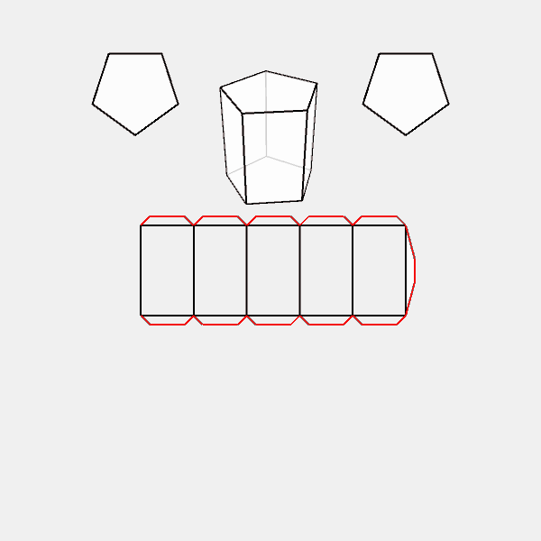

[sketch_190509a](https://github.com/villares/sketch-a-day/tree/master/2019/sketch_190509a) [[Py.Processing](https://villares.github.io/como-instalar-o-processing-modo-python/index-EN)]

Ugly but works :)

---

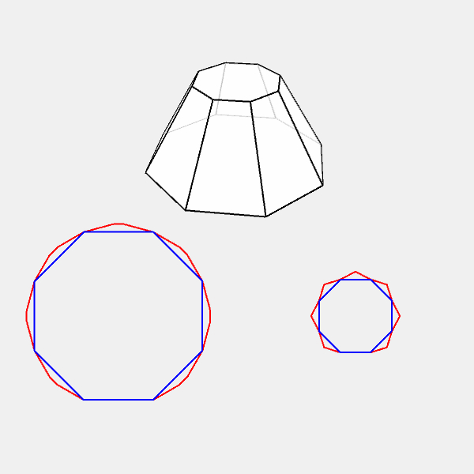

sketch_190508a [[code for Py.Processing](https://github.com/villares/sketch-a-day/tree/master/2019/sketch_190508a)]

Back unfolding solids... 2D faces missing.

---

[](https://abav.lugaralgum.com/sketch-a-day/2019/sketch_190507a/index.html)

Using [pyp5js](https://github.com/berinhard/pyp5js)to run [on your browser](https://abav.lugaralgum.com/sketch-a-day/2019/sketch_190507a/index.html)

sketch_190507a [[code for pyp5js](https://github.com/villares/sketch-a-day/tree/master/2019/sketch_190507a)]

---


Old sketch tweaked to port tomorrow.

---


Using [pyp5js](https://github.com/berinhard/pyp5js) to run [on your browser](https://abav.lugaralgum.com/sketch-a-day/2019/sketch_190505b/index.html)

sketch_190505a
[[code for pyp5js](https://github.com/villares/sketch-a-day/tree/master/2019/sketch_190505b)]
[[code for Py.Processing](https://github.com/villares/sketch-a-day/tree/master/2019/sketch_190505a)]

---

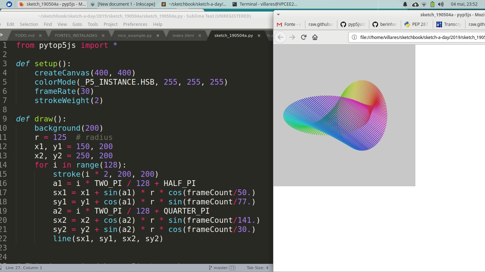

Using [pyp5js](https://github.com/berinhard/pyp5js)to run [on your browser](https://abav.lugaralgum.com/sketch-a-day/2019/sketch_190504a/index.html)

sketch_190504a code:[pyp5js](https://github.com/villares/sketch-a-day/tree/master/2019/sketch_190504a)

---

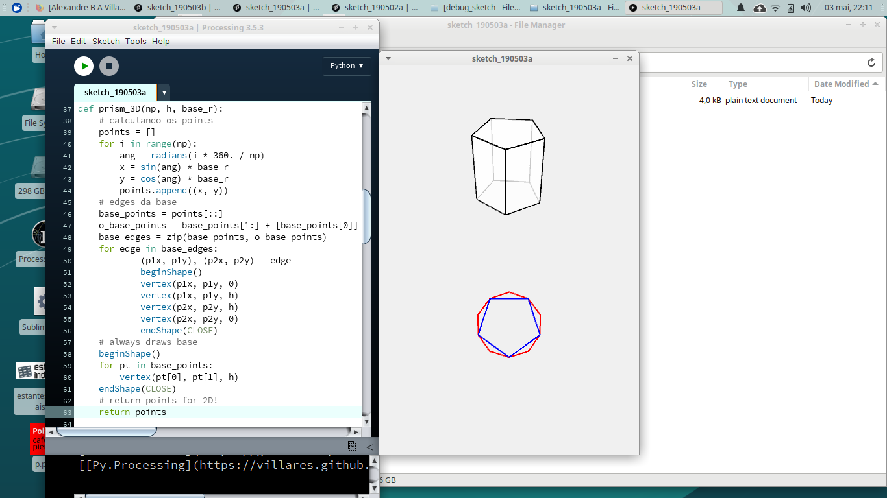

[sketch_190503a](https://github.com/villares/sketch-a-day/tree/master/2019/sketch_190503a) [[Py.Processing](https://villares.github.io/como-instalar-o-processing-modo-python/index-EN)]

---

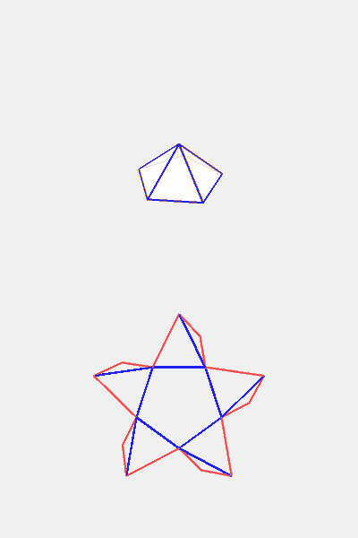

[sketch_190502a](https://github.com/villares/sketch-a-day/tree/master/2019/sketch_190502a) [[Py.Processing](https://villares.github.io/como-instalar-o-processing-modo-python/index-EN)]

---

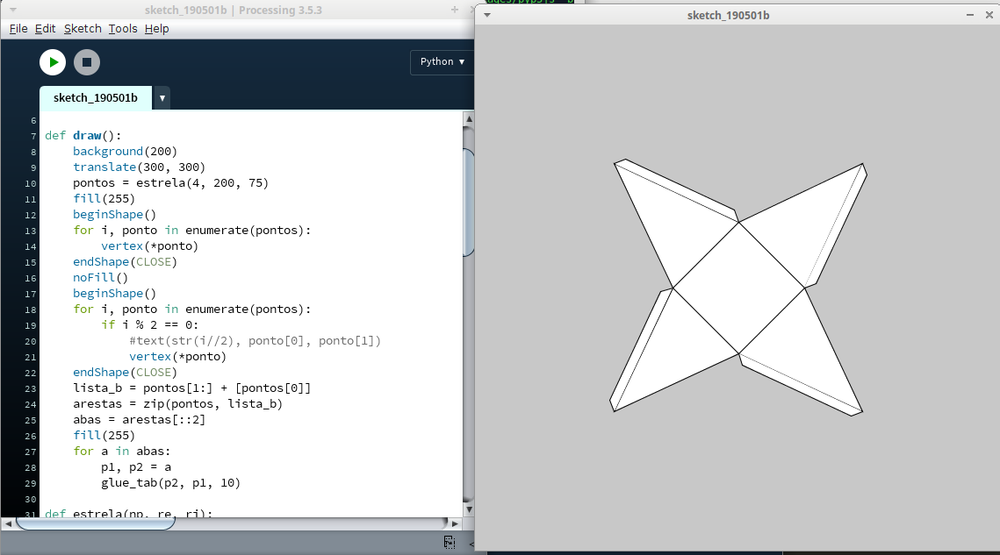

[sketch_190501a](https://github.com/villares/sketch-a-day/tree/master/2019/sketch_190501a) [[Py.Processing](https://villares.github.io/como-instalar-o-processing-modo-python/index-EN)]

---

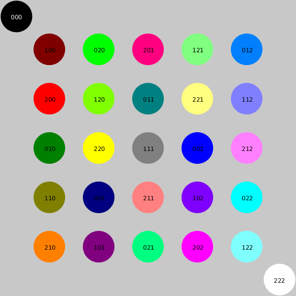

[sketch_190430b](https://github.com/villares/sketch-a-day/tree/master/2019/sketch_190430b) [[Py.Processing](https://villares.github.io/como-instalar-o-processing-modo-python/index-EN)]

---


[sketch_190429b](https://github.com/villares/sketch-a-day/tree/master/2019/sketch_190429b) [[Py.Processing](https://villares.github.io/como-instalar-o-processing-modo-python/index-EN)]

---

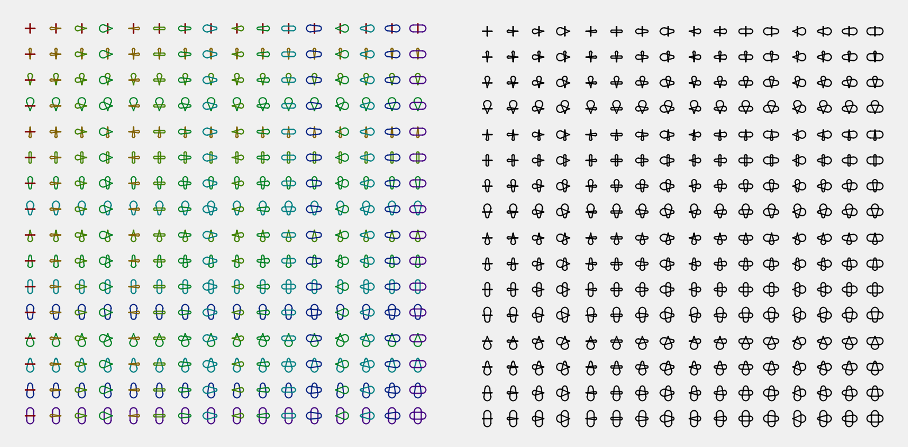

[sketch_190428b](https://github.com/villares/sketch-a-day/tree/master/2019/sketch_190428b) [[Py.Processing](https://villares.github.io/como-instalar-o-processing-modo-python/index-EN)]

Mixing in my var_bar() circle/circle tangent shape

---

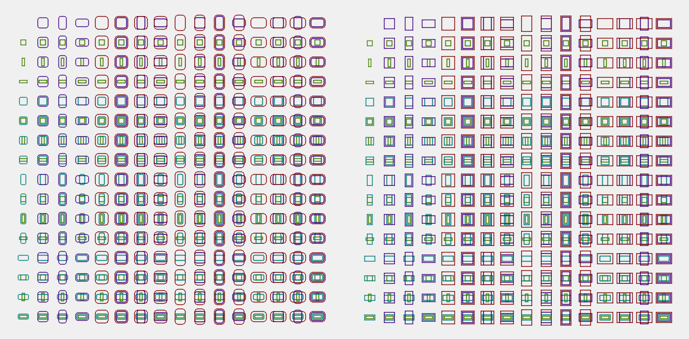

[sketch_190427b](https://github.com/villares/sketch-a-day/tree/master/2019/sketch_190427b) [[Py.Processing](https://villares.github.io/como-instalar-o-processing-modo-python/index-EN)]

Now based on 4 quaternary digits (256 variations). Each digit can be 0, 1, 2, or 3. And zero means no shape drawn for that layer/position. Still influenced by @arjanvandermeij :)

---

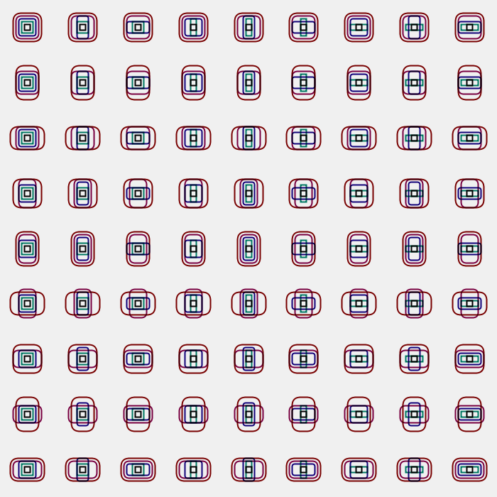

[sketch_190426b](https://github.com/villares/sketch-a-day/tree/master/2019/sketch_190426b) [[Py.Processing](https://villares.github.io/como-instalar-o-processing-modo-python/index-EN)]

---

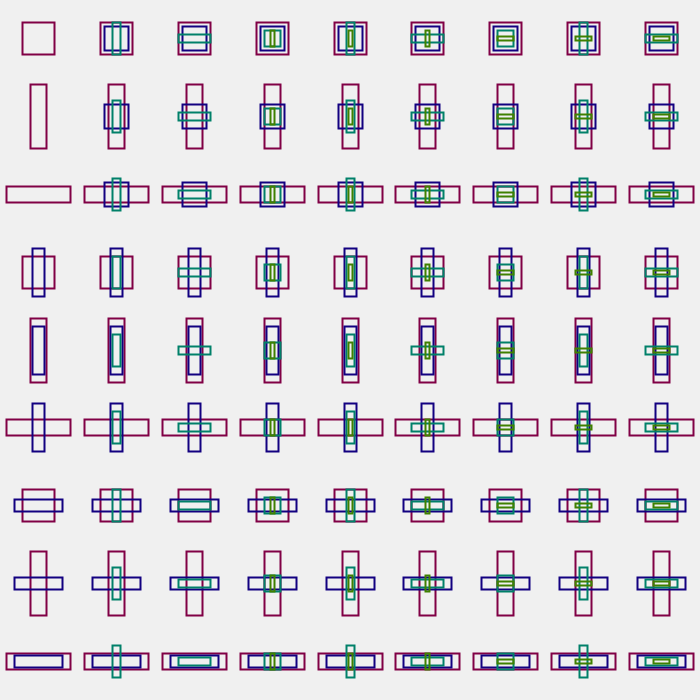

[sketch_190425b](https://github.com/villares/sketch-a-day/tree/master/2019/sketch_190425b)  [[Py.Processing](https://villares.github.io/como-instalar-o-processing-modo-python/index-EN)]

---

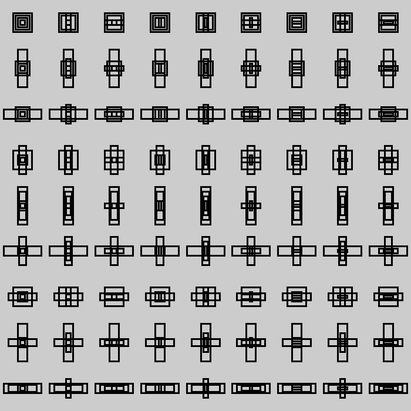

[sketch_190424b](https://github.com/villares/sketch-a-day/tree/master/2019/sketch_190424b) [[Py.Processing](https://villares.github.io/como-instalar-o-processing-modo-python/index-EN)]

 Inspired by "trit" grids of balanced ternary digits from @arjanvandermeij
 (4 ternary digits -> 81 variations) 

---

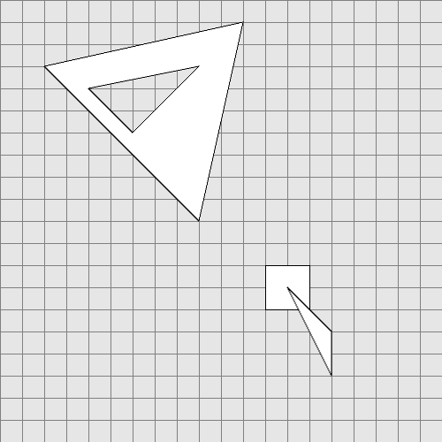

[sketch_190424a](https://github.com/villares/sketch-a-day/tree/master/2019/sketch_190424a) [[Py.Processing](https://villares.github.io/como-instalar-o-processing-modo-python/index-EN)]

---


[sketch_190423a](https://github.com/villares/sketch-a-day/tree/master/2019/sketch_190423a) [[Py.Processing](https://villares.github.io/como-instalar-o-processing-modo-python/index-EN)]

Now I drag any point, inclunding of holes, and remove points.
TODO: Add points; Drag polys.

---

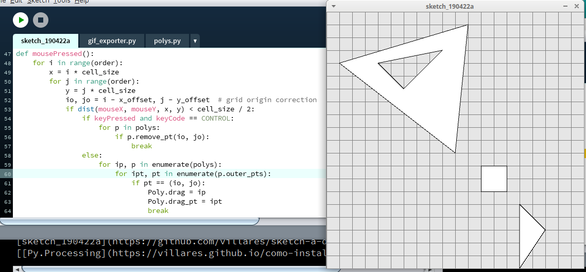

[sketch_190422a](https://github.com/villares/sketch-a-day/tree/master/2019/sketch_190422a) [[Py.Processing](https://villares.github.io/como-instalar-o-processing-modo-python/index-EN)]

Object Oriented remake of the poly editor in progress, in order to have multiple polygons with multiple holes each.

---

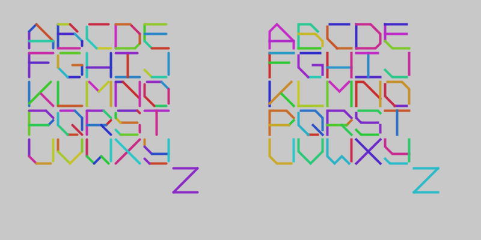

[sketch_190421](https://github.com/villares/sketch-a-day/tree/master/2019/sketch_190420a) [[Py.Processing](https://villares.github.io/como-instalar-o-processing-modo-python/index-EN)]

This clean up and tweak of studies of Design By Numbers alphabet [designed by Peter Cho](https://twitter.com/johnmaeda/status/1120021496733347840) from last year will count as today's sketch :)

Check out the other pieces, pixel and scaleable fonts I created here: http://github.com/villares/DesignByNumbers-alphabet

---

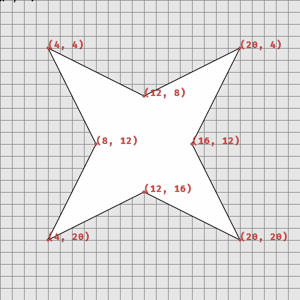

[sketch_190420a](https://github.com/villares/sketch-a-day/tree/master/2019/sketch_190420a) [[Py.Processing](https://villares.github.io/como-instalar-o-processing-modo-python/index-EN)]

Some refactoring and coordinate annotations that I'll use in my classes :)

---

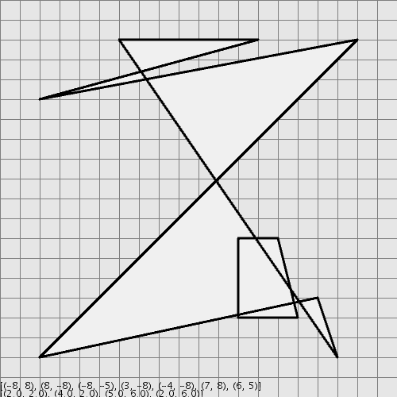

[sketch_190419a](https://github.com/villares/sketch-a-day/tree/master/2019/sketch_190419a) [[Py.Processing](https://villares.github.io/como-instalar-o-processing-modo-python/index-EN)]

Press space-bar to order outer_pts clockwise, and inner_pts anticlockwise (counterclockwise, in the US)

---

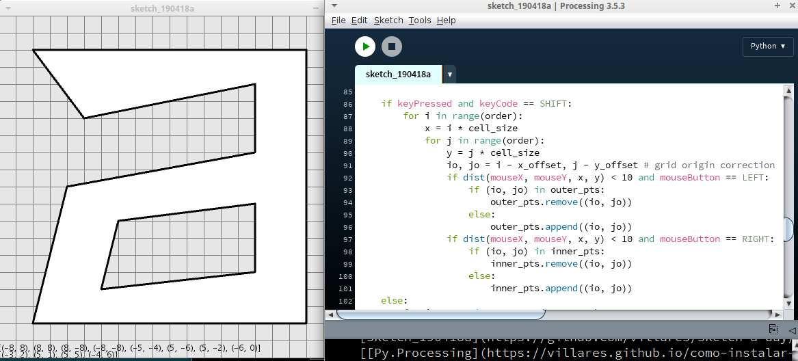

[sketch_190418a](https://github.com/villares/sketch-a-day/tree/master/2019/sketch_190418a) [[Py.Processing](https://villares.github.io/como-instalar-o-processing-modo-python/index-EN)]

---

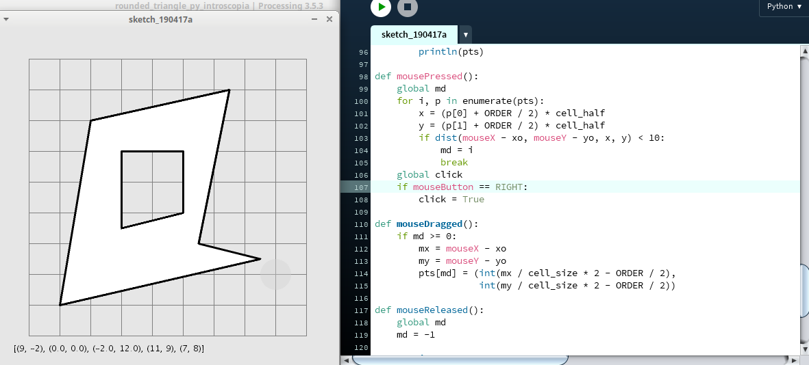

[sketch_190417a](https://github.com/villares/sketch-a-day/tree/master/2019/sketch_190417a) [[Py.Processing](https://villares.github.io/como-instalar-o-processing-modo-python/index-EN)]

Back to the editor... dragging points.

---

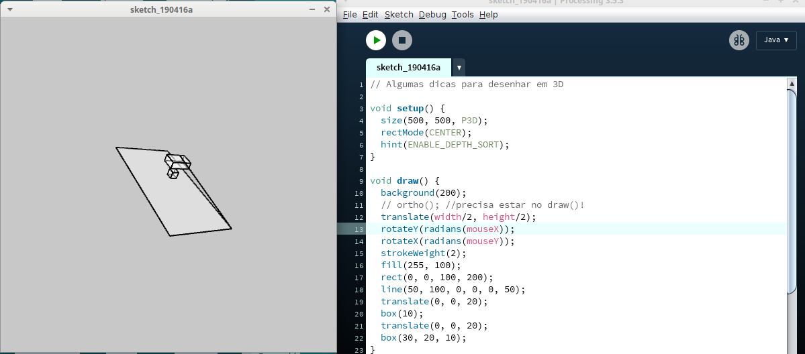

[sketch_190416a](https://github.com/villares/sketch-a-day/tree/master/2019/sketch_190416a) [[Processing Java Mode](https://processing.org)]

Very simple 3D example

---

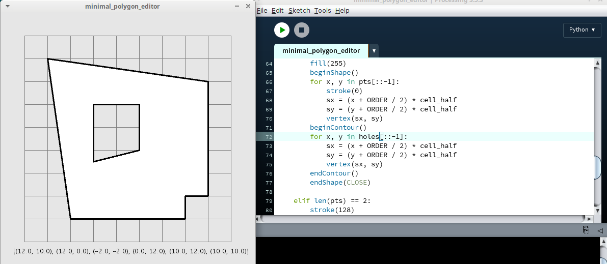

[sketch_190415a](https://github.com/villares/sketch-a-day/tree/master/2019/sketch_190415a) [[Py.Processing](https://villares.github.io/como-instalar-o-processing-modo-python/index-EN)]

---


[sketch_190414a](https://github.com/villares/sketch-a-day/tree/master/2019/sketch_190414a) [[Py.Processing](https://villares.github.io/como-instalar-o-processing-modo-python/index-EN)]

Let's unfold some simple extrudes

---


[sketch_190413b](https://github.com/villares/sketch-a-day/tree/master/2019/sketch_190413b) [[Py.Processing](https://villares.github.io/como-instalar-o-processing-modo-python/index-EN)]

---

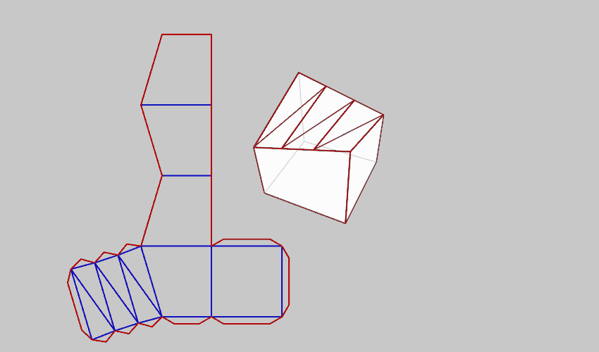

[sketch_190412a](https://github.com/villares/sketch-a-day/tree/master/2019/sketch_190412a) [[Py.Processing](https://villares.github.io/como-instalar-o-processing-modo-python/index-EN)]

---

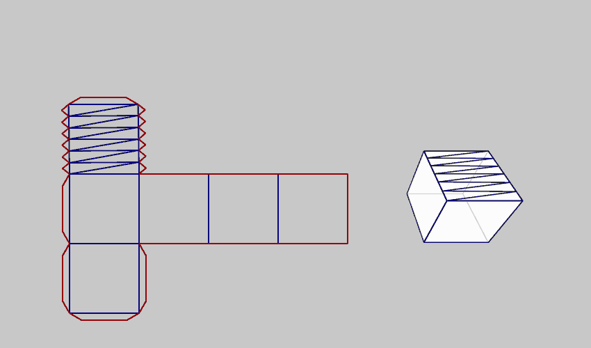

[sketch_190411a](https://github.com/villares/sketch-a-day/tree/master/2019/sketch_190411a) [[Py.Processing](https://villares.github.io/como-instalar-o-processing-modo-python/index-EN)]


Now we are talking! 
I've got the divided top right, brought back the tabs,
and also found a bug on 190408a (and fixed it)...

---


[sketch_190410a](https://github.com/villares/sketch-a-day/tree/master/2019/sketch_190410a) [[Py.Processing](https://villares.github.io/como-instalar-o-processing-modo-python/index-EN)]


major re-org, still broken...

---


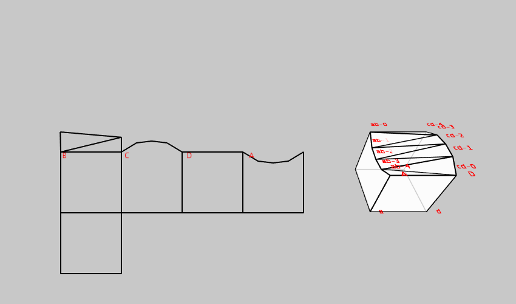

[sketch_190409b](https://github.com/villares/sketch-a-day/tree/master/2019/sketch_190409b) [[Py.Processing](https://villares.github.io/como-instalar-o-processing-modo-python/index-EN)]


Subdivided top! (not quite there yet...)

---

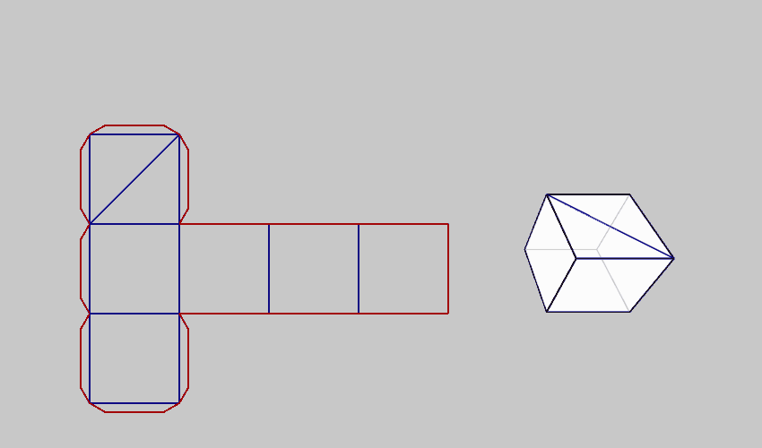

[sketch_190408a](https://github.com/villares/sketch-a-day/tree/master/2019/sketch_190408a) [[Py.Processing](https://villares.github.io/como-instalar-o-processing-modo-python/index-EN)]

With glue tabs!

---

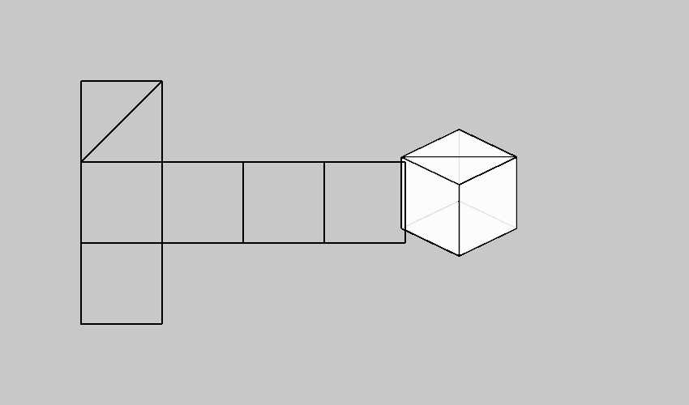

[sketch_190407a](https://github.com/villares/sketch-a-day/tree/master/2019/sketch_190407a) [[Py.Processing](https://villares.github.io/como-instalar-o-processing-modo-python/index-EN)]

Now I can change the base proportions.

---

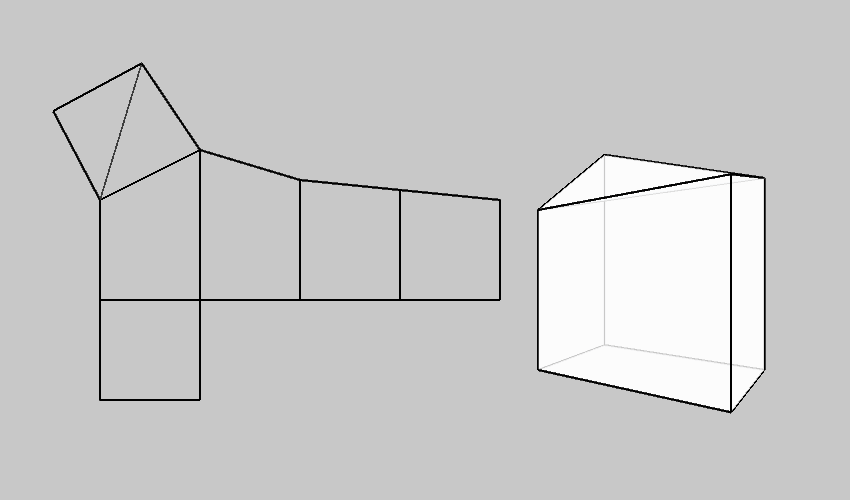

[sketch_190406a](https://github.com/villares/sketch-a-day/tree/master/2019/sketch_190406a) [[Py.Processing](https://villares.github.io/como-instalar-o-processing-modo-python/index-EN)]

First unfold version ready!

---

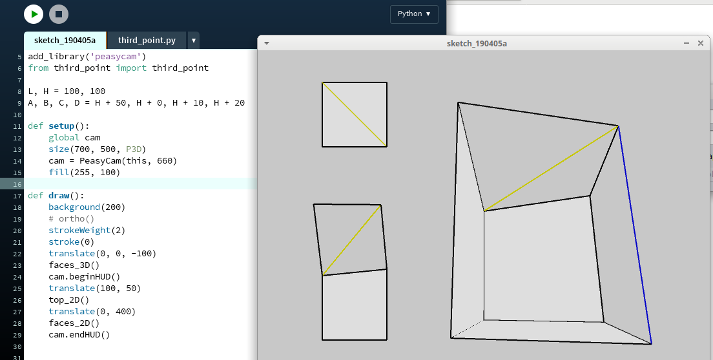

[sketch_190405a](https://github.com/villares/sketch-a-day/tree/master/2019/sketch_190405a) [[Py.Processing](https://villares.github.io/como-instalar-o-processing-modo-python/index-EN)]

Almost done!

---

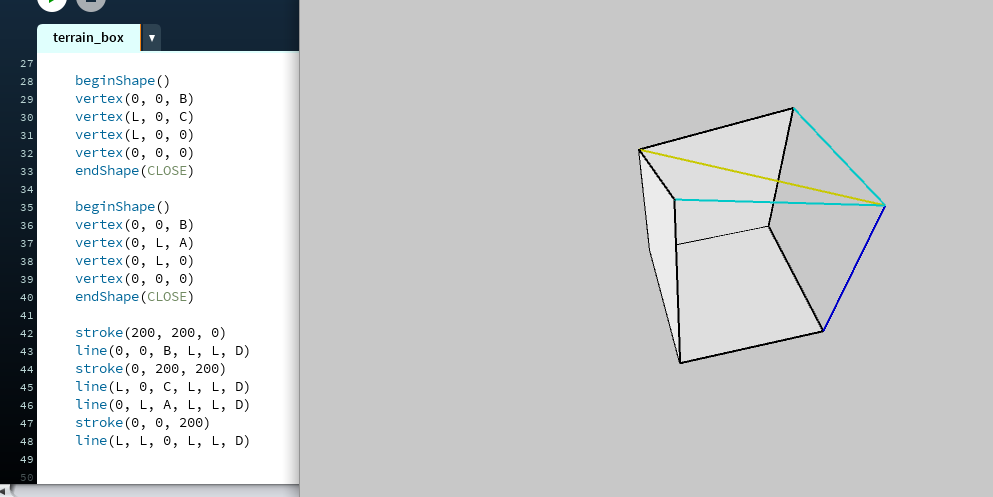

[sketch_190404a](https://github.com/villares/sketch-a-day/tree/master/2019/sketch_190403a) [[Py.Processing](https://villares.github.io/como-instalar-o-processing-modo-python/index-EN)]

Study for a "Terrain box" a paper surface "unit".

---


[sketch_190403a](https://github.com/villares/sketch-a-day/tree/master/2019/sketch_190403a) [[Py.Processing](https://villares.github.io/como-instalar-o-processing-modo-python/index-EN)]

---


[sketch_190402a](https://github.com/villares/sketch-a-day/tree/master/2019/sketch_190402a) [[Py.Processing](https://villares.github.io/como-instalar-o-processing-modo-python/index-EN)]

---


[sketch_190401b](https://github.com/villares/sketch-a-day/tree/master/2019/sketch_190401b) [[Py.Processing](https://villares.github.io/como-instalar-o-processing-modo-python/index-EN)]

---


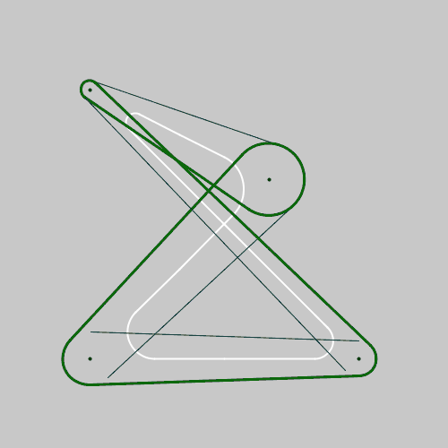

[sketch_190331a](https://github.com/villares/sketch-a-day/tree/master/2019/sketch_190331a) [[Py.Processing](https://villares.github.io/como-instalar-o-processing-modo-python/index-EN)]

---

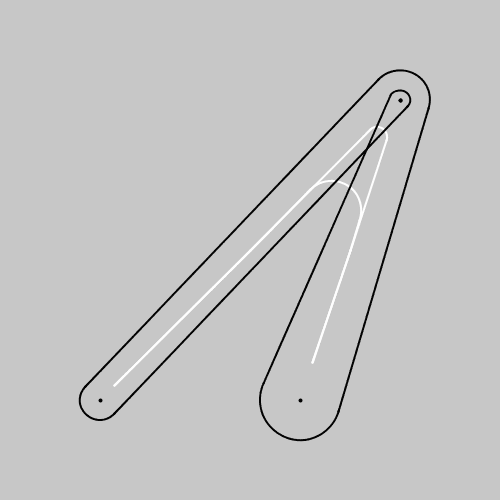

[sketch_190330a](https://github.com/villares/sketch-a-day/tree/master/2019/sketch_190330a) [[Py.Processing](https://villares.github.io/como-instalar-o-processing-modo-python/index-EN)]

---

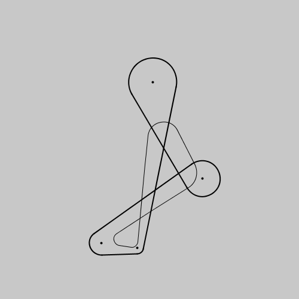

[sketch_190329a](https://github.com/villares/sketch-a-day/tree/master/2019/sketch_190329a) [[Py.Processing](https://villares.github.io/como-instalar-o-processing-modo-python/index-EN)]

---

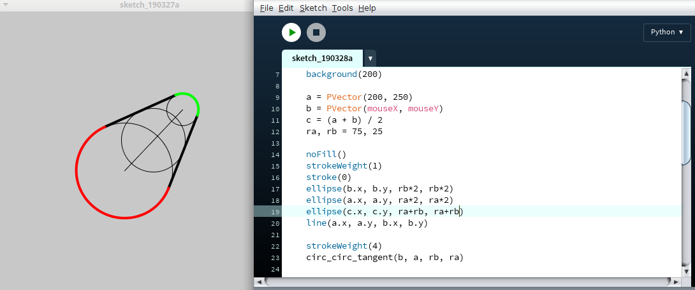

[sketch_190328a](https://github.com/villares/sketch-a-day/tree/master/2019/sketch_190328a) [[Py.Processing](https://villares.github.io/como-instalar-o-processing-modo-python/index-EN)]


---

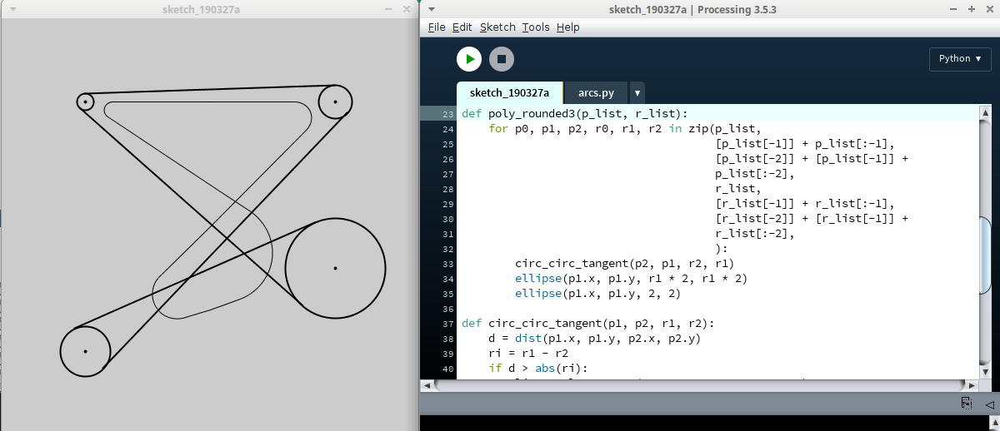

[sketch_190327a](https://github.com/villares/sketch-a-day/tree/master/2019/sketch_190327a) [[Py.Processing](https://villares.github.io/como-instalar-o-processing-modo-python/index-EN)]

---

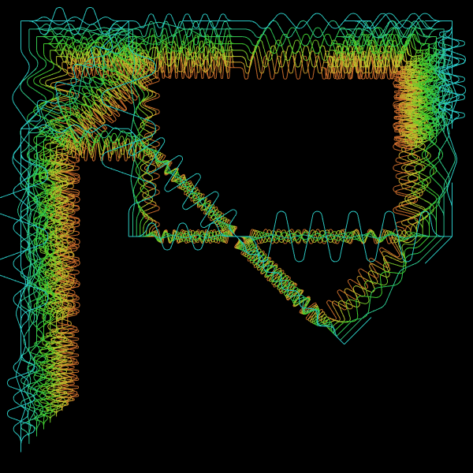

[sketch_190326a](https://github.com/villares/sketch-a-day/tree/master/2019/sketch_190326a) [[Py.Processing](https://villares.github.io/como-instalar-o-processing-modo-python/index-EN)]

---

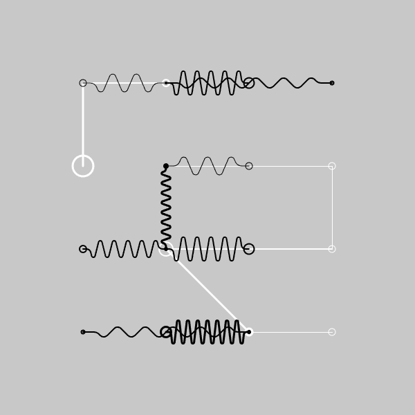

[sketch_190325a](https://github.com/villares/sketch-a-day/tree/master/2019/sketch_190325a) [[Py.Processing](https://villares.github.io/como-instalar-o-processing-modo-python/index-EN)]

---


[sketch_190324a](https://github.com/villares/sketch-a-day/tree/master/2019/sketch_190324a) [[Py.Processing](https://villares.github.io/como-instalar-o-processing-modo-python/index-EN)]

A retake of sketch_190207a + work from sketch_190321 :)

Will stall sometimes... 

as there is an unsafe while loop
selecting pointing nodes... (also present on 190323)

---


[sketch_190323a](https://github.com/villares/sketch-a-day/tree/master/2019/sketch_190323a) [[Py.Processing](https://villares.github.io/como-instalar-o-processing-modo-python/index-EN)]

---

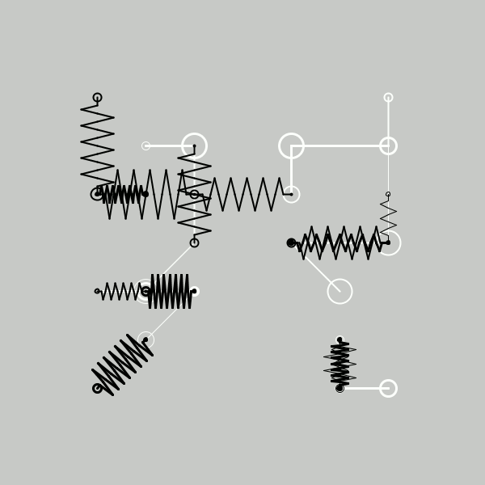

[sketch_190322a](https://github.com/villares/sketch-a-day/tree/master/2019/sketch_190322a) [[Py.Processing](https://villares.github.io/como-instalar-o-processing-modo-python/index-EN)]

---

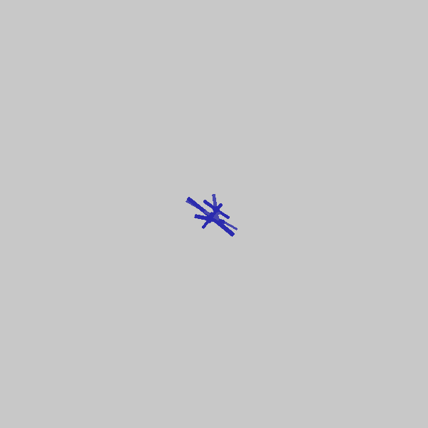

[sketch_1903221b](https://github.com/villares/sketch-a-day/tree/master/2019/sketch_190321b) [[Py.Processing](https://villares.github.io/como-instalar-o-processing-modo-python/index-EN)]

---

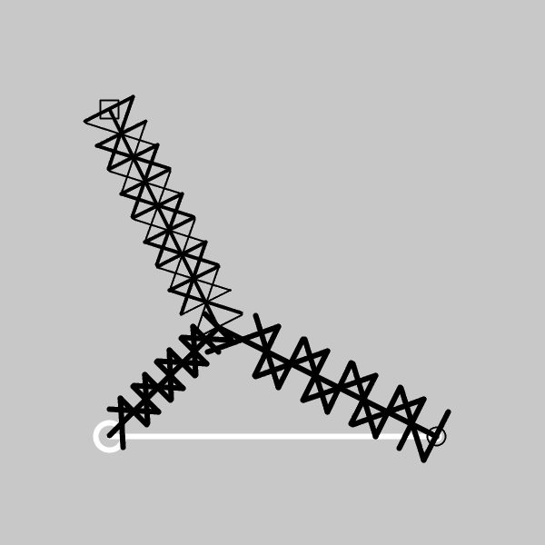

[sketch_190320a](https://github.com/villares/sketch-a-day/tree/master/2019/sketch_190320a) [[Py.Processing](https://villares.github.io/como-instalar-o-processing-modo-python/index-EN)]

---

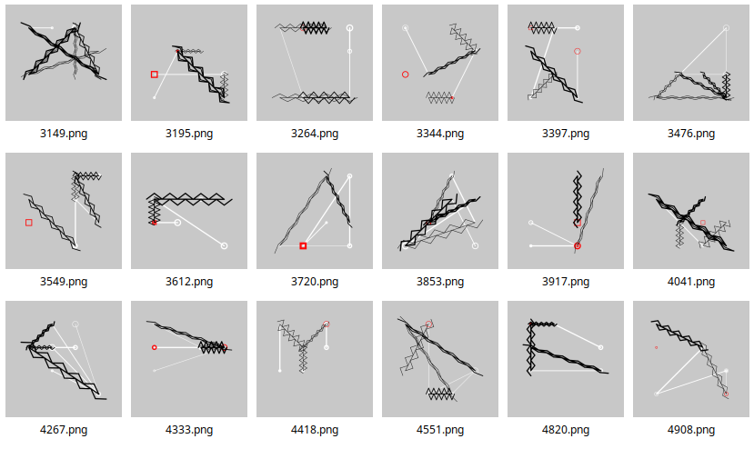

[sketch_190319a](https://github.com/villares/sketch-a-day/tree/master/2019/sketch_190319a) [[Py.Processing](https://villares.github.io/como-instalar-o-processing-modo-python/index-EN)]

---

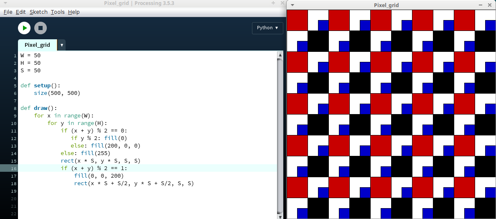

[sketch_190318a](https://github.com/villares/sketch-a-day/tree/master/2019/sketch_190318a) [[Py.Processing](https://villares.github.io/como-instalar-o-processing-modo-python/index-EN)]

---


[sketch_190317a](https://github.com/villares/sketch-a-day/tree/master/2019/sketch_190317a) [[Py.Processing](https://villares.github.io/como-instalar-o-processing-modo-python/index-EN)]

---


[sketch_190316a](https://github.com/villares/sketch-a-day/tree/master/2019/sketch_190316a) [[Py.Processing](https://villares.github.io/como-instalar-o-processing-modo-python/index-EN)]

---


[sketch_190315a](https://github.com/villares/sketch-a-day/tree/master/2019/sketch_190315a) [[Py.Processing](https://villares.github.io/como-instalar-o-processing-modo-python/index-EN)]

---


[sketch_190314a](https://github.com/villares/sketch-a-day/tree/master/2019/sketch_190314a) [[Py.Processing](https://villares.github.io/como-instalar-o-processing-modo-python/index-EN)]

---


[sketch_190313a](https://github.com/villares/sketch-a-day/tree/master/2019/sketch_190313a) [[Py.Processing](https://villares.github.io/como-instalar-o-processing-modo-python/index-EN)]

---

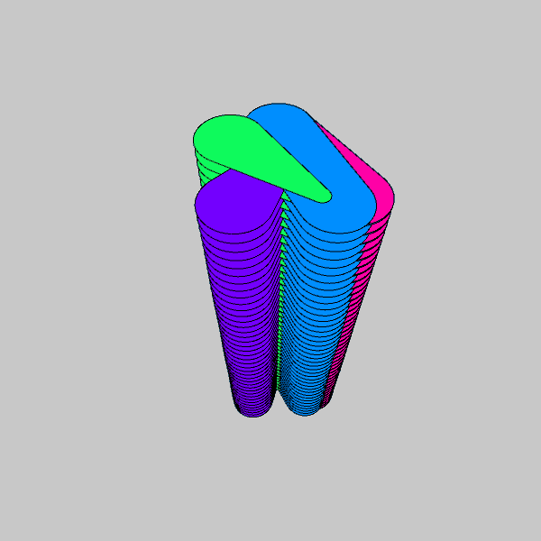

[sketch_190312a](https://github.com/villares/sketch-a-day/tree/master/2019/sketch_190312a) [[Py.Processing](https://villares.github.io/como-instalar-o-processing-modo-python/index-EN)]

---

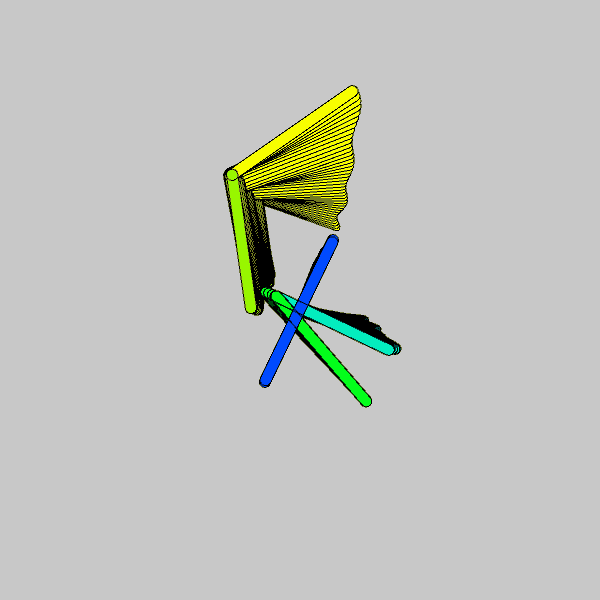

[sketch_190311a](https://github.com/villares/sketch-a-day/tree/master/2019/sketch_190311a) [[Py.Processing](https://villares.github.io/como-instalar-o-processing-modo-python/index-EN)]

---

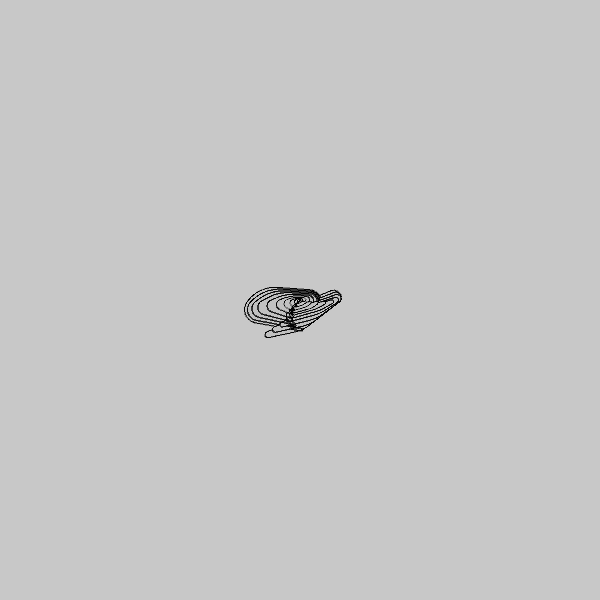

[sketch_190310a](https://github.com/villares/sketch-a-day/tree/master/2019/sketch_190310a) [[Py.Processing](https://villares.github.io/como-instalar-o-processing-modo-python/index-EN)]

Refactor and a not very good filling test

---

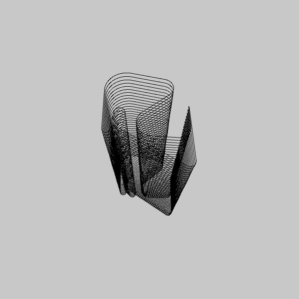

[sketch_190309a](https://github.com/villares/sketch-a-day/tree/master/2019/sketch_190309a) [[Py.Processing](https://villares.github.io/como-instalar-o-processing-modo-python/index-EN)]

Deque collection for a dynamic history on Z

---

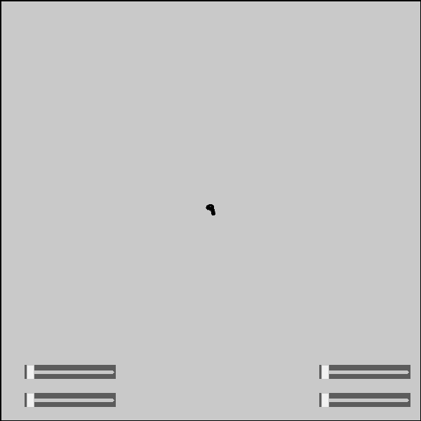

[sketch_190308a](https://github.com/villares/sketch-a-day/tree/master/2019/sketch_190308a) [[Py.Processing](https://villares.github.io/como-instalar-o-processing-modo-python/index-EN)]

---

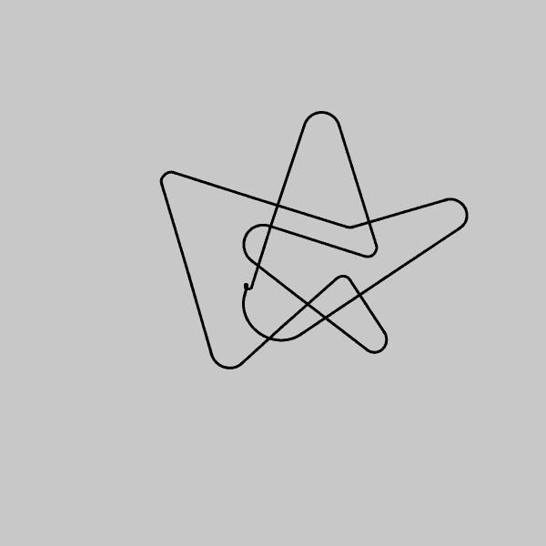

[sketch_190307a](https://github.com/villares/sketch-a-day/tree/master/2019/sketch_190307a) [[Py.Processing](https://villare
s.github.io/como-instalar-o-processing-modo-python/index-EN)]

An graph much like the ones before this, but made invisible, is behind the (virtual) corners of this rounded poly.

---

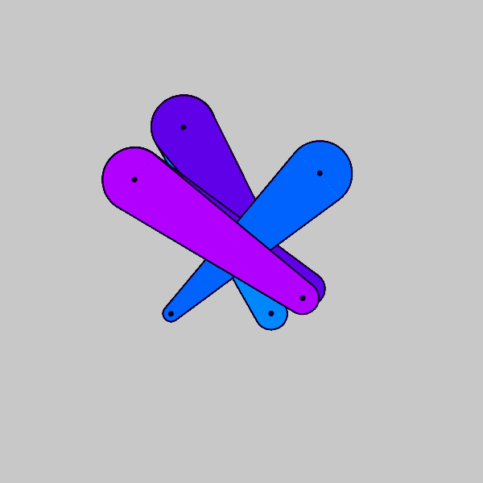

[sketch_190306a](https://github.com/villares/sketch-a-day/tree/master/2019/sketch_190306a) [Py.Processing](https://villares.github.io/como-instalar-o-processing-modo-python/index-EN)]

---

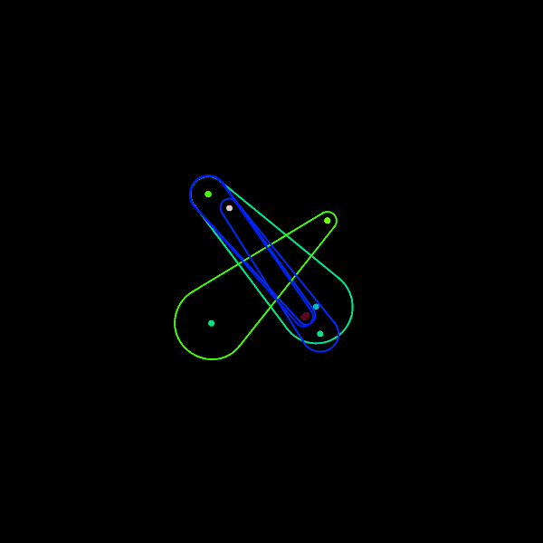

[sketch_190305a](https://github.com/villares/sketch-a-day/tree/master/2019/sketch_190305a) [[Py.Processing](https://villares.github.io/como-instalar-o-processing-modo-python/index-EN)]

Mais grapholia ;)

Removi parte do código para controle com potencômetros pois infelizmente a comunicação serial está quebrada neste momento no Processing Modo Python :((

---


[sketch_190304a](https://github.com/villares/sketch-a-day/tree/master/2019/sketch_190304a) [[Py.Processing](https://villares.github.io/como-instalar-o-processing-modo-python/index-EN)]

Grapholia ;)

Retomando um sketch de grafos com 4 parâmetros ajustaveis (via teclado ou potenciômetros ligados em um Arduino)

---

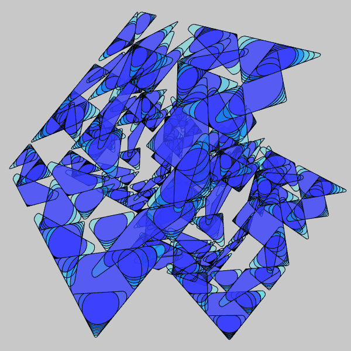

[sketch_190303a](https://github.com/villares/sketch-a-day/tree/master/2019/sketch_190303a) [[Py.Processing](https://villares.github.io/como-instalar-o-processing-modo-python/index-EN)]

---


[sketch_190302a](https://github.com/villares/sketch-a-day/tree/master/2019/sketch_190302a) [[Py.Processing](https://villares.github.io/como-instalar-o-processing-modo-python/index-EN)]

---


[sketch_190301a](https://github.com/villares/sketch-a-day/tree/master/2019/sketch_190301a) [[Py.Processing](https://villares.github.io/como-instalar-o-processing-modo-python/index-EN)]

---


[sketch_190228a](https://github.com/villares/sketch-a-day/tree/master/2019/sketch_190228a) [[Py.Processing](https://villares.github.io/como-instalar-o-processing-modo-python/index-EN)]

---


[sketch_190227a](https://github.com/villares/sketch-a-day/tree/master/2019/sketch_190227a) [[Py.Processing](https://villares.github.io/como-instalar-o-processing-modo-python/index-EN)]

---

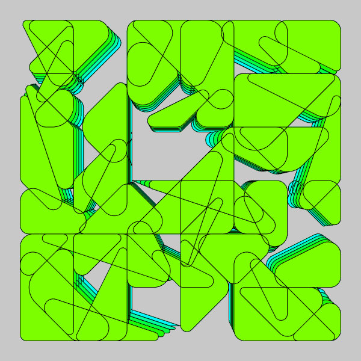

[sketch_1tus90226a](https://github.com/villares/sketch-a-day/tree/master/2019/sketch_190226a) [[Py.Processing](https://villares.github.io/como-instalar-o-processing-modo-python/index-EN)]

---

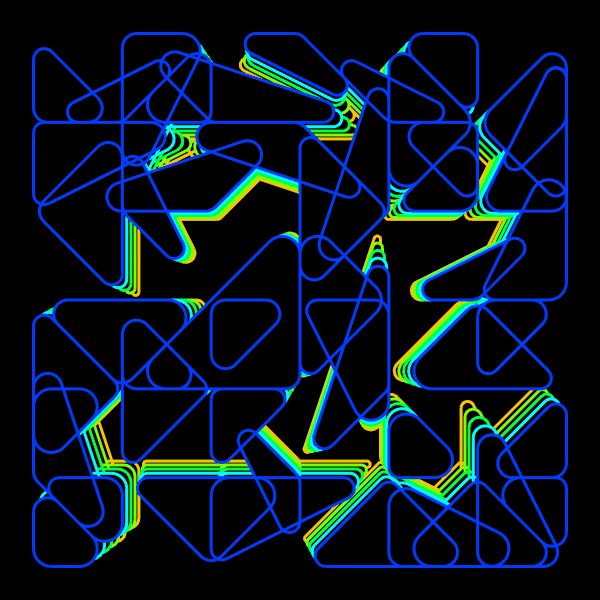

[sketch_190225a](https://github.com/villares/sketch-a-day/tree/master/2019/sketch_190225a) [[Py.Processing](https://villares.github.io/como-instalar-o-processing-modo-python/index-EN)]

---


[sketch_190224a](https://github.com/villares/sketch-a-day/tree/master/2019/sketch_190224a) [[Py.Processing](https://villares.github.io/como-instalar-o-processing-modo-python/index-EN)]

---

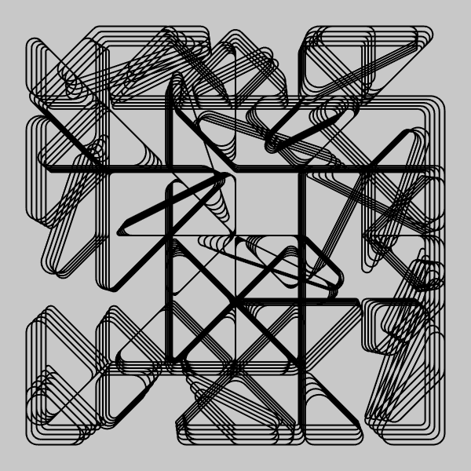

[sketch_190223a](https://github.com/villares/sketch-a-day/tree/master/2019/sketch_190223a) [[Py.Processing](https://villares.github.io/como-instalar-o-processing-modo-python/index-EN)]

---

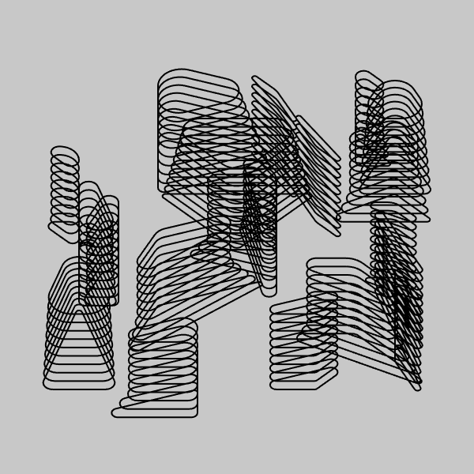

[sketch_190222a](https://github.com/villares/sketch-a-day/tree/master/2019/sketch_190222a) [[Py.Processing](https://villares.github.io/como-instalar-o-processing-modo-python/index-EN)]

---

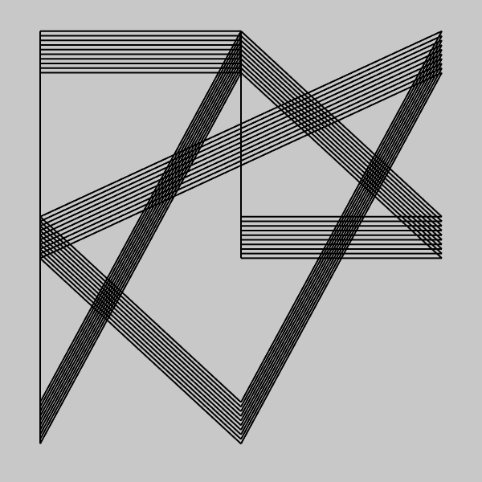

[sketch_190221a](https://github.com/villares/sketch-a-day/tree/master/2019/sketch_190221a) [[Py.Processing](https://villares.github.io/como-instalar-o-processing-modo-python/index-EN)]

---

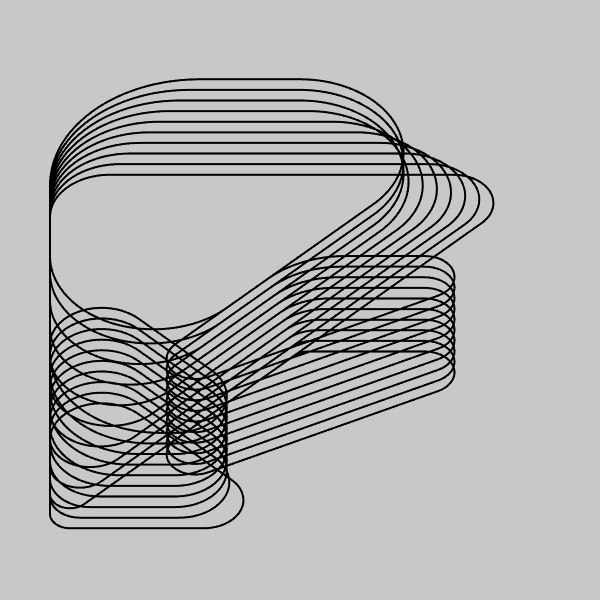

[sketch_190220a](https://github.com/villares/sketch-a-day/tree/master/2019/sketch_190220a) [[Py.Processing](https://villares.github.io/como-instalar-o-processing-modo-python/index-EN)]

---

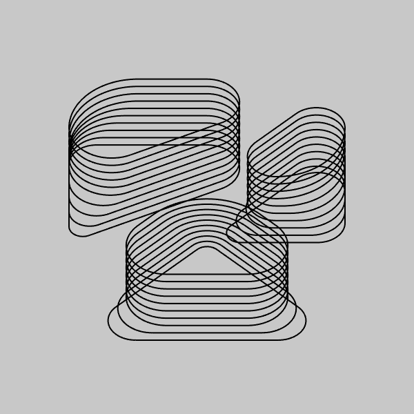

[sketch_190219a](https://github.com/villares/sketch-a-day/tree/master/2019/sketch_190219a) [[Py.Processing](https://villares.github.io/como-instalar-o-processing-modo-python/index-EN)]

---

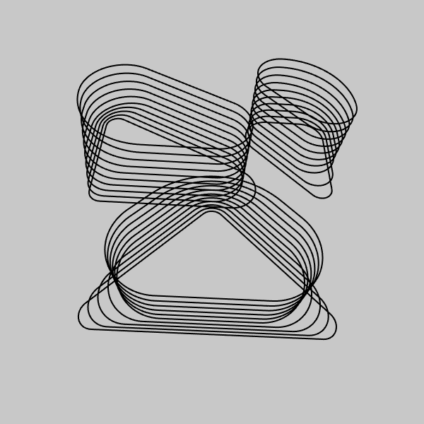

[sketch_190218a](https://github.com/villares/sketch-a-day/tree/master/2019/sketch_190218a) [[Py.Processing](https://villares.github.io/como-instalar-o-processing-modo-python/index-EN)]

---

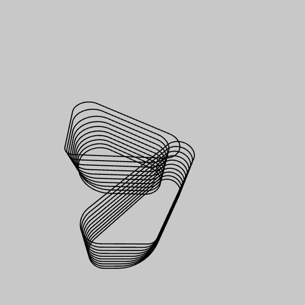

[sketch_190217a](https://github.com/villares/sketch-a-day/tree/master/2019/sketch_190217a) [[Py.Processing](https://villares.github.io/como-instalar-o-processing-modo-python/index-EN)]

---

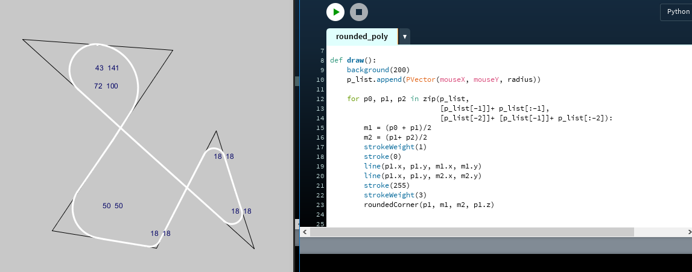

[sketch_190216a](https://github.com/villares/sketch-a-day/tree/master/2019/sketch_190216a) [[Py.Processing](https://villares.github.io/como-instalar-o-processing-modo-python/index-EN)]


---


[sketch_190215a](https://github.com/villares/sketch-a-day/tree/master/2019/sketch_190215a) [[Py.Processing](https://villares.github.io/como-instalar-o-processing-modo-python/index-EN)]

---

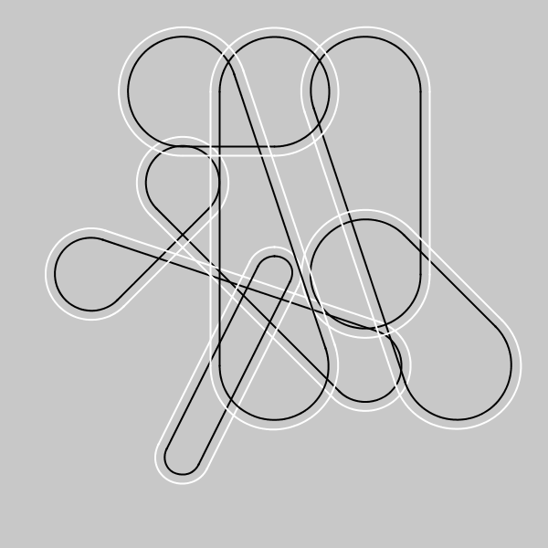

[sketch_190214a](https://github.com/villares/sketch-a-day/tree/master/2019/sketch_190214a) [[Py.Processing](https://villares.github.io/como-instalar-o-processing-modo-python/index-EN)]

---


[sketch_190213a](https://github.com/villares/sketch-a-day/tree/master/2019/sketch_190213a) [[Py.Processing](https://villares.github.io/como-instalar-o-processing-modo-python/index-EN)]

---

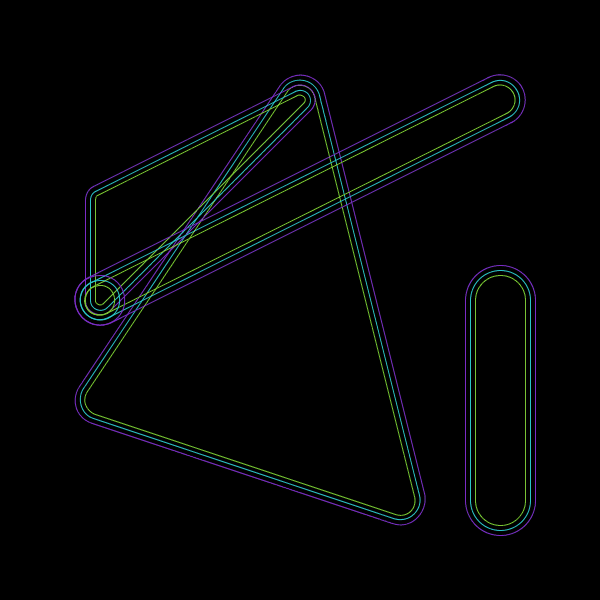

[sketch_190212a](https://github.com/villares/sketch-a-day/tree/master/2019/sketch_190212a) [[Py.Processing](https://villares.github.io/como-instalar-o-processing-modo-python/index-EN)]

---

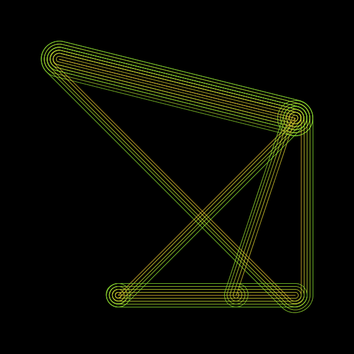

[sketch_190211b](https://github.com/villares/sketch-a-day/tree/master/2019/sketch_190211b) [[Py.Processing](https://villares.github.io/como-instalar-o-processing-modo-python/index-EN)]

---

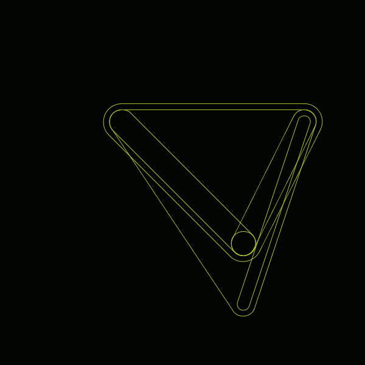

[sketch_190211a](https://github.com/villares/sketch-a-day/tree/master/2019/sketch_190211a) [[Py.Processing](https://villares.github.io/como-instalar-o-processing-modo-python/index-EN)]

---

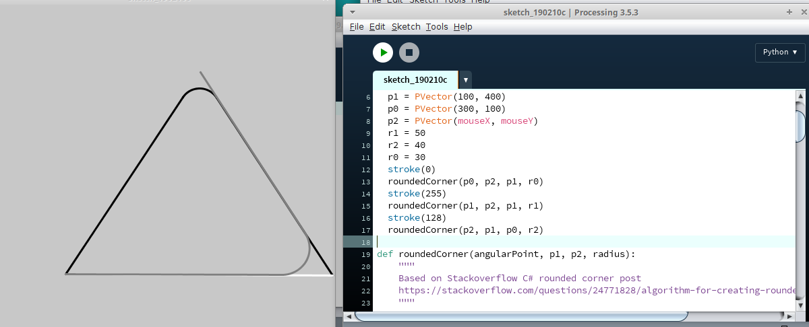


[sketch_190210c](https://github.com/villares/sketch-a-day/tree/master/2019/sketch_190210c) [[Py.Processing](https://villares.github.io/como-instalar-o-processing-modo-python/index-EN)]

"a" and "b" are Java and Python ports of a C# round corner.

---

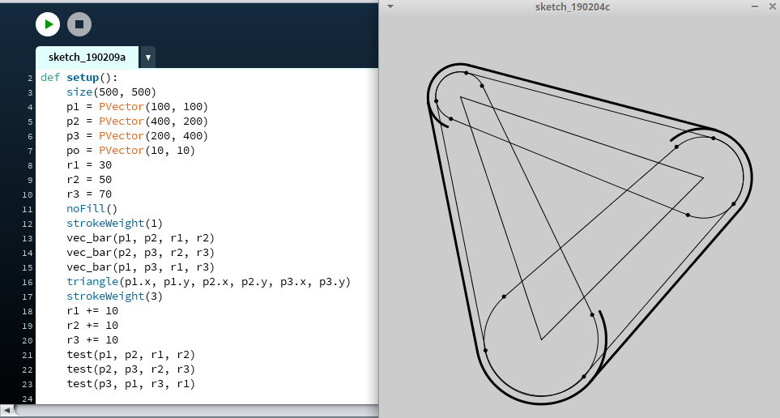

[sketch_190209a](https://github.com/villares/sketch-a-day/tree/master/2019/sketch_190209a) [[Py.Processing](https://villares.github.io/como-instalar-o-processing-modo-python/index-EN)]

---


[sketch_190208a](https://github.com/villares/sketch-a-day/tree/master/2019/sketch_190208a) [[Py.Processing](https://villares.github.io/como-instalar-o-processing-modo-python/index-EN)]

---

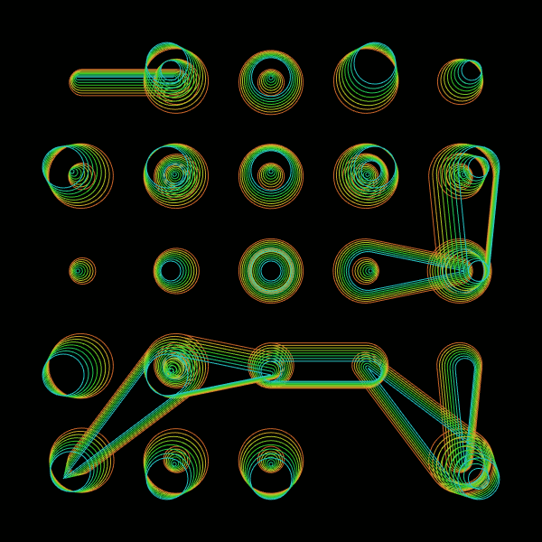

[sketch_190207a](https://github.com/villares/sketch-a-day/tree/master/2019/sketch_190207a) [[Py.Processing](https://villares.github.io/como-instalar-o-processing-modo-python/index-EN)]

---

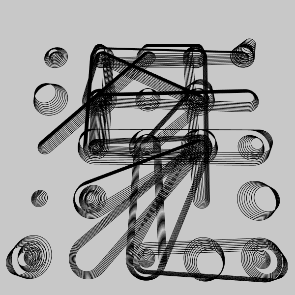

[sketch_190206b](https://github.com/villares/sketch-a-day/tree/master/2019/sketch_190206a) [[Py.Processing](https://villares.github.io/como-instalar-o-processing-modo-python/index-EN)]

---


[sketch_190205a](https://github.com/villares/sketch-a-day/tree/master/2019/sketch_190205a) [[Py.Processing](https://villares.github.io/como-instalar-o-processing-modo-python/index-EN)]

---


[sketch_190204a](https://github.com/villares/sketch-a-day/tree/master/2019/sketch_190204a) [[Py.Processing](https://villares.github.io/como-instalar-o-processing-modo-python/index-EN)]

---


[sketch_190203a](https://github.com/villares/sketch-a-day/tree/master/2019/sketch_190203a) [[Py.Processing](https://villares.github.io/como-instalar-o-processing-modo-python/index-EN)]

---

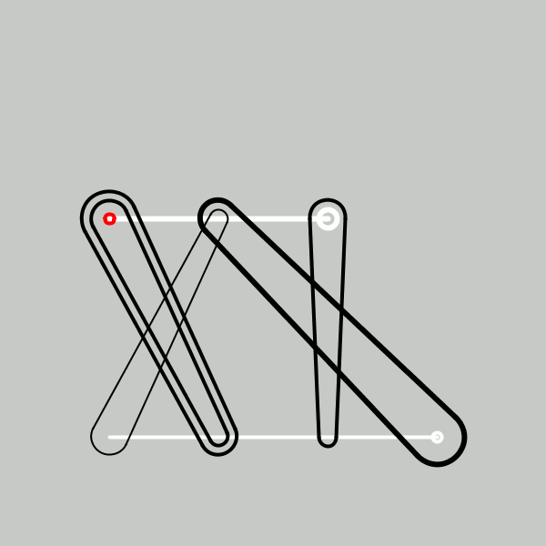

[sketch_190202a](https://github.com/villares/sketch-a-day/tree/master/2019/sketch_190202a) [[Py.Processing](https://villares.github.io/como-instalar-o-processing-modo-python/index-EN)]

Retake of sketch #57 180226 with the variable "bar" from yesterday.

---

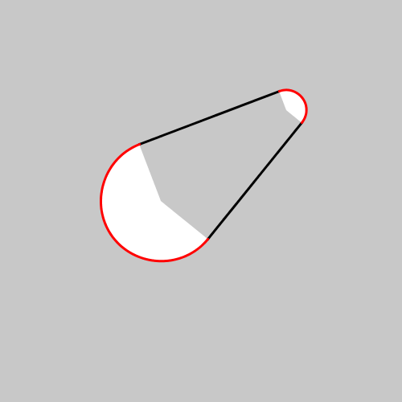

[sketch_190201a](https://github.com/villares/sketch-a-day/tree/master/2019/sketch_190201a) [[Py.Processing](https://villares.github.io/como-instalar-o-processing-modo-python/index-EN)]

---

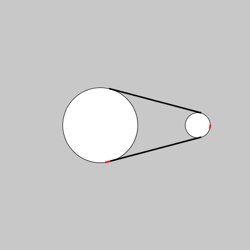

[sketch_190131a](https://github.com/villares/sketch-a-day/tree/master/2019/sketch_190131a) [[Py.Processing](https://villares.github.io/como-instalar-o-processing-modo-python/index-EN)]

---

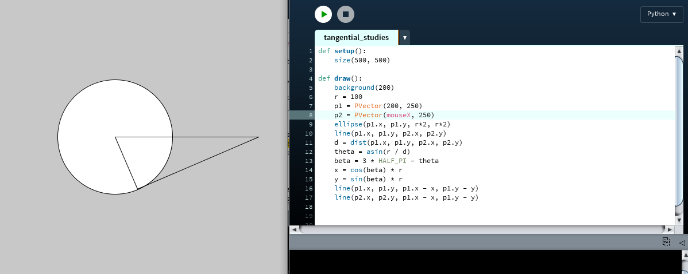

[sketch_190130a](https://github.com/villares/sketch-a-day/tree/master/2019/sketch_190130a) [[Py.Processing](https://villares.github.io/como-instalar-o-processing-modo-python/index-EN)]

---

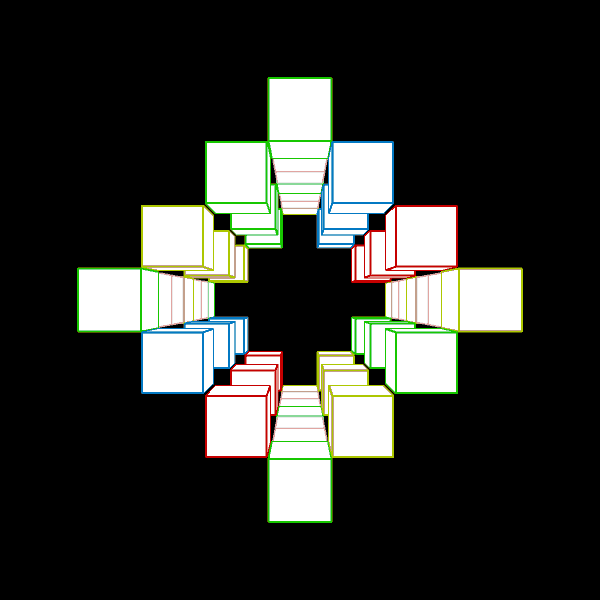

[sketch_190129a](https://github.com/villares/sketch-a-day/tree/master/2019/sketch_190129a) [[Py.Processing](https://villares.github.io/como-instalar-o-processing-modo-python/index-EN)]

---

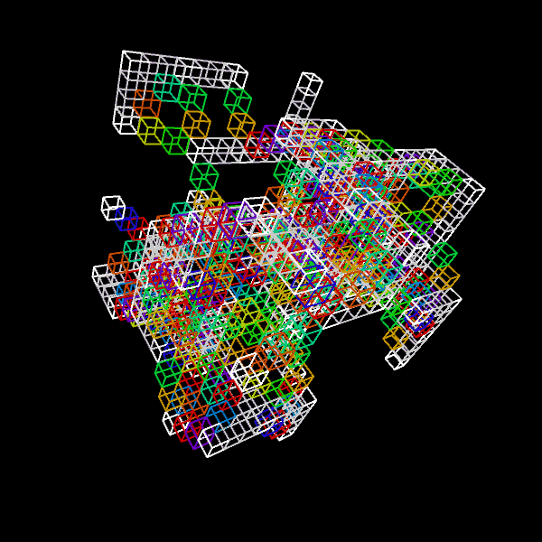

[sketch_190128b](https://github.com/villares/sketch-a-day/tree/master/2019/sketch_190128b) [[Py.Processing](https://villares.github.io/como-instalar-o-processing-modo-python/index-EN)]

---

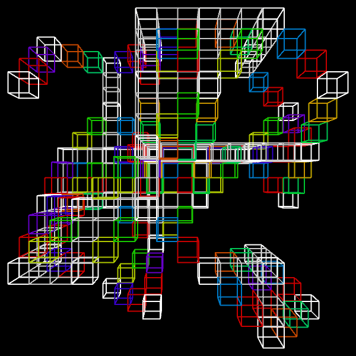

[sketch_190127a](https://github.com/villares/sketch-a-day/tree/master/2019/sketch_190127a) [[Py.Processing](https://villares.github.io/como-instalar-o-processing-modo-python/index-EN)]

---

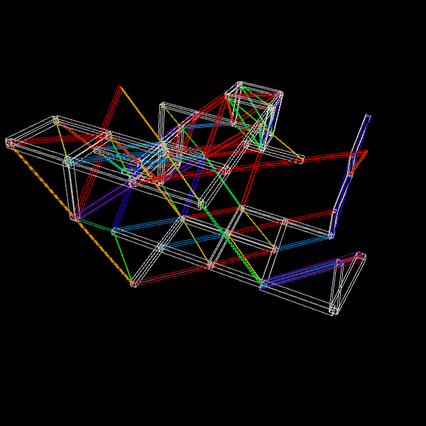

[sketch_190126a](https://github.com/villares/sketch-a-day/tree/master/2019/sketch_190126a) [[Py.Processing](https://villares.github.io/como-instalar-o-processing-modo-python/index-EN)]

---

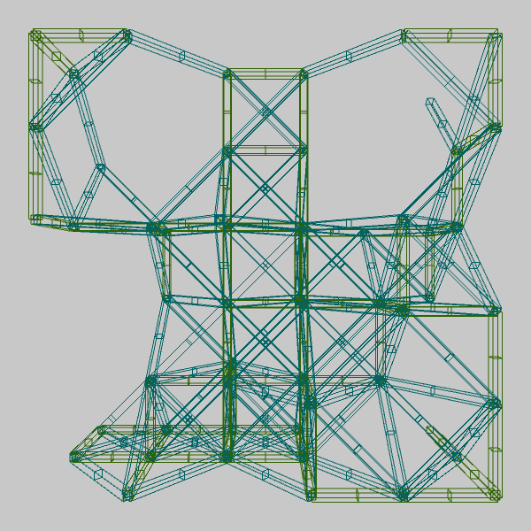

[sketch_190125a](https://github.com/villares/sketch-a-day/tree/master/2019/sketch_190125a) [[Py.Processing](https://villares.github.io/como-instalar-o-processing-modo-python/index-EN)]

---

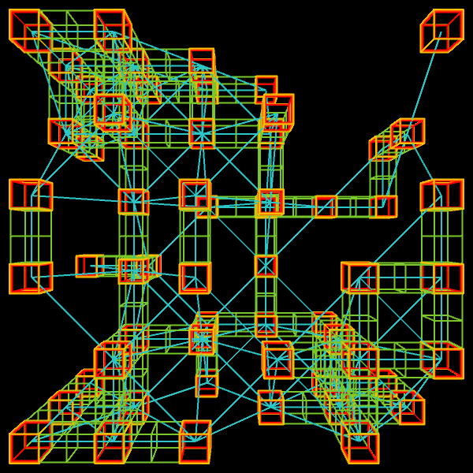

[sketch_190124a](https://github.com/villares/sketch-a-day/tree/master/2019/sketch_190124a) [[Py.Processing](https://villares.github.io/como-instalar-o-processing-modo-python/index-EN)]

---
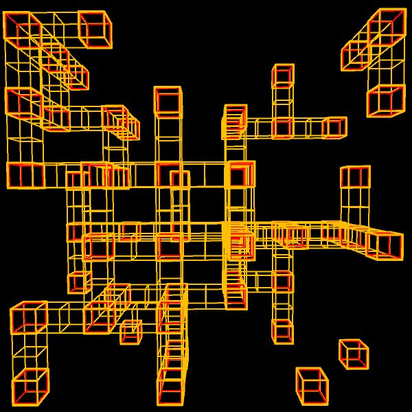

[sketch_190123a](https://github.com/villares/sketch-a-day/tree/master/2019/sketch_190123a) [[Py.Processing](https://villares.github.io/como-instalar-o-processing-modo-python/index-EN)]

---

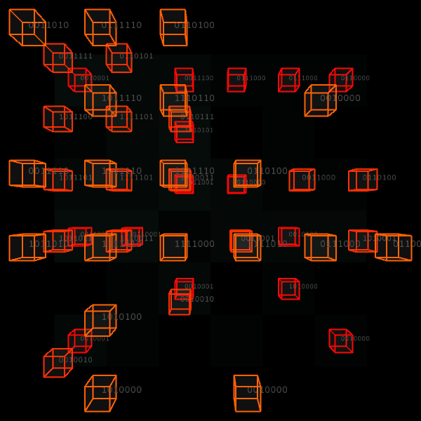

[sketch_190122a](https://github.com/villares/sketch-a-day/tree/master/2019/sketch_190122a) [[Py.Processing](https://villares.github.io/como-instalar-o-processing-modo-python/index-EN)]

---


[sketch_190121a](https://github.com/villares/sketch-a-day/tree/master/2019/sketch_190121a) [[Py.Processing](https://villares.github.io/como-instalar-o-processing-modo-python/index-EN)]

---


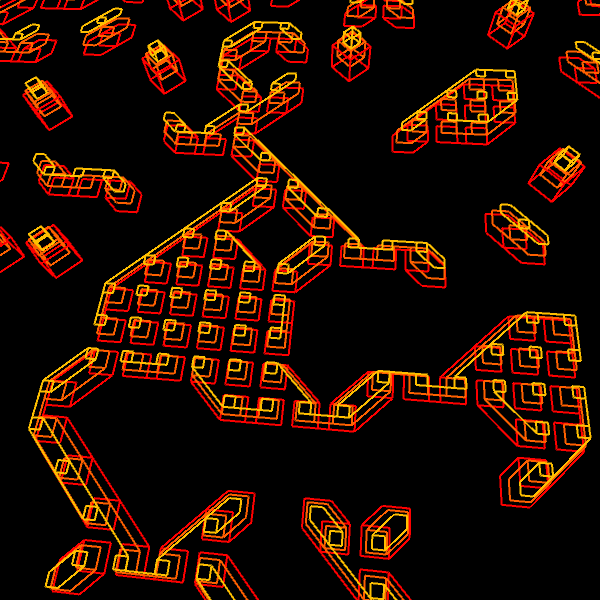

[sketch_190120a](https://github.com/villares/sketch-a-day/tree/master/2019/sketch_190120a) [[Py.Processing](https://villares.github.io/como-instalar-o-processing-modo-python/index-EN)]

---

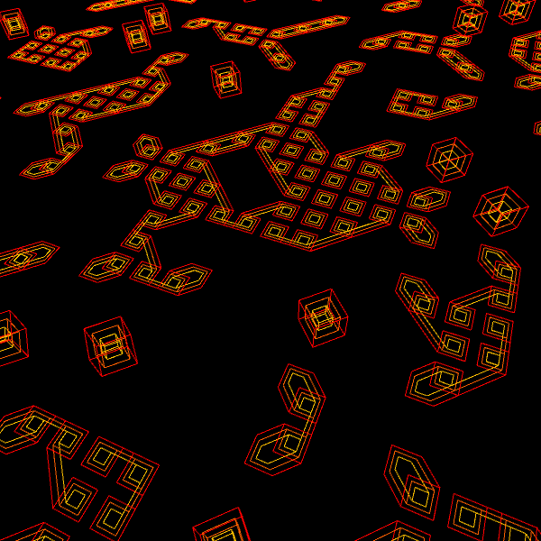

[sketch_190119a](https://github.com/villares/sketch-a-day/tree/master/2019/sketch_190119a) [[Py.Processing](https://villares.github.io/como-instalar-o-processing-modo-python/index-EN)]

---


[sketch_190118a](https://github.com/villares/sketch-a-day/tree/master/2019/sketch_190118a) [[Py.Processing](https://villares.github.io/como-instalar-o-processing-modo-python/index-EN)]

---

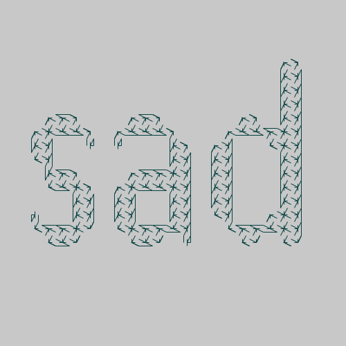

[sketch_190117b](https://github.com/villares/sketch-a-day/tree/master/2019/sketch_190117b) [[Py.Processing](https://villares.github.io/como-instalar-o-processing-modo-python/index-EN)]

---

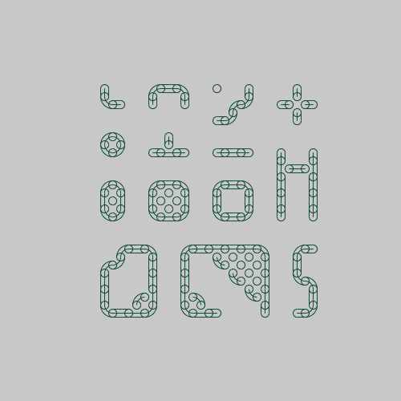

[sketch_190116a](https://github.com/villares/sketch-a-day/tree/master/2019/sketch_190116a) [[Py.Processing](https://villares.github.io/como-instalar-o-processing-modo-python/index-EN)]

---


[sketch_190115a](https://github.com/villares/sketch-a-day/tree/master/2019/sketch_190115a) [[Py.Processing](https://villares.github.io/como-instalar-o-processing-modo-python/index-EN)]


---

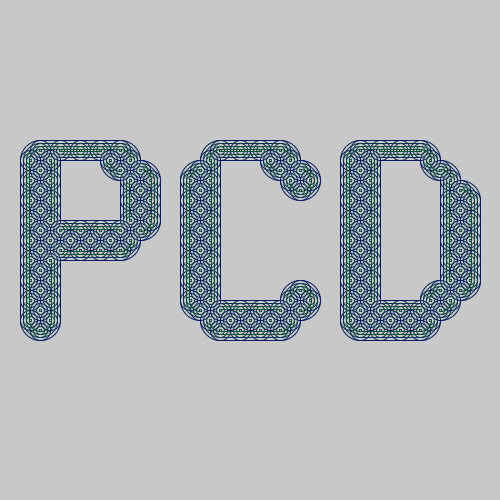

[sketch_190114a](https://github.com/villares/sketch-a-day/tree/master/2019/sketch_190114a) [[Py.Processing](https://villares.github.io/como-instalar-o-processing-modo-python/index-EN)]

---


[sketch_190113a](https://github.com/villares/sketch-a-day/tree/master/2019/sketch_190113a) [[Py.Processing](https://villares.github.io/como-instalar-o-processing-modo-python/index-EN)]

---

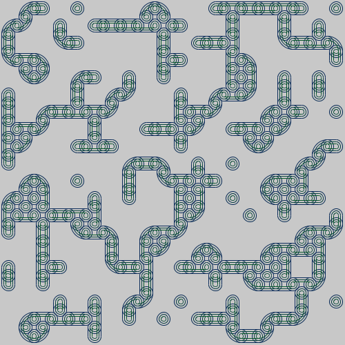

[sketch_190112a](https://github.com/villares/sketch-a-day/tree/master/2019/sketch_190112a) [[Py.Processing](https://villares.github.io/como-instalar-o-processing-modo-python/index-EN)]

---


[sketch_190111a](https://github.com/villares/sketch-a-day/tree/master/2019/sketch_190111a) [[Py.Processing](https://villares.github.io/como-instalar-o-processing-modo-python/index-EN)]

---

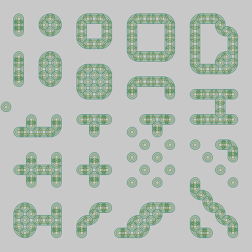

[sketch_190110a](https://github.com/villares/sketch-a-day/tree/master/2019/sketch_190110a) [[Py.Processing](https://villares.github.io/como-instalar-o-processing-modo-python/index-EN)]

[sketch_190110b](https://github.com/villares/sketch-a-day/tree/master/2019/sketch_190110b) [[Py.Processing](https://villares.github.io/como-instalar-o-processing-modo-python/index-EN)]

---


[sketch_190109a](https://github.com/villares/sketch-a-day/tree/master/2019/sketch_190109a) [[Py.Processing](https://villares.github.io/como-instalar-o-processing-modo-python/index-EN)]

---


[sketch_190108a](https://github.com/villares/sketch-a-day/tree/master/2019/sketch_190108a) [[Py.Processing](https://villares.github.io/como-instalar-o-processing-modo-python/index-EN)]

---

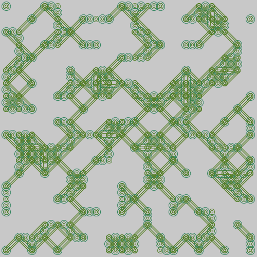

[sketch_190107a](https://github.com/villares/sketch-a-day/tree/master/2019/sketch_190107a) [[Py.Processing](https://villares.github.io/como-instalar-o-processing-modo-python/index-EN)]

---

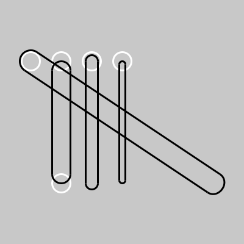

[sketch_190106a](https://github.com/villares/sketch-a-day/tree/master/2019/sketch_190106a) [[Py.Processing](https://villares.github.io/como-instalar-o-processing-modo-python/index-EN)]

---

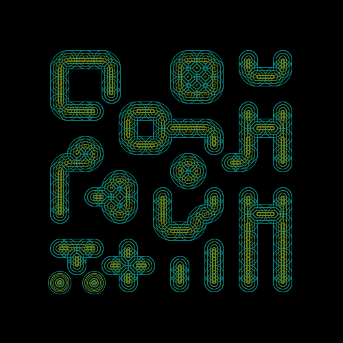

[sketch_190105a](https://github.com/villares/sketch-a-day/tree/master/2019/sketch_190105a) [[Py.Processing](https://villares.github.io/como-instalar-o-processing-modo-python/index-EN)]

---

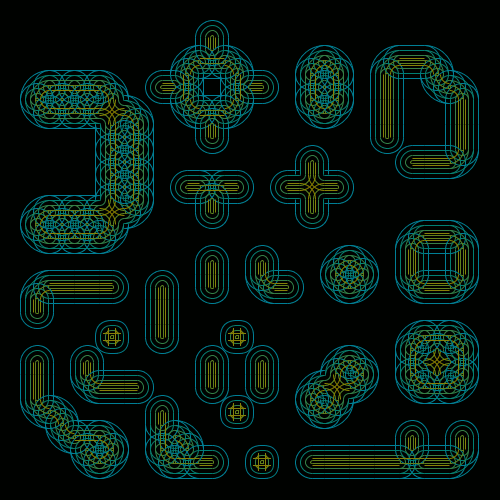

[sketch_190104a](https://github.com/villares/sketch-a-day/tree/master/2019/sketch_190104a) [[Py.Processing](https://villares.github.io/como-instalar-o-processing-modo-python/index-EN)]

Module tweaks

---

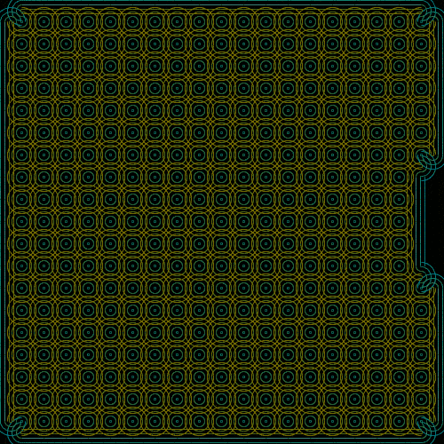

[sketch_190103a](https://github.com/villares/sketch-a-day/tree/master/2019/sketch_190103a) [[Py.Processing](https://villares.github.io/como-instalar-o-processing-modo-python/index-EN)]

Made this today, thinking about my new newsletter: [[sketch-mail](https://tinyletter.com/villares)]

---


[sketch_190102a]https://github.com/villares/sketch-a-day/tree/master/2019/sketch_190102a) [[Py.Processing](https://villares.github.io/como-instalar-o-processing-modo-python/index-EN)]

---


[sketch_190101a](https://github.com/villares/sketch-a-day/tree/master/2019/sketch_190101a) [[Py.Processing](https://villares.github.io/como-instalar-o-processing-modo-python/index-EN)]
