# [sketch-a-day](https://abav.lugaralgum.com/sketch-a-day)

#### coding a visual idea a day

Welcome! My name is [Alexandre Villares](https://abav.lugaralgum.com) and since January, 2018 I have been coding *sketches* everyday, publishing the source code in the same repository that stores this page, [github.com/villares/sketch-a-day](https://github.com/villares/sketch-a-day).

The results are mostly tentative, exploratory, and I don’t feel like they need to be relevant or meaningful on any particular day. The everyday practice leads to the emergence of ideas that I consider interesting, worthy of further exploration. Some of those have been added to [selected work](https://abav.lugaralgum.com/selected-work/index-EN.html), this collection itself became valuable for me, and it is my pleasure to share it with anyone willing to explore coding as a creative and expressive medium.

Please do not hesitate to [contact me](http://contato.lugaralgum.com) regarding licenses to use my work, teaching opportunities, consulting or other projects. Moreover, I kindly invite you to subscribe to my newsletter, [[sketch-mail](https://abav.lugaralgum.com/sketch-mail)]. If you appreciate what I have been doing, you may support my artistic work, research and open educational resources I publish on-line using [gumroad.com/villares](https://gumroad.com/villares) or [PayPal](https://www.paypal.com/cgi-bin/webscr?cmd=_s-xclick&hosted_button_id=HCGAKACDMVNV2).

Here are listed some of the tools I have been using:
- [[Py.Processing](https://villares.github.io/como-instalar-o-processing-modo-python/index-EN)] Processing Python mode
- [[Processing Java](https://processing.org]) Processing Java or "standard" mode
- [[p5.js](https://p5js.org)] JavaScript library from the Processing Foundation
- [[pyp5js](https://berinhard.github.io/pyp5js/)] a Python to p5js trancriptor
- [[shoebot](https://shoebot.github.io/shoebot/)] Generate vector graphics with Python
- [[flat](https://xxyxyz.org/flat)] A generative infrastructure library for Python
- [[p5py](https://github.com/p5py/p5)] A new Python implementation of Processing ideas
- [[VPython](https://vpython.org/)] Python + glowscript gives you 3D on the browser

---

## [2018](2018.md) | [2019](2019.md) | 2020 | [2021](README.md) 

---

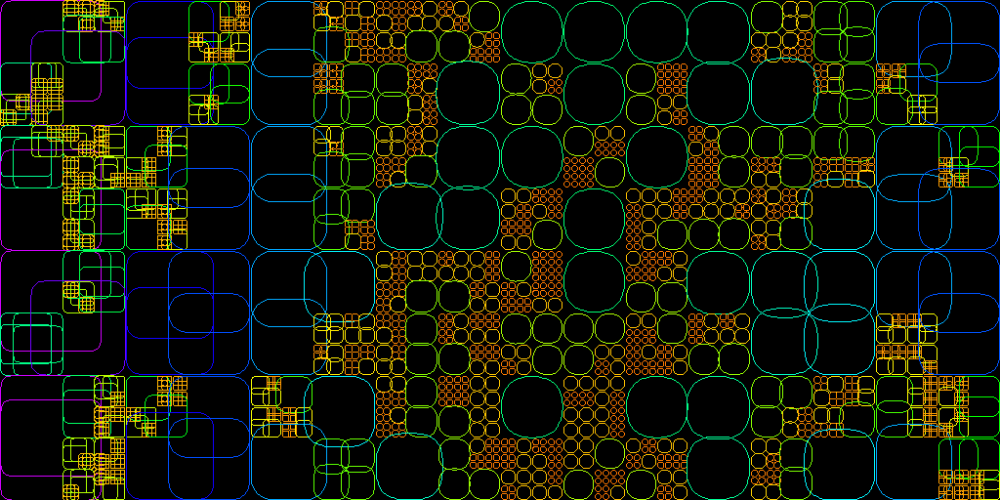

[sketch_2020_12_31c_recursive_grid](https://github.com/villares/sketch-a-day/tree/master/2020/sketch_2020_12_31c_recursive_grid) [[Py.Processing](https://villares.github.io/como-instalar-o-processing-modo-python/index-EN)]


- [**Runnning on the browser with pyp5js pyodide mode**](https://abav.lugaralgum.com/sketch-a-day/2020/sketch_2020_12_31c_recursive_grid/pyodide/)
- [Animated GIF](https://raw.githubusercontent.com/villares/sketch-a-day/master/2020/sketch_2020_12_31c_recursive_grid/output.gif)

---

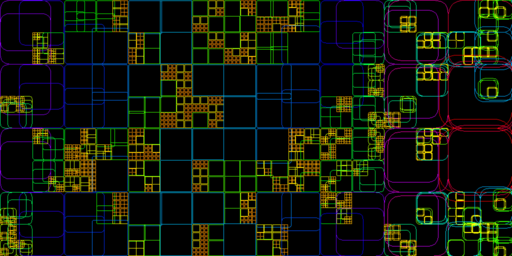

[**Runnning on the browser with pyp5js pyodide mode**](https://abav.lugaralgum.com/sketch-a-day/2020/sketch_2020_12_30c_recursive_grid/pyodide/) [Animated GIF](https://raw.githubusercontent.com/villares/sketch-a-day/master/2020/sketch_2020_12_30c_recursive_grid/output.gif)

- [sketch_2020_12_30c_recursive_grid](https://github.com/villares/sketch-a-day/tree/master/2020/sketch_2020_12_30c_recursive_grid)
- [[Py.Processing](https://villares.github.io/como-instalar-o-processing-modo-python/index-EN)]

---

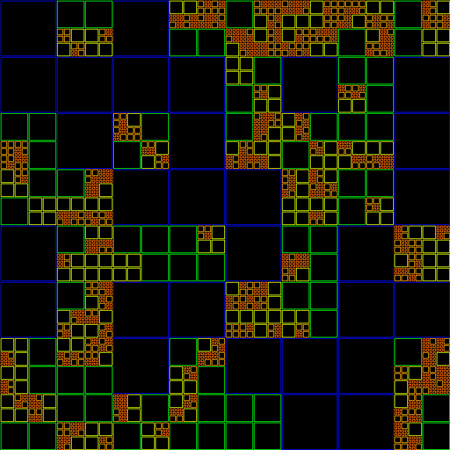

[sketch_2020_12_29c_recursive_grid_](https://github.com/villares/sketch-a-day/tree/master/2020/sketch_2020_12_29c_recursive_grid_) [[Py.Processing](https://villares.github.io/como-instalar-o-processing-modo-python/index-EN)]

---

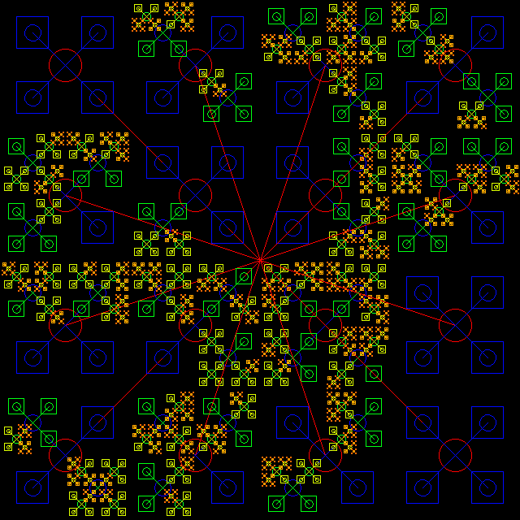

[sketch_2020_12_28c_recursive_grid](https://github.com/villares/sketch-a-day/tree/master/2020/sketch_2020_12_28c_recursive_grid) [[Py.Processing](https://villares.github.io/como-instalar-o-processing-modo-python/index-EN)]

---

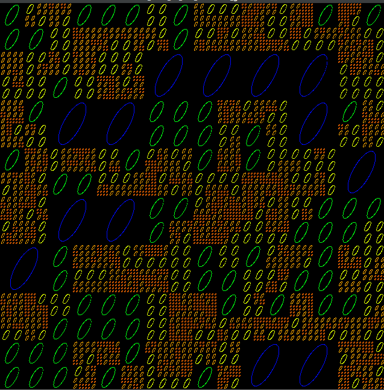

[sketch_2020_12_27c_recursive_grid](https://github.com/villares/sketch-a-day/tree/master/2020/sketch_2020_12_27c_recursive_grid) [[Py.Processing](https://villares.github.io/como-instalar-o-processing-modo-python/index-EN)]

---

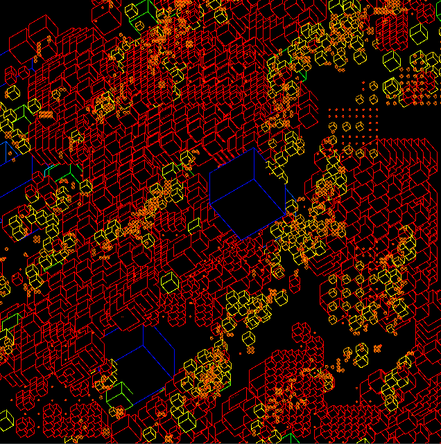

[sketch_2020_12_26c_recursive_grid](https://github.com/villares/sketch-a-day/tree/master/2020/sketch_2020_12_26c_recursive_grid) [[Py.Processing](https://villares.github.io/como-instalar-o-processing-modo-python/index-EN)]

---

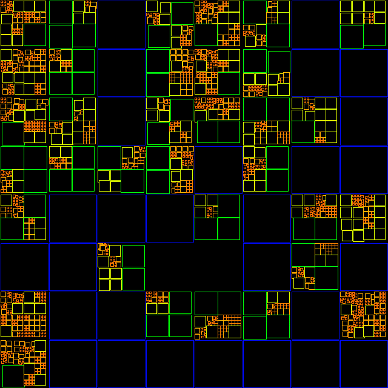

[sketch_2020_12_25c_recursive_grid](https://github.com/villares/sketch-a-day/tree/master/2020/sketch_2020_12_25c_recursive_grid) [[Py.Processing](https://villares.github.io/como-instalar-o-processing-modo-python/index-EN)]

---

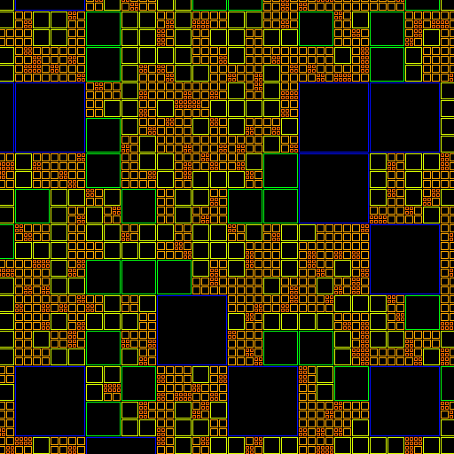

[sketch_2020_12_24c_recursive_grid](https://github.com/villares/sketch-a-day/tree/master/2020/sketch_2020_12_24c_recursive_grid) [[Py.Processing](https://villares.github.io/como-instalar-o-processing-modo-python/index-EN)]

---

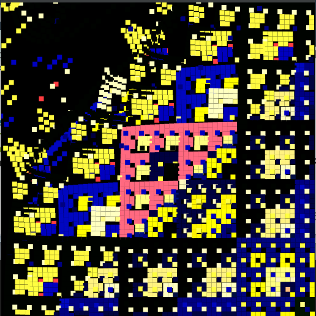

[sketch_2020_12_23d_ntsutae](https://github.com/villares/sketch-a-day/tree/master/2020/sketch_2020_12_23d_ntsutae) [[Py.Processing](https://villares.github.io/como-instalar-o-processing-modo-python/index-EN)]

Based on [a sketch by @ntsutae](https://twitter.com/ntsutae/status/1337921503552102400?s=20). Check out [my tweet with a recorded gif](https://twitter.com/villares/status/1341939285545656321) .

---

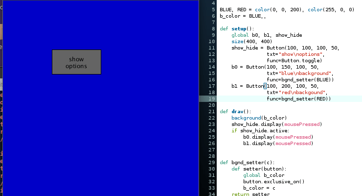

[sketch_2020_12_22a](https://github.com/villares/sketch-a-day/tree/master/2020/sketch_2020_12_22a) [[Py.Processing](https://villares.github.io/como-instalar-o-processing-modo-python/index-EN)]

---


[sketch_2020_12_21a](https://github.com/villares/sketch-a-day/tree/master/2020/sketch_2020_12_21a) [[Py.Processing](https://villares.github.io/como-instalar-o-processing-modo-python/index-EN)]

---

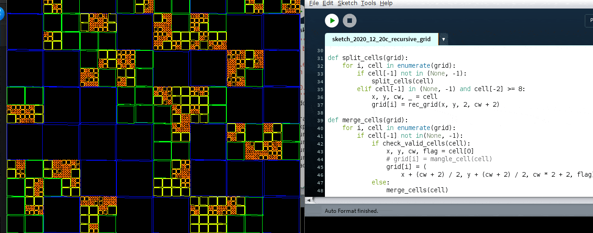

[sketch_2020_12_20c_recursive_grid](https://github.com/villares/sketch-a-day/tree/master/2020/sketch_2020_12_20c_recursive_grid) [[Py.Processing](https://villares.github.io/como-instalar-o-processing-modo-python/index-EN)]

---

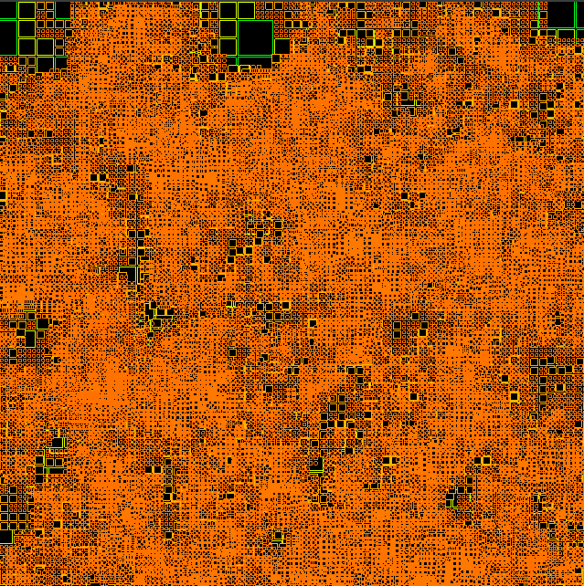

[sketch_2020_12_19c_recursive_grid](https://github.com/villares/sketch-a-day/tree/master/2020/sketch_2020_12_19c_recursive_grid) [[Py.Processing](https://villares.github.io/como-instalar-o-processing-modo-python/index-EN)]

sketch_2020_12_20 is kind of "wrong" (my merge cell function is broken) but I like it "wrong".

---


[sketch_2020_12_18c_recursive_grid](https://github.com/villares/sketch-a-day/tree/master/2020/sketch_2020_12_18c_recursive_grid) [[Py.Processing](https://villares.github.io/como-instalar-o-processing-modo-python/index-EN)]

---


[sketch_2020_12_17a_3D_revolve](https://github.com/villares/sketch-a-day/tree/master/2020/sketch_2020_12_17a_3D_revolve) [[Py.Processing](https://villares.github.io/como-instalar-o-processing-modo-python/index-EN)]

3D studies with [Julio Mariutti](http://estudiologos.com.br/projetos/), inspired by: https://seoi.net/peni3d/


---

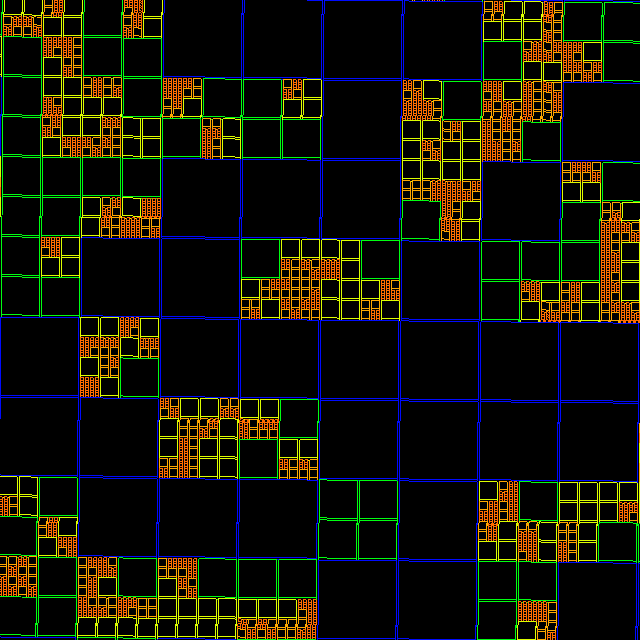

[sketch_2020_12_16c_recursive_grid](https://github.com/villares/sketch-a-day/tree/master/2020/sketch_2020_12_16c_recursive_grid) [[Py.Processing](https://villares.github.io/como-instalar-o-processing-modo-python/index-EN)]

---

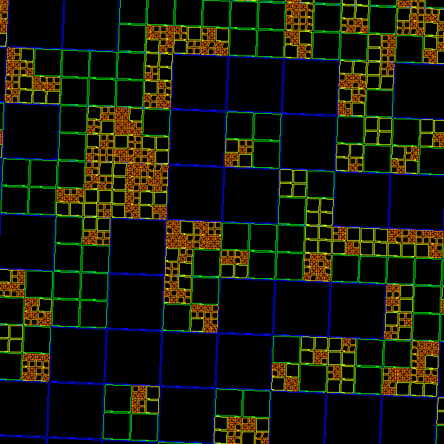

[sketch_2020_12_15c_recursive_grid](https://github.com/villares/sketch-a-day/tree/master/2020/sketch_2020_12_15c_recursive_grid) [[Py.Processing](https://villares.github.io/como-instalar-o-processing-modo-python/index-EN)]

---

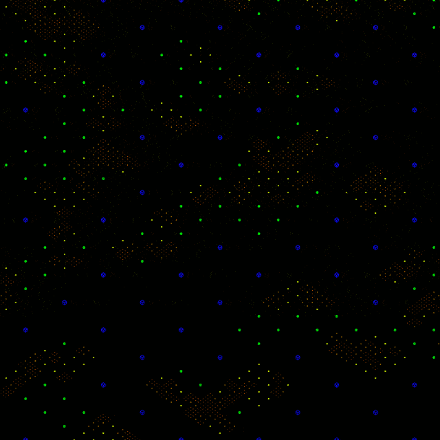

[sketch_2020_12_14c_recursive_grid](https://github.com/villares/sketch-a-day/tree/master/2020/sketch_2020_12_14c_recursive_grid) [[Py.Processing](https://villares.github.io/como-instalar-o-processing-modo-python/index-EN)]

---

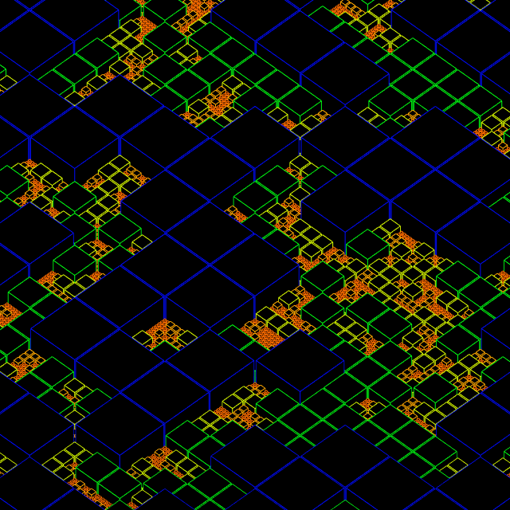

[sketch_2020_12_13c_recursive_grid](https://github.com/villares/sketch-a-day/tree/master/2020/sketch_2020_12_13c_recursive_grid) [[Py.Processing](https://villares.github.io/como-instalar-o-processing-modo-python/index-EN)]

---

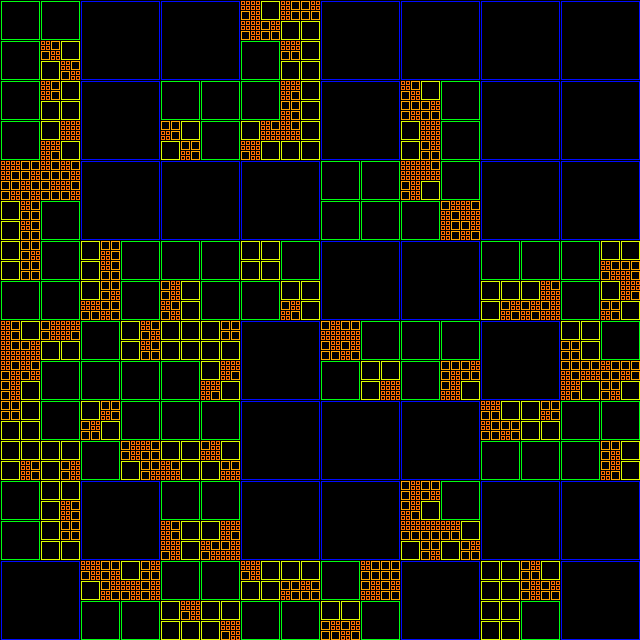

[sketch_2020_12_12c_recursive_grid](https://github.com/villares/sketch-a-day/tree/master/2020/sketch_2020_12_12c_recursive_grid) [[Py.Processing](https://villares.github.io/como-instalar-o-processing-modo-python/index-EN)]

---

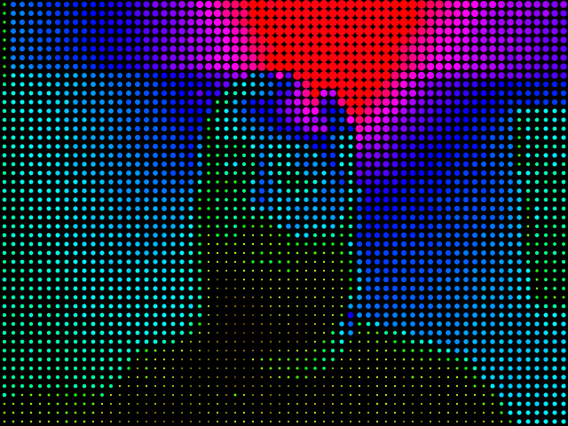

[sketch_2020_12_11a](https://github.com/villares/sketch-a-day/tree/master/2020/sketch_2020_12_11a) [[Py.Processing](https://villares.github.io/como-instalar-o-processing-modo-python/index-EN)]

---

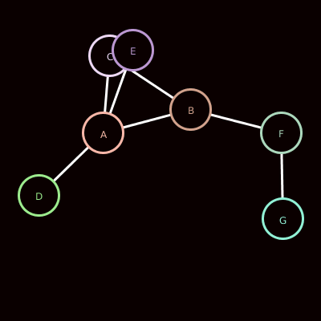

[sketch_2020_12_10a_naive_graph](https://github.com/villares/sketch-a-day/tree/master/2020/sketch_2020_12_10a_naive_graph) [[Py.Processing](https://villares.github.io/como-instalar-o-processing-modo-python/index-EN)]

---


[sketch_2020_12_09c](https://github.com/villares/sketch-a-day/tree/master/2020/sketch_2020_12_09c) [[Py.Processing](https://villares.github.io/como-instalar-o-processing-modo-python/index-EN)]

---


[sketch_2020_12_08c](https://github.com/villares/sketch-a-day/tree/master/2020/sketch_2020_12_08c) [[Py.Processing](https://villares.github.io/como-instalar-o-processing-modo-python/index-EN)]

---


[sketch_2020_12_07c_mesh](https://github.com/villares/sketch-a-day/tree/master/2020/sketch_2020_12_07c_mesh) [[Py.Processing](https://villares.github.io/como-instalar-o-processing-modo-python/index-EN)]

---

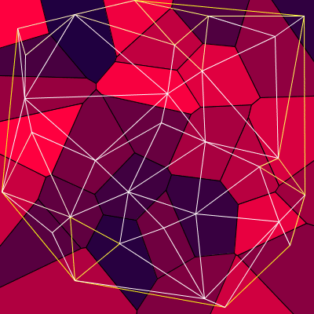

[sketch_2020_12_06c_mesh](https://github.com/villares/sketch-a-day/tree/master/2020/sketch_2020_12_06c_mesh) [[Py.Processing](https://villares.github.io/como-instalar-o-processing-modo-python/index-EN)]

---

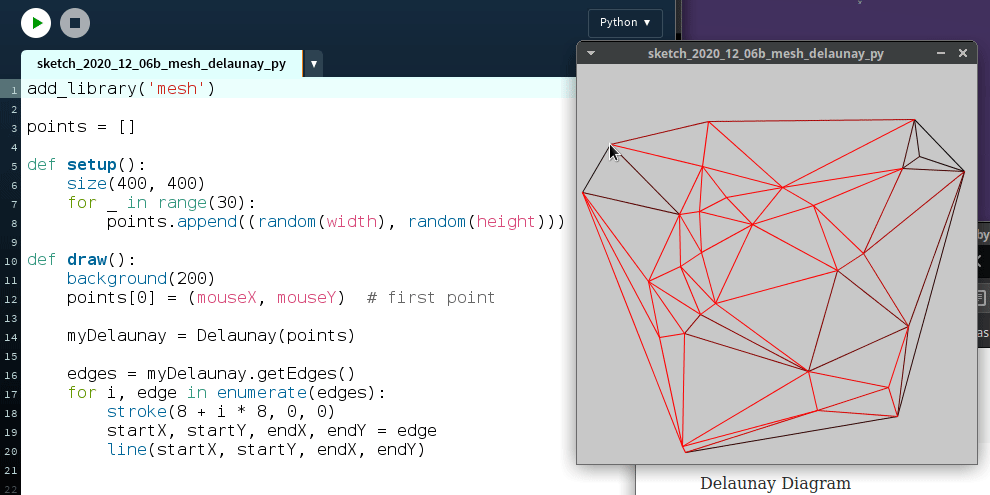

[sketch_2020_12_06b_mesh_delaunay_py](https://github.com/villares/sketch-a-day/tree/master/2020/sketch_2020_12_06b_mesh_delaunay_py) [[Py.Processing](https://villares.github.io/como-instalar-o-processing-modo-python/index-EN)]

---

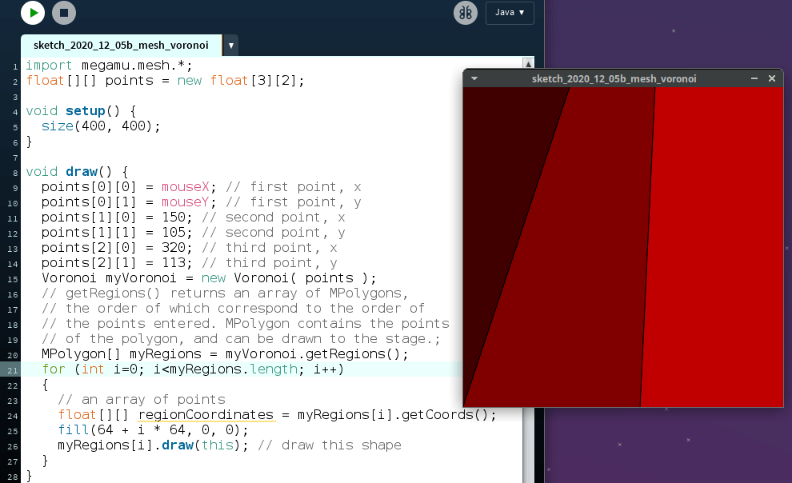

[sketch_2020_12_05b_mesh_voronoi](https://github.com/villares/sketch-a-day/tree/master/2020/sketch_2020_12_05b_mesh_voronoi) [sketch_2020_12_05b_mesh_voronoi_py](https://github.com/villares/sketch-a-day/tree/master/2020/sketch_2020_12_05b_mesh_voronoi_py) [[Py.Processing](https://villares.github.io/como-instalar-o-processing-modo-python/index-EN)]

---

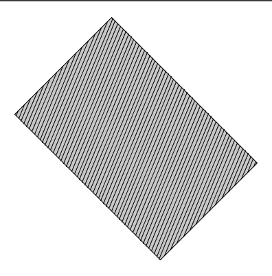

[sketch_2020_12_04a_rotated_rect_stuff](https://github.com/villares/sketch-a-day/tree/master/2020/sketch_2020_12_04a_rotated_rect_stuff) [[Py.Processing](https://villares.github.io/como-instalar-o-processing-modo-python/index-EN)]


---

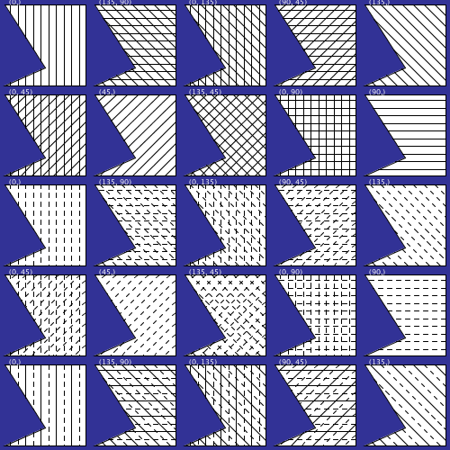

[sketch_2020_12_03a](https://github.com/villares/sketch-a-day/tree/master/2020/sketch_2020_12_03a) [[Py.Processing](https://villares.github.io/como-instalar-o-processing-modo-python/index-EN)]

---

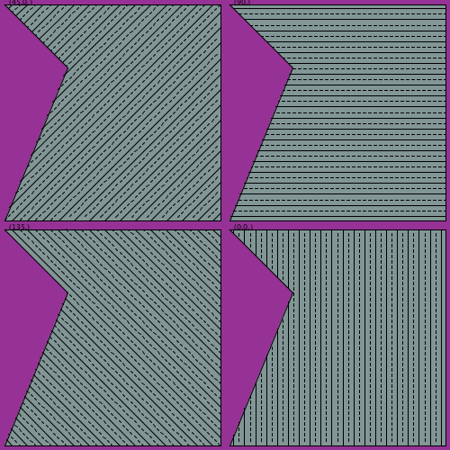

[sketch_2020_12_02a](https://github.com/villares/sketch-a-day/tree/master/2020/sketch_2020_12_02a) [[Py.Processing](https://villares.github.io/como-instalar-o-processing-modo-python/index-EN)]

---

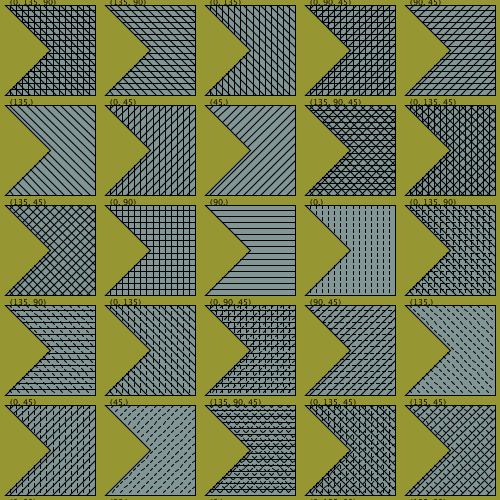

[sketch_2020_12_01a](https://github.com/villares/sketch-a-day/tree/master/2020/sketch_2020_12_01a) [[Py.Processing](https://villares.github.io/como-instalar-o-processing-modo-python/index-EN)]

---

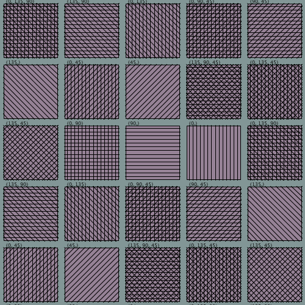

[sketch_2020_11_30a](https://github.com/villares/sketch-a-day/tree/master/2020/sketch_2020_11_30a) [[Py.Processing](https://villares.github.io/como-instalar-o-processing-modo-python/index-EN)]

---

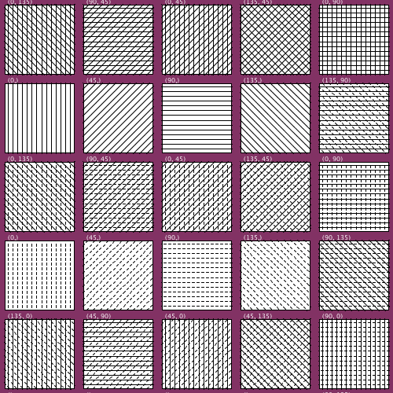

[sketch_2020_11_29a](https://github.com/villares/sketch-a-day/tree/master/2020/sketch_2020_11_29a) [[Py.Processing](https://villares.github.io/como-instalar-o-processing-modo-python/index-EN)]

---

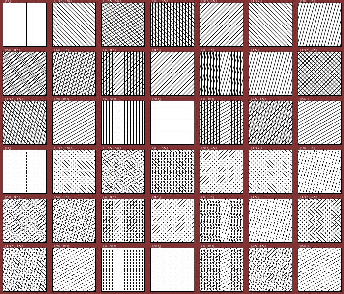

[sketch_2020_11_28a](https://github.com/villares/sketch-a-day/tree/master/2020/sketch_2020_11_28a) [[Py.Processing](https://villares.github.io/como-instalar-o-processing-modo-python/index-EN)]

---

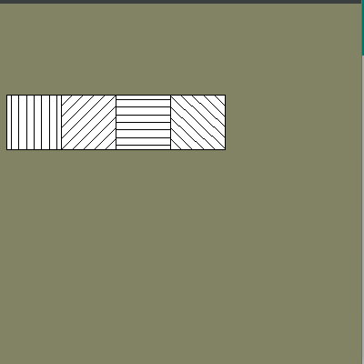

[sketch_2020_11_27b](https://github.com/villares/sketch-a-day/tree/master/2020/sketch_2020_11_27b) [[Py.Processing](https://villares.github.io/como-instalar-o-processing-modo-python/index-EN)]

---

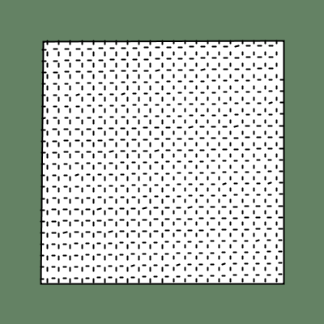

[sketch_2020_11_26a](https://github.com/villares/sketch-a-day/tree/master/2020/sketch_2020_11_26a) [[Py.Processing](https://villares.github.io/como-instalar-o-processing-modo-python/index-EN)]

---

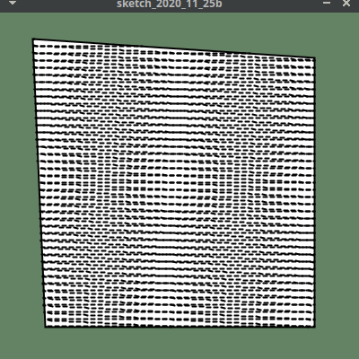

[sketch_2020_11_25b](https://github.com/villares/sketch-a-day/tree/master/2020/sketch_2020_11_25b) [[Py.Processing](https://villares.github.io/como-instalar-o-processing-modo-python/index-EN)]

---

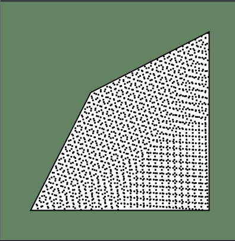

[sketch_2020_11_25a](https://github.com/villares/sketch-a-day/tree/master/2020/sketch_2020_11_25a) [[Py.Processing](https://villares.github.io/como-instalar-o-processing-modo-python/index-EN)]

---

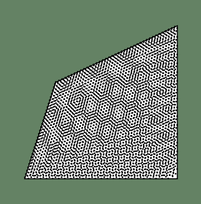

[sketch_2020_11_24a](https://github.com/villares/sketch-a-day/tree/master/2020/sketch_2020_11_24a) [[Py.Processing](https://villares.github.io/como-instalar-o-processing-modo-python/index-EN)]

---

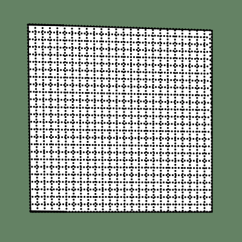

[sketch_2020_11_23a](https://github.com/villares/sketch-a-day/tree/master/2020/sketch_2020_11_23a) [[Py.Processing](https://villares.github.io/como-instalar-o-processing-modo-python/index-EN)]

---

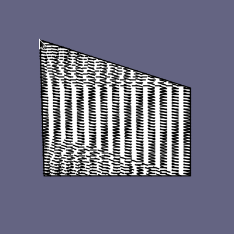

[sketch_2020_11_22a](https://github.com/villares/sketch-a-day/tree/master/2020/sketch_2020_11_22a) [[Py.Processing](https://villares.github.io/como-instalar-o-processing-modo-python/index-EN)]

---

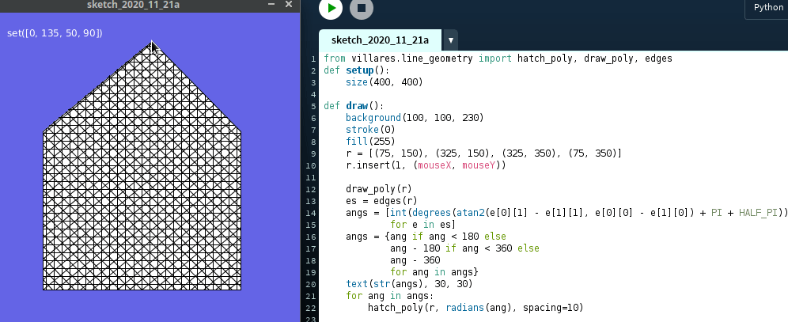

[sketch_2020_11_21a](https://github.com/villares/sketch-a-day/tree/master/2020/sketch_2020_11_21a) [[Py.Processing](https://villares.github.io/como-instalar-o-processing-modo-python/index-EN)]

---

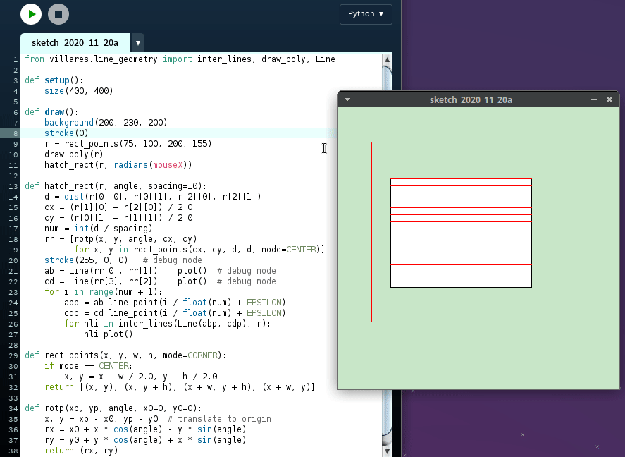

[sketch_2020_11_20a](https://github.com/villares/sketch-a-day/tree/master/2020/sketch_2020_11_20a) [[Py.Processing](https://villares.github.io/como-instalar-o-processing-modo-python/index-EN)]

---

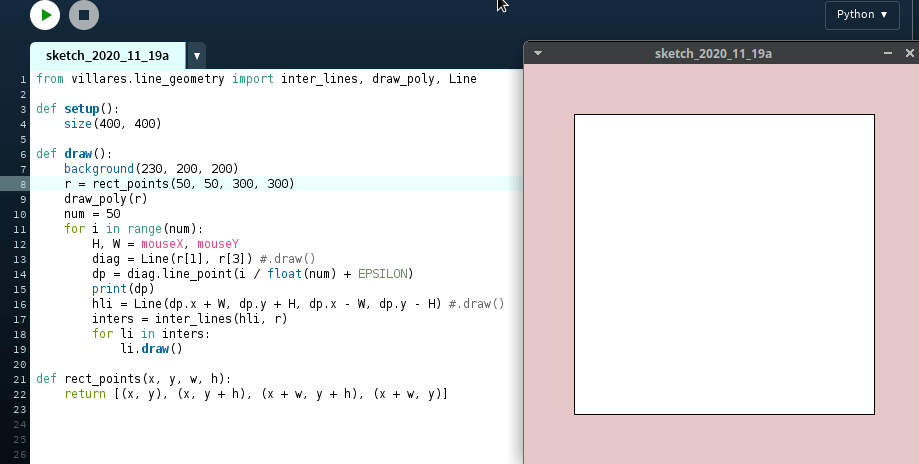

[sketch_2020_11_19a](https://github.com/villares/sketch-a-day/tree/master/2020/sketch_2020_11_19a) [[Py.Processing](https://villares.github.io/como-instalar-o-processing-modo-python/index-EN)]

---

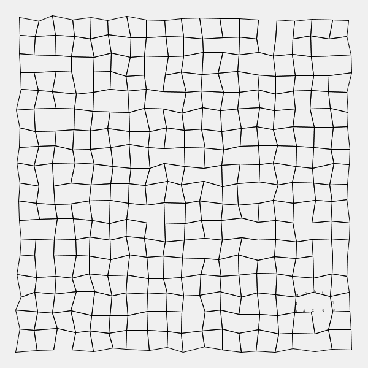

[sketch_2020_11_18a](https://github.com/villares/sketch-a-day/tree/master/2020/sketch_2020_11_18a) [[Py.Processing](https://villares.github.io/como-instalar-o-processing-modo-python/index-EN)]

---

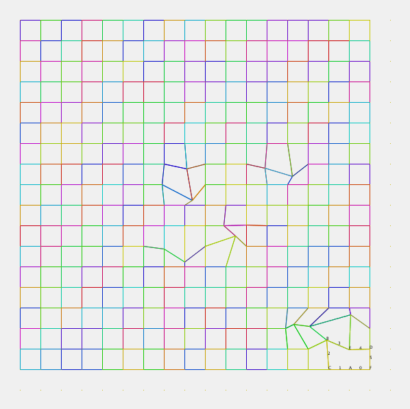

[sketch_2020_11_17a](https://github.com/villares/sketch-a-day/tree/master/2020/sketch_2020_11_17a) [[Py.Processing](https://villares.github.io/como-instalar-o-processing-modo-python/index-EN)]

---

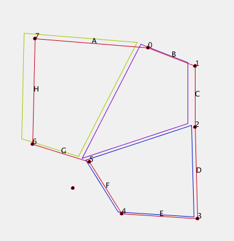

[sketch_2020_11_16a](https://github.com/villares/sketch-a-day/tree/master/2020/sketch_2020_11_16a) [[Py.Processing](https://villares.github.io/como-instalar-o-processing-modo-python/index-EN)]

---

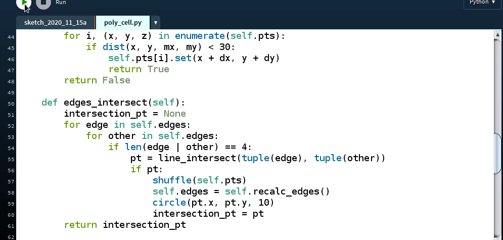

[sketch_2020_11_15a](https://github.com/villares/sketch-a-day/tree/master/2020/sketch_2020_11_15a) [[Py.Processing](https://villares.github.io/como-instalar-o-processing-modo-python/index-EN)]

---

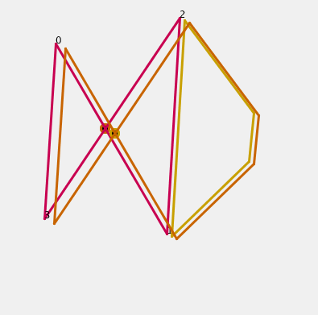

[sketch_2020_11_14a](https://github.com/villares/sketch-a-day/tree/master/2020/sketch_2020_11_14a) [[Py.Processing](https://villares.github.io/como-instalar-o-processing-modo-python/index-EN)]

---


[sketch_2020_11_13a](https://github.com/villares/sketch-a-day/tree/master/2020/sketch_2020_11_13a) [[Py.Processing](https://villares.github.io/como-instalar-o-processing-modo-python/index-EN)]

---

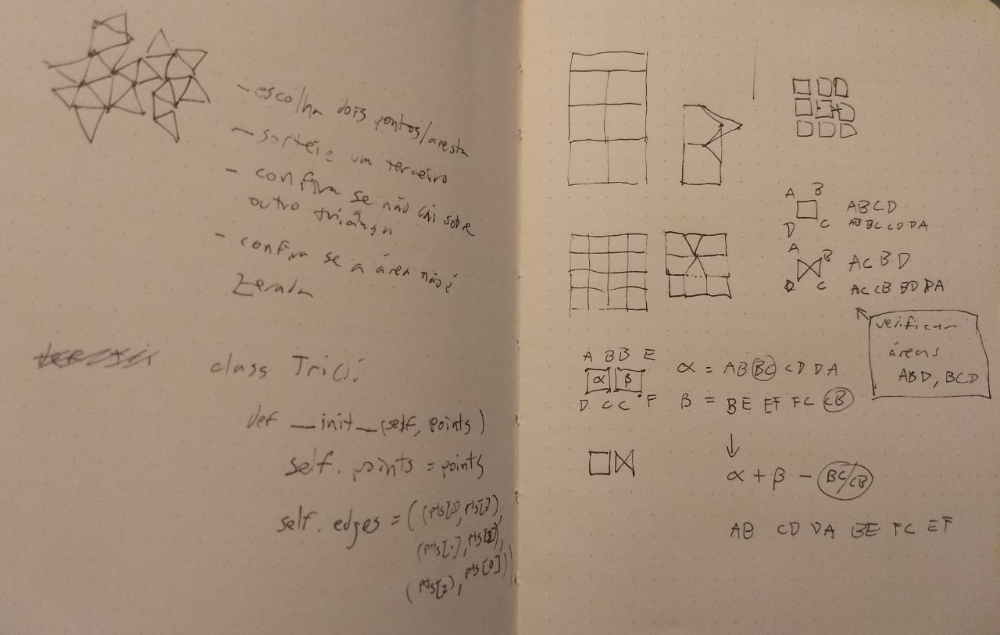

[sketch_2020_11_12notebook](https://github.com/villares/sketch-a-day/tree/master/2020/sketch_2020_11_12notebook) [[Py.Processing](https://villares.github.io/como-instalar-o-processing-modo-python/index-EN)]

---


[sketch_2020_11_11b](https://github.com/villares/sketch-a-day/tree/master/2020/sketch_2020_11_11b) [[Py.Processing](https://villares.github.io/como-instalar-o-processing-modo-python/index-EN)]

---

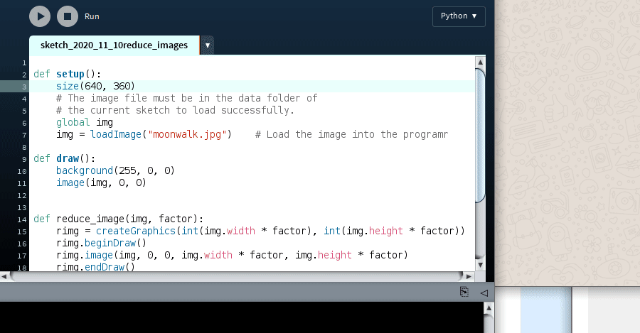

[sketch_2020_11_10reduce_images](https://github.com/villares/sketch-a-day/tree/master/2020/sketch_2020_11_10reduce_images) [[Py.Processing](https://villares.github.io/como-instalar-o-processing-modo-python/index-EN)]

---

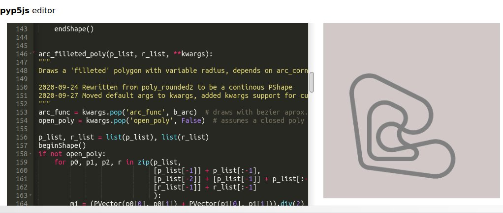

[sketch_2020_11_09arcs_for_pyp5js](https://github.com/villares/sketch-a-day/tree/master/2020/sketch_2020_11_09arcs_for_pyp5js) [[Py.Processing](https://villares.github.io/como-instalar-o-processing-modo-python/index-EN)]

---

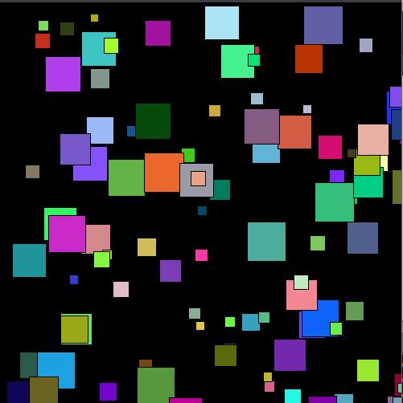

[sketch_2020_11_08belas_artes](https://github.com/villares/sketch-a-day/tree/master/2020/sketch_2020_11_08belas_artes) [[Py.Processing](https://villares.github.io/como-instalar-o-processing-modo-python/index-EN)]

---

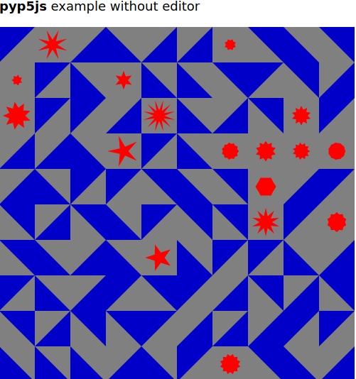


[sketch_2020_11_07](https://github.com/villares/sketch-a-day/tree/master/2020/sketch_2020_11_07) [[Py.Processing](https://villares.github.io/como-instalar-o-processing-modo-python/index-EN)]

Based on truchet code by Bernado Fontes during the Python Brasil 2020 tutorial!
[running on pyodide!](https://abav.lugaralgum.com/sketch-a-day/2020/sketch_2020_11_07pyodide/)

---

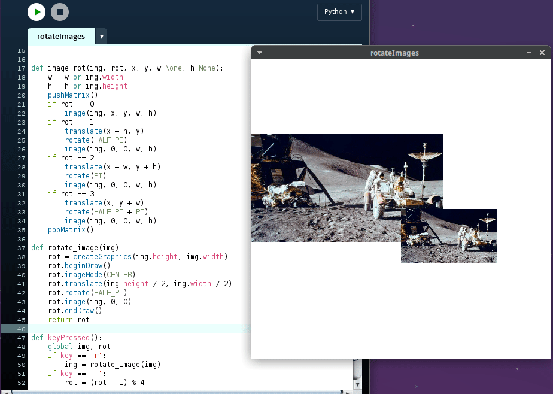

[sketch_2020_11_06rotate_images](https://github.com/villares/sketch-a-day/tree/master/2020/sketch_2020_11_06rotate_images) [[Py.Processing](https://villares.github.io/como-instalar-o-processing-modo-python/index-EN)]

---

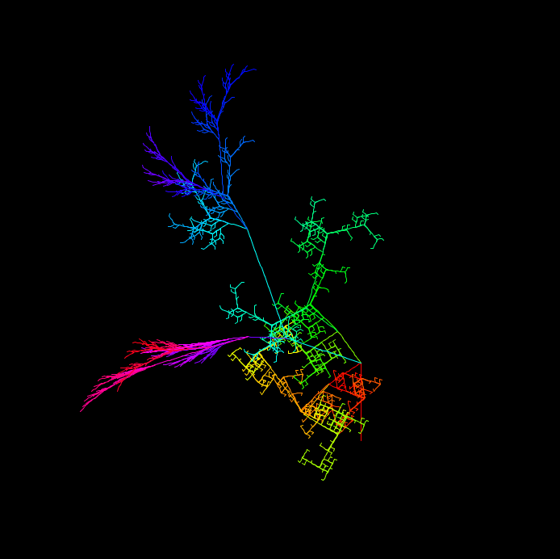

[sketch_2020_11_05_LSystem](https://github.com/villares/sketch-a-day/tree/master/2020/sketch_2020_11_05_LSystem) [[Py.Processing](https://villares.github.io/como-instalar-o-processing-modo-python/index-EN)]

---

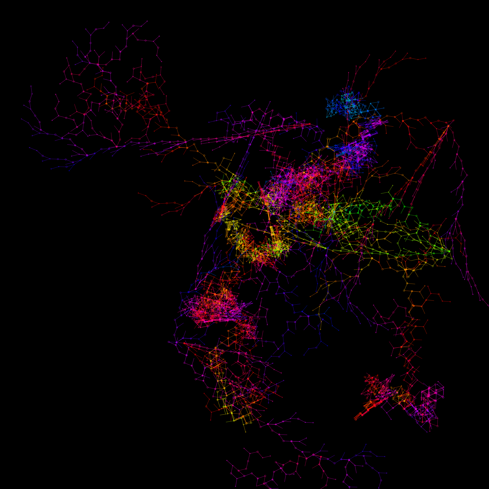

[sketch_2020_11_04_LSystem](https://github.com/villares/sketch-a-day/tree/master/2020/sketch_2020_11_04_LSystem) [[Py.Processing](https://villares.github.io/como-instalar-o-processing-modo-python/index-EN)]

---

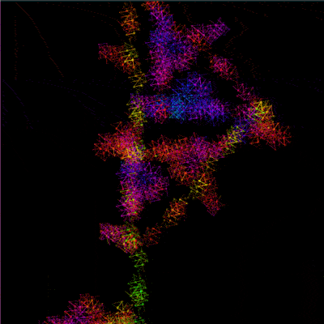

[sketch_2020_11_03_LSystem](https://github.com/villares/sketch-a-day/tree/master/2020/sketch_2020_11_03_LSystem) [[Py.Processing](https://villares.github.io/como-instalar-o-processing-modo-python/index-EN)]

---

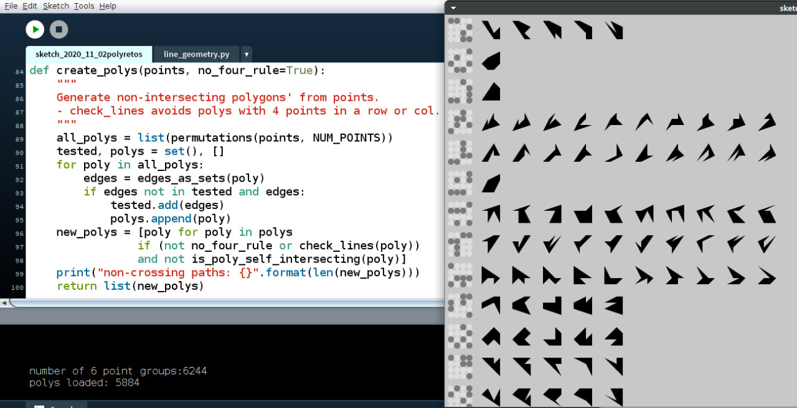

[sketch_2020_11_02polys](https://github.com/villares/sketch-a-day/tree/master/2020/sketch_2020_11_02polys) [[Py.Processing](https://villares.github.io/como-instalar-o-processing-modo-python/index-EN)]

---

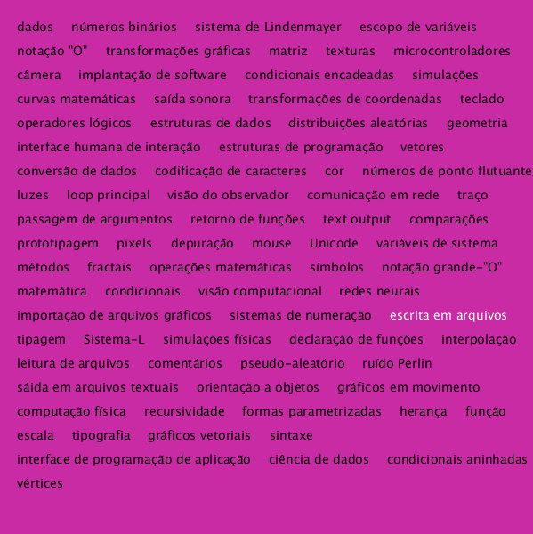

[sketch_2020_11_01a](https://github.com/villares/sketch-a-day/tree/master/2020/sketch_2020_11_01a) [[Py.Processing](https://villares.github.io/como-instalar-o-processing-modo-python/index-EN)]

---

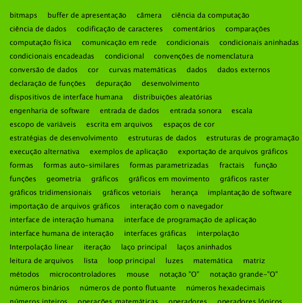

[sketch_2020_10_31a](https://github.com/villares/sketch-a-day/tree/master/2020/sketch_2020_10_31a) [[Py.Processing](https://villares.github.io/como-instalar-o-processing-modo-python/index-EN)]

---

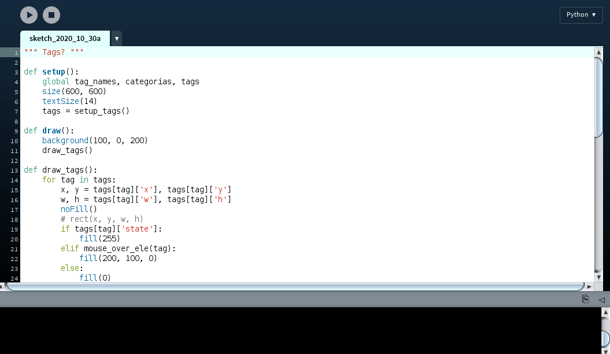

[sketch_2020_10_30a](https://github.com/villares/sketch-a-day/tree/master/2020/sketch_2020_10_30a) [[Py.Processing](https://villares.github.io/como-instalar-o-processing-modo-python/index-EN)]

---

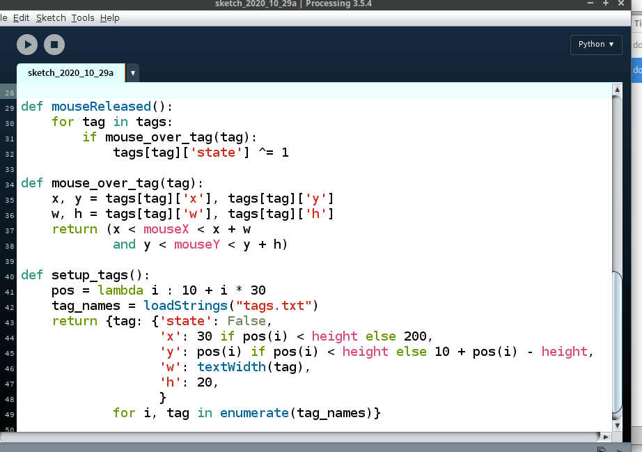

[sketch_2020_10_29a](https://github.com/villares/sketch-a-day/tree/master/2020/sketch_2020_10_29a) [[Py.Processing](https://villares.github.io/como-instalar-o-processing-modo-python/index-EN)]

---

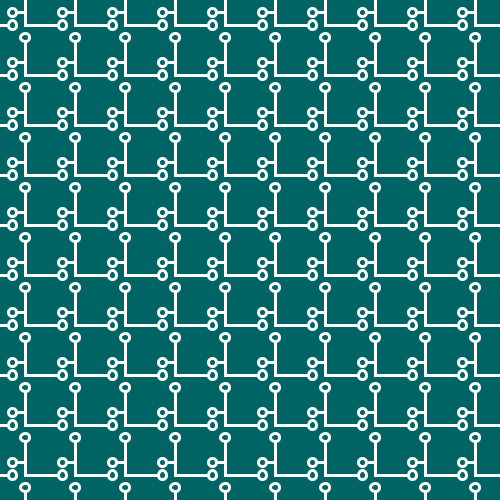

[sketch_2020_10_28b](https://github.com/villares/sketch-a-day/tree/master/2020/sketch_2020_10_28b) [[Py.Processing](https://villares.github.io/como-instalar-o-processing-modo-python/index-EN)]

---


[sketch_2020_10_27b](https://github.com/villares/sketch-a-day/tree/master/2020/sketch_2020_10_27b) [[Py.Processing](https://villares.github.io/como-instalar-o-processing-modo-python/index-EN)]

---

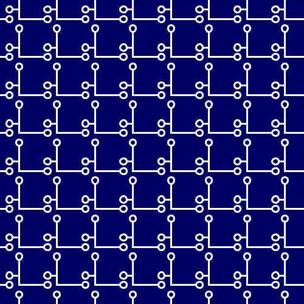

[sketch_2020_10_26b](https://github.com/villares/sketch-a-day/tree/master/2020/sketch_2020_10_26b) [[Py.Processing](https://villares.github.io/como-instalar-o-processing-modo-python/index-EN)]

---


[sketch_2020_10_25a](https://github.com/villares/sketch-a-day/tree/master/2020/sketch_2020_10_25a) [[Py.Processing](https://villares.github.io/como-instalar-o-processing-modo-python/index-EN)]

---


[sketch_2020_10_24a](https://github.com/villares/sketch-a-day/tree/master/2020/sketch_2020_10_24a) [[Py.Processing](https://villares.github.io/como-instalar-o-processing-modo-python/index-EN)]

---

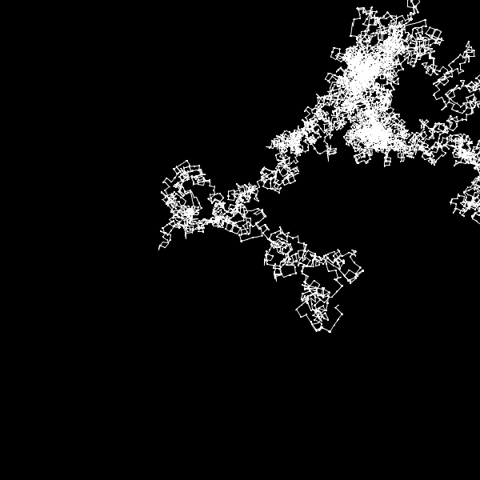

[sketch_2020_10_23_LSystem](https://github.com/villares/sketch-a-day/tree/master/2020/sketch_2020_10_23_LSystem) [[Py.Processing](https://villares.github.io/como-instalar-o-processing-modo-python/index-EN)]

---

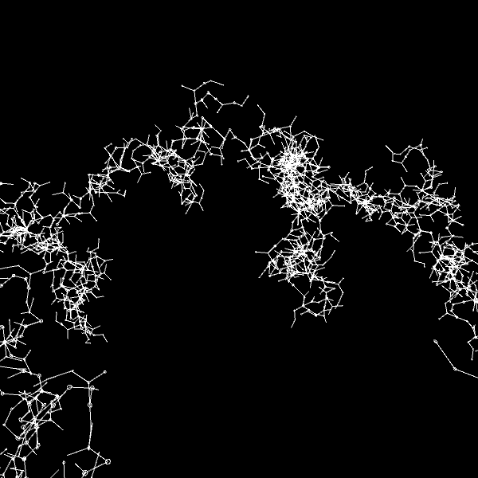

[sketch_2020_10_22_LSystem](https://github.com/villares/sketch-a-day/tree/master/2020/sketch_2020_10_22_LSystem) [[Py.Processing](https://villares.github.io/como-instalar-o-processing-modo-python/index-EN)]

---

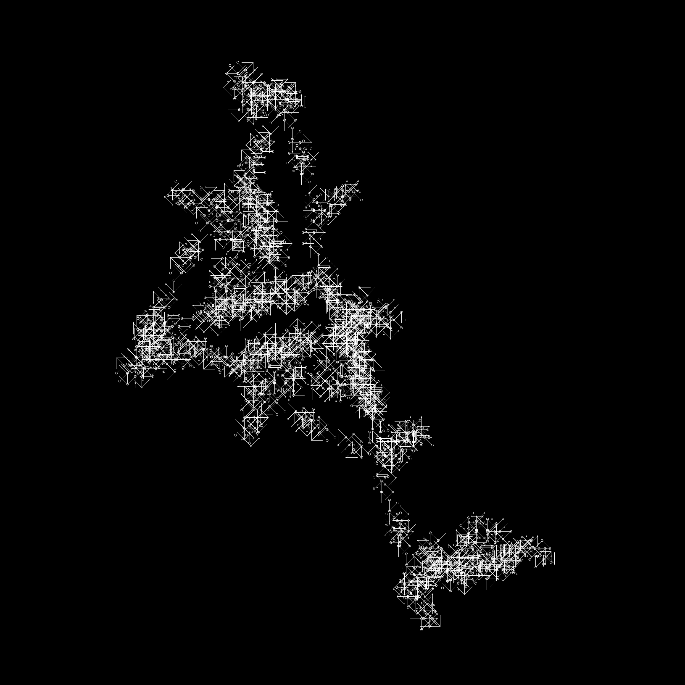

[sketch_2020_10_21_LSystem](https://github.com/villares/sketch-a-day/tree/master/2020/sketch_2020_10_21_LSystem) [[Py.Processing](https://villares.github.io/como-instalar-o-processing-modo-python/index-EN)]

---

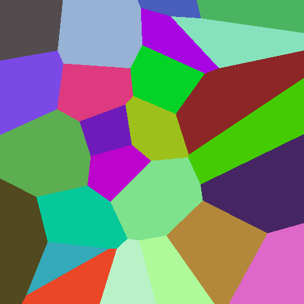

[sketch_2020_10_20voronoi](https://github.com/villares/sketch-a-day/tree/master/2020/sketch_2020_10_20voronoi) [[Py.Processing](https://villares.github.io/como-instalar-o-processing-modo-python/index-EN)]

---

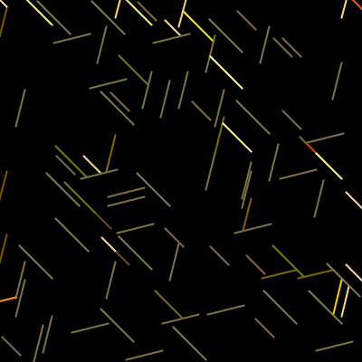

[sketch_2020_10_19a](https://github.com/villares/sketch-a-day/tree/master/2020/sketch_2020_10_19a) [[Py.Processing](https://villares.github.io/como-instalar-o-processing-modo-python/index-EN)]

---

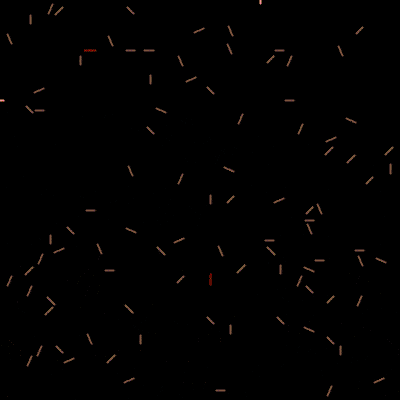

[sketch_2020_10_18b](https://github.com/villares/sketch-a-day/tree/master/2020/sketch_2020_10_18b) [[Py.Processing](https://villares.github.io/como-instalar-o-processing-modo-python/index-EN)]

---

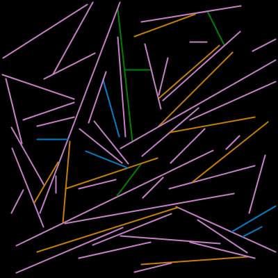

[sketch_2020_10_17a](https://github.com/villares/sketch-a-day/tree/master/2020/sketch_2020_10_17a) [[Py.Processing](https://villares.github.io/como-instalar-o-processing-modo-python/index-EN)]

---


[sketch_2020_10_16a](https://github.com/villares/sketch-a-day/tree/master/2020/sketch_2020_10_16a) [[Py.Processing](https://villares.github.io/como-instalar-o-processing-modo-python/index-EN)]

---

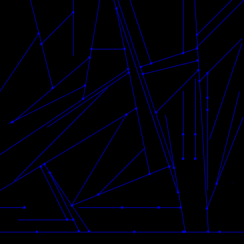

[sketch_2020_10_15a](https://github.com/villares/sketch-a-day/tree/master/2020/sketch_2020_10_15a) [[Py.Processing](https://villares.github.io/como-instalar-o-processing-modo-python/index-EN)]

---

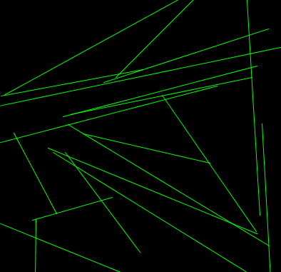

[sketch_2020_10_14a](https://github.com/villares/sketch-a-day/tree/master/2020/sketch_2020_10_14a) [[Py.Processing](https://villares.github.io/como-instalar-o-processing-modo-python/index-EN)]

---

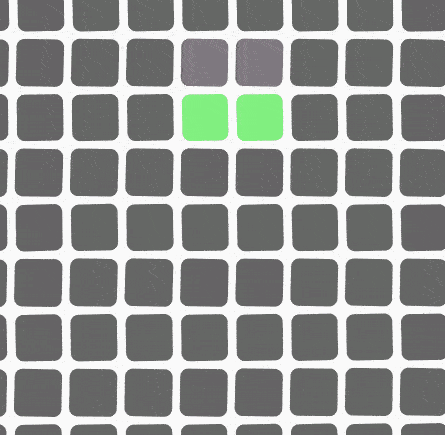

[sketch_2020_10_13a](https://github.com/villares/sketch-a-day/tree/master/2020/sketch_2020_10_13a) [[Py.Processing](https://villares.github.io/como-instalar-o-processing-modo-python/index-EN)]

---

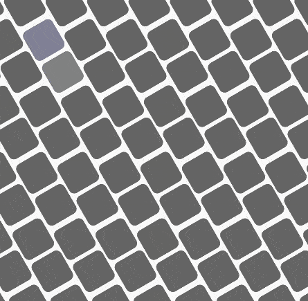

[sketch_2020_10_12a](https://github.com/villares/sketch-a-day/tree/master/2020/sketch_2020_10_12a) [[Py.Processing](https://villares.github.io/como-instalar-o-processing-modo-python/index-EN)]

---

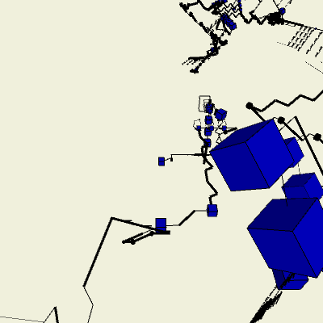

[sketch_2020_10_11a](https://github.com/villares/sketch-a-day/tree/master/2020/sketch_2020_10_11a) [[Py.Processing](https://villares.github.io/como-instalar-o-processing-modo-python/index-EN)]

---

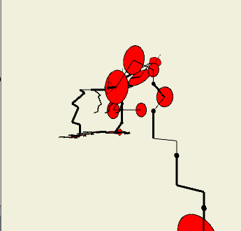

[sketch_2020_10_10a](https://github.com/villares/sketch-a-day/tree/master/2020/sketch_2020_10_10a) [[Py.Processing](https://villares.github.io/como-instalar-o-processing-modo-python/index-EN)]

---

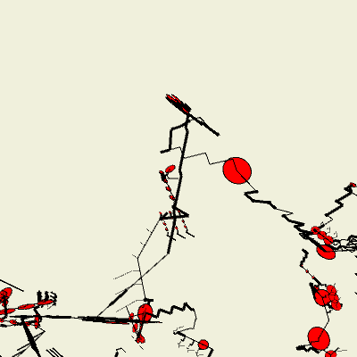

[sketch_2020_10_09a](https://github.com/villares/sketch-a-day/tree/master/2020/sketch_2020_10_09a) [[Py.Processing](https://villares.github.io/como-instalar-o-processing-modo-python/index-EN)]

---

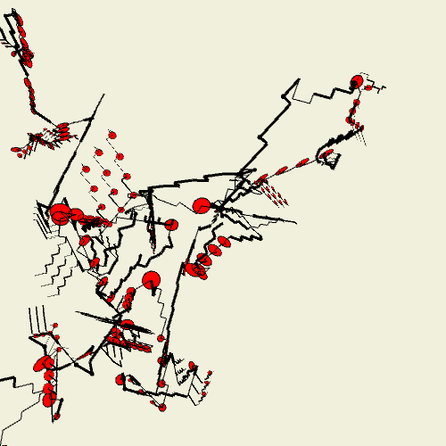

[sketch_2020_10_08a](https://github.com/villares/sketch-a-day/tree/master/2020/sketch_2020_10_08a) [[Py.Processing](https://villares.github.io/como-instalar-o-processing-modo-python/index-EN)]

---

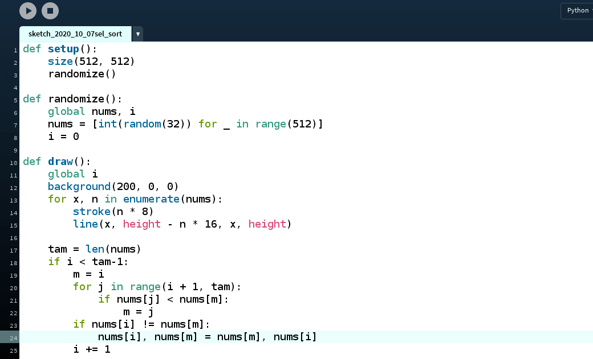

[sketch_2020_10_07sel_sort](https://github.com/villares/sketch-a-day/tree/master/2020/sketch_2020_10_07sel_sort) [[Py.Processing](https://villares.github.io/como-instalar-o-processing-modo-python/index-EN)]

---

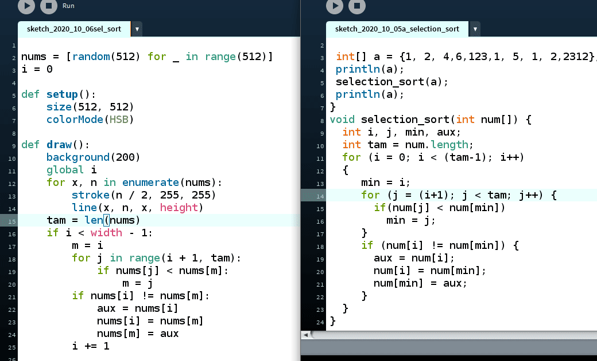

[sketch_2020_10_06sel_sort](https://github.com/villares/sketch-a-day/tree/master/2020/sketch_2020_10_06sel_sort) [[Py.Processing](https://villares.github.io/como-instalar-o-processing-modo-python/index-EN)]

---


[sketch_2020_10_05d](https://github.com/villares/sketch-a-day/tree/master/2020/sketch_2020_10_05d) [[Py.Processing](https://villares.github.io/como-instalar-o-processing-modo-python/index-EN)]

---


[sketch_2020_10_04c](https://github.com/villares/sketch-a-day/tree/master/2020/sketch_2020_10_04c) [[Py.Processing](https://villares.github.io/como-instalar-o-processing-modo-python/index-EN)]

---


[sketch_2020_10_03c](https://github.com/villares/sketch-a-day/tree/master/2020/sketch_2020_10_03c) [[Py.Processing](https://villares.github.io/como-instalar-o-processing-modo-python/index-EN)]

Inspired by [@inconvergent](https://twitter.com/inconvergent) and Manfred Mohr(obviously mine is not a 10th as good).

---

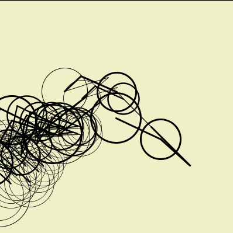

[sketch_2020_10_02c](https://github.com/villares/sketch-a-day/tree/master/2020/sketch_2020_10_02c) [[Py.Processing](https://villares.github.io/como-instalar-o-processing-modo-python/index-EN)]

---

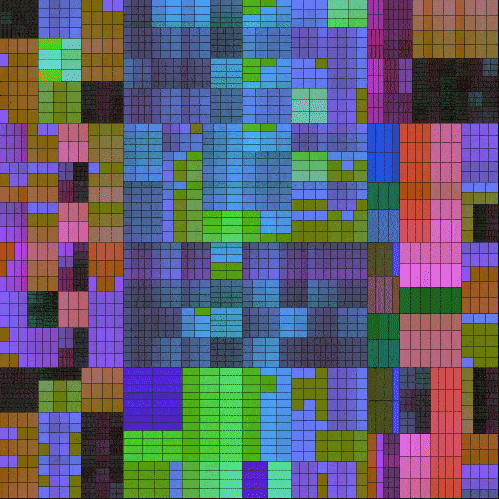

[sketch_2020_10_01a](https://github.com/villares/sketch-a-day/tree/master/2020/sketch_2020_10_01a) [[Py.Processing](https://villares.github.io/como-instalar-o-processing-modo-python/index-EN)]

---


[sketch_2020_09_30a](https://github.com/villares/sketch-a-day/tree/master/2020/sketch_2020_09_30a) [[Py.Processing](https://villares.github.io/como-instalar-o-processing-modo-python/index-EN)]

---

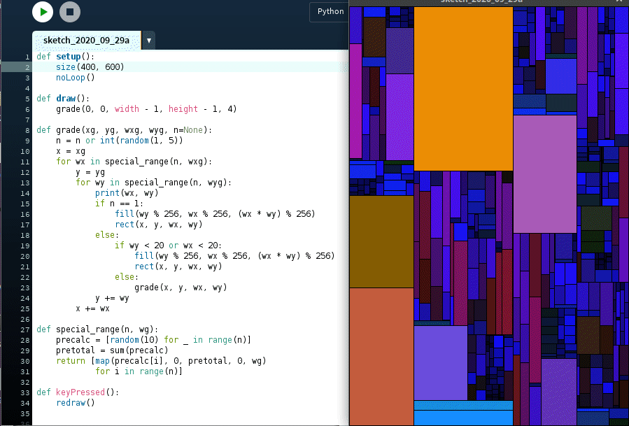

[sketch_2020_09_29a](https://github.com/villares/sketch-a-day/tree/master/2020/sketch_2020_09_29a) [[Py.Processing](https://villares.github.io/como-instalar-o-processing-modo-python/index-EN)]


---

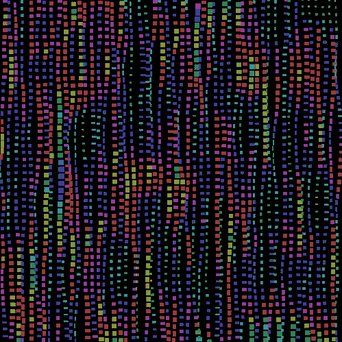

[sketch_2020_09_28a](https://github.com/villares/sketch-a-day/tree/master/2020/sketch_2020_09_28a) [[Py.Processing](https://villares.github.io/como-instalar-o-processing-modo-python/index-EN)]

---


[sketch_2020_09_27a](https://github.com/villares/sketch-a-day/tree/master/2020/sketch_2020_09_27a) [[Py.Processing](https://villares.github.io/como-instalar-o-processing-modo-python/index-EN)]

---

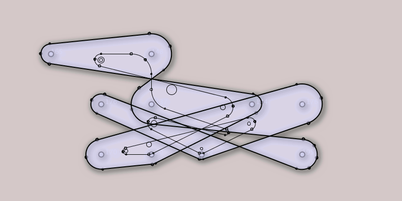

[sketch_2020_09_26a](https://github.com/villares/sketch-a-day/tree/master/2020/sketch_2020_09_26a) [[Py.Processing](https://villares.github.io/como-instalar-o-processing-modo-python/index-EN)]

More at [villares/arc_tangents_and_bezier_studies](https://github.com/villares/arc_tangents_and_bezier_studies)

---

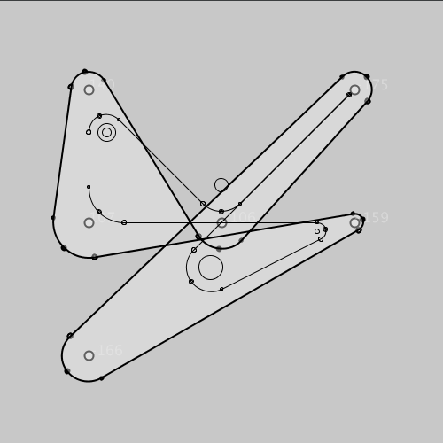

[sketch_2020_09_25a](https://github.com/villares/sketch-a-day/tree/master/2020/sketch_2020_09_25a) [[Py.Processing](https://villares.github.io/como-instalar-o-processing-modo-python/index-EN)]

---

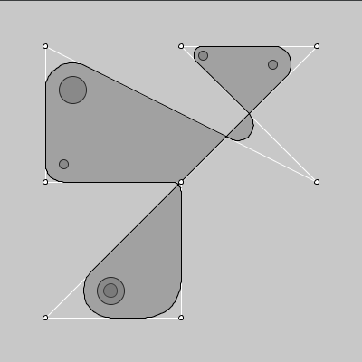

[sketch_2020_09_24a](https://github.com/villares/sketch-a-day/tree/master/2020/sketch_2020_09_24a) [[Py.Processing](https://villares.github.io/como-instalar-o-processing-modo-python/index-EN)]

---

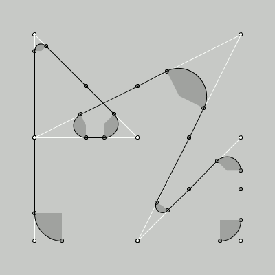

[sketch_2020_09_23a](https://github.com/villares/sketch-a-day/tree/master/2020/sketch_2020_09_23a) [[Py.Processing](https://villares.github.io/como-instalar-o-processing-modo-python/index-EN)]

---

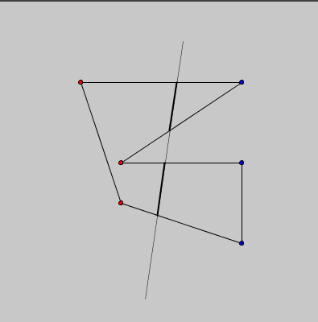

[sketch_2020_09_22a](https://github.com/villares/sketch-a-day/tree/master/2020/sketch_2020_09_22a) [[Py.Processing](https://villares.github.io/como-instalar-o-processing-modo-python/index-EN)]

---

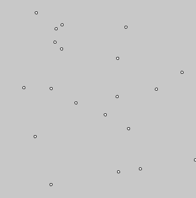

[sketch_2020_09_21a](https://github.com/villares/sketch-a-day/tree/master/2020/sketch_2020_09_21a) [[Py.Processing](https://villares.github.io/como-instalar-o-processing-modo-python/index-EN)]

---

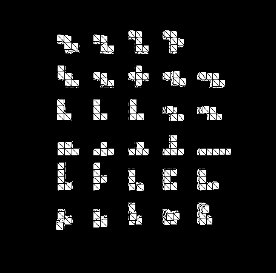

[sketch_2020_09_20polycubes_p5py](https://github.com/villares/sketch-a-day/tree/master/2020/sketch_2020_09_20polycubes_p5py) [[p5py](https://github.com/p5py/p5)]]

A first attempt at p5py with 3D, porting the previous sketch.

---

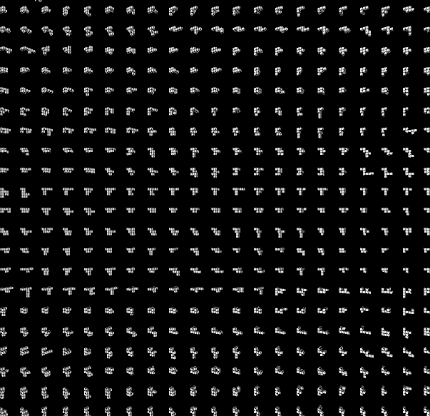

[sketch_2020_09_19polycubes](https://github.com/villares/sketch-a-day/tree/master/2020/sketch_2020_09_19polycubes) [[Py.Processing](https://villares.github.io/como-instalar-o-processing-modo-python/index-EN)]

Tried with the 6922 octacubes.

---

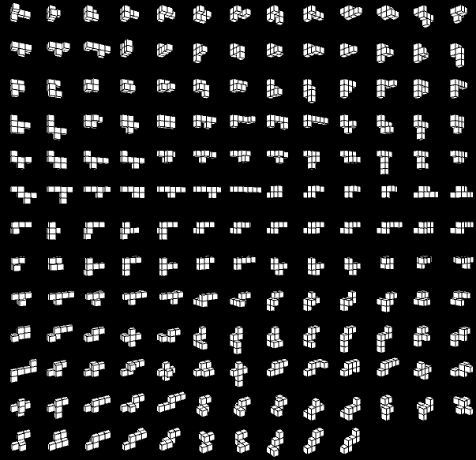

[sketch_2020_09_18polycubes](https://github.com/villares/sketch-a-day/tree/master/2020/sketch_2020_09_18polycubes) [[Py.Processing](https://villares.github.io/como-instalar-o-processing-modo-python/index-EN)]

From polyominoes to polycubes.

---

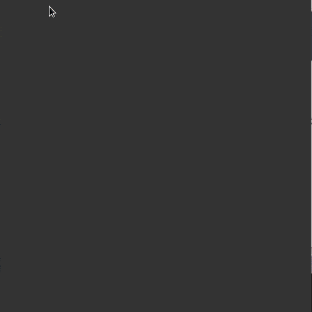

[sketch_2020_09_17deque](https://github.com/villares/sketch-a-day/tree/master/2020/sketch_2020_09_17deque) [[Py.Processing](https://villares.github.io/como-instalar-o-processing-modo-python/index-EN)]

```python

import collections as c;s=255;h=c.deque([(0,0)],s)
def setup():size(s*2,s*2);noStroke();colorMode(3)
def draw():background(51);[(fill(i,s,s,s/2),circle(x,y,i/5))for i, (x, y) in enumerate(h)];h.append(h.popleft())
def mouseDragged():h.append((mouseX,mouseY))#つぶやきProcessing
```

---


[sketch_2020_09_16a_deque_randomwalk](https://github.com/villares/sketch-a-day/tree/master/2020/sketch_2020_09_16a_deque_randomwalk) [[Py.Processing](https://villares.github.io/como-instalar-o-processing-modo-python/index-EN)]

```python
import collections as c;h=256;d=c.deque([PVector()],h);t=translate;R=lambda:int(random(-2,2))*9#つぶやきProcessing
def setup():size(h*2,h*2,P3D);colorMode(3)
def draw():clear();t(h,h);u=d[-1];[(t(*p.sub(u/9)),fill(p.z%h,h,h),box(9),t(*p*-1))for p in d];d.append(u+(R(),R(),R()))

```

---

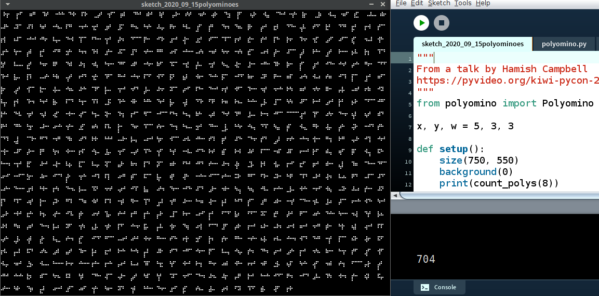

[sketch_2020_09_15polyominoes](https://github.com/villares/sketch-a-day/tree/master/2020/sketch_2020_09_15polyominoes) [[Py.Processing](https://villares.github.io/como-instalar-o-processing-modo-python/index-EN)]

Code from a talk by Hamish Campbell on Kiwi Pycon 2013, I just added some silly drawing code.
https://pyvideo.org/kiwi-pycon-2013/polyominoes-an-exploration-in-problem-solving-w.html

For a clever obfuscated very short ominoe-counter: https://gist.github.com/hamishcampbell/6472043 (sent by Hamish Campbell, @polemic on twitter)

---

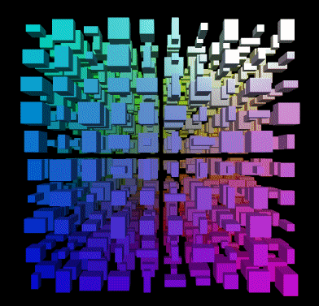

[sketch_2020_09_14vpython](https://github.com/villares/sketch-a-day/tree/master/2020/sketch_2020_09_14vpython) [[VPython](https://vpython.org/)]

Try it online here: https://www.glowscript.org/#/user/villares/folder/MyPrograms/program/boxes

---


[sketch_2020_09_13a](https://github.com/villares/sketch-a-day/tree/master/2020/sketch_2020_09_13a)
[sketch_2020_09_13b](https://github.com/villares/sketch-a-day/tree/master/2020/sketch_2020_09_13b)
 [[Py.Processing](https://villares.github.io/como-instalar-o-processing-modo-python/index-EN)]

```
V=PVector;t=translate;w=512;m=256;l=[V()];c=1e2
def setup():size(w,w,P3D)
def draw():u=l[-1];M=lambda m:5-5*(int(noise(m+len(l)/c)*c)%3);clear();t(*[m]*3);rotateX(len(l)/c);[(fill(c+b.x%c,c+b.y%c,c+b.x%c),t(*b),box(5),t(*b*-1),b.sub(u/9))for b in l];l[:]+=[u+V(M(1),M(2),M(3))]
```

```python
V=PVector;t=translate;w=512;m=256;l=[V()];c=1e2
def setup():size(w,w,P3D)
def draw():u=l[-1];M=lambda r:[-5+5*(int(noise(m+b.magSq()/w)*c)%r)for m in range(3)];clear();t(*[m]*3);rotateX(len(l)/c);[(fill(*M(52)),t(*b),box(5),t(*b*-1),b.sub(u/9))for b in l];l[:]+=[u+M(3)]
```

---

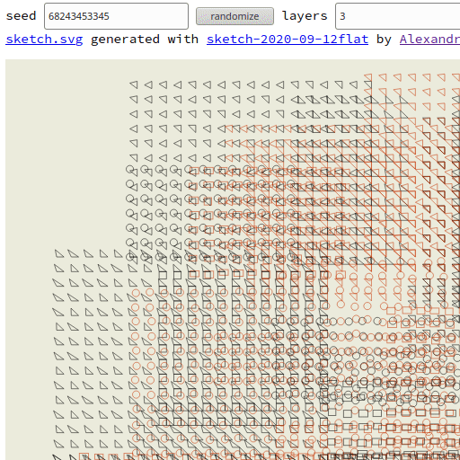

[sketch_2020_09_12flat](https://github.com/villares/sketch-a-day/tree/master/2020/sketch_2020_09_12flat) [[Python + flat](https://xxyxyz.org/flat)]

---

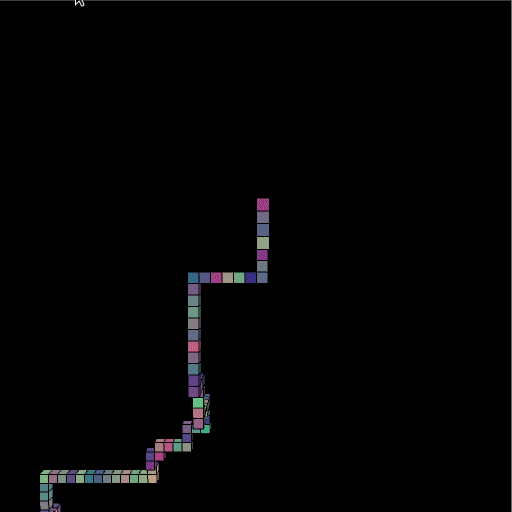

[sketch_2020_09_11a](https://github.com/villares/sketch-a-day/tree/master/2020/sketch_2020_09_11a) [[Py.Processing](https://villares.github.io/como-instalar-o-processing-modo-python/index-EN)]

---

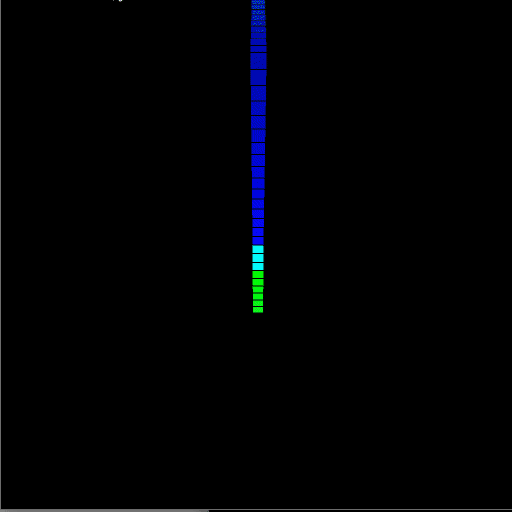

[sketch_2020_09_10a](https://github.com/villares/sketch-a-day/tree/master/2020/sketch_2020_09_10a) [[Py.Processing](https://villares.github.io/como-instalar-o-processing-modo-python/index-EN)]

---


[sketch_2020_09_09_walker3D](https://github.com/villares/sketch-a-day/tree/master/2020/sketch_2020_09_09_walker3D) [[Py.Processing](https://villares.github.io/como-instalar-o-processing-modo-python/index-EN)]

---

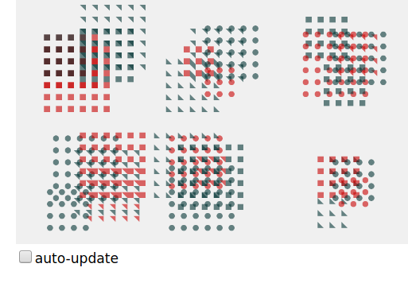

[sketch_2020_09_08pyp5js](https://github.com/villares/sketch-a-day/tree/master/2020/sketch_2020_09_08pyp5js) [[pyp5js](https://berinhard.github.io/pyp5js)]

[Check the sketch online!](https://abav.lugaralgum.com/sketch-a-day/2020/sketch_2020_09_08pyp5js/)

---

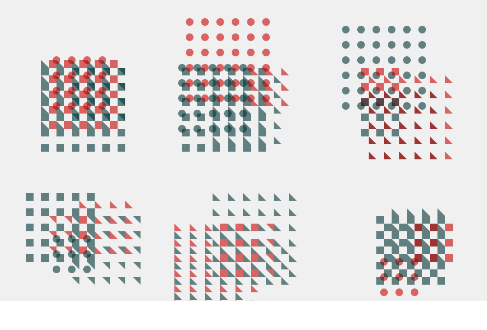

[sketch_2020_09_07pyp5js](https://github.com/villares/sketch-a-day/tree/master/2020/sketch_2020_09_07pyp5js) [[pyp5js](https://berinhard.github.io/pyp5js)]

[Check the sketch online!](https://abav.lugaralgum.com/sketch-a-day/2020/sketch_2020_09_07pyp5js/)

---

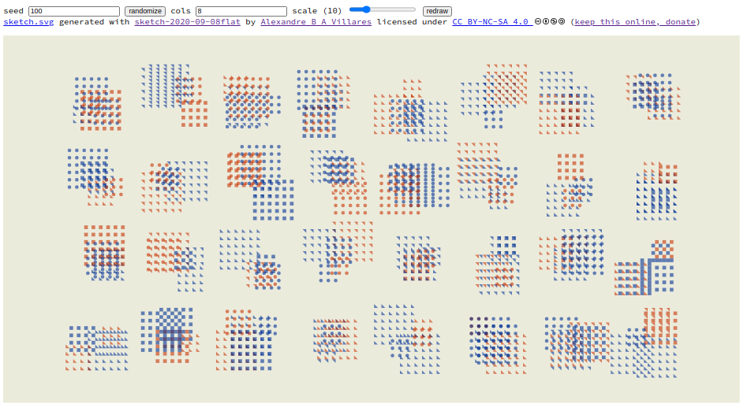

[sketch_2020_09_06flat](https://github.com/villares/sketch-a-day/tree/master/2020/sketch_2020_09_06flat) [[Python + flat](https://xxyxyz.org/flat)]

---


[sketch_2020_09_05flat](https://github.com/villares/sketch-a-day/tree/master/2020/sketch_2020_09_05flat) [[Python + flat](https://xxyxyz.org/flat)]

This one, with lots of help from Marco Macarena, adds some HTML input.

Check it out at https://sketch-2020-09-05flat.glitch.me/?colunas=8&seed=10&sf=12

---


[sketch_2020_09_04sliders](https://github.com/villares/sketch-a-day/tree/master/2020/sketch_2020_09_04sliders) [[Py.Processing](https://villares.github.io/como-instalar-o-processing-modo-python/index-EN)]

Fiddling with ControlP5, a Processing lib for GUI, but on Python mode.

---


[sketch_2020_09_03flat](https://github.com/villares/sketch-a-day/tree/master/2020/sketch_2020_09_03flat) [[Python + flat](https://xxyxyz.org/flat)]

My first glitch.com based sketch, visit https://sketch-2020-09-03a.glitch.me/ for new grids!
The base for this "glitch" is a fork of (@aparrish) Allison Parrish's amazing example using Flat + Bezmerizing to draw SVG.

I'm using a bizarre set of functions in flat_processing.py to make flat look like Processing Python mode I'm more used to.

---


[sketch_2020_09_02flat](https://github.com/villares/sketch-a-day/tree/master/2020/sketch_2020_09_02flat) [[Python + flat](https://xxyxyz.org/flat)]

---


[sketch_2020_09_01flat](https://github.com/villares/sketch-a-day/tree/master/2020/sketch_2020_09_01flat) [[Python + flat](https://xxyxyz.org/flat)]

---


[sketch_2020_08_31flat](https://github.com/villares/sketch-a-day/tree/master/2020/sketch_2020_08_31flat) [[Python + flat](https://xxyxyz.org/flat)]


---


[sketch_2020_08_30flat](https://github.com/villares/sketch-a-day/tree/master/2020/sketch_2020_08_30flat) [[Python + flat](https://xxyxyz.org/flat)]

---

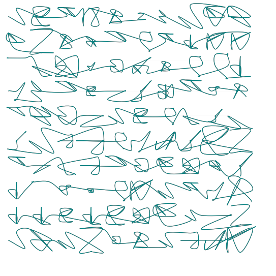

[sketch_2020_08_29flat](https://github.com/villares/sketch-a-day/tree/master/2020/sketch_2020_08_29flat)[[Python + flat](https://xxyxyz.org/flat)]

---


[sketch_2020_08_28d](https://github.com/villares/sketch-a-day/tree/master/2020/sketch_2020_08_28d) [[Py.Processing](https://villares.github.io/como-instalar-o-processing-modo-python/index-EN)]

---


[sketch_2020_08_27fib](https://github.com/villares/sketch-a-day/tree/master/2020/sketch_2020_08_27fib) [[Py.Processing](https://villares.github.io/como-instalar-o-processing-modo-python/index-EN)]

---


[sketch_2020_08_26a](https://github.com/villares/sketch-a-day/tree/master/2020/sketch_2020_08_26a) [[Py.Processing](https://villares.github.io/como-instalar-o-processing-modo-python/index-EN)]

---


[sketch_2020_08_25c](https://github.com/villares/sketch-a-day/tree/master/2020/sketch_2020_08_25c) [[Py.Processing](https://villares.github.io/como-instalar-o-processing-modo-python/index-EN)]


And there is a looping version posted as #つぶやきProcessing:

<blockquote class="twitter-tweet"><p lang="ht" dir="ltr"><a href="https://twitter.com/hashtag/%E3%81%A4%E3%81%B6%E3%82%84%E3%81%8DProcessing?src=hash&amp;ref_src=twsrc%5Etfw">#つぶやきProcessing</a> <a href="https://twitter.com/hashtag/Python?src=hash&amp;ref_src=twsrc%5Etfw">#Python</a><br>w,h = 500,250<br>def setup():size(w,w)<br>def draw():<br> fill(0,0,200,8)<br> rect(0,0,w,w)<br> translate(h,h)<br> a,k=0,sin(frameCount/12.)<br> while a&lt;TWO_PI:<br> i,j=w+sin(a),h+cos(a)<br> n=noise(i,j,k)<br> x,y=n*h*sin(a),n*h*cos(a)<br> point(x,y)<br> a+=.01 <a href="https://t.co/zNIfWNHOvo">pic.twitter.com/zNIfWNHOvo</a></p>&mdash; Alexandre B A Villares☂ (@villares) <a href="https://twitter.com/villares/status/1298270635940966400?ref_src=twsrc%5Etfw">August 25, 2020</a></blockquote> <script async src="https://platform.twitter.com/widgets.js" charset="utf-8"></script> 

---

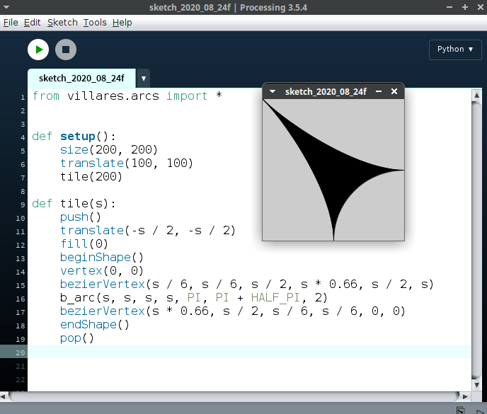

[sketch_2020_08_24f](https://github.com/villares/sketch-a-day/tree/master/2020/sketch_2020_08_24f) [[Py.Processing](https://villares.github.io/como-instalar-o-processing-modo-python/index-EN)]

---

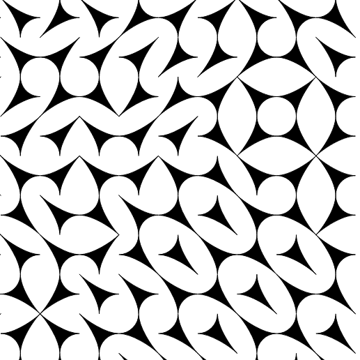

[sketch_2020_08_23d](https://github.com/villares/sketch-a-day/tree/master/2020/sketch_2020_08_23d) [[p5js](https://p5js.org)]

Based on work by Carlos [@vamoss](https://www.openprocessing.org/user/65884) in homage to one the first Brazilian Designers:
Eduardo Lopes, inspired by his work shown in this paper from 1971, https://www.scielo.br/scielo.php?script=sci_arttext&pid=S0034-75901971000100008&lang=pt

---

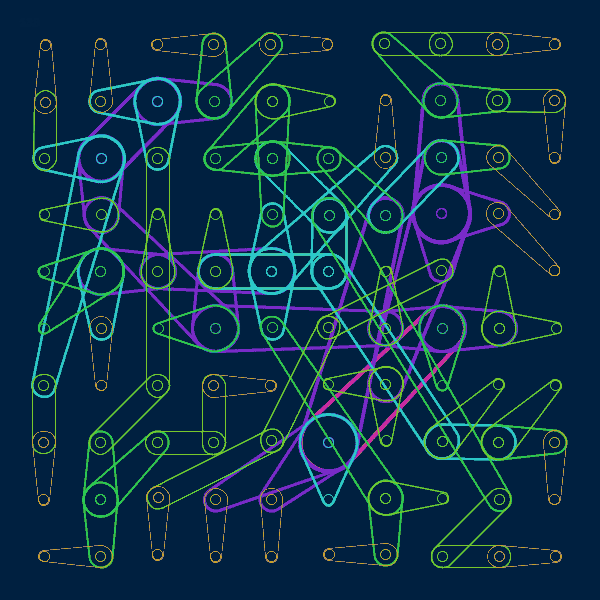

[sketch_2020_08_22a](https://github.com/villares/sketch-a-day/tree/master/2020/sketch_2020_08_22a) [[Py.Processing](https://villares.github.io/como-instalar-o-processing-modo-python/index-EN)]

---


[sketch_2020_08_21a](https://github.com/villares/sketch-a-day/tree/master/2020/sketch_2020_08_21a) [[Py.Processing](https://villares.github.io/como-instalar-o-processing-modo-python/index-EN)]

---

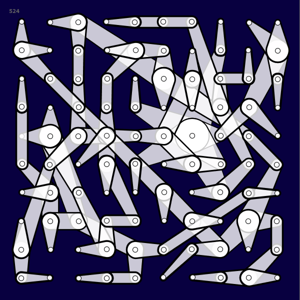

[sketch_2020_08_20a](https://github.com/villares/sketch-a-day/tree/master/2020/sketch_2020_08_20a) [[Py.Processing](https://villares.github.io/como-instalar-o-processing-modo-python/index-EN)]

---

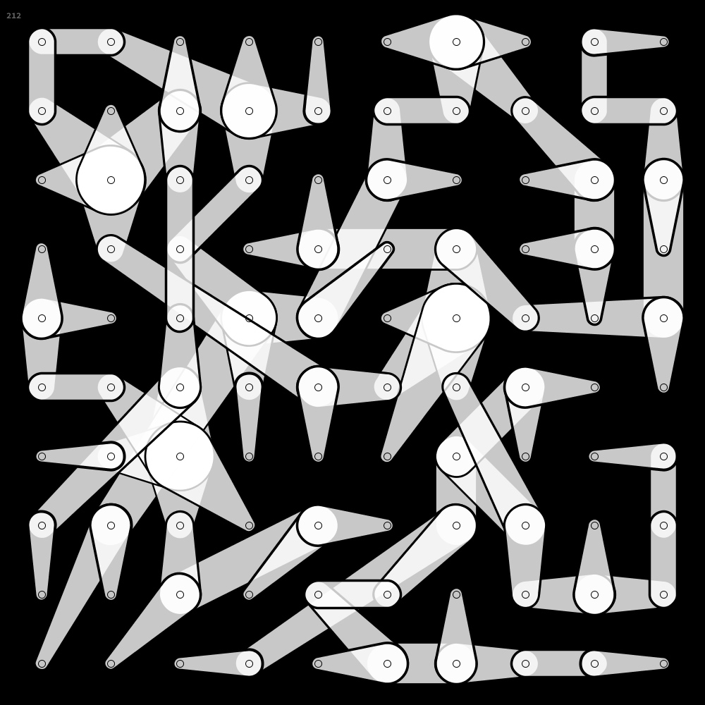

[sketch_2020_08_19b](https://github.com/villares/sketch-a-day/tree/master/2020/sketch_2020_08_19b) [[Py.Processing](https://villares.github.io/como-instalar-o-processing-modo-python/index-EN)]

---

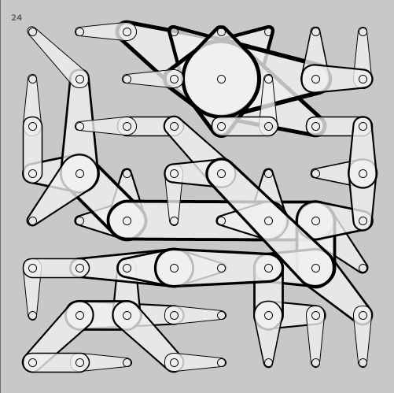

[sketch_2020_08_18a](https://github.com/villares/sketch-a-day/tree/master/2020/sketch_2020_08_18a) [[Py.Processing](https://villares.github.io/como-instalar-o-processing-modo-python/index-EN)]

---

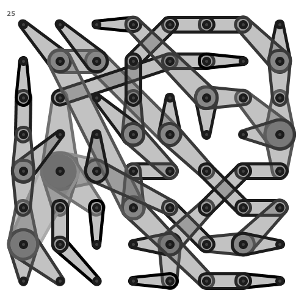

[sketch_2020_08_17a](https://github.com/villares/sketch-a-day/tree/master/2020/sketch_2020_08_17a) [[Py.Processing](https://villares.github.io/como-instalar-o-processing-modo-python/index-EN)]

---

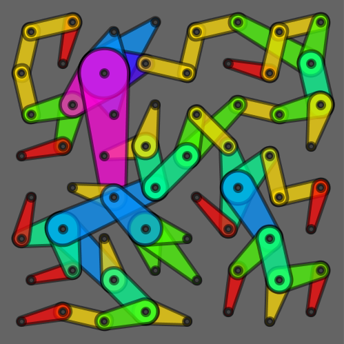

[sketch_2020_08_16a](https://github.com/villares/sketch-a-day/tree/master/2020/sketch_2020_08_16a) [[Py.Processing](https://villares.github.io/como-instalar-o-processing-modo-python/index-EN)]

---


[sketch_2020_08_15a](https://github.com/villares/sketch-a-day/tree/master/2020/sketch_2020_08_15a) [[Py.Processing](https://villares.github.io/como-instalar-o-processing-modo-python/index-EN)]

Added a method to the graph object to detect cycles, now I can have non-cycling graphs!
(I removed the  offscreen buffer viz code) 

---

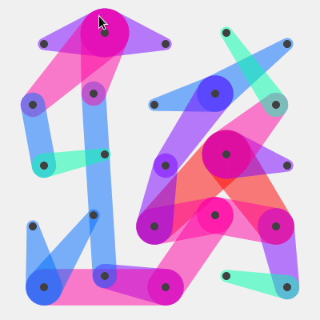

[sketch_2020_08_14a](https://github.com/villares/sketch-a-day/tree/master/2020/sketch_2020_08_14a) [[Py.Processing](https://villares.github.io/como-instalar-o-processing-modo-python/index-EN)]

Drag to swap nodes!

---

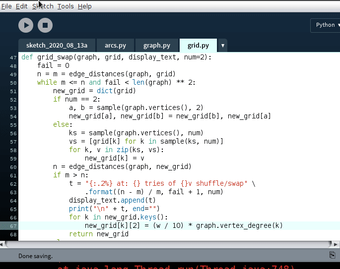

[sketch_2020_08_13a](https://github.com/villares/sketch-a-day/tree/master/2020/sketch_2020_08_13a) [[Py.Processing](https://villares.github.io/como-instalar-o-processing-modo-python/index-EN)]

Now diameters are proportional to the number of connections (vertex degree)

---

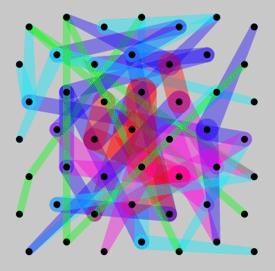

[sketch_2020_08_12a](https://github.com/villares/sketch-a-day/tree/master/2020/sketch_2020_08_12a) [[Py.Processing](https://villares.github.io/como-instalar-o-processing-modo-python/index-EN)]

Still somewhat broken, but I'm very happy with adding my "var bars"

---

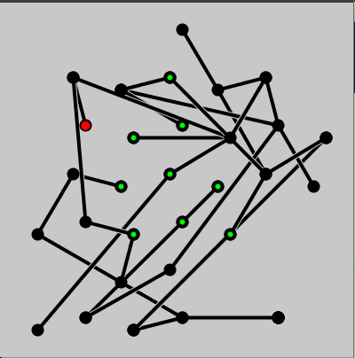

[sketch_2020_08_11b](https://github.com/villares/sketch-a-day/tree/master/2020/sketch_2020_08_11b) [[Py.Processing](https://villares.github.io/como-instalar-o-processing-modo-python/index-EN)]

Very broken! The neighbourhood thing is a mess, and now loses grid-points on shuffle.

---

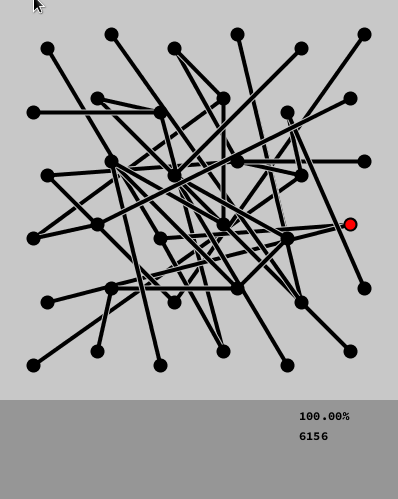

[sketch_2020_08_10b](https://github.com/villares/sketch-a-day/tree/master/2020/sketch_2020_08_10b) [[Py.Processing](https://villares.github.io/como-instalar-o-processing-modo-python/index-EN)]

Nice drawing from the thread on a offscreen buffer!

---

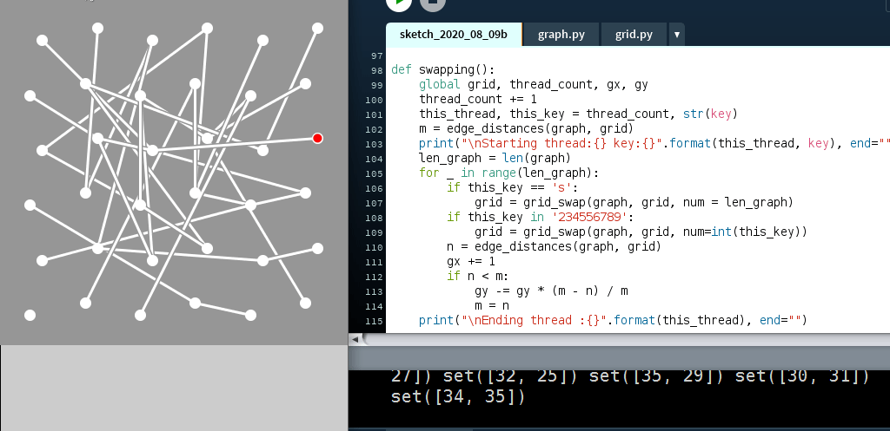

[sketch_2020_08_09a](https://github.com/villares/sketch-a-day/tree/master/2020/sketch_2020_08_09a) | 
[sketch_2020_08_09b](https://github.com/villares/sketch-a-day/tree/master/2020/sketch_2020_08_09b)

[[Py.Processing](https://villares.github.io/como-instalar-o-processing-modo-python/index-EN)]

---

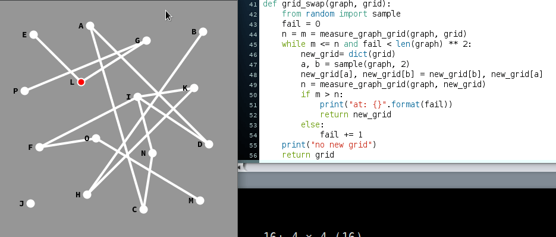

[sketch_2020_08_08a](https://github.com/villares/sketch-a-day/tree/master/2020/sketch_2020_08_08a) [[Py.Processing](https://villares.github.io/como-instalar-o-processing-modo-python/index-EN)]

---

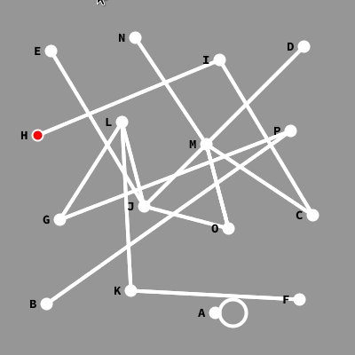

[sketch_2020_08_07a](https://github.com/villares/sketch-a-day/tree/master/2020/sketch_2020_08_07a) [[Py.Processing](https://villares.github.io/como-instalar-o-processing-modo-python/index-EN)]

---

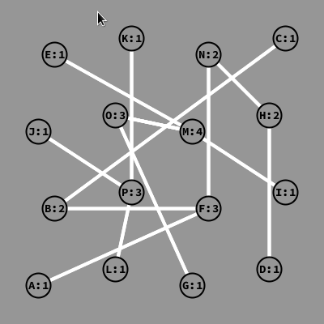

[sketch_2020_08_05a](https://github.com/villares/sketch-a-day/tree/master/2020/sketch_2020_08_05a) [[Py.Processing](https://villares.github.io/como-instalar-o-processing-modo-python/index-EN)]

---

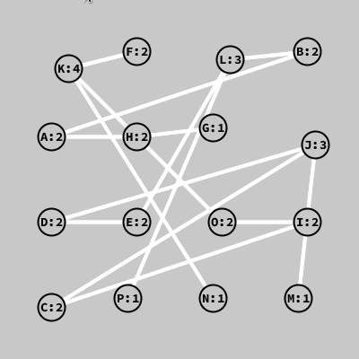

[sketch_2020_08_04a](https://github.com/villares/sketch-a-day/tree/master/2020/sketch_2020_08_04a) [[Py.Processing](https://villares.github.io/como-instalar-o-processing-modo-python/index-EN)]

---

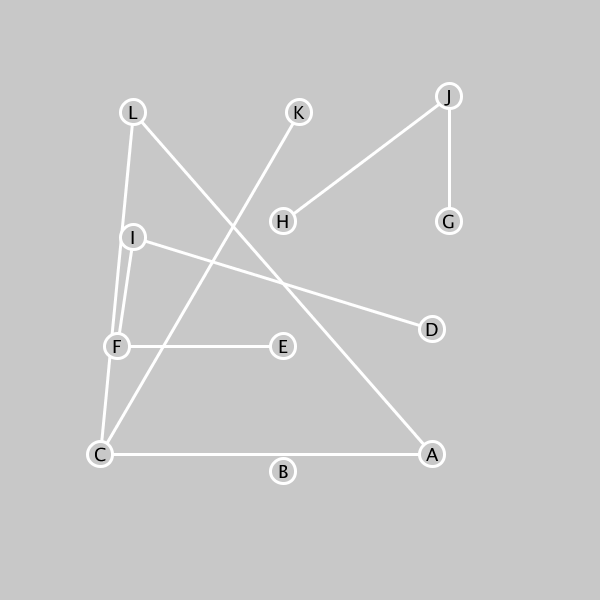

[sketch_2020_08_03a](https://github.com/villares/sketch-a-day/tree/master/2020/sketch_2020_08_03a) [[Py.Processing](https://villares.github.io/como-instalar-o-processing-modo-python/index-EN)]

---


[sketch_2020_08_02e](https://github.com/villares/sketch-a-day/tree/master/2020/sketch_2020_08_02e) [[Py.Processing](https://villares.github.io/como-instalar-o-processing-modo-python/index-EN)]

---

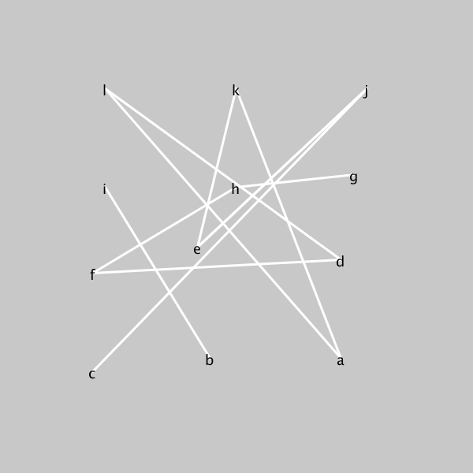

[sketch_2020_08_01a](https://github.com/villares/sketch-a-day/tree/master/2020/sketch_2020_08_01a) [[Py.Processing](https://villares.github.io/como-instalar-o-processing-modo-python/index-EN)]

---


[sketch_2020_07_31a](https://github.com/villares/sketch-a-day/tree/master/2020/sketch_2020_07_31a) [[Py.Processing](https://villares.github.io/como-instalar-o-processing-modo-python/index-EN)]

Combining a very rudimentary particle system with a force from the average "optical flow" vector from OpenCV.

---


[sketch_2020_07_30d](https://github.com/villares/sketch-a-day/tree/master/2020/sketch_2020_07_30d) [[Py.Processing](https://villares.github.io/como-instalar-o-processing-modo-python/index-EN)]

Porting to Python and making a minimal "optical flow" OpenCV example

---


[sketch_2020_07_29b](https://github.com/villares/sketch-a-day/tree/master/2020/sketch_2020_07_29b) [[Py.Processing](https://villares.github.io/como-instalar-o-processing-modo-python/index-EN)]

Still playing with a "frame difference" Video Capture example from the standard Video library.

---


[sketch_2020_07_28b](https://github.com/villares/sketch-a-day/tree/master/2020/sketch_2020_07_28b) [[Py.Processing](https://villares.github.io/como-instalar-o-processing-modo-python/index-EN)]

Playing with a "frame difference" Video Capture example from the standard Video library (porting to Python mode as usual).

---

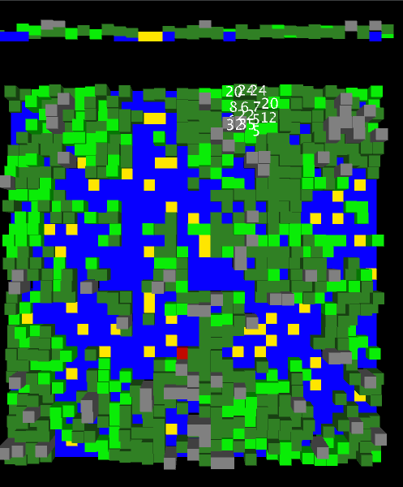

[sketch_2020_07_27c](https://github.com/villares/sketch-a-day/tree/master/2020/sketch_2020_07_27c) [[Py.Processing](https://villares.github.io/como-instalar-o-processing-modo-python/index-EN)]

Took a step back and placed boxes (to make it easier to see the section view on top)

---

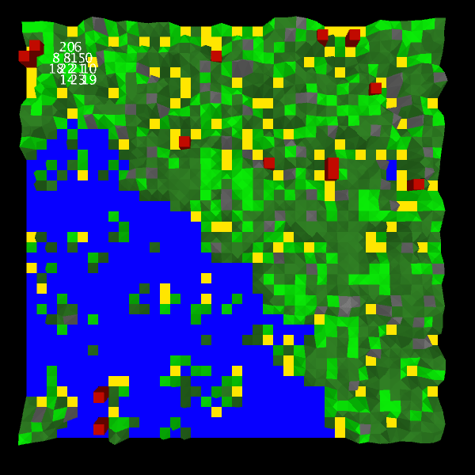

[sketch_2020_07_26c](https://github.com/villares/sketch-a-day/tree/master/2020/sketch_2020_07_26c) [[Py.Processing](https://villares.github.io/como-instalar-o-processing-modo-python/index-EN)]

Fiddling with the probability dictionary for map generation.

---


[sketch_2020_07_25c](https://github.com/villares/sketch-a-day/tree/master/2020/sketch_2020_07_25c) [[Py.Processing](https://villares.github.io/como-instalar-o-processing-modo-python/index-EN)]

---

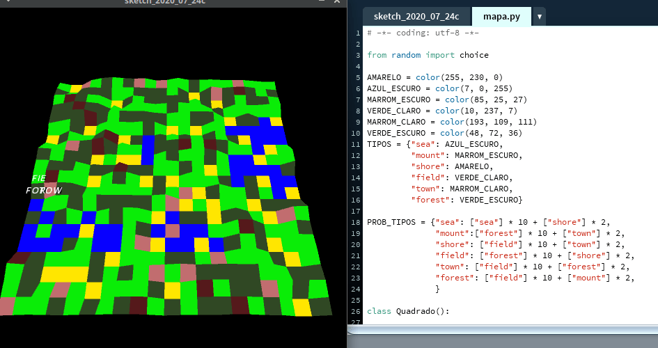

[sketch_2020_07_24c](https://github.com/villares/sketch-a-day/tree/master/2020/sketch_2020_07_24c) [[Py.Processing](https://villares.github.io/como-instalar-o-processing-modo-python/index-EN)]

---

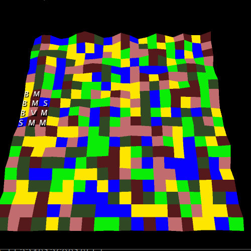

[sketch_2020_07_23c](https://github.com/villares/sketch-a-day/tree/master/2020/sketch_2020_07_23c) [[Py.Processing](https://villares.github.io/como-instalar-o-processing-modo-python/index-EN)]

Added nice triangles going to the average heights of square corners.

---


[sketch_2020_07_22c](https://github.com/villares/sketch-a-day/tree/master/2020/sketch_2020_07_22c) [[Py.Processing](https://villares.github.io/como-instalar-o-processing-modo-python/index-EN)]

Refactoring ugly and old code.

---

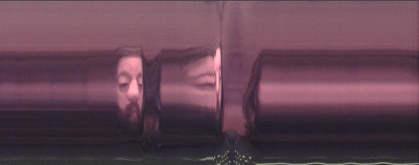

[sketch_2020_07_21f](https://github.com/villares/sketch-a-day/tree/master/2020/sketch_2020_07_21f) [[Py.Processing](https://villares.github.io/como-instalar-o-processing-modo-python/index-EN)]

Porting Video Capture examples to Python Mode (from the standard Processing Video)

---


[sketch_2020_07_20e](https://github.com/villares/sketch-a-day/tree/master/2020/sketch_2020_07_20e) [[Py.Processing](https://villares.github.io/como-instalar-o-processing-modo-python/index-EN)]

Porting Video Capture examples to Python Mode (from the standard Processing Video)

---


[sketch_2020_07_19b](https://github.com/villares/sketch-a-day/tree/master/2020/sketch_2020_07_19b) [[Py.Processing](https://villares.github.io/como-instalar-o-processing-modo-python/index-EN)]

Added some gravity (particle-particle atraction) but I'm not really pleased.

---

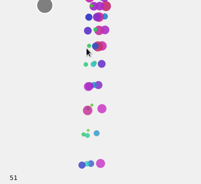

[sketch_2020_07_18b](https://github.com/villares/sketch-a-day/tree/master/2020/sketch_2020_07_18b) [[Py.Processing](https://villares.github.io/como-instalar-o-processing-modo-python/index-EN)]

I ported a Khan Academy version of a Nature of Code example to [p5js here](https://www.openprocessing.org/sketch/933835) and then to Python mode.

---

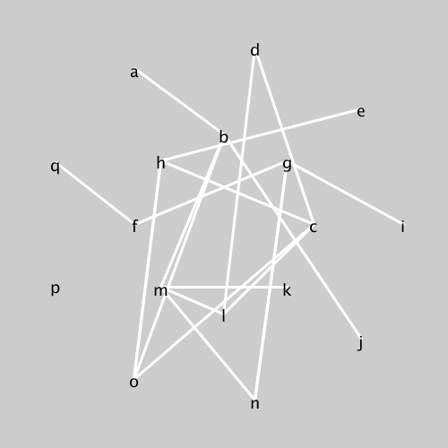

[sketch_2020_07_16a](https://github.com/villares/sketch-a-day/tree/master/2020/sketch_2020_07_16a) [[Py.Processing](https://villares.github.io/como-instalar-o-processing-modo-python/index-EN)]

---

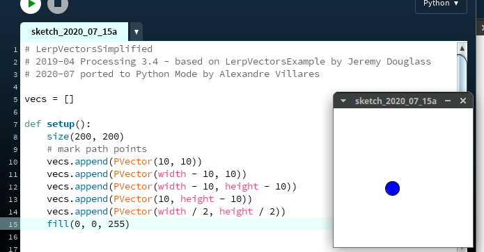

[sketch_2020_07_15a](https://github.com/villares/sketch-a-day/tree/master/2020/sketch_2020_07_15a) [[Py.Processing](https://villares.github.io/como-instalar-o-processing-modo-python/index-EN)]

Porting a Jeremy Douglass example to Python mode. I want to use this with "graph walking" latter on.

---

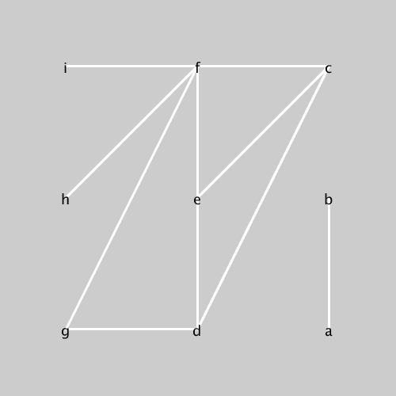
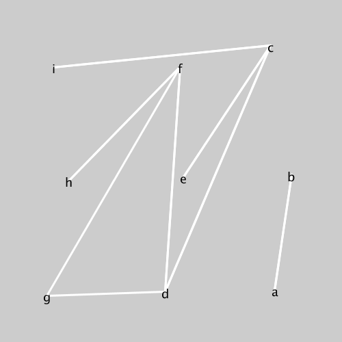
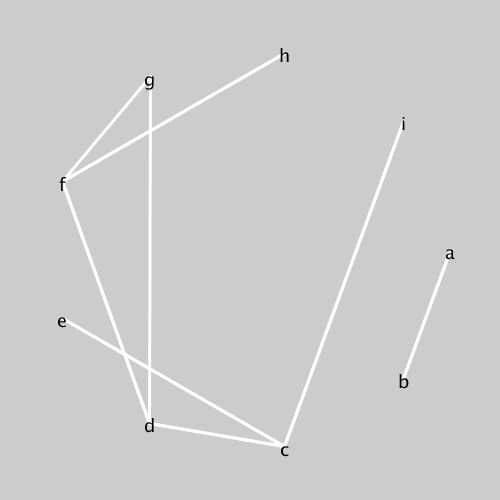

[sketch_2020_07_14a](https://github.com/villares/sketch-a-day/tree/master/2020/sketch_2020_07_14a) | [sketch_2020_07_14b](https://github.com/villares/sketch-a-day/tree/master/2020/sketch_2020_07_14b) | [sketch_2020_07_14c](https://github.com/villares/sketch-a-day/tree/master/2020/sketch_2020_07_14c) [[Py.Processing](https://villares.github.io/como-instalar-o-processing-modo-python/index-EN)]

Trying to visualize a graph with a naïve implementation.

---


[sketch_2020_07_13a](https://github.com/villares/sketch-a-day/tree/master/2020/sketch_2020_07_13a) [[Py.Processing](https://villares.github.io/como-instalar-o-processing-modo-python/index-EN)]

---


[sketch_2020_07_12a](https://github.com/villares/sketch-a-day/tree/master/2020/sketch_2020_07_12a) [[Py.Processing](https://villares.github.io/como-instalar-o-processing-modo-python/index-EN)]

---

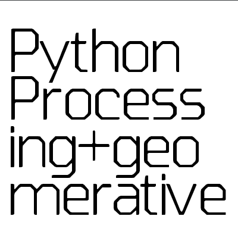

[sketch_2020_07_11a](https://github.com/villares/sketch-a-day/tree/master/2020/sketch_2020_07_11a) [[Py.Processing](https://villares.github.io/como-instalar-o-processing-modo-python/index-EN)]

---

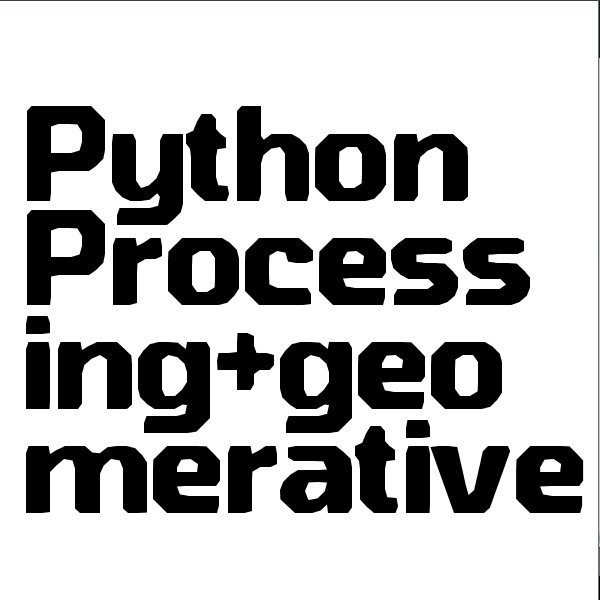

[sketch_2020_07_10a](https://github.com/villares/sketch-a-day/tree/master/2020/sketch_2020_07_10a) [[Py.Processing](https://villares.github.io/como-instalar-o-processing-modo-python/index-EN)]

Based on work by André Burnier, ported from Processing 
to Python by Thiago Bellotti and Alexandre Villares.
Playing with the Tomorrow font by Tony de Marco e Monica Rizzolli.
Using *geomerative*, a library by Ricard Marxer.

---


[sketch_2020_07_09a](https://github.com/villares/sketch-a-day/tree/master/2020/sketch_2020_07_09a) [[Py.Processing](https://villares.github.io/como-instalar-o-processing-modo-python/index-EN)]

---

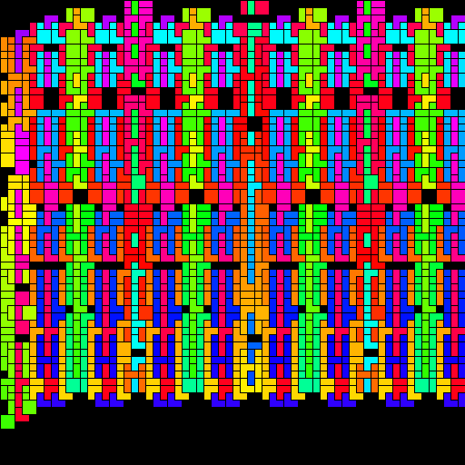

[sketch_2020_07_08a](https://github.com/villares/sketch-a-day/tree/master/2020/sketch_2020_07_08a) [[Py.Processing](https://villares.github.io/como-instalar-o-processing-modo-python/index-EN)]

---


[sketch_2020_07_07a](https://github.com/villares/sketch-a-day/tree/master/2020/sketch_2020_07_07a) [[Py.Processing](https://villares.github.io/como-instalar-o-processing-modo-python/index-EN)]

---

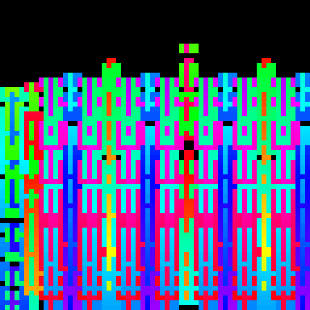

[sketch_2020_07_06a](https://github.com/villares/sketch-a-day/tree/master/2020/sketch_2020_07_06a) [[Py.Processing](https://villares.github.io/como-instalar-o-processing-modo-python/index-EN)]

---

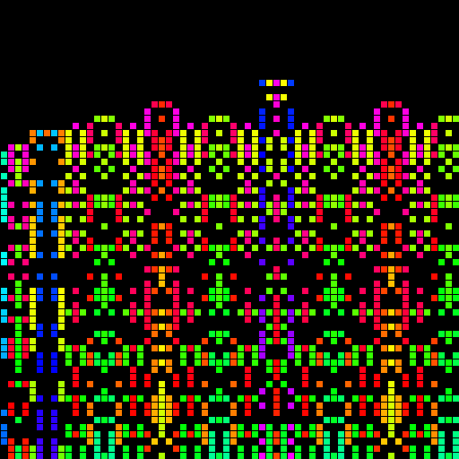

[sketch_2020_07_05a](https://github.com/villares/sketch-a-day/tree/master/2020/sketch_2020_07_05a) [[Py.Processing](https://villares.github.io/como-instalar-o-processing-modo-python/index-EN)]

---

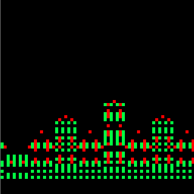

[sketch_2020_07_04a](https://github.com/villares/sketch-a-day/tree/master/2020/sketch_2020_07_04a) [[Py.Processing](https://villares.github.io/como-instalar-o-processing-modo-python/index-EN)]

---


[sketch_2020_07_03a](https://github.com/villares/sketch-a-day/tree/master/2020/sketch_2020_07_03a) [[Py.Processing](https://villares.github.io/como-instalar-o-processing-modo-python/index-EN)]

---


[sketch_2020_07_02a](https://github.com/villares/sketch-a-day/tree/master/2020/sketch_2020_07_02a) [[Py.Processing](https://villares.github.io/como-instalar-o-processing-modo-python/index-EN)]

---

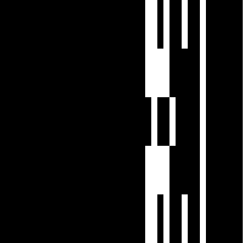

[sketch_2020_06_30a](https://github.com/villares/sketch-a-day/tree/master/2020/sketch_2020_06_30a) [[Py.Processing](https://villares.github.io/como-instalar-o-processing-modo-python/index-EN)]

---

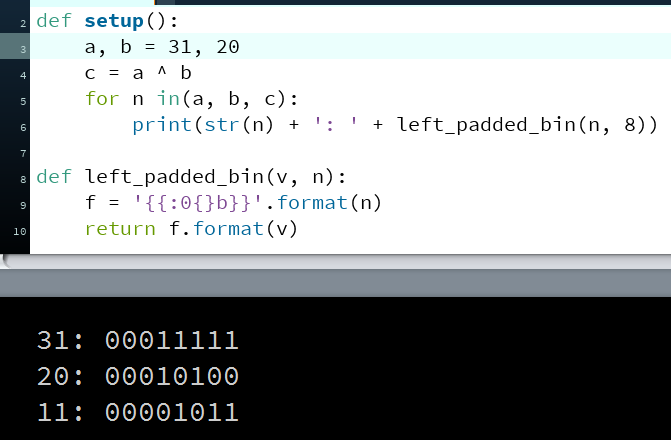

[sketch_2020_06_29a](https://github.com/villares/sketch-a-day/tree/master/2020/sketch_2020_06_29a) [[Py.Processing](https://villares.github.io/como-instalar-o-processing-modo-python/index-EN)]

---

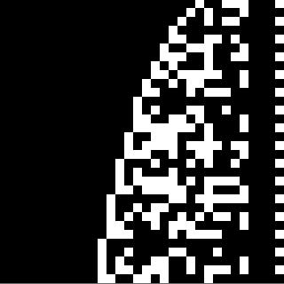

[sketch_2020_06_28a](https://github.com/villares/sketch-a-day/tree/master/2020/sketch_2020_06_28a) [[Py.Processing](https://villares.github.io/como-instalar-o-processing-modo-python/index-EN)]

---

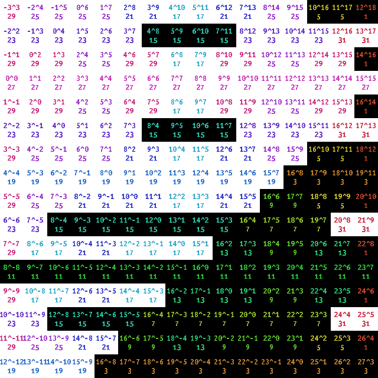

[sketch_2020_06_27a](https://github.com/villares/sketch-a-day/tree/master/2020/sketch_2020_06_27a) [[Py.Processing](https://villares.github.io/como-instalar-o-processing-modo-python/index-EN)]

---

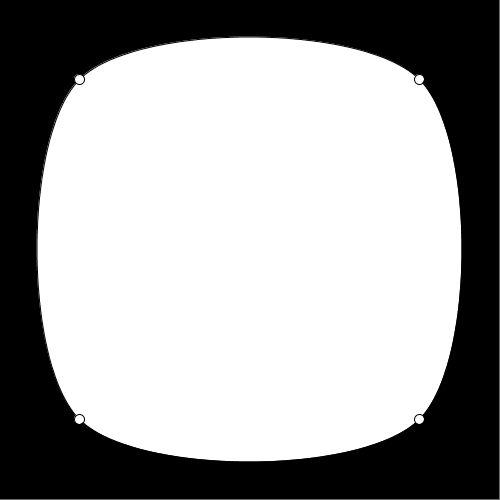

[sketch_2020_06_26a](https://github.com/villares/sketch-a-day/tree/master/2020/sketch_2020_06_26a) [[Py.Processing](https://villares.github.io/como-instalar-o-processing-modo-python/index-EN)]

---


[sketch_2020_06_25b](https://github.com/villares/sketch-a-day/tree/master/2020/sketch_2020_06_25b) [[Py.Processing](https://villares.github.io/como-instalar-o-processing-modo-python/index-EN)]

---


[sketch_2020_06_24a](https://github.com/villares/sketch-a-day/tree/master/2020/sketch_2020_06_24a) [[Py.Processing](https://villares.github.io/como-instalar-o-processing-modo-python/index-EN)]

---


[sketch_2020_06_23a](https://github.com/villares/sketch-a-day/tree/master/2020/sketch_2020_06_23a) [[Py.Processing](https://villares.github.io/como-instalar-o-processing-modo-python/index-EN)]

---

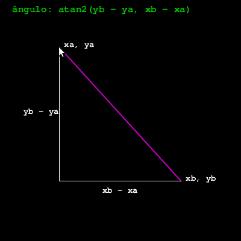

[sketch_2020_06_21c](https://github.com/villares/sketch-a-day/tree/master/2020/sketch_2020_06_21c) [[Py.Processing](https://villares.github.io/como-instalar-o-processing-modo-python/index-EN)]

Animation for teaching `atan2()` in [material-aulas](github.com/villares/material-aulas)

---

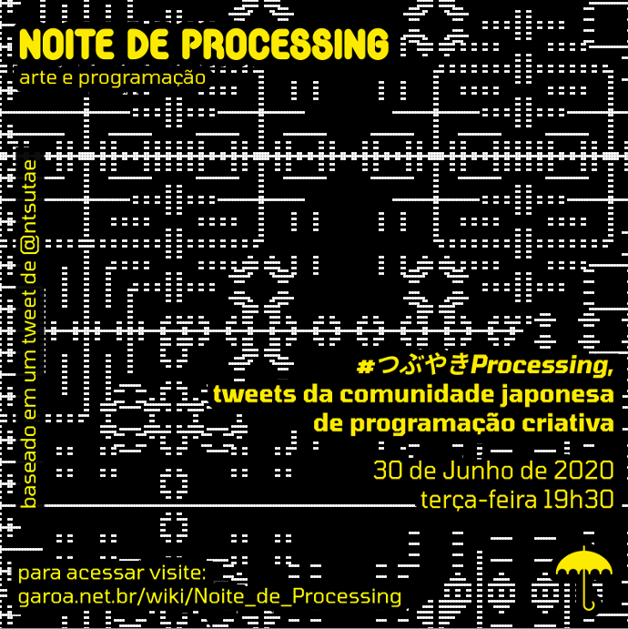

[sketch_2020_06_20a](https://github.com/villares/sketch-a-day/tree/master/2020/sketch_2020_06_20a) [[Py.Processing](https://villares.github.io/como-instalar-o-processing-modo-python/index-EN)]

Invitation for [Noite de Processing](https://garoa.net.br/wiki/Noite_de_Processing) :)

---


[sketch_2020_06_19a](https://github.com/villares/sketch-a-day/tree/master/2020/sketch_2020_06_19a) [[Py.Processing](https://villares.github.io/como-instalar-o-processing-modo-python/index-EN)]

Animation for teaching an alternative to `input()` in [material-aulas](github.com/villares/material-aulas)

```python
def input(message=''):
    from javax.swing import JOptionPane
    return JOptionPane.showInputDialog(frame, message)
```

---

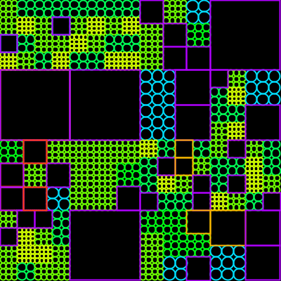

[sketch_2020_06_18a](https://github.com/villares/sketch-a-day/tree/master/2020/sketch_2020_06_18a) [[Py.Processing](https://villares.github.io/como-instalar-o-processing-modo-python/index-EN)]

---

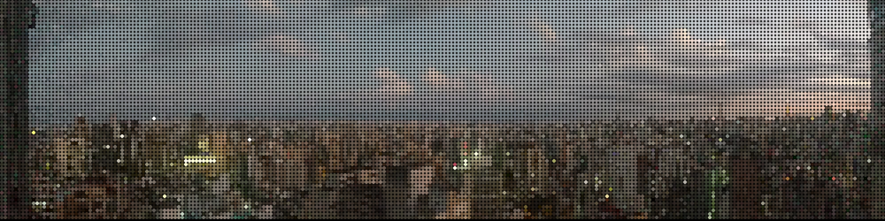

[sketch_2020_06_17a](https://github.com/villares/sketch-a-day/tree/master/2020/sketch_2020_06_17a) [[Py.Processing](https://villares.github.io/como-instalar-o-processing-modo-python/index-EN)]

---

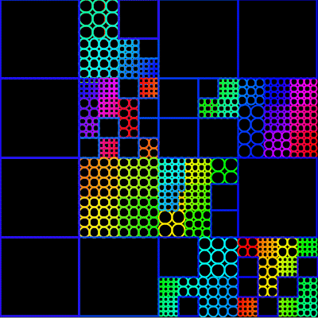

[sketch_2020_06_16a](https://github.com/villares/sketch-a-day/tree/master/2020/sketch_2020_06_16a) [[Py.Processing](https://villares.github.io/como-instalar-o-processing-modo-python/index-EN)]

---

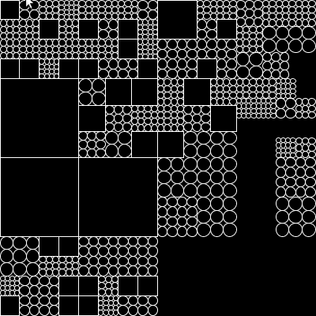

[sketch_2020_06_15a](https://github.com/villares/sketch-a-day/tree/master/2020/sketch_2020_06_15a) [[Py.Processing](https://villares.github.io/como-instalar-o-processing-modo-python/index-EN)]

---

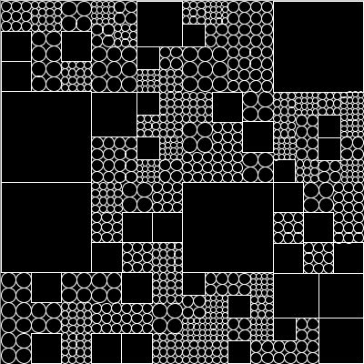

[sketch_2020_06_14a](https://github.com/villares/sketch-a-day/tree/master/2020/sketch_2020_06_14a) [[Py.Processing](https://villares.github.io/como-instalar-o-processing-modo-python/index-EN)]

First aproximation of 'lerp recursive grid'. 

---

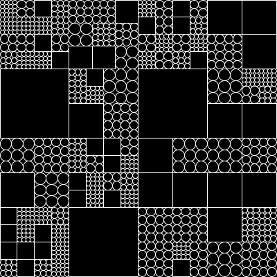

[sketch_2020_06_13a](https://github.com/villares/sketch-a-day/tree/master/2020/sketch_2020_06_13a) [[Py.Processing](https://villares.github.io/como-instalar-o-processing-modo-python/index-EN)]

Recrusive grid

---


[sketch_2020_06_12a](https://github.com/villares/sketch-a-day/tree/master/2020/sketch_2020_06_12a) [[Py.Processing](https://villares.github.io/como-instalar-o-processing-modo-python/index-EN)]

---

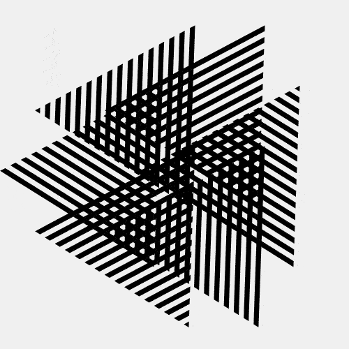

[sketch_2020_06_11a](https://github.com/villares/sketch-a-day/tree/master/2020/sketch_2020_06_11a) [[Py.Processing](https://villares.github.io/como-instalar-o-processing-modo-python/index-EN)]

---


[sketch_2020_06_11b](https://github.com/villares/sketch-a-day/tree/master/2020/sketch_2020_06_11b) [[Py.Processing](https://villares.github.io/como-instalar-o-processing-modo-python/index-EN)]

---

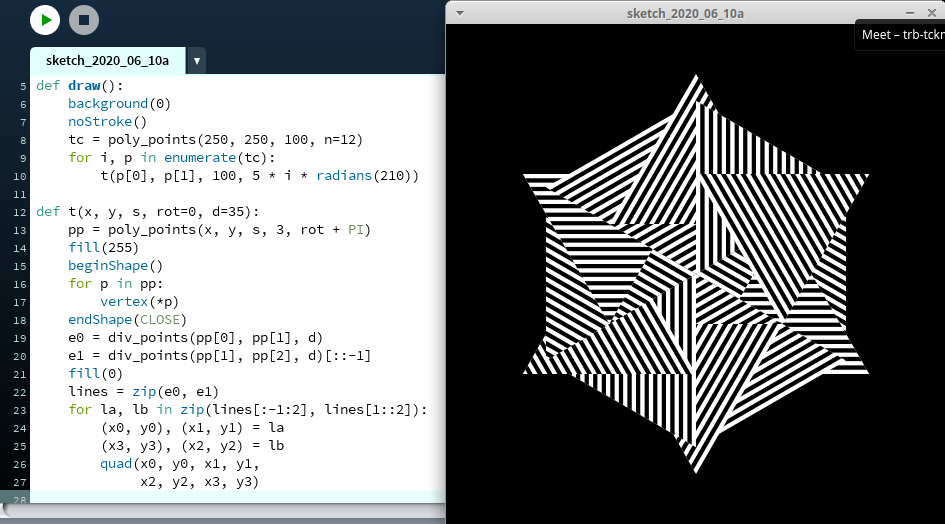

[sketch_2020_06_10a](https://github.com/villares/sketch-a-day/tree/master/2020/sketch_2020_06_10a) [[Py.Processing](https://villares.github.io/como-instalar-o-processing-modo-python/index-EN)]

---

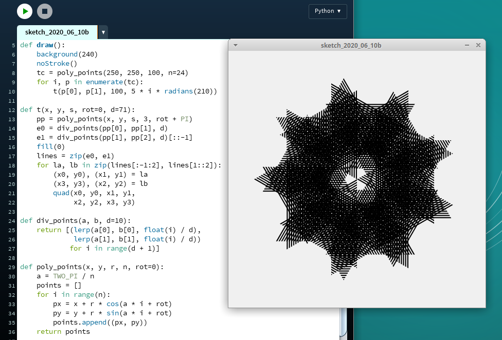

[sketch_2020_06_10b](https://github.com/villares/sketch-a-day/tree/master/2020/sketch_2020_06_10b) [[Py.Processing](https://villares.github.io/como-instalar-o-processing-modo-python/index-EN)]

---

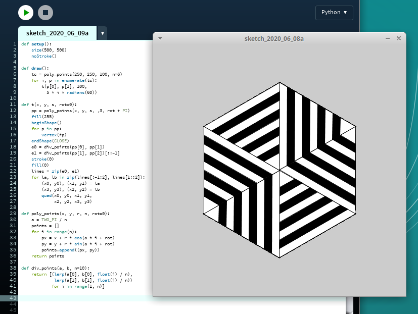

[sketch_2020_06_09a](https://github.com/villares/sketch-a-day/tree/master/2020/sketch_2020_06_09a) [[Py.Processing](https://villares.github.io/como-instalar-o-processing-modo-python/index-EN)]

---

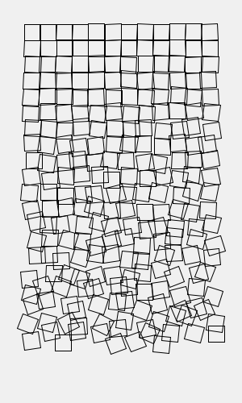

[sketch_2020_06_08b](https://github.com/villares/sketch-a-day/tree/master/2020/sketch_2020_06_08b) [[Py.Processing](https://villares.github.io/como-instalar-o-processing-modo-python/index-EN)]

Recreating a classic in class today: Georg Nees' Schotter
https://collections.vam.ac.uk/item/O221321/s 

---

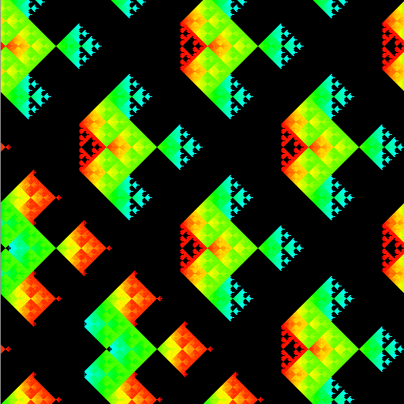

[sketch_2020_06_07a](https://github.com/villares/sketch-a-day/tree/master/2020/sketch_2020_06_07a) [[Py.Processing](https://villares.github.io/como-instalar-o-processing-modo-python/index-EN)]

Diagonal serpinsky-like 

`(-t + abs((x + y) | (x - y + t * 2)) ** a) % b < c`

---

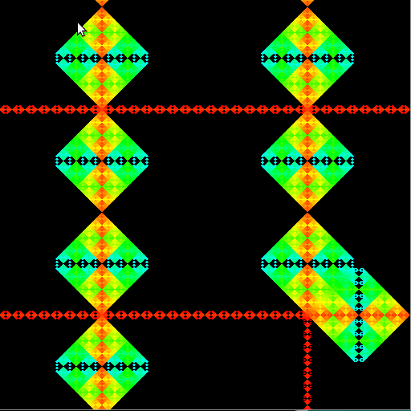

[sketch_2020_06_06a](https://github.com/villares/sketch-a-day/tree/master/2020/sketch_2020_06_06a) [[Py.Processing](https://villares.github.io/como-instalar-o-processing-modo-python/index-EN)]

Removed the scaling.
Now walking +.1 on the 'a' of:
`(t + abs((x + y - t) ^ (x - y + t)) ** a) % b < c`

---

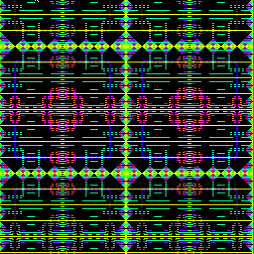

[sketch_2020_06_05a](https://github.com/villares/sketch-a-day/tree/master/2020/sketch_2020_06_05a) [[Py.Processing](https://villares.github.io/como-instalar-o-processing-modo-python/index-EN)]

Adding some HSB color :)
(still the [@nstutae](https://twitter.com/ntsutae/status/1268432505356513280?s=20) pattern)

---

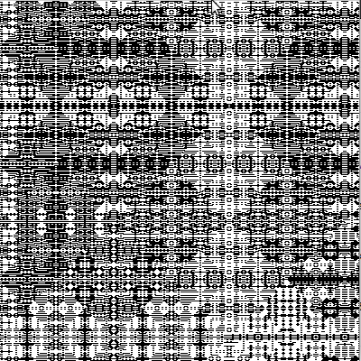

[sketch_2020_06_04a](https://github.com/villares/sketch-a-day/tree/master/2020/sketch_2020_06_04a) [[Py.Processing](https://villares.github.io/como-instalar-o-processing-modo-python/index-EN)]

Most wonderful pattern generator copied from [@ntsutae](https://twitter.com/ntsutae/status/1268432505356513280?s=20)

---

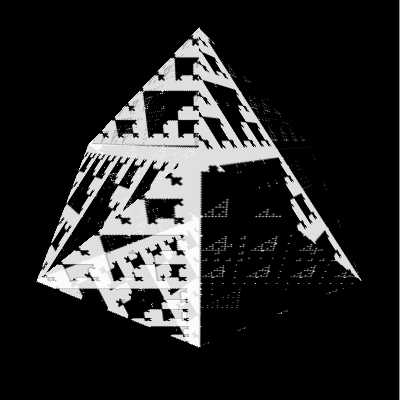

[sketch_2020_06_03a](https://github.com/villares/sketch-a-day/tree/master/2020/sketch_2020_06_03a) [[Py.Processing](https://villares.github.io/como-instalar-o-processing-modo-python/index-EN)]

Based on tweets by @ntsutae

---

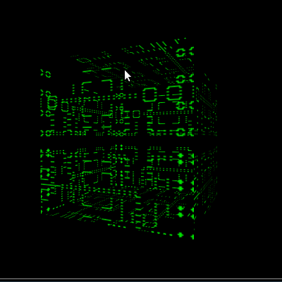

[sketch_2020_06_02a](https://github.com/villares/sketch-a-day/tree/master/2020/sketch_2020_06_02a) [[Py.Processing](https://villares.github.io/como-instalar-o-processing-modo-python/index-EN)]

Based on tweets by @ntsutae

---

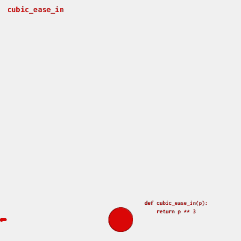

[sketch_2020_06_01a](https://github.com/villares/sketch-a-day/tree/master/2020/sketch_2020_06_01a) [[Py.Processing](https://villares.github.io/como-instalar-o-processing-modo-python/index-EN)]

More easing gif examples for 'material-aulas' (there is version *a*  and [*b*](https://github.com/villares/sketch-a-day/tree/master/2020/sketch_2020_06_01b) with different functions)

---

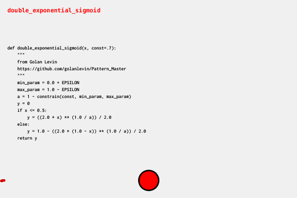

[sketch_2020_05_31a](https://github.com/villares/sketch-a-day/tree/master/2020/sketch_2020_05_31a) [[Py.Processing](https://villares.github.io/como-instalar-o-processing-modo-python/index-EN)]

John´s sigmoid as easing + Golan Levin's sigmoid

---

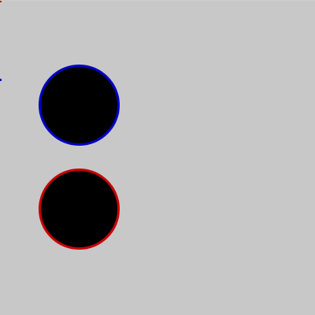

[sketch_2020_05_30a](https://github.com/villares/sketch-a-day/tree/master/2020/sketch_2020_05_30a) [[Py.Processing](https://villares.github.io/como-instalar-o-processing-modo-python/index-EN)]

John's `sigmoidMap()`

---

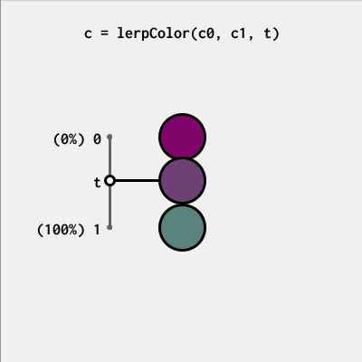

[sketch_2020_05_29a](https://github.com/villares/sketch-a-day/tree/master/2020/sketch_2020_05_29a) [[Py.Processing](https://villares.github.io/como-instalar-o-processing-modo-python/index-EN)]

`lerpColor()`

---

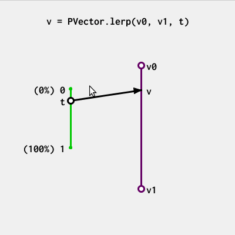

[sketch_2020_05_28b](https://github.com/villares/sketch-a-day/tree/master/2020/sketch_2020_05_28b) [[Py.Processing](https://villares.github.io/como-instalar-o-processing-modo-python/index-EN)]

`PVector.lerp()`

---

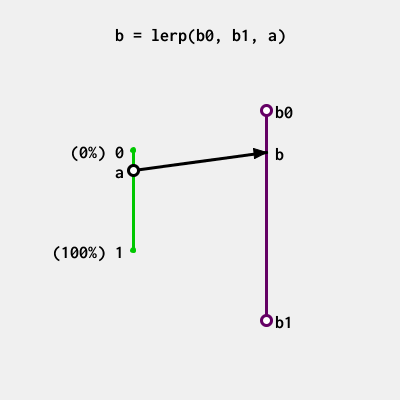

[sketch_2020_05_27a](https://github.com/villares/sketch-a-day/tree/master/2020/sketch_2020_05_27a) [[Py.Processing](https://villares.github.io/como-instalar-o-processing-modo-python/index-EN)]

Explaining `lerp()` in Processing

---

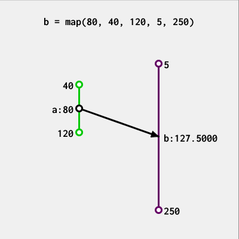

[sketch_2020_05_26a](https://github.com/villares/sketch-a-day/tree/master/2020/sketch_2020_05_26a) [[Py.Processing](https://villares.github.io/como-instalar-o-processing-modo-python/index-EN)]

Explaining `map()` in Processing

---


[sketch_2020_05_25a](https://github.com/villares/sketch-a-day/tree/master/2020/sketch_2020_05_25a) [[Py.Processing](https://villares.github.io/como-instalar-o-processing-modo-python/index-EN)]

---


[sketch_2020_05_24a](https://github.com/villares/sketch-a-day/tree/master/2020/sketch_2020_05_24a) [[Py.Processing](https://villares.github.io/como-instalar-o-processing-modo-python/index-EN)]

Easing

See also https://easings.net/ and https://gist.github.com/zeffii/c1e14dd6620ad855d81ec2e89a859719

---

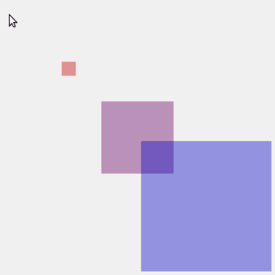

[sketch_2020_05_23a](https://github.com/villares/sketch-a-day/tree/master/2020/sketch_2020_05_23a) [[Py.Processing](https://villares.github.io/como-instalar-o-processing-modo-python/index-EN)]

`map()`, `lerp()` and `lerpColor()` example

---

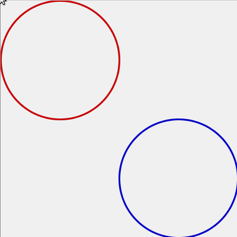

[sketch_2020_05_22a](https://github.com/villares/sketch-a-day/tree/master/2020/sketch_2020_05_22a) [[Py.Processing](https://villares.github.io/como-instalar-o-processing-modo-python/index-EN)]

`lerp()` and `lerpColor()` example

---


[sketch_2020_05_21a](https://github.com/villares/sketch-a-day/tree/master/2020/sketch_2020_05_21a) [[Py.Processing](https://villares.github.io/como-instalar-o-processing-modo-python/index-EN)]

Another simultaneous keys example

---


[sketch_2020_05_20a](https://github.com/villares/sketch-a-day/tree/master/2020/sketch_2020_05_20a) [[Py.Processing](https://villares.github.io/como-instalar-o-processing-modo-python/index-EN)]

Simultaneous keys example
---

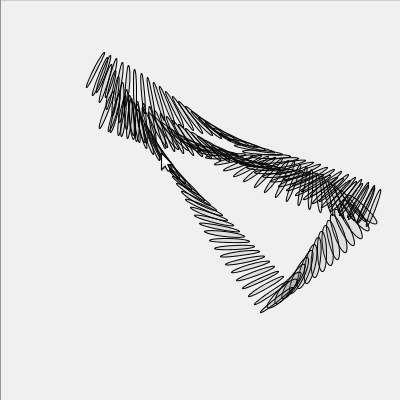

[sketch_2020_05_19a](https://github.com/villares/sketch-a-day/tree/master/2020/sketch_2020_05_19a) [[Py.Processing](https://villares.github.io/como-instalar-o-processing-modo-python/index-EN)]

---

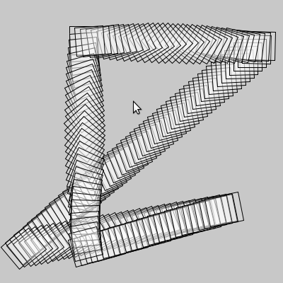

[sketch_2020_05_18a](https://github.com/villares/sketch-a-day/tree/master/2020/sketch_2020_05_18a) [[Py.Processing](https://villares.github.io/como-instalar-o-processing-modo-python/index-EN)]

---

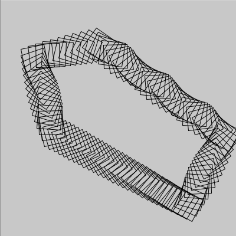

[sketch_2020_05_17a](https://github.com/villares/sketch-a-day/tree/master/2020/sketch_2020_05_17a) [[Py.Processing](https://villares.github.io/como-instalar-o-processing-modo-python/index-EN)]

---

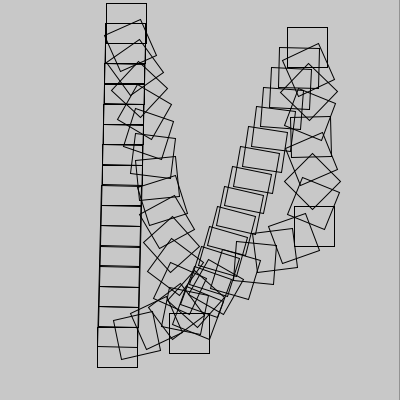

[sketch_2020_05_16a](https://github.com/villares/sketch-a-day/tree/master/2020/sketch_2020_05_15a) [[Py.Processing](https://villares.github.io/como-instalar-o-processing-modo-python/index-EN)]

---

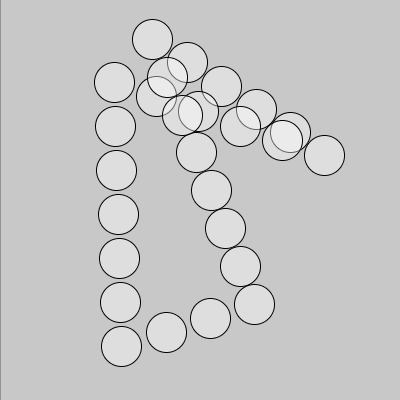

[sketch_2020_05_15a](https://github.com/villares/sketch-a-day/tree/master/2020/sketch_2020_05_15a) [[Py.Processing](https://villares.github.io/como-instalar-o-processing-modo-python/index-EN)]

---

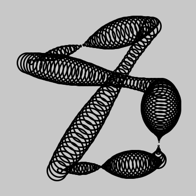

[sketch_2020_05_14a](https://github.com/villares/sketch-a-day/tree/master/2020/sketch_2020_05_14a) [[Py.Processing](https://villares.github.io/como-instalar-o-processing-modo-python/index-EN)]

---

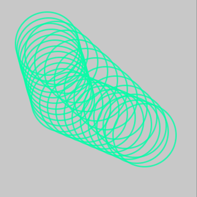

[sketch_2020_05_13a](https://github.com/villares/sketch-a-day/tree/master/2020/sketch_2020_05_13a) [[Py.Processing](https://villares.github.io/como-instalar-o-processing-modo-python/index-EN)]

---

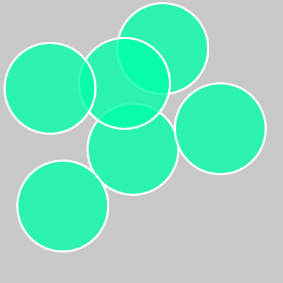

[sketch_2020_05_12a](https://github.com/villares/sketch-a-day/tree/master/2020/sketch_2020_05_12a) [[Py.Processing](https://villares.github.io/como-instalar-o-processing-modo-python/index-EN)]

---


[sketch_2020_05_11a](https://github.com/villares/sketch-a-day/tree/master/2020/sketch_2020_05_11a) [[Py.Processing](https://villares.github.io/como-instalar-o-processing-modo-python/index-EN)]


Made this as an example for http://abav.lugaralgum.com/material-aulas 

I started capturing the examples with [peek](https://github.com/phw/peek), it's great!

---

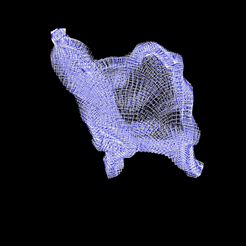

[sketch_2020_05_10a](https://github.com/villares/sketch-a-day/tree/master/2020/sketch_2020_05_10a) [[Py.Processing](https://villares.github.io/como-instalar-o-processing-modo-python/index-EN)]

More noise

---


[sketch_2020_05_09a](https://github.com/villares/sketch-a-day/tree/master/2020/sketch_2020_05_09a) [[Py.Processing](https://villares.github.io/como-instalar-o-processing-modo-python/index-EN)]

Looping now :)

---


[sketch_2020_05_08a](https://github.com/villares/sketch-a-day/tree/master/2020/sketch_2020_05_08a) [[Py.Processing](https://villares.github.io/como-instalar-o-processing-modo-python/index-EN)]

---


[sketch_2020_05_07a](https://github.com/villares/sketch-a-day/tree/master/2020/sketch_2020_05_07a) [[Py.Processing](https://villares.github.io/como-instalar-o-processing-modo-python/index-EN)]

---


[sketch_2020_05_06a](https://github.com/villares/sketch-a-day/tree/master/2020/sketch_2020_05_06a) [[Py.Processing](https://villares.github.io/como-instalar-o-processing-modo-python/index-EN)]

Noise 1D, 2D (& 3D with time)

---

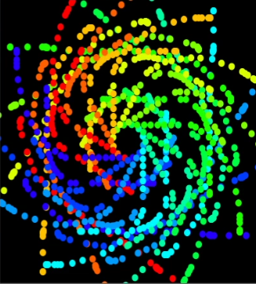

[sketch_2020_05_05a](https://github.com/villares/sketch-a-day/tree/master/2020/sketch_2020_05_05a) [[Py.Processing](https://villares.github.io/como-instalar-o-processing-modo-python/index-EN)]

Simetric drawing revisited

---

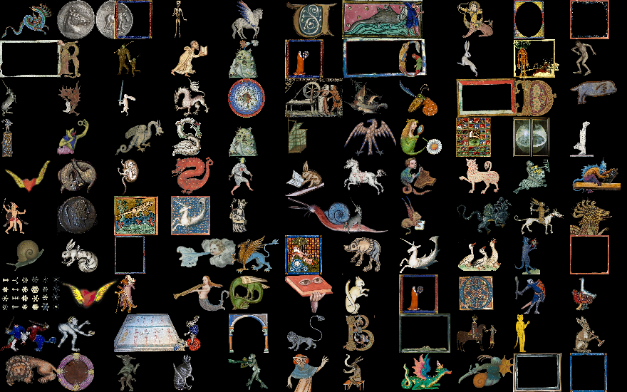

[sketch_2020_05_04a](https://github.com/villares/sketch-a-day/tree/master/2020/sketch_2020_05_04a) [[Py.Processing](https://villares.github.io/como-instalar-o-processing-modo-python/index-EN)]

Loading images from a folder!
Example medieval images collected by [Daniel Seda](https://www.danielseda.com/)

---


[sketch_2020_05_03a](https://github.com/villares/sketch-a-day/tree/master/2020/sketch_2020_05_03a) [[Py.Processing](https://villares.github.io/como-instalar-o-processing-modo-python/index-EN)]

Saving a text file example

---

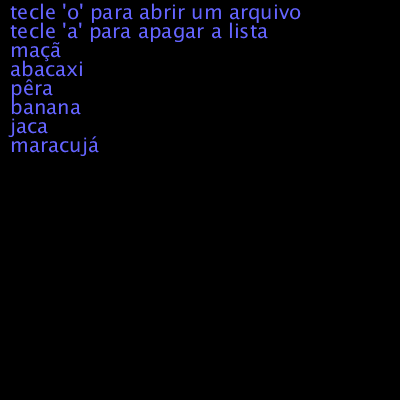

[sketch_2020_05_02a](https://github.com/villares/sketch-a-day/tree/master/2020/sketch_2020_05_02a) [[Py.Processing](https://villares.github.io/como-instalar-o-processing-modo-python/index-EN)]

File selection example

---

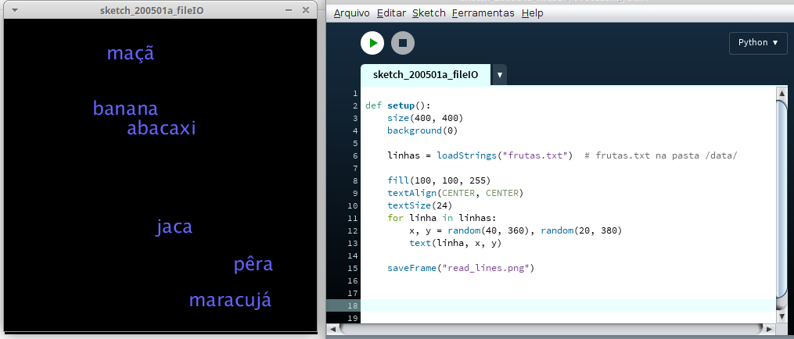

[sketch_2020_05_01a](https://github.com/villares/sketch-a-day/tree/master/2020/sketch_2020_05_01a) [[Py.Processing](https://villares.github.io/como-instalar-o-processing-modo-python/index-EN)]

Text file reading example

---

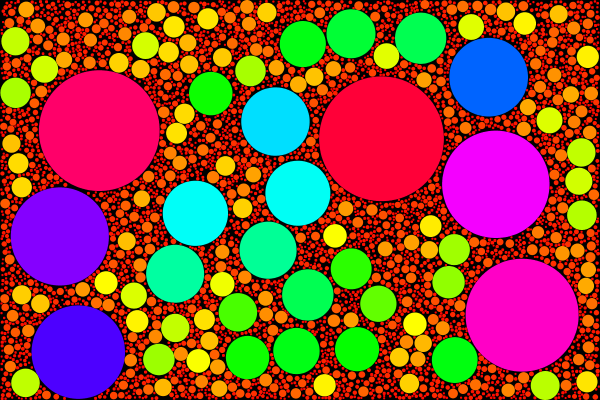

[sketch_2020_04_30a](https://github.com/villares/sketch-a-day/tree/master/2020/sketch_2020_04_30a) [[Py.Processing](https://villares.github.io/como-instalar-o-processing-modo-python/index-EN)]

Basic circle packing

---


[sketch_2020_04_29a](https://github.com/villares/sketch-a-day/tree/master/2020/sketch_2020_04_29a) [[Py.Processing](https://villares.github.io/como-instalar-o-processing-modo-python/index-EN)]

Variation of 28a

---


[sketch_2020_04_28a](https://github.com/villares/sketch-a-day/tree/master/2020/sketch_2020_04_28a) [[Py.Processing](https://villares.github.io/como-instalar-o-processing-modo-python/index-EN)]

Inspired by this https://discourse.processing.org/t/porting-a-3d-brownian-motion-to-python-mode/20144

---

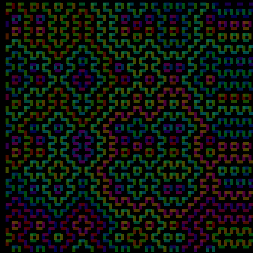

[sketch_2020_04_27a](https://github.com/villares/sketch-a-day/tree/master/2020/sketch_2020_04_27a) [[Py.Processing](https://villares.github.io/como-instalar-o-processing-modo-python/index-EN)]

---

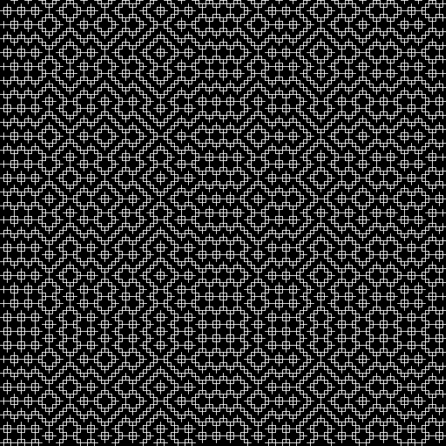

[sketch_2020_04_26b](https://github.com/villares/sketch-a-day/tree/master/2020/sketch_2020_04_26b) [[Py.Processing](https://villares.github.io/como-instalar-o-processing-modo-python/index-EN)]

---


[sketch_2020_04_25a](https://github.com/villares/sketch-a-day/tree/master/2020/sketch_2020_04_25a) [[Py.Processing](https://villares.github.io/como-instalar-o-processing-modo-python/index-EN)]

---

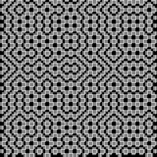 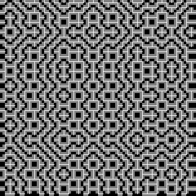


[sketch_2020_04_24a](https://github.com/villares/sketch-a-day/tree/master/2020/sketch_2020_04_24a) 
[sketch_2020_04_24b](https://github.com/villares/sketch-a-day/tree/master/2020/sketch_2020_04_24b) 
[[Py.Processing](https://villares.github.io/como-instalar-o-processing-modo-python/index-EN)]

---

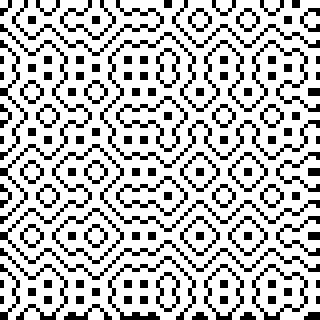

[sketch_2020_04_23a](https://github.com/villares/sketch-a-day/tree/master/2020/sketch_2020_04_23a) [[Py.Processing](https://villares.github.io/como-instalar-o-processing-modo-python/index-EN)]

---


[sketch_2020_04_22a](https://github.com/villares/sketch-a-day/tree/master/2020/sketch_2020_04_22a) [[Py.Processing](https://villares.github.io/como-instalar-o-processing-modo-python/index-EN)]

---

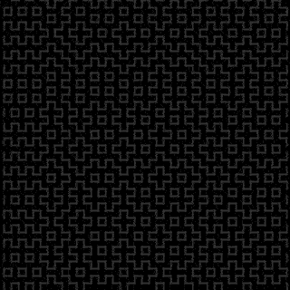

[sketch_2020_04_21d](https://github.com/villares/sketch-a-day/tree/master/2020/sketch_2020_04_21d) [[Py.Processing](https://villares.github.io/como-instalar-o-processing-modo-python/index-EN)]

---

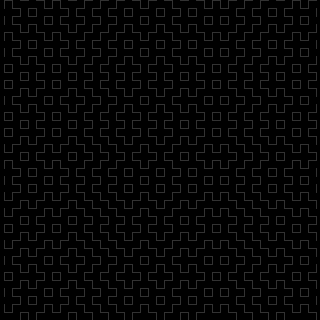

[sketch_2020_04_20d](https://github.com/villares/sketch-a-day/tree/master/2020/sketch_2020_04_20d) [[Py.Processing](https://villares.github.io/como-instalar-o-processing-modo-python/index-EN)]

---

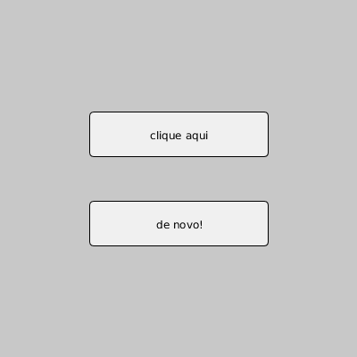

[sketch_2020_04_19a](https://github.com/villares/sketch-a-day/tree/master/2020/sketch_2020_04_19a) [[Py.Processing](https://villares.github.io/como-instalar-o-processing-modo-python/index-EN)]

---

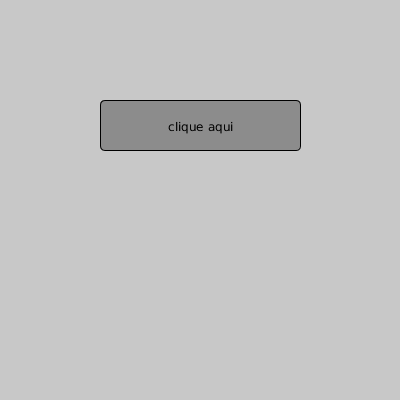

[sketch_2020_04_18a](https://github.com/villares/sketch-a-day/tree/master/2020/sketch_2020_04_18a) [[Py.Processing](https://villares.github.io/como-instalar-o-processing-modo-python/index-EN)]

---

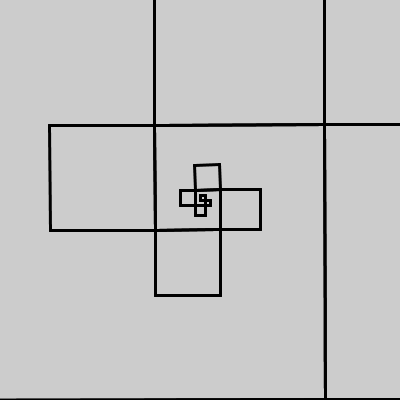

[sketch_2020_04_17b](https://github.com/villares/sketch-a-day/tree/master/2020/sketch_2020_04_17b) [[Py.Processing](https://villares.github.io/como-instalar-o-processing-modo-python/index-EN)]

Working on "Caneta automatica" a very simple Logo/turtle/pen for Processing Python Mode
https://github.com/villares/material-aulas/tree/master/caneta_automatica

---

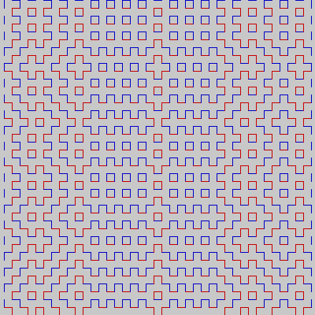

[sketch_2020_04_16a](https://github.com/villares/sketch-a-day/tree/master/2020/sketch_2020_04_16a) [[Py.Processing](https://villares.github.io/como-instalar-o-processing-modo-python/index-EN)]

Rewriting the previous sketch with a dictionary based grid in order to try some neighbour finding tricks later...

---

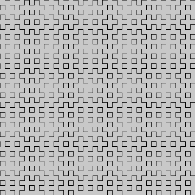

[sketch_2020_04_15a](https://github.com/villares/sketch-a-day/tree/master/2020/sketch_2020_04_15a) [[Py.Processing](https://villares.github.io/como-instalar-o-processing-modo-python/index-EN)]

"Based on traditional Japanese stitching, this is a riff on hitomezashi patterns."
-- Annie Perikins @anniek_p https://twitter.com/anniek_p/status/1244220881347502080?s=20

---


[sketch_2020_04_14a](https://github.com/villares/sketch-a-day/tree/master/2020/sketch_2020_04_14a) [[Py.Processing](https://villares.github.io/como-instalar-o-processing-modo-python/index-EN)]

---

 

[sketch_2020_04_13a](https://github.com/villares/sketch-a-day/tree/master/2020/sketch_2020_04_13a)<br>
[sketch_2020_04_13b](https://github.com/villares/sketch-a-day/tree/master/2020/sketch_2020_04_13b)<br>
[[Py.Processing](https://villares.github.io/como-instalar-o-processing-modo-python/index-EN)]

---

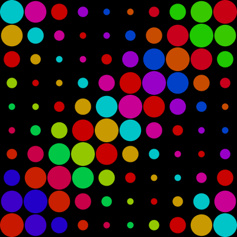

[sketch_2020_04_12a](https://github.com/villares/sketch-a-day/tree/master/2020/sketch_2020_04_12a) [[Py.Processing](https://villares.github.io/como-instalar-o-processing-modo-python/index-EN)]

---

<iframe src="https://abav.lugaralgum.com/sketch-a-day/2020/sketch_2020_04_11a/pyp5js/"  width="510" height="510"></iframe>

[sketch_2020_04_11a](https://github.com/villares/sketch-a-day/tree/master/2020/sketch_2020_04_11a) [[Py.Processing](https://villares.github.io/como-instalar-o-processing-modo-python/index-EN)]

https://abav.lugaralgum.com/sketch-a-day/2020/sketch_2020_04_11a/pyp5js/ [pyp5j](https://github/berinhard/pyp5js)

---

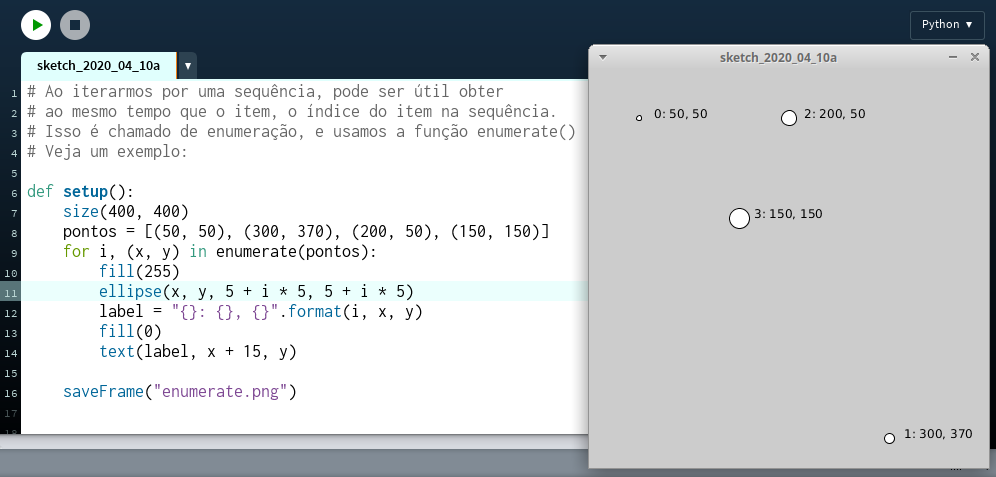

[sketch_2020_04_10a](https://github.com/villares/sketch-a-day/tree/master/2020/sketch_2020_04_10a) [[Py.Processing](https://villares.github.io/como-instalar-o-processing-modo-python/index-EN)]

---

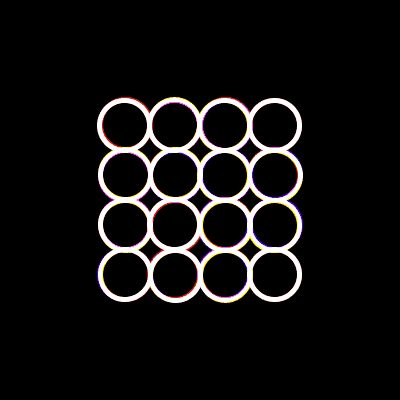 


[sketch_2020_04_09a](https://github.com/villares/sketch-a-day/tree/master/2020/sketch_2020_04_09a)</br>
[sketch_2020_04_09b](https://github.com/villares/sketch-a-day/tree/master/2020/sketch_2020_04_09b)</br> [[Py.Processing](https://villares.github.io/como-instalar-o-processing-modo-python/index-EN)]

---


[sketch_2020_04_08a](https://github.com/villares/sketch-a-day/tree/master/2020/sketch_2020_04_08a) [[Py.Processing](https://villares.github.io/como-instalar-o-processing-modo-python/index-EN)]

---


[sketch_2020_04_07a](https://github.com/villares/sketch-a-day/tree/master/2020/sketch_2020_04_07a) [[Py.Processing](https://villares.github.io/como-instalar-o-processing-modo-python/index-EN)]

---

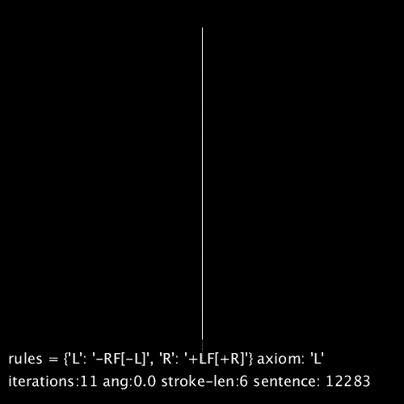

[sketch_2020_04_06a](https://github.com/villares/sketch-a-day/tree/master/2020/sketch_2020_04_06a) [[Py.Processing](https://villares.github.io/como-instalar-o-processing-modo-python/index-EN)]

2020_04_04a revisited

```python
axiom = 'L'
rules = {
    'L': '-RF[-L]',
    'R': '+LF[+R]',
}
```

---


[sketch_2020_04_05a](https://github.com/villares/sketch-a-day/tree/master/2020/sketch_2020_04_05a) [[Py.Processing](https://villares.github.io/como-instalar-o-processing-modo-python/index-EN)]

Added the gif export code and brought back the 'auto-center and zoom' shortcut

```python
axiom = 'L'
rules = {
    'L': '[-RF[-LF+]]',
    'R': '[+LF[+RF-]]',
}
```

---


[sketch_2020_04_04a](https://github.com/villares/sketch-a-day/tree/master/2020/sketch_2020_04_04a) [[Py.Processing](https://villares.github.io/como-instalar-o-processing-modo-python/index-EN)]

```python
axiom = 'L'
rules = {
    'L': '-RF[-L]',
    'R': '+LF[+R]',
}
```

---

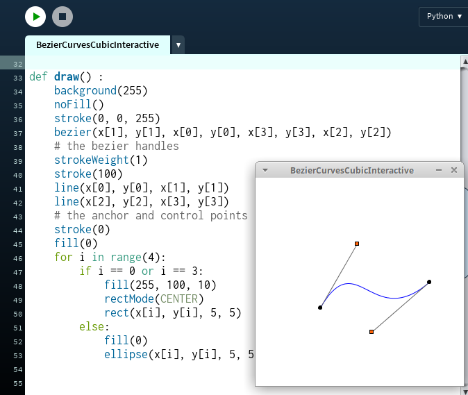

[sketch_2020_04_03a](https://github.com/villares/sketch-a-day/tree/master/2020/sketch_2020_04_03a) [[Py.Processing](https://villares.github.io/como-instalar-o-processing-modo-python/index-EN)]

---

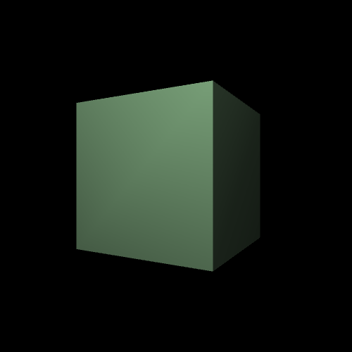

[sketch_2020_04_02a](https://github.com/villares/sketch-a-day/tree/master/2020/sketch_2020_04_02a) [[Py.Processing](https://villares.github.io/como-instalar-o-processing-modo-python/index-EN)]

---

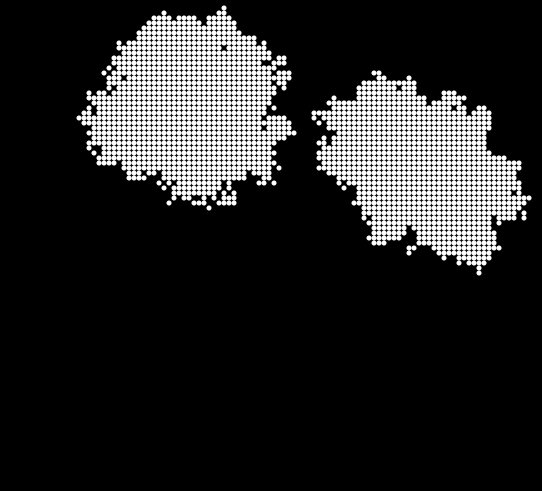

[sketch_2020_04_01a](https://github.com/villares/sketch-a-day/tree/master/2020/sketch_2020_04_01a) [[Py.Processing](https://villares.github.io/como-instalar-o-processing-modo-python/index-EN)]

---


[sketch_2020_03_31a](https://github.com/villares/sketch-a-day/tree/master/2020/sketch_2020_03_31a) [[Py.Processing](https://villares.github.io/como-instalar-o-processing-modo-python/index-EN)]

---

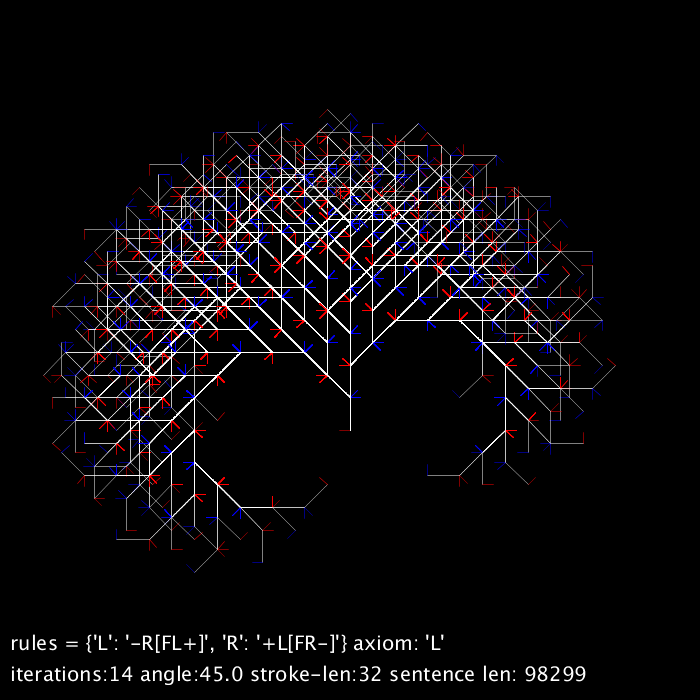

[sketch_2020_03_30a](https://github.com/villares/sketch-a-day/tree/master/2020/sketch_2020_03_30a) [[Py.Processing](https://villares.github.io/como-instalar-o-processing-modo-python/index-EN)]

---

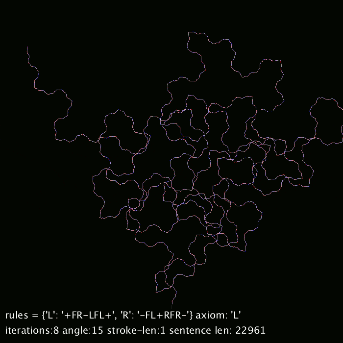

[sketch_2020_03_29a](https://github.com/villares/sketch-a-day/tree/master/2020/sketch_2020_03_29a) [[Py.Processing](https://villares.github.io/como-instalar-o-processing-modo-python/index-EN)]

```python
axiom = 'L'8
rules = {
    'L': '+FR-LFL+',
    'R': '-FL+RFR-',
}
...
   for c in sentence:
        if c == 'F':
            stroke(255)
            line(0, 0, 0, -stroke_len) # draw white line
            translate(0, -stroke_len) # move
        elif c == 'L':
            stroke(255, 0, 0)
            line(0, 0, 0, -stroke_len) # red does not move!
        elif c == 'R':
            stroke(0, 0, 255)
            line(0, 0, 0, -stroke_len) # blue does not move!
        elif c == '+':
            rotate(angle)
        elif c == '-':
            rotate(-angle)
```

---

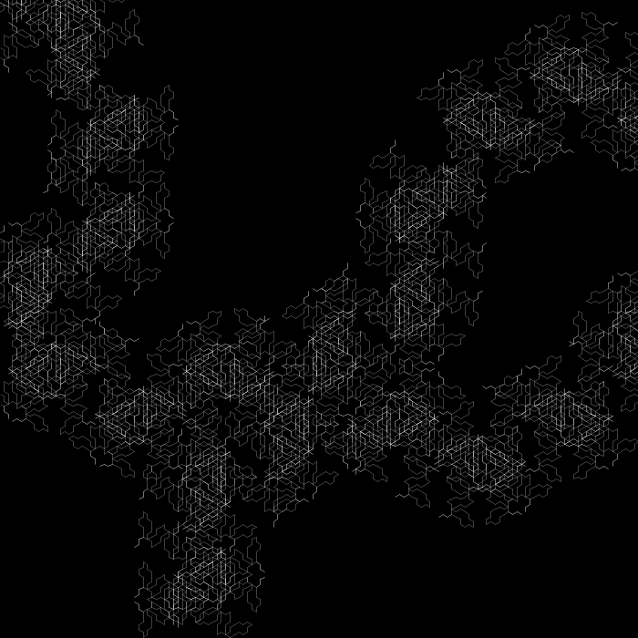

[sketch_2020_03_28a](https://github.com/villares/sketch-a-day/tree/master/2020/sketch_2020_03_28a) [[Py.Processing](https://villares.github.io/como-instalar-o-processing-modo-python/index-EN)]

```python
iterations = 9
stroke_len = 2600
angle_deg = 60
axiom = 'L'
sentence = axiom
rules = {
    'L': '+RF-LFL+',
    'R': '-LF+RFR-',
}
```

---

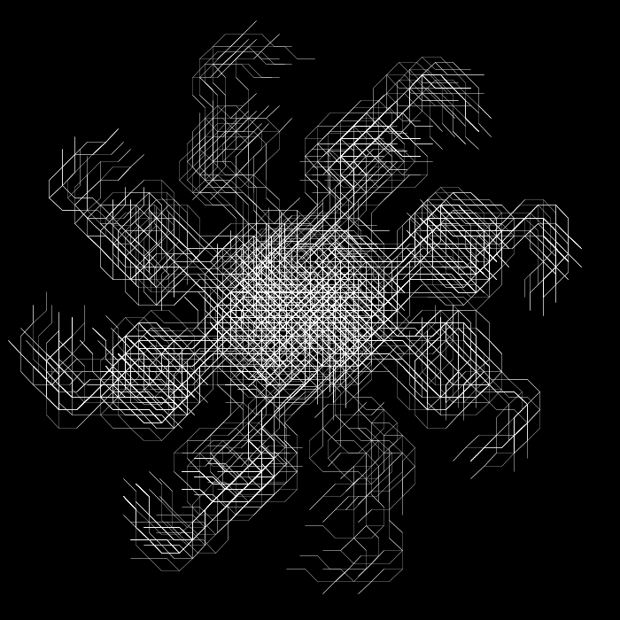

[sketch_2020_03_27a](https://github.com/villares/sketch-a-day/tree/master/2020/sketch_2020_03_27a) [[Py.Processing](https://villares.github.io/como-instalar-o-processing-modo-python/index-EN)]

```python
iterations = 7
stroke_len = 2600
angle_deg = 45
axiom = 'L'
sentence = axiom
rules = {
    'L': '+RF[-RFR]-FR+',
    'R': '-LF[+LFL]+FL-',
}
```

---

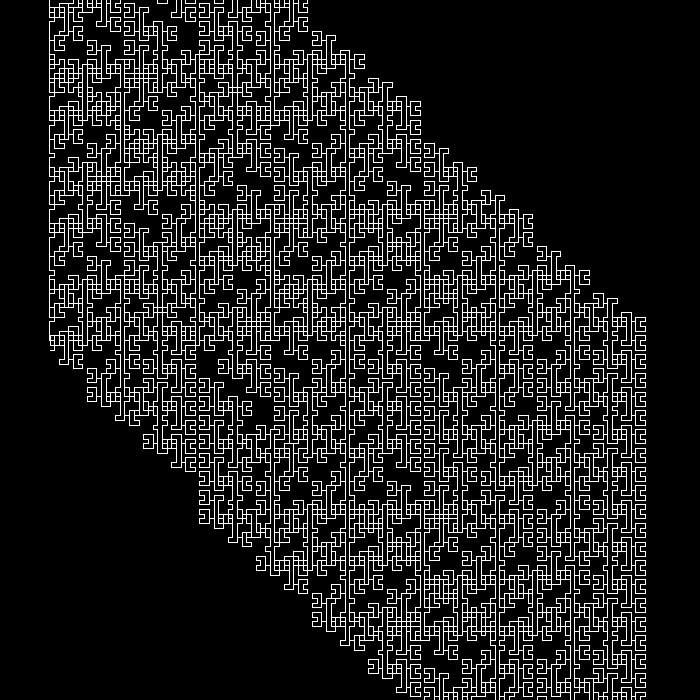

[sketch_2020_03_26a](https://github.com/villares/sketch-a-day/tree/master/2020/sketch_2020_03_26a) [[Py.Processing](https://villares.github.io/como-instalar-o-processing-modo-python/index-EN)]

```python
axiom = 'L'
sentence = axiom
rules = {
    'L': '+RF-LFL-FR+',
    'R': '-LF+RFR+FFL-', # broken Hilbert (added L)
}
```
---

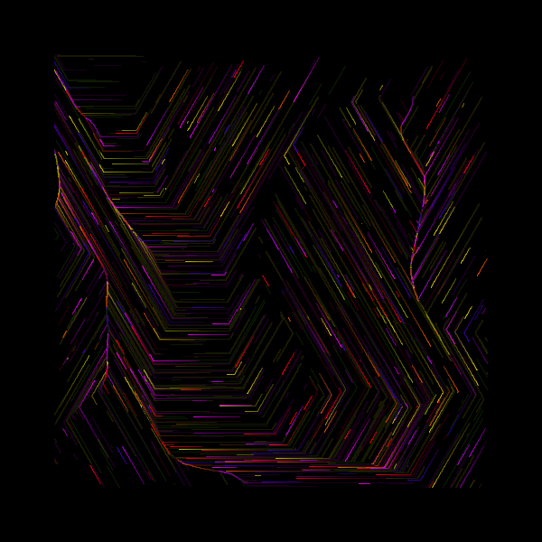

[sketch_2020_03_25a](https://github.com/villares/sketch-a-day/tree/master/2020/sketch_2020_03_25a) [[Py.Processing](https://villares.github.io/como-instalar-o-processing-modo-python/index-EN)]

Based on [www.openprocessing.org/sketch/862451](https://www.openprocessing.org/sketch/862451)
by [@takawo](https://twitter.com/takawo)

---

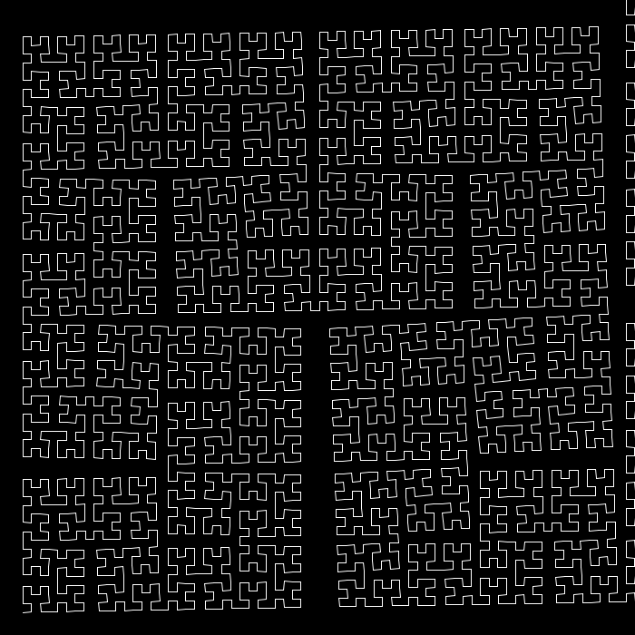

[sketch_2020_03_24a](https://github.com/villares/sketch-a-day/tree/master/2020/sketch_2020_03_24a) [[Py.Processing](https://villares.github.io/como-instalar-o-processing-modo-python/index-EN)]

L-System with rules for a Hilbert Curve. Studies for Rosetta Code.

```
axiom = "L"
rules = {
    'L': '+RF-LFL-FR+',
    'R': '-LF+RFR+FL-',
}
```

---


[sketch_2020_03_23a](https://github.com/villares/sketch-a-day/tree/master/2020/sketch_2020_03_23a) [[Py.Processing](https://villares.github.io/como-instalar-o-processing-modo-python/index-EN)]

---


[sketch_2020_03_22a](https://github.com/villares/sketch-a-day/tree/master/2020/sketch_2020_03_21a) & [sketch_2020_03_22b](https://github.com/villares/sketch-a-day/tree/master/2020/sketch_2020_03_21b) [[Py.Processing](https://villares.github.io/como-instalar-o-processing-modo-python/index-EN)]

---


[sketch_2020_03_21a](https://github.com/villares/sketch-a-day/tree/master/2020/sketch_2020_03_21a) [[Py.Processing](https://villares.github.io/como-instalar-o-processing-modo-python/index-EN)]

---

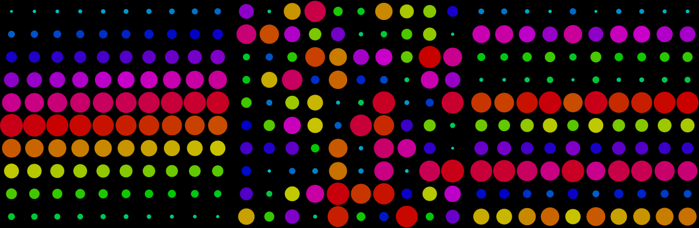

[sketch_2020_03_20a](https://github.com/villares/sketch-a-day/tree/master/2020/sketch_2020_03_20a) [[Py.Processing](https://villares.github.io/como-instalar-o-processing-modo-python/index-EN)]

Not shuffled, my shuffled, shoebot shuffled

---

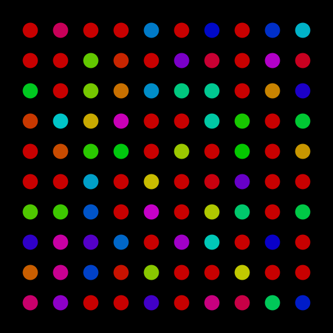

[sketch_2020_03_19a](https://github.com/villares/sketch-a-day/tree/master/2020/sketch_2020_03_19a) [[Py.Processing](https://villares.github.io/como-instalar-o-processing-modo-python/index-EN)]

Studies for a shuffled grid (I don't like/undertand the [shoebot shuffled grid](https://github.com/shoebot/shoebot/blob/752532e1d78b5474af435b2fdeea692737761b22/shoebot/grammar/bot.py))

```python
def shuffled_grid(cols, rows, colSize=1, rowSize=1):
    from random import shuffle
    sg = list(grid(cols, rows, colSize, rowSize))
    shuffle(sg)
    return sg

def grid(cols, rows, colSize=1, rowSize=1):
    """
    Returns an iterator that contains coordinate tuples.
    As seen in Shoebot & Nodebox (minus 'shuffled mode')
    A common way to use is:
    #    for x, y in grid(10, 10, 12, 12):
    #        rect(x, y, 10, 10)
    """
    rowRange = range(int(rows))
    colRange = range(int(cols))
    for y in rowRange:
        for x in colRange:
            yield (x * colSize, y * rowSize)

```

---

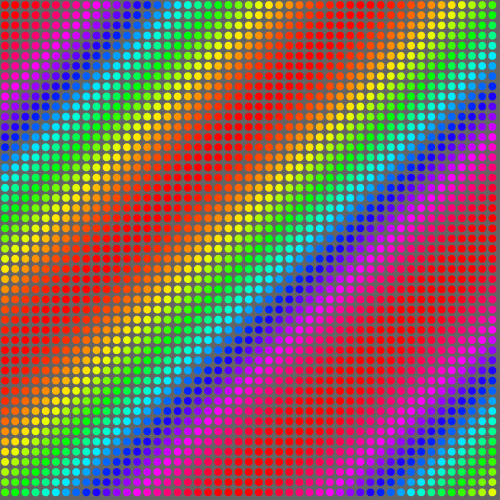

[sketch_2020_03_18a](https://github.com/villares/sketch-a-day/tree/master/2020/sketch_2020_03_18a) [[Py.Processing](https://villares.github.io/como-instalar-o-processing-modo-python/index-EN)]

Sin color diagonal made on my live coding streaming session :)

---


[sketch_2020_03_17a](https://github.com/villares/sketch-a-day/tree/master/2020/sketch_2020_03_17a) [[Py.Processing](https://villares.github.io/como-instalar-o-processing-modo-python/index-EN)]

PythagorasTree for Rosetta Code project https://rosettacode.org/wiki/Pythagoras_tree#Processing

---

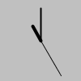

[sketch_2020_03_16a](https://github.com/villares/sketch-a-day/tree/master/2020/sketch_2020_03_16a) [[Py.Processing](https://villares.github.io/como-instalar-o-processing-modo-python/index-EN)]

Draw a clock for Rosetta Code project https://rosettacode.org/wiki/Draw_a_clock#Processing

---


[sketch_2020_03_15a](https://github.com/villares/sketch-a-day/tree/master/2020/sketch_2020_03_15a) [[Py.Processing](https://villares.github.io/como-instalar-o-processing-modo-python/index-EN)]

ImageNoise for Rosetta Code project
https://rosettacode.org/wiki/Image_noise#Processing
---

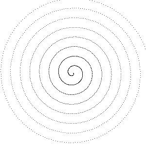

[sketch_2020_03_14a](https://github.com/villares/sketch-a-day/tree/master/2020/sketch_2020_03_14a) [[Py.Processing](https://villares.github.io/como-instalar-o-processing-modo-python/index-EN)]

Archimedean spiral for Rosetta Code project https://rosettacode.org/wiki/Archimedean_spiral#Processing

---

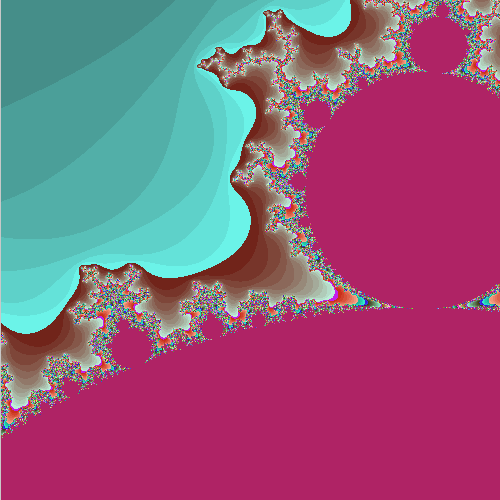

[sketch_2020_03_13a](https://github.com/villares/sketch-a-day/tree/master/2020/sketch_2020_03_13a) [[Py.Processing](https://villares.github.io/como-instalar-o-processing-modo-python/index-EN)]

Zoomable Mandelbrot set for Rosetta Code project https://www.rosettacode.org/wiki/Mandelbrot_set#Processing

---

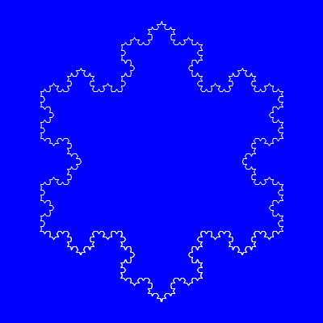

[sketch_2020_03_12a](https://github.com/villares/sketch-a-day/tree/master/2020/sketch_2020_03_12a) [[Py.Processing](https://villares.github.io/como-instalar-o-processing-modo-python/index-EN)]

Koch curve for Rosetta Code project https://www.rosettacode.org/wiki/Koch_curve#Processing

---


[sketch_2020_03_11a](https://github.com/villares/sketch-a-day/tree/master/2020/sketch_2020_03_11a) [[Py.Processing](https://villares.github.io/como-instalar-o-processing-modo-python/index-EN)]

Animation for Rosetta Code project https://rosettacode.org/wiki/Animation#Processing

---

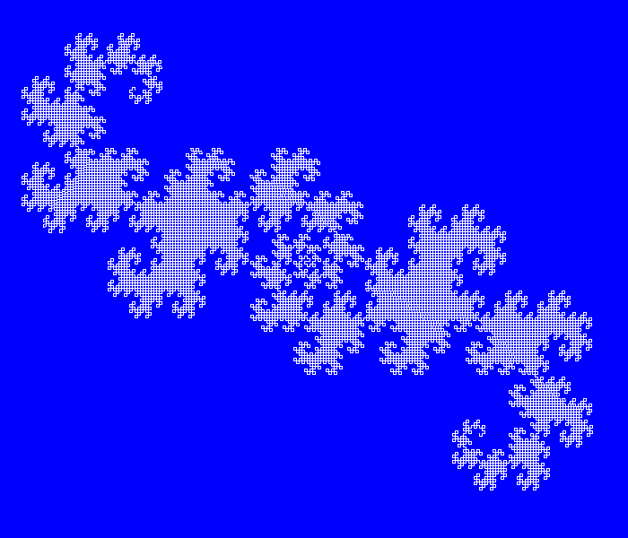

[sketch_2020_03_10a](https://github.com/villares/sketch-a-day/tree/master/2020/sketch_2020_03_10a) [[Py.Processing](https://villares.github.io/como-instalar-o-processing-modo-python/index-EN)]

Dragon curve for Rosetta Code project https://rosettacode.org/wiki/Dragon_curve#Processing

---

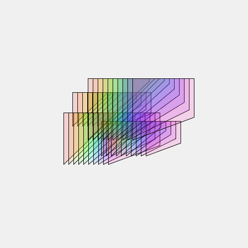

[sketch_2020_03_09b](https://github.com/villares/sketch-a-day/tree/master/2020/sketch_2020_03_09b) [[Py.Processing](https://villares.github.io/como-instalar-o-processing-modo-python/index-EN)]

---


[sketch_2020_03_08b](https://github.com/villares/sketch-a-day/tree/master/2020/sketch_2020_03_08b) [[Py.Processing](https://villares.github.io/como-instalar-o-processing-modo-python/index-EN)]

---


[sketch_2020_03_07b](https://github.com/villares/sketch-a-day/tree/master/2020/sketch_2020_03_07b) [[Py.Processing](https://villares.github.io/como-instalar-o-processing-modo-python/index-EN)]

---


[sketch_2020_03_06a](https://github.com/villares/sketch-a-day/tree/master/2020/sketch_2020_03_06a) [[Py.Processing](https://villares.github.io/como-instalar-o-processing-modo-python/index-EN)]

---


[sketch_2020_03_05a](https://github.com/villares/sketch-a-day/tree/master/2020/sketch_2020_03_05a) [[Py.Processing](https://villares.github.io/como-instalar-o-processing-modo-python/index-EN)]

---

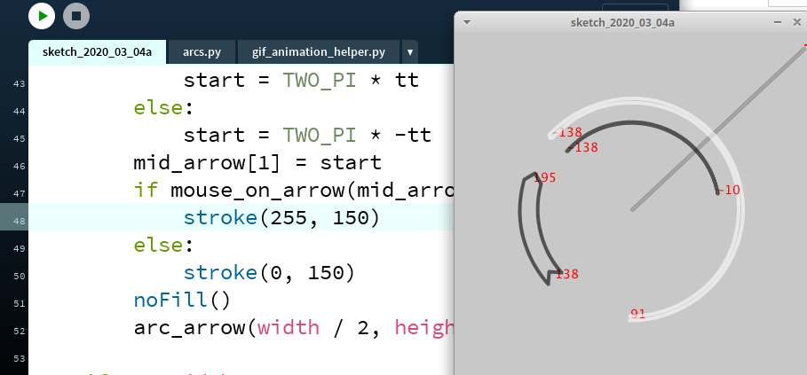

[sketch_2020_03_04a](https://github.com/villares/sketch-a-day/tree/master/2020/sketch_2020_03_04a) [[Py.Processing](https://villares.github.io/como-instalar-o-processing-modo-python/index-EN)]

---


[sketch_2020_03_03a](https://github.com/villares/sketch-a-day/tree/master/2020/sketch_2020_03_03a) [[Py.Processing](https://villares.github.io/como-instalar-o-processing-modo-python/index-EN)]

---

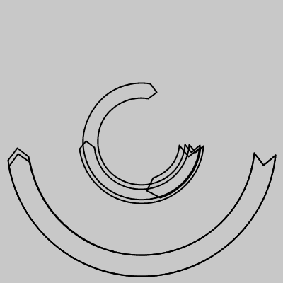

[sketch_2020_03_02a](https://github.com/villares/sketch-a-day/tree/master/2020/sketch_2020_03_02a) [[Py.Processing](https://villares.github.io/como-instalar-o-processing-modo-python/index-EN)]

---

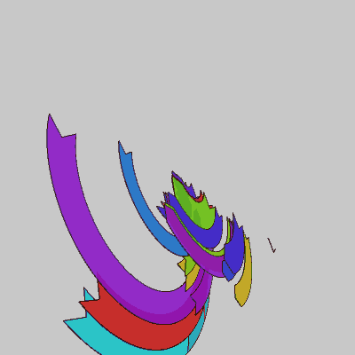

[sketch_2020_03_01a](https://github.com/villares/sketch-a-day/tree/master/2020/sketch_2020_03_01a) [[Py.Processing](https://villares.github.io/como-instalar-o-processing-modo-python/index-EN)]

---


[sketch_2020_02_29a](https://github.com/villares/sketch-a-day/tree/master/2020/sketch_2020_02_29a) [[Py.Processing](https://villares.github.io/como-instalar-o-processing-modo-python/index-EN)]

---

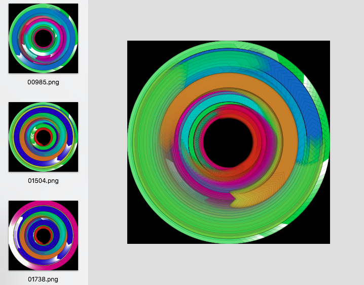

[sketch_2020_02_28a](https://github.com/villares/sketch-a-day/tree/master/2020/sketch_2020_02_28a) [[Py.Processing](https://villares.github.io/como-instalar-o-processing-modo-python/index-EN)]

---

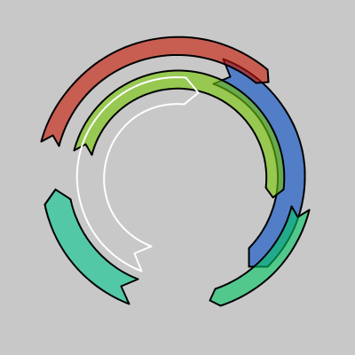

[sketch_2020_02_27a](https://github.com/villares/sketch-a-day/tree/master/2020/sketch_2020_02_27a) [[Py.Processing](https://villares.github.io/como-instalar-o-processing-modo-python/index-EN)]

Maybe this will be a game! Arrow hunter?

---


[sketch_2020_02_26a](https://github.com/villares/sketch-a-day/tree/master/2020/sketch_2020_02_26a) [[Py.Processing](https://villares.github.io/como-instalar-o-processing-modo-python/index-EN)]

---


[sketch_2020_02_25a](https://github.com/villares/sketch-a-day/tree/master/2020/sketch_2020_02_25a) [[Py.Processing](https://villares.github.io/como-instalar-o-processing-modo-python/index-EN)]

---

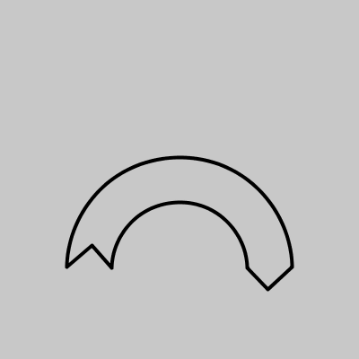

[sketch_2020_02_24a](https://github.com/villares/sketch-a-day/tree/master/2020/sketch_2020_02_24a) [[Py.Processing](https://villares.github.io/como-instalar-o-processing-modo-python/index-EN)]

---

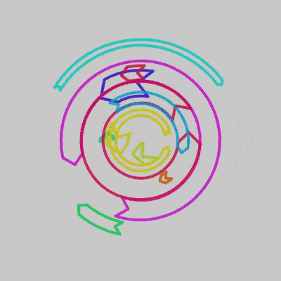

[sketch_2020_02_23a](https://github.com/villares/sketch-a-day/tree/master/2020/sketch_2020_02_23a) [[Py.Processing](https://villares.github.io/como-instalar-o-processing-modo-python/index-EN)]

---


[sketch_2020_02_22a](https://github.com/villares/sketch-a-day/tree/master/2020/sketch_2020_02_22a) [[Py.Processing](https://villares.github.io/como-instalar-o-processing-modo-python/index-EN)]

---

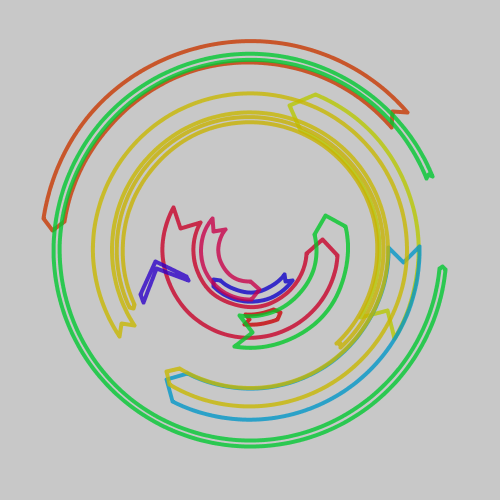

[sketch_2020_02_21a](https://github.com/villares/sketch-a-day/tree/master/2020/sketch_2020_02_21a) [[Py.Processing](https://villares.github.io/como-instalar-o-processing-modo-python/index-EN)]

---

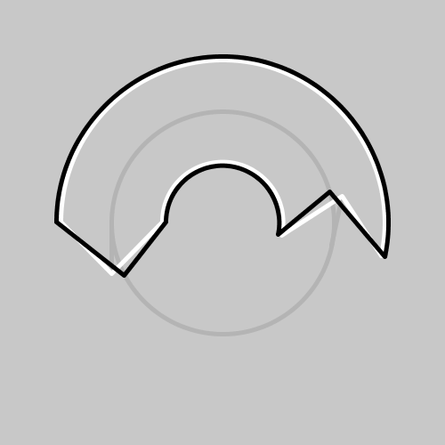

[sketch_2020_02_20a](https://github.com/villares/sketch-a-day/tree/master/2020/sketch_2020_02_20a) [[Py.Processing](https://villares.github.io/como-instalar-o-processing-modo-python/index-EN)]

---


[sketch_2020_02_19a](https://github.com/villares/sketch-a-day/tree/master/2020/sketch_2020_02_19a) [[Py.Processing](https://villares.github.io/como-instalar-o-processing-modo-python/index-EN)]

---

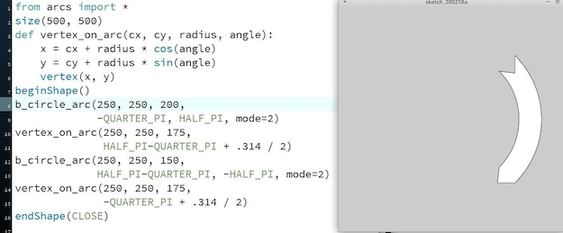

[sketch_2020_02_18a](https://github.com/villares/sketch-a-day/tree/master/2020/sketch_2020_02_18a) [[Py.Processing](https://villares.github.io/como-instalar-o-processing-modo-python/index-EN)]

---


[sketch_2020_02_17b](https://github.com/villares/sketch-a-day/tree/master/2020/sketch_2020_02_17b) [[Py.Processing](https://villares.github.io/como-instalar-o-processing-modo-python/index-EN)]

---

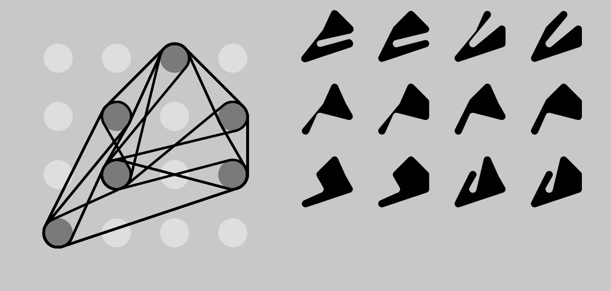

[sketch_2020_02_16b](https://github.com/villares/sketch-a-day/tree/master/2020/sketch_2020_02_16b) [[Py.Processing](https://villares.github.io/como-instalar-o-processing-modo-python/index-EN)]

---

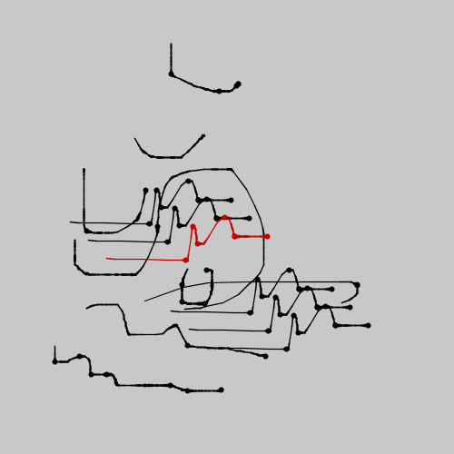

[sketch_2020_02_15a](https://github.com/villares/sketch-a-day/tree/master/2020/sketch_2020_02_15a) [[Py.Processing](https://villares.github.io/como-instalar-o-processing-modo-python/index-EN)]

---

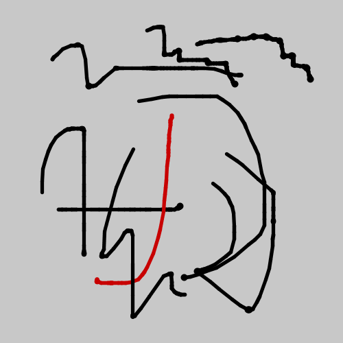

[sketch_2020_02_14a](https://github.com/villares/sketch-a-day/tree/master/2020/sketch_2020_02_14a) [[Py.Processing](https://villares.github.io/como-instalar-o-processing-modo-python/index-EN)]

---


[sketch_2020_02_13a](https://github.com/villares/sketch-a-day/tree/master/2020/sketch_2020_02_13a) [[Py.Processing](https://villares.github.io/como-instalar-o-processing-modo-python/index-EN)]

---

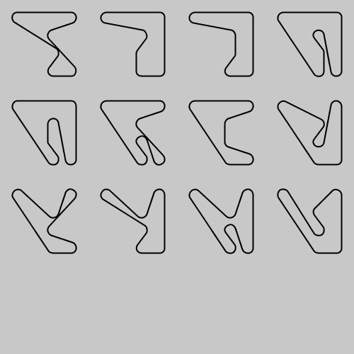

[sketch_2020_02_12a](https://github.com/villares/sketch-a-day/tree/master/2020/sketch_2020_02_12a) [[Py.Processing](https://villares.github.io/como-instalar-o-processing-modo-python/index-EN)]

---

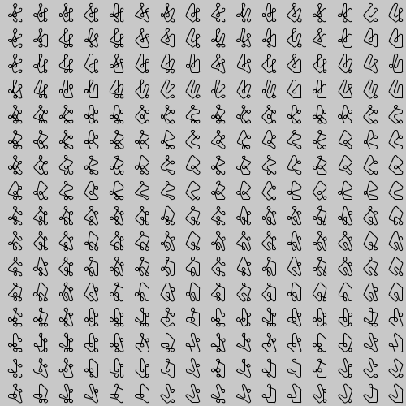

[sketch_2020_02_11a](https://github.com/villares/sketch-a-day/tree/master/2020/sketch_2020_02_11a) [[Py.Processing](https://villares.github.io/como-instalar-o-processing-modo-python/index-EN)]

---

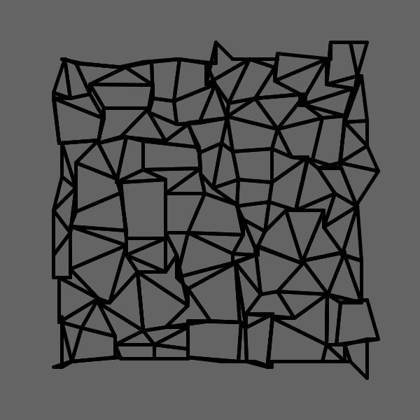

[sketch_2020_02_10a](https://github.com/villares/sketch-a-day/tree/master/2020/sketch_2020_02_10a) [[Py.Processing](https://villares.github.io/como-instalar-o-processing-modo-python/index-EN)]

---

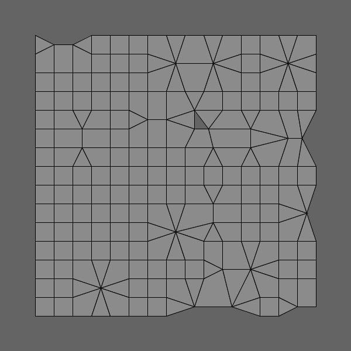

[sketch_2020_02_09a](https://github.com/villares/sketch-a-day/tree/master/2020/sketch_2020_02_09a) [[Py.Processing](https://villares.github.io/como-instalar-o-processing-modo-python/index-EN)]

---

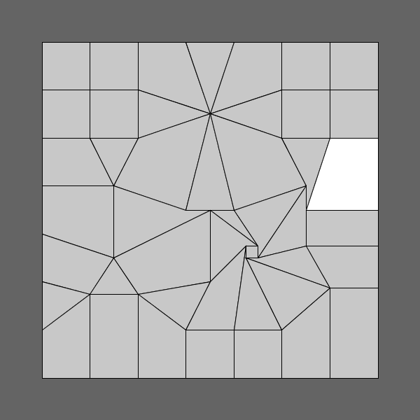

[sketch_2020_02_08a](https://github.com/villares/sketch-a-day/tree/master/2020/sketch_2020_02_08a) [[Py.Processing](https://villares.github.io/como-instalar-o-processing-modo-python/index-EN)]

---


[sketch_2020_02_07a](https://github.com/villares/sketch-a-day/tree/master/2020/sketch_2020_02_07a) [[Py.Processing](https://villares.github.io/como-instalar-o-processing-modo-python/index-EN)]

---

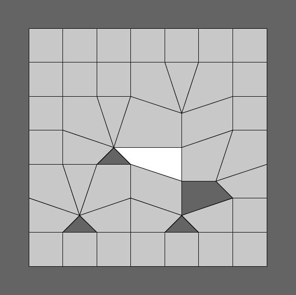

[sketch_2020_02_06a](https://github.com/villares/sketch-a-day/tree/master/2020/sketch_2020_02_06a) [[Py.Processing](https://villares.github.io/como-instalar-o-processing-modo-python/index-EN)]

---

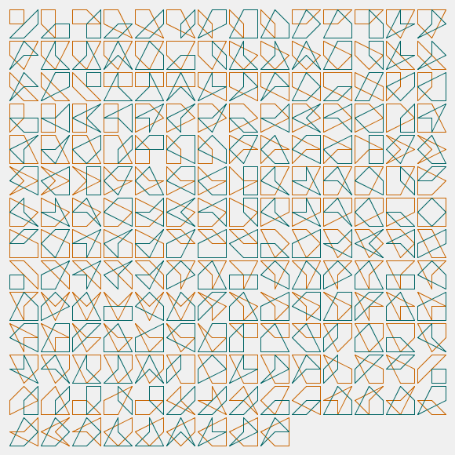

[sketch_2020_02_05b](https://github.com/villares/sketch-a-day/tree/master/2020/sketch_2020_02_05b) [[Py.Processing](https://villares.github.io/como-instalar-o-processing-modo-python/index-EN)]

---

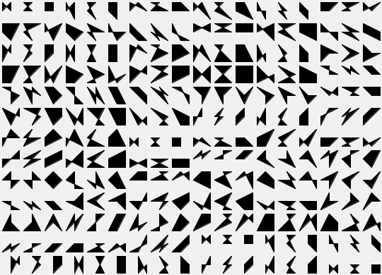

[sketch_2020_02_04c](https://github.com/villares/sketch-a-day/tree/master/2020/sketch_2020_02_04c) [[Py.Processing](https://villares.github.io/como-instalar-o-processing-modo-python/index-EN)]

---

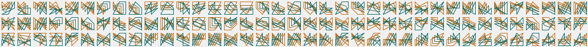

[sketch_2020_02_03a](https://github.com/villares/sketch-a-day/tree/master/2020/sketch_2020_02_03a) [[Py.Processing](https://villares.github.io/como-instalar-o-processing-modo-python/index-EN)]

---

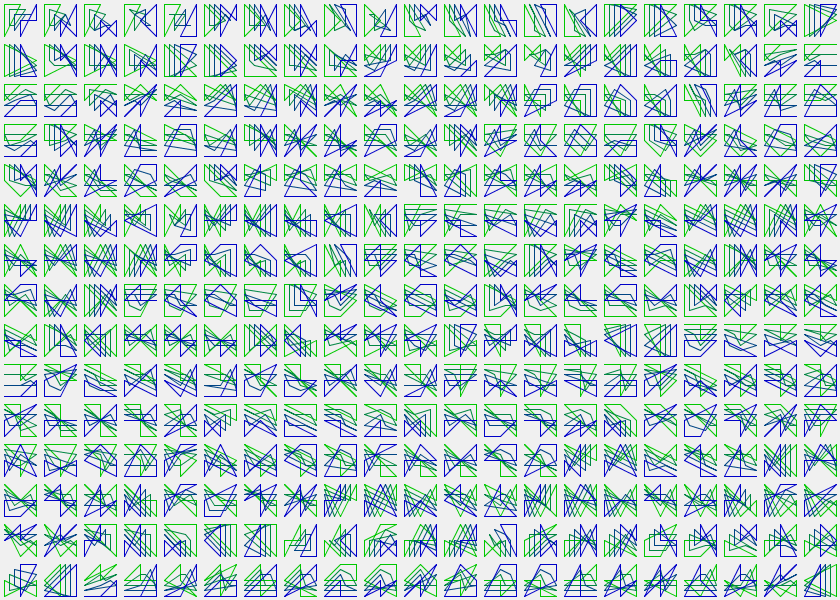

[sketch_2020_02_02a](https://github.com/villares/sketch-a-day/tree/master/2020/sketch_2020_02_02a) [[Py.Processing](https://villares.github.io/como-instalar-o-processing-modo-python/index-EN)]

---

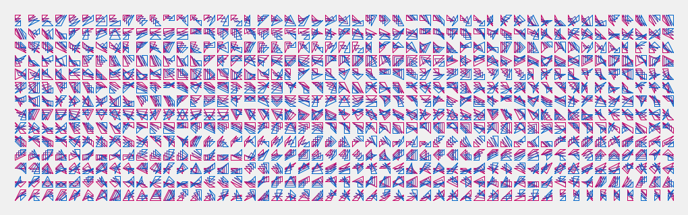

[sketch_2020_02_01a](https://github.com/villares/sketch-a-day/tree/master/2020/sketch_2020_02_01a) [[Py.Processing](https://villares.github.io/como-instalar-o-processing-modo-python/index-EN)]

- Number of possible triangles on 3x3 grid: 76
- Number of 2-triangle combinations: 2850
- Combinations without overlapping points: 686
- Each position then has 2 additional interpolated triangles (between the chosen 2-triangle combination)
- Cols: 49 Rows: 14

---

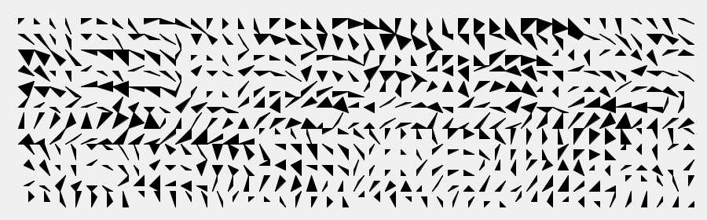

[sketch_2020_01_31a](https://github.com/villares/sketch-a-day/tree/master/2020/sketch_2020_01_31a) [[Py.Processing](https://villares.github.io/como-instalar-o-processing-modo-python/index-EN)]

- Number of possible triangles on a 4x4 grid: 516
- Cols: 43 Rows: 12

---


[sketch_2020_01_30a](https://github.com/villares/sketch-a-day/tree/master/2020/sketch_2020_01_30a) [[Py.Processing](https://villares.github.io/como-instalar-o-processing-modo-python/index-EN)]

---

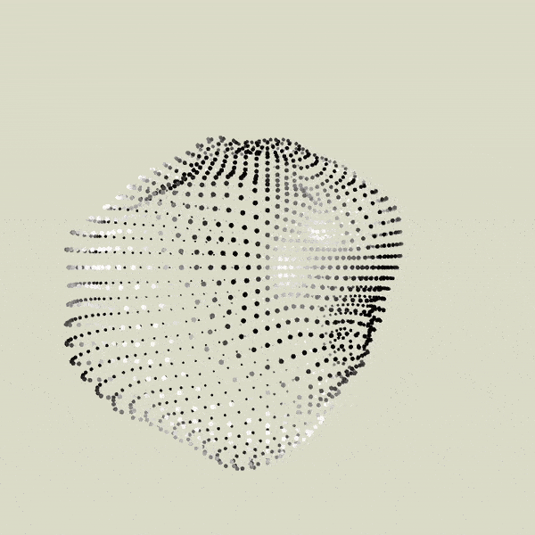

[sketch_2020_01_29a](https://github.com/villares/sketch-a-day/tree/master/2020/sketch_2020_01_29a) [[Py.Processing](https://villares.github.io/como-instalar-o-processing-modo-python/index-EN)]

---

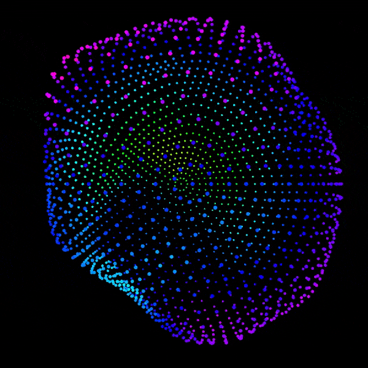

[sketch_2020_01_28a](https://github.com/villares/sketch-a-day/tree/master/2020/sketch_2020_01_28a) [[Py.Processing](https://villares.github.io/como-instalar-o-processing-modo-python/index-EN)]

---

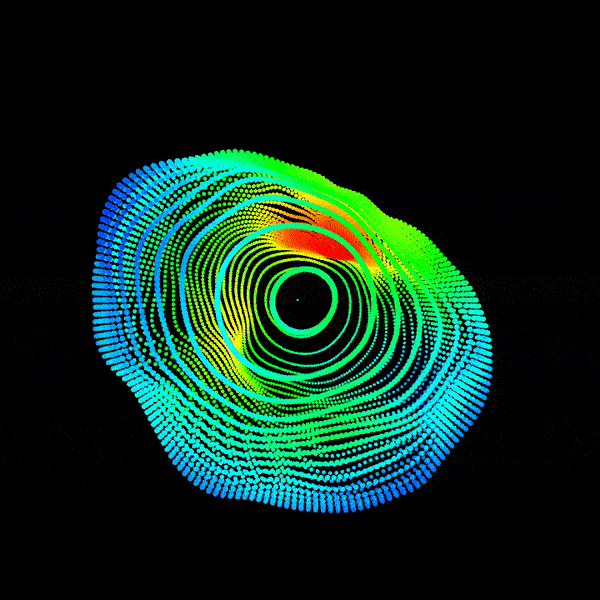

[sketch_2020_01_27a](https://github.com/villares/sketch-a-day/tree/master/2020/sketch_2020_01_27a) [[Py.Processing](https://villares.github.io/como-instalar-o-processing-modo-python/index-EN)]

---

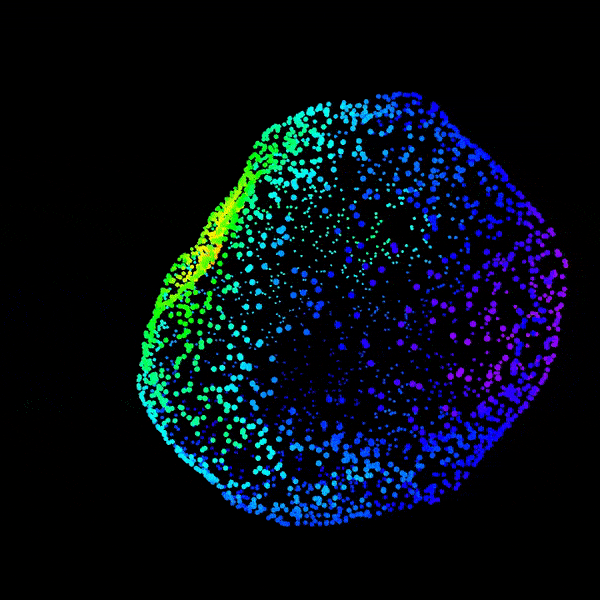

[sketch_2020_01_26a](https://github.com/villares/sketch-a-day/tree/master/2020/sketch_2020_01_26a) [[Py.Processing](https://villares.github.io/como-instalar-o-processing-modo-python/index-EN)]

---


[sketch_2020_01_25a](https://github.com/villares/sketch-a-day/tree/master/2020/sketch_2020_01_25a) [[Py.Processing](https://villares.github.io/como-instalar-o-processing-modo-python/index-EN)]

---

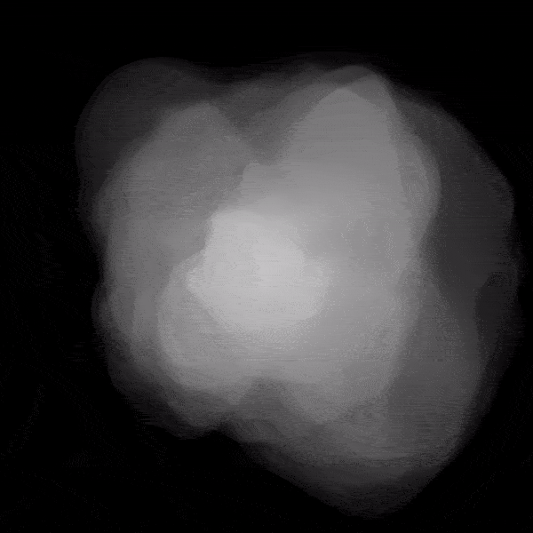

[sketch_2020_01_24a](https://github.com/villares/sketch-a-day/tree/master/2020/sketch_2020_01_24a) [[Py.Processing](https://villares.github.io/como-instalar-o-processing-modo-python/index-EN)]

---

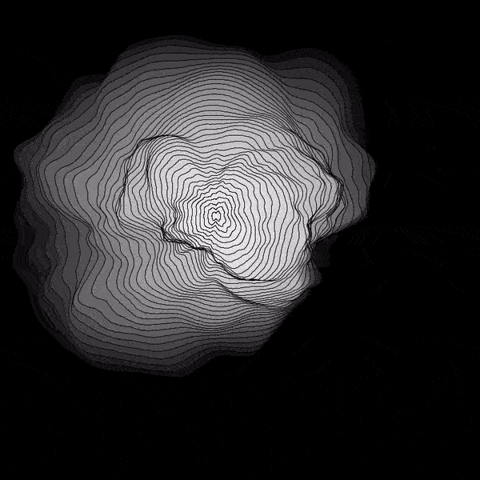

[sketch_2020_01_23a](https://github.com/villares/sketch-a-day/tree/master/2020/sketch_2020_01_23a) [[Py.Processing](https://villares.github.io/como-instalar-o-processing-modo-python/index-EN)]

---

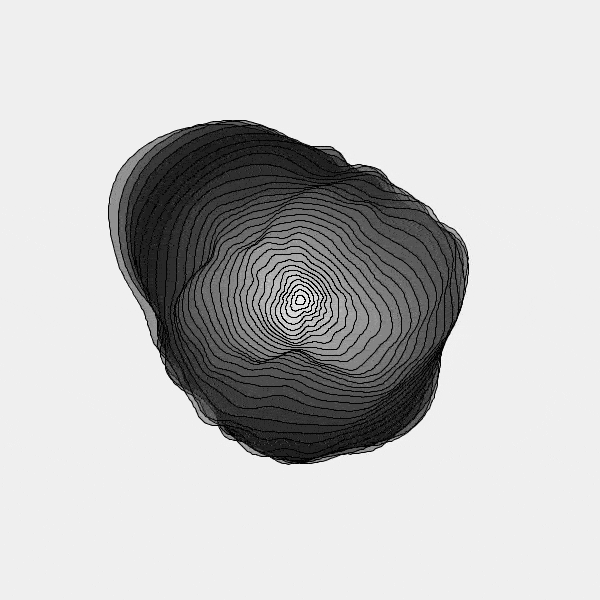

[sketch_2020_01_22a](https://github.com/villares/sketch-a-day/tree/master/2020/sketch_2020_01_22a) [[Py.Processing](https://villares.github.io/como-instalar-o-processing-modo-python/index-EN)]

---

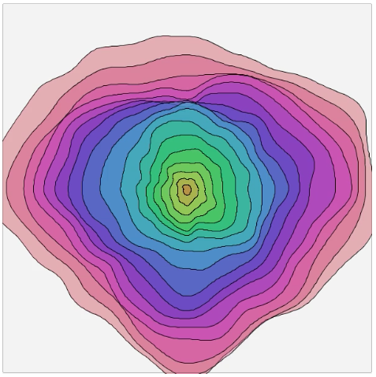

[sketch_2020_01_21a](https://github.com/villares/sketch-a-day/tree/master/2020/sketch_2020_01_21a) [[Py.Processing](https://villares.github.io/como-instalar-o-processing-modo-python/index-EN)]

---

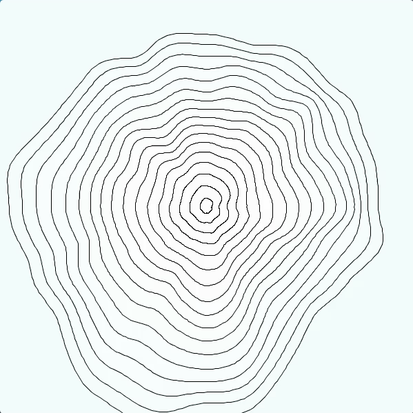

[sketch_2020_01_20a](https://github.com/villares/sketch-a-day/tree/master/2020/sketch_2020_01_20a) [[Py.Processing](https://villares.github.io/como-instalar-o-processing-modo-python/index-EN)]

---

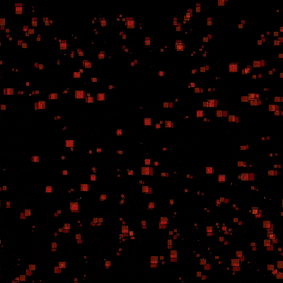

[sketch_2020_01_19a](https://github.com/villares/sketch-a-day/tree/master/2020/sketch_2020_01_19a) [[Py.Processing](https://villares.github.io/como-instalar-o-processing-modo-python/index-EN)]

---

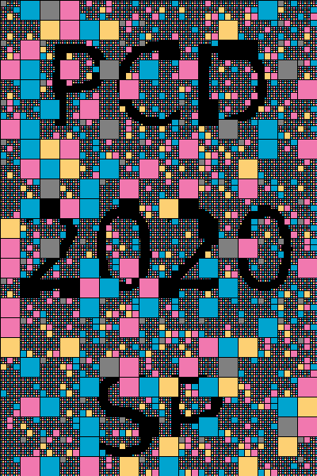

[sketch_2020_01_18c](https://github.com/villares/sketch-a-day/tree/master/2020/sketch_2020_01_18c) [[Py.Processing](https://villares.github.io/como-instalar-o-processing-modo-python/index-EN)]

---

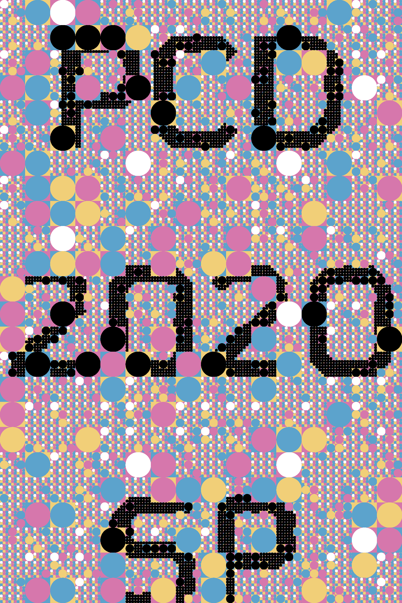

[sketch_2020_01_17b](https://github.com/villares/sketch-a-day/tree/master/2020/sketch_2020_01_17b) [[Py.Processing](https://villares.github.io/como-instalar-o-processing-modo-python/index-EN)]

---


[sketch_2020_01_16b](https://github.com/villares/sketch-a-day/tree/master/2020/sketch_2020_01_16b) [[Py.Processing](https://villares.github.io/como-instalar-o-processing-modo-python/index-EN)]

---


[sketch_2020_01_15a](https://github.com/villares/sketch-a-day/tree/master/2020/sketch_2020_01_15a) [[Py.Processing](https://villares.github.io/como-instalar-o-processing-modo-python/index-EN)]

---

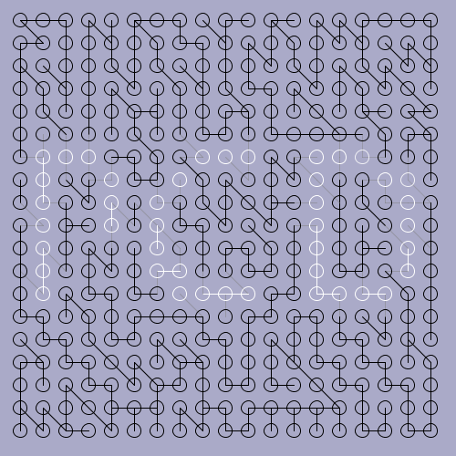

[sketch_2020_01_14a](https://github.com/villares/sketch-a-day/tree/master/2020/sketch_2020_01_14a) [[Py.Processing](https://villares.github.io/como-instalar-o-processing-modo-python/index-EN)]

---

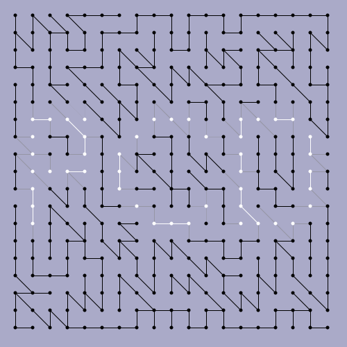

[sketch_2020_01_13a](https://github.com/villares/sketch-a-day/tree/master/2020/sketch_2020_01_13a) [[Py.Processing](https://villares.github.io/como-instalar-o-processing-modo-python/index-EN)]

---

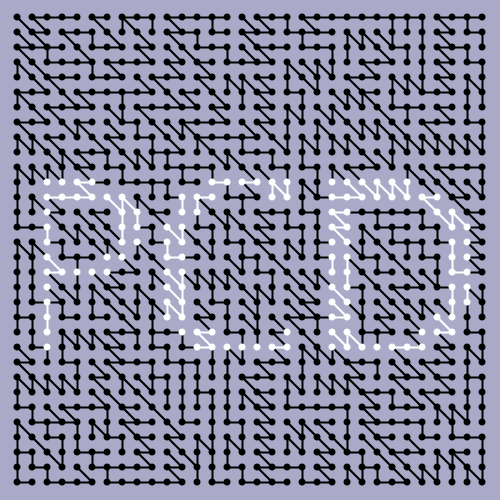

[sketch_2020_01_12a](https://github.com/villares/sketch-a-day/tree/master/2020/sketch_2020_01_12a) [[Py.Processing](https://villares.github.io/como-instalar-o-processing-modo-python/index-EN)]

---

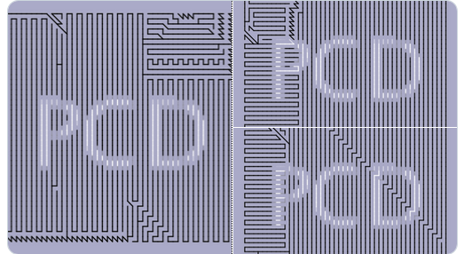

[sketch_2020_01_11a](https://github.com/villares/sketch-a-day/tree/master/2020/sketch_2020_01_11a) [[Py.Processing](https://villares.github.io/como-instalar-o-processing-modo-python/index-EN)]

---

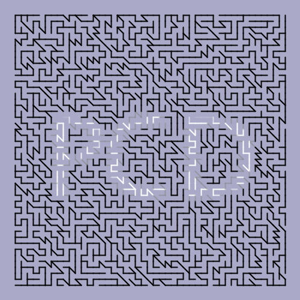

[sketch_2020_01_10a](https://github.com/villares/sketch-a-day/tree/master/2020/sketch_2020_01_10a) [[Py.Processing](https://villares.github.io/como-instalar-o-processing-modo-python/index-EN)]

---

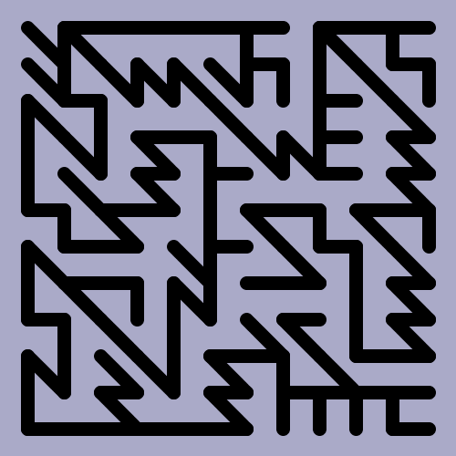

[sketch_2020_01_09a](https://github.com/villares/sketch-a-day/tree/master/2020/sketch_2020_01_09a) [[Py.Processing](https://villares.github.io/como-instalar-o-processing-modo-python/index-EN)]

---

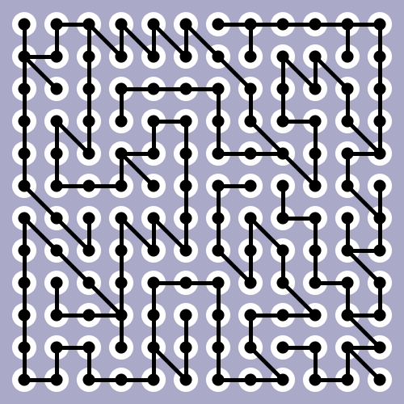

[sketch_2020_01_08f](https://github.com/villares/sketch-a-day/tree/master/2020/sketch_2020_01_08f) [[Py.Processing](https://villares.github.io/como-instalar-o-processing-modo-python/index-EN)]

---

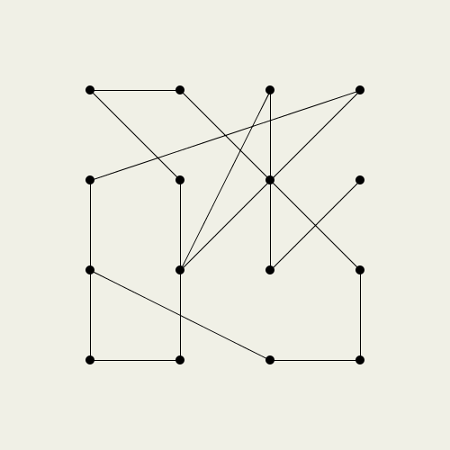

[sketch_2020_01_07c](https://github.com/villares/sketch-a-day/tree/master/2020/sketch_2020_01_07c) [[Py.Processing](https://villares.github.io/como-instalar-o-processing-modo-python/index-EN)]

---

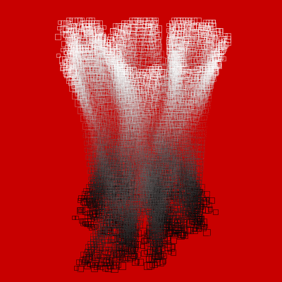

[sketch_2020_01_06b](https://github.com/villares/sketch-a-day/tree/master/2020/sketch_2020_01_06b) [[Py.Processing](https://villares.github.io/como-instalar-o-processing-modo-python/index-EN)]

---

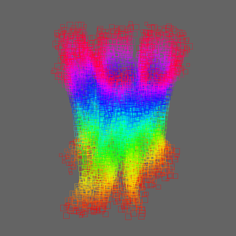

[sketch_2020_01_05a](https://github.com/villares/sketch-a-day/tree/master/2020/sketch_2020_01_05a) [[Py.Processing](https://villares.github.io/como-instalar-o-processing-modo-python/index-EN)]

---


[sketch_2020_01_04b](https://github.com/villares/sketch-a-day/tree/master/2020/sketch_2020_01_04b) [[Py.Processing](https://villares.github.io/como-instalar-o-processing-modo-python/index-EN)]

---

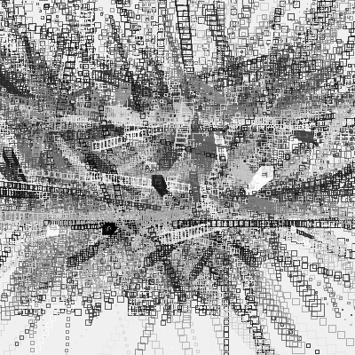

[sketch_2020_01_03b](https://github.com/villares/sketch-a-day/tree/master/2020/sketch_2020_01_03b) [[Py.Processing](https://villares.github.io/como-instalar-o-processing-modo-python/index-EN)]

---

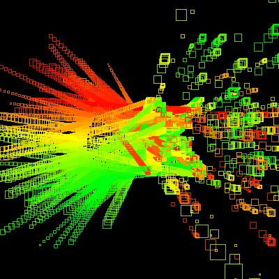

[sketch_2020_01_02a](https://github.com/villares/sketch-a-day/tree/master/2020/sketch_2020_01_02a) [[Py.Processing](https://villares.github.io/como-instalar-o-processing-modo-python/index-EN)]

---


[sketch_2020_01_01a](https://github.com/villares/sketch-a-day/tree/master/2020/sketch_2020_01_01a) [[Py.Processing](https://villares.github.io/como-instalar-o-processing-modo-python/index-EN)]

---

