----
# sketch-a-day
### one visual idea a day [[on GitHub!](https://github.com/villares/sketch-a-day)]

Hi! I'm [Alexandre Villares](https://abav.lugaralgum.com), let's see if I can make one small program (*sketch*) a day. I'm working mostly with [Processing Python Mode](https://villares.github.io/como-instalar-o-processing-modo-python/index-EN) and sometimes [Processing Java Mode](https://processing.org) and[P5JS (JavaScript)](p5js.org) or other stuff.

If you enjoy this, make a small donation [here](https://www.paypal.com/cgi-bin/webscr?cmd=_s-xclick&hosted_button_id=HCGAKACDMVNV2) or with [Patreon](https://patreon.com/arteprog)

----


171:[Java code](https://github.com/villares/sketch-a-day/tree/master/s171)[[Processing Java](https://processing.org)] &  [Python code](https://github.com/villares/sketch-a-day/tree/master/s171_py) [[Py.Processing](https://villares.github.io/como-instalar-o-processing-modo-python/index-EN)]

----


170:[code](https://github.com/villares/sketch-a-day/tree/master/s170) [[Py.Processing](https://villares.github.io/como-instalar-o-processing-modo-python/index-EN)]

----

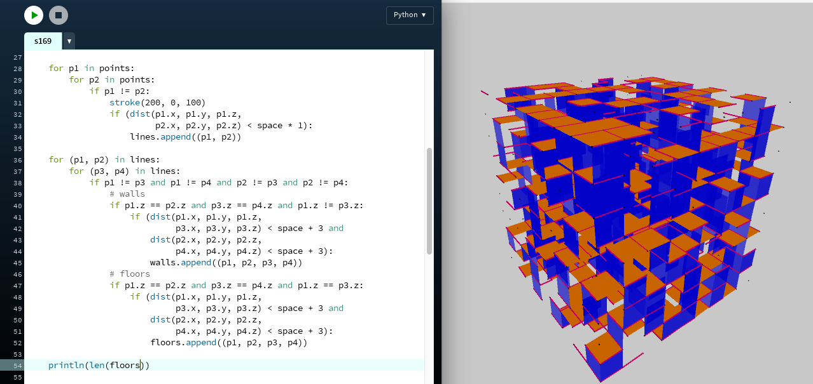

169:[code](https://github.com/villares/sketch-a-day/tree/master/s169) [[Py.Processing](https://villares.github.io/como-instalar-o-processing-modo-python/index-EN)]

Now same Z lines can form floors.

----


168:[code](https://github.com/villares/sketch-a-day/tree/master/s168) [[Py.Processing](https://villares.github.io/como-instalar-o-processing-modo-python/index-EN)]

No random movement in Z so no line connections between different (Z) levels. Comparing  lines with different Zs to create translucent 'walls'.

----


167: [Java code](https://github.com/villares/sketch-a-day/tree/master/s167) [[Processing Java](https://processing.org)] & [Python code](https://github.com/villares/sketch-a-day/tree/master/s167_py) [[Py.Processing](https://villares.github.io/como-instalar-o-processing-modo-python/index-EN)]

----


166: [code](https://github.com/villares/sketch-a-day/tree/master/s166) [[Py.Processing](https://villares.github.io/como-instalar-o-processing-modo-python/index-EN)]

----

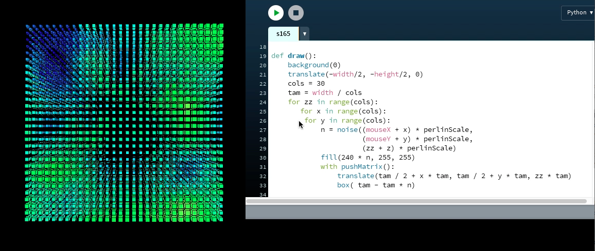

165: [code](https://github.com/villares/sketch-a-day/tree/master/s165) [[Py.Processing](https://villares.github.io/como-instalar-o-processing-modo-python/index-EN)]

----

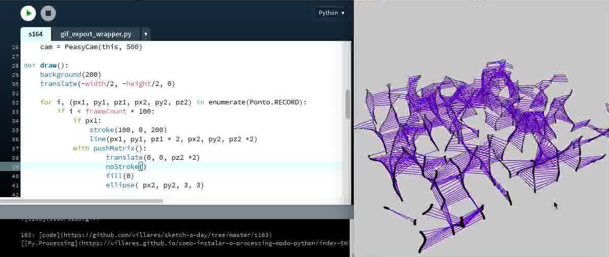

164: [code](https://github.com/villares/sketch-a-day/tree/master/s164) [[Py.Processing](https://villares.github.io/como-instalar-o-processing-modo-python/index-EN)]

----

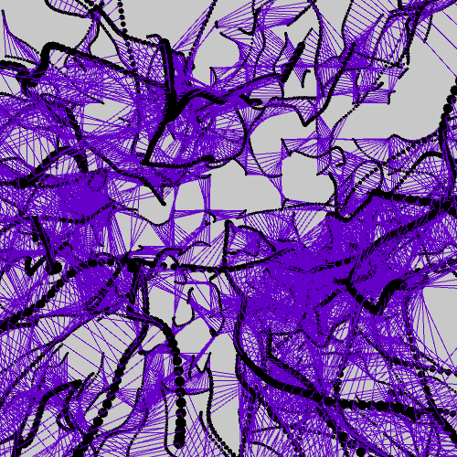

163: [code](https://github.com/villares/sketch-a-day/tree/master/s163) [[Py.Processing](https://villares.github.io/como-instalar-o-processing-modo-python/index-EN)]

(#152 revisited in 3D :)

----

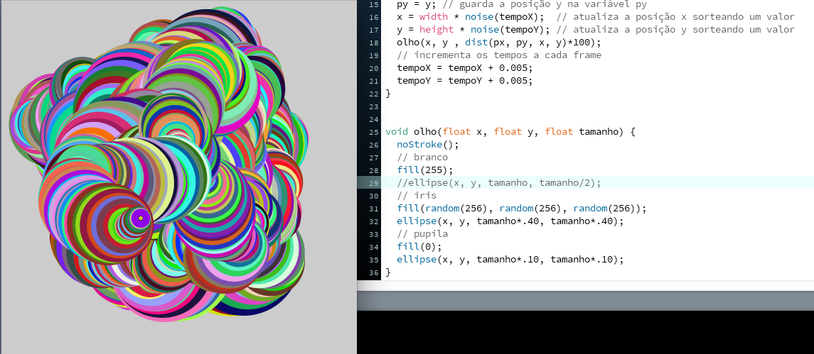

162: [code](https://github.com/villares/sketch-a-day/tree/master/s161) [[Processing Java](https://www.processing.org)]

Perlin Noise "walker" + ?

----


161: [code](https://github.com/villares/sketch-a-day/tree/master/s161) [[Processing Java](https://www.processing.org)]

Perlin Noise  "walker" + eye

----


160: [code](https://github.com/villares/sketch-a-day/tree/master/s160) [[Processing Java](https://www.processing.org)]

Interactive genetic algorithm

----


159: [code](https://github.com/villares/sketch-a-day/tree/master/s158) [[Processing Java](https://www.processing.org)]

----

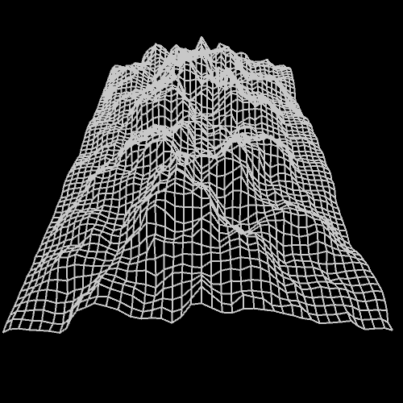

158: [code](https://github.com/villares/sketch-a-day/tree/master/s158) [[Py.Processing](https://villares.github.io/como-instalar-o-processing-modo-python/index-EN)]

----


157: [code](https://github.com/villares/sketch-a-day/tree/master/s156) [[Py.Processing](https://villares.github.io/como-instalar-o-processing-modo-python/index-EN)]

----

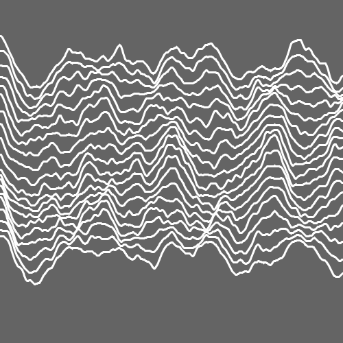

156: [code](https://github.com/villares/sketch-a-day/tree/master/s156) [[Py.Processing](https://villares.github.io/como-instalar-o-processing-modo-python/index-EN)]

----


155: [code](https://github.com/villares/sketch-a-day/tree/master/s155) [[Py.Processing](https://villares.github.io/como-instalar-o-processing-modo-python/index-EN)]

----


154: [code](https://github.com/villares/sketch-a-day/tree/master/s154) [[Py.Processing](https://villares.github.io/como-instalar-o-processing-modo-python/index-EN)]

----


153: [code](https://github.com/villares/sketch-a-day/tree/master/s153) [[Py.Processing](https://villares.github.io/como-instalar-o-processing-modo-python/index-EN)]

----


152: [code](https://github.com/villares/sketch-a-day/tree/master/s152) [[Py.Processing](https://villares.github.io/como-instalar-o-processing-modo-python/index-EN)]

----


151: [code](https://github.com/villares/sketch-a-day/tree/master/s151) [[Py.Processing](https://villares.github.io/como-instalar-o-processing-modo-python/index-EN)]

----

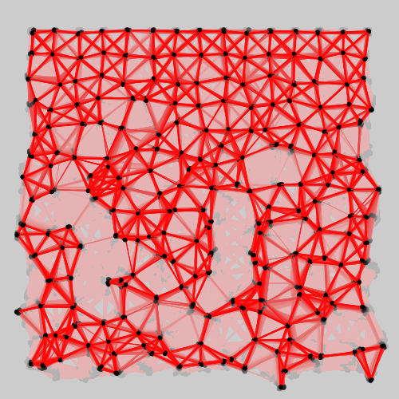

150: [code](https://github.com/villares/sketch-a-day/tree/master/s150) [[Py.Processing](https://villares.github.io/como-instalar-o-processing-modo-python/index-EN)]

----


149b: [code](https://github.com/villares/sketch-a-day/tree/master/s149b) [[Py.Processing](https://villares.github.io/como-instalar-o-processing-modo-python/index-EN)]

----


149: [code](https://github.com/villares/sketch-a-day/tree/master/s149) [[Py.Processing](https://villares.github.io/como-instalar-o-processing-modo-python/index-EN)]

----


148: [code](https://github.com/villares/sketch-a-day/tree/master/s148) [[Py.Processing](https://villares.github.io/como-instalar-o-processing-modo-python/index-EN)]

----


147: [code](https://github.com/villares/sketch-a-day/tree/master/s147) [[Py.Processing](https://villares.github.io/como-instalar-o-processing-modo-python/index-EN)]

----


146: [code](https://github.com/villares/sketch-a-day/tree/master/s146) [[Py.Processing](https://villares.github.io/como-instalar-o-processing-modo-python/index-EN)]

----


145: [code](https://github.com/villares/sketch-a-day/tree/master/s145) [[Py.Processing](https://villares.github.io/como-instalar-o-processing-modo-python/index-EN)]

----


144: [code](https://github.com/villares/sketch-a-day/tree/master/s144) [[Py.Processing](https://villares.github.io/como-instalar-o-processing-modo-python/index-EN)]

----

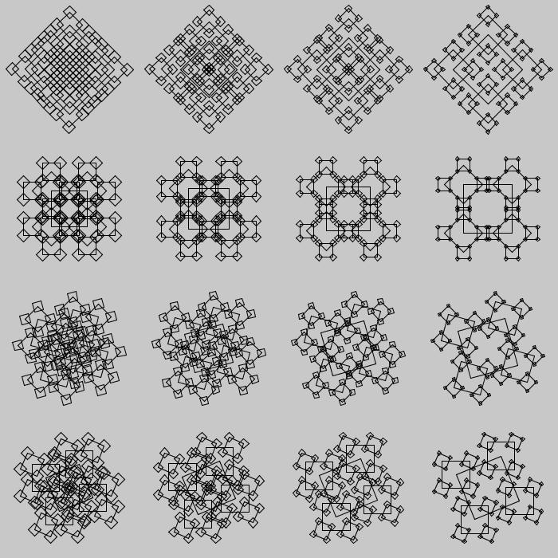

143: [code](https://github.com/villares/sketch-a-day/tree/master/s143)  [[Py.Processing](https://villares.github.io/como-instalar-o-processing-modo-python/index-EN)]

----


140 + 141 + 142 [code](https://github.com/villares/sketch-a-day/tree/master/s140_s141_s142) [[Py.Processing](https://villares.github.io/como-instalar-o-processing-modo-python/index-EN)]

----

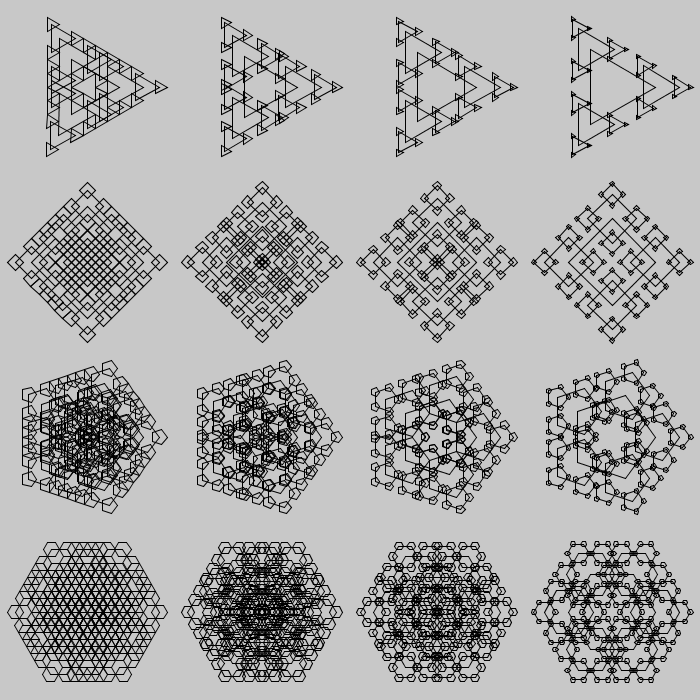

142: [code](https://github.com/villares/sketch-a-day/tree/master/s142)  [[Py.Processing](https://villares.github.io/como-instalar-o-processing-modo-python/index-EN)]

----

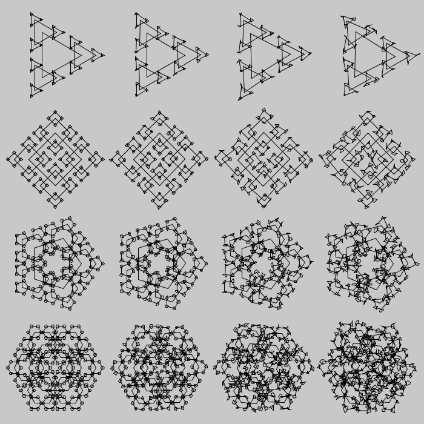

141: [code](https://github.com/villares/sketch-a-day/tree/master/s141)  [[Py.Processing](https://villares.github.io/como-instalar-o-processing-modo-python/index-EN)]

----


s140: [code](https://github.com/villares/sketch-a-day/tree/master/s140)  [[Py.Processing](https://villares.github.io/como-instalar-o-processing-modo-python/index-EN)]

----


s139: [code](https://github.com/villares/sketch-a-day/tree/master/s139)  [[Py.Processing](https://villares.github.io/como-instalar-o-processing-modo-python/index-EN)]

---

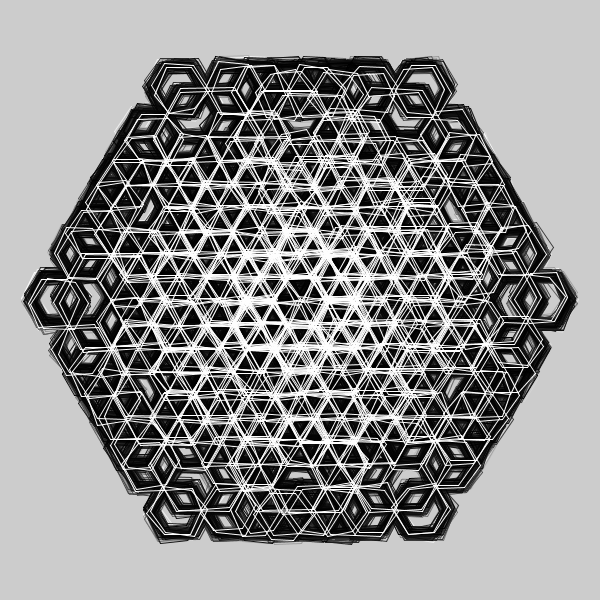

138: [code](https://github.com/villares/sketch-a-day/tree/master/s138)  [[Py.Processing](https://villares.github.io/como-instalar-o-processing-modo-python/index-EN)]

Revisiting ideas of recursion from s071

Heavy animated GIF: [s138.gif](s138/s138.gif)

----


s137: [code](https://github.com/villares/sketch-a-day/tree/master/s137)  [[Py.Processing](https://villares.github.io/como-instalar-o-processing-modo-python/index-EN)]

PDF:  [diagram.pdf](s137/diagram.pdf)

----


136: [code](https://github.com/villares/sketch-a-day/tree/master/s136)  [[Py.Processing](https://villares.github.io/como-instalar-o-processing-modo-python/index-EN)]

----


135: [code](https://github.com/villares/sketch-a-day/tree/master/s135)  [[Py.Processing](https://villares.github.io/como-instalar-o-processing-modo-python/index-EN)]

----


134: [code](https://github.com/villares/sketch-a-day/tree/master/s134)  [[Py.Processing](https://villares.github.io/como-instalar-o-processing-modo-python/index-EN)]

----

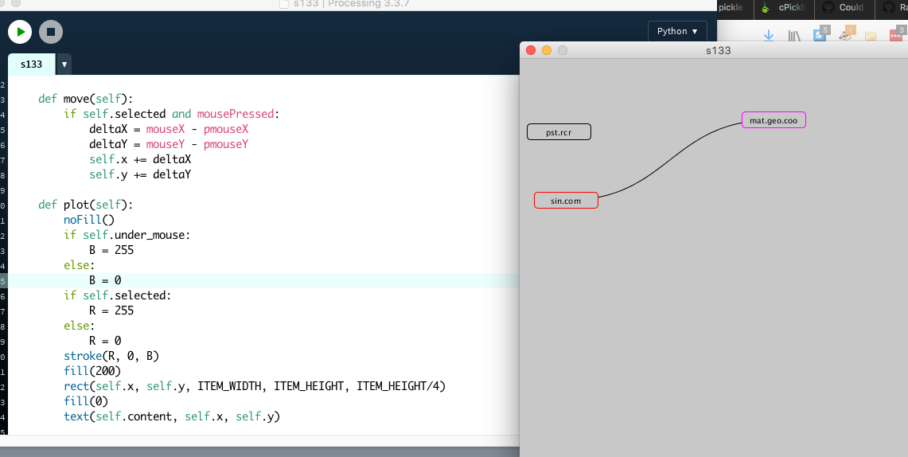

133: [code](https://github.com/villares/sketch-a-day/tree/master/s133)  [[Py.Processing](https://villares.github.io/como-instalar-o-processing-modo-python/index-EN)]

----


132: [code](https://github.com/villares/sketch-a-day/tree/master/s132)  [[Py.Processing](https://villares.github.io/como-instalar-o-processing-modo-python/index-EN)]

----

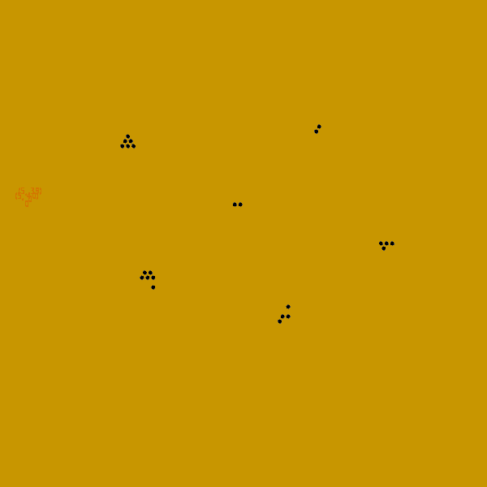

131: [code](https://github.com/villares/sketch-a-day/tree/master/s131)  [[Py.Processing](https://villares.github.io/como-instalar-o-processing-modo-python/index-EN)]

----


130: [code](https://github.com/villares/sketch-a-day/tree/master/s130)  [[Py.Processing](https://villares.github.io/como-instalar-o-processing-modo-python/index-EN)]

----

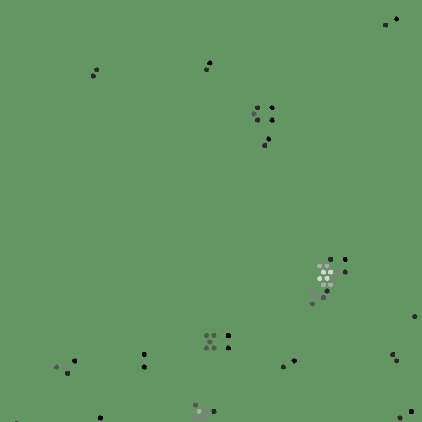

129: [code](https://github.com/villares/sketch-a-day/tree/master/s129)  [[Py.Processing](https://villares.github.io/como-instalar-o-processing-modo-python/index-EN)]

Maybe I fixed it, I guess, not sure…

----


128: [code](https://github.com/villares/sketch-a-day/tree/master/s128)  [[Py.Processing](https://villares.github.io/como-instalar-o-processing-modo-python/index-EN)] 

BROKEN!

----


127: [code](https://github.com/villares/sketch-a-day/tree/master/s127)  [[Py.Processing](https://villares.github.io/como-instalar-o-processing-modo-python/index-EN)]

----


126: [code](https://github.com/villares/sketch-a-day/tree/master/s126)  [[Py.Processing](https://villares.github.io/como-instalar-o-processing-modo-python/index-EN)]

----


125: [code](https://github.com/villares/sketch-a-day/tree/master/s125)  [[Py.Processing](https://villares.github.io/como-instalar-o-processing-modo-python/index-EN)]

----


124: [code](https://github.com/villares/sketch-a-day/tree/master/s124)  [[Py.Processing](https://villares.github.io/como-instalar-o-processing-modo-python/index-EN)]

----


123: [code](https://github.com/villares/sketch-a-day/tree/master/s123)  [[Py.Processing](https://villares.github.io/como-instalar-o-processing-modo-python/index-EN)]

----


122: [code](https://github.com/villares/sketch-a-day/tree/master/s122)  [[Py.Processing](https://villares.github.io/como-instalar-o-processing-modo-python/index-EN)]

----


121: [code](https://github.com/villares/sketch-a-day/tree/master/s121)  [[Py.Processing](https://villares.github.io/como-instalar-o-processing-modo-python/index-EN)]

----


120: [code](https://github.com/villares/sketch-a-day/tree/master/s120)  [[Py.Processing](https://villares.github.io/como-instalar-o-processing-modo-python/index-EN)]

To be brutally honest, I had no idea that reversing the second random grid would bring me this result!

----


119: [code](https://github.com/villares/sketch-a-day/tree/master/s119)  [[Py.Processing](https://villares.github.io/como-instalar-o-processing-modo-python/index-EN)]

----


118: [code](https://github.com/villares/sketch-a-day/tree/master/s118)  [[Py.Processing](https://villares.github.io/como-instalar-o-processing-modo-python/index-EN)]

----


117: [code](https://github.com/villares/sketch-a-day/tree/master/s117)  [[Py.Processing](https://villares.github.io/como-instalar-o-processing-modo-python/index-EN)]

----


116: [code](https://github.com/villares/sketch-a-day/tree/master/s116)  [[Py.Processing](https://villares.github.io/como-instalar-o-processing-modo-python/index-EN)]

----


115: [code](https://github.com/villares/sketch-a-day/tree/master/s115)  [[Py.Processing](https://villares.github.io/como-instalar-o-processing-modo-python/index-EN)]

----


114: [code](https://github.com/villares/sketch-a-day/tree/master/s114)  [[Py.Processing](https://villares.github.io/como-instalar-o-processing-modo-python/index-EN)]

----

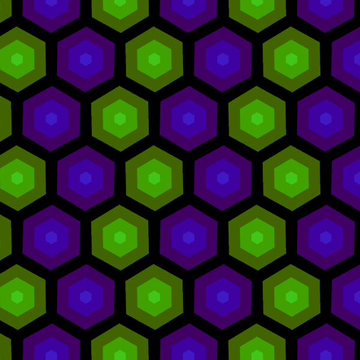

113: [code](https://github.com/villares/sketch-a-day/tree/master/s113)  [[Py.Processing](https://villares.github.io/como-instalar-o-processing-modo-python/index-EN)]

----


112: [code](https://github.com/villares/sketch-a-day/tree/master/s112)  [[Py.Processing](https://villares.github.io/como-instalar-o-processing-modo-python/index-EN)]

Hexagons! 

```python
def hexagon(x, y, r):
    with pushMatrix():
        translate(x, y)
        beginShape()
        for i in range(6):
            vx = cos(i * TWO_PI /6) * r
            vy = sin(i * TWO_PI /6) * r
            vertex(vx, vy)
        endShape(CLOSE)
```

----


111: [code](https://github.com/villares/sketch-a-day/tree/master/s111)  [[Py.Processing](https://villares.github.io/como-instalar-o-processing-modo-python/index-EN)]

Now I 'fixed' the rotation with propper pushMatrix() and translate()

```python
        with pushMatrix():
            translate(x0,y0)
            rotate(fs0)
            stroke(st0)
            equilateral(0, 0, fs0)
        with pushMatrix():
            translate(x1,y1)
            rotate(fs1)
            stroke(st1)
            equilateral(0, 0, fs1)
        with pushMatrix():
            translate(x2,y2)
            rotate(fs2)
            stroke(st2)
            equilateral(0, 0, fs2)
```

----


110: [code](https://github.com/villares/sketch-a-day/tree/master/s110)  [[Py.Processing](https://villares.github.io/como-instalar-o-processing-modo-python/index-EN)]

Just added some rotations to mess things up. It's "wrong", but I like it!

```python
        rotate(fs0)
        stroke(st0)
        equilateral(x0, y0, fs0)
        stroke(st1)
        rotate(fs1)
        equilateral(x1, y1, fs1)
        stroke(st2)
        rotate(fs2)
        equilateral(x2, y2, fs2)

```

----

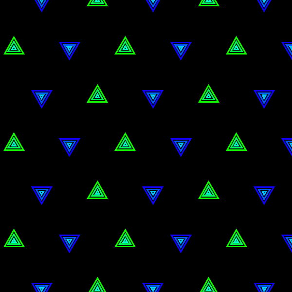

109: [code](https://github.com/villares/sketch-a-day/tree/master/s109)  [[Py.Processing](https://villares.github.io/como-instalar-o-processing-modo-python/index-EN)]

```python
colorMode(HSB)
...
C = color(map(final_size,-63 , 63, 0, 255), 255, 255)
                          
```

----


108: [code](https://github.com/villares/sketch-a-day/tree/master/s108)  [[Py.Processing](https://villares.github.io/como-instalar-o-processing-modo-python/index-EN)]


```python
colorMode(HSB)
...
C = color(map(abs(final_size), 0, 63, 0, 255), 255, 255)

```

----


107: [code](https://github.com/villares/sketch-a-day/tree/master/s107)  [[Py.Processing](https://villares.github.io/como-instalar-o-processing-modo-python/index-EN)]

Inverting odd rows

```python
  v = spac_size * 1.5
    h = spac_size * sqrt(3)
    for ix in range(-1, grid_elem + 1):
        for iy in range(-1, grid_elem + 1):
            if iy % 2:
                x = ix * h + h / 4
                es = elem_size
            else:
                x = ix * h - h / 4
                es = -elem_size
            y = iy * v
            for i in range(3):
                final_size = es * (i + 0.5)
                C = map(final_size, 0, 63, 0, 255)
                oX = rand_posi * random(-1, 1)
                oY = rand_posi * random(-1, 1)
                ELEMENTS.append((C, x + oX, y + oY, final_size))
```

----

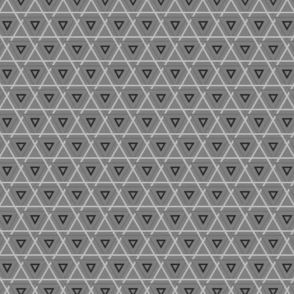

106: [code](https://github.com/villares/sketch-a-day/tree/master/s106)  [[Py.Processing](https://villares.github.io/como-instalar-o-processing-modo-python/index-EN)]

Lazy triangles

```python
def equilateral(x, y, r):
    with pushMatrix():
        translate(x, y)
        triangle(-0.866 * r, -0.5 * r,
                  0.866 * r, -0.5 * r,
                  0.000 * r,  1.0 * r) 
                  # I know... 0 * r and 1 * r...
```

----


105: [code](https://github.com/villares/sketch-a-day/tree/master/s105)  [[Py.Processing](https://villares.github.io/como-instalar-o-processing-modo-python/index-EN)]

Layers now have different "base" sizes (0.5, 1.5 and 2.5 times base size). Removed lines for now.

----


104: [code](https://github.com/villares/sketch-a-day/tree/master/s104)  [[Py.Processing](https://villares.github.io/como-instalar-o-processing-modo-python/index-EN)]

Back to stroke variation

----

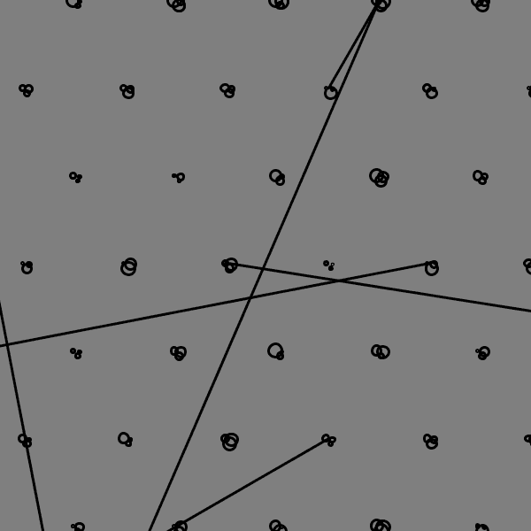

103: [code](https://github.com/villares/sketch-a-day/tree/master/s103)  [[Py.Processing](https://villares.github.io/como-instalar-o-processing-modo-python/index-EN)]

Layers but only black strokes

```python
    spac_size = width / (grid_elem + 1)
    v = spac_size * 1.5
    h = spac_size * sqrt(3)
    for ix in range(-1, grid_elem + 1):
        for iy in range(-1, grid_elem + 1):
            if iy % 2:
                x = ix * h + h / 4
            else:
                x = ix * h - h / 4
            y = iy * v
            for i in range(3):
                final_size = elem_size + rand_size * random(-1, 1)
                ELEMENTS.append((x, y, final_size))
    # three layers of elements            
    for i in range(3):
        offsetX = rand_posi * random(-1, 1)
        offsetY = rand_posi * random(-1, 1)
        for elem in ELEMENTS[i::3]:
            x, y, es = elem
            ellipse(x + offsetX, y + offsetY, es, es)

    for _ in range(grid_elem):
        x1, y1, es1 = rnd_choice(ELEMENTS)
        x2, y2, es2 = rnd_choice(ELEMENTS)
        line(x1, y1, x2, y2)
```

----

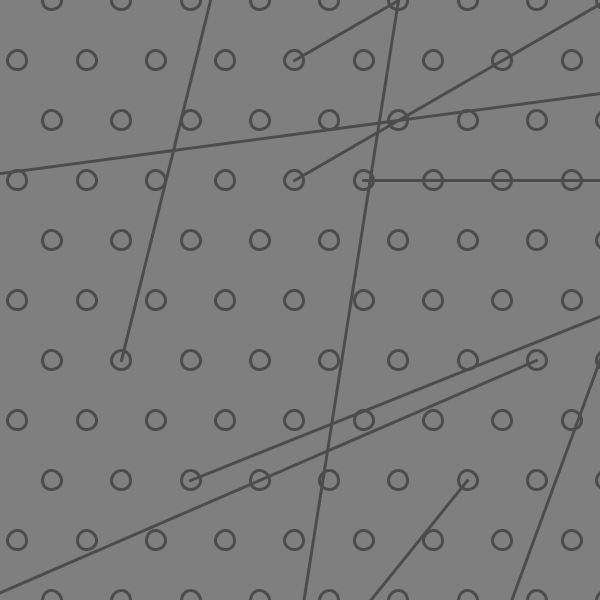

102: [code](https://github.com/villares/sketch-a-day/tree/master/s102)  [[Py.Processing](https://villares.github.io/como-instalar-o-processing-modo-python/index-EN)]

```python
    spac_size = width / (grid_elem + 1)
    v = spac_size * 1.5
    h = spac_size * sqrt(3)
    for ix in range(-1, grid_elem + 1):
        for iy in range(-1, grid_elem + 1):
            if iy % 2:
                x = ix * h + h / 4
            else:
                x = ix * h - h / 4
            y = iy * v
            final_size = elem_size + rand_size * random(-1, 1)
            offsetX = rand_posi * random(-1, 1)
            offsetY = rand_posi * random(-1, 1)
            C = map(final_size, 0, 63, 0, 255)
            ELEMENTS.append((C,
                             x + offsetX,
                             y + offsetY,
                             final_size
                             ))
    for elem in ELEMENTS:
        stroke1, x1, y1, es1 = elem
        ellipse(x1, y1, es1, es1)

    for _ in range(grid_elem):
        stroke1, x1, y1, es1 = rnd_choice(ELEMENTS)
        stroke2, x2, y2, es2 = rnd_choice(ELEMENTS)
        stroke(stroke2)
        line(x1, y1, x2, y2)

```

----

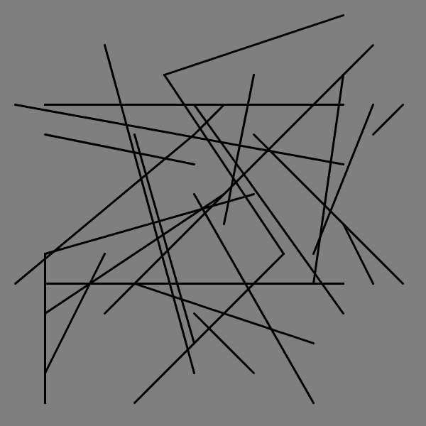

101: [code](https://github.com/villares/sketch-a-day/tree/master/s101)  [[Py.Processing](https://villares.github.io/como-instalar-o-processing-modo-python/index-EN)]

```python
    for _ in range(grid_elem * 2):        
        stroke1, x1, y1, es1 = rnd_choice(ELEMENTS)
        stroke(stroke1)
        ellipse(x1, y1, es1, es1)
        stroke2, x2, y2, es2 = rnd_choice(ELEMENTS)
        stroke(stroke2)
        # line
        ellipse(x2, y2, es2, es2)
        line(x1, y1, x2, y2)
```

----


100: [code](https://github.com/villares/sketch-a-day/tree/master/s100)  [[Py.Processing](https://villares.github.io/como-instalar-o-processing-modo-python/index-EN)]

```python
    spac_size = int(width / (grid_elem + 1))
    for _ in range(2):
        for x in range(spac_size / 2, width, spac_size): 
            for y in range(spac_size / 2, width, spac_size):
                final_size = elem_size + rand_size * random(-1, 1)
                offsetX = rand_posi * random(-1, 1)
                offsetY = rand_posi * random(-1, 1)
                C = map(final_size, 0, 63, 0, 255)
                ELEMENTS.append((C,
                                x + offsetX,
                                y + offsetY,
                                final_size
                                ))
    for stroke_c, x, y, el_size in ELEMENTS:
        stroke(stroke_c)
        ellipse(x, y, el_size, el_size)
    for _ in range(grid_elem):
        stroke_c, x1, y1, _ = rnd_choice(ELEMENTS)
        ________, x2, y2, _ = rnd_choice(ELEMENTS)
        stroke(stroke_c)
        line(x1, y1, x2, y2)
```

----

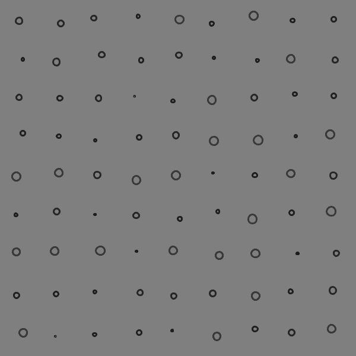

099: [code](https://github.com/villares/sketch-a-day/tree/master/s099)  [[Py.Processing](https://villares.github.io/como-instalar-o-processing-modo-python/index-EN)]
```python
    spac_size = int(width / (grid_elem + 1))
    for x in range(spac_size / 2, width, spac_size):  
        for y in range(spac_size / 2, width, spac_size): 
            final_size = elem_size + rand_size * random(-1, 1)
            offsetX = rand_posi * random(-1, 1)
            offsetY = rand_posi * random(-1, 1)
            GREY = map(final_size, 0, 63, 0, 255)
            stroke(GREY)
            ellipse(x + offsetX,  # desenha um círculo
                 y + offsetY,
                 final_size,
                 final_size)
```
----

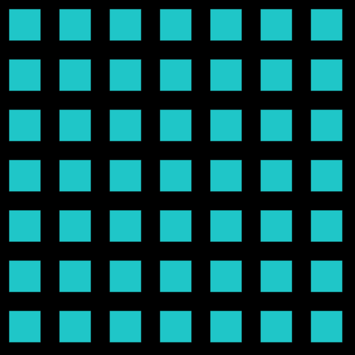

098: [code](https://github.com/villares/sketch-a-day/tree/master/s098)  [[Py.Processing](https://villares.github.io/como-instalar-o-processing-modo-python/index-EN)]

```python
    spac_size = int(width / (grid_elem + 1))
    for x in range(spac_size / 2, width, spac_size):  
        for y in range(spac_size / 2, width, spac_size): 
            square_size = elem_size + rand_size * random(-1, 1)
            offsetX = rand_posi * random(-1, 1)
            offsetY = rand_posi * random(-1, 1)
            HUE = map(offsetX + offsetY, -128, 127, 0, 255)
            SAT = map(square_size, 0, 63, 0, 255)
            fill(HUE, SAT, 255, 200)
            rect(x + offsetX,  # desenha um quadrado
                 y + offsetY,
                 square_size,
                 square_size)
```
----


097: [code](https://github.com/villares/sketch-a-day/tree/master/s097)  [[Py.Processing](https://villares.github.io/como-instalar-o-processing-modo-python/index-EN)]

```python
    spac_size = int(width / (grid_elem + 1))
    for x in range(spac_size / 2, width, spac_size):
        for y in range(spac_size / 2, width, spac_size):
            # sorteia um tamanho (se o rand_size > 0)
            square_size = elem_size + rand_size * random(-1, 1)
            rect(x + rand_posi * random(-1, 1),  # desenha um quadrado
                 y + rand_posi * random(-1, 1),  
                 square_size,
                 square_size)
```
----


096: [code](https://github.com/villares/sketch-a-day/tree/master/s096)  [[Py.Processing](https://villares.github.io/como-instalar-o-processing-modo-python/index-EN)]

More 'Inputs' helper changes (WASD & arrows for sliders). New GIF export helper actually works now!
More lone nodes and edge creation changes...

----

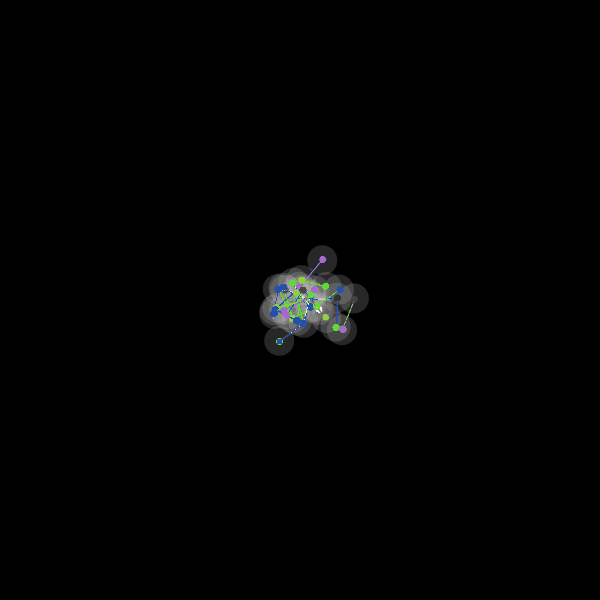

095: [code](https://github.com/villares/sketch-a-day/tree/master/s095)  [[Py.Processing](https://villares.github.io/como-instalar-o-processing-modo-python/index-EN)]

Complete rewrite of the 'Inputs' helper

```
# Ask user for Arduino port, uses slider if none is selected, use on `setup()`
global input
input = Input(Arduino)

# on `draw()`read analog pins 1, 2, 3, 4 or sliders
pot1 = input.analog(1)
pot2 = input.analog(2)
pot3 = input.analog(3)
pot4 = input.analog(4)

tilt = input.digital(13) # also triggered by [space bar]

# When on sliders, this draws them and checks mouse dragging / keystrokes
input.update()

```

----


094: [code](https://github.com/villares/sketch-a-day/tree/master/s094)  [[Py.Processing](https://villares.github.io/como-instalar-o-processing-modo-python/index-EN)]

Connection 'rate' can be less than 1, prevents less than 2 nodes

----


093: [code](https://github.com/villares/sketch-a-day/tree/master/s093)  [[Py.Processing](https://villares.github.io/como-instalar-o-processing-modo-python/index-EN)]

Nodes without connection are now removed

```
    COM_ARESTAS = set()  # para guardar pontos com aresta
    for aresta in Aresta.ARESTAS:
        if (aresta.p1 not in Ponto.SET) or (aresta.p2 not in Ponto.SET)\
                or (aresta.p1 is aresta.p2):  # arestas degeneradas
            Aresta.ARESTAS.remove(aresta)   # remove a aresta
        else:                # senão, tudo OK!
            aresta.desenha()  # desenha a linha
            aresta.puxa_empurra(TAM_ARESTA)  # altera a velocidade dos pontos
            # Adiciona ao conjunto de pontos com aresta
            COM_ARESTAS.update([aresta.p1, aresta.p2])
    Ponto.SET = COM_ARESTAS  # isto remove pontos sem nenhuma aresta
 
```


----

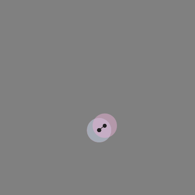

092: [code](https://github.com/villares/sketch-a-day/tree/master/s092)  [[Py.Processing](https://villares.github.io/como-instalar-o-processing-modo-python/index-EN)]

Dynamic change of connection rate

```
if NUM_PONTOS * NUM_CONNECT > len(Aresta.ARESTAS):
        rnd_choice(list(Ponto.SET)).cria_arestas()
    elif NUM_PONTOS * NUM_CONNECT < len(Aresta.ARESTAS):
        Aresta.ARESTAS.remove(rnd_choice(Aresta.ARESTAS))
```

----


091: [code](https://github.com/villares/sketch-a-day/tree/master/s091)  [[Py.Processing](https://villares.github.io/como-instalar-o-processing-modo-python/index-EN)]

Major rethink of my Arduino/Firmata code. I can now choose on start between sliders and potentiometers.

----


090: [code](https://github.com/villares/sketch-a-day/tree/master/s090)  [[Py.Processing](https://villares.github.io/como-instalar-o-processing-modo-python/index-EN)]

Opaque strokes, no fill, randomized colours by column.

----


089: [code](https://github.com/villares/sketch-a-day/tree/master/s089)  [[Py.Processing](https://villares.github.io/como-instalar-o-processing-modo-python/index-EN)]

X stroke now is translucent and grid elements have random colour inside grids.

----

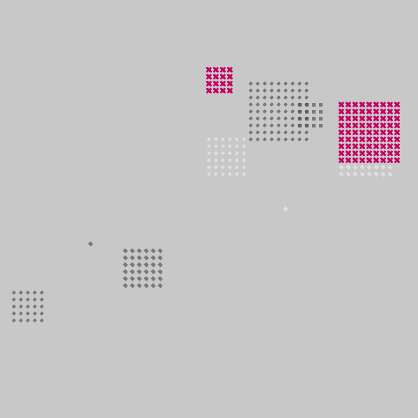

088: [code](https://github.com/villares/sketch-a-day/tree/master/s088)  [[Py.Processing](https://villares.github.io/como-instalar-o-processing-modo-python/index-EN)]

Filled rects, ellipses and losangles (without sktroke) and Xs

----

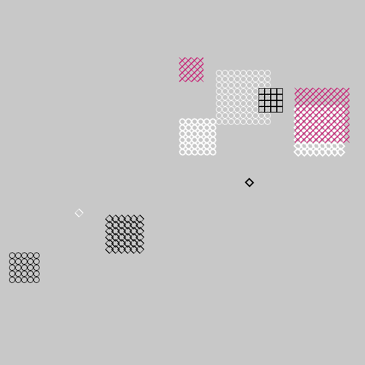

087: [code](https://github.com/villares/sketch-a-day/tree/master/s087)  [[Py.Processing](https://villares.github.io/como-instalar-o-processing-modo-python/index-EN)]

No fill again, less colours. Variable/random number of elements per grid.

----


086: [code](https://github.com/villares/sketch-a-day/tree/master/s086)  [[Py.Processing](https://villares.github.io/como-instalar-o-processing-modo-python/index-EN)]

Translucent fill & some stroke weight

----


085: [code](https://github.com/villares/sketch-a-day/tree/master/s085)  [[Py.Processing](https://villares.github.io/como-instalar-o-processing-modo-python/index-EN)]

Some colour, and some crazy meddling with the Slider class...

----

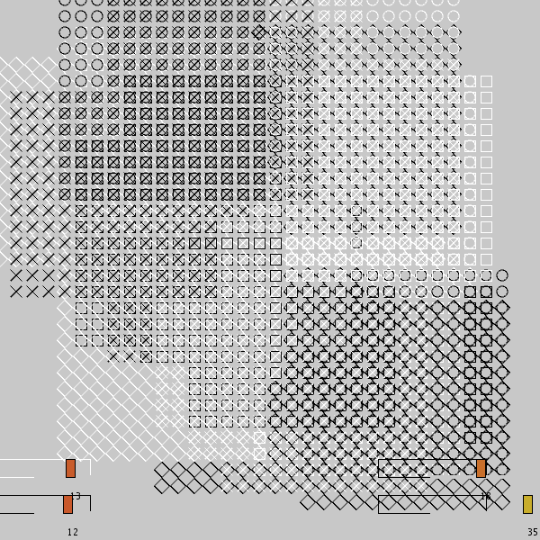

084: [code](https://github.com/villares/sketch-a-day/tree/master/s084)  [[Py.Processing](https://villares.github.io/como-instalar-o-processing-modo-python/index-EN)]

Make the grid's position/origin align based on the spacing size (super- grid)

----


083: [code](https://github.com/villares/sketch-a-day/tree/master/s083)  [[Py.Processing](https://villares.github.io/como-instalar-o-processing-modo-python/index-EN)]

Xs and rotated rectangles

----

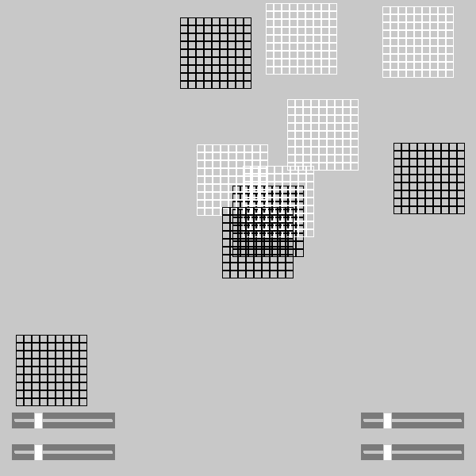

082: [code](https://github.com/villares/sketch-a-day/tree/master/s082)  [[Py.Processing](https://villares.github.io/como-instalar-o-processing-modo-python/index-EN)]

Squares and ellipses

----

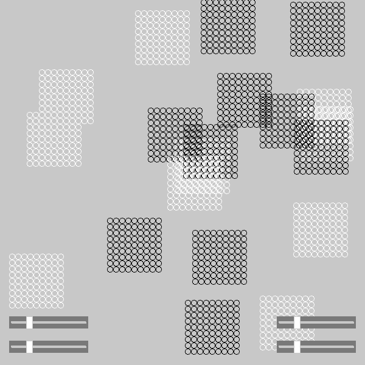

081: [code](https://github.com/villares/sketch-a-day/tree/master/s081)  [[Py.Processing](https://villares.github.io/como-instalar-o-processing-modo-python/index-EN)]

Let's try some grids

----


080: [code](https://github.com/villares/sketch-a-day/tree/master/s080)  [[Py.Processing](https://villares.github.io/como-instalar-o-processing-modo-python/index-EN)]

More arrows (black and white alternate by generation)

----

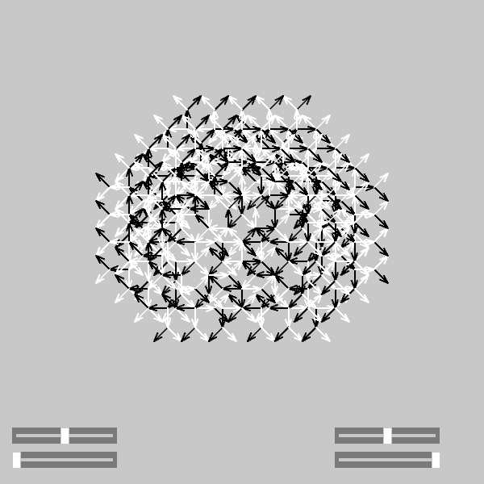

079: [code](https://github.com/villares/sketch-a-day/tree/master/s079)  [[Py.Processing](https://villares.github.io/como-instalar-o-processing-modo-python/index-EN)]

Arrows (right black, left white)

----

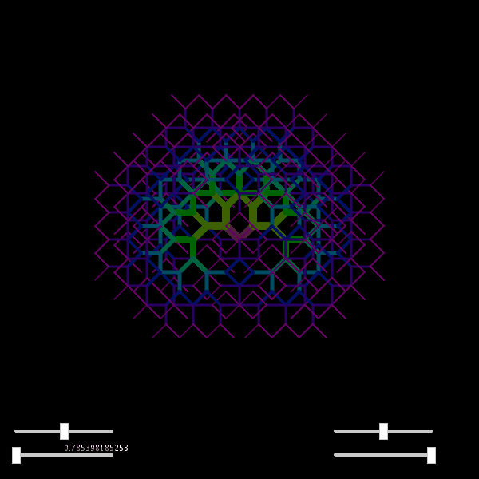

078: [code](https://github.com/villares/sketch-a-day/tree/master/s078)  [[Py.Processing](https://villares.github.io/como-instalar-o-processing-modo-python/index-EN)]

Color

----


077: [code](https://github.com/villares/sketch-a-day/tree/master/s077)  [[Py.Processing](https://villares.github.io/como-instalar-o-processing-modo-python/index-EN)]

Random branch reduction is now less simmetric, and random seed changes on depth change.

----


076: [code](https://github.com/villares/sketch-a-day/tree/master/s076)  [[Py.Processing](https://villares.github.io/como-instalar-o-processing-modo-python/index-EN)]

Stroke weight and some transparency

----


075: [code](https://github.com/villares/sketch-a-day/tree/master/s075)  [[Py.Processing](https://villares.github.io/como-instalar-o-processing-modo-python/index-EN)]

... and slightly different parameters and recursion level control instead of lenght

----


074: [code](https://github.com/villares/sketch-a-day/tree/master/s074)  [[Py.Processing](https://villares.github.io/como-instalar-o-processing-modo-python/index-EN)]

Adaptomg Shiffmans recusive Tree, with sliders or Pots...

----


073: [code](https://github.com/villares/sketch-a-day/tree/master/s073)  [[Py.Processing](https://villares.github.io/como-instalar-o-processing-modo-python/index-EN)]

The code remains ugly :(

----


072: [code](https://github.com/villares/sketch-a-day/tree/master/s072)  [[Py.Processing](https://villares.github.io/como-instalar-o-processing-modo-python/index-EN)]

Let's mix some arrows?

----


071: [code](https://github.com/villares/sketch-a-day/tree/master/s071)  [[Py.Processing](https://villares.github.io/como-instalar-o-processing-modo-python/index-EN)]

Thicker and with a saturation slider (no more scale offset)

----


070: [code](https://github.com/villares/sketch-a-day/tree/master/s070)  [[Py.Processing](https://villares.github.io/como-instalar-o-processing-modo-python/index-EN)]

Thicker and with a saturation slider (no more scale offset)

----


069: [code](https://github.com/villares/sketch-a-day/tree/master/s069)  [[Py.Processing](https://villares.github.io/como-instalar-o-processing-modo-python/index-EN)]

Added rotation.

----


068: [code](https://github.com/villares/sketch-a-day/tree/master/s068)  [[Py.Processing](https://villares.github.io/como-instalar-o-processing-modo-python/index-EN)]

... and with sliders (by [Peter Farell](https://github.com/hackingmath/python-sliders))

----


067: [code](https://github.com/villares/sketch-a-day/tree/master/s067)  [[Py.Processing](https://villares.github.io/como-instalar-o-processing-modo-python/index-EN)]

Something else.

----


066: [code](https://github.com/villares/sketch-a-day/tree/master/s066)  [[Py.Processing](https://villares.github.io/como-instalar-o-processing-modo-python/index-EN)]

Arrow grid networks can be sized and placed...

----


065: [code](https://github.com/villares/sketch-a-day/tree/master/s065)  [[Py.Processing](https://villares.github.io/como-instalar-o-processing-modo-python/index-EN)]

Arrow grid networks are now objects...

----


064: [code](https://github.com/villares/sketch-a-day/tree/master/s064)  [[Py.Processing](https://villares.github.io/como-instalar-o-processing-modo-python/index-EN)]

Revisiting yet an older graph, adding arrows...

----


063: [code](https://github.com/villares/sketch-a-day/tree/master/s063)  [[Py.Processing](https://villares.github.io/como-instalar-o-processing-modo-python/index-EN)]

Revisiting an older graph adding arrows...

----


062: [code](https://github.com/villares/sketch-a-day/tree/master/s062)  [[Py.Processing](https://villares.github.io/como-instalar-o-processing-modo-python/index-EN)]

`+` and `-` keys control the distange/range of targes in 0.5 * SPACING increments

----


061: [code](https://github.com/villares/sketch-a-day/tree/master/s061)  [[Py.Processing](https://villares.github.io/como-instalar-o-processing-modo-python/index-EN)]

Sometimes we have multiple arrows now out of each node...But I reduced the range (distance) they can point to.

----


060: [code](https://github.com/villares/sketch-a-day/tree/master/s060)  [[Py.Processing](https://villares.github.io/como-instalar-o-processing-modo-python/index-EN)]

Complete Object Oriented refactor...

----


059: [code](https://github.com/villares/sketch-a-day/tree/master/s059)  [[Py.Processing](https://villares.github.io/como-instalar-o-processing-modo-python/index-EN)]

Back to a list of points, now every point of the grid has a node. Limited points_to random each.

----


058: [code](https://github.com/villares/sketch-a-day/tree/master/s058)  [[Py.Processing](https://villares.github.io/como-instalar-o-processing-modo-python/index-EN)]

Now with some deepcopy of changeable imutable namedtuples (containing mutable lists), and some lerp()

----


057: [code](https://github.com/villares/sketch-a-day/tree/master/s057)  [[Py.Processing](https://villares.github.io/como-instalar-o-processing-modo-python/index-EN)]

Revisited 54 and now I'm re-selecting random points_to nodes...

----


056: [code](https://github.com/villares/sketch-a-day/tree/master/s056)  [[Py.Processing](https://villares.github.io/como-instalar-o-processing-modo-python/index-EN)]

Arrow grid moving in HSB colour space

----


055: [code](https://github.com/villares/sketch-a-day/tree/master/s055)  [[Py.Processing](https://villares.github.io/como-instalar-o-processing-modo-python/index-EN)]

Grid revisited

----


054: [code](https://github.com/villares/sketch-a-day/tree/master/s054)  [[Py.Processing](https://villares.github.io/como-instalar-o-processing-modo-python/index-EN)]

New arrows! With a "Tail" parameter...

----


053: [code](https://github.com/villares/sketch-a-day/tree/master/s053)  [[Py.Processing](https://villares.github.io/como-instalar-o-processing-modo-python/index-EN)]

Big invisible refactor (no more point-grid to select from, now a list of possible X and Y positons to choose).
On the visible side, fewer elements, and non-pointing elements redrawn in red on top.

----


052: [code](https://github.com/villares/sketch-a-day/tree/master/s052)  [[Py.Processing](https://villares.github.io/como-instalar-o-processing-modo-python/index-EN)]

White lines first, black arrows on top.

----


051: [code](https://github.com/villares/sketch-a-day/tree/master/s051)  [[Py.Processing](https://villares.github.io/como-instalar-o-processing-modo-python/index-EN)]

Points  now on a grid.

----


050: [code](https://github.com/villares/sketch-a-day/tree/master/s050)  [[Py.Processing](https://villares.github.io/como-instalar-o-processing-modo-python/index-EN)]

Arrows now...

----


049: [code](https://github.com/villares/sketch-a-day/tree/master/s049)  [[Py.Processing](https://villares.github.io/como-instalar-o-processing-modo-python/index-EN)]
Yet more graphs

----


048: [code](https://github.com/villares/sketch-a-day/tree/master/s048)  [[Py.Processing](https://villares.github.io/como-instalar-o-processing-modo-python/index-EN)]
Yet more graphs

----


047: [code](https://github.com/villares/sketch-a-day/tree/master/s047)  [[Py.Processing](https://villares.github.io/como-instalar-o-processing-modo-python/index-EN)]
Yet more graphs

----


046: [code](https://github.com/villares/sketch-a-day/tree/master/s046)  [[Py.Processing](https://villares.github.io/como-instalar-o-processing-modo-python/index-EN)]
Yet more graphs

----


045: [code](https://github.com/villares/sketch-a-day/tree/master/s045)  [[Py.Processing](https://villares.github.io/como-instalar-o-processing-modo-python/index-EN)]
Yet more graphs

----


044: [code](https://github.com/villares/sketch-a-day/tree/master/s044)  [[Py.Processing](https://villares.github.io/como-instalar-o-processing-modo-python/index-EN)]
More graphs

----


043: [code](https://github.com/villares/sketch-a-day/tree/master/s043)  [[Py.Processing](https://villares.github.io/como-instalar-o-processing-modo-python/index-EN)]
More graphs

----


042: [code](https://github.com/villares/sketch-a-day/tree/master/s042)  [[Py.Processing](https://villares.github.io/como-instalar-o-processing-modo-python/index-EN)]
Yet another interactive recursive thingy, the image on the right is shown with a key pressed

----


041: [code](https://github.com/villares/sketch-a-day/tree/master/s041)  [[Py.Processing](https://villares.github.io/como-instalar-o-processing-modo-python/index-EN)]
Yet another interactive recursive thingy, the image on the right is shown with a key pressed

----


040: [sketch_180209a](https://github.com/villares/sketch-a-day/tree/master/sketch_180209a)  [[Py.Processing](https://villares.github.io/como-instalar-o-processing-modo-python/index-EN)]
More recursion

----


039: [sketch_180208e](https://github.com/villares/sketch-a-day/tree/master/sketch_180208e)  [[Py.Processing](https://villares.github.io/como-instalar-o-processing-modo-python/index-EN)]
Manoloide  inspired recursion

----


038: [sketch_180208d](https://github.com/villares/sketch-a-day/tree/master/sketch_180208d)  [[Py.Processing](https://villares.github.io/como-instalar-o-processing-modo-python/index-EN)]
Saskia Freeke inspired grid

----


037: [sketch_180206b](https://github.com/villares/sketch-a-day/tree/master/sketch_180206a)  [[Py.Processing](https://villares.github.io/como-instalar-o-processing-modo-python/index-EN)]
"Carnahacking is near!"

----


036: [sketch_180205b](https://github.com/villares/sketch-a-day/tree/master/sketch_180205b)  [[Py.Processing](https://villares.github.io/como-instalar-o-processing-modo-python/index-EN)]
Added some mouse disturbance

----


035: [sketch_180204b](https://github.com/villares/sketch-a-day/tree/master/sketch_180204b)  [[Py.Processing](https://villares.github.io/como-instalar-o-processing-modo-python/index-EN)]
Preparing for "Carnahacking"

----


034: [sketch_180203c](https://github.com/villares/sketch-a-day/tree/master/sketch_180203c)  [[Py.Processing](https://villares.github.io/como-instalar-o-processing-modo-python/index-EN)]
Like 33 but again with "w squared" circles

----


033: [sketch_180202c](https://github.com/villares/sketch-a-day/tree/master/sketch_180202c)  [[Py.Processing](https://villares.github.io/como-instalar-o-processing-modo-python/index-EN)]
Like 32 but again with lines

----


032: [sketch_180201c](https://github.com/villares/sketch-a-day/tree/master/sketch_180201c)  [[Py.Processing](https://villares.github.io/como-instalar-o-processing-modo-python/index-EN)]
Like 29 but with moving points after the gesture is done

----


031: [sketch_180130c](https://github.com/villares/sketch-a-day/tree/master/sketch_180131c)  [[Py.Processing](https://villares.github.io/como-instalar-o-processing-modo-python/index-EN)]
Like 29 but with moving points after the gesture is done

----


030: [sketch_180130c](https://github.com/villares/sketch-a-day/tree/master/sketch_180130c)  [[Py.Processing](https://villares.github.io/como-instalar-o-processing-modo-python/index-EN)]
Like 29 but with 3D and PeasyCam orbit...

----


029: [sketch_180129c](https://github.com/villares/sketch-a-day/tree/master/sketch_180129c)  [[Py.Processing](https://villares.github.io/como-instalar-o-processing-modo-python/index-EN)]
Like 27 but with circles

----


028: [sketch_180128c](https://github.com/villares/sketch-a-day/tree/master/sketch_180128c)  [[Py.Processing](https://villares.github.io/como-instalar-o-processing-modo-python/index-EN)]
Like 27 but on grayscale

----


027: [sketch_180127c](https://github.com/villares/sketch-a-day/tree/master/sketch_180127c)  [[Py.Processing](https://villares.github.io/como-instalar-o-processing-modo-python/index-EN)][YouTube](https://www.youtube.com/watch?v=A-rqkru79Dw)

Saving a list of points to animate colour... Mouse speed changes recorded colour &  strokeWeight()

----


026: [sketch_180126c](https://github.com/villares/sketch-a-day/tree/master/sketch_180126c)  [[Py.Processing](https://villares.github.io/como-instalar-o-processing-modo-python/index-EN)]
Mouse speed changing colour &  strokeWeight()

----


025c: [sketch_180125b](https://github.com/villares/sketch-a-day/tree/master/sketch_180125c)  [[Py.Processing](https://villares.github.io/como-instalar-o-processing-modo-python/index-EN)]
Mouse speed changing strokeWeight()

----


024b: [sketch_180124b](https://github.com/villares/sketch-a-day/tree/master/sketch_180124b)  [[Py.Processing](https://villares.github.io/como-instalar-o-processing-modo-python/index-EN)]  Maybe tomorrow I'll try adding some sliders & movement to this graph ? [nah...]

----


023b: [sketch_180123b](https://github.com/villares/sketch-a-day/tree/master/sketch_180123b)  [[Py.Processing](https://villares.github.io/como-instalar-o-processing-modo-python/index-EN)]  Farrel's Sliders adding random displacement

----

022: missed :(

----


021b: [sketch_180121b](https://github.com/villares/sketch-a-day/tree/master/sketch_180121b)  [[Py.Processing](https://villares.github.io/como-instalar-o-processing-modo-python/index-EN)]
Playing with Peter "[Hacking Math Class](http://twitter.com/hackingmath)" Farrel's Sliders!

----


020b: [sketch_180120b](https://github.com/villares/sketch-a-day/tree/master/sketch_180120b)  [[Py.Processing](https://villares.github.io/como-instalar-o-processing-modo-python/index-EN)]
I was stuck on my DBN conversion sketch 20a, so this HSB shape play is 20b...


020a: [sketch_180120a](https://github.com/villares/sketch-a-day/tree/master/sketch_180120a)  [[Py.Processing](https://villares.github.io/como-instalar-o-processing-modo-python/index-EN)]
Refactored the code generation, removed most of the repeated vertices... C D E G O R not nice yet…

----


019: [sketch_180119a](https://github.com/villares/sketch-a-day/tree/master/sketch_180119a)  [[Py.Processing](https://villares.github.io/como-instalar-o-processing-modo-python/index-EN)] DBN Letters: Now working on a new approach, generating vertex/Shape code, not there yet...

----


018: [sketch_180118a](https://github.com/villares/sketch-a-day/tree/master/sketch_180118a)  [[Py.Processing](https://villares.github.io/como-instalar-o-processing-modo-python/index-EN)] DBN Color font? Nah…

----


017: [sketch_180117a](https://github.com/villares/sketch-a-day/tree/master/sketch_180117a)  [[Py.Processing](https://villares.github.io/como-instalar-o-processing-modo-python/index-EN)] John Maeda's `dbnletters.dbn` code from Design by Numbers on Processing Python Mode

----


016: [16a](https://github.com/villares/sketch-a-day/tree/master/sketch_180116a)  [[Py.Processing](https://villares.github.io/como-instalar-o-processing-modo-python/index-EN)] Converting some Typography code from Design by Numbers, almost there!

----


015: [sketch_180115a](https://github.com/villares/sketch-a-day/tree/master/sketch_180115a)  [[Py.Processing](https://villares.github.io/como-instalar-o-processing-modo-python/index-EN)] Converting some Typography code from Design by Numbers, first trials

----


014: [sketch_180114a](https://github.com/villares/sketch-a-day/tree/master/sketch_180114a)  [[Py.Processing](https://villares.github.io/como-instalar-o-processing-modo-python/index-EN)] Another 3D Graph

----


013: [s180113](https://github.com/villares/sketch-a-day/tree/master/sketch_180113a)  [[Py.Processing](https://villares.github.io/como-instalar-o-processing-modo-python/index-EN)] 3D Graph

----


012: [s180112](https://github.com/villares/sketch-a-day/tree/master/s180112)  [[Py.Processing](https://villares.github.io/como-instalar-o-processing-modo-python/index-EN)] Another Graph Take

----


011: [s180111](https://github.com/villares/sketch-a-day/tree/master/s180111)  [[Py.Processing](https://villares.github.io/como-instalar-o-processing-modo-python/index-EN)] A Graph Take

----


010: [s180110](https://github.com/villares/sketch-a-day/tree/master/s180110)  [[Py.Processing](https://villares.github.io/como-instalar-o-processing-modo-python/index-EN)]  More Manoloide inspired balls [PNG](s180110/s180110.png) (derived from a [sketch](https://gist.github.com/manoloide/16ea9e1d68c6ba1700fcb008fd38aab0) by [Manuel Gamboa Naon](http://manoloide.com))

----


009: [s180109](https://github.com/villares/sketch-a-day/tree/master/s180109)  [[Py.Processing](https://villares.github.io/como-instalar-o-processing-modo-python/index-EN)]  Balls for Manoloide  [GIF](s180109/s180109.gif) (derived from a [sketch](https://gist.github.com/manoloide/16ea9e1d68c6ba1700fcb008fd38aab0) by [Manuel Gamboa Naon](http://manoloide.com))

----


008: [s180108](https://github.com/villares/sketch-a-day/tree/master/s180108)  [[Py.Processing](https://villares.github.io/como-instalar-o-processing-modo-python/index-EN)]   Grid of Platonic Solids in Python Mode [GIF](s180108/s180108.gif)

----


007: [s180107](https://github.com/villares/sketch-a-day/tree/master/s180107) [[Processing Java](https://www.processing.org)]  Another grid of Platonic Solids in Java Mode [GIF](s180107/s180107.gif)

----


006: [s180106](https://github.com/villares/sketch-a-day/tree/master/s180106) [[Processing Java](https://www.processing.org)]  Grid of Platonic Solids in Java Mode  [GIF](s180106/s180106.gif)

----

005: [s180105](https://github.com/villares/sketch-a-day/tree/master/s180105) [[p5js](https://www.p5js.org)] Line Tetrahedrons in p5*js - [interactive](https://villares.github.io/sketch-a-day/s180105/s180105)

----


004: [s180104](https://github.com/villares/sketch-a-day/tree/master/s180104) [[Processing Java](https://www.processing.org)] Tetrahedrons in Java Mode- [GIF](https://github.com/villares/sketch-a-day/tree/master/s180104/s180104.gif)

----


003: [s180103](https://github.com/villares/sketch-a-day/tree/master/s180103) [[Py.Processing](https://villares.github.io/como-instalar-o-processing-modo-python/index-EN)] Tetrahedrons  Python Mode- [GIF](https://github.com/villares/sketch-a-day/tree/master/s180103/s180103.gif)

----

002: [s180102](https://github.com/villares/sketch-a-day/tree/master/s180102) [[Py.Processing](https://villares.github.io/como-instalar-o-processing-modo-python/index-EN)] Many Stars 3D - [YouTube](https://www.youtube.com/watch?v=QmsthW60iBY)

----

001: [s180101](https://github.com/villares/sketch-a-day/tree/master/s180101)[[Py.Processing](https://villares.github.io/como-instalar-o-processing-modo-python/index-EN)] Many Stars - [YouTube](https://www.youtube.com/watch?v=gKWBfghDV_w) (inspired by my own [p5js Xmas & New Year card code](https://github.com/villares/p5js-play/tree/master/newYearStars))
