----
# sketch-a-day
### one visual idea a day [[on GitHub!](https://github.com/villares/sketch-a-day)]

Hi! I'm [Alexandre Villares](https://abav.lugaralgum.com), let's see if I can make one small program (*sketch*) a day. I'm working mostly with [Processing Python Mode](https://villares.github.io/como-instalar-o-processing-modo-python/index-EN) and sometimes [Processing Java Mode](https://processing.org) and[P5JS (JavaScript)](p5js.org) or other stuff.

If you enjoy this, make a small donation [here](https://www.paypal.com/cgi-bin/webscr?cmd=_s-xclick&hosted_button_id=HCGAKACDMVNV2) or with [Patreon](https://patreon.com/arteprog)

----

076: [code](https://github.com/villares/sketch-a-day/tree/master/s076)  [[Py.Processing](https://villares.github.io/como-instalar-o-processing-modo-python/index-EN)]

Stroke weight and some transparency

----

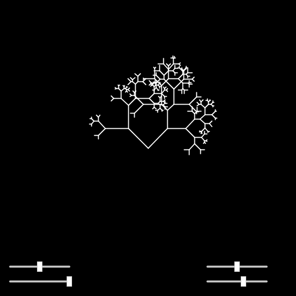

075: [code](https://github.com/villares/sketch-a-day/tree/master/s075)  [[Py.Processing](https://villares.github.io/como-instalar-o-processing-modo-python/index-EN)]

... and slightly different parameters and recursion level control instead of lenght

----

074: [code](https://github.com/villares/sketch-a-day/tree/master/s074)  [[Py.Processing](https://villares.github.io/como-instalar-o-processing-modo-python/index-EN)]

Adaptomg Shiffmans recusive Tree, with sliders or Pots...

----

073: [code](https://github.com/villares/sketch-a-day/tree/master/s073)  [[Py.Processing](https://villares.github.io/como-instalar-o-processing-modo-python/index-EN)]

The code remains ugly :(

----

072: [code](https://github.com/villares/sketch-a-day/tree/master/s072)  [[Py.Processing](https://villares.github.io/como-instalar-o-processing-modo-python/index-EN)]

Let's mix some arrows?

----

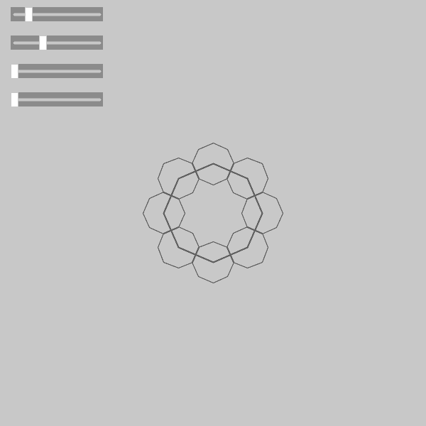

071: [code](https://github.com/villares/sketch-a-day/tree/master/s071)  [[Py.Processing](https://villares.github.io/como-instalar-o-processing-modo-python/index-EN)]

Thicker and with a saturation slider (no more scale offset)

----

070: [code](https://github.com/villares/sketch-a-day/tree/master/s070)  [[Py.Processing](https://villares.github.io/como-instalar-o-processing-modo-python/index-EN)]

Thicker and with a saturation slider (no more scale offset)

----

069: [code](https://github.com/villares/sketch-a-day/tree/master/s069)  [[Py.Processing](https://villares.github.io/como-instalar-o-processing-modo-python/index-EN)]

Added rotation.

----

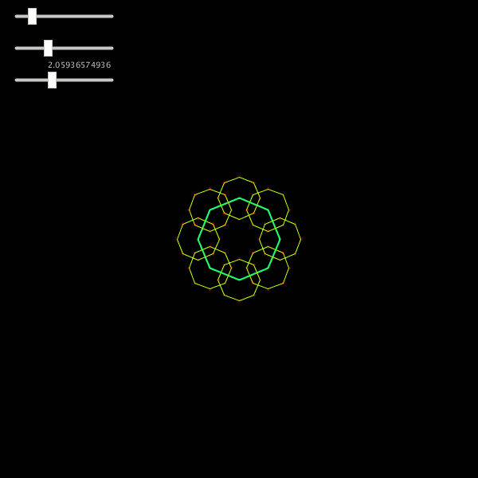

068: [code](https://github.com/villares/sketch-a-day/tree/master/s068)  [[Py.Processing](https://villares.github.io/como-instalar-o-processing-modo-python/index-EN)]

... and with sliders (by [Peter Farell](https://github.com/hackingmath/python-sliders))

----

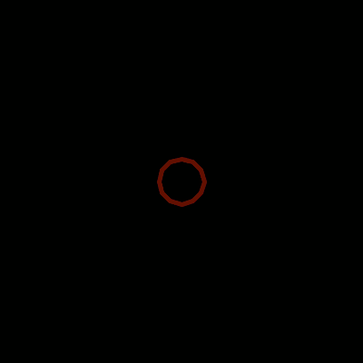

067: [code](https://github.com/villares/sketch-a-day/tree/master/s067)  [[Py.Processing](https://villares.github.io/como-instalar-o-processing-modo-python/index-EN)]

Something else.

----

066: [code](https://github.com/villares/sketch-a-day/tree/master/s066)  [[Py.Processing](https://villares.github.io/como-instalar-o-processing-modo-python/index-EN)]

Arrow grid networks can be sized and placed...

----

065: [code](https://github.com/villares/sketch-a-day/tree/master/s065)  [[Py.Processing](https://villares.github.io/como-instalar-o-processing-modo-python/index-EN)]

Arrow grid networks are now objects...

----

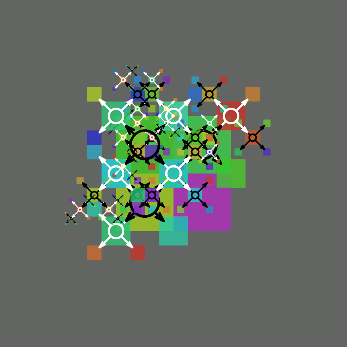

064: [code](https://github.com/villares/sketch-a-day/tree/master/s064)  [[Py.Processing](https://villares.github.io/como-instalar-o-processing-modo-python/index-EN)]

Revisiting yet an older graph, adding arrows...

----

063: [code](https://github.com/villares/sketch-a-day/tree/master/s063)  [[Py.Processing](https://villares.github.io/como-instalar-o-processing-modo-python/index-EN)]

Revisiting an older graph adding arrows...

----

062: [code](https://github.com/villares/sketch-a-day/tree/master/s062)  [[Py.Processing](https://villares.github.io/como-instalar-o-processing-modo-python/index-EN)]

`+` and `-` keys control the distange/range of targes in 0.5 * SPACING increments

----

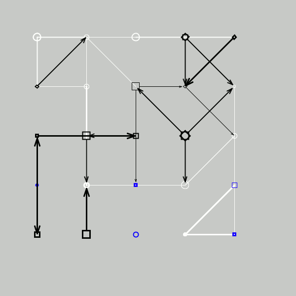

061: [code](https://github.com/villares/sketch-a-day/tree/master/s061)  [[Py.Processing](https://villares.github.io/como-instalar-o-processing-modo-python/index-EN)]

Sometimes we have multiple arrows now out of each node...But I reduced the range (distance) they can point to.

----

060: [code](https://github.com/villares/sketch-a-day/tree/master/s060)  [[Py.Processing](https://villares.github.io/como-instalar-o-processing-modo-python/index-EN)]

Complete Object Oriented refactor...

----

059: [code](https://github.com/villares/sketch-a-day/tree/master/s059)  [[Py.Processing](https://villares.github.io/como-instalar-o-processing-modo-python/index-EN)]

Back to a list of points, now every point of the grid has a node. Limited points_to random each.

----

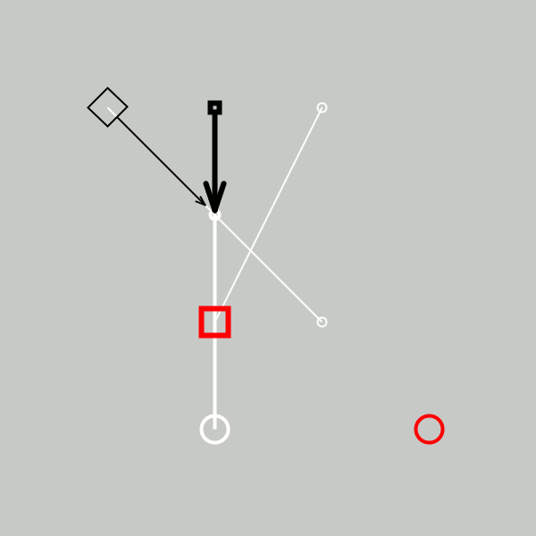

058: [code](https://github.com/villares/sketch-a-day/tree/master/s058)  [[Py.Processing](https://villares.github.io/como-instalar-o-processing-modo-python/index-EN)]

Now with some deepcopy of changeable imutable namedtuples (containing mutable lists), and some lerp()

----

057: [code](https://github.com/villares/sketch-a-day/tree/master/s057)  [[Py.Processing](https://villares.github.io/como-instalar-o-processing-modo-python/index-EN)]

Revisited 54 and now I'm re-selecting random points_to nodes...

----

056: [code](https://github.com/villares/sketch-a-day/tree/master/s056)  [[Py.Processing](https://villares.github.io/como-instalar-o-processing-modo-python/index-EN)] 

Arrow grid moving in HSB colour space

----

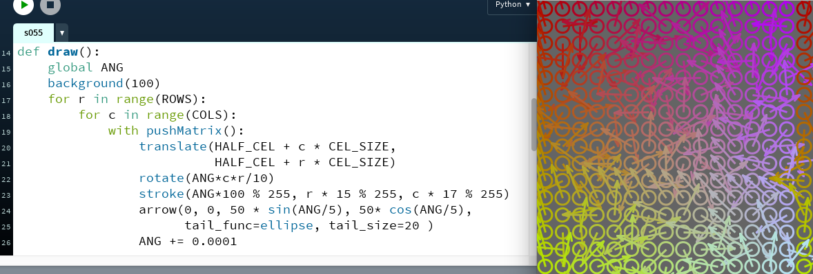

055: [code](https://github.com/villares/sketch-a-day/tree/master/s055)  [[Py.Processing](https://villares.github.io/como-instalar-o-processing-modo-python/index-EN)] 

Grid revisited

----

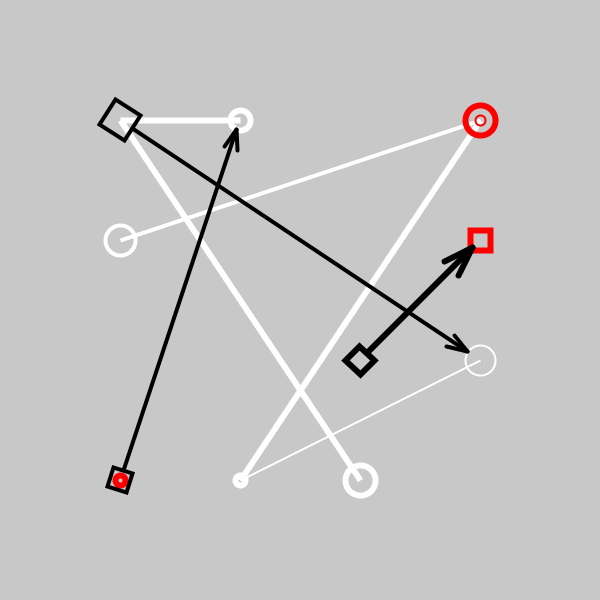

054: [code](https://github.com/villares/sketch-a-day/tree/master/s054)  [[Py.Processing](https://villares.github.io/como-instalar-o-processing-modo-python/index-EN)] 

New arrows! With a "Tail" parameter...

----

053: [code](https://github.com/villares/sketch-a-day/tree/master/s053)  [[Py.Processing](https://villares.github.io/como-instalar-o-processing-modo-python/index-EN)] 

Big invisible refactor (no more point-grid to select from, now a list of possible X and Y positons to choose).
On the visible side, fewer elements, and non-pointing elements redrawn in red on top.

----

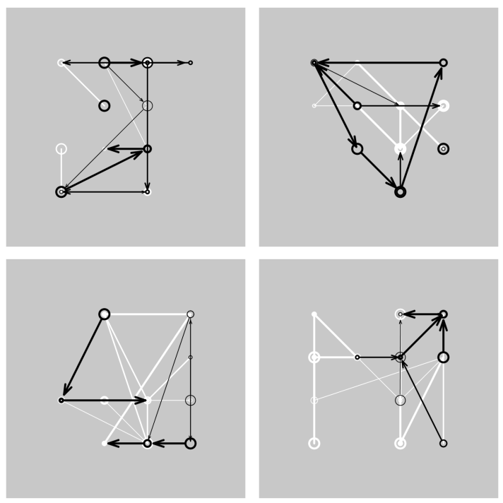

052: [code](https://github.com/villares/sketch-a-day/tree/master/s052)  [[Py.Processing](https://villares.github.io/como-instalar-o-processing-modo-python/index-EN)] 

White lines first, black arrows on top.

----

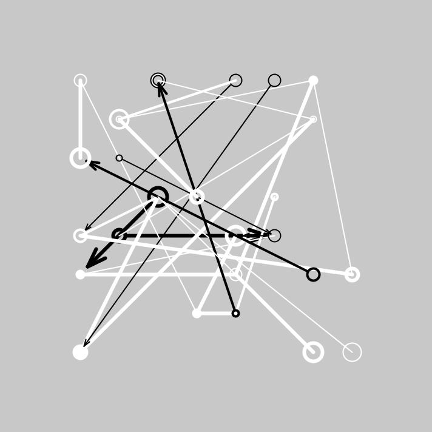

051: [code](https://github.com/villares/sketch-a-day/tree/master/s051)  [[Py.Processing](https://villares.github.io/como-instalar-o-processing-modo-python/index-EN)] 

Points  now on a grid.

----

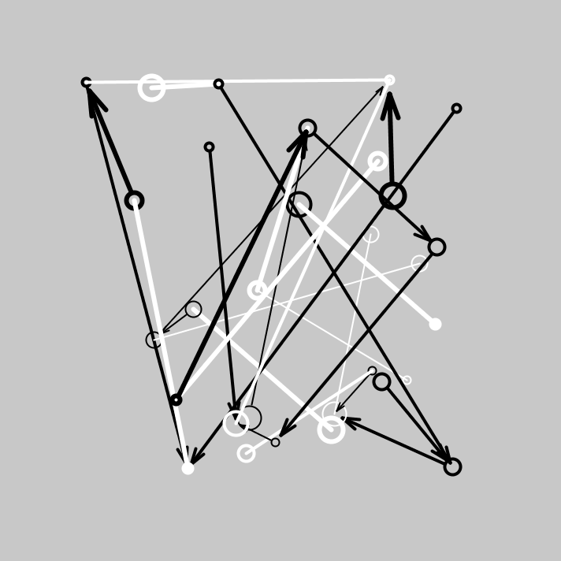

050: [code](https://github.com/villares/sketch-a-day/tree/master/s050)  [[Py.Processing](https://villares.github.io/como-instalar-o-processing-modo-python/index-EN)] 

Arrows now...

----

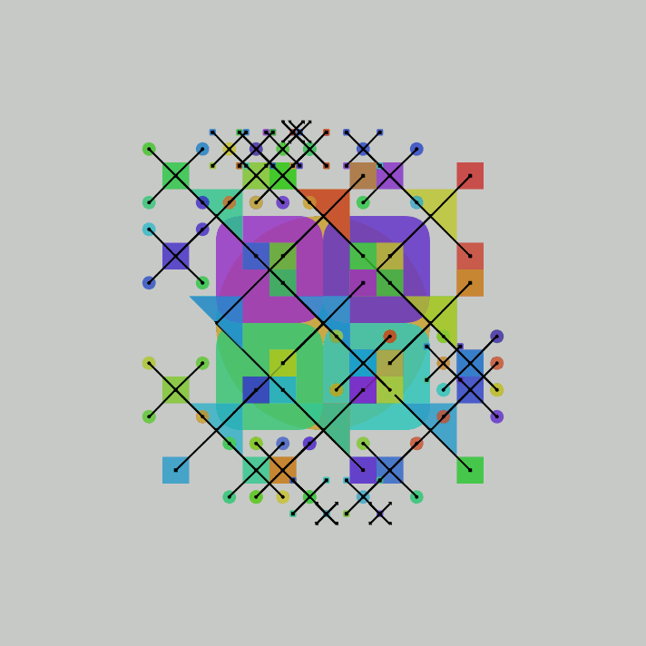

049: [code](https://github.com/villares/sketch-a-day/tree/master/s049)  [[Py.Processing](https://villares.github.io/como-instalar-o-processing-modo-python/index-EN)] 
Yet more graphs

----

048: [code](https://github.com/villares/sketch-a-day/tree/master/s048)  [[Py.Processing](https://villares.github.io/como-instalar-o-processing-modo-python/index-EN)] 
Yet more graphs

----

047: [code](https://github.com/villares/sketch-a-day/tree/master/s047)  [[Py.Processing](https://villares.github.io/como-instalar-o-processing-modo-python/index-EN)] 
Yet more graphs

----

046: [code](https://github.com/villares/sketch-a-day/tree/master/s046)  [[Py.Processing](https://villares.github.io/como-instalar-o-processing-modo-python/index-EN)] 
Yet more graphs

----

045: [code](https://github.com/villares/sketch-a-day/tree/master/s045)  [[Py.Processing](https://villares.github.io/como-instalar-o-processing-modo-python/index-EN)] 
Yet more graphs

----

044: [code](https://github.com/villares/sketch-a-day/tree/master/s044)  [[Py.Processing](https://villares.github.io/como-instalar-o-processing-modo-python/index-EN)] 
More graphs

----

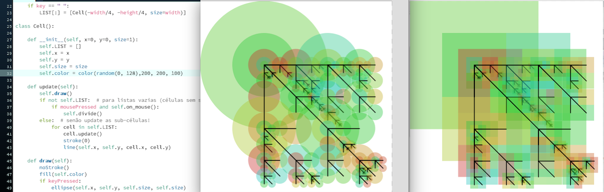

043: [code](https://github.com/villares/sketch-a-day/tree/master/s043)  [[Py.Processing](https://villares.github.io/como-instalar-o-processing-modo-python/index-EN)] 
More graphs

----

042: [code](https://github.com/villares/sketch-a-day/tree/master/s042)  [[Py.Processing](https://villares.github.io/como-instalar-o-processing-modo-python/index-EN)] 
Yet another interactive recursive thingy, the image on the right is shown with a key pressed

----

041: [code](https://github.com/villares/sketch-a-day/tree/master/s041)  [[Py.Processing](https://villares.github.io/como-instalar-o-processing-modo-python/index-EN)] 
Yet another interactive recursive thingy, the image on the right is shown with a key pressed

----

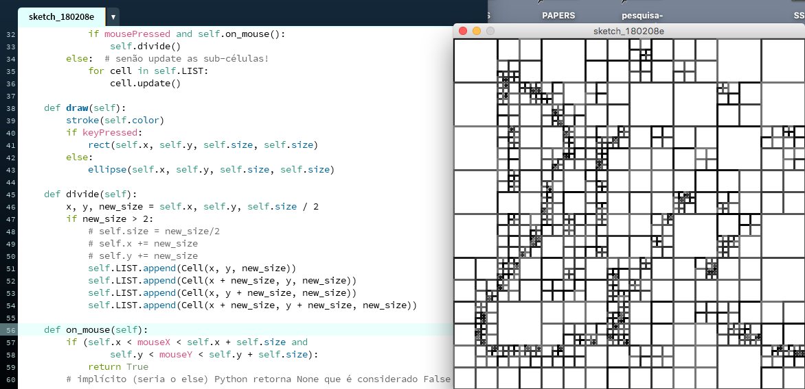

040: [sketch_180209a](https://github.com/villares/sketch-a-day/tree/master/sketch_180209a)  [[Py.Processing](https://villares.github.io/como-instalar-o-processing-modo-python/index-EN)]
More recursion

----

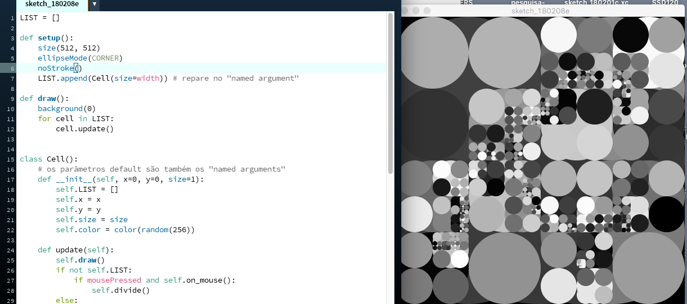

039: [sketch_180208e](https://github.com/villares/sketch-a-day/tree/master/sketch_180208e)  [[Py.Processing](https://villares.github.io/como-instalar-o-processing-modo-python/index-EN)]
Manoloide  inspired recursion

----

038: [sketch_180208d](https://github.com/villares/sketch-a-day/tree/master/sketch_180208d)  [[Py.Processing](https://villares.github.io/como-instalar-o-processing-modo-python/index-EN)]
Saskia Freeke inspired grid

----

037: [sketch_180206b](https://github.com/villares/sketch-a-day/tree/master/sketch_180206a)  [[Py.Processing](https://villares.github.io/como-instalar-o-processing-modo-python/index-EN)]
"Carnahacking is near!"

----

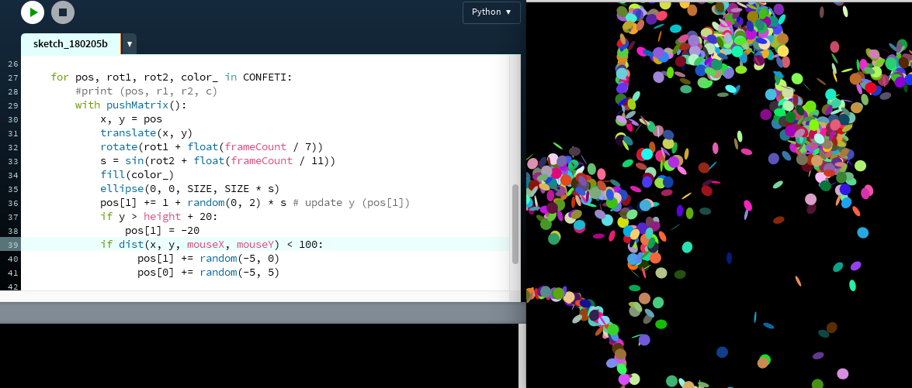

036: [sketch_180205b](https://github.com/villares/sketch-a-day/tree/master/sketch_180205b)  [[Py.Processing](https://villares.github.io/como-instalar-o-processing-modo-python/index-EN)]
Added some mouse disturbance

----

035: [sketch_180204b](https://github.com/villares/sketch-a-day/tree/master/sketch_180204b)  [[Py.Processing](https://villares.github.io/como-instalar-o-processing-modo-python/index-EN)]
Preparing for "Carnahacking"

----

034: [sketch_180203c](https://github.com/villares/sketch-a-day/tree/master/sketch_180203c)  [[Py.Processing](https://villares.github.io/como-instalar-o-processing-modo-python/index-EN)]
Like 33 but again with "w squared" circles 

----

033: [sketch_180202c](https://github.com/villares/sketch-a-day/tree/master/sketch_180202c)  [[Py.Processing](https://villares.github.io/como-instalar-o-processing-modo-python/index-EN)]
Like 32 but again with lines

----

032: [sketch_180201c](https://github.com/villares/sketch-a-day/tree/master/sketch_180201c)  [[Py.Processing](https://villares.github.io/como-instalar-o-processing-modo-python/index-EN)]
Like 29 but with moving points after the gesture is done

----

031: [sketch_180130c](https://github.com/villares/sketch-a-day/tree/master/sketch_180131c)  [[Py.Processing](https://villares.github.io/como-instalar-o-processing-modo-python/index-EN)]
Like 29 but with moving points after the gesture is done

----

030: [sketch_180130c](https://github.com/villares/sketch-a-day/tree/master/sketch_180130c)  [[Py.Processing](https://villares.github.io/como-instalar-o-processing-modo-python/index-EN)]
Like 29 but with 3D and PeasyCam orbit...

----

029: [sketch_180129c](https://github.com/villares/sketch-a-day/tree/master/sketch_180129c)  [[Py.Processing](https://villares.github.io/como-instalar-o-processing-modo-python/index-EN)]
Like 27 but with circles

----

028: [sketch_180128c](https://github.com/villares/sketch-a-day/tree/master/sketch_180128c)  [[Py.Processing](https://villares.github.io/como-instalar-o-processing-modo-python/index-EN)]
Like 27 but on grayscale

----

027: [sketch_180127c](https://github.com/villares/sketch-a-day/tree/master/sketch_180127c)  [[Py.Processing](https://villares.github.io/como-instalar-o-processing-modo-python/index-EN)][YouTube](https://www.youtube.com/watch?v=A-rqkru79Dw)

Saving a list of points to animate colour... Mouse speed changes recorded colour &  strokeWeight()

----

026: [sketch_180126c](https://github.com/villares/sketch-a-day/tree/master/sketch_180126c)  [[Py.Processing](https://villares.github.io/como-instalar-o-processing-modo-python/index-EN)] 
Mouse speed changing colour &  strokeWeight()

----

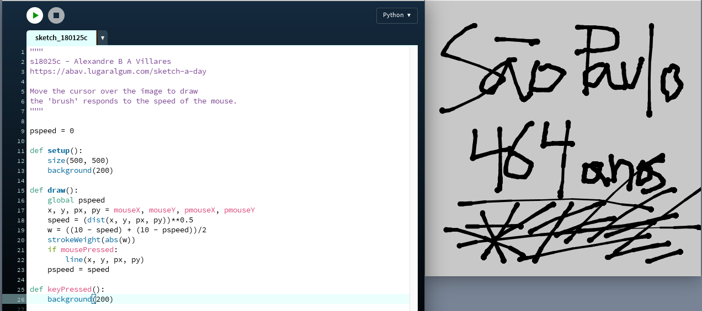

025c: [sketch_180125b](https://github.com/villares/sketch-a-day/tree/master/sketch_180125c)  [[Py.Processing](https://villares.github.io/como-instalar-o-processing-modo-python/index-EN)] 
Mouse speed changing strokeWeight()

----

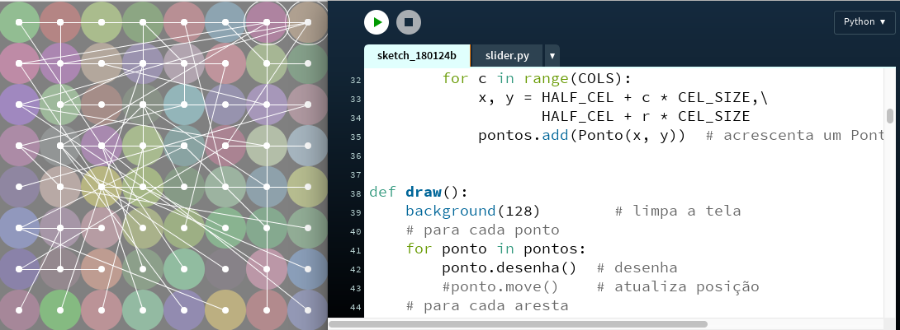

024b: [sketch_180124b](https://github.com/villares/sketch-a-day/tree/master/sketch_180124b)  [[Py.Processing](https://villares.github.io/como-instalar-o-processing-modo-python/index-EN)]  Maybe tomorrow I'll try adding some sliders & movement to this graph ? [nah...]

----

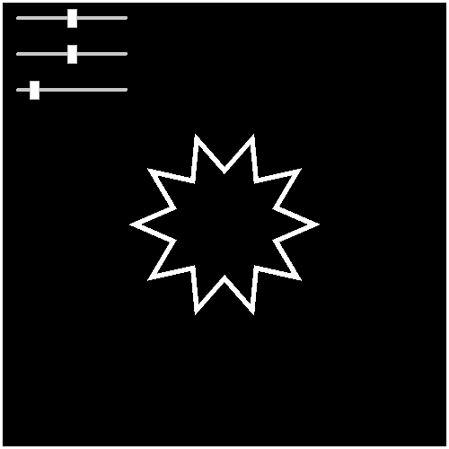

023b: [sketch_180123b](https://github.com/villares/sketch-a-day/tree/master/sketch_180123b)  [[Py.Processing](https://villares.github.io/como-instalar-o-processing-modo-python/index-EN)]  Farrel's Sliders adding random displacement

----

022: missed :(

----

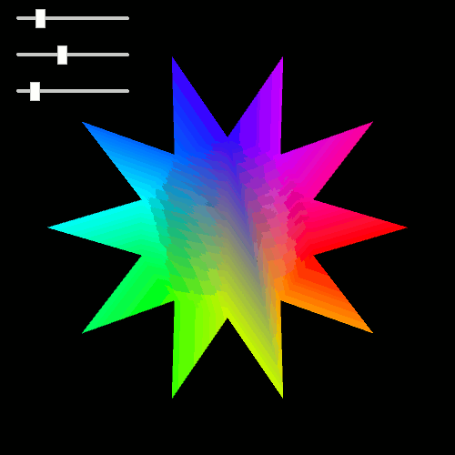

021b: [sketch_180121b](https://github.com/villares/sketch-a-day/tree/master/sketch_180121b)  [[Py.Processing](https://villares.github.io/como-instalar-o-processing-modo-python/index-EN)] 
Playing with Peter "[Hacking Math Class](http://twitter.com/hackingmath)" Farrel's Sliders!

----

020b: [sketch_180120b](https://github.com/villares/sketch-a-day/tree/master/sketch_180120b)  [[Py.Processing](https://villares.github.io/como-instalar-o-processing-modo-python/index-EN)] 
I was stuck on my DBN conversion sketch 20a, so this HSB shape play is 20b...

020a: [sketch_180120a](https://github.com/villares/sketch-a-day/tree/master/sketch_180120a)  [[Py.Processing](https://villares.github.io/como-instalar-o-processing-modo-python/index-EN)] 
Refactored the code generation, removed most of the repeated vertices... C D E G O R not nice yet…

----

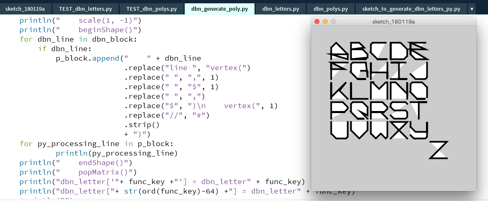

019: [sketch_180119a](https://github.com/villares/sketch-a-day/tree/master/sketch_180119a)  [[Py.Processing](https://villares.github.io/como-instalar-o-processing-modo-python/index-EN)] DBN Letters: Now working on a new approach, generating vertex/Shape code, not there yet...

----

018: [sketch_180118a](https://github.com/villares/sketch-a-day/tree/master/sketch_180118a)  [[Py.Processing](https://villares.github.io/como-instalar-o-processing-modo-python/index-EN)] DBN Color font? Nah… 

----

017: [sketch_180117a](https://github.com/villares/sketch-a-day/tree/master/sketch_180117a)  [[Py.Processing](https://villares.github.io/como-instalar-o-processing-modo-python/index-EN)] John Maeda's `dbnletters.dbn` code from Design by Numbers on Processing Python Mode

----

016: [16a](https://github.com/villares/sketch-a-day/tree/master/sketch_180116a)  [[Py.Processing](https://villares.github.io/como-instalar-o-processing-modo-python/index-EN)] Converting some Typography code from Design by Numbers, almost there!

----

015: [sketch_180115a](https://github.com/villares/sketch-a-day/tree/master/sketch_180115a)  [[Py.Processing](https://villares.github.io/como-instalar-o-processing-modo-python/index-EN)] Converting some Typography code from Design by Numbers, first trials

----

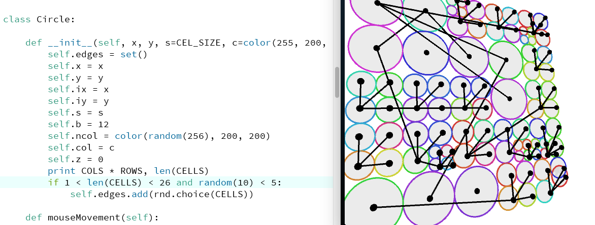

014: [sketch_180114a](https://github.com/villares/sketch-a-day/tree/master/sketch_180114a)  [[Py.Processing](https://villares.github.io/como-instalar-o-processing-modo-python/index-EN)] Another 3D Graph 

----

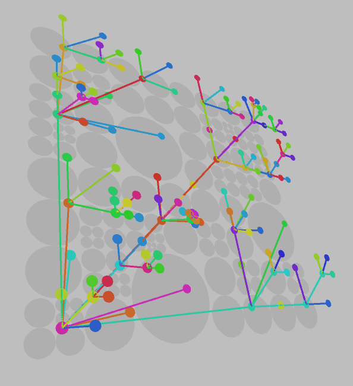

013: [s180113](https://github.com/villares/sketch-a-day/tree/master/sketch_180113a)  [[Py.Processing](https://villares.github.io/como-instalar-o-processing-modo-python/index-EN)] 3D Graph 

----

012: [s180112](https://github.com/villares/sketch-a-day/tree/master/s180112)  [[Py.Processing](https://villares.github.io/como-instalar-o-processing-modo-python/index-EN)] Another Graph Take

----

011: [s180111](https://github.com/villares/sketch-a-day/tree/master/s180111)  [[Py.Processing](https://villares.github.io/como-instalar-o-processing-modo-python/index-EN)] A Graph Take

----

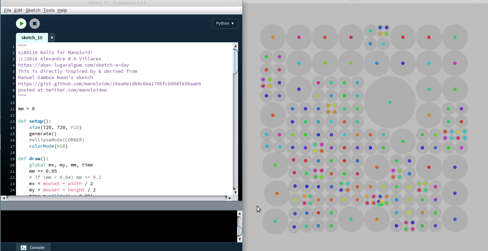

010: [s180110](https://github.com/villares/sketch-a-day/tree/master/s180110)  [[Py.Processing](https://villares.github.io/como-instalar-o-processing-modo-python/index-EN)]  More Manoloide inspired balls [PNG](s180110/s180110.png) (derived from a [sketch](https://gist.github.com/manoloide/16ea9e1d68c6ba1700fcb008fd38aab0) by [Manuel Gamboa Naon](http://manoloide.com))

----

009: [s180109](https://github.com/villares/sketch-a-day/tree/master/s180109)  [[Py.Processing](https://villares.github.io/como-instalar-o-processing-modo-python/index-EN)]  Balls for Manoloide  [GIF](s180109/s180109.gif) (derived from a [sketch](https://gist.github.com/manoloide/16ea9e1d68c6ba1700fcb008fd38aab0) by [Manuel Gamboa Naon](http://manoloide.com))

----

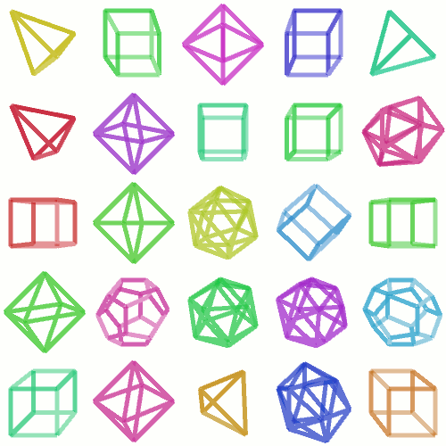

008: [s180108](https://github.com/villares/sketch-a-day/tree/master/s180108)  [[Py.Processing](https://villares.github.io/como-instalar-o-processing-modo-python/index-EN)]   Grid of Platonic Solids in Python Mode [GIF](s180108/s180108.gif)

----

007: [s180107](https://github.com/villares/sketch-a-day/tree/master/s180107) [[Processing Java](https://www.processing.org)]  Another grid of Platonic Solids in Java Mode [GIF](s180107/s180107.gif)

----

006: [s180106](https://github.com/villares/sketch-a-day/tree/master/s180106) [[Processing Java](https://www.processing.org)]  Grid of Platonic Solids in Java Mode  [GIF](s180106/s180106.gif)

----

005: [s180105](https://github.com/villares/sketch-a-day/tree/master/s180105) [[p5js](https://www.p5js.org)] Line Tetrahedrons in p5*js - [interactive](https://villares.github.io/sketch-a-day/s180105/s180105) 

----

004: [s180104](https://github.com/villares/sketch-a-day/tree/master/s180104) [[Processing Java](https://www.processing.org)] Tetrahedrons in Java Mode- [GIF](https://github.com/villares/sketch-a-day/tree/master/s180104/s180104.gif)

----

003: [s180103](https://github.com/villares/sketch-a-day/tree/master/s180103) [[Py.Processing](https://villares.github.io/como-instalar-o-processing-modo-python/index-EN)] Tetrahedrons  Python Mode- [GIF](https://github.com/villares/sketch-a-day/tree/master/s180103/s180103.gif)

----

002: [s180102](https://github.com/villares/sketch-a-day/tree/master/s180102) [[Py.Processing](https://villares.github.io/como-instalar-o-processing-modo-python/index-EN)] Many Stars 3D - [YouTube](https://www.youtube.com/watch?v=QmsthW60iBY)

----

001: [s180101](https://github.com/villares/sketch-a-day/tree/master/s180101)[[Py.Processing](https://villares.github.io/como-instalar-o-processing-modo-python/index-EN)] Many Stars - [YouTube](https://www.youtube.com/watch?v=gKWBfghDV_w) (inspired by my own [p5js Xmas & New Year card code](https://github.com/villares/p5js-play/tree/master/newYearStars))
