# [sketch-a-day](https://abav.lugaralgum.com/sketch-a-day)

#### coding a visual idea a day

Welcome! My name is [Alexandre Villares](https://abav.lugaralgum.com) and since January, 2018 I have been coding *sketches* everyday, publishing the source code in the same repository that stores this page, [github.com/villares/sketch-a-day](https://github.com/villares/sketch-a-day).

The results are mostly tentative, exploratory, and I don’t feel like they need to be relevant or meaningful on any particular day. The everyday practice leads to the emergence of ideas that I consider interesting, worthy of further exploration. Some of those have been added to [selected work](https://abav.lugaralgum.com/selected-work/index-EN.html), this collection itself became valuable for me, and it is my pleasure to share it with anyone willing to explore coding as a creative and expressive medium.

Please do not hesitate to [contact me](http://contato.lugaralgum.com) regarding licenses to use my work, teaching opportunities, consulting or other projects. Moreover, I kindly invite you to subscribe to my newsletter, [[sketch-mail](https://abav.lugaralgum.com/sketch-mail)]. If you appreciate what I have been doing, you may support my artistic work, research and open educational resources I publish on-line using [gumroad.com/villares](https://gumroad.com/villares) or [PayPal](https://www.paypal.com/cgi-bin/webscr?cmd=_s-xclick&hosted_button_id=HCGAKACDMVNV2).

Here are listed some of the tools I have been using:

- [[Py.Processing](https://villares.github.io/como-instalar-o-processing-modo-python/index-EN)] Processing Python mode
- [[Processing Java](https://processing.org]) Processing Java or "standard" mode
- [[p5.js](https://p5js.org)] JavaScript library from the Processing Foundation
- [[pyp5js](https://berinhard.github.io/pyp5js/)] initially a Python to p5js trancriptor, now a pyodide + p5js tool
- [[shoebot](https://shoebot.github.io/shoebot/)] Generate 2D vector graphics with Python
- [[py5](https://py5.ixora.io/)] A new Processing Java + Python 3 amazing tool
- [[p5py](https://github.com/p5py/p5)] A new Python 3 implementation of Processing ideas (no Java needed)
- [[flat](https://xxyxyz.org/flat)] A generative infrastructure library for Python (via Allison Parrish's [Bezmerizing](https://github.com/aparrish/bezmerizing))
- [[VPython](https://vpython.org/)] Python + glowscript gives you 3D on the browser
- [[FreeCAD](https://freecadweb.org)] A wonderful 3D modeling tool, CAD & more, Python infused.

---

## [2018](2018.md) | [2019](2019.md) | [2020](2020.md) | [2021](2021.md) | 2022

---

### sketch_2022_03_02_arcs

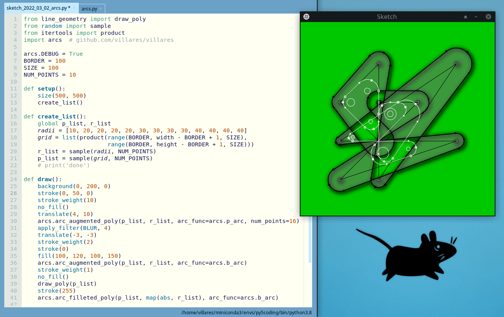

[sketch_2022_03_02_arcs](https://github.com/villares/sketch-a-day/tree/master/2022/sketch_2022_03_02_arcs) [[py5](https://py5.ixora.io/)]

---

### sketch_2022_03_01_shapely

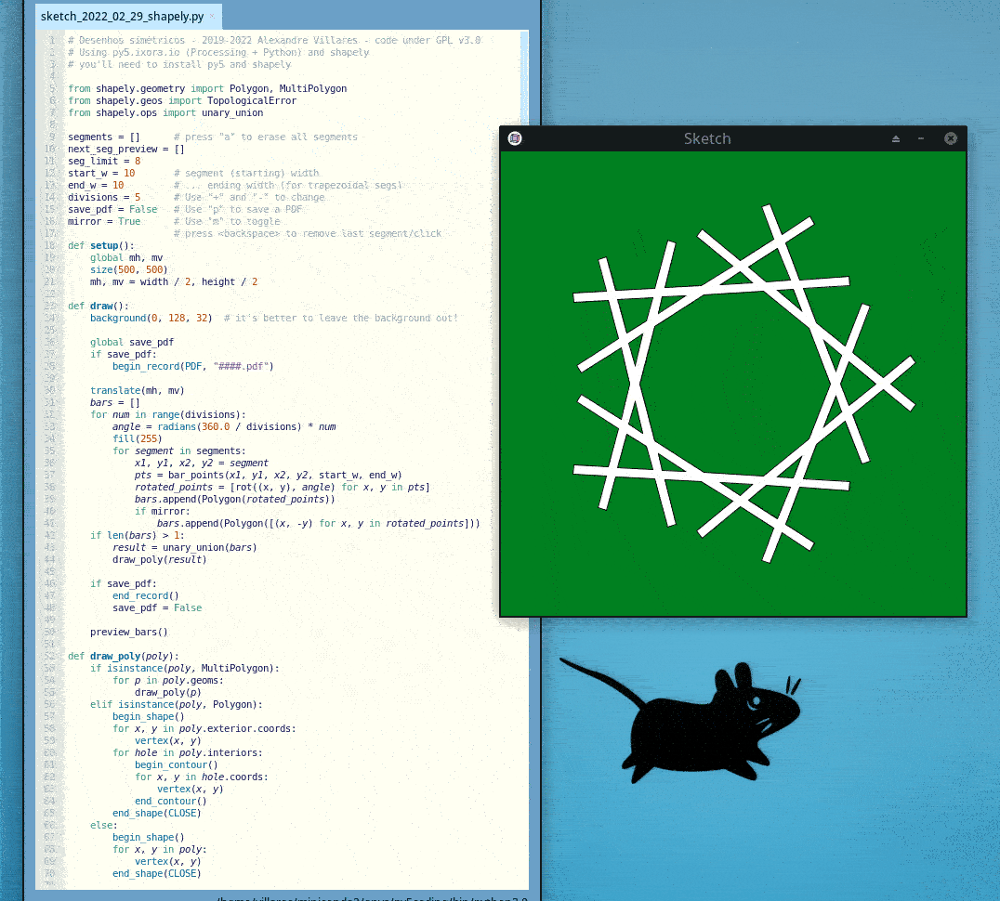

[sketch_2022_03_01_shapely](https://github.com/villares/sketch-a-day/tree/master/2022/sketch_2022_03_01_shapely) [[py5](https://py5.ixora.io/)]

---

### sketch_2022_02_28a_geomerative

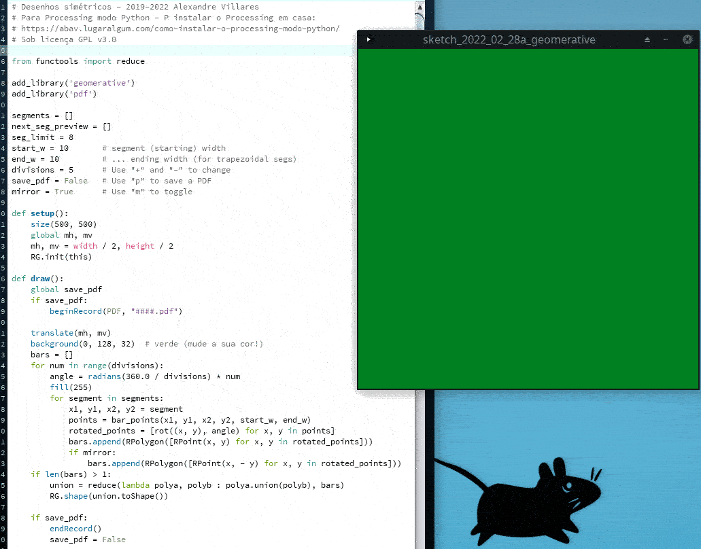

[sketch_2022_02_28a_geomerative](https://github.com/villares/sketch-a-day/tree/master/2022/sketch_2022_02_28a_geomerative) [[Py.Processing](https://villares.github.io/como-instalar-o-processing-modo-python/index-EN)]

---

### sketch_2022_02_27a_geomerative

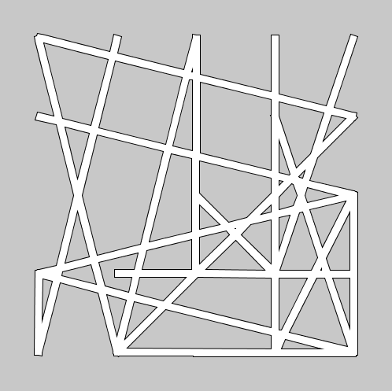

[sketch_2022_02_27a_geomerative](https://github.com/villares/sketch-a-day/tree/master/2022/sketch_2022_02_27a_geomerative) [[Py.Processing](https://villares.github.io/como-instalar-o-processing-modo-python/index-EN)]

---

### sketch_2022_02_26a

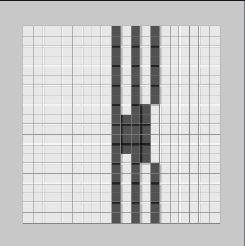

[sketch_2022_02_26a](https://github.com/villares/sketch-a-day/tree/master/2022/sketch_2022_02_26a) [[Py.Processing](https://villares.github.io/como-instalar-o-processing-modo-python/index-EN)]

---

### sketch_2022_02_25a

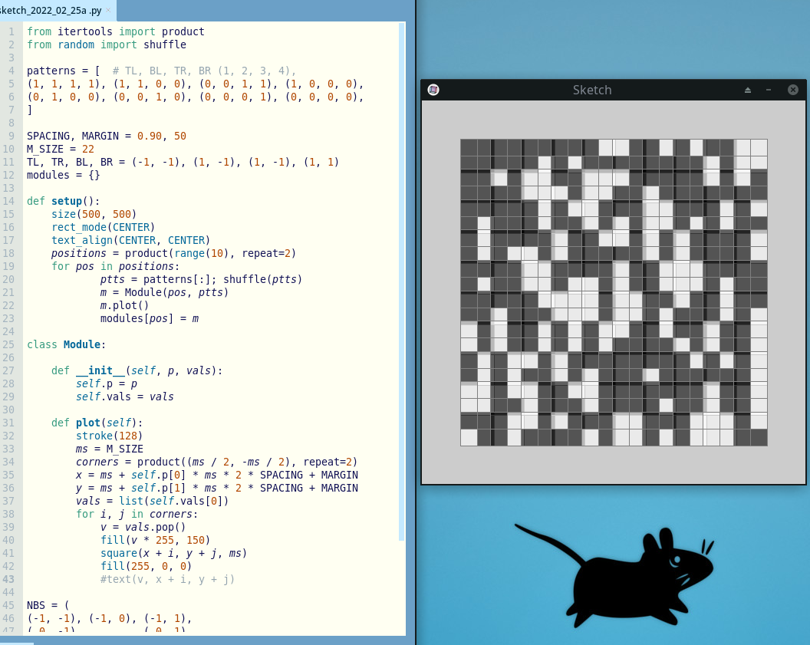

[sketch_2022_02_25a](https://github.com/villares/sketch-a-day/tree/master/2022/sketch_2022_02_25a) [[Py.Processing](https://villares.github.io/como-instalar-o-processing-modo-python/index-EN)]

---

### sketch_2022_02_24a

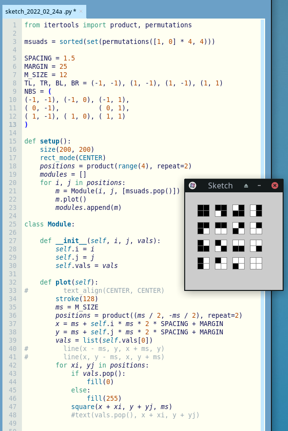

[sketch_2022_02_24a](https://github.com/villares/sketch-a-day/tree/master/2022/sketch_2022_02_24a) [[Py.Processing](https://villares.github.io/como-instalar-o-processing-modo-python/index-EN)]

---

### sketch_2022_02_23a

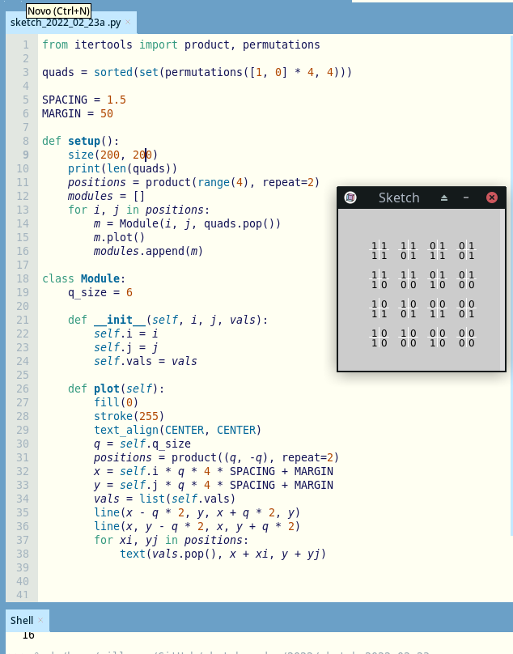

[sketch_2022_02_23a](https://github.com/villares/sketch-a-day/tree/master/2022/sketch_2022_02_23a) [[Py.Processing](https://villares.github.io/como-instalar-o-processing-modo-python/index-EN)]

---

### sketch_2022_02_22_prime_spiral

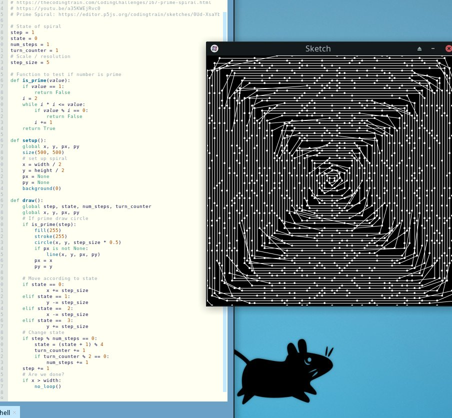

[sketch_2022_02_22_prime_spiral](https://github.com/villares/sketch-a-day/tree/master/2022/sketch_2022_02_22_prime_spiral) [[Py.Processing](https://villares.github.io/como-instalar-o-processing-modo-python/index-EN)]

---

### sketch_2022_02_21_prime_spiral

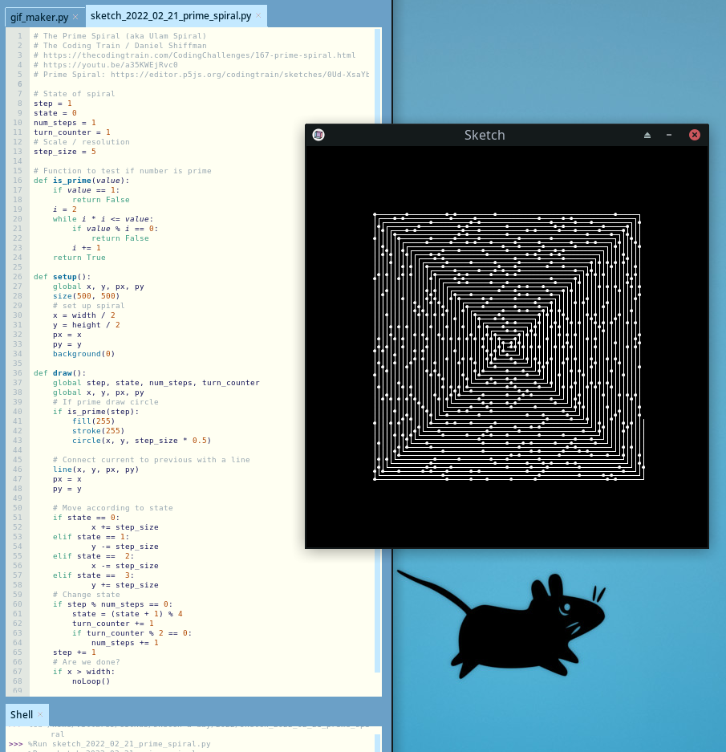

[sketch_2022_02_21_prime_spiral](https://github.com/villares/sketch-a-day/tree/master/2022/sketch_2022_02_21_prime_spiral) [[py5](https://py5.ixora.io/)]
---

### sketch_2022_02_18_circle_sphere

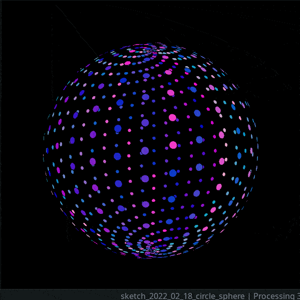

[sketch_2022_02_18_circle_sphere](https://github.com/villares/sketch-a-day/tree/master/2022/sketch_2022_02_18_circle_sphere) [[Py.Processing](https://villares.github.io/como-instalar-o-processing-modo-python/index-EN)]

---

### sketch_2022_02_17_circle_sphere

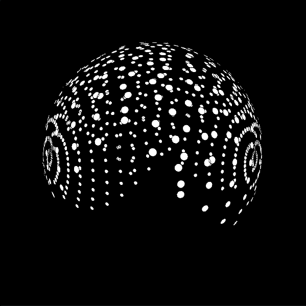

[sketch_2022_02_17_circle_sphere](https://github.com/villares/sketch-a-day/tree/master/2022/sketch_2022_02_17_circle_sphere) [[Py.Processing](https://villares.github.io/como-instalar-o-processing-modo-python/index-EN)]

---

### sketch_2022_02_16_circle_sphere

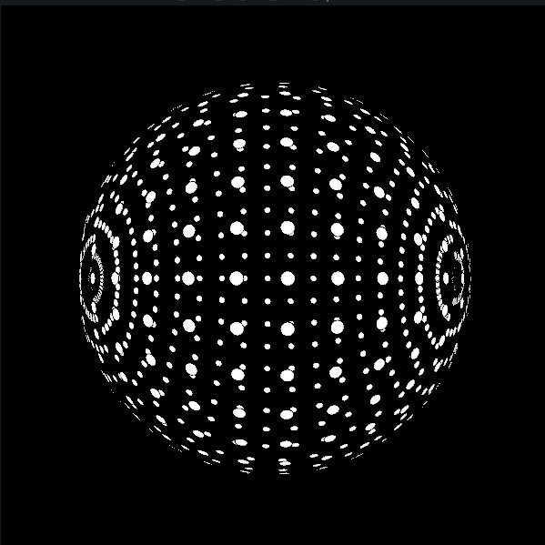

[sketch_2022_02_16_circle_sphere](https://github.com/villares/sketch-a-day/tree/master/2022/sketch_2022_02_16_circle_sphere) [[Py.Processing](https://villares.github.io/como-instalar-o-processing-modo-python/index-EN)]

---

### sketch_2022_02_15hamsa

[sketch_2022_02_15hamsa](https://github.com/villares/sketch-a-day/tree/master/2022/sketch_2022_02_15hamsa) [[Py.Processing](https://villares.github.io/como-instalar-o-processing-modo-python/index-EN)]

---

### sketch_2022_02_14_opencv

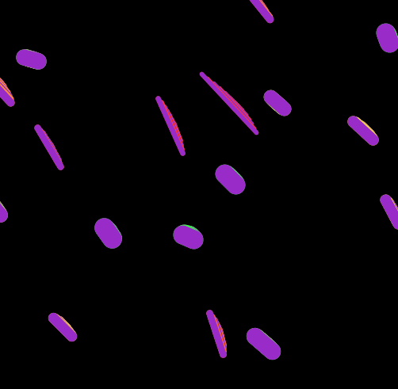

[sketch_2022_02_14_opencv](https://github.com/villares/sketch-a-day/tree/master/2022/sketch_2022_02_14_opencv) [[Py.Processing](https://villares.github.io/como-instalar-o-processing-modo-python/index-EN)]

---

### sketch_2022_02_13a

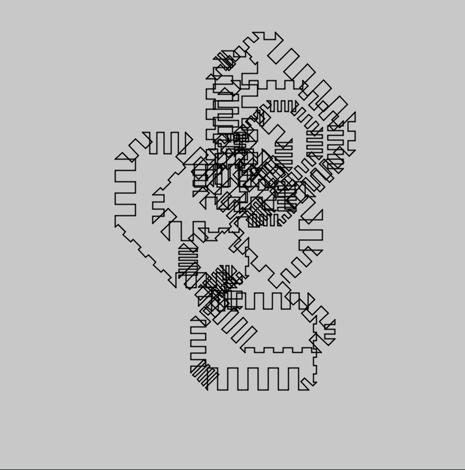

[sketch_2022_02_13a](https://github.com/villares/sketch-a-day/tree/master/2022/sketch_2022_02_13a) [[Py.Processing](https://villares.github.io/como-instalar-o-processing-modo-python/index-EN)]

---

### sketch_2022_02_12a

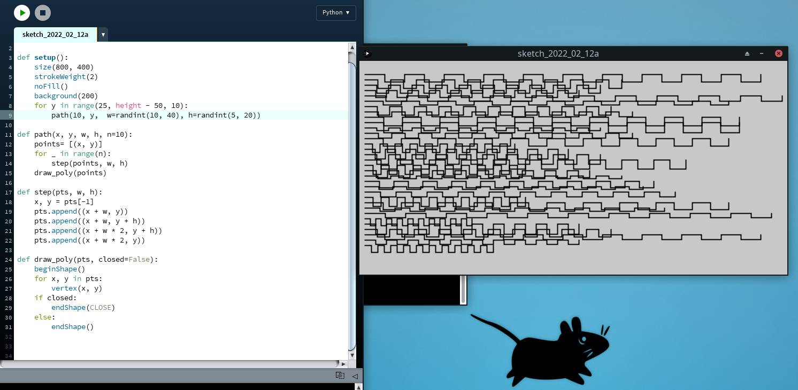

[sketch_2022_02_12a](https://github.com/villares/sketch-a-day/tree/master/2022/sketch_2022_02_12a) [[Py.Processing](https://villares.github.io/como-instalar-o-processing-modo-python/index-EN)]

---

### sketch_2022_02_11

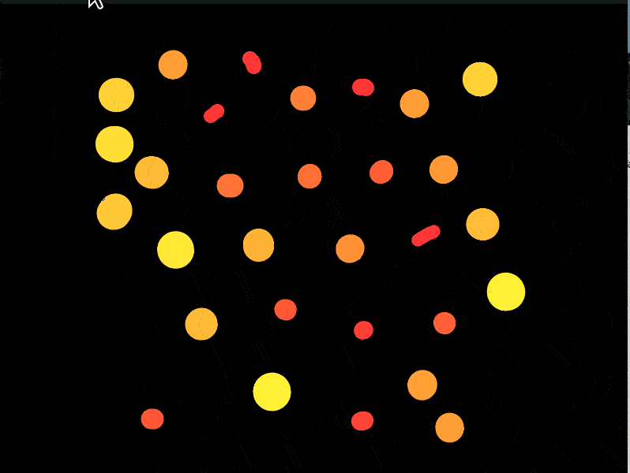

[sketch_2022_02_11](https://github.com/villares/sketch-a-day/tree/master/2022/sketch_2022_02_11) [[Py.Processing](https://villares.github.io/como-instalar-o-processing-modo-python/index-EN)]

---

### sketch_2022_02_10

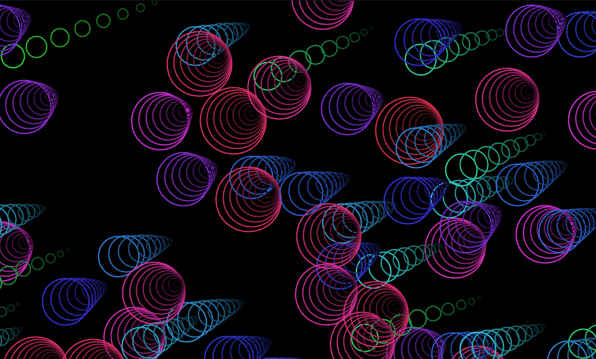

[sketch_2022_02_10](https://github.com/villares/sketch-a-day/tree/master/2022/sketch_2022_02_10) [[Py.Processing](https://villares.github.io/como-instalar-o-processing-modo-python/index-EN)]

---

### sketch_2022_02_09

[sketch_2022_02_09](https://github.com/villares/sketch-a-day/tree/master/2022/sketch_2022_02_09) [[Py.Processing](https://villares.github.io/como-instalar-o-processing-modo-python/index-EN)]

---

### sketch_2022_02_08

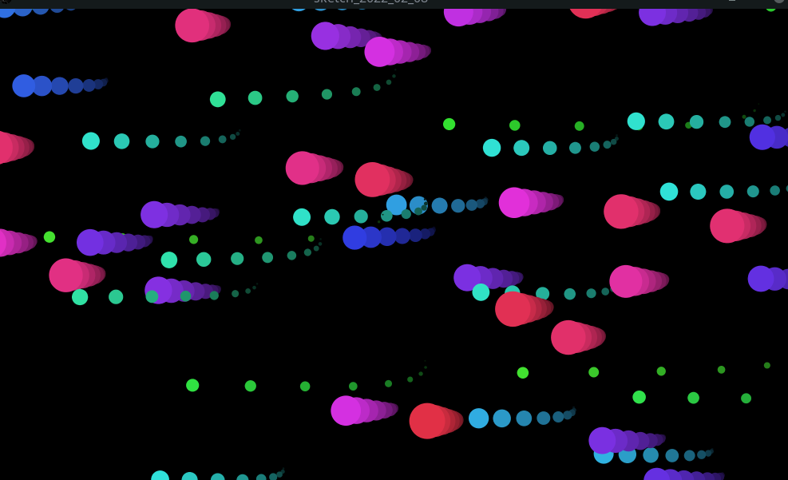

[sketch_2022_02_08](https://github.com/villares/sketch-a-day/tree/master/2022/sketch_2022_02_08) [[Py.Processing](https://villares.github.io/como-instalar-o-processing-modo-python/index-EN)]

---

### sketch_2022_02_07py5

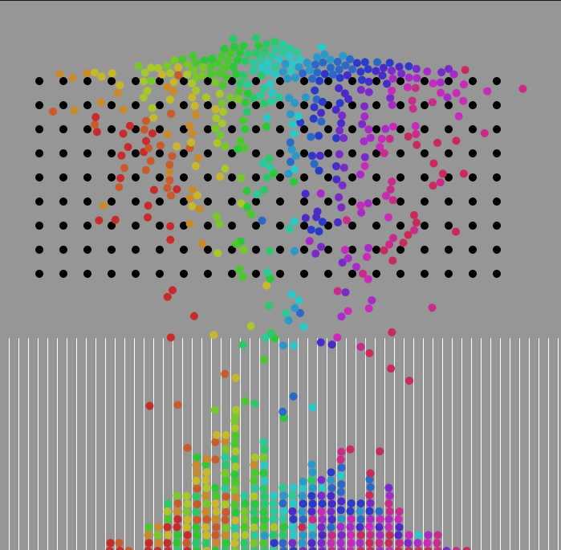

[sketch_2022_02_07py5](https://github.com/villares/sketch-a-day/tree/master/2022/sketch_2022_02_07py5) [[py5](https://py5.ixora.io/)]

---

### sketch_2022_02_06py5

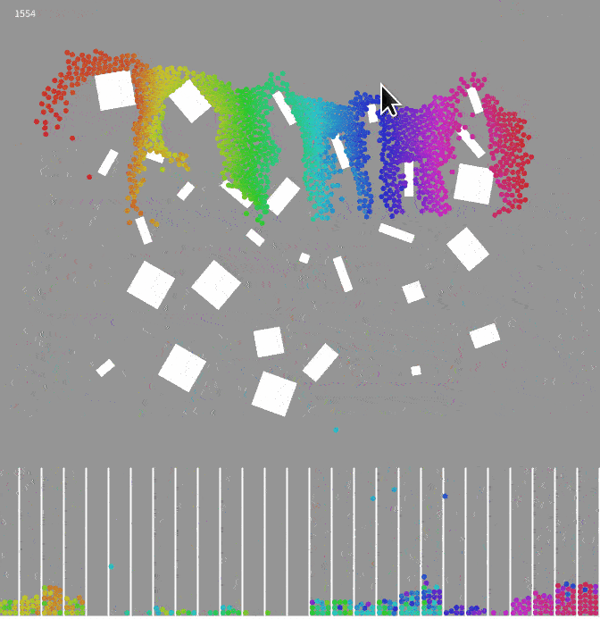

[sketch_2022_02_06py5](https://github.com/villares/sketch-a-day/tree/master/2022/sketch_2022_02_06py5) [[py5](https://py5.ixora.io/)]

---

### sketch_2022_02_05py5

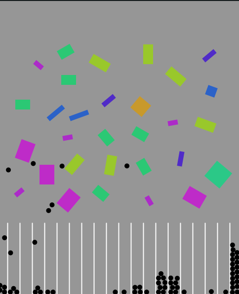

[sketch_2022_02_05py5](https://github.com/villares/sketch-a-day/tree/master/2022/sketch_2022_02_05py5) [[py5](https://py5.ixora.io/)]

---

### sketch_2022_02_04py5

[sketch_2022_02_04py5](https://github.com/villares/sketch-a-day/tree/master/2022/sketch_2022_02_04py5) [[py5](https://py5.ixora.io/)]

---

### sketch_2022_02_03py5

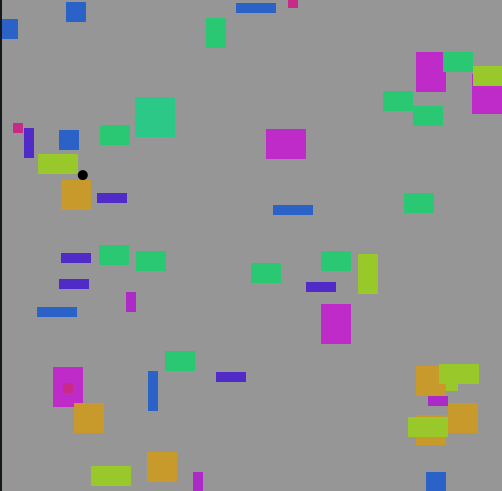

[sketch_2022_02_03py5](https://github.com/villares/sketch-a-day/tree/master/2022/sketch_2022_02_03py5) [[py5](https://py5.ixora.io/)]

---

### sketch_2022_02_02py5

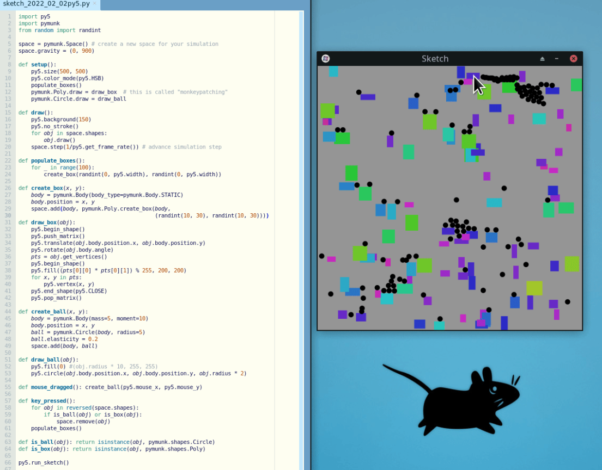

[sketch_2022_02_02py5](https://github.com/villares/sketch-a-day/tree/master/2022/sketch_2022_02_02py5) [[py5](https://py5.ixora.io/)]

---

### sketch_2022_02_01py5

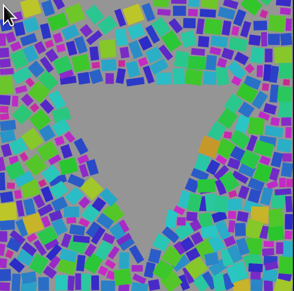

[sketch_2022_02_01py5](https://github.com/villares/sketch-a-day/tree/master/2022/sketch_2022_02_01py5) [[py5](https://py5.ixora.io/)]

---

### sketch_2022_01_31py5

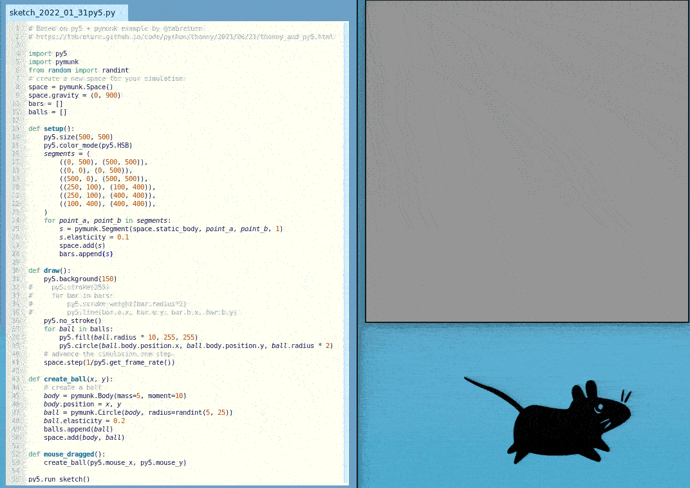

[sketch_2022_01_31py5](https://github.com/villares/sketch-a-day/tree/master/2022/sketch_2022_01_31py5) [[py5](https://py5.ixora.io/)]

---

### sketch_2022_01_30

[sketch_2022_01_30](https://github.com/villares/sketch-a-day/tree/master/2022/sketch_2022_01_30) [[Py.Processing](https://villares.github.io/como-instalar-o-processing-modo-python/index-EN)]

---

### sketch_2022_01_29

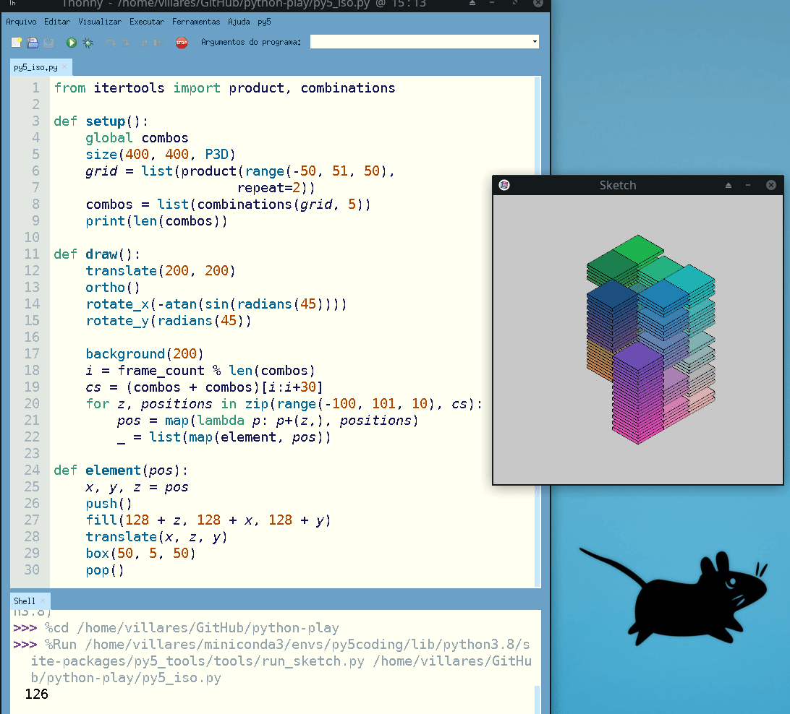

[sketch_2022_01_29](https://github.com/villares/sketch-a-day/tree/master/2022/sketch_2022_01_29) [[Py.Processing](https://villares.github.io/como-instalar-o-processing-modo-python/index-EN)]

---

### sketch_2022_01_28a_reticula

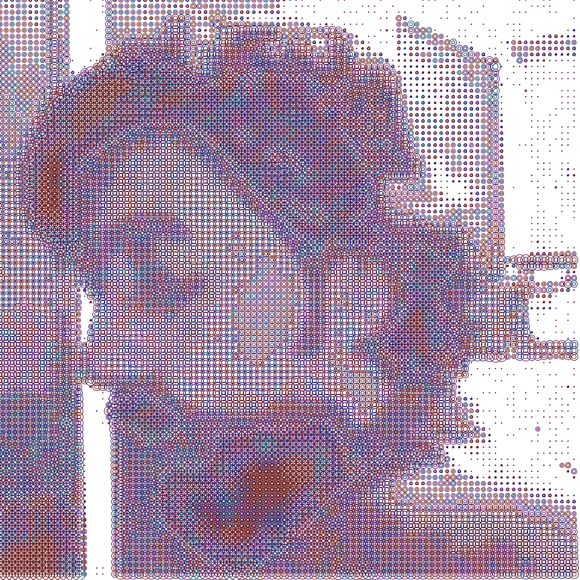

[sketch_2022_01_28a_reticula](https://github.com/villares/sketch-a-day/tree/master/2022/sketch_2022_01_28a_reticula) [[Py.Processing](https://villares.github.io/como-instalar-o-processing-modo-python/index-EN)]

---

### sketch_2022_01_27a

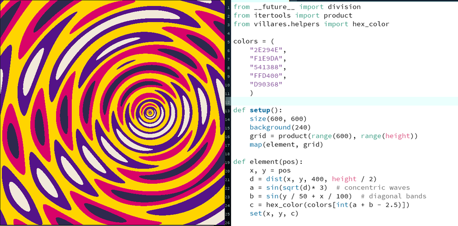

[sketch_2022_01_27a](https://github.com/villares/sketch-a-day/tree/master/2022/sketch_2022_01_27a) [[Py.Processing](https://villares.github.io/como-instalar-o-processing-modo-python/index-EN)]

---

### sketch_2022_01_26e

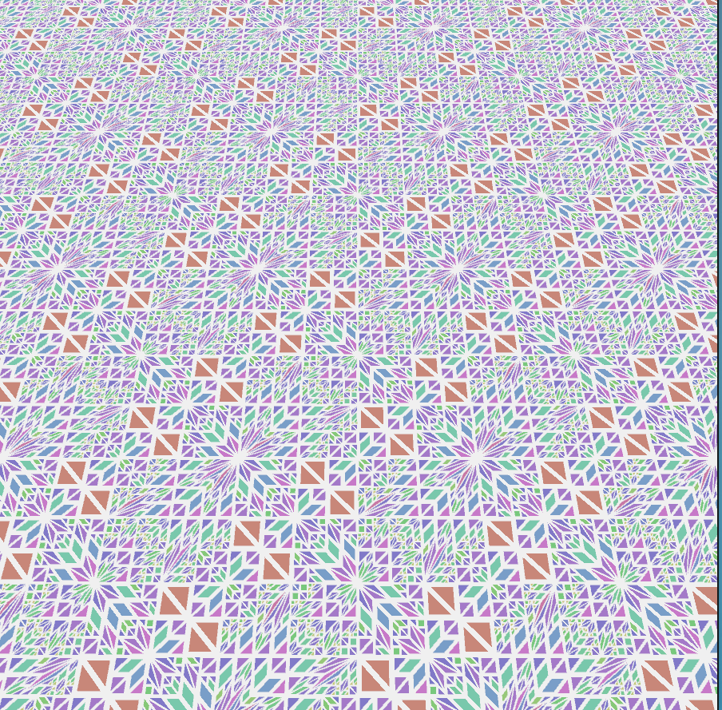

[sketch_2022_01_26e](https://github.com/villares/sketch-a-day/tree/master/2022/sketch_2022_01_26e) [[Py.Processing](https://villares.github.io/como-instalar-o-processing-modo-python/index-EN)]

---

### sketch_2022_01_25e

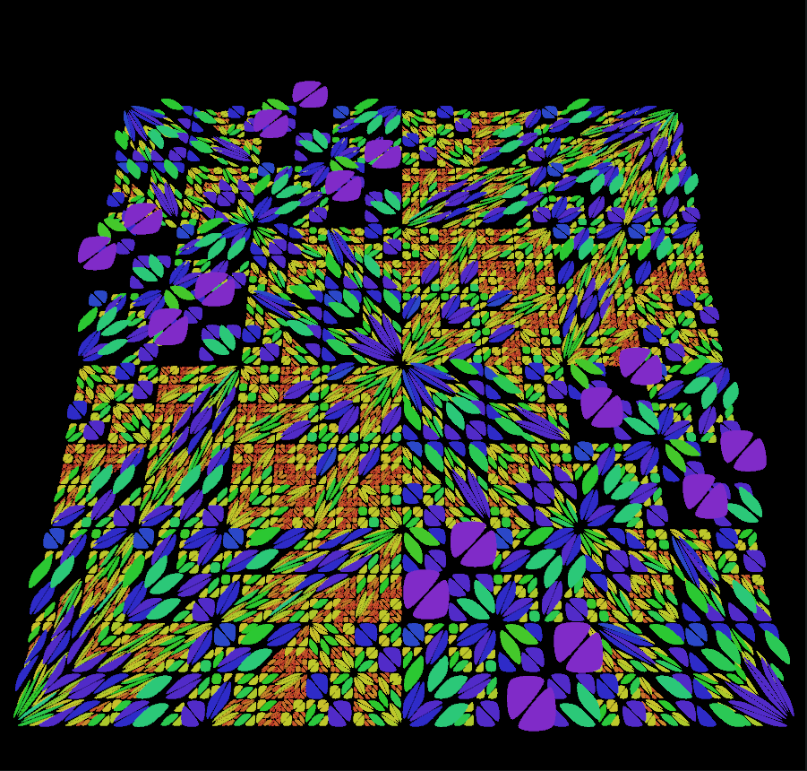

[sketch_2022_01_25e](https://github.com/villares/sketch-a-day/tree/master/2022/sketch_2022_01_25e) [[Py.Processing](https://villares.github.io/como-instalar-o-processing-modo-python/index-EN)]

---

### sketch_2022_01_24c_random

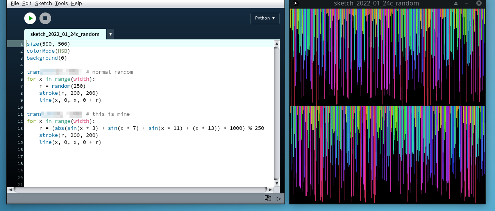

[sketch_2022_01_24c_random](https://github.com/villares/sketch-a-day/tree/master/2022/sketch_2022_01_24c_random) [[Py.Processing](https://villares.github.io/como-instalar-o-processing-modo-python/index-EN)]

---

### sketch_2022_01_23d

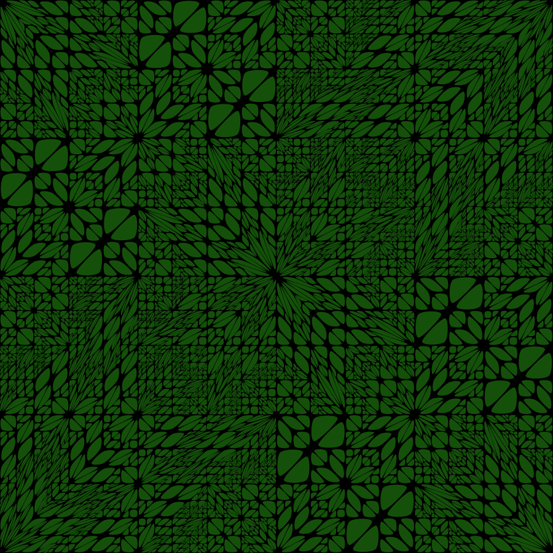

[sketch_2022_01_23d](https://github.com/villares/sketch-a-day/tree/master/2022/sketch_2022_01_23d) [[Py.Processing](https://villares.github.io/como-instalar-o-processing-modo-python/index-EN)]

---

### sketch_2022_01_22d

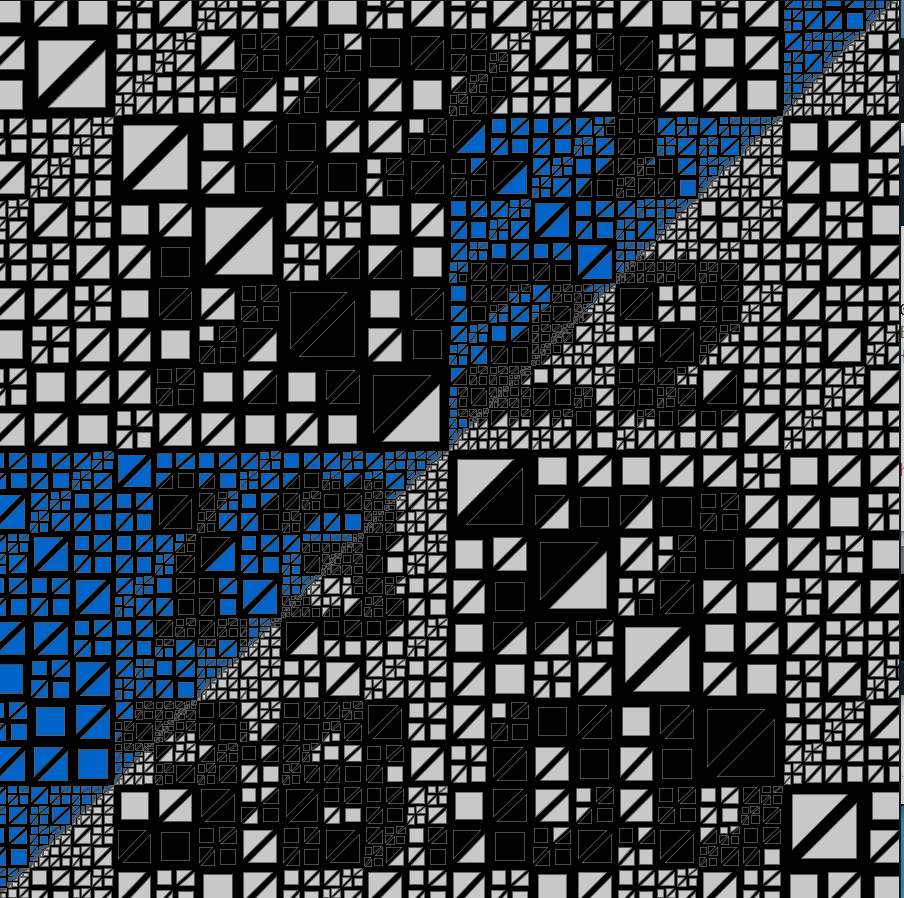

[sketch_2022_01_22d](https://github.com/villares/sketch-a-day/tree/master/2022/sketch_2022_01_22d) [[Py.Processing](https://villares.github.io/como-instalar-o-processing-modo-python/index-EN)]

---

### sketch_2022_01_21d

[sketch_2022_01_21d](https://github.com/villares/sketch-a-day/tree/master/2022/sketch_2022_01_21d) [[Py.Processing](https://villares.github.io/como-instalar-o-processing-modo-python/index-EN)]

---

### sketch_2022_01_20d

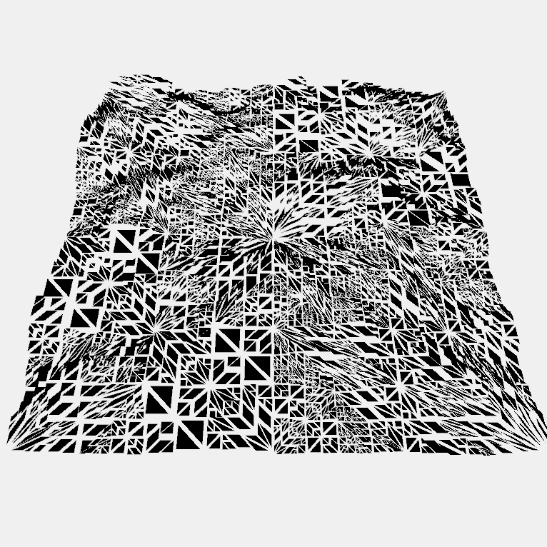

[sketch_2022_01_20d](https://github.com/villares/sketch-a-day/tree/master/2022/sketch_2022_01_20d) [[Py.Processing](https://villares.github.io/como-instalar-o-processing-modo-python/index-EN)]

---

### sketch_2022_01_19a

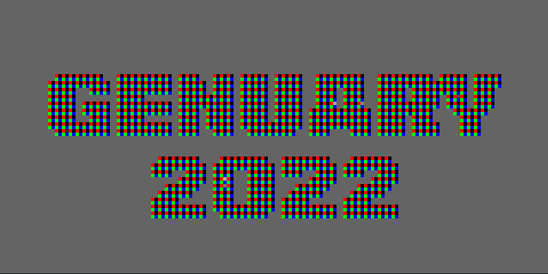

[sketch_2022_01_19a](https://github.com/villares/sketch-a-day/tree/master/2022/sketch_2022_01_19a) [[Py.Processing](https://villares.github.io/como-instalar-o-processing-modo-python/index-EN)]

---

### sketch_2022_01_18a_vhs

[sketch_2022_01_18a_vhs](https://github.com/villares/sketch-a-day/tree/master/2022/sketch_2022_01_18a_vhs) [[Py.Processing](https://villares.github.io/como-instalar-o-processing-modo-python/index-EN)]

---

### sketch_2022_01_17a

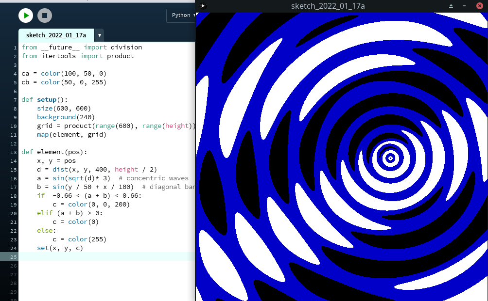

[sketch_2022_01_17a](https://github.com/villares/sketch-a-day/tree/master/2022/sketch_2022_01_17a) [[Py.Processing](https://villares.github.io/como-instalar-o-processing-modo-python/index-EN)]

---

### sketch_2022_01_16a

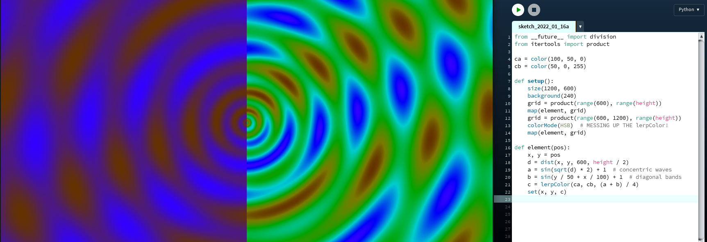

[sketch_2022_01_16a](https://github.com/villares/sketch-a-day/tree/master/2022/sketch_2022_01_16a) [[Py.Processing](https://villares.github.io/como-instalar-o-processing-modo-python/index-EN)]

---

### sketch_2022_01_15a

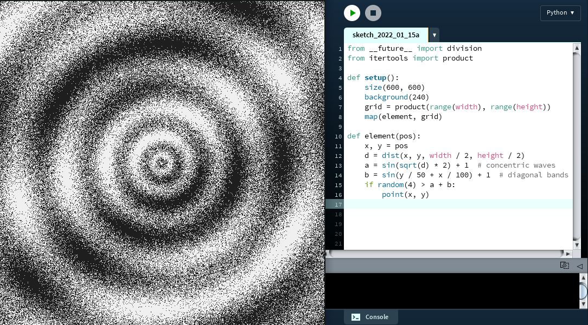

[sketch_2022_01_15a](https://github.com/villares/sketch-a-day/tree/master/2022/sketch_2022_01_15a) [[Py.Processing](https://villares.github.io/como-instalar-o-processing-modo-python/index-EN)]

---

### sketch_2022_01_14a

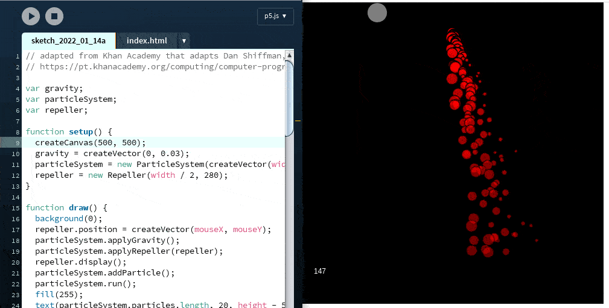

[sketch_2022_01_14a](https://github.com/villares/sketch-a-day/tree/master/2022/sketch_2022_01_14a) [[Py.Processing](https://villares.github.io/como-instalar-o-processing-modo-python/index-EN)]

---

### sketch_2022_01_13b

[sketch_2022_01_13b](https://github.com/villares/sketch-a-day/tree/master/2022/sketch_2022_01_13b) [[Py.Processing](https://villares.github.io/como-instalar-o-processing-modo-python/index-EN)]

---

### sketch_2022_01_12a

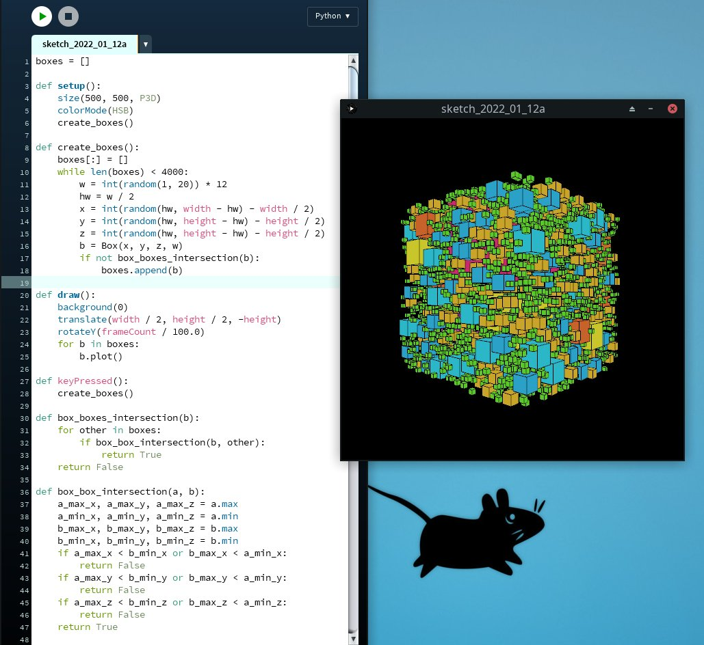

[sketch_2022_01_12a](https://github.com/villares/sketch-a-day/tree/master/2022/sketch_2022_01_12a) [[Py.Processing](https://villares.github.io/como-instalar-o-processing-modo-python/index-EN)]

---

### sketch_2022_01_11a

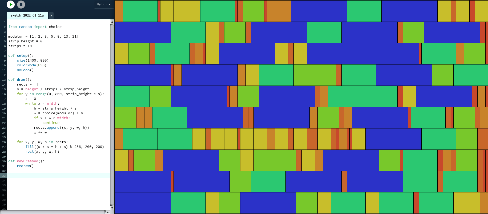

[sketch_2022_01_11a](https://github.com/villares/sketch-a-day/tree/master/2022/sketch_2022_01_11a) [[Py.Processing](https://villares.github.io/como-instalar-o-processing-modo-python/index-EN)]

---

### sketch_2022_01_10a_reticula

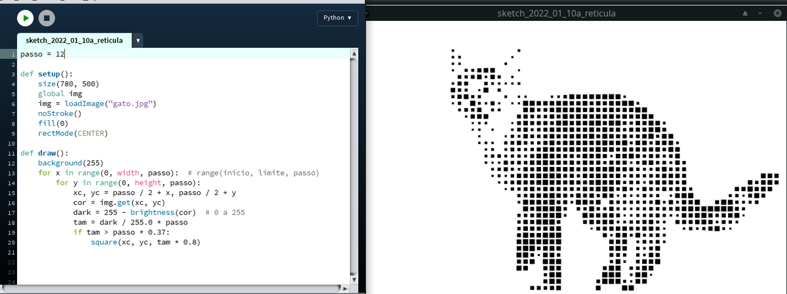

[sketch_2022_01_10a_reticula](https://github.com/villares/sketch-a-day/tree/master/2022/sketch_2022_01_10a_reticula) [[Py.Processing](https://villares.github.io/como-instalar-o-processing-modo-python/index-EN)]

---

### sketch_2022_01_09a

[sketch_2022_01_09a](https://github.com/villares/sketch-a-day/tree/master/2022/sketch_2022_01_09a) [[Py.Processing](https://villares.github.io/como-instalar-o-processing-modo-python/index-EN)]

---

### sketch_2022_01_08b

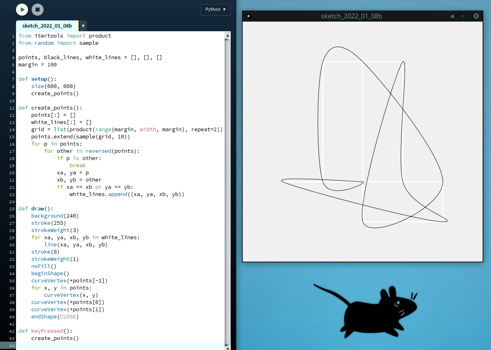

[sketch_2022_01_08b](https://github.com/villares/sketch-a-day/tree/master/2022/sketch_2022_01_08b) [[Py.Processing](https://villares.github.io/como-instalar-o-processing-modo-python/index-EN)]

---

### sketch_2022_01_07b

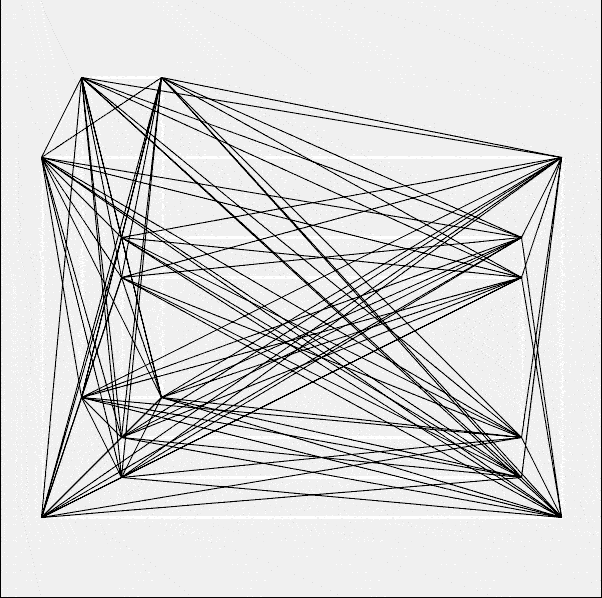

[sketch_2022_01_07b](https://github.com/villares/sketch-a-day/tree/master/2022/sketch_2022_01_07b) [[Py.Processing](https://villares.github.io/como-instalar-o-processing-modo-python/index-EN)]

---

### sketch_2022_01_06a

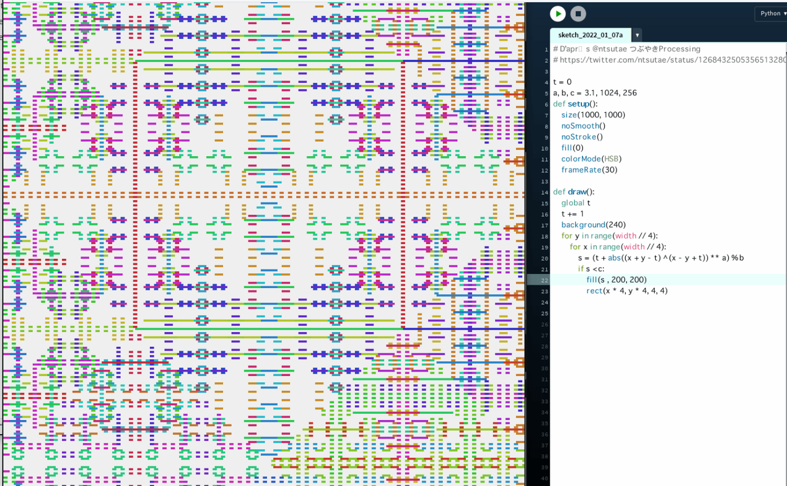

[sketch_2022_01_06a](https://github.com/villares/sketch-a-day/tree/master/2022/sketch_2022_01_06a) [[Py.Processing](https://villares.github.io/como-instalar-o-processing-modo-python/index-EN)]

---

### sketch_2022_01_05a

[sketch_2022_01_05a](https://github.com/villares/sketch-a-day/tree/master/2022/sketch_2022_01_05a) [[Py.Processing](https://villares.github.io/como-instalar-o-processing-modo-python/index-EN)]

---

### sketch_2022_01_04a

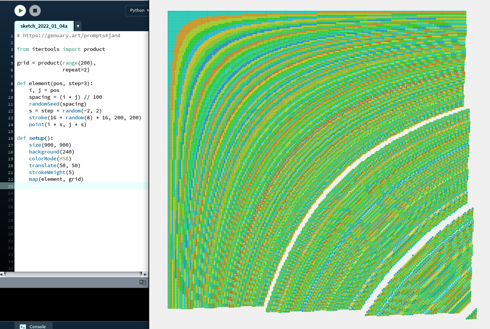

[sketch_2022_01_04a](https://github.com/villares/sketch-a-day/tree/master/2022/sketch_2022_01_04a) [[Py.Processing](https://villares.github.io/como-instalar-o-processing-modo-python/index-EN)]

---

### sketch_2022_01_03a

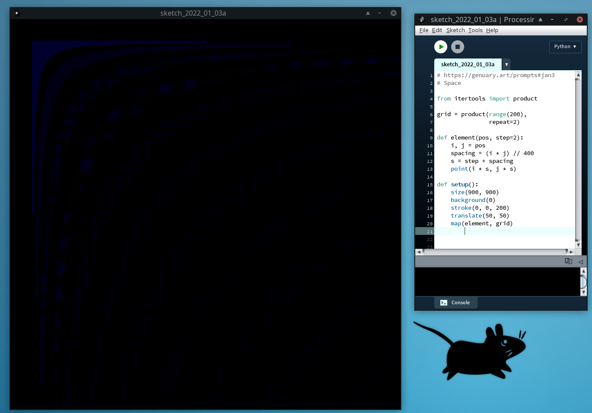

[sketch_2022_01_03a](https://github.com/villares/sketch-a-day/tree/master/2022/sketch_2022_01_03a) [[Py.Processing](https://villares.github.io/como-instalar-o-processing-modo-python/index-EN)]

---

### sketch_2022_01_02a

[sketch_2022_01_02a](https://github.com/villares/sketch-a-day/tree/master/2022/sketch_2022_01_02a) [[Py.Processing](https://villares.github.io/como-instalar-o-processing-modo-python/index-EN)]

---

### sketch_2022_01_01a

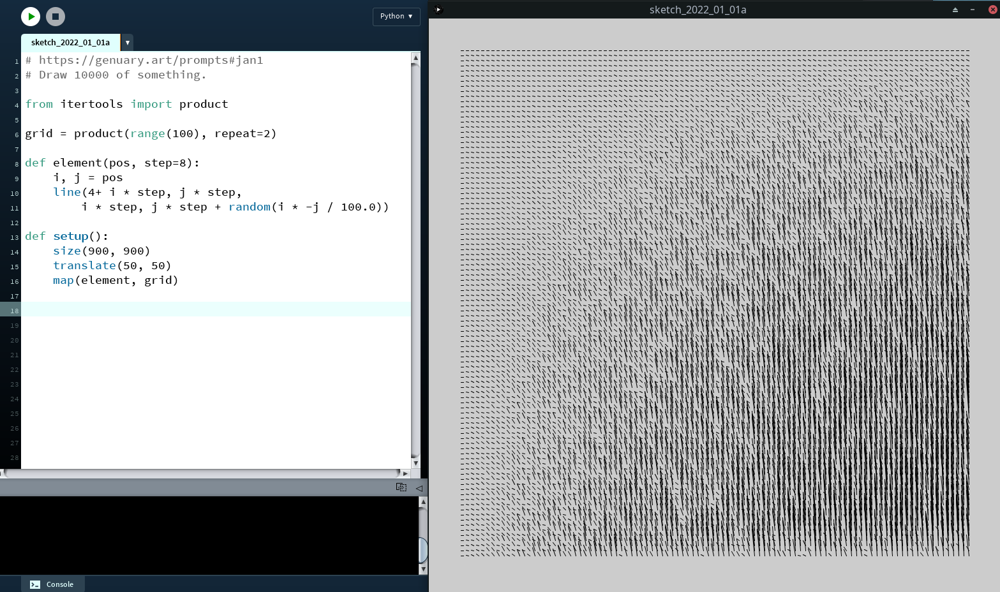

[sketch_2022_01_01a](https://github.com/villares/sketch-a-day/tree/master/2022/sketch_2022_01_01a) [[Py.Processing](https://villares.github.io/como-instalar-o-processing-modo-python/index-EN)]
