# [sketch-a-day](https://abav.lugaralgum.com/sketch-a-day)

#### coding a visual idea a day

Welcome! My name is [Alexandre Villares](https://abav.lugaralgum.com) and since January, 2018 I have been coding *sketches* everyday, publishing the source code in the same repository that stores this page, [github.com/villares/sketch-a-day](https://github.com/villares/sketch-a-day).

The results are mostly tentative, exploratory, and I don’t feel like they need to be relevant or meaningful on any particular day. The everyday practice leads to the emergence of ideas that I consider interesting, worthy of further exploration. Some of those have been added to [selected work](https://abav.lugaralgum.com/selected-work/index-EN.html), this collection itself became valuable for me, and it is my pleasure to share it with anyone willing to explore coding as a creative and expressive medium.

Please do not hesitate to [contact me](http://contato.lugaralgum.com) regarding licenses to use my work, teaching opportunities, consulting or other projects. Moreover, I kindly invite you to subscribe to my newsletter, [[sketch-mail](https://abav.lugaralgum.com/sketch-mail)]. If you appreciate what I have been doing, you may support my artistic work, research and open educational resources I publish on-line using [gumroad.com/villares](https://gumroad.com/villares) or [PayPal](https://www.paypal.com/cgi-bin/webscr?cmd=_s-xclick&hosted_button_id=HCGAKACDMVNV2).

Here are listed some of the tools I have been using:

- [[Py.Processing](https://villares.github.io/como-instalar-o-processing-modo-python/index-EN)] Processing Python mode
- [[Processing Java](https://processing.org]) Processing Java or "standard" mode
- [[p5.js](https://p5js.org)] JavaScript library from the Processing Foundation
- [[pyp5js](https://berinhard.github.io/pyp5js/)] initially a Python to p5js trancriptor, now a pyodide + p5js tool
- [[shoebot](https://shoebot.github.io/shoebot/)] Generate 2D vector graphics with Python
- [[py5](https://py5.ixora.io/)] A new Processing Java + Python 3 amazing tool
- [[p5py](https://github.com/p5py/p5)] A new Python 3 implementation of Processing ideas (no Java needed)
- [[flat](https://xxyxyz.org/flat)] A generative infrastructure library for Python (via Allison Parrish's [Bezmerizing](https://github.com/aparrish/bezmerizing))
- [[VPython](https://vpython.org/)] Python + glowscript gives you 3D on the browser
- [[FreeCAD](https://freecadweb.org)] A wonderful 3D modeling tool, CAD & more, Python infused.

---

## [2018](2018.md) | [2019](2019.md) | [2020](2020.md) | 2021

---

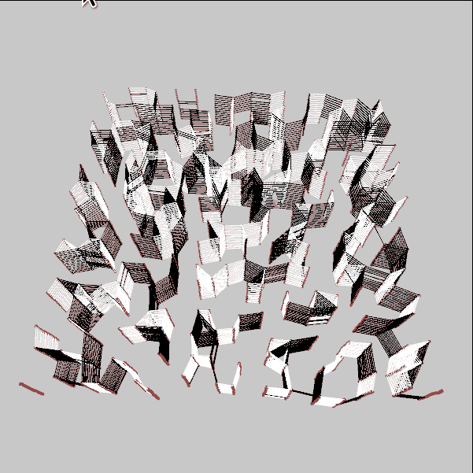

[sketch_2021_08_27a](https://github.com/villares/sketch-a-day/tree/master/2021/sketch_2021_08_27a) [[Py.Processing](https://villares.github.io/como-instalar-o-processing-modo-python/index-EN)]

---

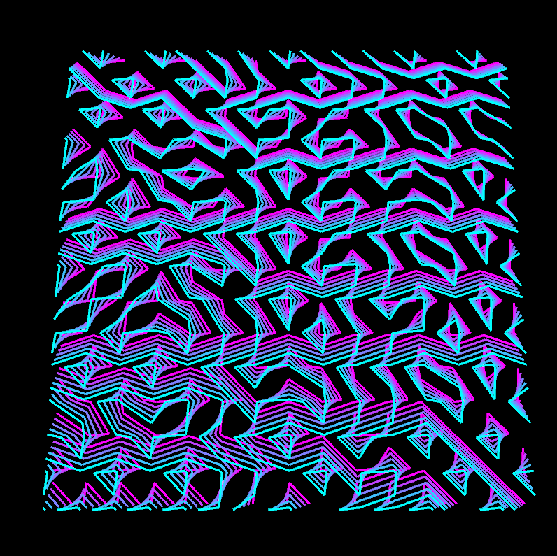

[sketch_2021_08_24a_modules](https://github.com/villares/sketch-a-day/tree/master/2021/sketch_2021_08_24a_modules) [[Py.Processing](https://villares.github.io/como-instalar-o-processing-modo-python/index-EN)]

---

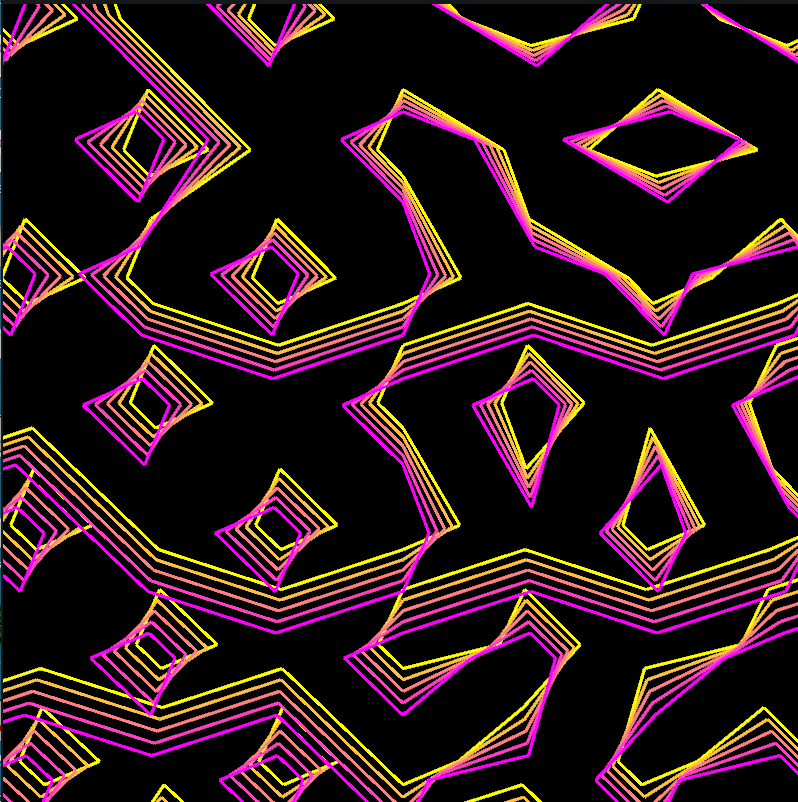

[sketch_2021_08_23a_modules](https://github.com/villares/sketch-a-day/tree/master/2021/sketch_2021_08_23a_modules) [[Py.Processing](https://villares.github.io/como-instalar-o-processing-modo-python/index-EN)]

---

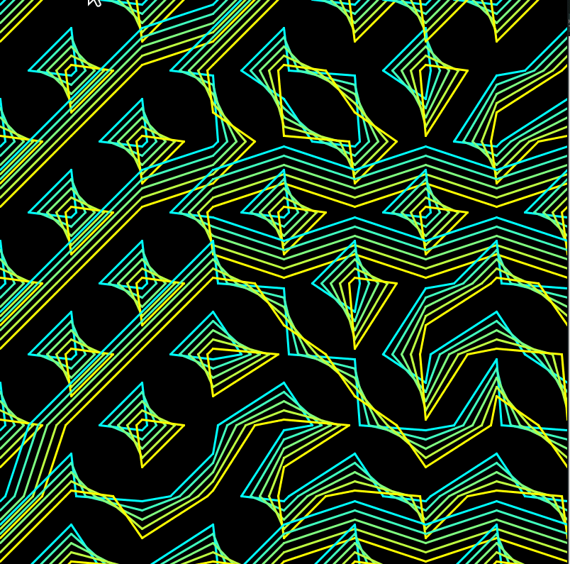

[sketch_2021_08_22a_modules](https://github.com/villares/sketch-a-day/tree/master/2021/sketch_2021_08_22a_modules) [[Py.Processing](https://villares.github.io/como-instalar-o-processing-modo-python/index-EN)]

---

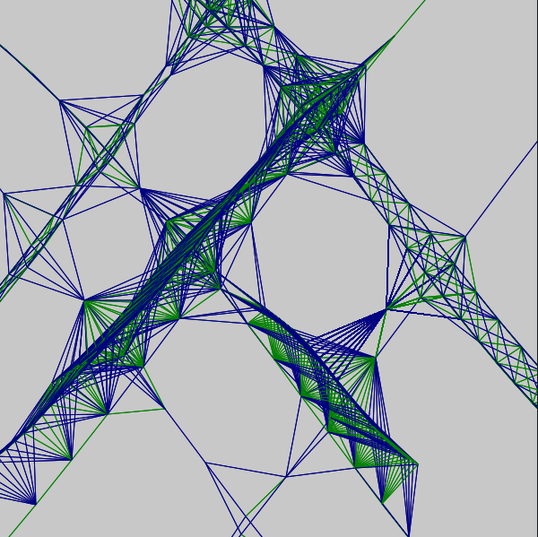

[sketch_2021_08_21b_shoebot](https://github.com/villares/sketch-a-day/tree/master/2021/sketch_2021_08_21b_shoebot) [[shoebot](http://shoebot.net/)]

---

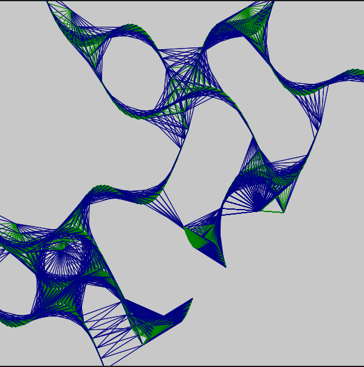

[sketch_2021_08_20b_shoebot](https://github.com/villares/sketch-a-day/tree/master/2021/sketch_2021_08_20b_shoebot) [[shoebot](http://shoebot.net/)]

---

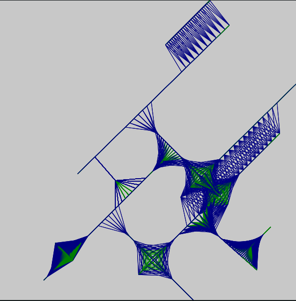

[sketch_2021_08_19b_shoebot](https://github.com/villares/sketch-a-day/tree/master/2021/sketch_2021_08_19b_shoebot) [[shoebot](http://shoebot.net/)]

---

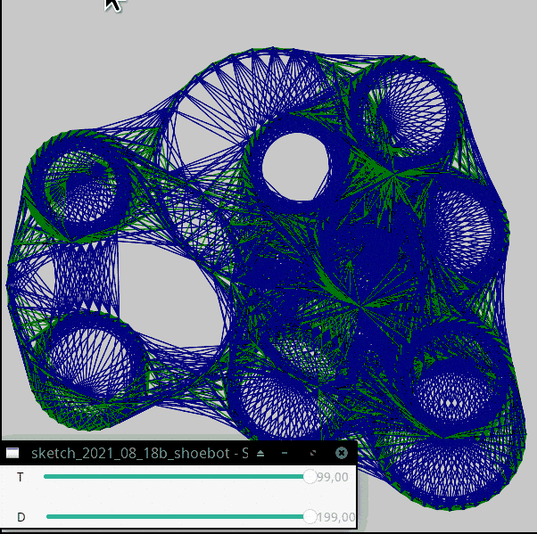

[sketch_2021_08_18b_shoebot](https://github.com/villares/sketch-a-day/tree/master/2021/sketch_2021_08_18b_shoebot) [[shoebot](http://shoebot.net/)]

---

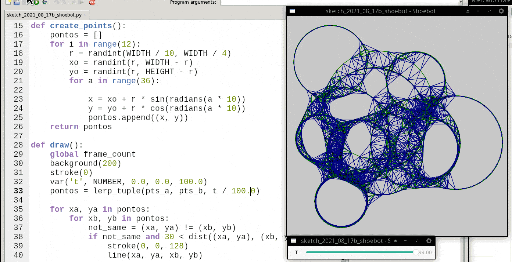

[sketch_2021_08_17b_shoebot](https://github.com/villares/sketch-a-day/tree/master/2021/sketch_2021_08_17b_shoebot) [[shoebot](http://shoebot.net/)]

---

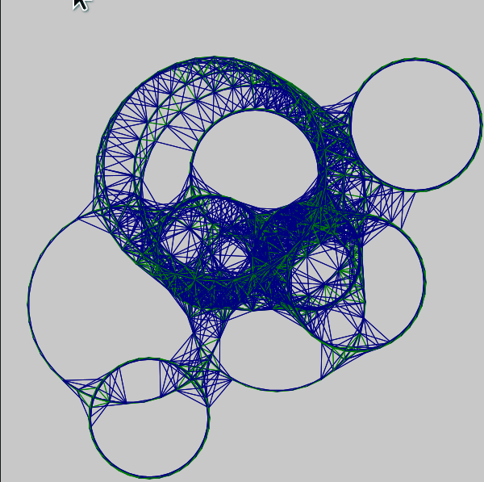

[sketch_2021_08_16b_shoebot](https://github.com/villares/sketch-a-day/tree/master/2021/sketch_2021_08_16b_shoebot) [[shoebot](http://shoebot.net/)]

---

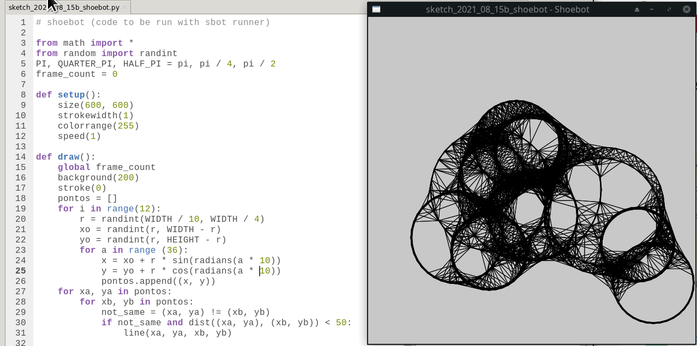

[sketch_2021_08_15b_shoebot](https://github.com/villares/sketch-a-day/tree/master/2021/sketch_2021_08_15b_shoebot) [[shoebot](http://shoebot.net/)]

---

[sketch_2021_08_14b_shoebot](https://github.com/villares/sketch-a-day/tree/master/2021/sketch_2021_08_14b_shoebot) [[shoebot](http://shoebot.net/)]

---

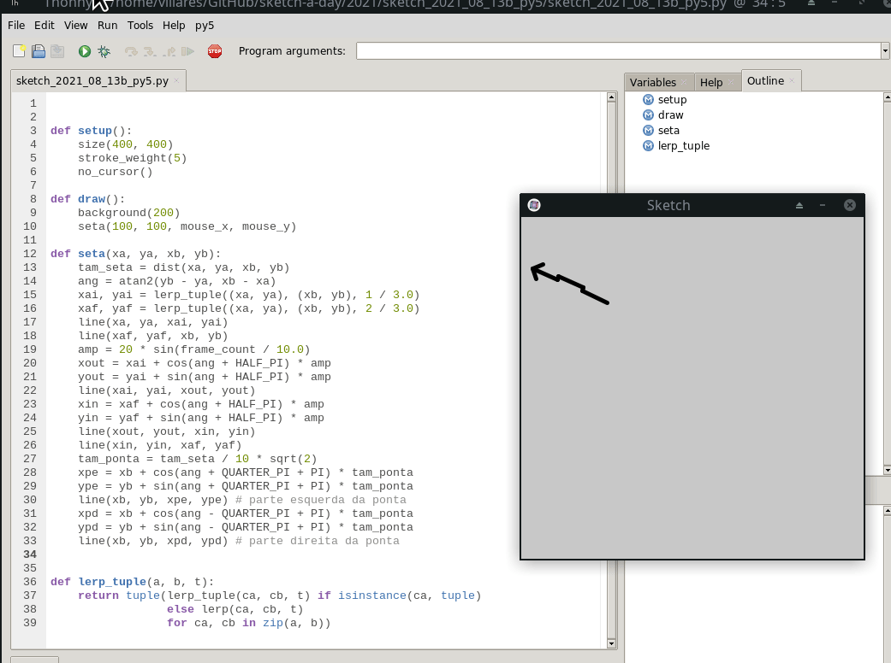

[sketch_2021_08_13b_py5](https://github.com/villares/sketch-a-day/tree/master/2021/sketch_2021_08_13b_py5) [[py5](https://py5.ixora.io/)]

---

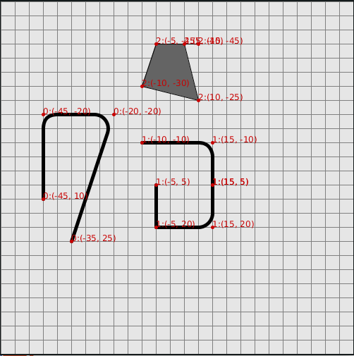

[sketch_2021_08_12b](https://github.com/villares/sketch-a-day/tree/master/2021/sketch_2021_08_12b) [[Py.Processing](https://villares.github.io/como-instalar-o-processing-modo-python/index-EN)]

---

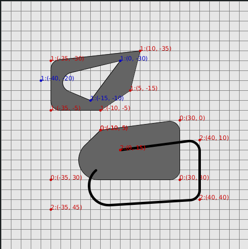

[sketch_2021_08_11b](https://github.com/villares/sketch-a-day/tree/master/2021/sketch_2021_08_11b) [[Py.Processing](https://villares.github.io/como-instalar-o-processing-modo-python/index-EN)]

---

[sketch_2021_08_10b_clip_mask2](https://github.com/villares/sketch-a-day/tree/master/2021/sketch_2021_08_10b_clip_mask2) [[Py.Processing](https://villares.github.io/como-instalar-o-processing-modo-python/index-EN)]

---

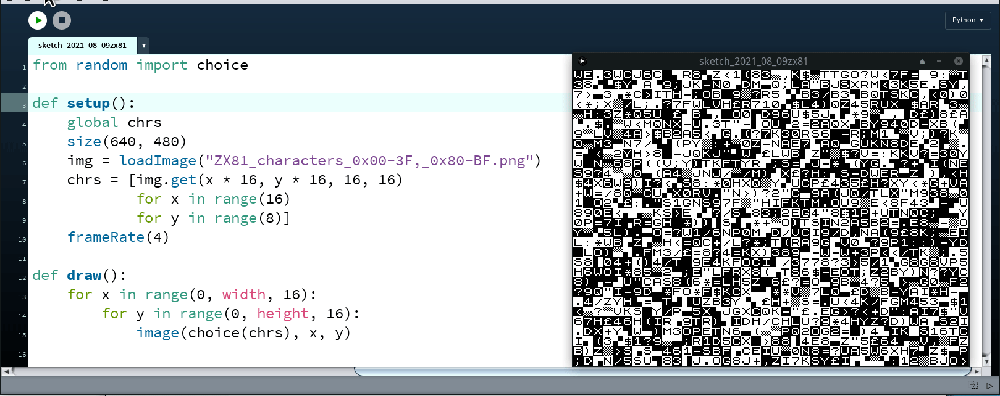

[sketch_2021_08_09zx81](https://github.com/villares/sketch-a-day/tree/master/2021/sketch_2021_08_09zx81) [[Py.Processing](https://villares.github.io/como-instalar-o-processing-modo-python/index-EN)]

---

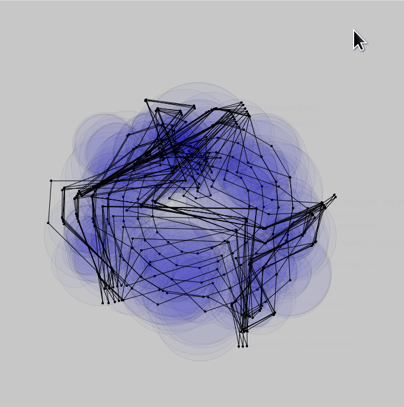

[sketch_2021_08_08a_lines](https://github.com/villares/sketch-a-day/tree/master/2021/sketch_2021_08_08a_lines) [[Py.Processing](https://villares.github.io/como-instalar-o-processing-modo-python/index-EN)]

---

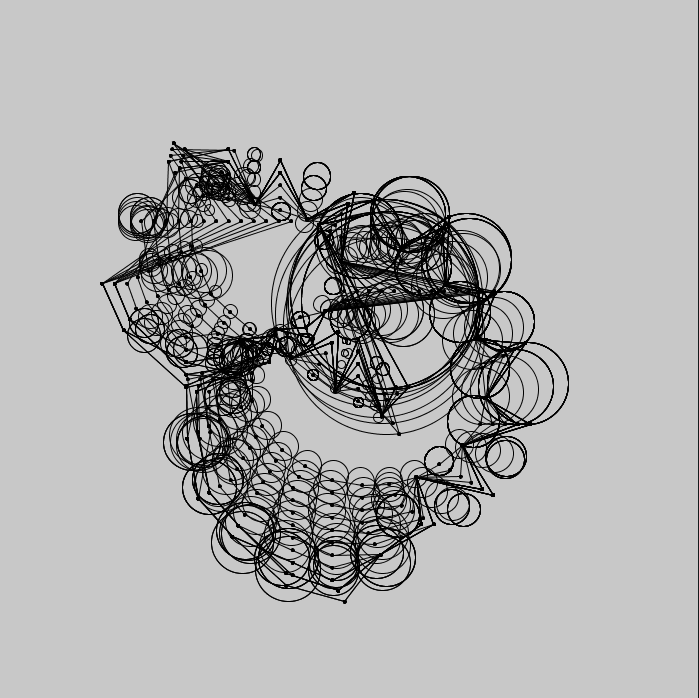

[sketch_2021_08_07a_lines](https://github.com/villares/sketch-a-day/tree/master/2021/sketch_2021_08_07a_lines) [[Py.Processing](https://villares.github.io/como-instalar-o-processing-modo-python/index-EN)]

---

[sketch_2021_08_06a_lines](https://github.com/villares/sketch-a-day/tree/master/2021/sketch_2021_08_06a_lines) [[Py.Processing](https://villares.github.io/como-instalar-o-processing-modo-python/index-EN)]

---

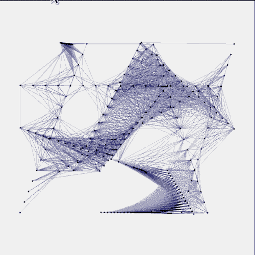

[sketch_2021_08_05_near_play](https://github.com/villares/sketch-a-day/tree/master/2021/sketch_2021_08_05_near_play) [[Py.Processing](https://villares.github.io/como-instalar-o-processing-modo-python/index-EN)]

---

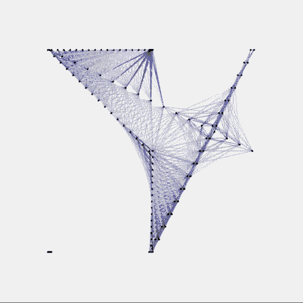

[sketch_2021_08_04_near_play](https://github.com/villares/sketch-a-day/tree/master/2021/sketch_2021_08_04_near_play) [[Py.Processing](https://villares.github.io/como-instalar-o-processing-modo-python/index-EN)]

---

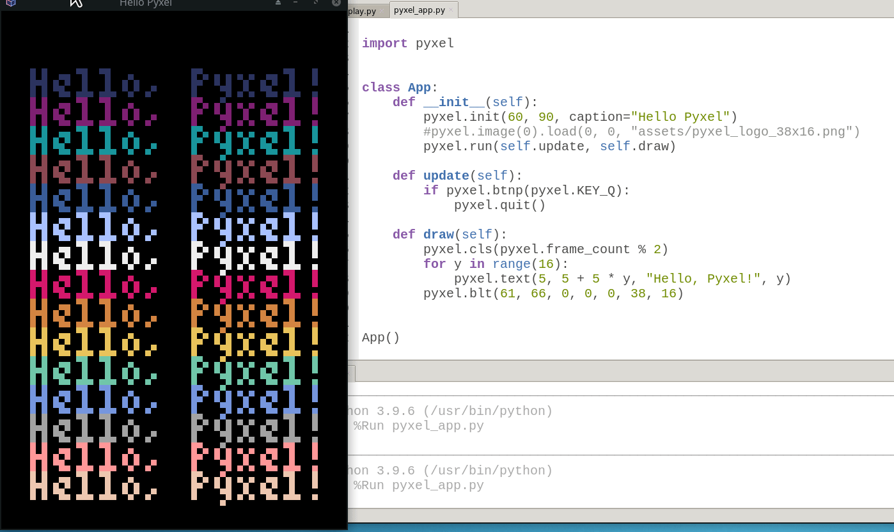

[sketch_2021_08_03a_pyxel](https://github.com/villares/sketch-a-day/tree/master/2021/sketch_2021_08_03a_pyxel) [[pyxel](https://github.com/kitao/pyxel/blob/master/README.md)]

---

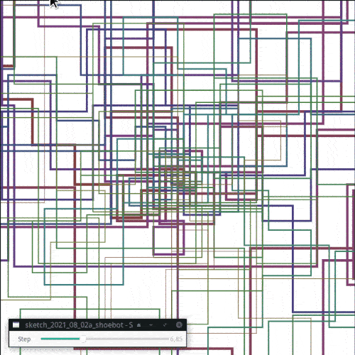

[sketch_2021_08_02a_shoebot](https://github.com/villares/sketch-a-day/tree/master/2021/sketch_2021_08_02a_shoebot) [[shoebot](http://shoebot.net/)]

---

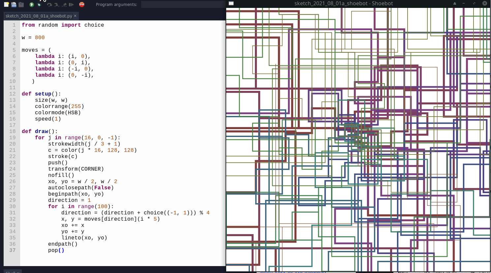

[sketch_2021_08_01a_shoebot](https://github.com/villares/sketch-a-day/tree/master/2021/sketch_2021_08_01a_shoebot) [[shoebot](http://shoebot.net/)]

---

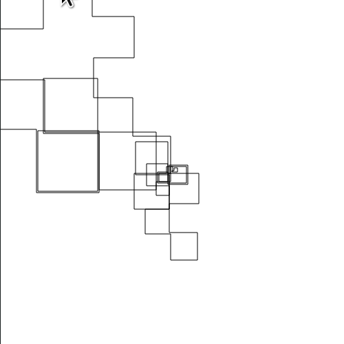

[sketch_2021_07_31a_shoebot](https://github.com/villares/sketch-a-day/tree/master/2021/sketch_2021_07_31a_shoebot) [[shoebot](http://shoebot.net/)]

---

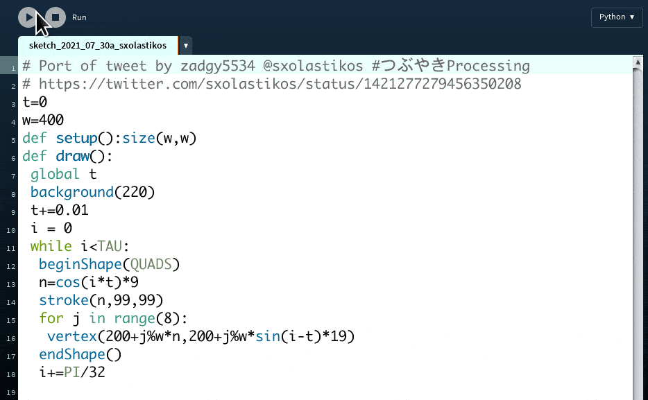

[sketch_2021_07_30a_sxolastikos](https://github.com/villares/sketch-a-day/tree/master/2021/sketch_2021_07_30a_sxolastikos) [[Py.Processing](https://villares.github.io/como-instalar-o-processing-modo-python/index-EN)]

---

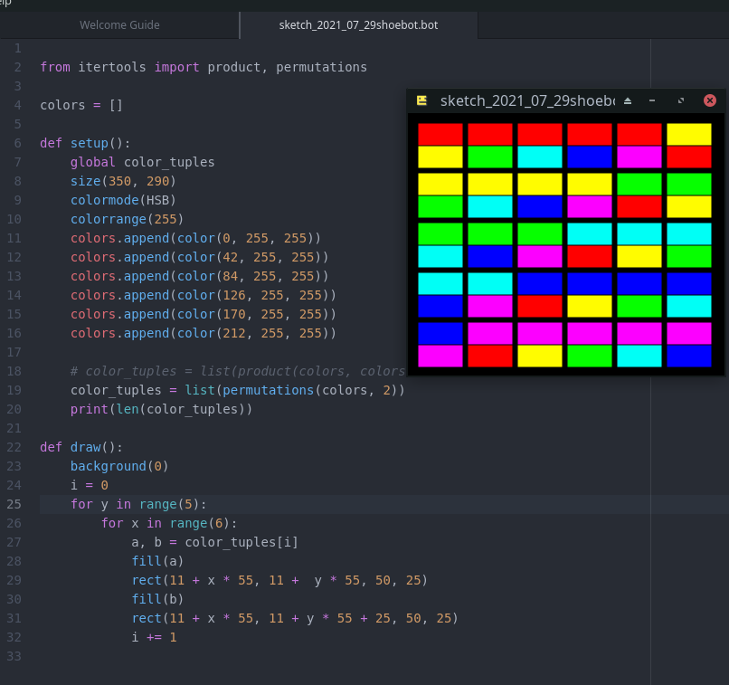

[sketch_2021_07_29shoebot](https://github.com/villares/sketch-a-day/tree/master/2021/sketch_2021_07_29shoebot) [[shoebot](http://shoebot.net/)]

---

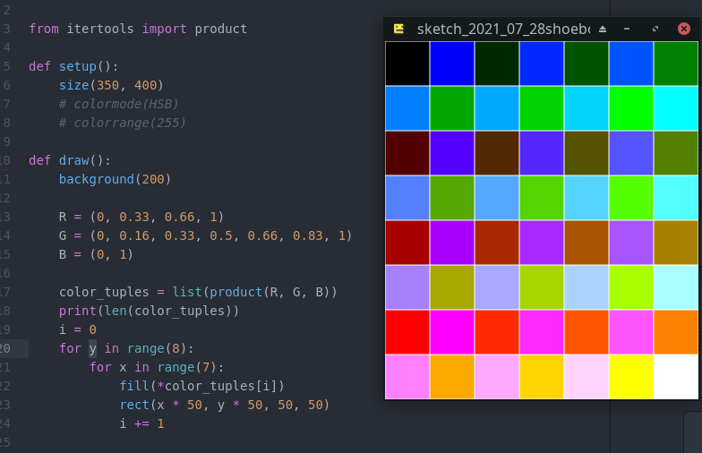

[sketch_2021_07_28shoebot](https://github.com/villares/sketch-a-day/tree/master/2021/sketch_2021_07_28shoebot) [[shoebot](http://shoebot.net/)]

---

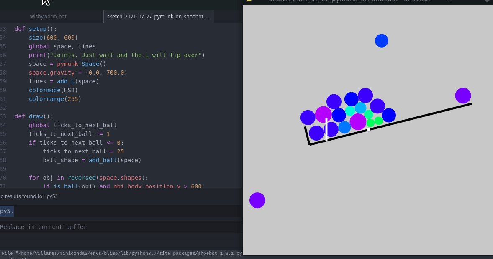

[sketch_2021_07_27_pymunk_on_shoebot](https://github.com/villares/sketch-a-day/tree/master/2021/sketch_2021_07_27_pymunk_on_shoebot) [[shoebot](http://shoebot.net/)]

---

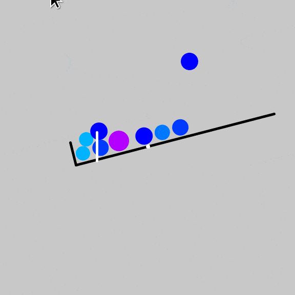

[sketch_2021_07_26pymunk_on_py5](https://github.com/villares/sketch-a-day/tree/master/2021/sketch_2021_07_26pymunk_on_py5) [[py5](https://py5.ixora.io/)]

---

[sketch_2021_07_25pymunk_on_py5](https://github.com/villares/sketch-a-day/tree/master/2021/sketch_2021_07_25pymunk_on_py5) [[py5](https://py5.ixora.io/)]

---

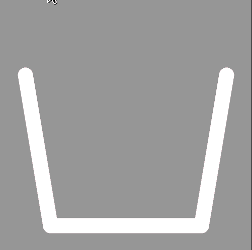

[sketch_2021_07_24pymunk_on_py5](https://github.com/villares/sketch-a-day/tree/master/2021/sketch_2021_07_24pymunk_on_py5) [[py5](https://py5.ixora.io/)]

---

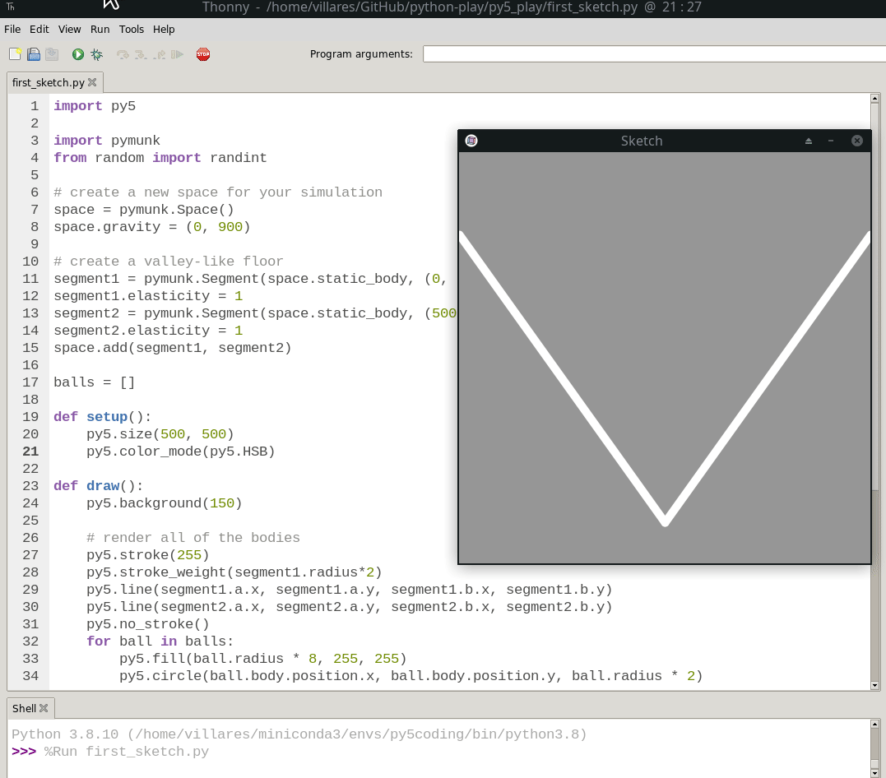

[sketch_2021_07_23pymunk_on_py5](https://github.com/villares/sketch-a-day/tree/master/2021/sketch_2021_07_23pymunk_on_py5) [[py5](https://py5.ixora.io/)]

Based on an example by Tristan Bunn: https://tabreturn.github.io/code/python/thonny/2021/06/21/thonny_and_py5.html

---

[sketch_2021_07_22a_lines](https://github.com/villares/sketch-a-day/tree/master/2021/sketch_2021_07_22a_lines) [[Py.Processing](https://villares.github.io/como-instalar-o-processing-modo-python/index-EN)]

---

[sketch_2021_07_21a_lines](https://github.com/villares/sketch-a-day/tree/master/2021/sketch_2021_07_21a_lines) [[Py.Processing](https://villares.github.io/como-instalar-o-processing-modo-python/index-EN)]

---

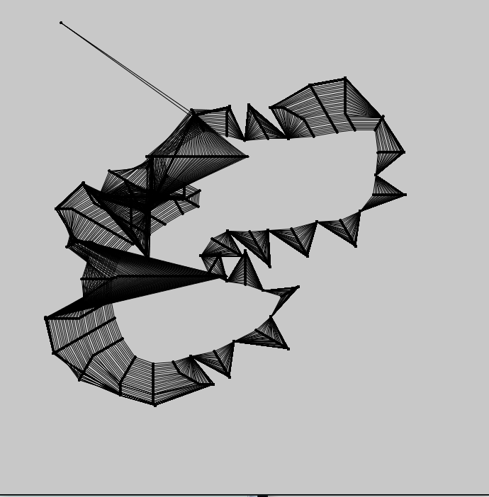

[sketch_2021_07_20a_lines](https://github.com/villares/sketch-a-day/tree/master/2021/sketch_2021_07_20a_lines) [[Py.Processing](https://villares.github.io/como-instalar-o-processing-modo-python/index-EN)]

---

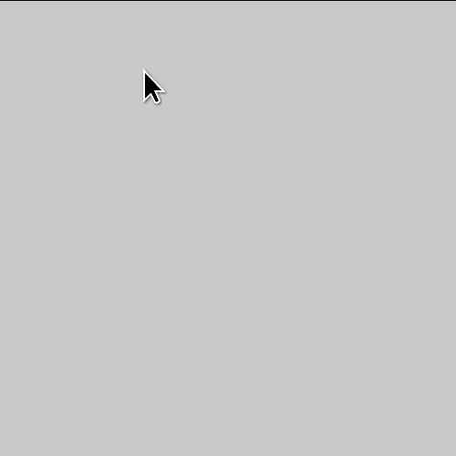

[sketch_2021_07_19a_lines](https://github.com/villares/sketch-a-day/tree/master/2021/sketch_2021_07_19a_lines) [[Py.Processing](https://villares.github.io/como-instalar-o-processing-modo-python/index-EN)]

---

[sketch_2021_07_18a_lines](https://github.com/villares/sketch-a-day/tree/master/2021/sketch_2021_07_18a_lines) [[Py.Processing](https://villares.github.io/como-instalar-o-processing-modo-python/index-EN)]

---

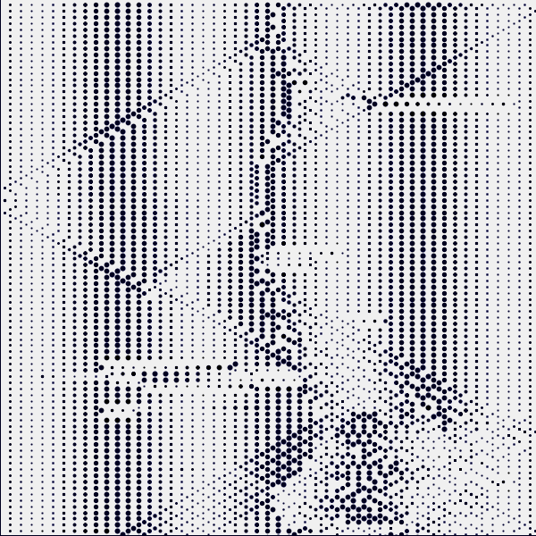

[sketch_2021_07_17ahex_cells](https://github.com/villares/sketch-a-day/tree/master/2021/sketch_2021_07_17ahex_cells) [[Py.Processing](https://villares.github.io/como-instalar-o-processing-modo-python/index-EN)]

---

[sketch_2021_07_16ahex_cells](https://github.com/villares/sketch-a-day/tree/master/2021/sketch_2021_07_16ahex_cells) [[Py.Processing](https://villares.github.io/como-instalar-o-processing-modo-python/index-EN)]

---

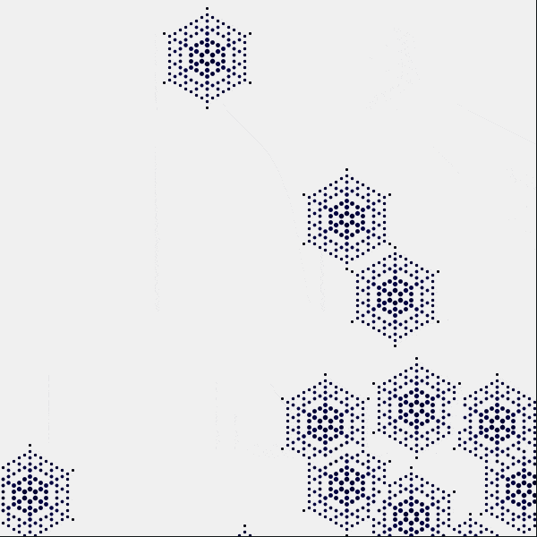

[sketch_2021_07_15ahex_cells](https://github.com/villares/sketch-a-day/tree/master/2021/sketch_2021_07_15ahex_cells) [[Py.Processing](https://villares.github.io/como-instalar-o-processing-modo-python/index-EN)]

---

[sketch_2021_07_14ahex_cells](https://github.com/villares/sketch-a-day/tree/master/2021/sketch_2021_07_14ahex_cells) [[Py.Processing](https://villares.github.io/como-instalar-o-processing-modo-python/index-EN)]

---

[sketch_2021_07_13b_hex_cells](https://github.com/villares/sketch-a-day/tree/master/2021/sketch_2021_07_13b_hex_cells) [[Py.Processing](https://villares.github.io/como-instalar-o-processing-modo-python/index-EN)]

---

[sketch_2021_07_12b_hex_cells](https://github.com/villares/sketch-a-day/tree/master/2021/sketch_2021_07_12b_hex_cells) [[Py.Processing](https://villares.github.io/como-instalar-o-processing-modo-python/index-EN)]

---

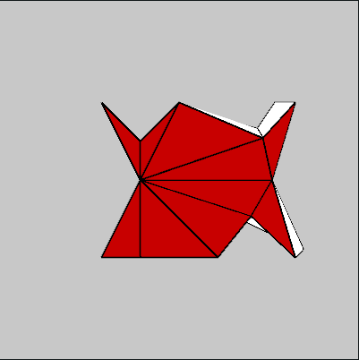

[sketch_2021_07_11a](https://github.com/villares/sketch-a-day/tree/master/2021/sketch_2021_07_11a) [[Py.Processing](https://villares.github.io/como-instalar-o-processing-modo-python/index-EN)]

---

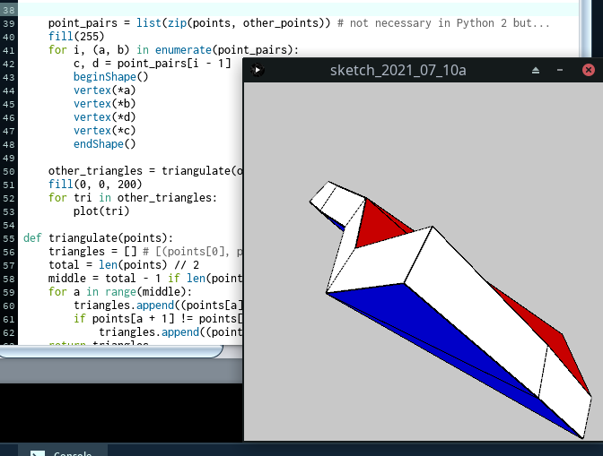

[sketch_2021_07_10a](https://github.com/villares/sketch-a-day/tree/master/2021/sketch_2021_07_10a) [[Py.Processing](https://villares.github.io/como-instalar-o-processing-modo-python/index-EN)]

---

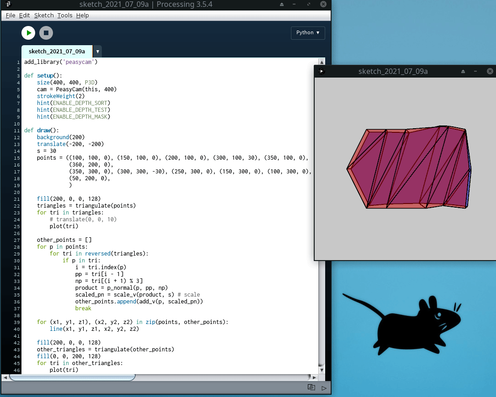

[sketch_2021_07_09a](https://github.com/villares/sketch-a-day/tree/master/2021/sketch_2021_07_09a) [[Py.Processing](https://villares.github.io/como-instalar-o-processing-modo-python/index-EN)]

---

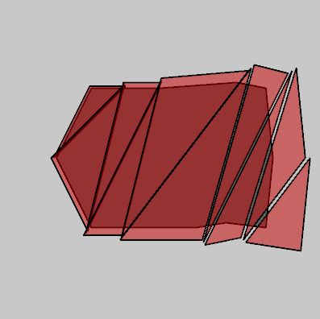

[sketch_2021_07_08a](https://github.com/villares/sketch-a-day/tree/master/2021/sketch_2021_07_08a) [[Py.Processing](https://villares.github.io/como-instalar-o-processing-modo-python/index-EN)]

---

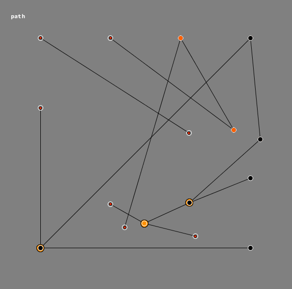

[sketch_2021_07_07b](https://github.com/villares/sketch-a-day/tree/master/2021/sketch_2021_07_07b) [[Py.Processing](https://villares.github.io/como-instalar-o-processing-modo-python/index-EN)]

---

[sketch_2021_07_06b](https://github.com/villares/sketch-a-day/tree/master/2021/sketch_2021_07_06b) [[Py.Processing](https://villares.github.io/como-instalar-o-processing-modo-python/index-EN)]

---

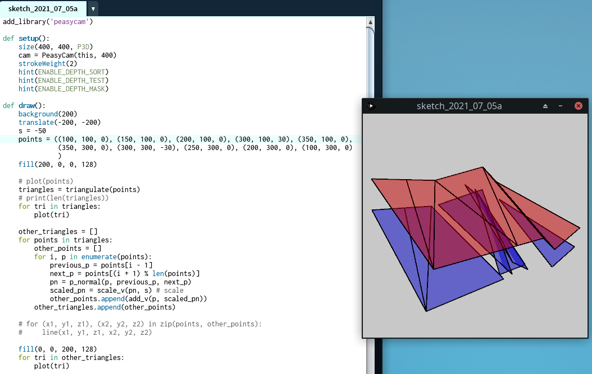

[sketch_2021_07_05a](https://github.com/villares/sketch-a-day/tree/master/2021/sketch_2021_07_05a) [[Py.Processing](https://villares.github.io/como-instalar-o-processing-modo-python/index-EN)]

---

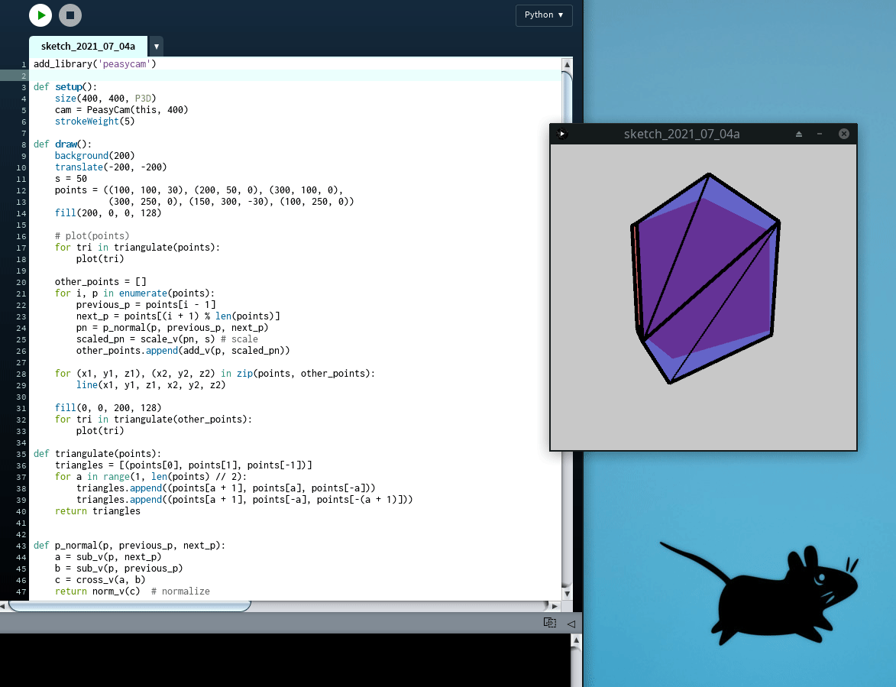

[sketch_2021_07_04a](https://github.com/villares/sketch-a-day/tree/master/2021/sketch_2021_07_04a) [[Py.Processing](https://villares.github.io/como-instalar-o-processing-modo-python/index-EN)]

---

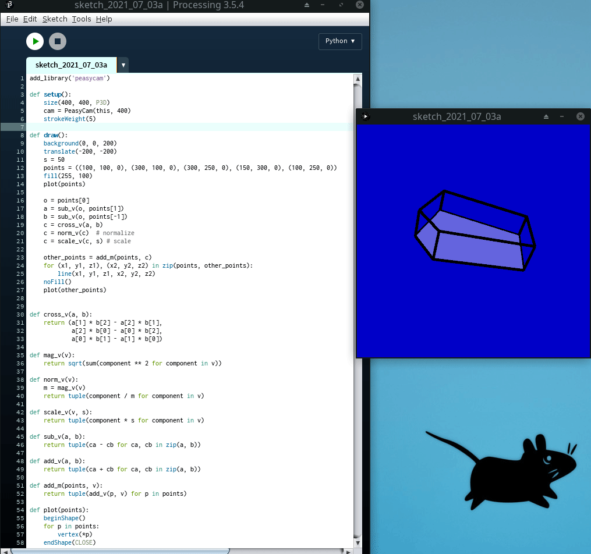

[sketch_2021_07_03a](https://github.com/villares/sketch-a-day/tree/master/2021/sketch_2021_07_03a) [[Py.Processing](https://villares.github.io/como-instalar-o-processing-modo-python/index-EN)]

---

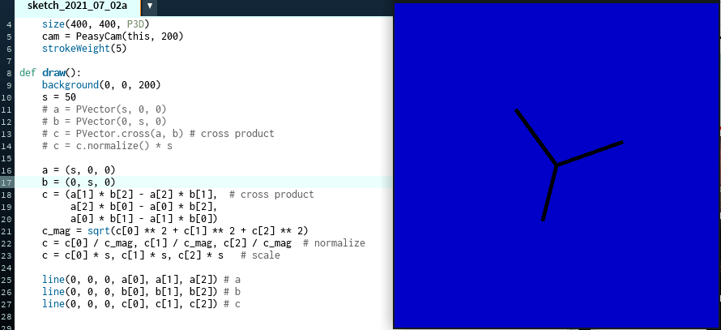

[sketch_2021_07_02a](https://github.com/villares/sketch-a-day/tree/master/2021/sketch_2021_07_02a) [[Py.Processing](https://villares.github.io/como-instalar-o-processing-modo-python/index-EN)]

---

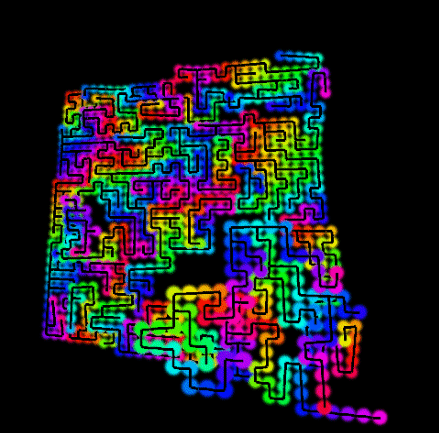

[sketch_2021_07_01_maze](https://github.com/villares/sketch-a-day/tree/master/2021/sketch_2021_07_01_maze) [[Py.Processing](https://villares.github.io/como-instalar-o-processing-modo-python/index-EN)]

---

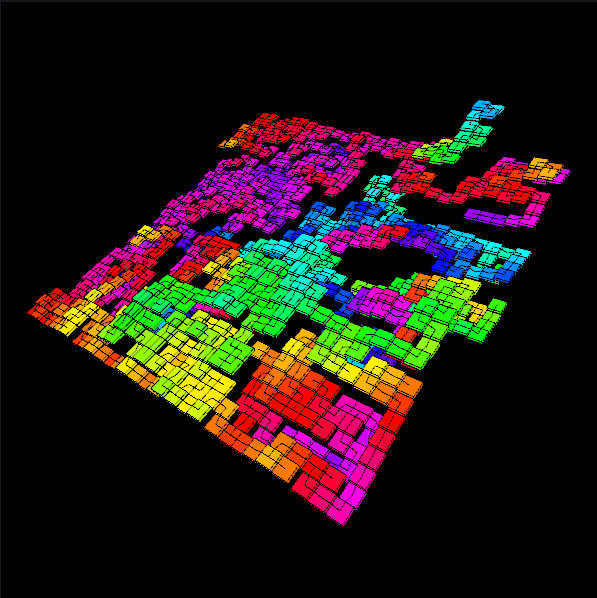

[sketch_2021_06_30_maze2](https://github.com/villares/sketch-a-day/tree/master/2021/sketch_2021_06_30_maze2) [[Py.Processing](https://villares.github.io/como-instalar-o-processing-modo-python/index-EN)]

---

[sketch_2021_06_29_maze2](https://github.com/villares/sketch-a-day/tree/master/2021/sketch_2021_06_29_maze2) [[Py.Processing](https://villares.github.io/como-instalar-o-processing-modo-python/index-EN)]

---

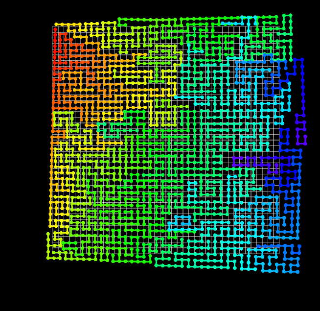

[sketch_2021_06_28_maze](https://github.com/villares/sketch-a-day/tree/master/2021/sketch_2021_06_28_maze) [[Py.Processing](https://villares.github.io/como-instalar-o-processing-modo-python/index-EN)]

---

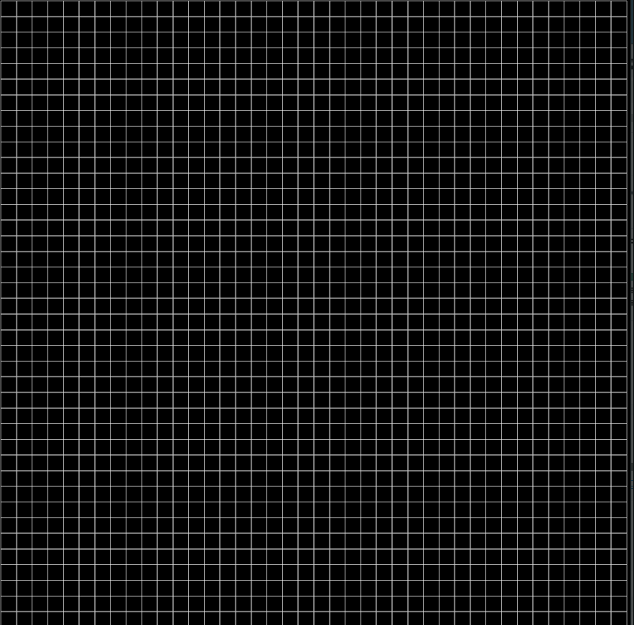

[sketch_2021_06_27_maze](https://github.com/villares/sketch-a-day/tree/master/2021/sketch_2021_06_27_maze) [[Py.Processing](https://villares.github.io/como-instalar-o-processing-modo-python/index-EN)]

---

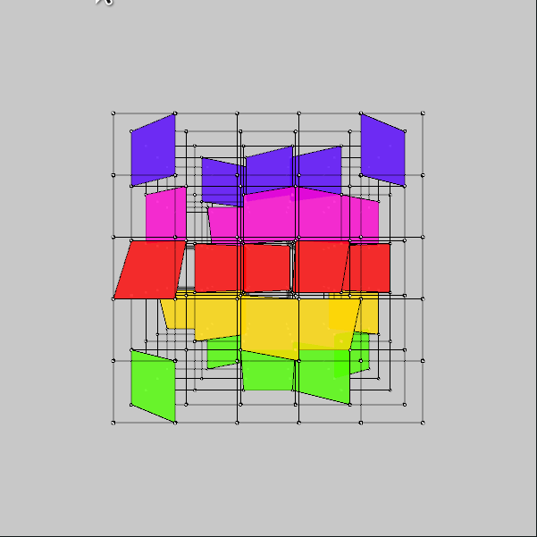

[sketch_2021_06_26a](https://github.com/villares/sketch-a-day/tree/master/2021/sketch_2021_06_26a) [[Py.Processing](https://villares.github.io/como-instalar-o-processing-modo-python/index-EN)]

---

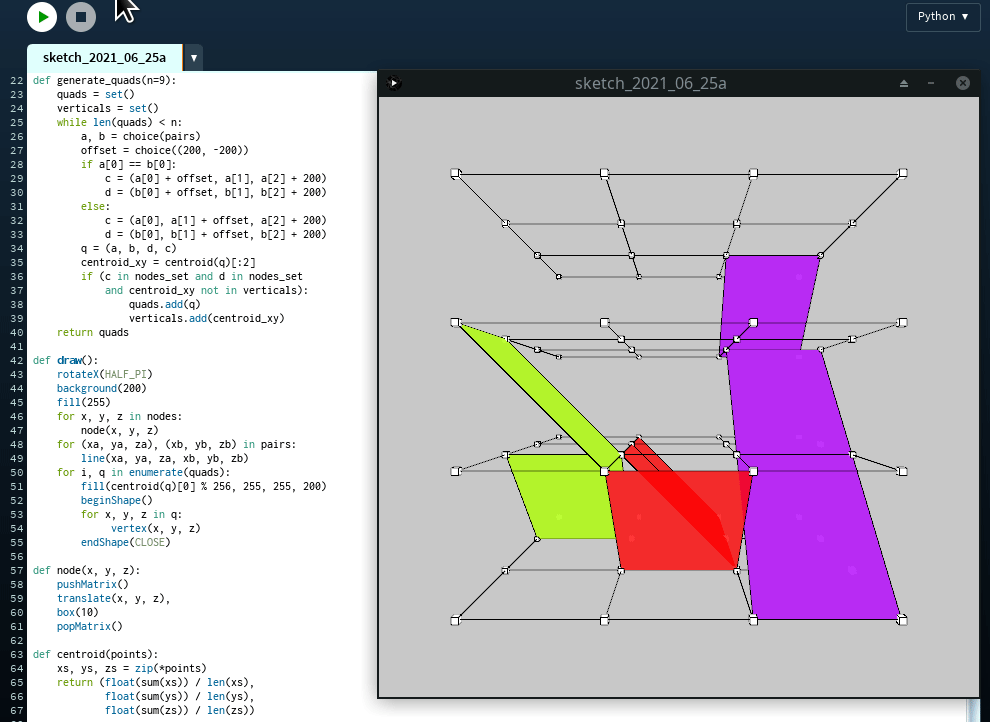

[sketch_2021_06_25a](https://github.com/villares/sketch-a-day/tree/master/2021/sketch_2021_06_25a) [[Py.Processing](https://villares.github.io/como-instalar-o-processing-modo-python/index-EN)]

---

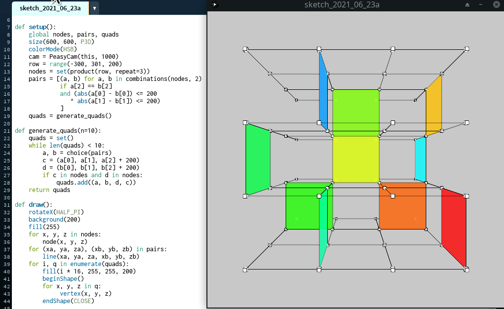

[sketch_2021_06_24a](https://github.com/villares/sketch-a-day/tree/master/2021/sketch_2021_06_24a) [[Py.Processing](https://villares.github.io/como-instalar-o-processing-modo-python/index-EN)]

---

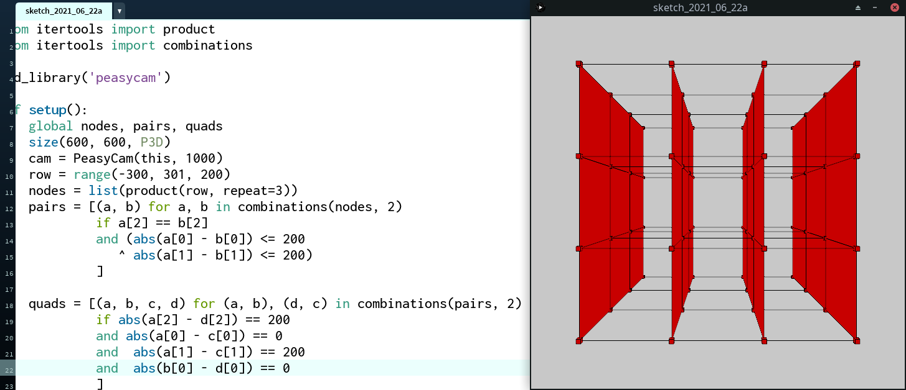

[sketch_2021_06_23a](https://github.com/villares/sketch-a-day/tree/master/2021/sketch_2021_06_23a) [[Py.Processing](https://villares.github.io/como-instalar-o-processing-modo-python/index-EN)]

---

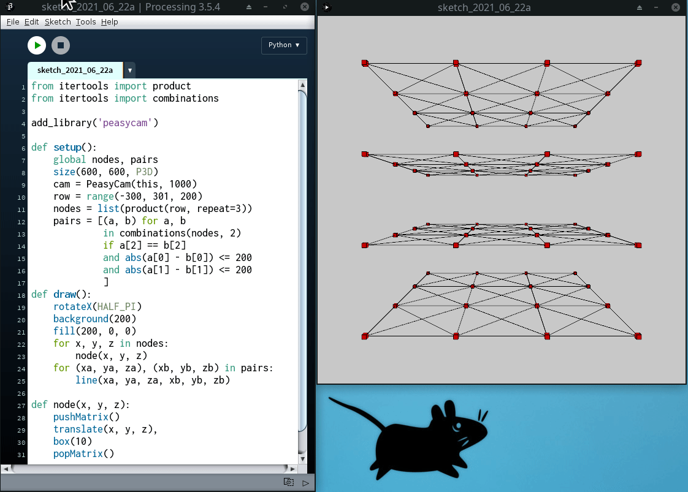

[sketch_2021_06_22a](https://github.com/villares/sketch-a-day/tree/master/2021/sketch_2021_06_22a) [[Py.Processing](https://villares.github.io/como-instalar-o-processing-modo-python/index-EN)]

---

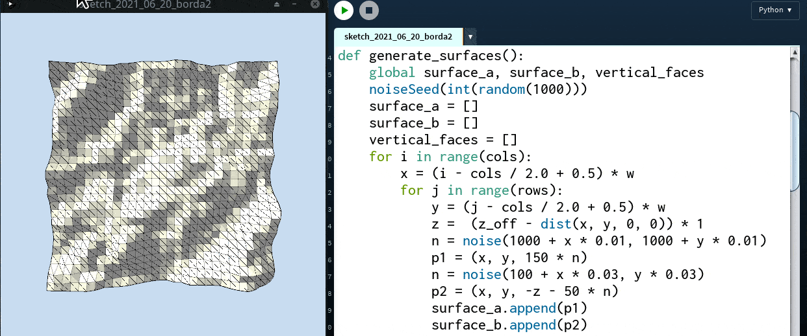

[sketch_2021_06_21c_noise_terrain](https://github.com/villares/sketch-a-day/tree/master/2021/sketch_2021_06_21c_noise_terrain) [[Py.Processing](https://villares.github.io/como-instalar-o-processing-modo-python/index-EN)]

---

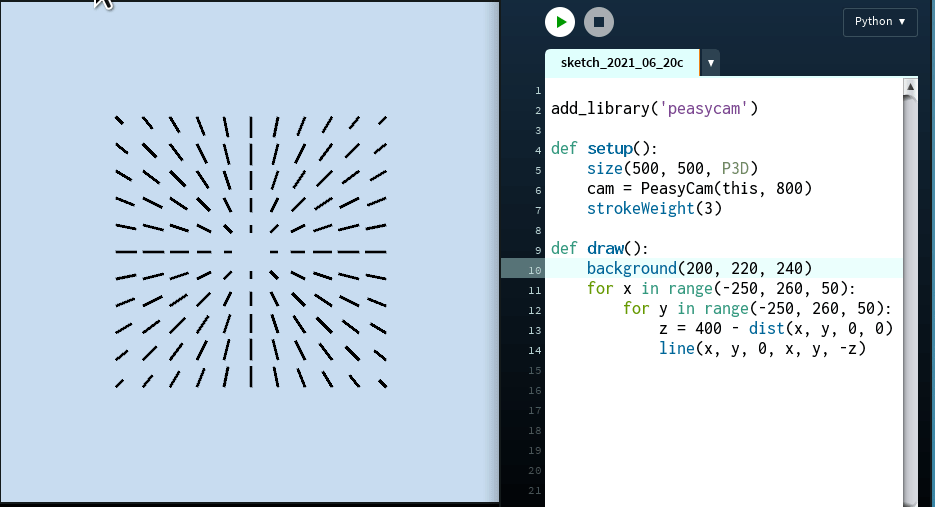

[sketch_2021_06_20c](https://github.com/villares/sketch-a-day/tree/master/2021/sketch_2021_06_20c) [[Py.Processing](https://villares.github.io/como-instalar-o-processing-modo-python/index-EN)]

---

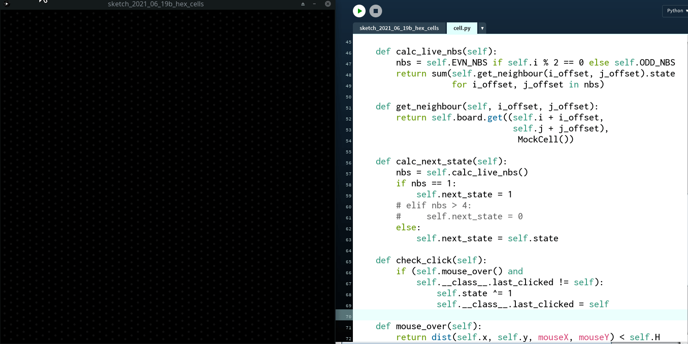

[sketch_2021_06_19b_hex_cells](https://github.com/villares/sketch-a-day/tree/master/2021/sketch_2021_06_19b_hex_cells) [[Py.Processing](https://villares.github.io/como-instalar-o-processing-modo-python/index-EN)]

---

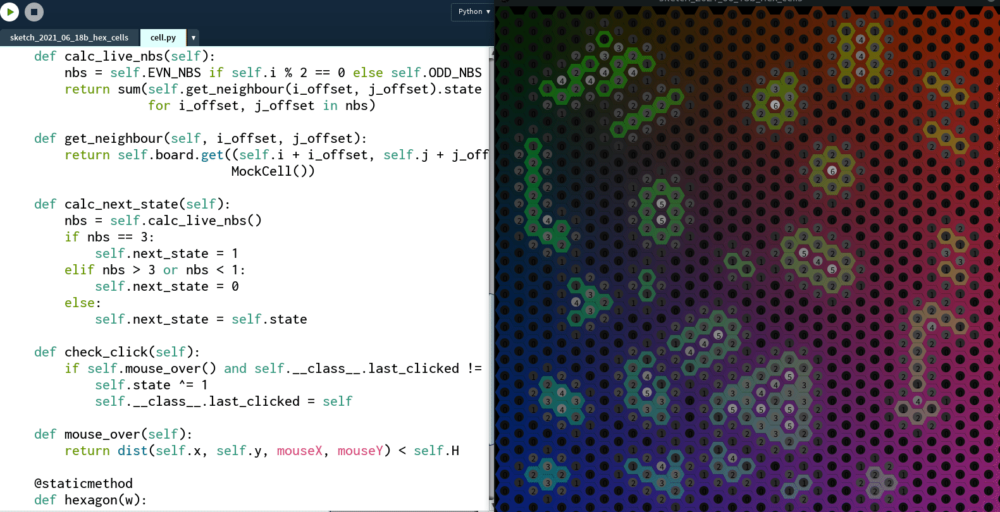

[sketch_2021_06_18b_hex_cells](https://github.com/villares/sketch-a-day/tree/master/2021/sketch_2021_06_18b_hex_cells) [[Py.Processing](https://villares.github.io/como-instalar-o-processing-modo-python/index-EN)]

---

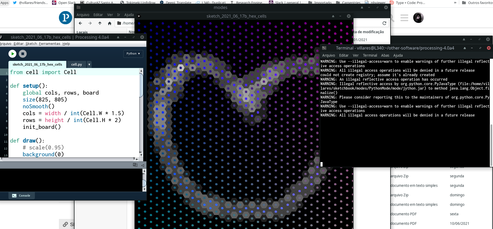

[sketch_2021_06_17b_hex_cells](https://github.com/villares/sketch-a-day/tree/master/2021/sketch_2021_06_17b_hex_cells) [[Py.Processing](https://villares.github.io/como-instalar-o-processing-modo-python/index-EN)]

---

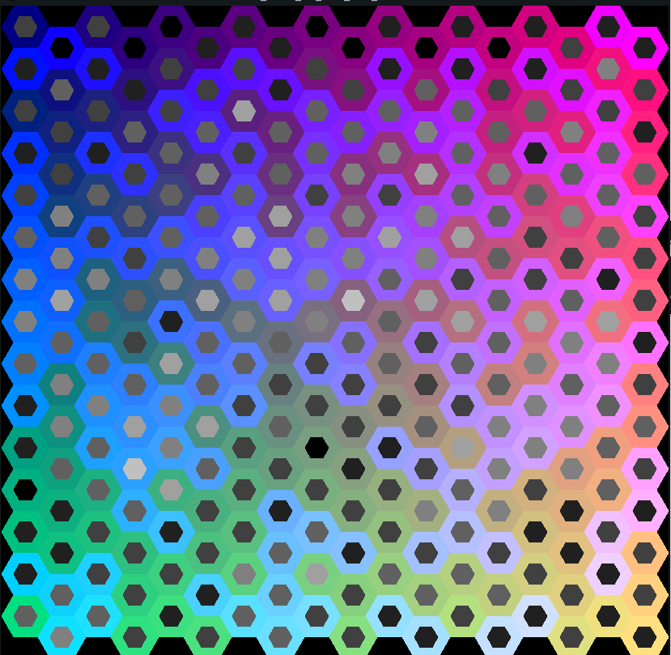

[sketch_2021_06_15b_hex_cells](https://github.com/villares/sketch-a-day/tree/master/2021/sketch_2021_06_15b_hex_cells) [[Py.Processing](https://villares.github.io/como-instalar-o-processing-modo-python/index-EN)]

---

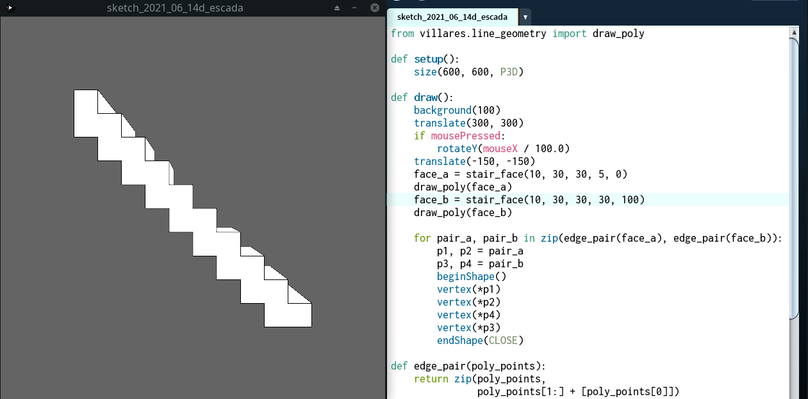

[sketch_2021_06_14d_escada](https://github.com/villares/sketch-a-day/tree/master/2021/sketch_2021_06_14d_escada) [[Py.Processing](https://villares.github.io/como-instalar-o-processing-modo-python/index-EN)]

---

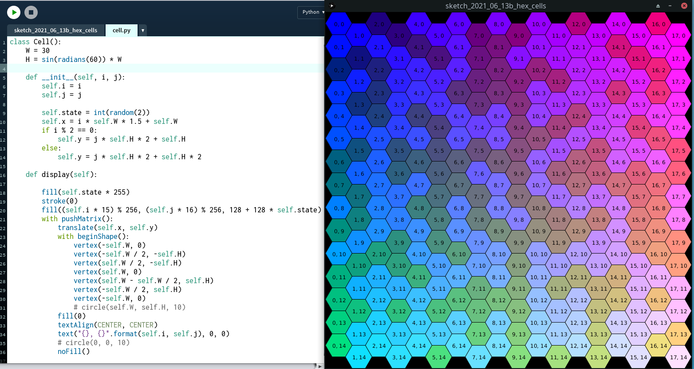

[sketch_2021_06_13b_hex_cells](https://github.com/villares/sketch-a-day/tree/master/2021/sketch_2021_06_13b_hex_cells) [[Py.Processing](https://villares.github.io/como-instalar-o-processing-modo-python/index-EN)]

---

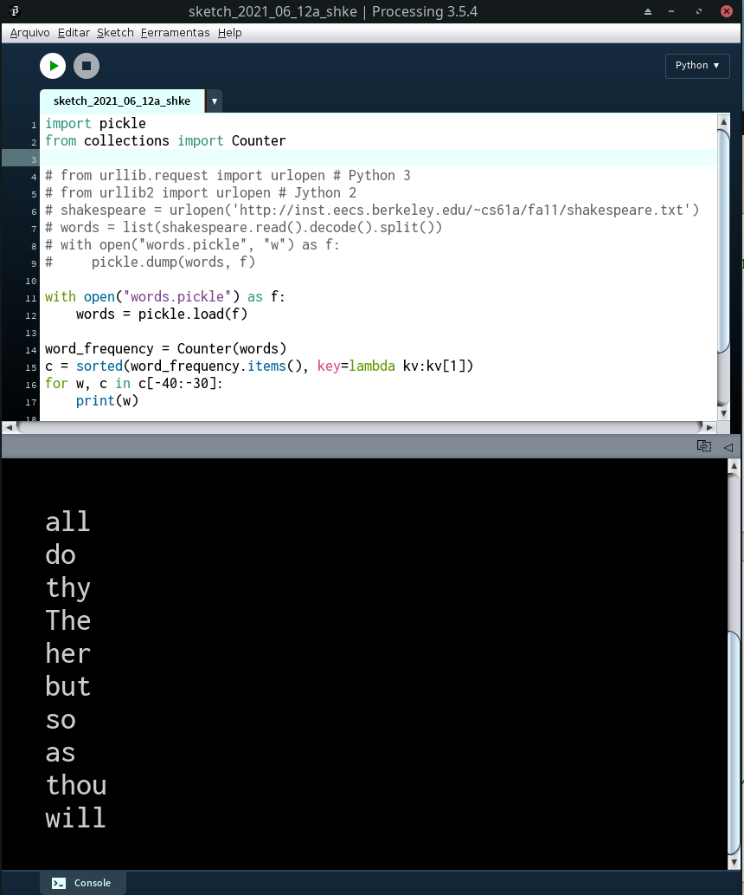

[sketch_2021_06_12a_shake](https://github.com/villares/sketch-a-day/tree/master/2021/sketch_2021_06_12a_shake) [[Py.Processing](https://villares.github.io/como-instalar-o-processing-modo-python/index-EN)]

---

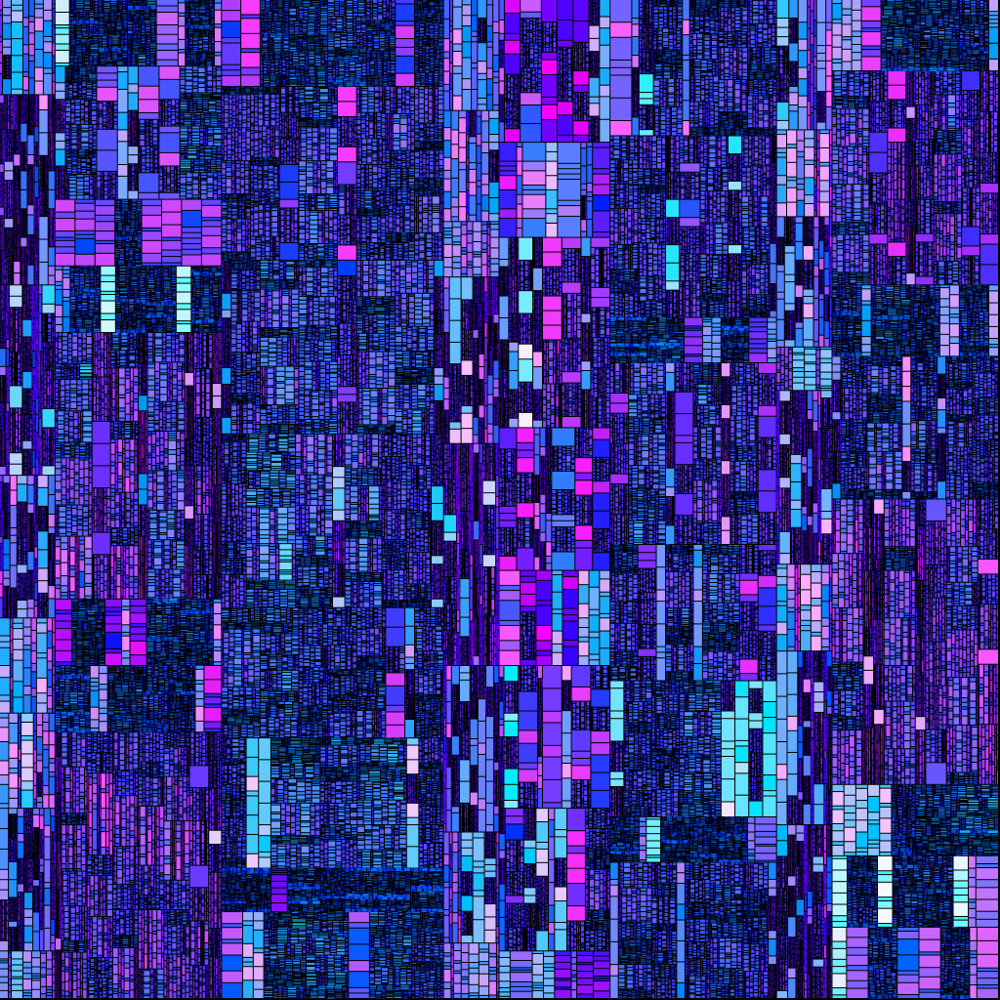

[sketch_2021_06_11a](https://github.com/villares/sketch-a-day/tree/master/2021/sketch_2021_06_11a) [[Py.Processing](https://villares.github.io/como-instalar-o-processing-modo-python/index-EN)]

---

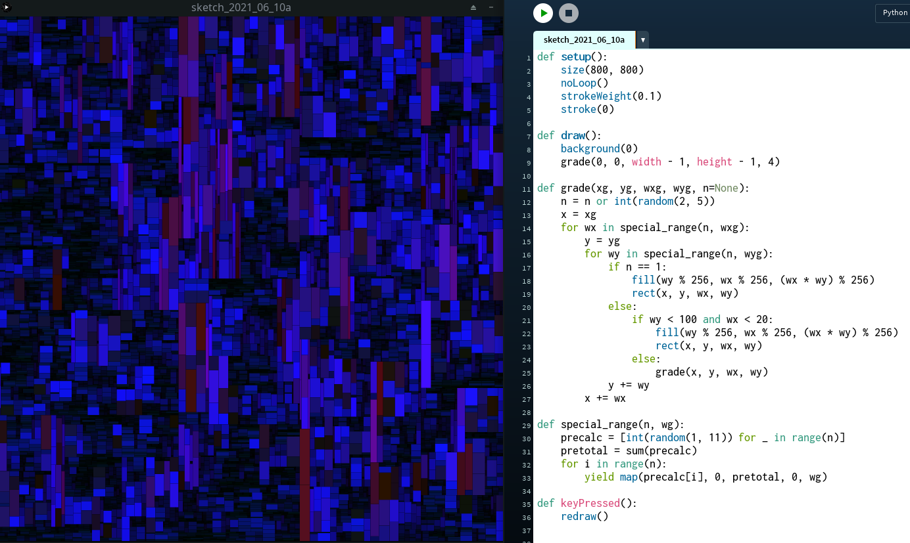

[sketch_2021_06_10a](https://github.com/villares/sketch-a-day/tree/master/2021/sketch_2021_06_10a) [[Py.Processing](https://villares.github.io/como-instalar-o-processing-modo-python/index-EN)]

---

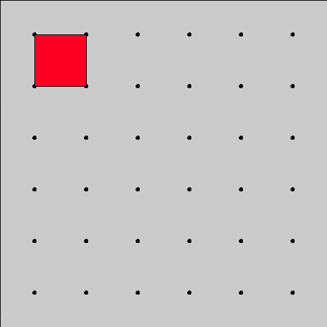

[sketch_2021_06_09](https://github.com/villares/sketch-a-day/tree/master/2021/sketch_2021_06_09) [[Py.Processing](https://villares.github.io/como-instalar-o-processing-modo-python/index-EN)]

---

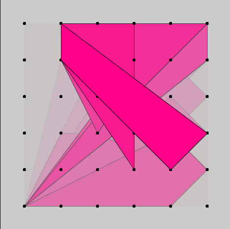

[sketch_2021_06_08](https://github.com/villares/sketch-a-day/tree/master/2021/sketch_2021_06_08) [[Py.Processing](https://villares.github.io/como-instalar-o-processing-modo-python/index-EN)]

---

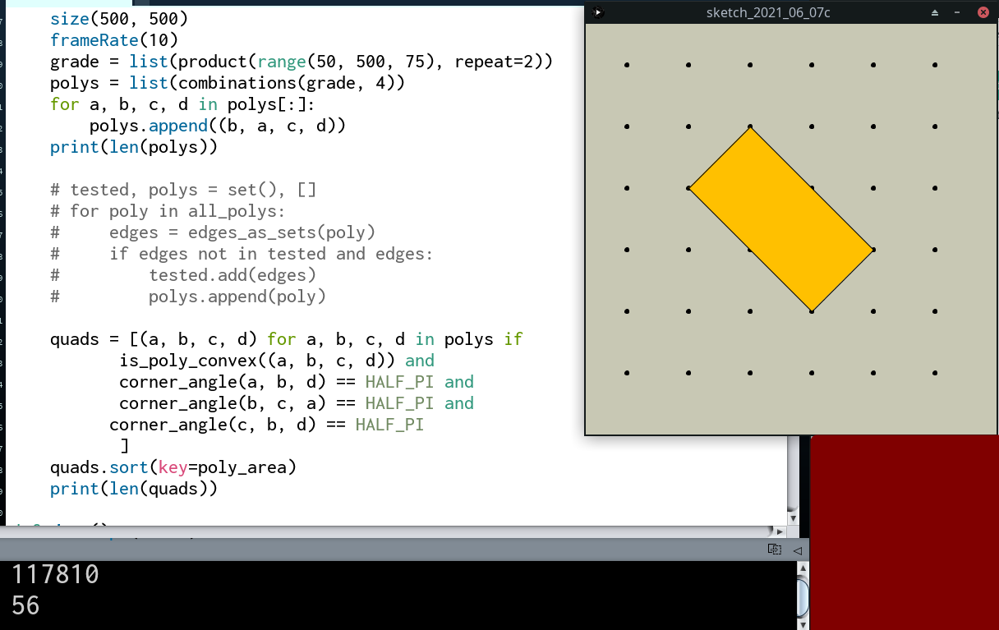

[sketch_2021_06_07c](https://github.com/villares/sketch-a-day/tree/master/2021/sketch_2021_06_07c) [[Py.Processing](https://villares.github.io/como-instalar-o-processing-modo-python/index-EN)]

---

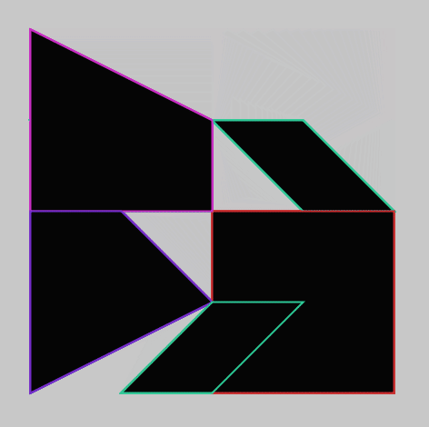

[sketch_2021_06_06c](https://github.com/villares/sketch-a-day/tree/master/2021/sketch_2021_06_06c) [[Py.Processing](https://villares.github.io/como-instalar-o-processing-modo-python/index-EN)]

---

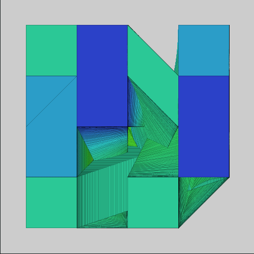

[sketch_2021_06_05c](https://github.com/villares/sketch-a-day/tree/master/2021/sketch_2021_06_05c) [[Py.Processing](https://villares.github.io/como-instalar-o-processing-modo-python/index-EN)]

---

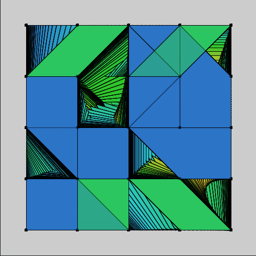

[sketch_2021_06_04c](https://github.com/villares/sketch-a-day/tree/master/2021/sketch_2021_06_04c) [[Py.Processing](https://villares.github.io/como-instalar-o-processing-modo-python/index-EN)]

---

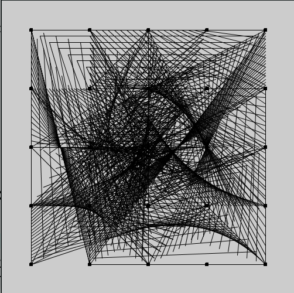

[sketch_2021_06_03c](https://github.com/villares/sketch-a-day/tree/master/2021/sketch_2021_06_03c) [[Py.Processing](https://villares.github.io/como-instalar-o-processing-modo-python/index-EN)]

---

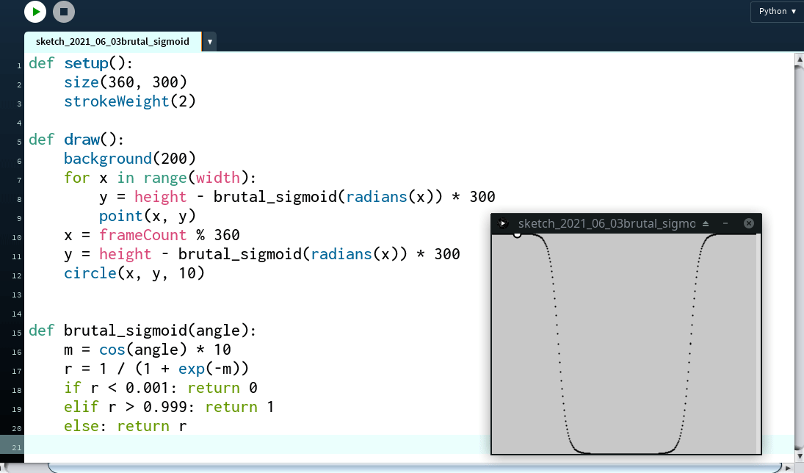

[sketch_2021_06_03brutal_sigmoid](https://github.com/villares/sketch-a-day/tree/master/2021/sketch_2021_06_03brutal_sigmoid) [[Py.Processing](https://villares.github.io/como-instalar-o-processing-modo-python/index-EN)]

---

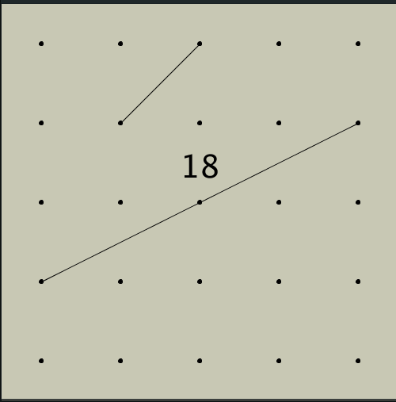

[sketch_2021_06_02c](https://github.com/villares/sketch-a-day/tree/master/2021/sketch_2021_06_02c) [[Py.Processing](https://villares.github.io/como-instalar-o-processing-modo-python/index-EN)]

---

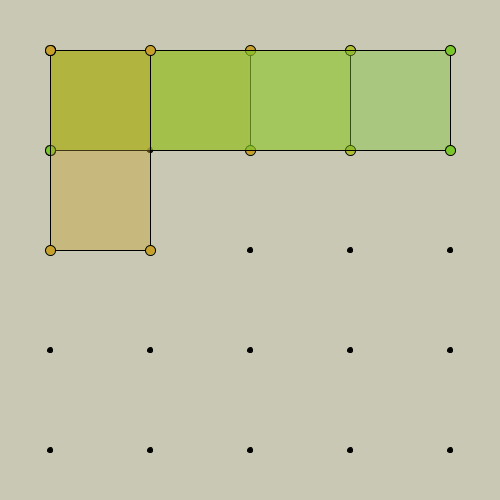

[sketch_2021_06_01b_combinatorics](https://github.com/villares/sketch-a-day/tree/master/2021/sketch_2021_06_01b_combinatorics) [[Py.Processing](https://villares.github.io/como-instalar-o-processing-modo-python/index-EN)]

---

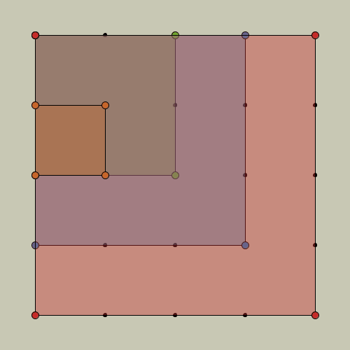

[sketch_2021_06_01_combinatorics](https://github.com/villares/sketch-a-day/tree/master/2021/sketch_2021_06_01_combinatorics) [[Py.Processing](https://villares.github.io/como-instalar-o-processing-modo-python/index-EN)]

---

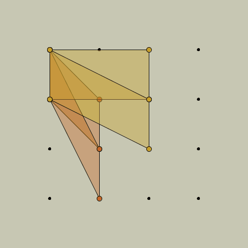

[sketch_2021_05_31_combinatorics](https://github.com/villares/sketch-a-day/tree/master/2021/sketch_2021_05_31_combinatorics) [[Py.Processing](https://villares.github.io/como-instalar-o-processing-modo-python/index-EN)]

---

[sketch_2021_05_30_combinatorics](https://github.com/villares/sketch-a-day/tree/master/2021/sketch_2021_05_30_combinatorics) [[Py.Processing](https://villares.github.io/como-instalar-o-processing-modo-python/index-EN)]

---

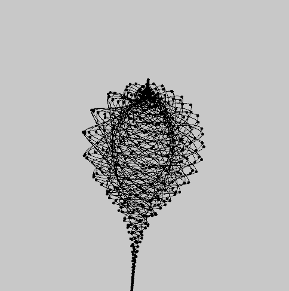

[sketch_2021_05_29a_3D](https://github.com/villares/sketch-a-day/tree/master/2021/sketch_2021_05_29a_3D) [[Py.Processing](https://villares.github.io/como-instalar-o-processing-modo-python/index-EN)]

---

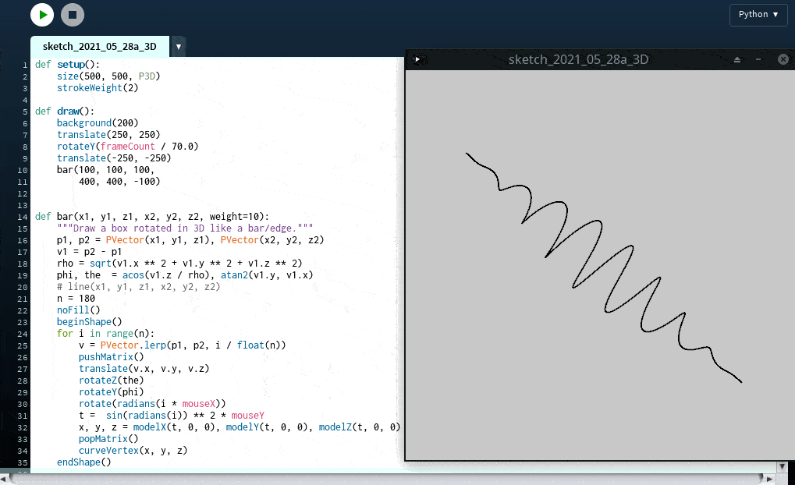

[sketch_2021_05_28a_3D](https://github.com/villares/sketch-a-day/tree/master/2021/sketch_2021_05_28a_3D) [[Py.Processing](https://villares.github.io/como-instalar-o-processing-modo-python/index-EN)]

---

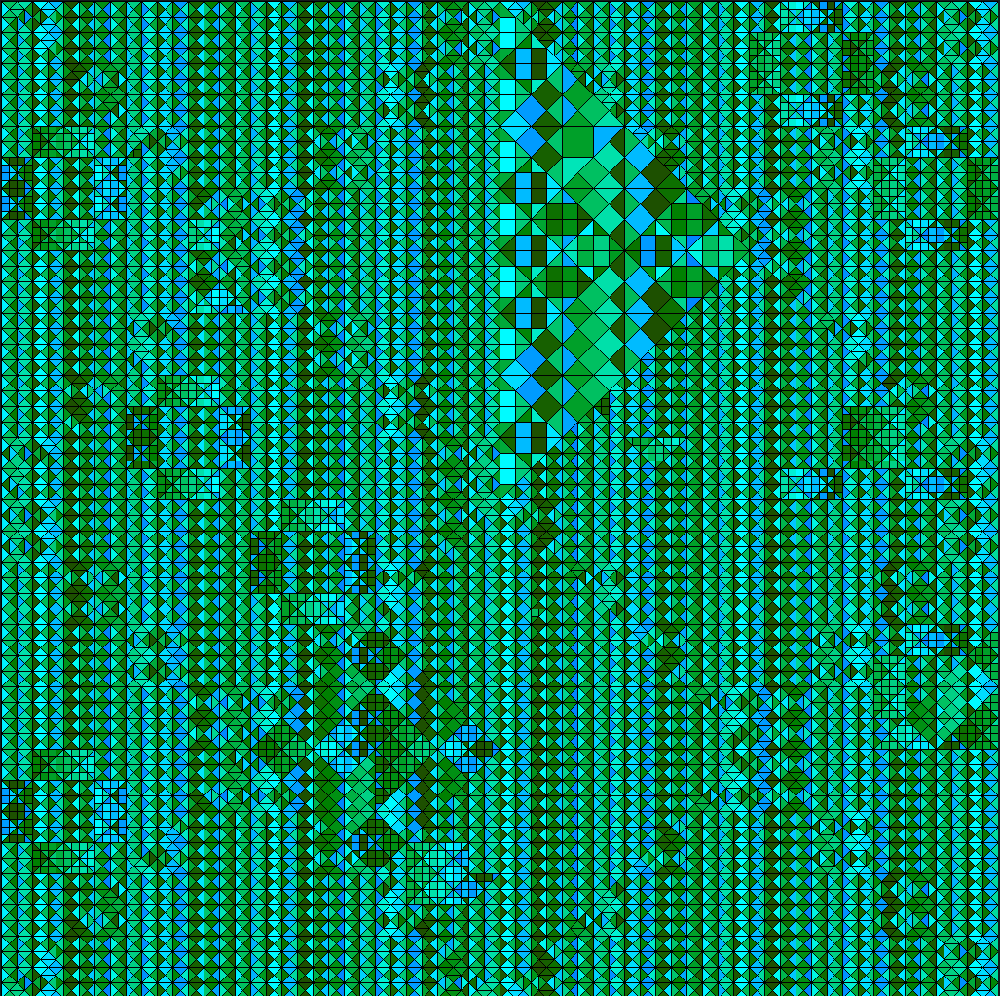

[sketch_2021_05_27b](https://github.com/villares/sketch-a-day/tree/master/2021/sketch_2021_05_27b) [[Py.Processing](https://villares.github.io/como-instalar-o-processing-modo-python/index-EN)]

---

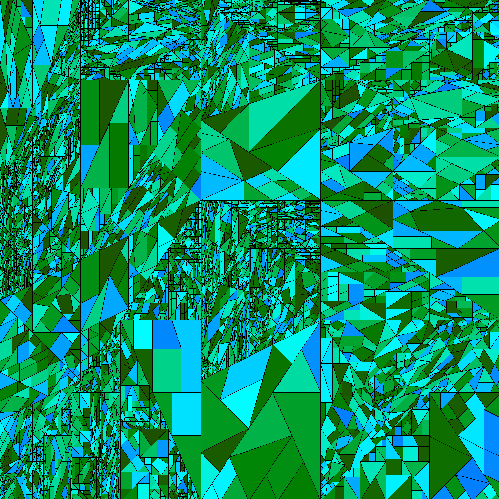

[sketch_2021_05_26b](https://github.com/villares/sketch-a-day/tree/master/2021/sketch_2021_05_26b) [[Py.Processing](https://villares.github.io/como-instalar-o-processing-modo-python/index-EN)]

---

[sketch_2021_05_25b](https://github.com/villares/sketch-a-day/tree/master/2021/sketch_2021_05_25b) [[Py.Processing](https://villares.github.io/como-instalar-o-processing-modo-python/index-EN)]

---

[sketch_2021_05_24b](https://github.com/villares/sketch-a-day/tree/master/2021/sketch_2021_05_24b) [[Py.Processing](https://villares.github.io/como-instalar-o-processing-modo-python/index-EN)]

---

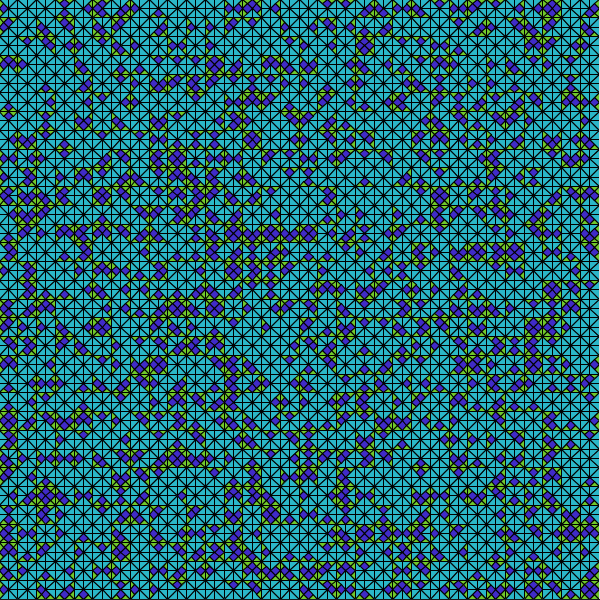

[sketch_2021_05_23b](https://github.com/villares/sketch-a-day/tree/master/2021/sketch_2021_05_23b) [[Py.Processing](https://villares.github.io/como-instalar-o-processing-modo-python/index-EN)]

---

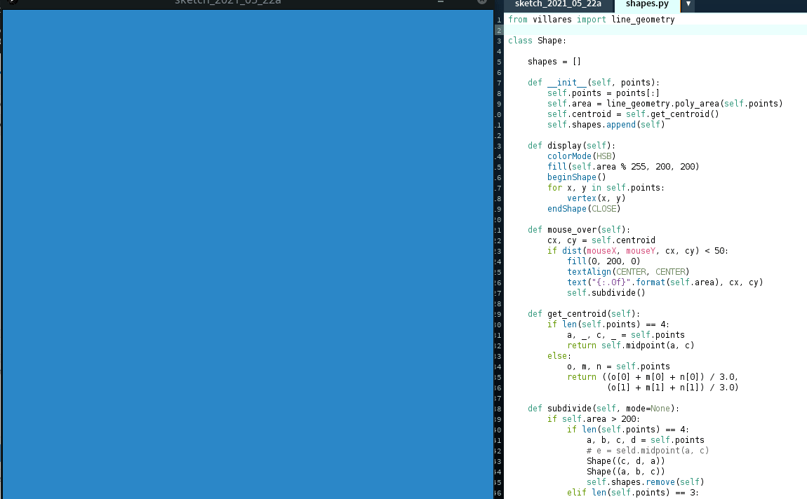

[sketch_2021_05_22a](https://github.com/villares/sketch-a-day/tree/master/2021/sketch_2021_05_22a) [[Py.Processing](https://villares.github.io/como-instalar-o-processing-modo-python/index-EN)]

---

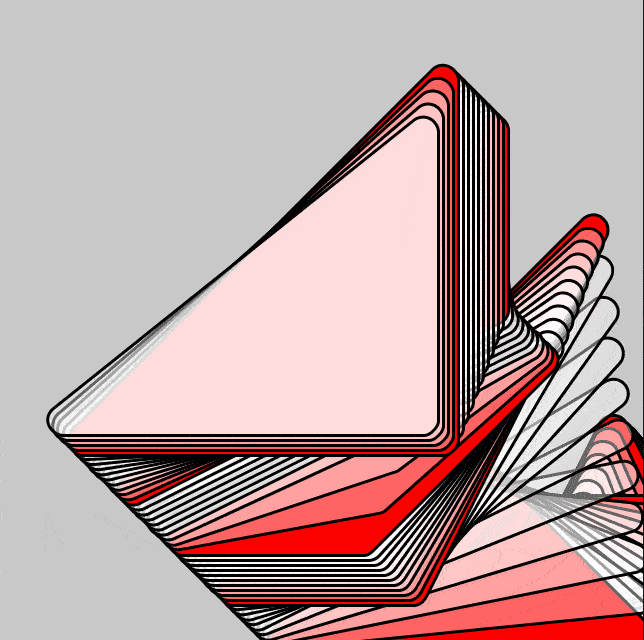

[sketch_2021_05_21e](https://github.com/villares/sketch-a-day/tree/master/2021/sketch_2021_05_21e) [[Py.Processing](https://villares.github.io/como-instalar-o-processing-modo-python/index-EN)]

---

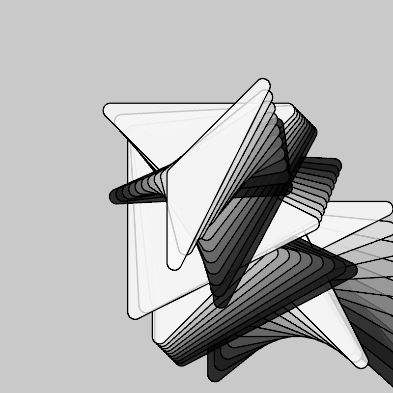

[sketch_2021_05_21d](https://github.com/villares/sketch-a-day/tree/master/2021/sketch_2021_05_21d) [[Py.Processing](https://villares.github.io/como-instalar-o-processing-modo-python/index-EN)]

---

[sketch_2021_05_20e](https://github.com/villares/sketch-a-day/tree/master/2021/sketch_2021_05_20e) [[Py.Processing](https://villares.github.io/como-instalar-o-processing-modo-python/index-EN)]

---

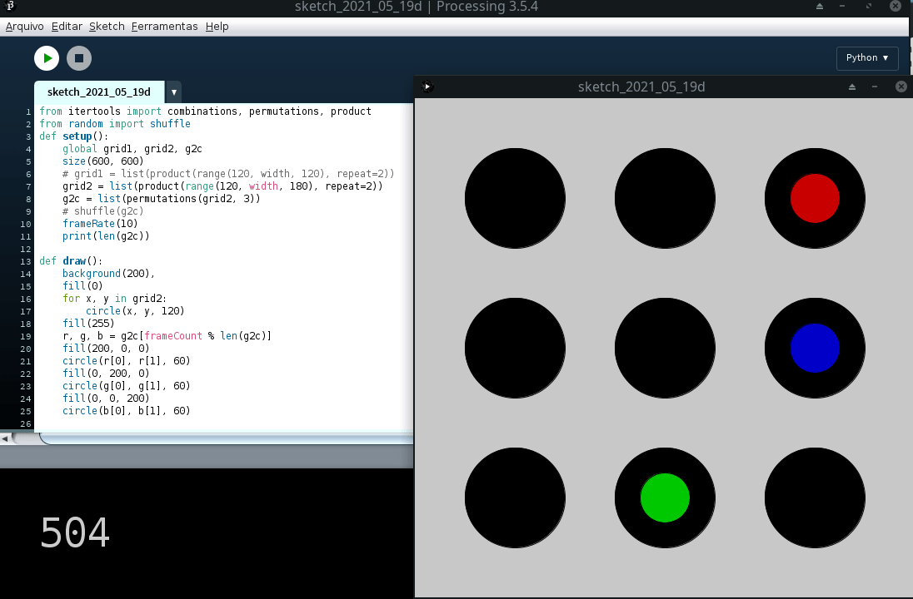

[sketch_2021_05_19d](https://github.com/villares/sketch-a-day/tree/master/2021/sketch_2021_05_19d) [[Py.Processing](https://villares.github.io/como-instalar-o-processing-modo-python/index-EN)]

---

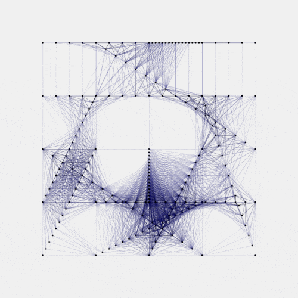

[sketch_2021_05_18d](https://github.com/villares/sketch-a-day/tree/master/2021/sketch_2021_05_18d) [[Py.Processing](https://villares.github.io/como-instalar-o-processing-modo-python/index-EN)]

---

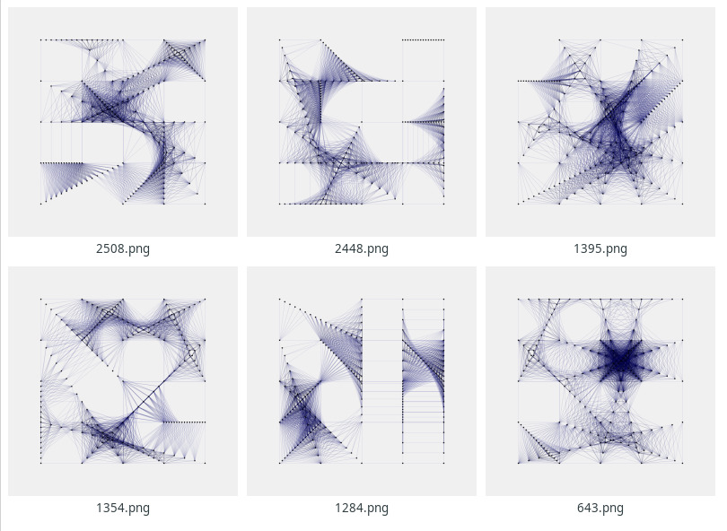

[sketch_2021_05_17c](https://github.com/villares/sketch-a-day/tree/master/2021/sketch_2021_05_17c) [[Py.Processing](https://villares.github.io/como-instalar-o-processing-modo-python/index-EN)]

---

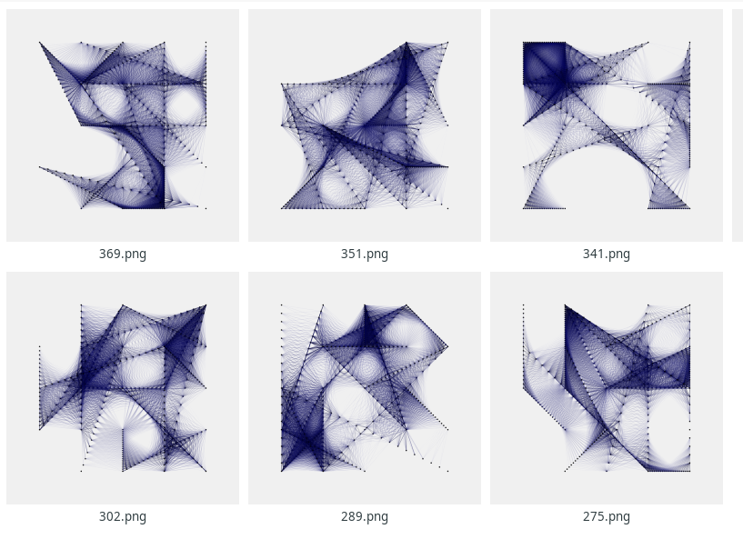

[sketch_2021_05_17b](https://github.com/villares/sketch-a-day/tree/master/2021/sketch_2021_05_17b) [[Py.Processing](https://villares.github.io/como-instalar-o-processing-modo-python/index-EN)]

---

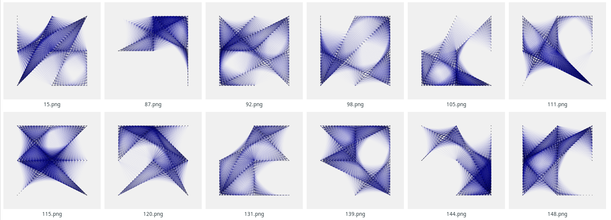

[sketch_2021_05_15b](https://github.com/villares/sketch-a-day/tree/master/2021/sketch_2021_05_15b) [[Py.Processing](https://villares.github.io/como-instalar-o-processing-modo-python/index-EN)]

---

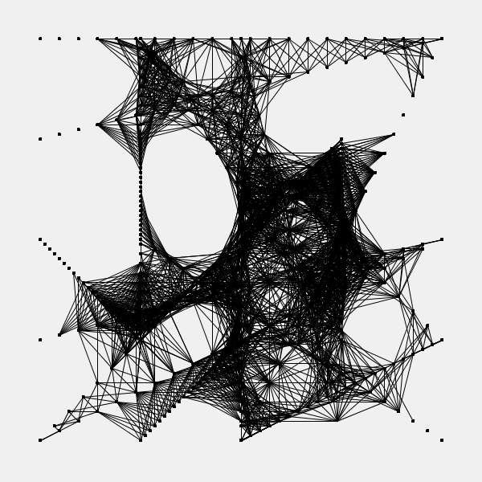

[sketch_2021_05_14b](https://github.com/villares/sketch-a-day/tree/master/2021/sketch_2021_05_14b) [[Py.Processing](https://villares.github.io/como-instalar-o-processing-modo-python/index-EN)]

---

[sketch_2021_05_13e](https://github.com/villares/sketch-a-day/tree/master/2021/sketch_2021_05_13e) [[Py.Processing](https://villares.github.io/como-instalar-o-processing-modo-python/index-EN)]

---

[sketch_2021_05_12e_bolinha](https://github.com/villares/sketch-a-day/tree/master/2021/sketch_2021_05_12e_bolinha) [[Py.Processing](https://villares.github.io/como-instalar-o-processing-modo-python/index-EN)]

---

[sketch_2021_05_11b](https://github.com/villares/sketch-a-day/tree/master/2021/sketch_2021_05_11b) [[Py.Processing](https://villares.github.io/como-instalar-o-processing-modo-python/index-EN)]

---

[sketch_2021_05_10e_bolinha](https://github.com/villares/sketch-a-day/tree/master/2021/sketch_2021_05_10e_bolinha) [[Py.Processing](https://villares.github.io/como-instalar-o-processing-modo-python/index-EN)]

---

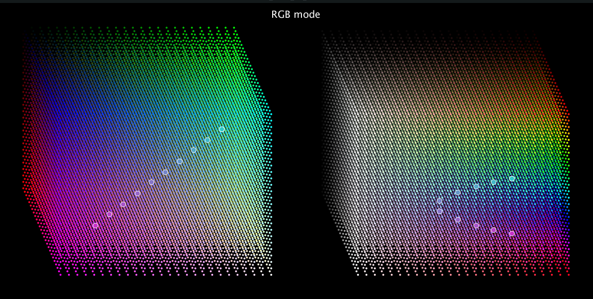

[sketch_2021_05_09a](https://github.com/villares/sketch-a-day/tree/master/2021/sketch_2021_05_09a) [[Py.Processing](https://villares.github.io/como-instalar-o-processing-modo-python/index-EN)]

---

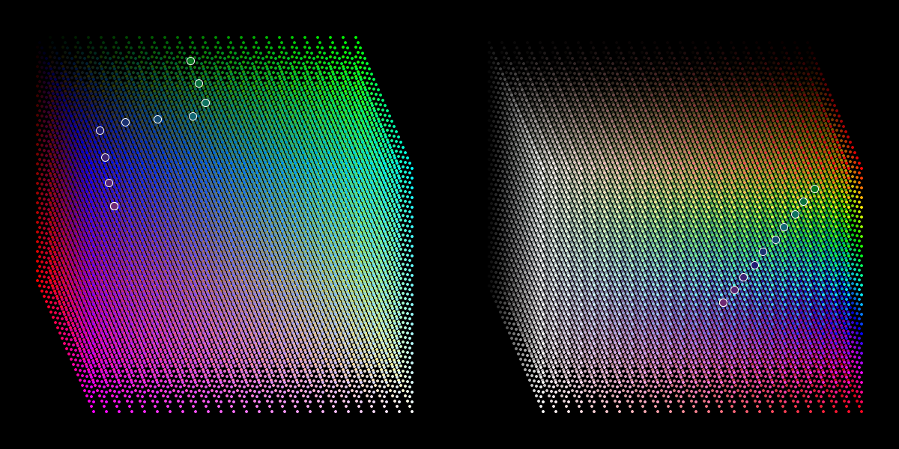

[sketch_2021_05_08a](https://github.com/villares/sketch-a-day/tree/master/2021/sketch_2021_05_08a) [[Py.Processing](https://villares.github.io/como-instalar-o-processing-modo-python/index-EN)]

---

[sketch_2021_05_07a](https://github.com/villares/sketch-a-day/tree/master/2021/sketch_2021_05_07a) [[Py.Processing](https://villares.github.io/como-instalar-o-processing-modo-python/index-EN)]

---

[sketch_2021_05_06_ada](https://github.com/villares/sketch-a-day/tree/master/2021/sketch_2021_05_06_ada) [[Py.Processing](https://villares.github.io/como-instalar-o-processing-modo-python/index-EN)]

---

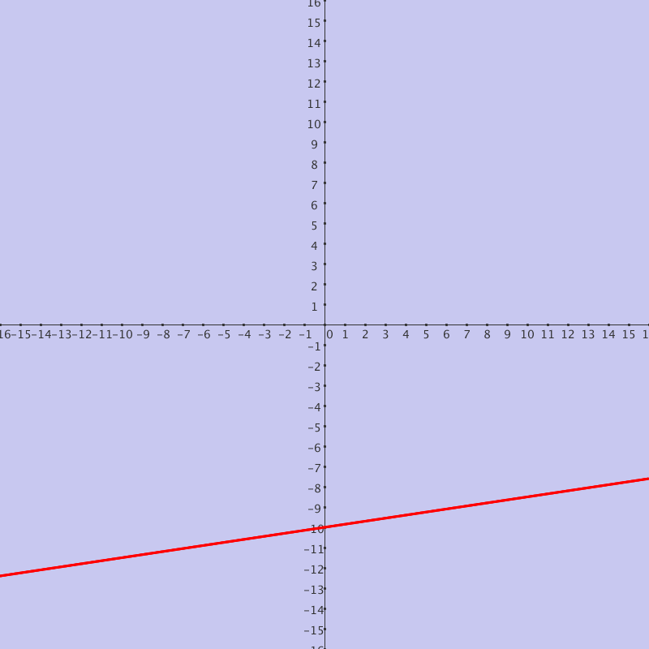

[sketch_2021_05_05b](https://github.com/villares/sketch-a-day/tree/master/2021/sketch_2021_05_05b) [[Py.Processing](https://villares.github.io/como-instalar-o-processing-modo-python/index-EN)]

---

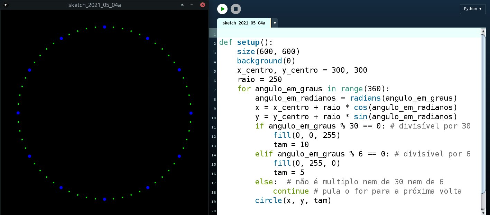

[sketch_2021_05_04a](https://github.com/villares/sketch-a-day/tree/master/2021/sketch_2021_05_04a) [[Py.Processing](https://villares.github.io/como-instalar-o-processing-modo-python/index-EN)]

---

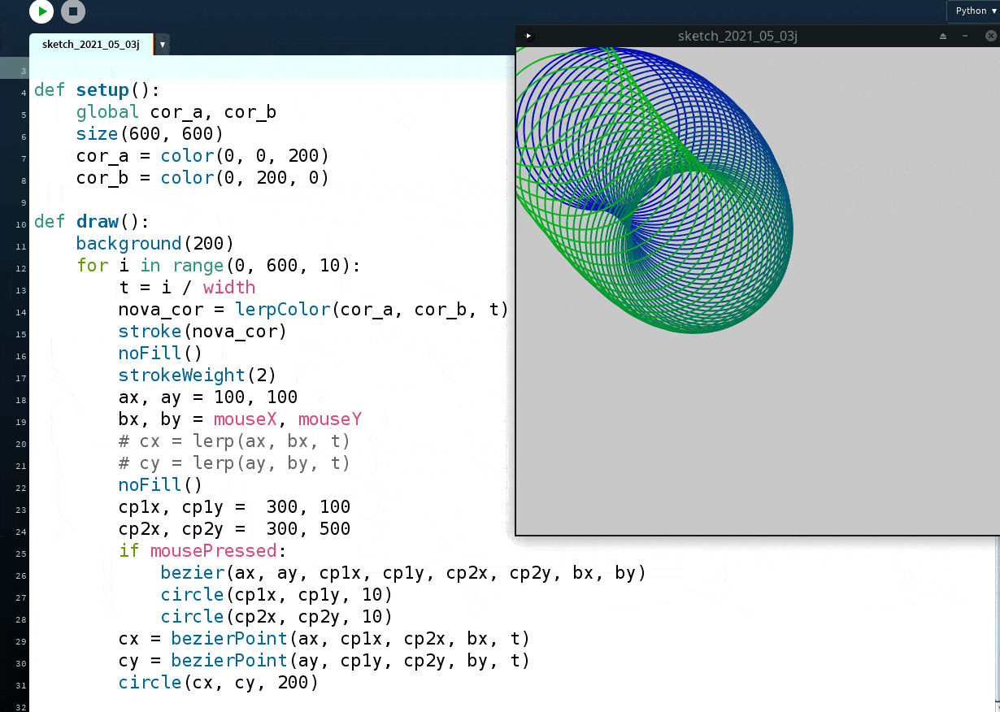

[sketch_2021_05_03j](https://github.com/villares/sketch-a-day/tree/master/2021/sketch_2021_05_03j) [[Py.Processing](https://villares.github.io/como-instalar-o-processing-modo-python/index-EN)]

---

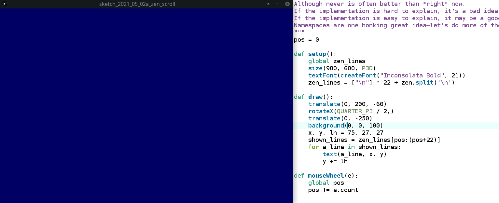

[sketch_2021_05_02a_zen_scroll](https://github.com/villares/sketch-a-day/tree/master/2021/sketch_2021_05_02a_zen_scroll) [[Py.Processing](https://villares.github.io/como-instalar-o-processing-modo-python/index-EN)]

---

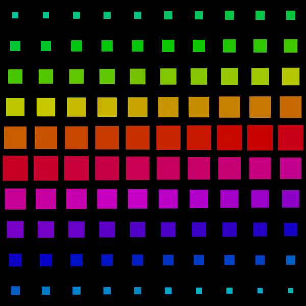

[sketch_2021_05_01](https://github.com/villares/sketch-a-day/tree/master/2021/sketch_2021_05_01) [[Py.Processing](https://villares.github.io/como-instalar-o-processing-modo-python/index-EN)]

---

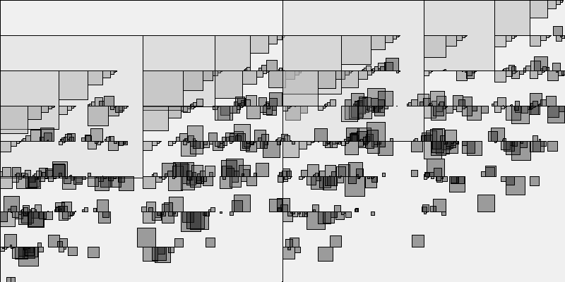

[sketch_2021_04_30a_exemplo_recursividade](https://github.com/villares/sketch-a-day/tree/master/2021/sketch_2021_04_30a_exemplo_recursividade) [[Py.Processing](https://villares.github.io/como-instalar-o-processing-modo-python/index-EN)]

---

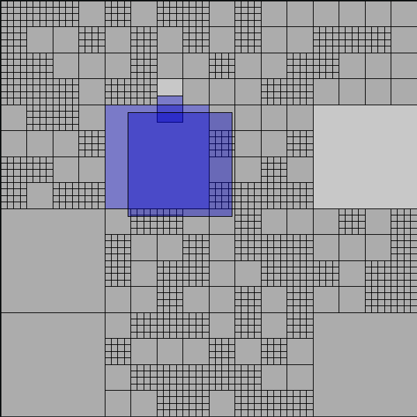

[sketch_2021_04_29f](https://github.com/villares/sketch-a-day/tree/master/2021/sketch_2021_04_29f) [[Py.Processing](https://villares.github.io/como-instalar-o-processing-modo-python/index-EN)]

---

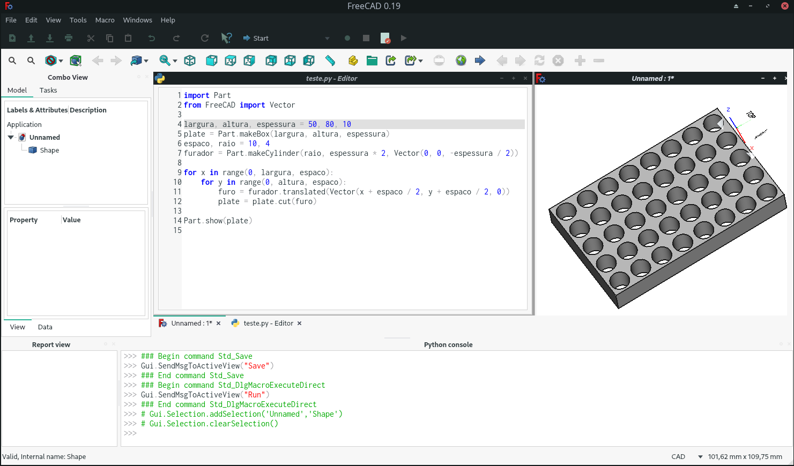

[sketch_2021_04_28_FreeCAD](https://github.com/villares/sketch-a-day/tree/master/2021/sketch_2021_04_28_FreeCAD) [[FreeCAD + Python](https://forum.freecadweb.org/viewtopic.php?f=22&t=4887)]

---

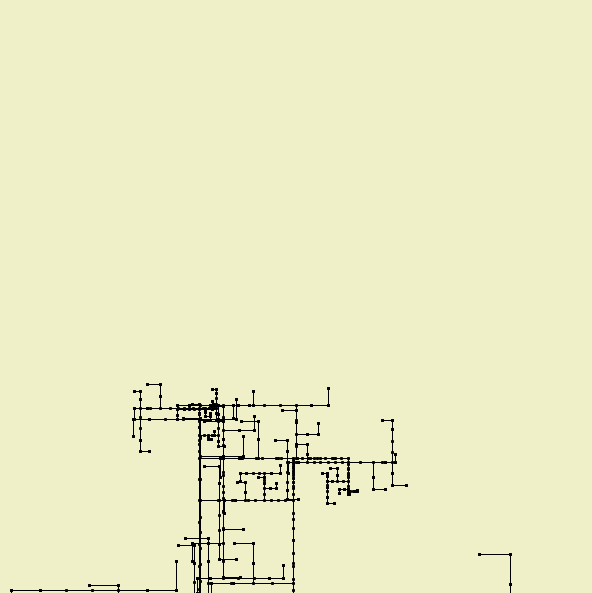

[sketch_2021_04_27c](https://github.com/villares/sketch-a-day/tree/master/2021/sketch_2021_04_27c) [[Py.Processing](https://villares.github.io/como-instalar-o-processing-modo-python/index-EN)]

---

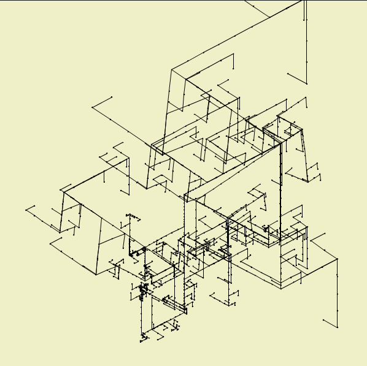

[sketch_2021_04_26c](https://github.com/villares/sketch-a-day/tree/master/2021/sketch_2021_04_26c) [[Py.Processing](https://villares.github.io/como-instalar-o-processing-modo-python/index-EN)]

---

[sketch_2021_04_25c](https://github.com/villares/sketch-a-day/tree/master/2021/sketch_2021_04_25c) [[Py.Processing](https://villares.github.io/como-instalar-o-processing-modo-python/index-EN)]

---

[sketch_2021_04_24c](https://github.com/villares/sketch-a-day/tree/master/2021/sketch_2021_04_24c) [[Py.Processing](https://villares.github.io/como-instalar-o-processing-modo-python/index-EN)]

---

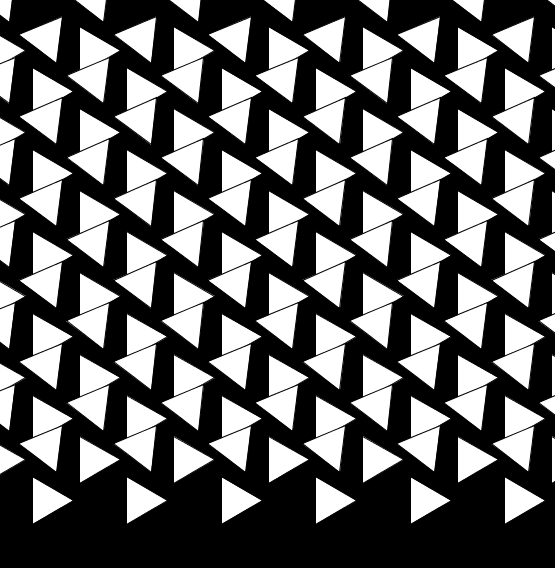

[sketch_2021_04_23c](https://github.com/villares/sketch-a-day/tree/master/2021/sketch_2021_04_23c) [[Py.Processing](https://villares.github.io/como-instalar-o-processing-modo-python/index-EN)]

---

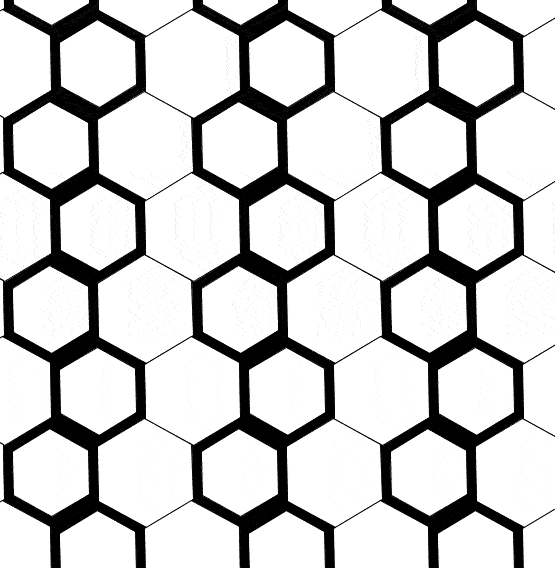

[sketch_2021_04_22c](https://github.com/villares/sketch-a-day/tree/master/2021/sketch_2021_04_22c) [[Py.Processing](https://villares.github.io/como-instalar-o-processing-modo-python/index-EN)]

---

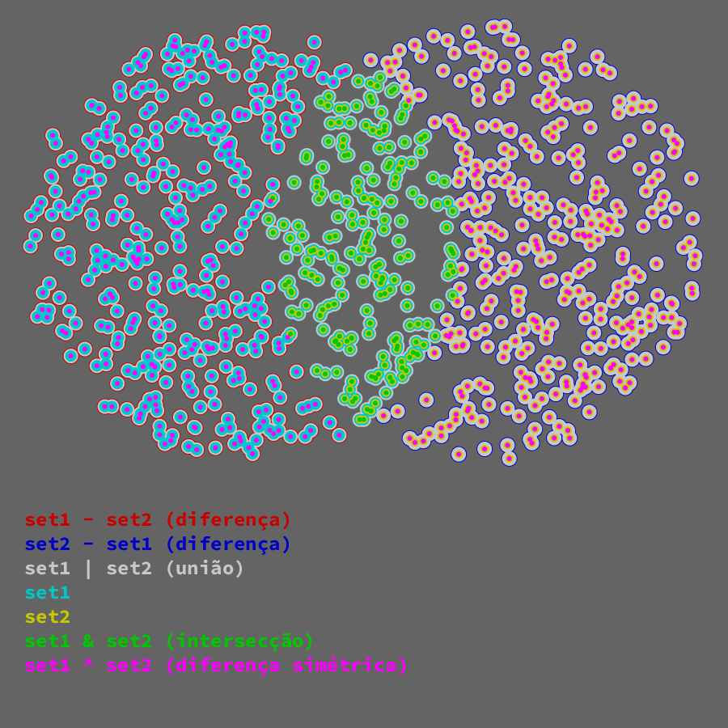

[sketch_2021_04_21a_sets](https://github.com/villares/sketch-a-day/tree/master/2021/sketch_2021_04_21a_sets) [[Py.Processing](https://villares.github.io/como-instalar-o-processing-modo-python/index-EN)]

---

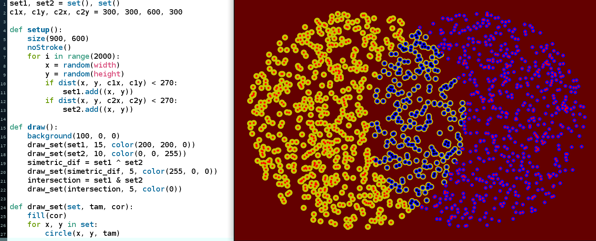

[sketch_2021_04_20a_sets](https://github.com/villares/sketch-a-day/tree/master/2021/sketch_2021_04_20a_sets) [[Py.Processing](https://villares.github.io/como-instalar-o-processing-modo-python/index-EN)]

---

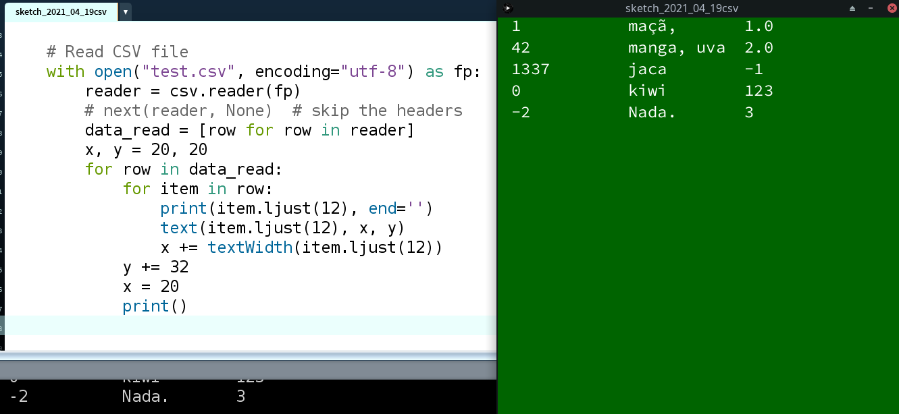

[sketch_2021_04_19csv](https://github.com/villares/sketch-a-day/tree/master/2021/sketch_2021_04_19csv) [[Py.Processing](https://villares.github.io/como-instalar-o-processing-modo-python/index-EN)]

---

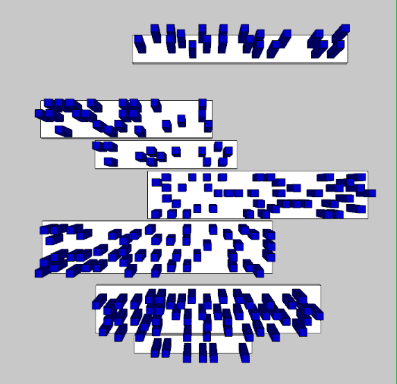

[sketch_2021_04_18e_areas](https://github.com/villares/sketch-a-day/tree/master/2021/sketch_2021_04_18e_areas) [[Py.Processing](https://villares.github.io/como-instalar-o-processing-modo-python/index-EN)]

---

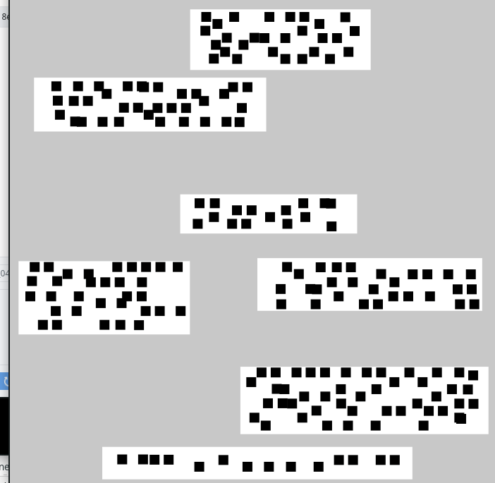

[sketch_2021_04_17e_areas](https://github.com/villares/sketch-a-day/tree/master/2021/sketch_2021_04_17e_areas) [[Py.Processing](https://villares.github.io/como-instalar-o-processing-modo-python/index-EN)]

---

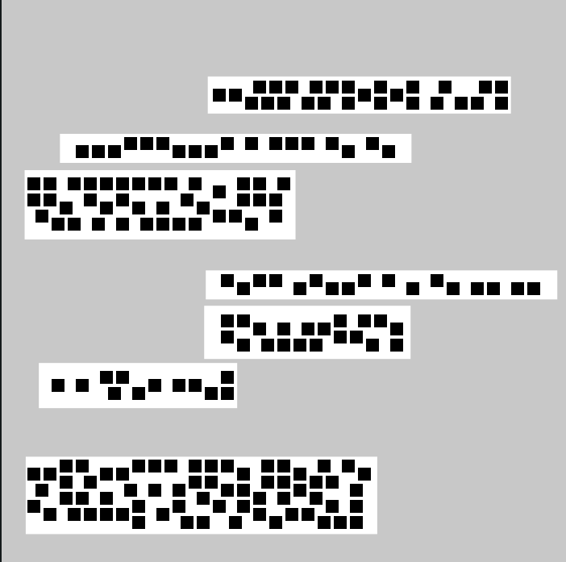

[sketch_2021_04_16e_areas](https://github.com/villares/sketch-a-day/tree/master/2021/sketch_2021_04_16e_areas) [[Py.Processing](https://villares.github.io/como-instalar-o-processing-modo-python/index-EN)]

---

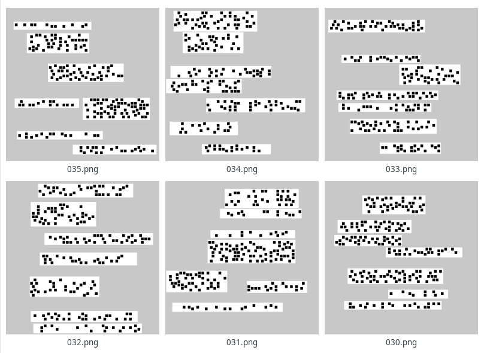

[sketch_2021_04_15e_areas](https://github.com/villares/sketch-a-day/tree/master/2021/sketch_2021_04_15e_areas) [[Py.Processing](https://villares.github.io/como-instalar-o-processing-modo-python/index-EN)]

---

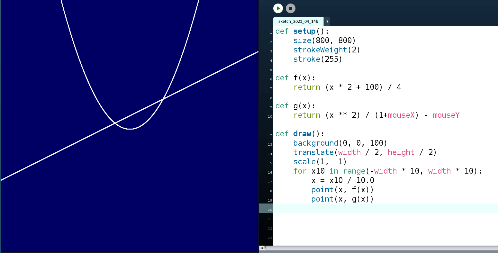

[sketch_2021_04_14b](https://github.com/villares/sketch-a-day/tree/master/2021/sketch_2021_04_14b) [[Py.Processing](https://villares.github.io/como-instalar-o-processing-modo-python/index-EN)]

---

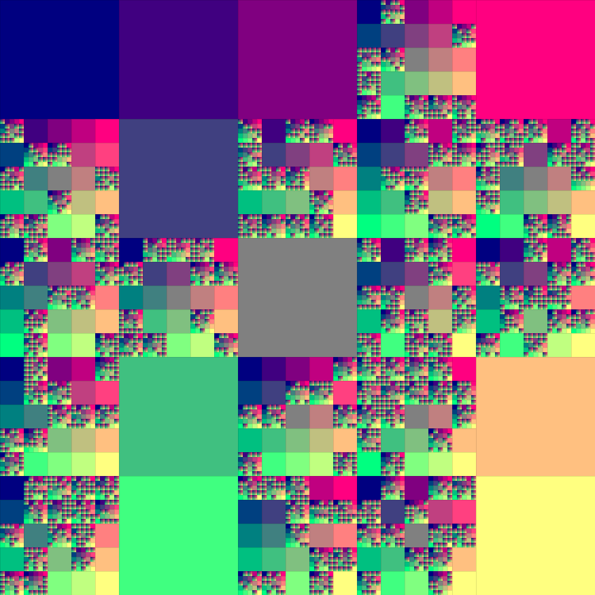

[sketch_2021_04_13a](https://github.com/villares/sketch-a-day/tree/master/2021/sketch_2021_04_13a) [[Py.Processing](https://villares.github.io/como-instalar-o-processing-modo-python/index-EN)]

---

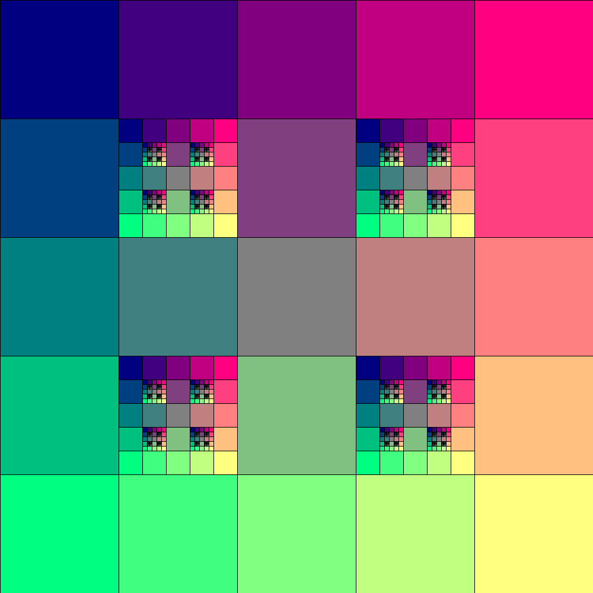

[sketch_2021_04_12c](https://github.com/villares/sketch-a-day/tree/master/2021/sketch_2021_04_12c) [[Py.Processing](https://villares.github.io/como-instalar-o-processing-modo-python/index-EN)]

---

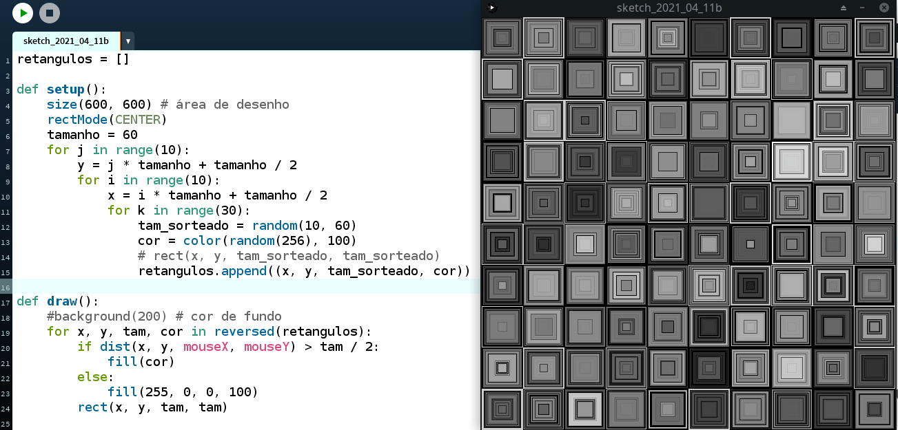

[sketch_2021_04_11b](https://github.com/villares/sketch-a-day/tree/master/2021/sketch_2021_04_11b) [[Py.Processing](https://villares.github.io/como-instalar-o-processing-modo-python/index-EN)]

---

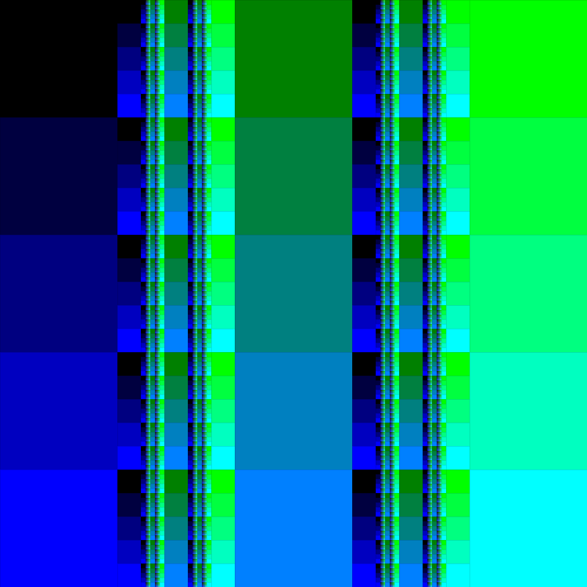

[sketch_2021_04_10b](https://github.com/villares/sketch-a-day/tree/master/2021/sketch_2021_04_10b) [[Py.Processing](https://villares.github.io/como-instalar-o-processing-modo-python/index-EN)]

---

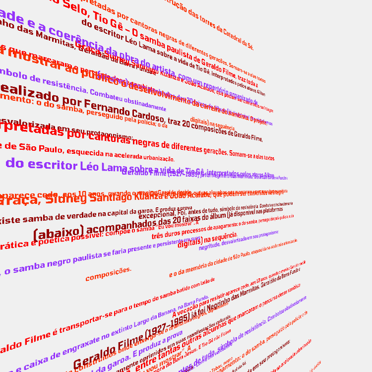

[sketch_2021_04_09](https://github.com/villares/sketch-a-day/tree/master/2021/sketch_2021_04_09) [[Py.Processing](https://villares.github.io/como-instalar-o-processing-modo-python/index-EN)]

---

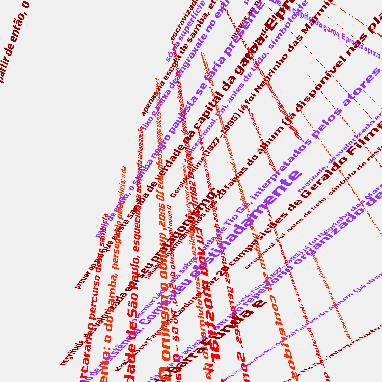

[sketch_2021_04_08](https://github.com/villares/sketch-a-day/tree/master/2021/sketch_2021_04_08) [[Py.Processing](https://villares.github.io/como-instalar-o-processing-modo-python/index-EN)]

---

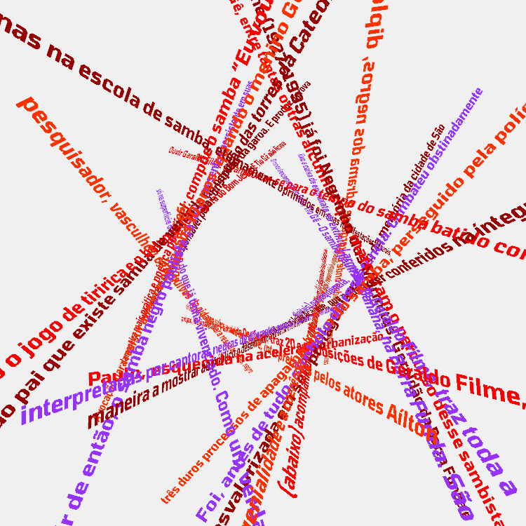

[sketch_2021_04_07](https://github.com/villares/sketch-a-day/tree/master/2021/sketch_2021_04_07) [[Py.Processing](https://villares.github.io/como-instalar-o-processing-modo-python/index-EN)]

---

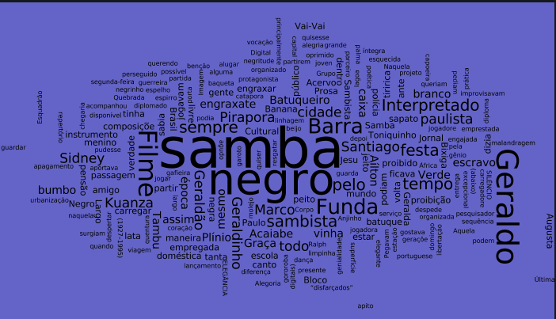

[sketch_2021_04_06a_wordcram](https://github.com/villares/sketch-a-day/tree/master/2021/sketch_2021_04_06a_wordcram) [[Py.Processing](https://villares.github.io/como-instalar-o-processing-modo-python/index-EN)]

---

[sketch_2021_04_04curve2](https://github.com/villares/sketch-a-day/tree/master/2021/sketch_2021_04_04curve2) [[Py.Processing](https://villares.github.io/como-instalar-o-processing-modo-python/index-EN)]

---

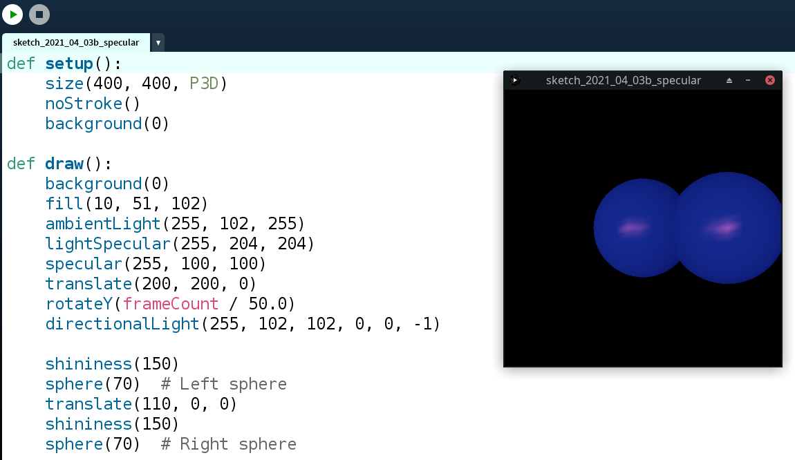

[sketch_2021_04_03b_specular](https://github.com/villares/sketch-a-day/tree/master/2021/sketch_2021_04_03b_specular) [[Py.Processing](https://villares.github.io/como-instalar-o-processing-modo-python/index-EN)]

---

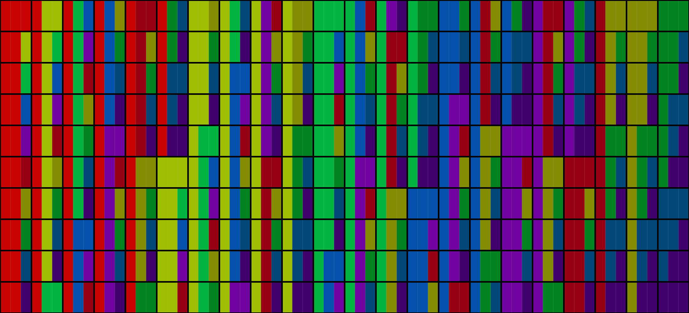

[sketch_2021_04_02c](https://github.com/villares/sketch-a-day/tree/master/2021/sketch_2021_04_02c) [[Py.Processing](https://villares.github.io/como-instalar-o-processing-modo-python/index-EN)]

---

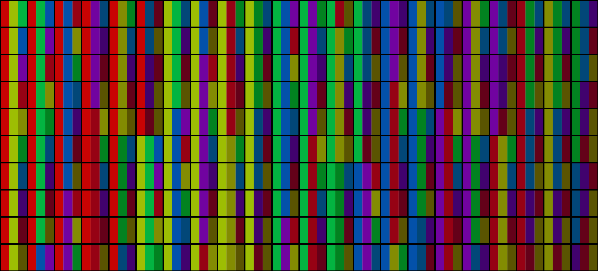

[sketch_2021_04_02b](https://github.com/villares/sketch-a-day/tree/master/2021/sketch_2021_04_02b) [[Py.Processing](https://villares.github.io/como-instalar-o-processing-modo-python/index-EN)]

---

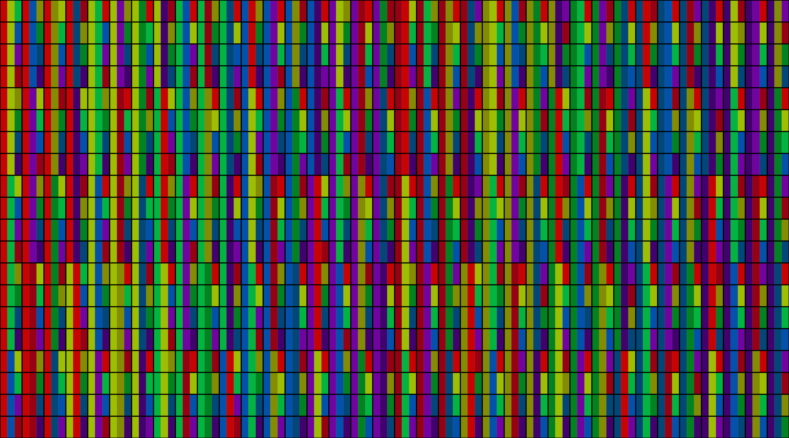

[sketch_2021_04_02a](https://github.com/villares/sketch-a-day/tree/master/2021/sketch_2021_04_02a) [[Py.Processing](https://villares.github.io/como-instalar-o-processing-modo-python/index-EN)]

---

[sketch_2021_04_01](https://github.com/villares/sketch-a-day/tree/master/2021/sketch_2021_04_01) [[Py.Processing](https://villares.github.io/como-instalar-o-processing-modo-python/index-EN)]

---

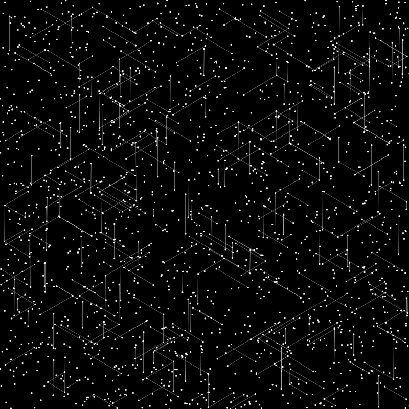

[sketch_2021_03_31_h2o](https://github.com/villares/sketch-a-day/tree/master/2021/sketch_2021_03_31_h2o) [[Py.Processing](https://villares.github.io/como-instalar-o-processing-modo-python/index-EN)]

---

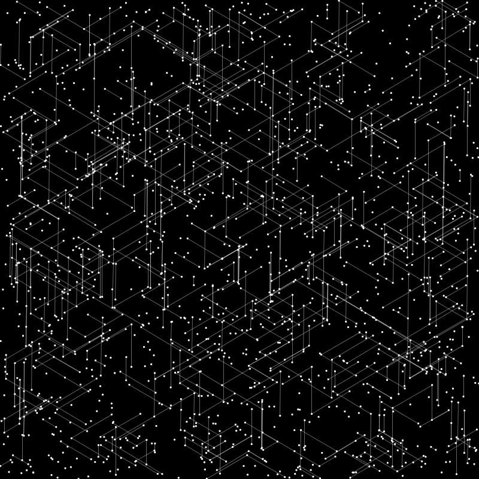

[sketch_2021_03_30a_h2o](https://github.com/villares/sketch-a-day/tree/master/2021/sketch_2021_03_30a_h2o) [[Py.Processing](https://villares.github.io/como-instalar-o-processing-modo-python/index-EN)]

---

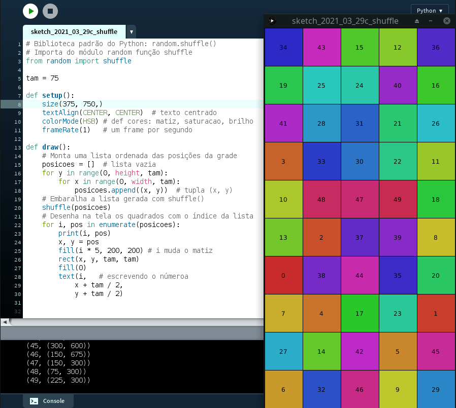

[sketch_2021_03_29c_shuffle](https://github.com/villares/sketch-a-day/tree/master/2021/sketch_2021_03_29c_shuffle) [[Py.Processing](https://villares.github.io/como-instalar-o-processing-modo-python/index-EN)]

---

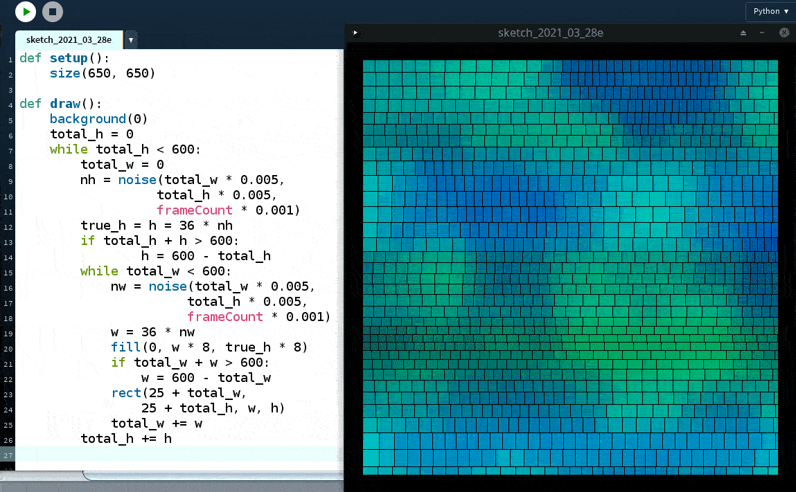

[sketch_2021_03_28e](https://github.com/villares/sketch-a-day/tree/master/2021/sketch_2021_03_28e) [[Py.Processing](https://villares.github.io/como-instalar-o-processing-modo-python/index-EN)]

---

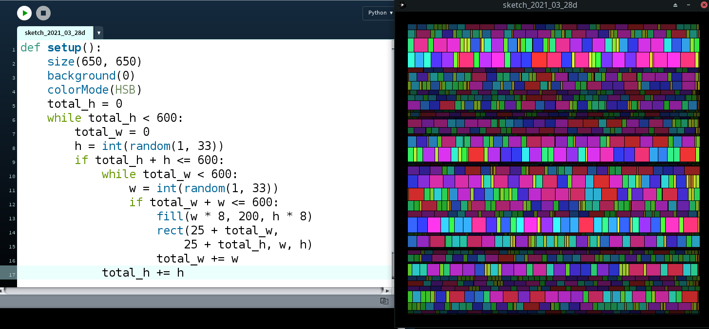

[sketch_2021_03_28d](https://github.com/villares/sketch-a-day/tree/master/2021/sketch_2021_03_28d) [[Py.Processing](https://villares.github.io/como-instalar-o-processing-modo-python/index-EN)]

---

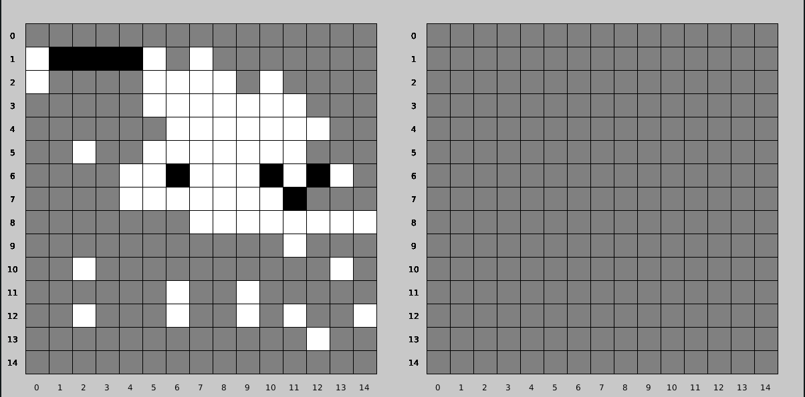

[sketch_2021_03_27a](https://github.com/villares/sketch-a-day/tree/master/2021/sketch_2021_03_27a) [[Py.Processing](https://villares.github.io/como-instalar-o-processing-modo-python/index-EN)]

---

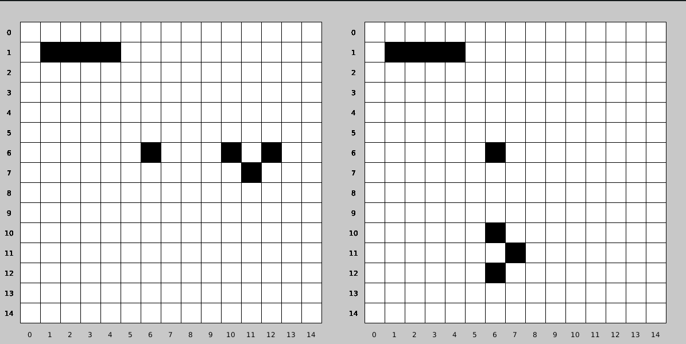

[sketch_2021_03_26a](https://github.com/villares/sketch-a-day/tree/master/2021/sketch_2021_03_26a) [[Py.Processing](https://villares.github.io/como-instalar-o-processing-modo-python/index-EN)]

---

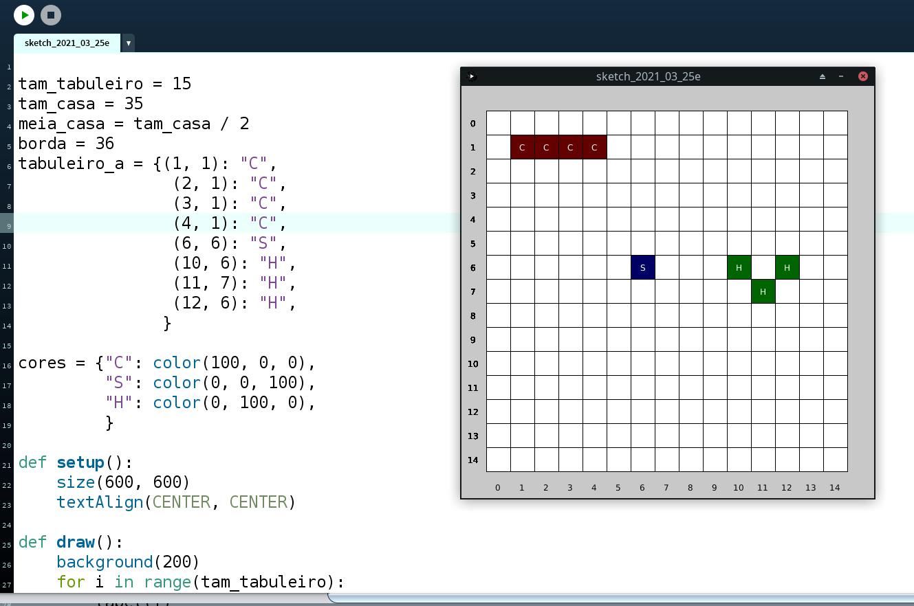

[sketch_2021_03_25e](https://github.com/villares/sketch-a-day/tree/master/2021/sketch_2021_03_25e) [[Py.Processing](https://villares.github.io/como-instalar-o-processing-modo-python/index-EN)]

---

[sketch_2021_03_24e](https://github.com/villares/sketch-a-day/tree/master/2021/sketch_2021_03_24e) [[Py.Processing](https://villares.github.io/como-instalar-o-processing-modo-python/index-EN)]

---

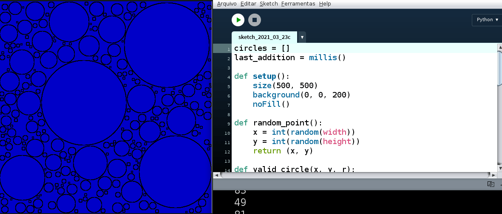

[sketch_2021_03_23c](https://github.com/villares/sketch-a-day/tree/master/2021/sketch_2021_03_23c) [[Py.Processing](https://villares.github.io/como-instalar-o-processing-modo-python/index-EN)]

---

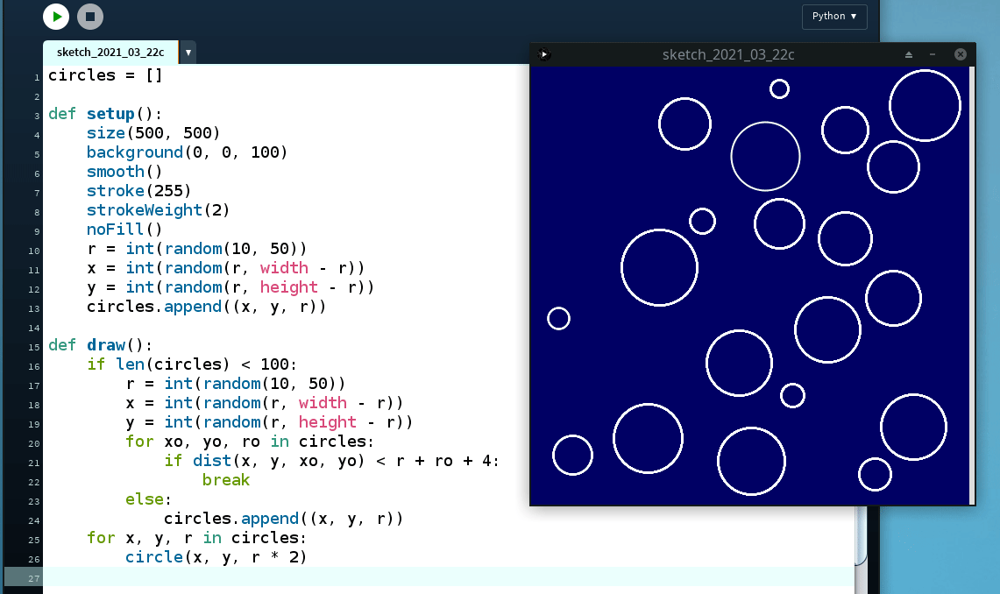

[sketch_2021_03_22c](https://github.com/villares/sketch-a-day/tree/master/2021/sketch_2021_03_22c) [[Py.Processing](https://villares.github.io/como-instalar-o-processing-modo-python/index-EN)]

---

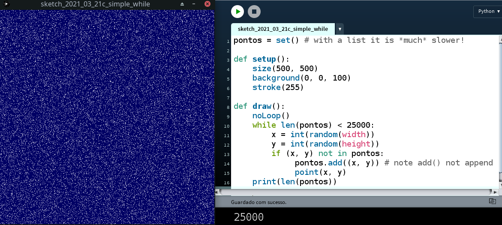

[sketch_2021_03_21c_simple_while](https://github.com/villares/sketch-a-day/tree/master/2021/sketch_2021_03_21c_simple_while) [[Py.Processing](https://villares.github.io/como-instalar-o-processing-modo-python/index-EN)]

---

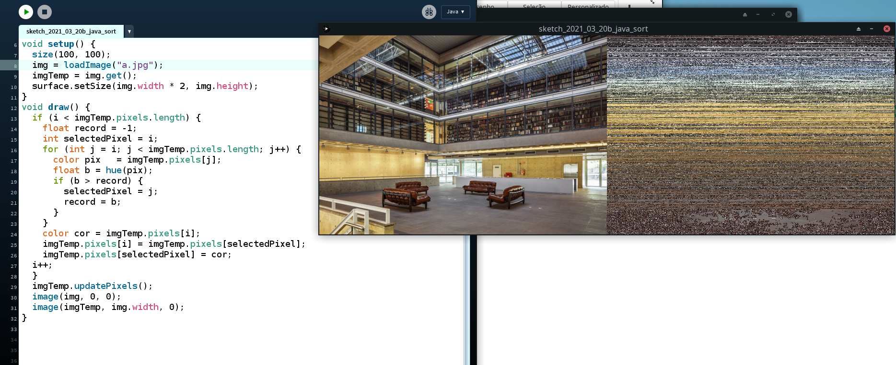

[sketch_2021_03_20b_java_sort](https://github.com/villares/sketch-a-day/tree/master/2021/sketch_2021_03_20b_java_sort) [[Py.Processing](https://villares.github.io/como-instalar-o-processing-modo-python/index-EN)]

---

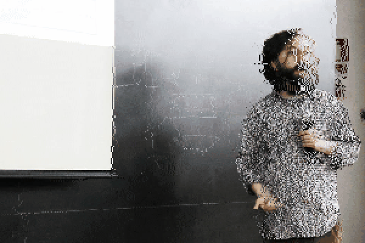

[sketch_2021_03_19a_sorting](https://github.com/villares/sketch-a-day/tree/master/2021/sketch_2021_03_19a_sorting) [[Py.Processing](https://villares.github.io/como-instalar-o-processing-modo-python/index-EN)]

---

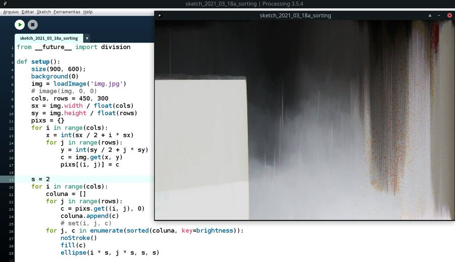

[sketch_2021_03_18a_sorting](https://github.com/villares/sketch-a-day/tree/master/2021/sketch_2021_03_18a_sorting) [[Py.Processing](https://villares.github.io/como-instalar-o-processing-modo-python/index-EN)]

---

[sketch_2021_03_16_memento_mori](https://github.com/villares/sketch-a-day/tree/master/2021/sketch_2021_03_16_memento_mori) [[Py.Processing](https://villares.github.io/como-instalar-o-processing-modo-python/index-EN)]

---

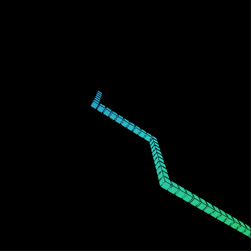

[sketch_2021_03_15c](https://github.com/villares/sketch-a-day/tree/master/2021/sketch_2021_03_15c) [[Py.Processing](https://villares.github.io/como-instalar-o-processing-modo-python/index-EN)]

---

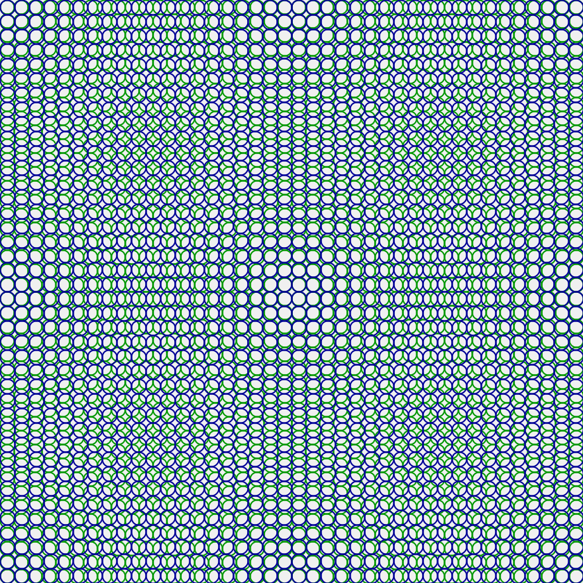

[sketch_2021_03_14c_circ_grid](https://github.com/villares/sketch-a-day/tree/master/2021/sketch_2021_03_14c_circ_grid) [[Py.Processing](https://villares.github.io/como-instalar-o-processing-modo-python/index-EN)]

---

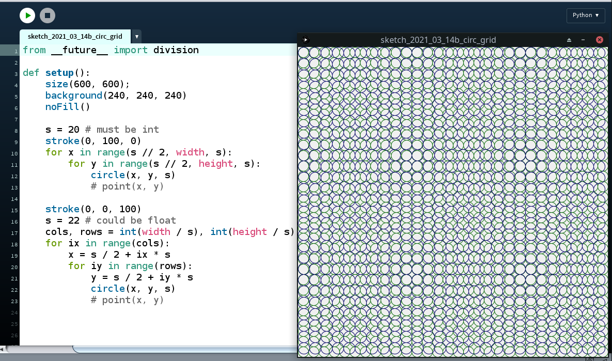

[sketch_2021_03_14b_circ_grid](https://github.com/villares/sketch-a-day/tree/master/2021/sketch_2021_03_14b_circ_grid) [[Py.Processing](https://villares.github.io/como-instalar-o-processing-modo-python/index-EN)]

---

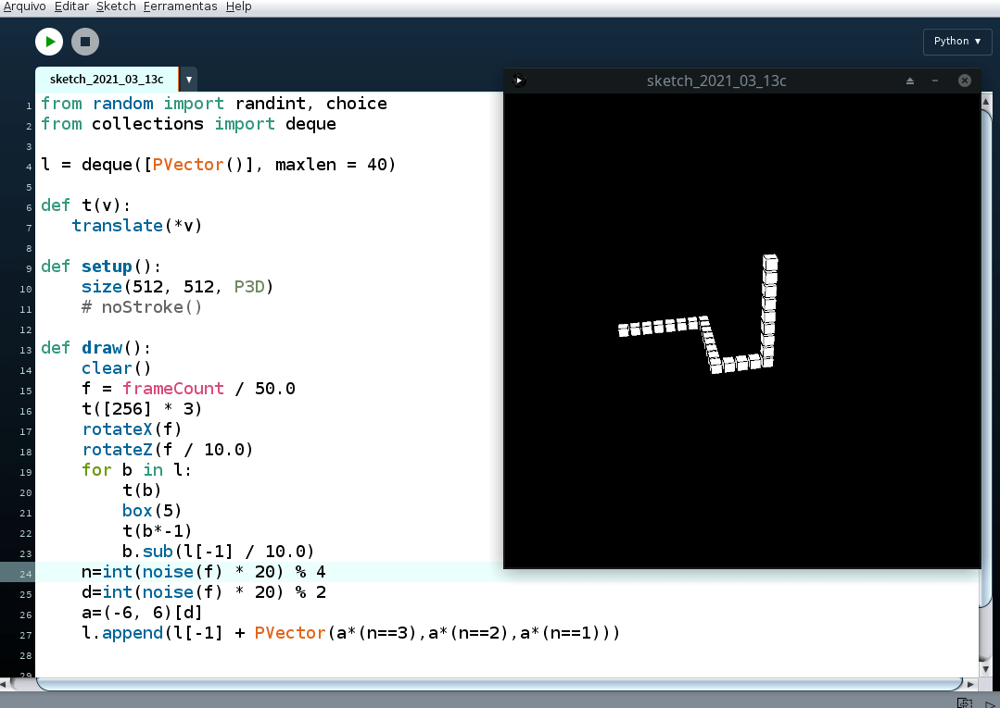

[sketch_2021_03_13c](https://github.com/villares/sketch-a-day/tree/master/2021/sketch_2021_03_13c) [[Py.Processing](https://villares.github.io/como-instalar-o-processing-modo-python/index-EN)]

---

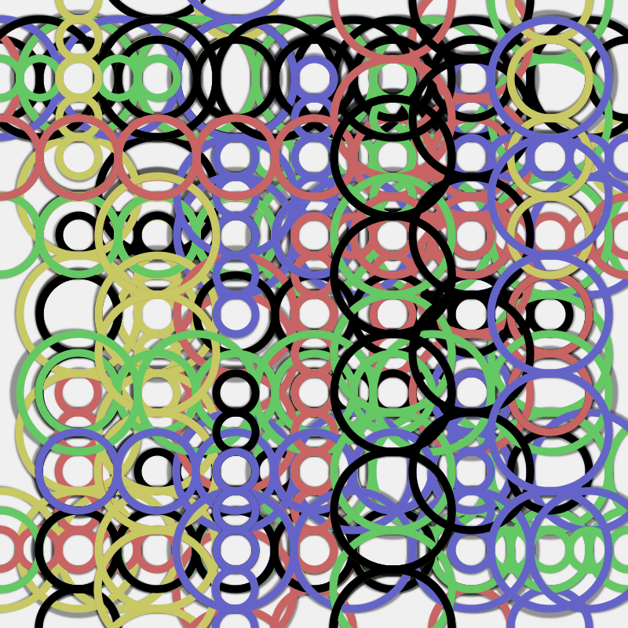

[sketch_2021_03_12b](https://github.com/villares/sketch-a-day/tree/master/2021/sketch_2021_03_12b) [[Py.Processing](https://villares.github.io/como-instalar-o-processing-modo-python/index-EN)]

I hate this one. I was very tired and couln't get myself to do any better (I was trying to improve on the previous day's disaster) .

---

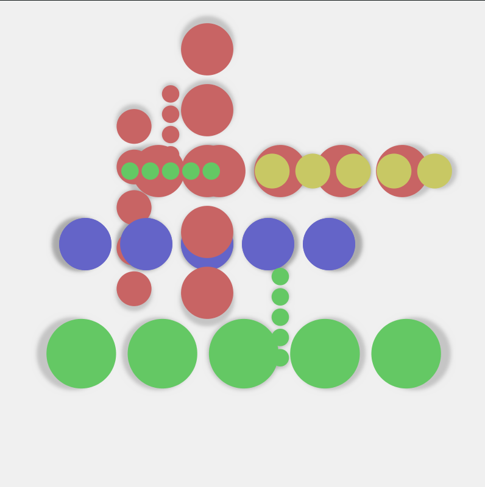

[sketch_2021_03_11b](https://github.com/villares/sketch-a-day/tree/master/2021/sketch_2021_03_11b) [[Py.Processing](https://villares.github.io/como-instalar-o-processing-modo-python/index-EN)]

This is a very bad one. Tried a silly idea and couldn't get the energy to improve it.

---

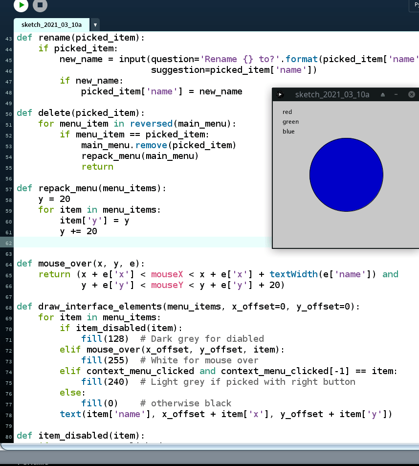

[sketch_2021_03_10a](https://github.com/villares/sketch-a-day/tree/master/2021/sketch_2021_03_10a) [[Py.Processing](https://villares.github.io/como-instalar-o-processing-modo-python/index-EN)]

---

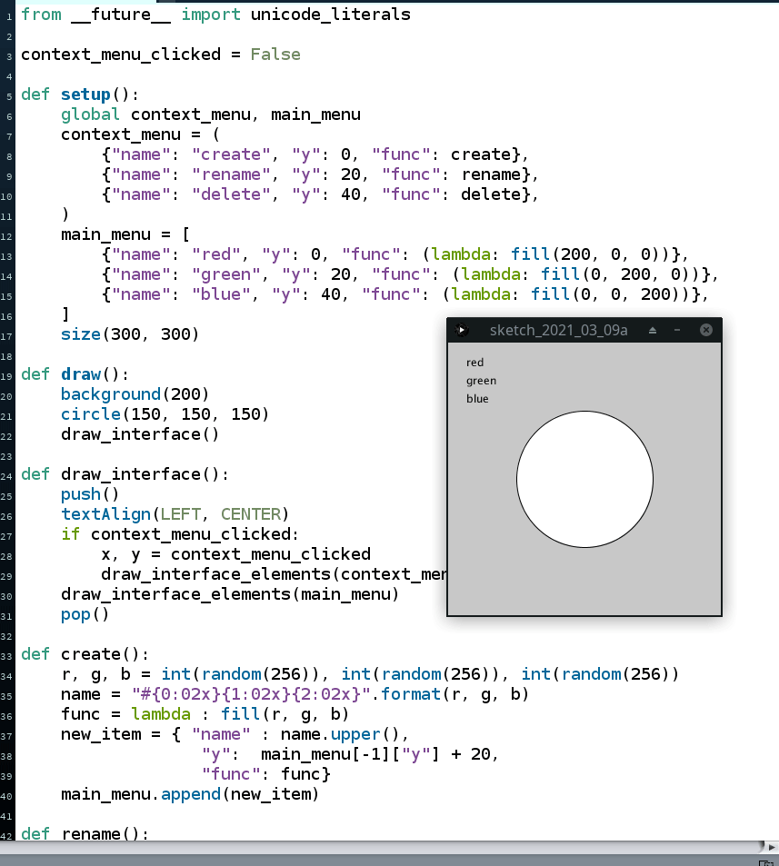

[sketch_2021_03_09a](https://github.com/villares/sketch-a-day/tree/master/2021/sketch_2021_03_09a) [[Py.Processing](https://villares.github.io/como-instalar-o-processing-modo-python/index-EN)]

---

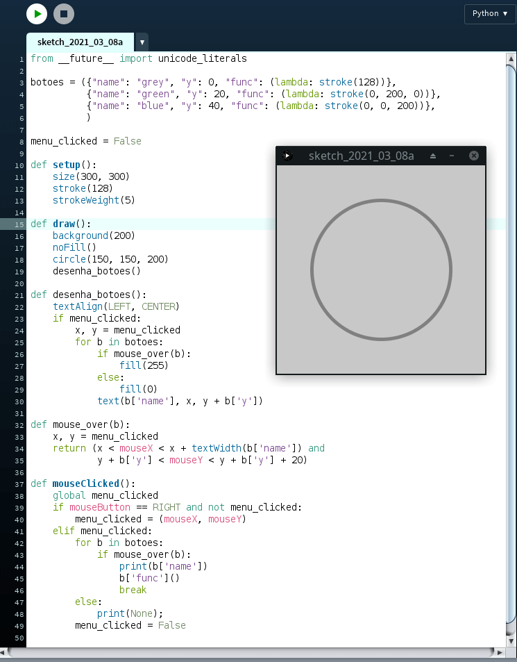

[sketch_2021_03_08a](https://github.com/villares/sketch-a-day/tree/master/2021/sketch_2021_03_08a) [[Py.Processing](https://villares.github.io/como-instalar-o-processing-modo-python/index-EN)]

---

[sketch_2021_03_07b_compare_lists](https://github.com/villares/sketch-a-day/tree/master/2021/sketch_2021_03_07b_compare_lists) [[Py.Processing](https://villares.github.io/como-instalar-o-processing-modo-python/index-EN)]

---
​
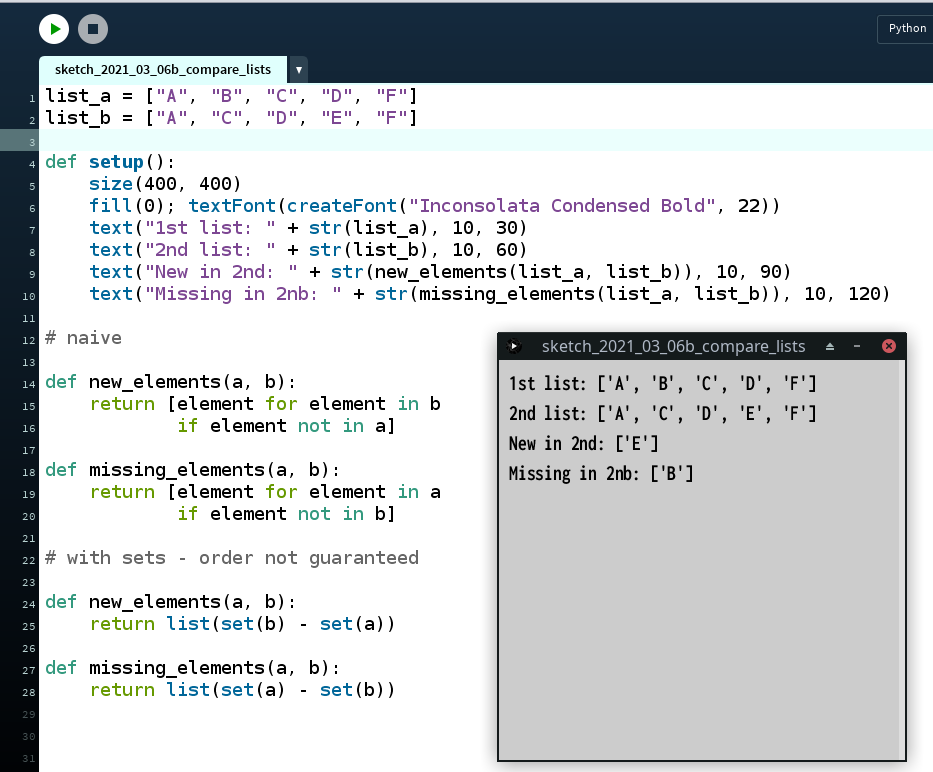
​
[sketch_2021_03_06b_compare_lists](https://github.com/villares/sketch-a-day/tree/master/2021/sketch_2021_03_06b_compare_lists) [[Py.Processing](https://villares.github.io/como-instalar-o-processing-modo-python/index-EN)]

---

[sketch_2021_03_05a](https://github.com/villares/sketch-a-day/tree/master/2021/sketch_2021_03_05a) [[Py.Processing](https://villares.github.io/como-instalar-o-processing-modo-python/index-EN)]

---

[sketch_2021_03_04a](https://github.com/villares/sketch-a-day/tree/master/2021/sketch_2021_03_04a) [[Py.Processing](https://villares.github.io/como-instalar-o-processing-modo-python/index-EN)]

---

[sketch_2021_03_03a](https://github.com/villares/sketch-a-day/tree/master/2021/sketch_2021_03_03a) [[Py.Processing](https://villares.github.io/como-instalar-o-processing-modo-python/index-EN)]

---

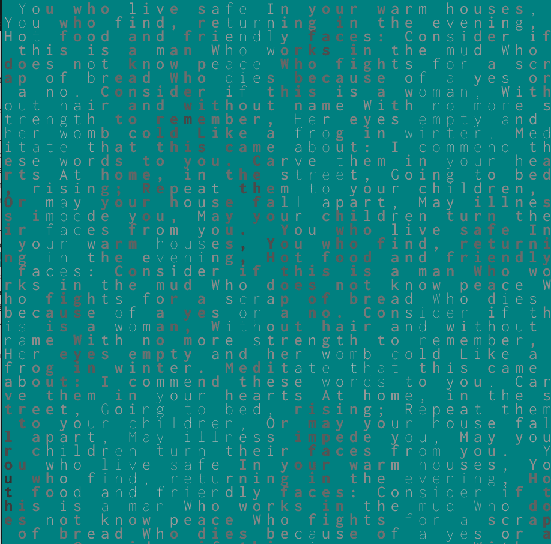

[sketch_2021_03_02a](https://github.com/villares/sketch-a-day/tree/master/2021/sketch_2021_03_02a) [[Py.Processing](https://villares.github.io/como-instalar-o-processing-modo-python/index-EN)]

---

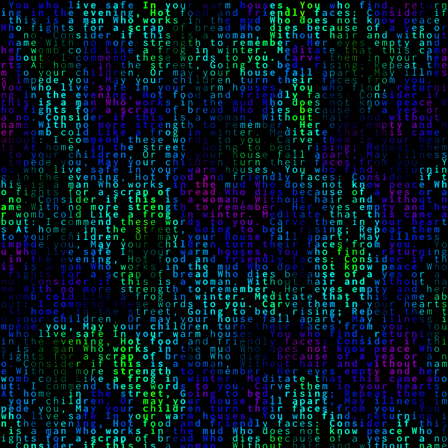

[sketch_2021_03_01a](https://github.com/villares/sketch-a-day/tree/master/2021/sketch_2021_03_01a) [[Py.Processing](https://villares.github.io/como-instalar-o-processing-modo-python/index-EN)]

---

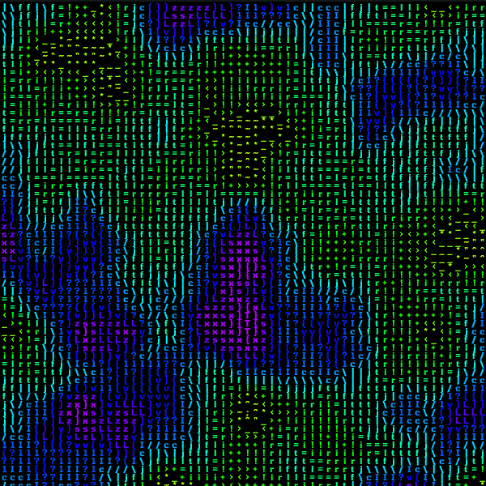

[sketch_2021_02_28](https://github.com/villares/sketch-a-day/tree/master/2021/sketch_2021_02_28) [[Py.Processing](https://villares.github.io/como-instalar-o-processing-modo-python/index-EN)]

---

[sketch_2021_02_27a](https://github.com/villares/sketch-a-day/tree/master/2021/sketch_2021_02_27a) [[Py.Processing](https://villares.github.io/como-instalar-o-processing-modo-python/index-EN)]

---

[sketch_2021_02_26a](https://github.com/villares/sketch-a-day/tree/master/2021/sketch_2021_02_26a) [[Py.Processing](https://villares.github.io/como-instalar-o-processing-modo-python/index-EN)]

---

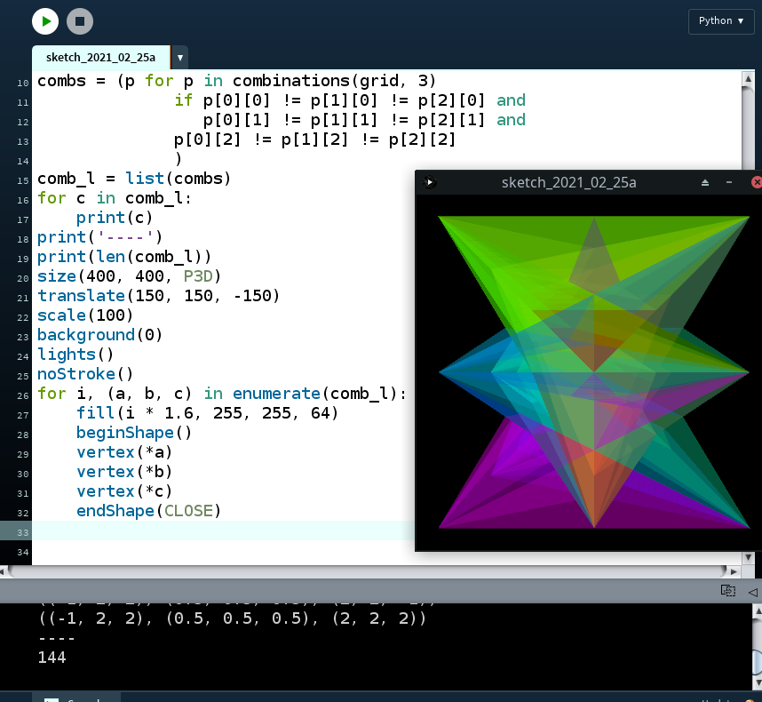

[sketch_2021_02_25a_combinations](https://github.com/villares/sketch-a-day/tree/master/2021/sketch_2021_02_25a_combinations) [[Py.Processing](https://villares.github.io/como-instalar-o-processing-modo-python/index-EN)]

---

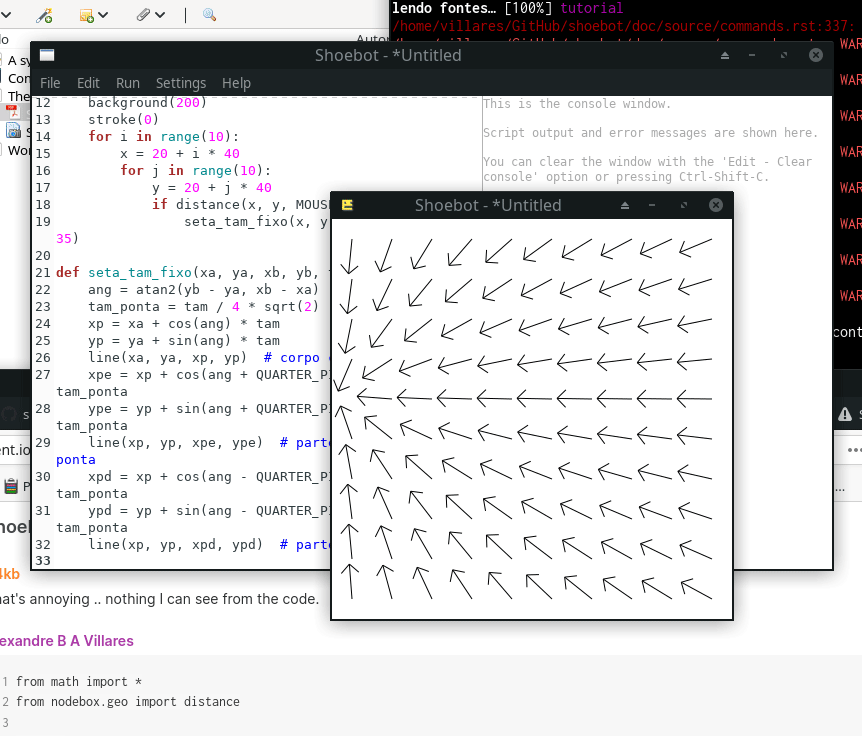

[sketch_2021_02_24shoebot](https://github.com/villares/sketch-a-day/tree/master/2021/sketch_2021_02_24shoebot) [[shoebot](https://github.com/shoebot/shoebot)]

---

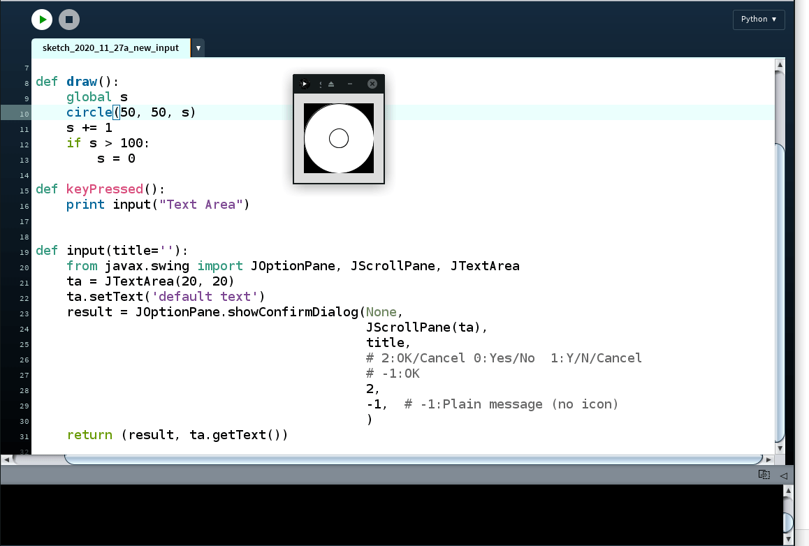

[sketch_2021_02_23_swing_area_text](https://github.com/villares/sketch-a-day/tree/master/2021/sketch_2021_02_23_swing_area_text) [[Py.Processing](https://villares.github.io/como-instalar-o-processing-modo-python/index-EN)]

---

[sketch_2021_02_22_selfie](https://github.com/villares/sketch-a-day/tree/master/2021/sketch_2021_02_22_selfie) [[Py.Processing](https://villares.github.io/como-instalar-o-processing-modo-python/index-EN)]

---

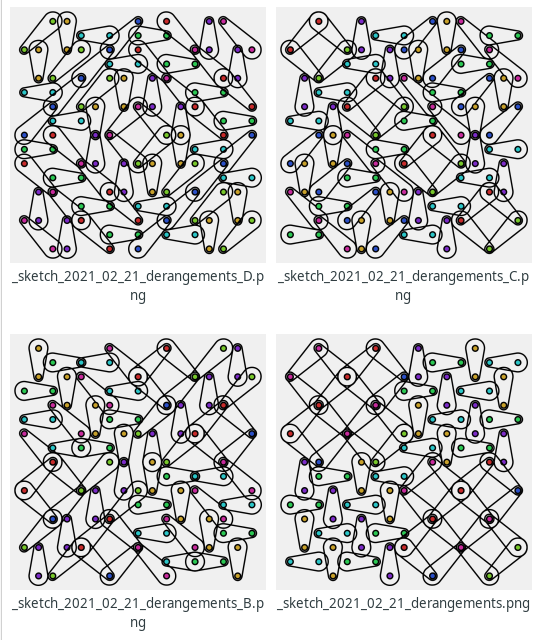

[_sketch_2021_02_21_derangements](/2021/sketch_2021_02_21_derangements) [[Py.Processing](https://villares.github.io/como-instalar-o-processing-modo-python/index-EN)]

---

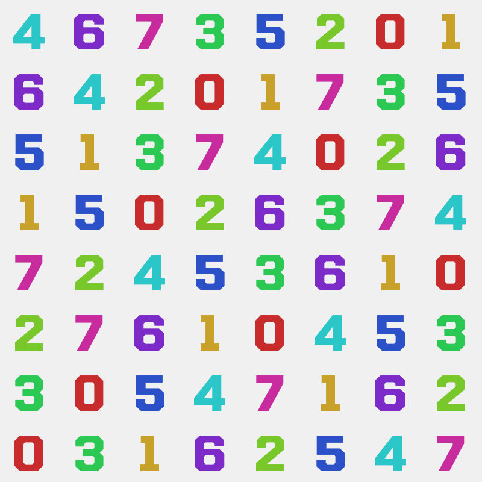

[sketch_2021_02_20_derangements](https://github.com/villares/sketch-a-day/tree/master/2021/sketch_2021_02_20_derangements) [[Py.Processing](https://villares.github.io/como-instalar-o-processing-modo-python/index-EN)]

---

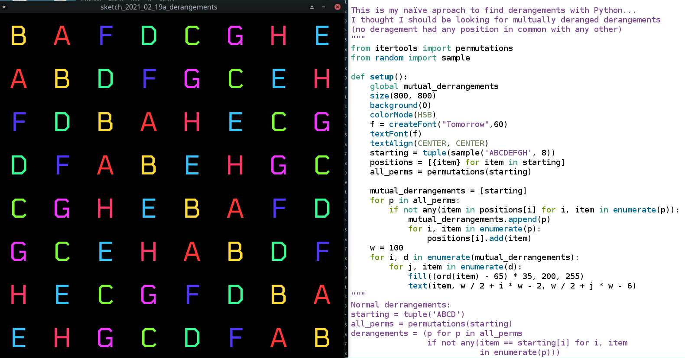

[sketch_2021_02_19a_derangements](https://github.com/villares/sketch-a-day/tree/master/2021/sketch_2021_02_19a_derangements) [[Py.Processing](https://villares.github.io/como-instalar-o-processing-modo-python/index-EN)]

---

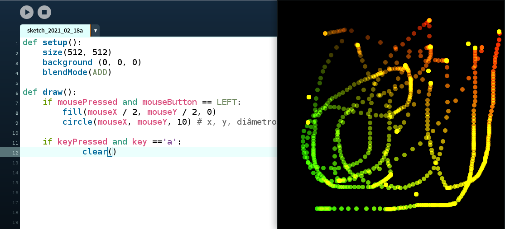

[sketch_2021_02_18a](https://github.com/villares/sketch-a-day/tree/master/2021/sketch_2021_02_18a) [[Py.Processing](https://villares.github.io/como-instalar-o-processing-modo-python/index-EN)]

---

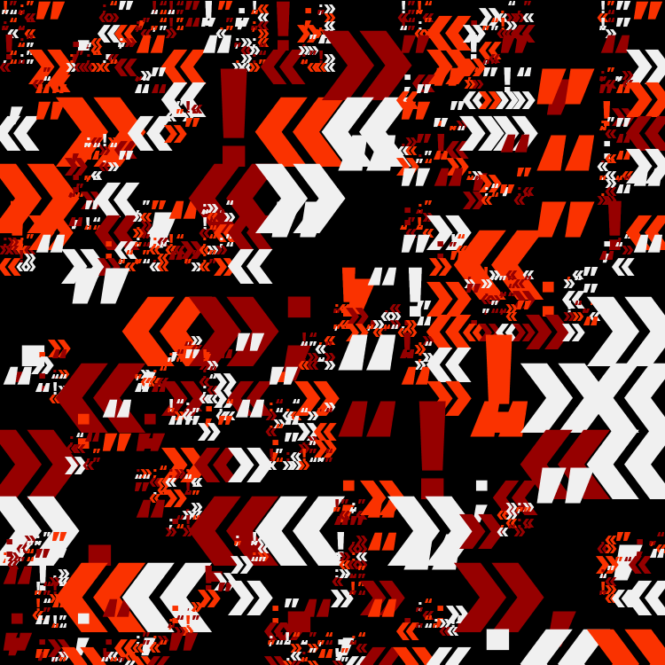

[sketch_2021_02_17_aspas](https://github.com/villares/sketch-a-day/tree/master/2021/sketch_2021_02_17_aspas) [[Py.Processing](https://villares.github.io/como-instalar-o-processing-modo-python/index-EN)]

---

I have to produce lighter gif files!
(check on repo...)

sketch_2021_02_16

sketch_2021_02_15

sketch_2021_02_14

---

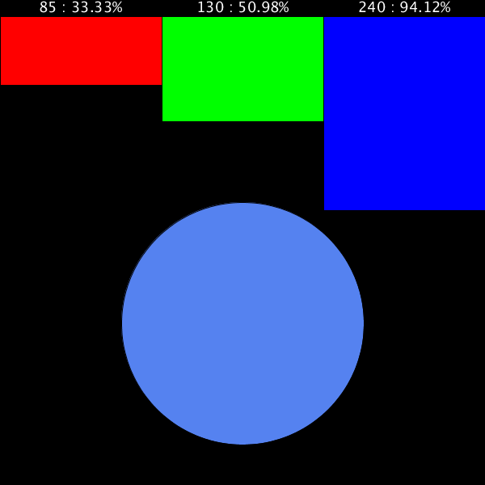

[sketch_2021_02_13a_cores](https://github.com/villares/sketch-a-day/tree/master/2021/sketch_2021_02_13a_cores) [[Py.Processing](https://villares.github.io/como-instalar-o-processing-modo-python/index-EN)]

---

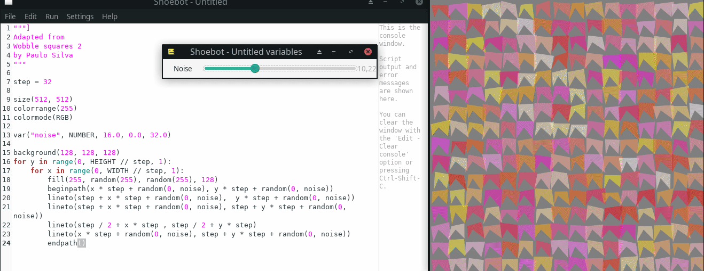

[sketch_2021_02_13_shoebot](https://github.com/villares/sketch-a-day/tree/master/2021/sketch_2021_02_13_shoebot) [[Py.Processing](https://villares.github.io/como-instalar-o-processing-modo-python/index-EN)]

---

[sketch_2021_02_12a_other_sphere](https://github.com/villares/sketch-a-day/tree/master/2021/sketch_2021_02_12a_other_sphere) [[Py.Processing](https://villares.github.io/como-instalar-o-processing-modo-python/index-EN)]

---

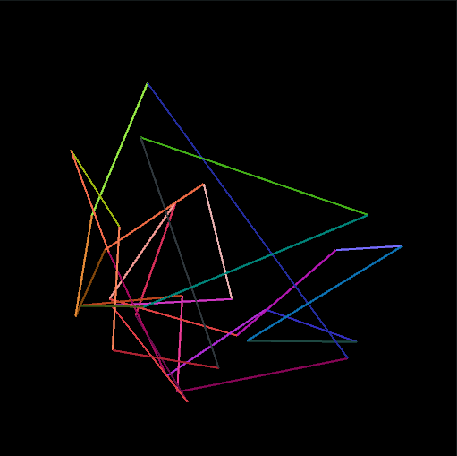

[sketch_2021_02_12b_w](https://github.com/villares/sketch-a-day/tree/master/2021/sketch_2021_02_12b_w) [[Py.Processing](https://villares.github.io/como-instalar-o-processing-modo-python/index-EN)]

---

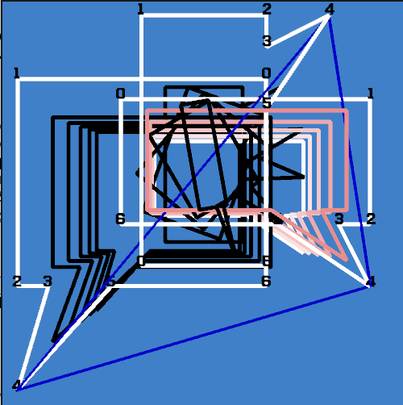

[sketch_2021_02_11a](https://github.com/villares/sketch-a-day/tree/master/2021/sketch_2021_02_11a) [[Py.Processing](https://villares.github.io/como-instalar-o-processing-modo-python/index-EN)]

---

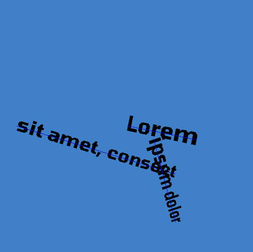

[sketch_2021_02_10b](https://github.com/villares/sketch-a-day/tree/master/2021/sketch_2021_02_10b) [[Py.Processing](https://villares.github.io/como-instalar-o-processing-modo-python/index-EN)]

---

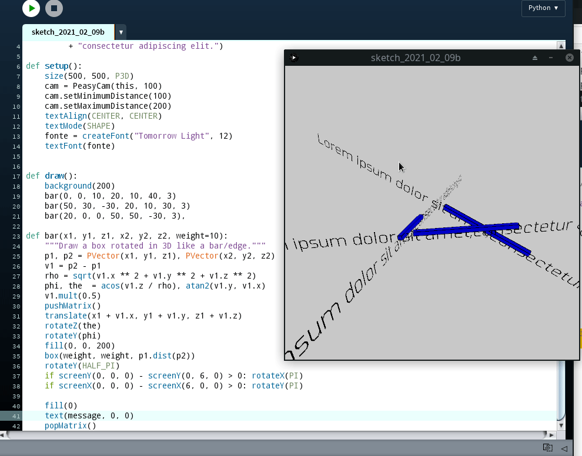

[sketch_2021_02_09b](https://github.com/villares/sketch-a-day/tree/master/2021/sketch_2021_02_09b) [[Py.Processing](https://villares.github.io/como-instalar-o-processing-modo-python/index-EN)]

---

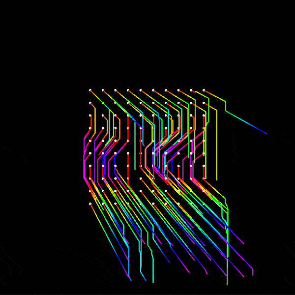

[sketch_2021_02_08a_noise_flow3D](https://github.com/villares/sketch-a-day/tree/master/2021/sketch_2021_02_08a_noise_flow3D) [[Py.Processing](https://villares.github.io/como-instalar-o-processing-modo-python/index-EN)]

---

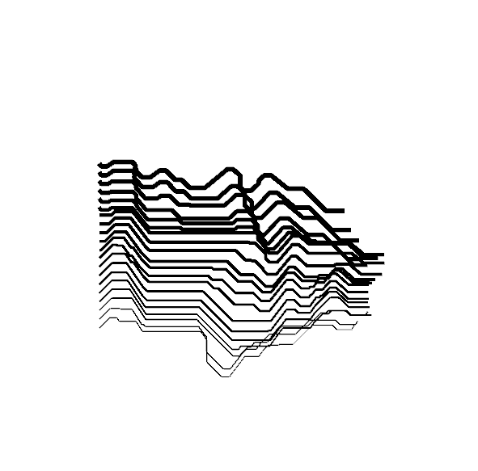

[sketch_2021_02_07a_noise_flow3D](https://github.com/villares/sketch-a-day/tree/master/2021/sketch_2021_02_07a_noise_flow3D) [[Py.Processing](https://villares.github.io/como-instalar-o-processing-modo-python/index-EN)]

---

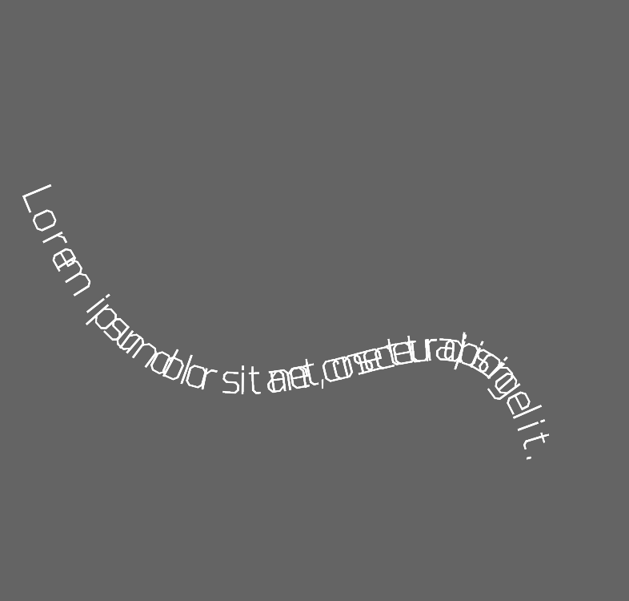

[sketch_2021_02_06_text_along_path](https://github.com/villares/sketch-a-day/tree/master/2021/sketch_2021_02_06_text_along_path) [[Py.Processing](https://villares.github.io/como-instalar-o-processing-modo-python/index-EN)]

---

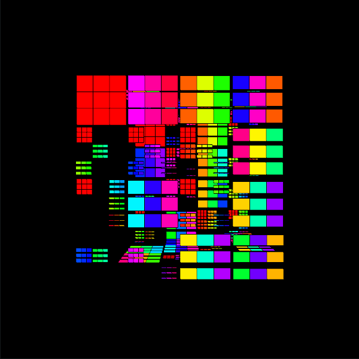

[sketch_2021_02_05a](https://github.com/villares/sketch-a-day/tree/master/2021/sketch_2021_02_05a) [[Py.Processing](https://villares.github.io/como-instalar-o-processing-modo-python/index-EN)]

---

[sketch_2021_02_04a](https://github.com/villares/sketch-a-day/tree/master/2021/sketch_2021_02_04a) [[Py.Processing](https://villares.github.io/como-instalar-o-processing-modo-python/index-EN)]

---

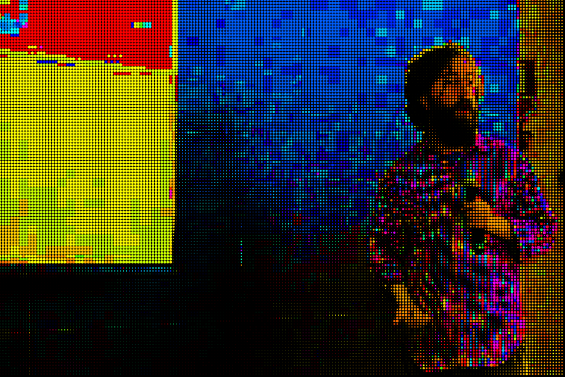

[sketch_2021_02_03b](https://github.com/villares/sketch-a-day/tree/master/2021/sketch_2021_02_03b) [[Py.Processing](https://villares.github.io/como-instalar-o-processing-modo-python/index-EN)]

---

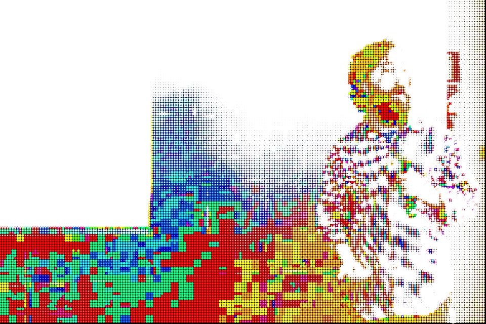

[sketch_2021_02_03a](https://github.com/villares/sketch-a-day/tree/master/2021/sketch_2021_02_03a) [[Py.Processing](https://villares.github.io/como-instalar-o-processing-modo-python/index-EN)]

---

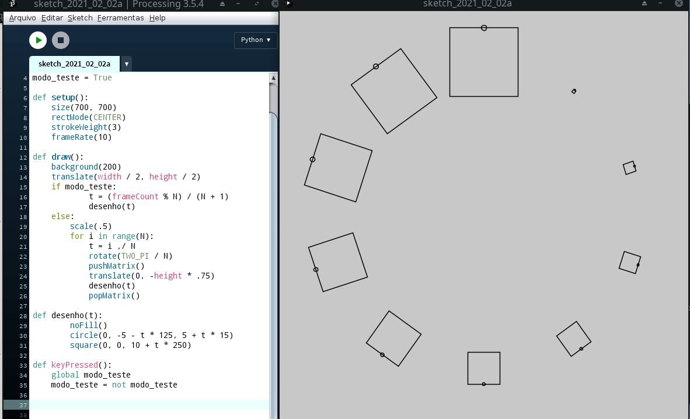

[sketch_2021_02_02a](https://github.com/villares/sketch-a-day/tree/master/2021/sketch_2021_02_02a) [[Py.Processing](https://villares.github.io/como-instalar-o-processing-modo-python/index-EN)]

---

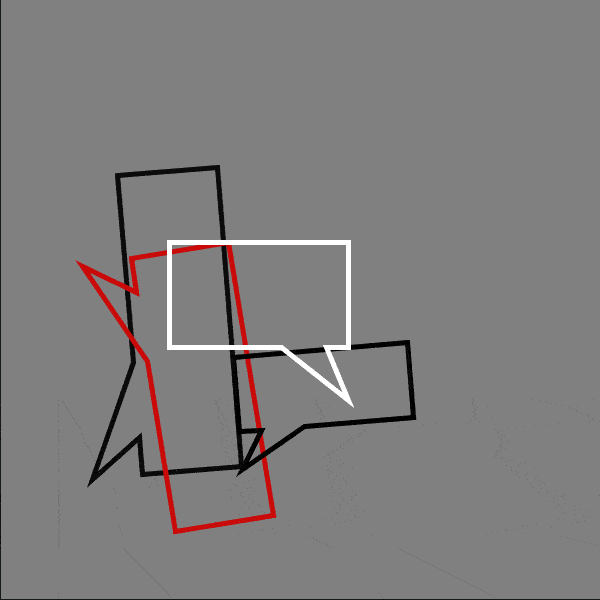

[sketch_2021_02_01a_baloes](https://github.com/villares/sketch-a-day/tree/master/2021/sketch_2021_02_01a_baloes) [[Py.Processing](https://villares.github.io/como-instalar-o-processing-modo-python/index-EN)]

---

[sketch_2021_01_31b](https://github.com/villares/sketch-a-day/tree/master/2021/sketch_2021_01_31b) [[Py.Processing](https://villares.github.io/como-instalar-o-processing-modo-python/index-EN)]

---

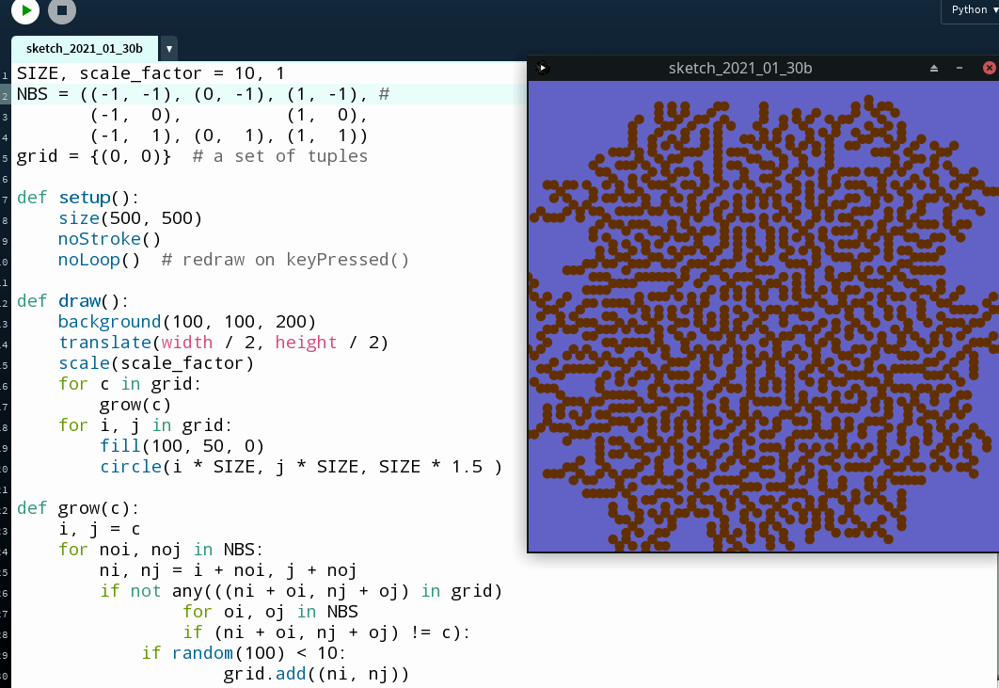

[sketch_2021_01_30b](https://github.com/villares/sketch-a-day/tree/master/2021/sketch_2021_01_30b) [[Py.Processing](https://villares.github.io/como-instalar-o-processing-modo-python/index-EN)]

---

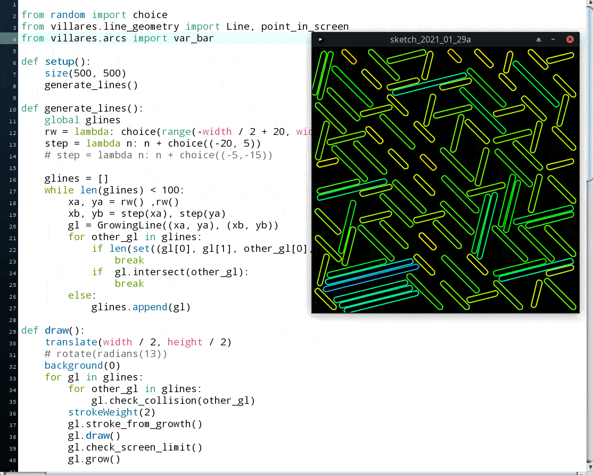

[sketch_2021_01_29a](https://github.com/villares/sketch-a-day/tree/master/2021/sketch_2021_01_28a) [[Py.Processing](https://villares.github.io/como-instalar-o-processing-modo-python/index-EN)]

---

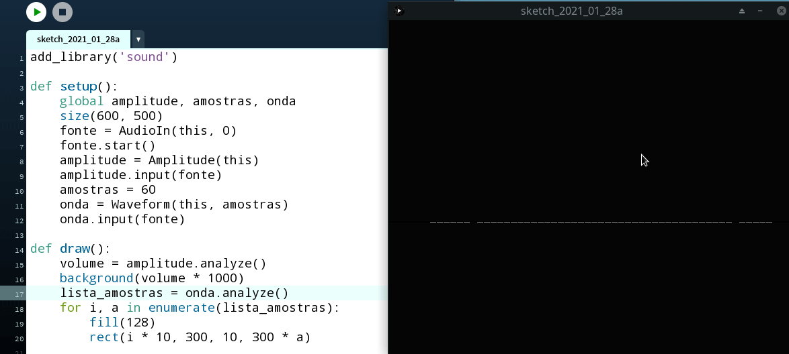

[sketch_2021_01_28a](https://github.com/villares/sketch-a-day/tree/master/2021/sketch_2021_01_28a) [[Py.Processing](https://villares.github.io/como-instalar-o-processing-modo-python/index-EN)]

---

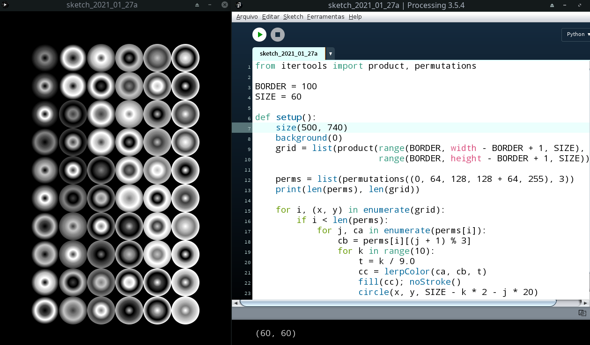

[sketch_2021_01_27a](https://github.com/villares/sketch-a-day/tree/master/2021/sketch_2021_01_27a) [[Py.Processing](https://villares.github.io/como-instalar-o-processing-modo-python/index-EN)]

---

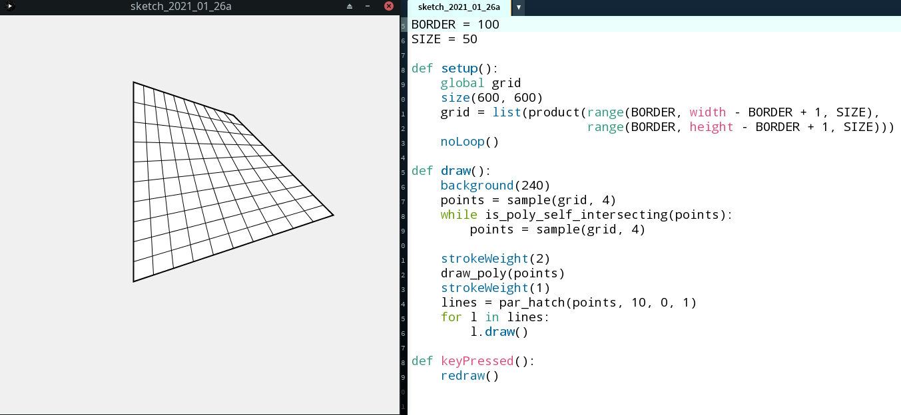

[sketch_2021_01_26a](https://github.com/villares/sketch-a-day/tree/master/2021/sketch_2021_01_26a) [[Py.Processing](https://villares.github.io/como-instalar-o-processing-modo-python/index-EN)]

---

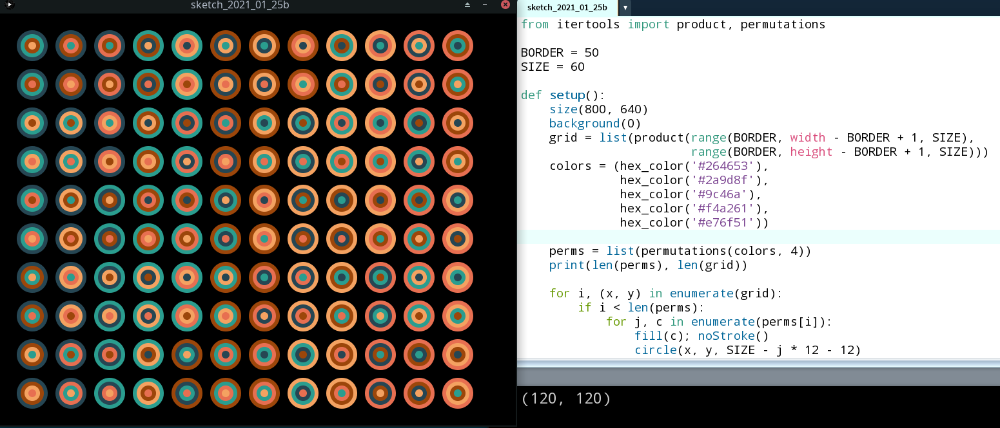

[sketch_2021_01_25b](https://github.com/villares/sketch-a-day/tree/master/2021/sketch_2021_01_25b) [[Py.Processing](https://villares.github.io/como-instalar-o-processing-modo-python/index-EN)]

---

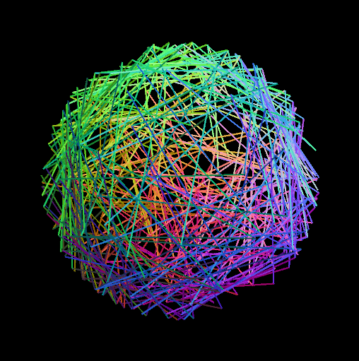

[sketch_2021_01_24c](https://github.com/villares/sketch-a-day/tree/master/2021/sketch_2021_01_24c) [[Py.Processing](https://villares.github.io/como-instalar-o-processing-modo-python/index-EN)]

---

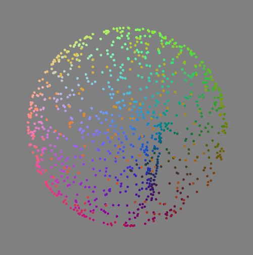

[sketch_2021_01_24b_sphere](https://github.com/villares/sketch-a-day/tree/master/2021/sketch_2021_01_24b_sphere) [[Py.Processing](https://villares.github.io/como-instalar-o-processing-modo-python/index-EN)]

---

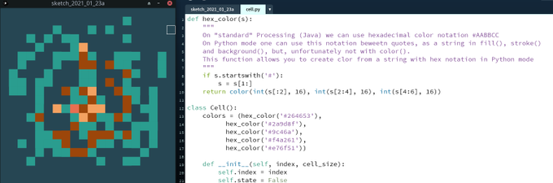

[sketch_2021_01_23a](https://github.com/villares/sketch-a-day/tree/master/2021/sketch_2021_01_23a) [[Py.Processing](https://villares.github.io/como-instalar-o-processing-modo-python/index-EN)]

---

[sketch_2021_01_22b_recursive_grid](https://github.com/villares/sketch-a-day/tree/master/2021/sketch_2021_01_22b_recursive_grid) [[Py.Processing](https://villares.github.io/como-instalar-o-processing-modo-python/index-EN)]

---

[sketch_2021_01_21a](https://github.com/villares/sketch-a-day/tree/master/2021/sketch_2021_01_21a) [[Py.Processing](https://villares.github.io/como-instalar-o-processing-modo-python/index-EN)]

---

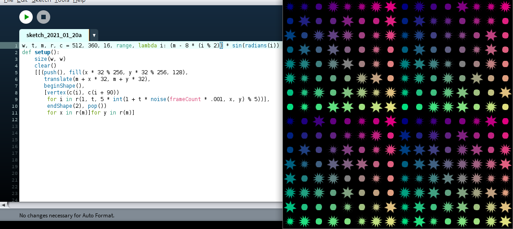

[sketch_2021_01_20a](https://github.com/villares/sketch-a-day/tree/master/2021/sketch_2021_01_20a) [[Py.Processing](https://villares.github.io/como-instalar-o-processing-modo-python/index-EN)]

---

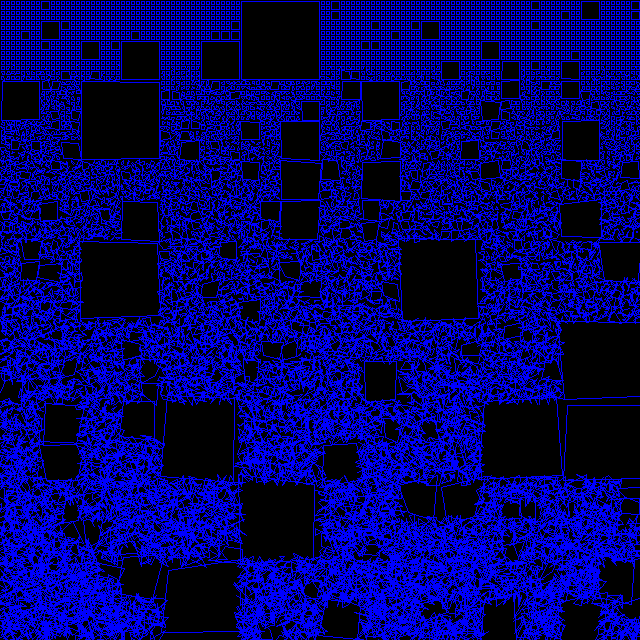
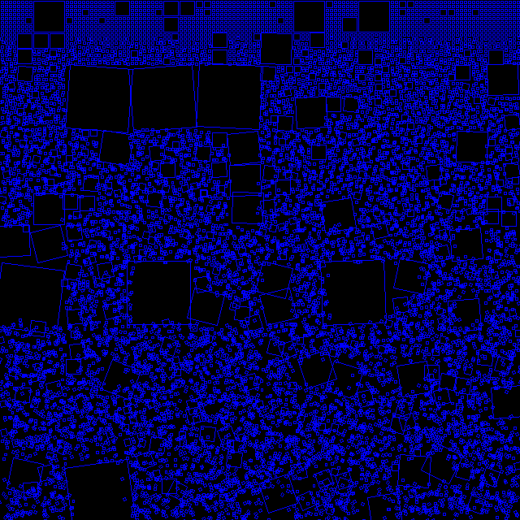

[sketch_2021_01_19a](https://github.com/villares/sketch-a-day/tree/master/2021/sketch_2021_01_19a) 
[sketch_2021_01_19b](https://github.com/villares/sketch-a-day/tree/master/2021/sketch_2021_01_19b) 
[[Py.Processing](https://villares.github.io/como-instalar-o-processing-modo-python/index-EN)]

---

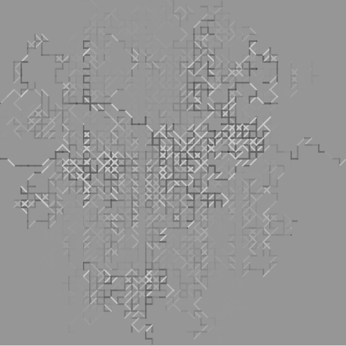

[sketch_2021_01_18a](https://github.com/villares/sketch-a-day/tree/master/2021/sketch_2021_01_18a) [[Py.Processing](https://villares.github.io/como-instalar-o-processing-modo-python/index-EN)]

---

[sketch_2021_01_17a](https://github.com/villares/sketch-a-day/tree/master/2021/sketch_2021_01_17a) [[Py.Processing](https://villares.github.io/como-instalar-o-processing-modo-python/index-EN)]

---

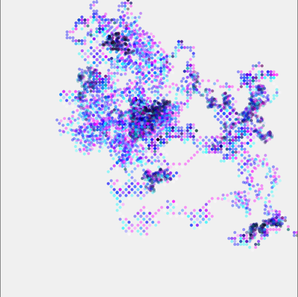

[sketch_2021_01_16a](https://github.com/villares/sketch-a-day/tree/master/2021/sketch_2021_01_16a) [[Py.Processing](https://villares.github.io/como-instalar-o-processing-modo-python/index-EN)]

---

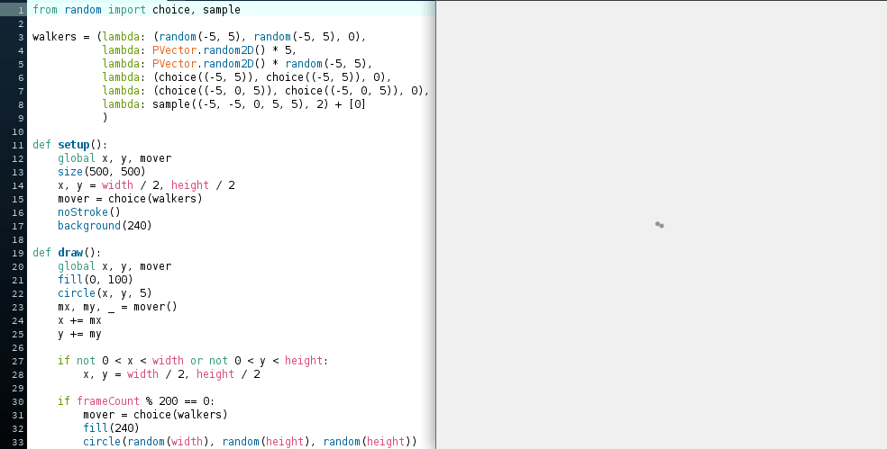

[sketch_2021_01_15a](https://github.com/villares/sketch-a-day/tree/master/2021/sketch_2021_01_15a) [[Py.Processing](https://villares.github.io/como-instalar-o-processing-modo-python/index-EN)]

 #genuary prompt: Let someone else decide the general rules of your piece.

@HenryJo20974294: "If you draw something, erase one part of it randomly"& 

@mgmalheiros: "Let the universe entropy (or its proxy, random() ) pick a few rule parts for you…"

---

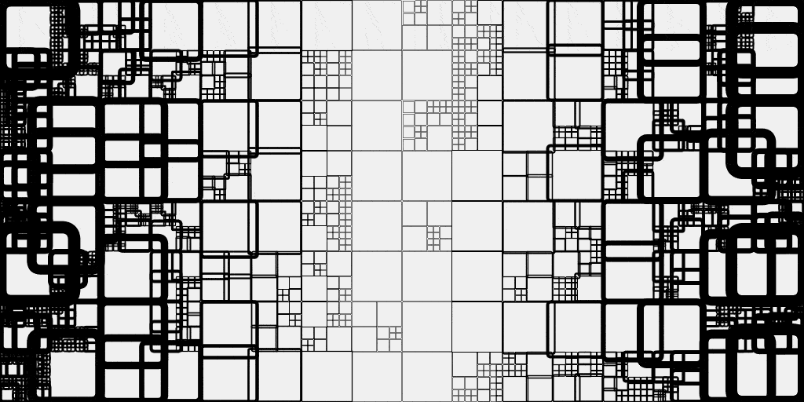

[sketch_2021_01_14c_recursive_grid](https://github.com/villares/sketch-a-day/tree/master/2021/sketch_2021_01_14c_recursive_grid) [[Py.Processing](https://villares.github.io/como-instalar-o-processing-modo-python/index-EN)]

---

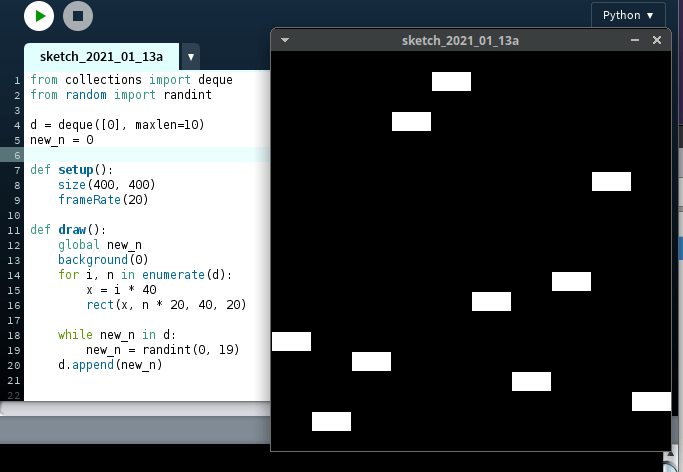

[sketch_2021_01_13a](https://github.com/villares/sketch-a-day/tree/master/2021/sketch_2021_01_13a) [[Py.Processing](https://villares.github.io/como-instalar-o-processing-modo-python/index-EN)]

---

[sketch_2021_01_12a](https://github.com/villares/sketch-a-day/tree/master/2021/sketch_2021_01_12a) [[Py.Processing](https://villares.github.io/como-instalar-o-processing-modo-python/index-EN)]

---

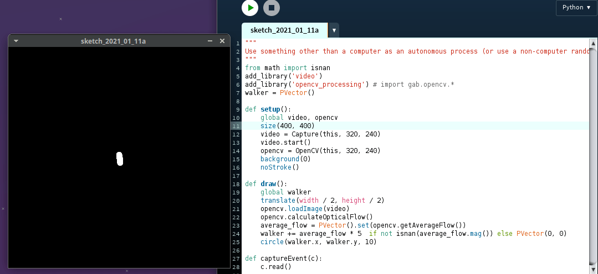

[sketch_2021_01_11a](https://github.com/villares/sketch-a-day/tree/master/2021/sketch_2021_01_11a) [[Py.Processing](https://villares.github.io/como-instalar-o-processing-modo-python/index-EN)]

---

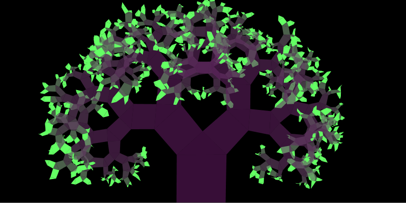

[sketch_2021_01_10a](https://github.com/villares/sketch-a-day/tree/master/2021/sketch_2021_01_10a) [[Py.Processing](https://villares.github.io/como-instalar-o-processing-modo-python/index-EN)]

---

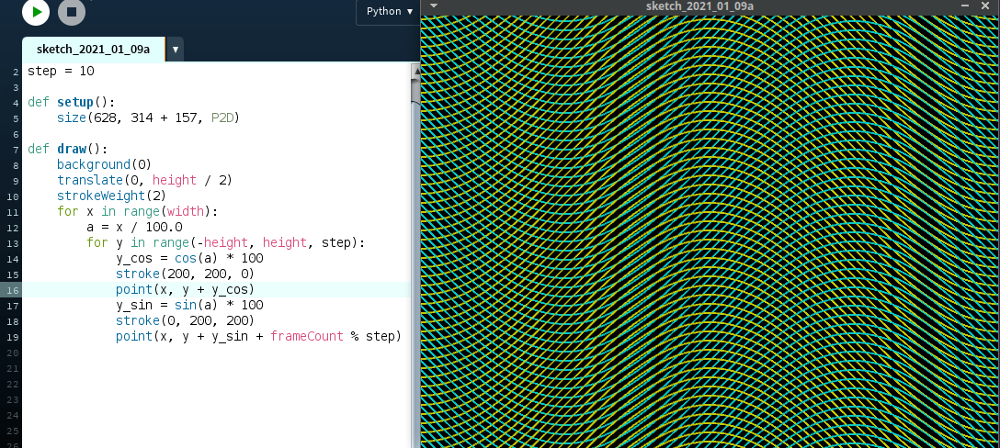

[sketch_2021_01_09a](https://github.com/villares/sketch-a-day/tree/master/2021/sketch_2021_01_09a) [[Py.Processing](https://villares.github.io/como-instalar-o-processing-modo-python/index-EN)]

---

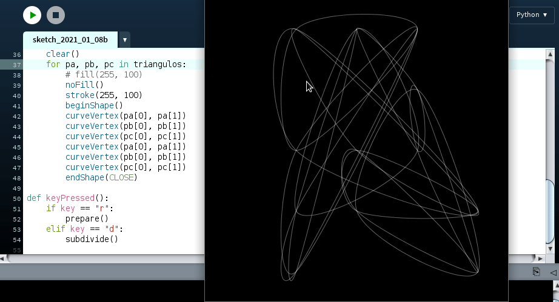

[sketch_2021_01_08b](https://github.com/villares/sketch-a-day/tree/master/2021/sketch_2021_01_08b) [[Py.Processing](https://villares.github.io/como-instalar-o-processing-modo-python/index-EN)]

---

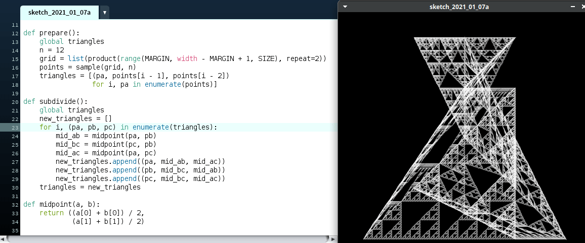

[sketch_2021_01_07a](https://github.com/villares/sketch-a-day/tree/master/2021/sketch_2021_01_07a) [[Py.Processing](https://villares.github.io/como-instalar-o-processing-modo-python/index-EN)]

---

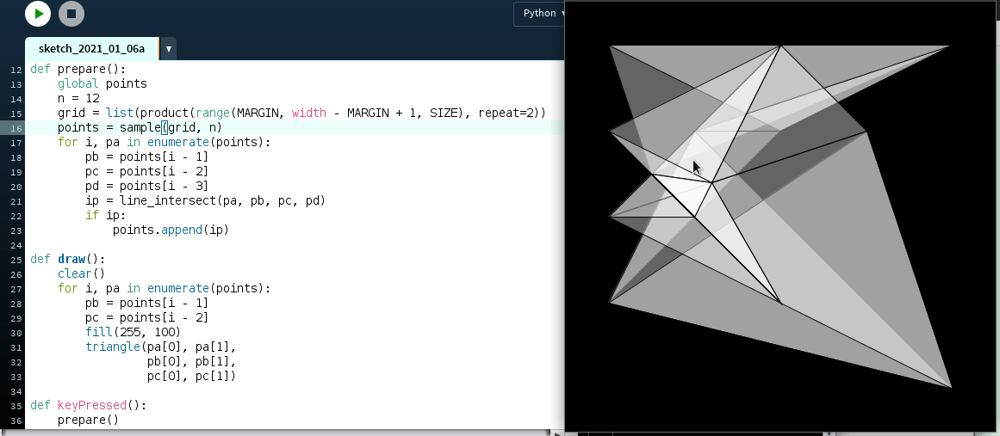

[sketch_2021_01_06a](https://github.com/villares/sketch-a-day/tree/master/2021/sketch_2021_01_06a) [[Py.Processing](https://villares.github.io/como-instalar-o-processing-modo-python/index-EN)]

---

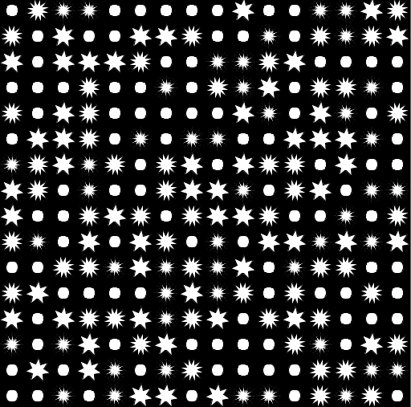

[sketch_2021_01_05a](https://github.com/villares/sketch-a-day/tree/master/2021/sketch_2021_01_05a) [[Py.Processing](https://villares.github.io/como-instalar-o-processing-modo-python/index-EN)]

---

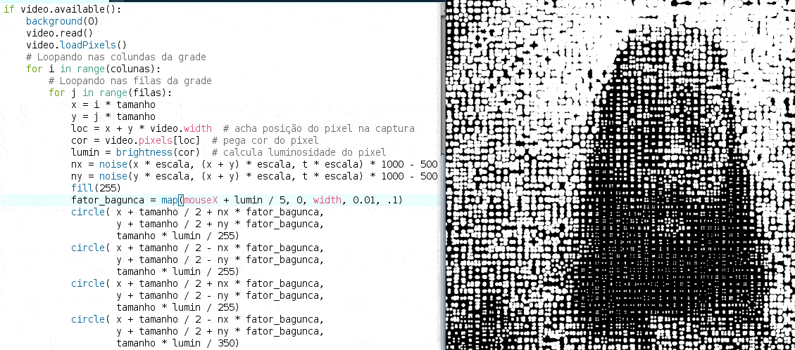

[sketch_2021_01_04d](https://github.com/villares/sketch-a-day/tree/master/2021/sketch_2021_01_04d) [[Py.Processing](https://villares.github.io/como-instalar-o-processing-modo-python/index-EN)]

---

[sketch_2021_01_03a](https://github.com/villares/sketch-a-day/tree/master/2021/sketch_2021_01_03a) [[Py.Processing](https://villares.github.io/como-instalar-o-processing-modo-python/index-EN)]

---

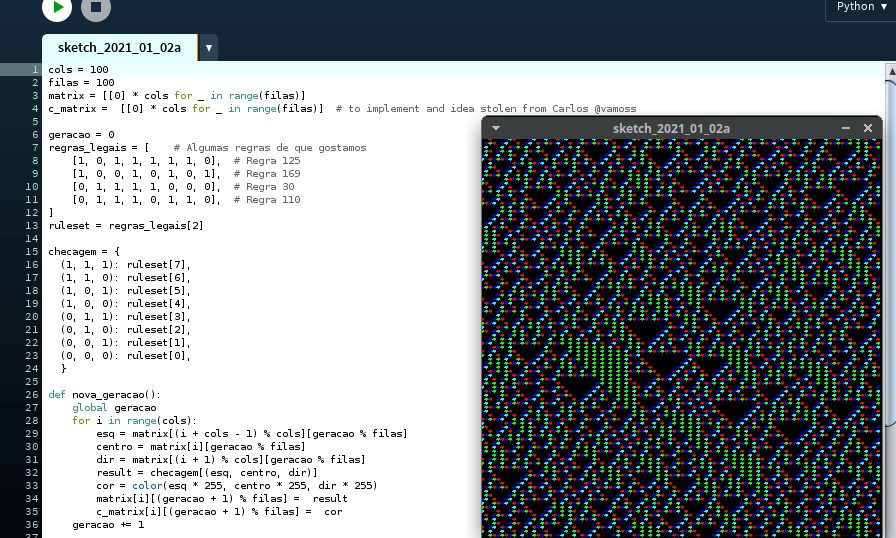

[sketch_2021_01_02a](https://github.com/villares/sketch-a-day/tree/master/2021/sketch_2021_01_02a) [[Py.Processing](https://villares.github.io/como-instalar-o-processing-modo-python/index-EN)]

---

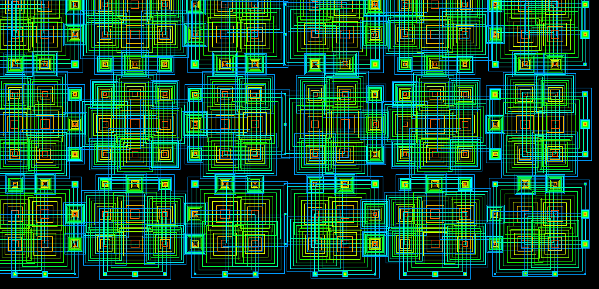

[sketch_2021_01_01a](https://github.com/villares/sketch-a-day/tree/master/2021/sketch_2021_01_01a) [[Py.Processing](https://villares.github.io/como-instalar-o-processing-modo-python/index-EN)]
