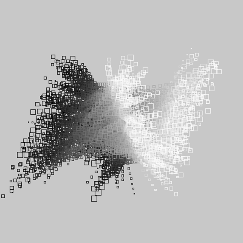
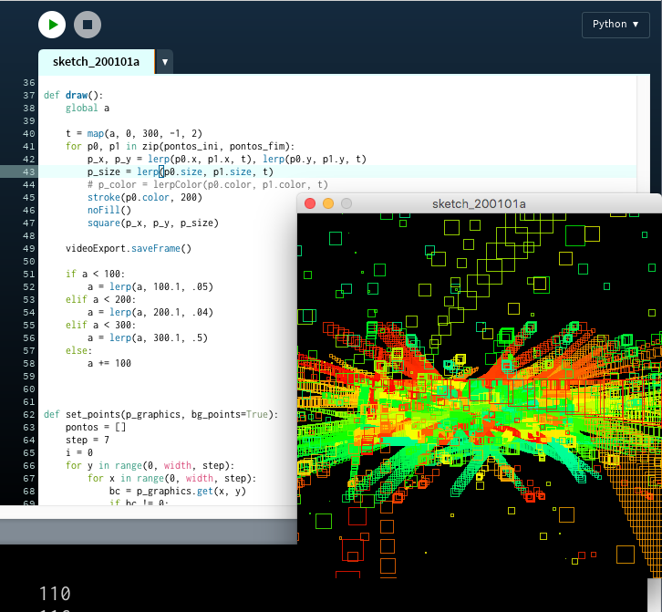

---
# sketch-a-day
#### one visual idea a day 

Hi! I'm [Alexandre](https://abav.lugaralgum.com), welcome! I try to make one small program (*sketch*) a day, and I usually put the code here: [github.com/villares/sketch-a-day](https://github.com/villares/sketch-a-day).

Feel free to [contact me](http://contato.lugaralgum.com) regarding licenses to use my work, teaching opportunities, consulting or other projects. Get updates from my newsletter: [[sketch-mail](https://abav.lugaralgum.com/sketch-mail)]

You may also support my artistic work, open educational resources and research using [Gumroad.com/villares](https://gumroad.com/villares) or [PayPal](https://www.paypal.com/cgi-bin/webscr?cmd=_s-xclick&hosted_button_id=HCGAKACDMVNV2)

## [2018](2018.md)

## [2019](2019.md)

## 2020

---


[sketch_2020_03_28a](https://github.com/villares/sketch-a-day/tree/master/2020/sketch_2020_03_28a) [[Py.Processing](https://villares.github.io/como-instalar-o-processing-modo-python/index-EN)]

```python
iterations = 7
stroke_len = 2600
angle_deg = 45
axiom = 'L'
sentence = axiom
rules = {
    'L': '+RF-LFL+',
    'R': '-LF+RFR-',
}
```

---


[sketch_2020_03_27a](https://github.com/villares/sketch-a-day/tree/master/2020/sketch_2020_03_27a) [[Py.Processing](https://villares.github.io/como-instalar-o-processing-modo-python/index-EN)]

```python
iterations = 7
stroke_len = 2600
angle_deg = 45
axiom = 'L'
sentence = axiom
rules = {
    'L': '+RF[-RFR]-FR+',
    'R': '-LF[+LFL]+FL-',
}
```

---


[sketch_2020_03_26a](https://github.com/villares/sketch-a-day/tree/master/2020/sketch_2020_03_26a) [[Py.Processing](https://villares.github.io/como-instalar-o-processing-modo-python/index-EN)]

```python
axiom = 'L'
sentence = axiom
rules = {
    'L': '+RF-LFL-FR+',
    'R': '-LF+RFR+FFL-', # broken Hilbert (added L)
}
```
---


[sketch_2020_03_25a](https://github.com/villares/sketch-a-day/tree/master/2020/sketch_2020_03_25a) [[Py.Processing](https://villares.github.io/como-instalar-o-processing-modo-python/index-EN)]

Based on [www.openprocessing.org/sketch/862451](https://www.openprocessing.org/sketch/862451)
by [@takawo](https://twitter.com/takawo)

---


[sketch_2020_03_24a](https://github.com/villares/sketch-a-day/tree/master/2020/sketch_2020_03_24a) [[Py.Processing](https://villares.github.io/como-instalar-o-processing-modo-python/index-EN)]

L-System with rules for a Hilbert Curve. Studies for Rosetta Code.

```
axiom = "L"
rules = {
    'L': '+RF-LFL-FR+',
    'R': '-LF+RFR+FL-',
}
```

---


[sketch_2020_03_23a](https://github.com/villares/sketch-a-day/tree/master/2020/sketch_2020_03_23a) [[Py.Processing](https://villares.github.io/como-instalar-o-processing-modo-python/index-EN)]

---


[sketch_2020_03_22a](https://github.com/villares/sketch-a-day/tree/master/2020/sketch_2020_03_21a) & [sketch_2020_03_22b](https://github.com/villares/sketch-a-day/tree/master/2020/sketch_2020_03_21b) [[Py.Processing](https://villares.github.io/como-instalar-o-processing-modo-python/index-EN)]

---


[sketch_2020_03_21a](https://github.com/villares/sketch-a-day/tree/master/2020/sketch_2020_03_21a) [[Py.Processing](https://villares.github.io/como-instalar-o-processing-modo-python/index-EN)]

---


[sketch_2020_03_20a](https://github.com/villares/sketch-a-day/tree/master/2020/sketch_2020_03_20a) [[Py.Processing](https://villares.github.io/como-instalar-o-processing-modo-python/index-EN)]

Not shuffled, my shuffled, shoebot shuffled

---


[sketch_2020_03_19a](https://github.com/villares/sketch-a-day/tree/master/2020/sketch_2020_03_19a) [[Py.Processing](https://villares.github.io/como-instalar-o-processing-modo-python/index-EN)]

Studies for a shuffled grid (I don't like/undertand the [shoebot shuffled grid](https://github.com/shoebot/shoebot/blob/752532e1d78b5474af435b2fdeea692737761b22/shoebot/grammar/bot.py))

```python
def shuffled_grid(cols, rows, colSize=1, rowSize=1):
    from random import shuffle
    sg = list(grid(cols, rows, colSize, rowSize))
    shuffle(sg)
    return sg

def grid(cols, rows, colSize=1, rowSize=1):
    """
    Returns an iterator that contains coordinate tuples.
    As seen in Shoebot & Nodebox (minus 'shuffled mode')
    A common way to use is:
    #    for x, y in grid(10, 10, 12, 12):
    #        rect(x, y, 10, 10)
    """
    rowRange = range(int(rows))
    colRange = range(int(cols))
    for y in rowRange:
        for x in colRange:
            yield (x * colSize, y * rowSize)

```

---


[sketch_2020_03_18a](https://github.com/villares/sketch-a-day/tree/master/2020/sketch_2020_03_18a) [[Py.Processing](https://villares.github.io/como-instalar-o-processing-modo-python/index-EN)]

Sin color diagonal made on my live coding streaming session :)

---


[sketch_2020_03_17a](https://github.com/villares/sketch-a-day/tree/master/2020/sketch_2020_03_17a) [[Py.Processing](https://villares.github.io/como-instalar-o-processing-modo-python/index-EN)]

PythagorasTree for Rosetta Code project https://rosettacode.org/wiki/Pythagoras_tree#Processing

---


[sketch_2020_03_16a](https://github.com/villares/sketch-a-day/tree/master/2020/sketch_2020_03_16a) [[Py.Processing](https://villares.github.io/como-instalar-o-processing-modo-python/index-EN)]

Draw a clock for Rosetta Code project https://rosettacode.org/wiki/Draw_a_clock#Processing

---


[sketch_2020_03_15a](https://github.com/villares/sketch-a-day/tree/master/2020/sketch_2020_03_15a) [[Py.Processing](https://villares.github.io/como-instalar-o-processing-modo-python/index-EN)]

ImageNoise for Rosetta Code project
https://rosettacode.org/wiki/Image_noise#Processing
---


[sketch_2020_03_14a](https://github.com/villares/sketch-a-day/tree/master/2020/sketch_2020_03_14a) [[Py.Processing](https://villares.github.io/como-instalar-o-processing-modo-python/index-EN)]

Archimedean spiral for Rosetta Code project https://rosettacode.org/wiki/Archimedean_spiral#Processing

---


[sketch_2020_03_13a](https://github.com/villares/sketch-a-day/tree/master/2020/sketch_2020_03_13a) [[Py.Processing](https://villares.github.io/como-instalar-o-processing-modo-python/index-EN)]

Zoomable Mandelbrot set for Rosetta Code project https://www.rosettacode.org/wiki/Mandelbrot_set#Processing

---


[sketch_2020_03_12a](https://github.com/villares/sketch-a-day/tree/master/2020/sketch_2020_03_12a) [[Py.Processing](https://villares.github.io/como-instalar-o-processing-modo-python/index-EN)]

Koch curve for Rosetta Code project https://www.rosettacode.org/wiki/Koch_curve#Processing

---


[sketch_2020_03_11a](https://github.com/villares/sketch-a-day/tree/master/2020/sketch_2020_03_11a) [[Py.Processing](https://villares.github.io/como-instalar-o-processing-modo-python/index-EN)]

Animation for Rosetta Code project https://rosettacode.org/wiki/Animation#Processing

---


[sketch_2020_03_10a](https://github.com/villares/sketch-a-day/tree/master/2020/sketch_2020_03_10a) [[Py.Processing](https://villares.github.io/como-instalar-o-processing-modo-python/index-EN)]

Dragon curve for Rosetta Code project https://rosettacode.org/wiki/Dragon_curve#Processing

---


[sketch_2020_03_09b](https://github.com/villares/sketch-a-day/tree/master/2020/sketch_2020_03_09b) [[Py.Processing](https://villares.github.io/como-instalar-o-processing-modo-python/index-EN)]

---


[sketch_2020_03_08b](https://github.com/villares/sketch-a-day/tree/master/2020/sketch_2020_03_08b) [[Py.Processing](https://villares.github.io/como-instalar-o-processing-modo-python/index-EN)]

---


[sketch_2020_03_07b](https://github.com/villares/sketch-a-day/tree/master/2020/sketch_2020_03_07b) [[Py.Processing](https://villares.github.io/como-instalar-o-processing-modo-python/index-EN)]

---


[sketch_2020_03_06a](https://github.com/villares/sketch-a-day/tree/master/2020/sketch_2020_03_06a) [[Py.Processing](https://villares.github.io/como-instalar-o-processing-modo-python/index-EN)]

---


[sketch_2020_03_05a](https://github.com/villares/sketch-a-day/tree/master/2020/sketch_2020_03_05a) [[Py.Processing](https://villares.github.io/como-instalar-o-processing-modo-python/index-EN)]

---


[sketch_2020_03_04a](https://github.com/villares/sketch-a-day/tree/master/2020/sketch_2020_03_04a) [[Py.Processing](https://villares.github.io/como-instalar-o-processing-modo-python/index-EN)]

---


[sketch_2020_03_03a](https://github.com/villares/sketch-a-day/tree/master/2020/sketch_2020_03_03a) [[Py.Processing](https://villares.github.io/como-instalar-o-processing-modo-python/index-EN)]

---


[sketch_2020_03_02a](https://github.com/villares/sketch-a-day/tree/master/2020/sketch_2020_03_02a) [[Py.Processing](https://villares.github.io/como-instalar-o-processing-modo-python/index-EN)]

---


[sketch_2020_03_01a](https://github.com/villares/sketch-a-day/tree/master/2020/sketch_2020_03_01a) [[Py.Processing](https://villares.github.io/como-instalar-o-processing-modo-python/index-EN)]

---


[sketch_2020_02_29a](https://github.com/villares/sketch-a-day/tree/master/2020/sketch_2020_02_29a) [[Py.Processing](https://villares.github.io/como-instalar-o-processing-modo-python/index-EN)]

---


[sketch_2020_02_28a](https://github.com/villares/sketch-a-day/tree/master/2020/sketch_2020_02_28a) [[Py.Processing](https://villares.github.io/como-instalar-o-processing-modo-python/index-EN)]

---


[sketch_2020_02_27a](https://github.com/villares/sketch-a-day/tree/master/2020/sketch_2020_02_27a) [[Py.Processing](https://villares.github.io/como-instalar-o-processing-modo-python/index-EN)]

Maybe this will be a game! Arrow hunter?

---


[sketch_2020_02_26a](https://github.com/villares/sketch-a-day/tree/master/2020/sketch_2020_02_26a) [[Py.Processing](https://villares.github.io/como-instalar-o-processing-modo-python/index-EN)]

---


[sketch_2020_02_25a](https://github.com/villares/sketch-a-day/tree/master/2020/sketch_2020_02_25a) [[Py.Processing](https://villares.github.io/como-instalar-o-processing-modo-python/index-EN)]

---


[sketch_2020_02_24a](https://github.com/villares/sketch-a-day/tree/master/2020/sketch_2020_02_24a) [[Py.Processing](https://villares.github.io/como-instalar-o-processing-modo-python/index-EN)]

---


[sketch_2020_02_23a](https://github.com/villares/sketch-a-day/tree/master/2020/sketch_2020_02_23a) [[Py.Processing](https://villares.github.io/como-instalar-o-processing-modo-python/index-EN)]

---


[sketch_2020_02_22a](https://github.com/villares/sketch-a-day/tree/master/2020/sketch_2020_02_22a) [[Py.Processing](https://villares.github.io/como-instalar-o-processing-modo-python/index-EN)]

---


[sketch_2020_02_21a](https://github.com/villares/sketch-a-day/tree/master/2020/sketch_2020_02_21a) [[Py.Processing](https://villares.github.io/como-instalar-o-processing-modo-python/index-EN)]

---


[sketch_2020_02_20a](https://github.com/villares/sketch-a-day/tree/master/2020/sketch_2020_02_20a) [[Py.Processing](https://villares.github.io/como-instalar-o-processing-modo-python/index-EN)]

---


[sketch_2020_02_19a](https://github.com/villares/sketch-a-day/tree/master/2020/sketch_2020_02_19a) [[Py.Processing](https://villares.github.io/como-instalar-o-processing-modo-python/index-EN)]

---


[sketch_2020_02_18a](https://github.com/villares/sketch-a-day/tree/master/2020/sketch_2020_02_18a) [[Py.Processing](https://villares.github.io/como-instalar-o-processing-modo-python/index-EN)]

---


[sketch_2020_02_17b](https://github.com/villares/sketch-a-day/tree/master/2020/sketch_2020_02_17b) [[Py.Processing](https://villares.github.io/como-instalar-o-processing-modo-python/index-EN)]

---


[sketch_2020_02_16b](https://github.com/villares/sketch-a-day/tree/master/2020/sketch_2020_02_16b) [[Py.Processing](https://villares.github.io/como-instalar-o-processing-modo-python/index-EN)]

---


[sketch_2020_02_15a](https://github.com/villares/sketch-a-day/tree/master/2020/sketch_2020_02_15a) [[Py.Processing](https://villares.github.io/como-instalar-o-processing-modo-python/index-EN)]

---


[sketch_2020_02_14a](https://github.com/villares/sketch-a-day/tree/master/2020/sketch_2020_02_14a) [[Py.Processing](https://villares.github.io/como-instalar-o-processing-modo-python/index-EN)]

---


[sketch_2020_02_13a](https://github.com/villares/sketch-a-day/tree/master/2020/sketch_2020_02_13a) [[Py.Processing](https://villares.github.io/como-instalar-o-processing-modo-python/index-EN)]

---


[sketch_2020_02_12a](https://github.com/villares/sketch-a-day/tree/master/2020/sketch_2020_02_12a) [[Py.Processing](https://villares.github.io/como-instalar-o-processing-modo-python/index-EN)]

---


[sketch_2020_02_11a](https://github.com/villares/sketch-a-day/tree/master/2020/sketch_2020_02_11a) [[Py.Processing](https://villares.github.io/como-instalar-o-processing-modo-python/index-EN)]

---


[sketch_2020_02_10a](https://github.com/villares/sketch-a-day/tree/master/2020/sketch_2020_02_10a) [[Py.Processing](https://villares.github.io/como-instalar-o-processing-modo-python/index-EN)]

---


[sketch_2020_02_09a](https://github.com/villares/sketch-a-day/tree/master/2020/sketch_2020_02_09a) [[Py.Processing](https://villares.github.io/como-instalar-o-processing-modo-python/index-EN)]

---


[sketch_2020_02_08a](https://github.com/villares/sketch-a-day/tree/master/2020/sketch_2020_02_08a) [[Py.Processing](https://villares.github.io/como-instalar-o-processing-modo-python/index-EN)]

---


[sketch_2020_02_07a](https://github.com/villares/sketch-a-day/tree/master/2020/sketch_2020_02_07a) [[Py.Processing](https://villares.github.io/como-instalar-o-processing-modo-python/index-EN)]

---


[sketch_2020_02_06a](https://github.com/villares/sketch-a-day/tree/master/2020/sketch_2020_02_06a) [[Py.Processing](https://villares.github.io/como-instalar-o-processing-modo-python/index-EN)]

---


[sketch_2020_02_05b](https://github.com/villares/sketch-a-day/tree/master/2020/sketch_2020_02_05b) [[Py.Processing](https://villares.github.io/como-instalar-o-processing-modo-python/index-EN)]

---


[sketch_2020_02_04c](https://github.com/villares/sketch-a-day/tree/master/2020/sketch_2020_02_04c) [[Py.Processing](https://villares.github.io/como-instalar-o-processing-modo-python/index-EN)]

---


[sketch_2020_02_03a](https://github.com/villares/sketch-a-day/tree/master/2020/sketch_2020_02_03a) [[Py.Processing](https://villares.github.io/como-instalar-o-processing-modo-python/index-EN)]

---


[sketch_2020_02_02a](https://github.com/villares/sketch-a-day/tree/master/2020/sketch_2020_02_02a) [[Py.Processing](https://villares.github.io/como-instalar-o-processing-modo-python/index-EN)]

---


[sketch_2020_02_01a](https://github.com/villares/sketch-a-day/tree/master/2020/sketch_2020_02_01a) [[Py.Processing](https://villares.github.io/como-instalar-o-processing-modo-python/index-EN)]

- Number of possible triangles on 3x3 grid: 76
- Number of 2-triangle combinations: 2850
- Combinations without overlapping points: 686
- Each position then has 2 additional interpolated triangles (between the chosen 2-triangle combination)
- Cols: 49 Rows: 14

---


[sketch_2020_01_31a](https://github.com/villares/sketch-a-day/tree/master/2020/sketch_2020_01_31a) [[Py.Processing](https://villares.github.io/como-instalar-o-processing-modo-python/index-EN)]

- Number of possible triangles on a 4x4 grid: 516
- Cols: 43 Rows: 12

---


[sketch_2020_01_30a](https://github.com/villares/sketch-a-day/tree/master/2020/sketch_2020_01_30a) [[Py.Processing](https://villares.github.io/como-instalar-o-processing-modo-python/index-EN)]

---


[sketch_2020_01_29a](https://github.com/villares/sketch-a-day/tree/master/2020/sketch_2020_01_29a) [[Py.Processing](https://villares.github.io/como-instalar-o-processing-modo-python/index-EN)]

---


[sketch_2020_01_28a](https://github.com/villares/sketch-a-day/tree/master/2020/sketch_2020_01_28a) [[Py.Processing](https://villares.github.io/como-instalar-o-processing-modo-python/index-EN)]

---


[sketch_2020_01_27a](https://github.com/villares/sketch-a-day/tree/master/2020/sketch_2020_01_27a) [[Py.Processing](https://villares.github.io/como-instalar-o-processing-modo-python/index-EN)]

---


[sketch_2020_01_26a](https://github.com/villares/sketch-a-day/tree/master/2020/sketch_2020_01_26a) [[Py.Processing](https://villares.github.io/como-instalar-o-processing-modo-python/index-EN)]

---


[sketch_2020_01_25a](https://github.com/villares/sketch-a-day/tree/master/2020/sketch_2020_01_25a) [[Py.Processing](https://villares.github.io/como-instalar-o-processing-modo-python/index-EN)]

---


[sketch_2020_01_24a](https://github.com/villares/sketch-a-day/tree/master/2020/sketch_2020_01_24a) [[Py.Processing](https://villares.github.io/como-instalar-o-processing-modo-python/index-EN)]

---


[sketch_2020_01_23a](https://github.com/villares/sketch-a-day/tree/master/2020/sketch_2020_01_23a) [[Py.Processing](https://villares.github.io/como-instalar-o-processing-modo-python/index-EN)]

---


[sketch_2020_01_22a](https://github.com/villares/sketch-a-day/tree/master/2020/sketch_2020_01_22a) [[Py.Processing](https://villares.github.io/como-instalar-o-processing-modo-python/index-EN)]

---


[sketch_2020_01_21a](https://github.com/villares/sketch-a-day/tree/master/2020/sketch_2020_01_21a) [[Py.Processing](https://villares.github.io/como-instalar-o-processing-modo-python/index-EN)]

---


[sketch_2020_01_20a](https://github.com/villares/sketch-a-day/tree/master/2020/sketch_2020_01_20a) [[Py.Processing](https://villares.github.io/como-instalar-o-processing-modo-python/index-EN)]

---


[sketch_2020_01_19a](https://github.com/villares/sketch-a-day/tree/master/2020/sketch_2020_01_19a) [[Py.Processing](https://villares.github.io/como-instalar-o-processing-modo-python/index-EN)]

---


[sketch_2020_01_18c](https://github.com/villares/sketch-a-day/tree/master/2020/sketch_2020_01_18c) [[Py.Processing](https://villares.github.io/como-instalar-o-processing-modo-python/index-EN)]

---


[sketch_2020_01_17b](https://github.com/villares/sketch-a-day/tree/master/2020/sketch_2020_01_17b) [[Py.Processing](https://villares.github.io/como-instalar-o-processing-modo-python/index-EN)]

---


[sketch_2020_01_16b](https://github.com/villares/sketch-a-day/tree/master/2020/sketch_2020_01_16b) [[Py.Processing](https://villares.github.io/como-instalar-o-processing-modo-python/index-EN)]

---


[sketch_2020_01_15a](https://github.com/villares/sketch-a-day/tree/master/2020/sketch_2020_01_15a) [[Py.Processing](https://villares.github.io/como-instalar-o-processing-modo-python/index-EN)]

---


[sketch_2020_01_14a](https://github.com/villares/sketch-a-day/tree/master/2020/sketch_2020_01_14a) [[Py.Processing](https://villares.github.io/como-instalar-o-processing-modo-python/index-EN)]

---


[sketch_2020_01_13a](https://github.com/villares/sketch-a-day/tree/master/2020/sketch_2020_01_13a) [[Py.Processing](https://villares.github.io/como-instalar-o-processing-modo-python/index-EN)]

---


[sketch_2020_01_12a](https://github.com/villares/sketch-a-day/tree/master/2020/sketch_2020_01_12a) [[Py.Processing](https://villares.github.io/como-instalar-o-processing-modo-python/index-EN)]

---


[sketch_2020_01_11a](https://github.com/villares/sketch-a-day/tree/master/2020/sketch_2020_01_11a) [[Py.Processing](https://villares.github.io/como-instalar-o-processing-modo-python/index-EN)]

---


[sketch_2020_01_10a](https://github.com/villares/sketch-a-day/tree/master/2020/sketch_2020_01_10a) [[Py.Processing](https://villares.github.io/como-instalar-o-processing-modo-python/index-EN)]

---


[sketch_2020_01_09a](https://github.com/villares/sketch-a-day/tree/master/2020/sketch_2020_01_09a) [[Py.Processing](https://villares.github.io/como-instalar-o-processing-modo-python/index-EN)]

---


[sketch_2020_01_08f](https://github.com/villares/sketch-a-day/tree/master/2020/sketch_2020_01_08f) [[Py.Processing](https://villares.github.io/como-instalar-o-processing-modo-python/index-EN)]

---


[sketch_2020_01_07c](https://github.com/villares/sketch-a-day/tree/master/2020/sketch_2020_01_07c) [[Py.Processing](https://villares.github.io/como-instalar-o-processing-modo-python/index-EN)]

---


[sketch_2020_01_06b](https://github.com/villares/sketch-a-day/tree/master/2020/sketch_2020_01_06b) [[Py.Processing](https://villares.github.io/como-instalar-o-processing-modo-python/index-EN)]

---


[sketch_200105a](https://github.com/villares/sketch-a-day/tree/master/2020/sketch_200105a) [[Py.Processing](https://villares.github.io/como-instalar-o-processing-modo-python/index-EN)]

---



[sketch_200104b](https://github.com/villares/sketch-a-day/tree/master/2020/sketch_200104b) [[Py.Processing](https://villares.github.io/como-instalar-o-processing-modo-python/index-EN)]

---


[sketch_200103b](https://github.com/villares/sketch-a-day/tree/master/2020/sketch_200103b) [[Py.Processing](https://villares.github.io/como-instalar-o-processing-modo-python/index-EN)]

---


[sketch_200102a](https://github.com/villares/sketch-a-day/tree/master/2020/sketch_200102a) [[Py.Processing](https://villares.github.io/como-instalar-o-processing-modo-python/index-EN)]

---



[sketch_200101a](https://github.com/villares/sketch-a-day/tree/master/2020/sketch_200101a) [[Py.Processing](https://villares.github.io/como-instalar-o-processing-modo-python/index-EN)]

---
